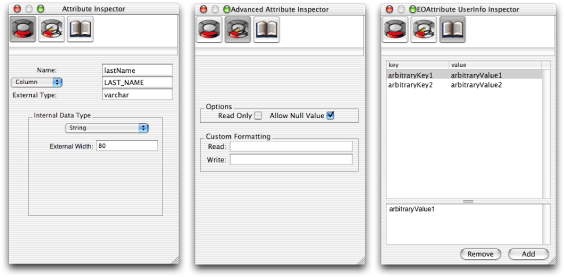
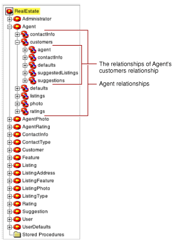
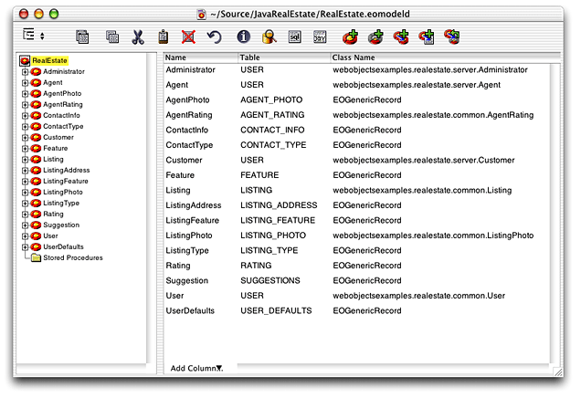
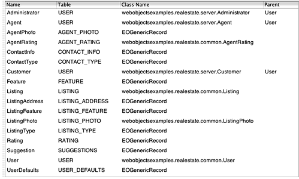
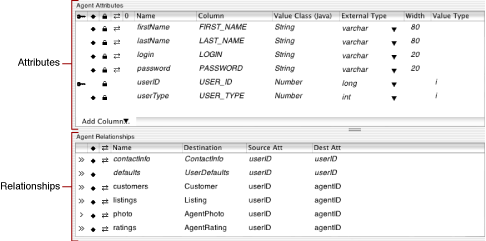
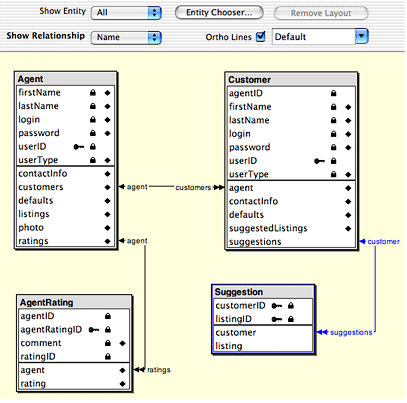
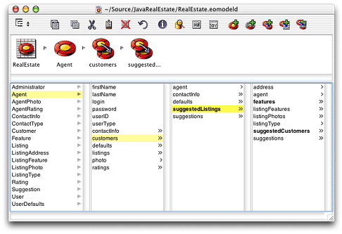

> 导航：[总目录](../../../README.md) · [documentation](../../../_indexes/documentation.md) · [EOModeler User Guide](Introduction%20to%20EOModeler%20User%20Guide.md)

[Next](Working%20With%20Attributes.md)[Previous](Data%20Modeling%20and%20EOModeler.md)

# Using EOModeler

This chapter describes the basic views and major user interface elements of EOModeler. It’s organized in the following sections:

- [Editing Views](#apple-f4xwc4dqnrsv64tfmyxwi33df52wszbpkridgmbqgaytamjyfvbuqmrqgmwugq2iijaueqsh) introduces the various editors in EOModeler.
- [The Tree View](#apple-f4xwc4dqnrsv64tfmyxwi33df52wszbpkridgmbqgaytamjyfvbuqmrqgmwueqkcizdegrcb) describes how to navigate a model’s entities and relationships in the tree view.
- [Table Mode](#apple-f4xwc4dqnrsv64tfmyxwi33df52wszbpkridgmbqgaytamjyfvbuqmrqgmwueqkcinfeer2f), [Diagram View](#apple-f4xwc4dqnrsv64tfmyxwi33df52wszbpkridgmbqgaytamjyfvbuqmrqgmwviucykjcummjsgy), and [Browser Mode](#apple-f4xwc4dqnrsv64tfmyxwi33df52wszbpkridgmbqgaytamjyfvbuqmrqgmwviucykjcummjsg4) discuss the three main editing views.

There are a number of different editors in EOModeler. Of these, there are three main views that you spend most time in. Each is appropriate for different uses:

- __Table mode__ is appropriate for making basic changes to attributes and attribute characteristics. It is also the view in which you define custom class names for entities.
- __Browser mode__ is appropriate for traversing relationship paths and for flattening attributes and relationships.
- __Diagram view__ is appropriate for forming relationships between entities and changing certain attribute characteristics. It also provides a graphical view of all a model’s elements, including the relationships between entities.

You can switch between display modes with the Change Display View pop-up menu in the toolbar or by choosing Diagram View, Browser Mode, or Table Mode from the Tools menu.

In addition to these views, EOModeler includes a dynamic inspector that changes depending on the element selected. When you select an entity, for example, the inspector becomes the Entity Inspector. Likewise, when you select an attribute, the inspector becomes the Attribute Inspector. Whereas the three main views allow you to edit basic characteristics of a model’s elements, an element’s inspector provides an interface to configure every characteristic of a particular element.

The inspector for each element itself includes multiple panes. Every selected element has at least three inspector panes: the basic inspector, an Advanced Inspector, and a UserInfo Inspector. Entities have two additional panes: the Stored Procedures Inspector and the Shared Objects Inspector. Figure 2-1 shows the three panes in the inspector when an attribute is selected.

__Figure 2-1__  An attribute’s inspector panes

You use the UserInfo Inspector to add key-value pairs to the UserInfo dictionary. This dictionary provides a mechanism for extending your model. You can use it to define custom behavior for an entity or, more commonly, to add meta-information to a model, an entity, or an attribute. Advanced users sometimes use the UserInfo dictionary when using custom delegates in the access layer.

You navigate a model by selecting entities in the editor’s tree view. The root element of the tree view represents the whole model. You can double-click the root element to expand and contract the tree view. When the tree view is expanded, it shows the model’s entities. The tree view is always visible in table mode and in diagram view. It is not available in browser mode.

You can also expand and contract a model’s entities and stored procedures. Expanding an entity displays the entity’s relationships, as shown in Figure 2-2. A relationship in the tree view represents the relationship’s destination entity. You can continue to expand the relationship in the tree view to display the destination entity’s relationships. Expanding the Stored Procedures folder displays the model’s stored procedures.

__Figure 2-2__  Tree view with an expanded entity

The tree view is also useful when performing drag-and-drop operations, such as when dragging an entity or relationship into WebObjects Builder or into Interface Builder. See the tutorials in the books _Inside WebObjects: Web Applications_ and _Inside WebObjects: Java Client Desktop Applications_ for more information.

The default view mode in EOModeler is table mode. In this mode, EOModeler displays a tree view for viewing a model’s entities and relationships within those entities, and a table view whose contents change depending on what’s selected in the tree view. You can use table mode to edit many characteristics of entities or of an entity’s attributes.

When the root of the tree view is selected, the table view displays the classes with which each entity is associated. When a particular entity is selected in the tree view, the table view changes to display that entity’s attributes and relationships.

__Figure 2-3__  Table mode with the entire model selected

If you switch to another view mode, you can always return to table mode by choosing Table Mode from the Tools menu.

Figure 2-4 shows the table view when the root of the tree view is selected (the root is the name of the model file). The model’s entities are displayed, one per row. The columns of the table display information about each entity: the classes with which each entity is associated, whether the entity is read-only, the name of each entity’s corresponding database table, and so on.

__Figure 2-4__  A model’s components in table mode

When an entity is selected in the tree view, the table view displays that entity’s attributes and relationships, as shown in Figure 2-5. The attributes shown in Figure 2-5 are displayed in italics to indicate that they are inherited from a parent entity. Inheritance is an advanced modeling technique that is discussed in [Modeling Inheritance](Modeling%20Inheritance.md#apple-f4xwc4dqnrsv64tfmyxwi33df52wszbpkridgmbqgaytamjyfvbuqmrqg4wviubr).

The External Type column represents the data type of the attribute in the data source, such as `varchar`, `long`, and `int`. The Value Class (Java) column represents the object type used when the column is mapped to an enterprise object’s attribute. The Value Type column represents how the model’s JDBC adaptor plug-in more specifically deals with different object types. See [Value Type](Working%20With%20Attributes.md#apple-f4xwc4dqnrsv64tfmyxwi33df52wszbpkridgmbqgaytamjyfvbuqmrqgqwueqkcizdukq2f) for more details.

__Figure 2-5__  An entity’s attributes and relationships

The information you see in the table view when an entity is selected in the tree view depends on the columns visible in the table view. You can add columns by selecting one from the Add Column pop-up menu in the table view. When you add a column to the table, the corresponding menu item is removed from the Add Column pop-up menu. You can remove columns from the table view by selecting a column header and pressing Delete.

In diagram view, you see a visual representation of your model’s entities, their attributes, and most important, the relationships between entities, as shown in Figure 2-6. As with table mode, you can use the diagram view to edit components of the model (such as changing attribute names and assigning primary keys to entities) but its editing capabilities are more limited. Diagram view is also useful for printing models.

__Figure 2-6__  Diagram view

In this view, you can specify which entities are displayed, what kind of attributes are displayed (such as primary keys, class properties, or relationships), and what kind of information about the model’s relationships is displayed (such as optionality and propagate primary key) by using the options at the top of the view.

You can also use diagram view to create relationships between entities. By Control-dragging from one relationship key to another, diagram view creates relationships between two entities. Forming relationships this way creates two relationships: one from the source entity to the destination entity and an inverse relationship between the two entities.

The browser mode is useful for traversing an entity’s relationships and also for creating flattened attributes and relationships within an entity. To display the attributes for a particular entity, select the entity in the left-most column while in browser mode. The attributes of that entity then appear in the column to the right of the entity along with the entity’s relationships.

Figure 2-7 shows the browser mode traversing the Agent entity, the `customers` relationship in the Agent entity, and the `suggestedListings` flattened relationship in the Customers entity (which is the destination of Agent’s `customers` relationship).

__Figure 2-7__  Browser mode

[Next](Working%20With%20Attributes.md)[Previous](Data%20Modeling%20and%20EOModeler.md)

