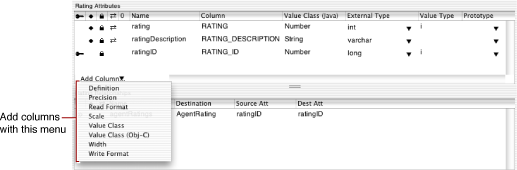
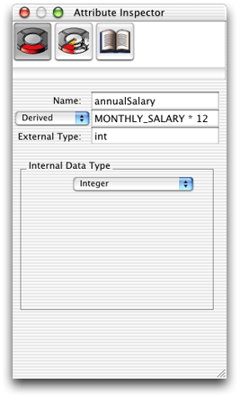
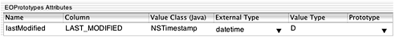
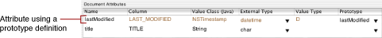
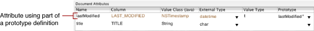
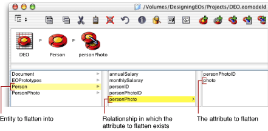
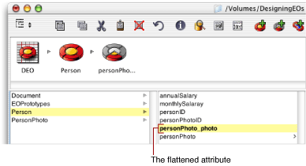
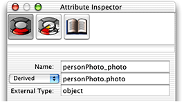

> 导航：[总目录](../../../README.md) · [documentation](../../../_indexes/documentation.md) · [EOModeler User Guide](Introduction%20to%20EOModeler%20User%20Guide.md)

[Next](Working%20With%20Relationships.md)[Previous](Using%20EOModeler.md)

# Working With Attributes

This chapter is divided into the following sections:

- [Attribute Characteristics](#apple-f4xwc4dqnrsv64tfmyxwi33df52wszbpkridgmbqgaytamjyfvbuqmrqgqwueqkcireuqrkc) describes all the possible characteristics attributes can have, including value class, value type, and read and write formats. It also describes how to edit each characteristic.
- [More About Attribute Characteristics](#apple-f4xwc4dqnrsv64tfmyxwi33df52wszbpkridgmbqgaytamjyfvbuqmrqgqwueqkcijcueqkj) provides more detail on certain characteristics like class property, locking, definition (derived attributes), and primary key.
- [Prototype Attributes](#apple-f4xwc4dqnrsv64tfmyxwi33df52wszbpkridgmbqgaytamjyfvbuqmrqgqwueqkcjjeugrsj) discusses what prototype attributes are, how to create them, and how to assign them to attributes.
- [Flattened Attributes](#apple-f4xwc4dqnrsv64tfmyxwi33df52wszbpkridgmbqgaytamjyfvbuqmrqgqwueqkci5dukrsb) discusses when and how to flatten attributes.

EOModeler provides three mechanisms for viewing and modifying an entity’s attributes: the table mode of the model editor, the diagram view of the model editor, and the Attribute Inspector. You can use any of the mechanisms to examine the characteristics of your model’s attributes and to make refinements. Each has advantages over the other and is useful in different circumstances.

To display an entity’s attributes in table mode, select an entity in the tree view. Figure 3-1 shows the attributes of an entity called Rating.

__Figure 3-1__  An entity’s attributes

Each table column corresponds to a single characteristic of the attribute, such as its name, external type, or precision. By default, the columns included in this view represent only a subset of possible characteristics you can set for a given attribute. To add columns for additional characteristics, you use the Add Column pop-up menu in the lower-left corner of the table, as shown in Figure 3-1. You can also resize and rearrange columns in the table.

Table 4-1 describes the characteristics you can set for an attribute. Unless otherwise specified, the instructions are for editing the characteristic in the model editor’s table mode. Some of the characteristics are described in more detail in the cross-referenced sections.

__Table 3-1__  Attribute characteristic definitions

| Characteristic | What it is | How you modify it |
| Allows Null | Indicates whether the attribute can have a `null` value. See [Allows Null](#apple-f4xwc4dqnrsv64tfmyxwi33df52wszbpkridgmbqgaytamjyfvbuqmrqgqwviucykjcummjsg4). | Click in the column with the checkmark to toggle the option on and off. You can also edit this characteristic in the Attribute Inspector. |
| Class Property | Indicates that you want to include the attribute in your Enterprise Object classes. See [Class Property](#apple-f4xwc4dqnrsv64tfmyxwi33df52wszbpkridgmbqgaytamjyfvbuqmrqgqwviucykjcummjsha). | Click in the diamond column to toggle the option on and off. You can also edit this characteristic in diagram view. |
| Client-Side Class Property | Indicates that you want to include the attribute in your Enterprise Object classes that live on the client side of Java Client applications. See [Client-Side Class Property](#apple-f4xwc4dqnrsv64tfmyxwi33df52wszbpkridgmbqgaytamjyfvbuqmrqgqwviucykjcummjshe). | Click in the column with the two opposing arrows to toggle the option on and off. |
| Column | The name of the column in the data source that corresponds to the attribute. | Edit the table cell. |
| Definition | The SQL definition for a derived attribute. Note that Column and Definition are mutually exclusive; you can’t set both. Setting one clears the other. See [Definition (Derived Attributes)](#apple-f4xwc4dqnrsv64tfmyxwi33df52wszbpkridgmbqgaytamjyfvbuqmrqgqwviucykjcummjtga). | Edit the table cell. |
| External Type | The data type of the attribute as it’s understood by the data source. | Choose a value from the pop-up menu. |
| Locking | Indicates whether an attribute participates in optimistic locking. See [Locking](#apple-f4xwc4dqnrsv64tfmyxwi33df52wszbpkridgmbqgaytamjyfvbuqmrqgqwueqkcijcekskf). | Click in the pad-lock column to toggle locking off and on for a particular attribute. You can also edit this characteristic in diagram view. |
| Name | The name of the attribute as it appears in your application and in your enterprise objects. EOModeler derives a default name based on the corresponding column in the data source which you can edit if necessary. | Edit the table cell. You can also edit this characteristic in diagram view. |
| Precision | The number of significant digits. The number 12.34 has a precision of four and a scale of 2. | Edit the table cell or use the Attribute Inspector. |
| Primary Key | Declares whether a property is or is part of the entity’s primary key. See [Primary Key](Data%20Modeling%20and%20EOModeler.md#apple-f4xwc4dqnrsv64tfmyxwi33df52wszbpkridgmbqgaytamjyfvbuqmrqgiwviucykjcummjtge). | Click in the key column to toggle the primary key off and on. You can also edit this characteristic in diagram view. |
| Prototype | A prototype attribute from which this attribute derives its characteristics. See [Prototype Attributes](#apple-f4xwc4dqnrsv64tfmyxwi33df52wszbpkridgmbqgaytamjyfvbuqmrqgqwueqkcjjeugrsj). | Choose a value from the pop-up menu. See [Prototype Attributes](#apple-f4xwc4dqnrsv64tfmyxwi33df52wszbpkridgmbqgaytamjyfvbuqmrqgqwueqkcjjeugrsj) to learn where these values are defined. |
| Read Format | The format string that’s used to format the attribute’s value for SQL SELECT statements. In the string, %P is replaced by the attribute’s external name. This string is used whenever the attribute is referenced in a SQL select statement or qualifier. See [Read Format and Write Format](#apple-f4xwc4dqnrsv64tfmyxwi33df52wszbpkridgmbqgaytamjyfvbuqmrqgqwueqkcineesskg). | Edit the table cell. |
| Read Only | Indicates whether the attribute is read only. | Use the Advanced Attribute Inspector. |
| Scale | The number of digits to the right of the decimal point. Can be negative. Applies only to noninteger, numerical types. The number 12.34 has a scale of 2. | Edit the table cell or use the Attribute Inspector. |
| Value Class | Not applicable in WebObjects 5. |  |
| Value Class (Java) | The Java type to which the attribute will be coerced in your enterprise objects. | Edit the table cell or use the Attribute Inspector. |
| Value Class (Obj-C) | Not applicable in WebObjects 5. |  |
| Value Type | The conversion character (such as “i” or “d”) the JDBC adaptor uses to communicate with the data source. See [Value Type](#apple-f4xwc4dqnrsv64tfmyxwi33df52wszbpkridgmbqgaytamjyfvbuqmrqgqwueqkcizdukq2f). | Edit the table cell or use the Attribute Inspector. |
| Width | The maximum width in bytes or chars of the attribute (applies to string and raw data only). | Edit the table cell or use the Attribute Inspector. |
| Write Format | The format string that’s used to format the attribute’s value for SQL INSERT or UPDATE expressions. In the string, %V is replaced by the attribute’s external name.  For LDAP data sources accessed via the JNDI adaptor, write format specifies the pattern used to generate the relative distinguished name. See [Read Format and Write Format](#apple-f4xwc4dqnrsv64tfmyxwi33df52wszbpkridgmbqgaytamjyfvbuqmrqgqwueqkcineesskg). | Edit the table cell. |

This section provides information about the more complex characteristics available to attributes.

By default, attributes you add to entities allow `null` values, except in the case of primary keys. This means that Enterprise Objects allows attributes containing no values to be saved to the data source. In some cases, such as when using inheritance, allowing null values may be necessary.

When an attribute is marked as a class property, Java classes generated by EOModeler contain accessor methods for that attribute. (However, these Java classes do not contain instance variables for those attributes since the instance data is accessed by the mechanism of key-value coding.) You should mark as class properties only those attributes that are useful in your business logic. This reduces the amount of code to maintain and makes your enterprise object classes more readable.

Primary keys and foreign keys should not be marked as class properties. This is for two reasons: Enterprise objects have no knowledge of the primary and foreign keys of the tables from which they are mapped, and these keys are of no use to your business logic. Also, to ensure that the automatic primary key generation feature of Enterprise Objects is properly invoked, primary keys must not be marked as class properties.

In the process of building enterprise objects, if you find that you need access to primary or foreign keys, there are utility classes and methods that allow you to access these keys even when they are not marked as class properties. See the API reference in the `com.webobjects.eoaccess` package for `EOEntity.primaryKeyAttributes` and `EOEntity.primaryKeyForGlobalID`, as well as the API reference for `com.webobjects.eocontrol.EOClassDescription`.

This attribute characteristic applies only to three-tier Java Client or Cocoa client applications. It plays a vital role in the process of _business logic partitioning_. This is the process in which you choose the data that is made available to the client application.

For example, a Customer entity might include an attribute called `creditCardNumber`. While this attribute is probably important to the server-side application for processing orders, it is considered sensitive data and should not be made available to client applications. To ensure that client applications don’t have access to this attribute, it should not be marked as a client-side class property.

See _Inside WebObjects: Java Client Desktop Applications_ for detailed information on the client-side class property characteristic, including a tutorial.

This characteristic applies only to derived attributes. Derived attributes are usually calculated from other attributes, such as multiplying an employee’s monthly salary by twelve or deriving a person’s full name from first name and last name attributes. The syntax of a derived attribute definition is a SQL statement. To define an annual salary, for instance, you would multiple a `MONTHLY_SALARY` column by twelve. Figure 3-2 shows the Attribute Inspector for a derived attribute that does just this.

__Figure 3-2__  Derived attribute syntax

Derived attributes are effectively read-only since there is no place to write them back to. You could get the value of a derived attribute and write it back to another column but that requires another attribute. And if you need to store the value of a derived attribute, it’s usually much better to perform the derivation in business logic rather than at the attribute level. (Alternatively, you could use custom read and write formats to accomplish this. See [Read Format and Write Format](#apple-f4xwc4dqnrsv64tfmyxwi33df52wszbpkridgmbqgaytamjyfvbuqmrqgqwueqkcineesskg)). By deriving attributes at the business-logic level, you write the code in Java, you avoid writing database-specific SQL, and you get the full benefits of enterprise objects.

One of the most important benefits is the internal update notifications that enterprise objects send and receive. In the previous example, if you change an employee’s monthly salary, the derived attribute that calculates the annual salary is then incorrect. And since the attribute is derived, its value as it exists in the enterprise object is immutable. Unless the object is flushed from the access layer’s snapshot and refreshed, the derived attribute is stale and inaccurate.

Derived attributes can be useful but should probably be reserved for read-only applications and can usually be replaced by values derived in business logic. Also, because derived attributes don’t directly map to anything in the database, they cannot be used for locking or as primary keys.

As introduced in [Locking](#apple-f4xwc4dqnrsv64tfmyxwi33df52wszbpkridgmbqgaytamjyfvbuqmrqgqwueqkcijcekskf), the Enterprise Object technology supports different locking strategies to deal with the problem of update conflicts. In multi-user database applications in which many users have write access, there is a possibility that multiple users may view and edit the same record concurrently. A good locking strategy can help you avoid problems if this situation arises.

The default locking strategy used by Enterprise Objects is optimistic locking. With this strategy, update conflicts aren’t detected until users try to save an object’s changes to the data store. At that point, Enterprise Objects checks the database row to see if it’s changed since the object being edited was fetched. If the row has been changed, the save operation is rolled back and an optimistic locking exception is thrown.

Enterprise Objects determines that a database row has changed since its corresponding enterprise object was fetched using a technique called _snapshotting_. When Enterprise Objects fetches an object from the data store, it records a snapshot of the state of the corresponding database row. When changes to an object are saved to the database, the snapshot is compared with the corresponding database row to ensure that the row data hasn’t changed since the object was last fetched.

Enterprise Objects creates snapshots based on the attributes that are selected for locking. The general rule is that only attributes that are guaranteed to contain a small amount of easily parseable data should be selected for locking. For example, an attribute with external type `object`, `blob`, or `clob` should never be selected for locking (except in very rare cases).

Primary keys are used to identify uniquely database rows and also to provide attributes for forming relationships. Each entity in your data model needs a primary key. (If your data model represents an LDAP data source via the JNDI adaptor, each entity needs an attribute named `relativeDistinguishedName`, which is roughly analogous to a primary key.) Primary keys in entities map directly to primary keys in tables.

It is generally recommended that primary keys be kept simple. It’s quite common to use `int` data types as primary keys but other numerical formats also work well. Just as with locking attributes, you should avoid attributes that contain large amounts of data and you usually do not want to use binary-type attributes as primary keys. (There are some exceptions as Enterprise Objects provides facilities to compare columns that map to an Internal Data Type of NSData).

Depending on your application requirements, you may need to use a compound primary key—that is, a primary key composed of multiple attributes. If you must meet this requirement, Enterprise Objects provides facilities to help you with this task. You can designate a compound primary key in a model by marking multiple attributes as primary key attributes. Then, you can use the API provided in the access layer to generate custom primary keys based on these attributes. See the method description in the `com.webobjects.eoaccess` API reference for `EODatabaseContext.Delegate.databaseContextNewPrimaryKey` for more details.

You should be careful with the primary key characteristic. The primary key identified in an entity must correspond to a primary key constraint defined in the database table with which that entity is associated. So although EOModeler provides user interface to easily mark and unmark attributes as primary keys, you should not do so unless you also make a corresponding change in the database. And if you do this, you risk breaking existing relationships.

In addition to mapping database rows to instance variables or to an object’s data, EOAttribute objects can also alter how database values are selected, inserted, and updated. This is accomplished by defining special format strings for particular attributes. These format strings allow an application to extend its reach down to the database server for certain operations. These operations are then performed by the database server, which may or may not be advantageous to your application.

Using a custom read format (for SELECT operations), you can create a kind of derived attribute without defining the attribute as derived. For example, rather than defining a derived attribute to calculate an employee’s annual salary based on monthly salary multiplied by twelve, you can derive this value by setting the read format to the same SQL string you’d use were you to declare the definition for a derived attribute. The advantage of using custom read formats over derived attributes is that you can easily write the derived value back to the data source by including a complimentary write format.

The difference between attributes that are declared to be derived and attributes that are derived from custom read formats is that the latter performs an operation on itself whereas derived attributes operate on values in other attributes, often aggregating them or otherwise modifying them. So, whereas the definition of a derived attribute that calculates an annual salary based on a monthly salary would be `MONTHLY_SALARY * 12`, the read format for an attribute that does the same thing would be `%P * 12`. The former does not require a column in the database whereas the latter does.

Custom format strings can also be used for INSERT and UPDATE operations. For example, if you want to store an employee’s salary in monthly terms rather than in annual terms, you would set the write format to be `%V /12`. So, whenever the salary attribute is written back to the database, its value is divided by 12.

Read format strings use “%P” as the substitution character for the value that is being formatted whereas write format strings use “%V” as the substitution character. If, for example, you are deriving an annual salary from a column that stores salaries in monthly terms (`MONTHLY_SALARY`), the format string is `%P * 12`. So rather than sending the database server a message of `SELECT MONTHY_SALARY`, it is instead sent `SELECT MONTHY_SALARY * 12`.

You can use any legal SQL value expression in a format string and you can even use database-specific features such as functions. (A common case function is one that converts data from one type to another when it is read or written, such as converting a string to a date when writing and from a date to a string when reading). Using database-specific features affords the application more flexibility but limits its portability. You are responsible for ensuring that the SQL is well-formed and can be understood by the database server.

Using custom read and write formats is probably useful only when dealing with legacy data in which the stored data is out of sync with your current business logic. In the examples used above, the old business logic would be to store salaries based on monthly terms. The great database application you’re writing uses this legacy data store but displays salaries in annual terms. To maintain the integrity of the data in the database, it’s important to divide annual salary by twelve upon each commit. This transformation, however, should be transparent to the end user, so using custom read and write formats solves this problem.

When you choose a value class for a particular attribute, you sometimes do not provide Enterprise Objects with all the information the JDBC adaptor needs to negotiate with the data source.

For example, when you specify Number as the value class for a particular attribute, you are telling Enterprise Objects to use `java.lang.Number`, which is an abstract class. This is where the value type characteristic steps in. It specifies the exact class an attribute should map to.

The possible value types for numeric attributes are as follows(note case):

- `b`—`java.lang.Byte`
- `s`—`java.lang.Short`
- `i`—`java.lang.Integer`
- `l`—`java.lang.Long`
- `f`—`java.lang.Float`
- `d`—`java.lang.Double`
- `B`—`java.math.BigDecimal`
- `c`—`java.lang.Boolean`

The value type also specifies which JDBC methods are used to send and retrieve the data to and from the database. These value types affect which method the `java.sql.PreparedStatement` object uses to transfer text data between the database and the JDBC adaptor. For attributes with a value class of String, the following value types are defined:

- <none>—uses `setString` if the text is less than the database’s advertised maximum `varchar` length and `setCharacterStream` if it is too large. If the database fails to advertise a maximum length, the default is 256 characters.
- `S`—uses `setString` regardless of the text’s length.
- `C`—uses `setCharacterString` regardless of the text’s length.
- `E`—converts the text into raw UTF-8 bytes and then uses `setBinaryStream` to save them in a binary-typed column in the database.
- `c`—tells the adaptor to generate SQL using RTRIM to strip off all trailing spaces.

Database columns of type `char` hold string values that are right-padded with spaces to the width of the column. String values in Enterprise Objects, however, normally do not have trailing spaces for performance and other efficiency reasons. An attribute that maps to an external type of `char` should have a value type of `c` to tell the JDBC adaptor to trim trailing spaces when fetching values that correspond to that attribute. If the value type is left blank for attributes that map to an external type of `char`, then no trimming occurs. Attributes that map to `varchar` columns are never trimmed, regardless of value type.

`S` is the appropriate value type for most text columns. `C` is good for columns that usually contain large amounts of data. `c` should be used when trailing spaces are not significant in a `char` column. It is not recommended to use `E`, except when absolutely necessary. It is the database’s responsibility to handle text encoding issues and using `E` usually indicates that the database is not properly configured.

For attributes with a value class of NSTimestamp, the following value types are defined:

- <none>—uses `getObject` on the `java.sql.ResultSet` object and `setObject` on the `java.sql.PreparedStatement` object. It assumes the database can provide a value compatible with a `java.sql.Timestamp` object.
- `D`—`java.util.Date` uses `setDate` and `getDate`.
- `t`—`java.sql.Time` uses `getTime` and `setTime`.
- `T`—`java.sql.Timestamp` uses `getTimestamp` and `setTimestamp`.
- `M`—use in place of `D` if using Microsoft SQL Server. Supports only `java.sql.Date`.

To make creating models easier, EOModeler supports _prototype attributes_. These are special attributes from which other attributes derive their settings. A prototype can specify any of the characteristics you normally define for an attribute. When you create an attribute, you can associate it with one of these prototypes, and the attribute’s characteristics are then set from the prototype definition.

For example, you can create a prototype attribute called `lastModified` whose value class is Date, whose external type is `datetime`, and which corresponds to a column named LAST_MODIFIED. Then, when you create other entities, you can create an attribute and associate it with this prototype and the prototype’s values are copied in to the new attribute. You can then change any values in or add values to the new attribute. Any value that is inherited from the prototype that you don’t override uses the value defined in the prototype.

The prototypes you can assign to attributes can come from two places:

1. An entity named EO_AdaptorName_Prototypes, where _AdaptorName_ is the name of the adaptor for your model. WebObjects 5.2 includes an adaptor for JDBC data sources and an adaptor for JNDI data sources. So you can create a prototype entity called either EOJDBCPrototypes or EOJNDIPrototypes, depending on the adaptor you use.
2. An entity named EOPrototypes.

To create a prototype attribute, first create a prototype entity—an entity named either EO_AdaptorName_Prototypes or EOPrototypes—and add an attribute to it. Figure 3-3 shows an attribute in a prototype entity. It shows all the values that prototype attributes can define: column name, value class, external type, and value type.

__Figure 3-3__  A prototype entity

To assign a prototype attribute to an attribute, reveal the Prototype column in table mode, and select a prototype attribute from the pop-up menu. The prototype attributes that appear in the pop-up list in the Prototype column include prototype attributes defined in any entity in any model in the application’s model group, which includes the current model.

Figure 3-4 shows an attribute named `lastModified` which inherits characteristics from the prototype attribute called `lastModified`. As you can see in the figure, characteristics that attributes derive from their prototype are colored differently than are other characteristics.

__Figure 3-4__  An attribute using a prototype

When you use prototype attributes, in some cases you want to derive only some of the values from the prototype. To do this, just set the characteristic of the attribute to the value you want. The rest of the derived characteristics still resolve to the values set in the prototype. The prototype selected in the Prototypes column then appears with an asterisk. Figure 3-5 shows an attribute that uses only part of a prototype definition.

__Figure 3-5__  An attribute using part of a prototype

A flattened attribute is a special kind of attribute that you effectively add from one entity to another by traversing a relationship. When you form a to-one relationship between two entities (such as Person and PersonPhoto), you can add attributes from the destination table to the source table. For example, you can add a `personPhoto` attribute to the Person entity. This is called “flattening” an attribute and is equivalent to creating a joined column—it allows you to create objects that extend across tables.

Flattening attributes is just another way to conceptually “add” an attribute from one entity to another. A generally better approach is to traverse the object graph directly through relationships. Enterprise Objects makes this easy by supporting the notion of key paths.

The difference between flattening attributes and traversing the object graph (either programmatically or by using key paths) is that the values of flattened attributes are tied to the database rather than the object graph. If an enterprise object in the object graph changes, a flattened attribute can quickly get out of sync.

For example, suppose you flatten a `departmentName` attribute into an Employee object. If a user then changes an employee’s department reference to a different department or changes the name of the department itself, the flattened attribute won’t reflect the change until the changes in the object graph are committed to the database and the data is refetched (this is because flattened attributes are derived attributes—see [Definition (Derived Attributes)](#apple-f4xwc4dqnrsv64tfmyxwi33df52wszbpkridgmbqgaytamjyfvbuqmrqgqwviucykjcummjtga) for more details). However, if you’re using key paths in this scenario, users see changes to data as soon as they happen in the object graph. This ensures that your application’s view of the data remains internally consistent.

Therefore, you should use flattened attributes only in the following cases:

- If you want to combine multiple tables joined by a one-to-one relationship to form a logical unit. For example, you might have employee data that’s spread across multiple tables such as ADDRESS, BENEFITS, and so on. If you have no need to access these tables individually (that is, if you’d never need to create an Address object since the address data is always subsumed in the Employee object), then it makes sense to flatten attributes from those entities into the Employee entity.
- If your application is read-only.
- If you’re using vertical inheritance mapping. See [Vertical Mapping](Modeling%20Inheritance.md#apple-f4xwc4dqnrsv64tfmyxwi33df52wszbpkridgmbqgaytamjyfvbuqmrqg4wugqkdivduuqsb).

To flatten an attribute:

1. In browser mode, select the entity in which you want the flattened attribute to appear and select the relationship whose destination entity holds the attribute you want to flatten.

   For example, in the Real Estate model, to flatten the `photo` attribute from the PersonPhoto entity into the Person entity, select the Person entity and select the `personPhoto` relationship, as shown in Figure 3-6.

   __Figure 3-6__  Selecting the relationship in which the attribute to flatten exists

   
2. Select the attribute in the destination entity (`photo` ) for which you want to create the flattened attribute and choose Flatten Property from the Property menu.

   The flattened attribute appears in the list of properties for the Person entity as `personPhoto_photo`, as shown in Figure 3-7. The format of the name reflects the traversal path: the attribute `photo` is added to the Person entity by traversing the `personPhoto` relationship.

   __Figure 3-7__  An attribute flattened

   

If you select the flattened attribute and display the Attribute Inspector, you’ll see that the attribute is considered derived and its definition is a key path, as shown in Figure 3-8. Just as with other types of attributes, you can edit the flattened attribute’s name in the inspector.

__Figure 3-8__  A flattened attribute in the Attribute Inspector

[Next](Working%20With%20Relationships.md)[Previous](Using%20EOModeler.md)

