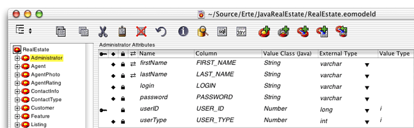
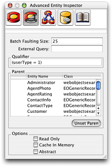
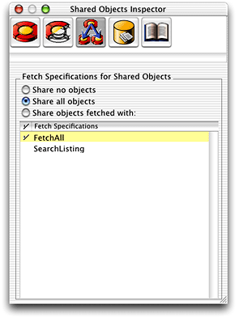
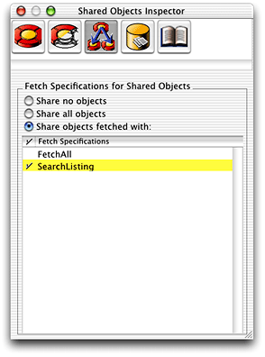
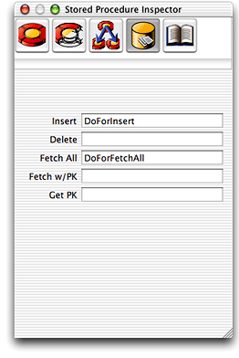
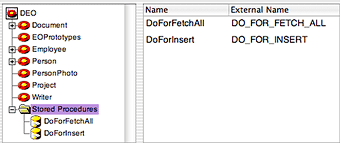
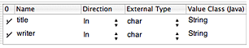

> 导航：[总目录](../../../README.md) · [documentation](../../../_indexes/documentation.md) · [EOModeler User Guide](Introduction%20to%20EOModeler%20User%20Guide.md)

[Next](Modeling%20Inheritance.md)[Previous](Working%20With%20Relationships.md)

# Working With Entities

This chapter teaches you how to work with entities in EOModeler. It is divided into the following sections:

- [Entity Characteristics](#apple-f4xwc4dqnrsv64tfmyxwi33df52wszbpkridgmbqgaytamjyfvbuqmrqgywueqkcijdueqsk) describes the characteristics of entities.
- [Advanced Entity Inspector](#apple-f4xwc4dqnrsv64tfmyxwi33df52wszbpkridgmbqgaytamjyfvbuqmrqgywueqkcizaukssc) describes the advanced characteristics you can assign to entities.
- [Shared Objects Inspector](#apple-f4xwc4dqnrsv64tfmyxwi33df52wszbpkridgmbqgaytamjyfvbuqmrqgywueqkcjjceerkf) describes how to configure entities to be fetched into the shared editing context.
- [Stored Procedure Inspector](#apple-f4xwc4dqnrsv64tfmyxwi33df52wszbpkridgmbqgaytamjyfvbuqmrqgywueqkci5begssf) describes how to configure entities to invoke stored procedures when certain actions occur.

To display a model’s entities in table mode, select the model object in the tree view. Doing this displays the main characteristics of each entity such as class name and table name. To display the attributes of a particular entity, select an entity in the tree view. Figure 5-1 shows an entity called Administrator selected in the tree view and its attributes displayed in the table.

__Figure 5-1__  The Administrator entity selected in the tree view

Each table column corresponds to a single characteristic of an entity such as its name or the name of its database table. By default, the columns included in the table—Name, Table, and Class Name—only represent a subset of the possible characteristics you can set for a given entity. Figure 5-1 shows some of the possible additional columns such as Value Type and Client-Side Class Property. To add columns for additional characteristics, you use the Add Column pop-up menu in the lower left-corner of the table. To remove a column, select it and press the Delete key.

Table 5-1 describes the characteristics you can set for an entity in the model editor.

__Table 5-1__  Entity characteristics

| Characteristic | Description |
| Class Name | The name of the class that corresponds to the entity. If you don’t define a custom enterprise object class for an entity, the class name defaults to EOGenericRecord. You should use a fully qualified name but this isn’t strictly required. |
| Client-Side Class Name | The name of the class that corresponds to the entity in the client side of a three-tier WebObjects Java Client application. If you don’t define a client-side class, Enterprise Objects looks for a class in the client with the same name as the server-side enterprise object class. If no such class exists on the client, it uses EOGenericRecord. You should use a fully qualified name but this isn’t strictly required. |
| External Query | Any valid SQL statement that you want executed when unqualified fetches are performed on the entity. |
| Name | The name your application uses for the entity. By default, EOModeler supplies a name based on the name of the corresponding table in the data source. |
| Open Entity | Adds a column with an icon which you can double-click to display an entity’s attributes. |
| Parent | Specifies an entity’s parent when using inheritance. |
| Qualifier | Specifies a restricting qualifier that is added to every fetch specification performed on the entity. Used when modeling inheritance hierarchies. |
| Read Only | Specifies if the entity is read-only. |
| Table | The name of the table in the data source that corresponds to the entity. |

Other characteristics of entities can be set in the entity inspectors.

The Advanced Entity Inspector lets you set more complex behavior for entities. To display it, click the Advanced Entity Inspector button at the top of the window. It appears as shown in Figure 5-2.

__Figure 5-2__  The Advanced Entity Inspector

The following list describes the characteristics that can be set in the Advanced Entity Inspector:

- __Batch Faulting Size__ lets you specify the number of faults that should be triggered when you first access an object of this type that is the destination of a to-many relationship. By providing a number in this field, you specify that number of faults of the same entity should be fetched from the data source along with the first fault. This improves performance by minimizing round trips to the data source.
- __External Query__ lets you specify any SQL statement to execute when Enterprise Objects performs an unqualified fetch on the entity. The columns selected by this SQL statement must be in alphabetical order by internal name and must match in number and type with the class properties specified for the entity.
- __Qualifier__ is used to specify a restricting qualifier. A restricting qualifier maps an entity to a subset of rows in a table. When you add a restricting qualifier to an entity, it invokes a fetch for that entity to retrieve objects only of the type specified by the restricting qualifier. See [Implementing Single-Table Mapping in a Model](Modeling%20Inheritance.md#apple-f4xwc4dqnrsv64tfmyxwi33df52wszbpkridgmbqgaytamjyfvbuqmrqg4wviucykjcummjtgi) for more information on restricting qualifiers.
- __Parent__ is used to specify a parent entity for the current entity. This field is used to model inheritance. See [Modeling Inheritance](Modeling%20Inheritance.md#apple-f4xwc4dqnrsv64tfmyxwi33df52wszbpkridgmbqgaytamjyfvbuqmrqg4wviubr) for more details on this topic.
- __Read Only__ specifies whether the data that’s represented by the entity can be altered by your application. This does not lock objects at the database level but rather works at a higher level (in the `com.webobjects.eoaccess.EODatabaseContext` object) so that if you try to save changes to data that’s marked as read only, Enterprise Objects refuses the save and throws an exception.
- __Cache in Memory__specifies that when one record in a table is fetched, the entire table is fetched into memory. Caching an entity’s objects allows Enterprise Objects to evaluate queries in memory, thereby avoiding round trips to the data source. This is most useful for read-only entities where there is no danger of the cached data getting out of sync with the data in the data source.
- __Abstract__ lets you specify whether the entity is abstract. An abstract entity is one for which no objects are ever instantiated. For example, in the Real Estate database, the User entity is abstract and is never instantiated, whereas entities that inherit from it, such as Agent and Customer, are concrete classes that are instantiated. Like the Parent field, this option is used when modeling inheritance.

The Shared Objects Inspector lets you configure a feature of Enterprise Objects called the shared editing context. This is a special kind of editing context, a subclass of EOEditingContext: `com.webobjects.eocontrol.EOSharedEditingContext`. The shared editing context is a mechanism that allows EOEditingContext objects to share enterprise objects. Proper use of it can reduce redundant data in your application and limit the number of fetches to the data store an application performs.

The Shared Objects Inspector provides a simple interface to define, on a per-entity basis, the objects that are fetched into the shared editing context. By selecting the Share All Objects option, all rows of data for a particular entity are fetched into the shared editing context. When you select this option, a fetch specification is added to the entity called FetchAll. This fetch specification performs an unqualified fetch on the entity in which it is defined. Figure 5-3 shows the Shared Objects Inspector configured with this option.

__Figure 5-3__  Shared Objects Inspector configured to perform an unqualified fetch

Using the Shared Objects Inspector, you can also share objects that are fetched with a fetch specification defined in that entity. Figure 6-4 shows the inspector configured to put only the objects fetched with the SearchListings fetch specification into the shared editing context.

__Figure 5-4__  Shared Objects Inspector configured to shared objects from a qualified fetch

Shared editing context objects are created when an EODatabaseContext object is instantiated. By default, each application instance has a single instance of EODatabaseContext. See the API reference documentation for EOSharedEditingContext for more information.

You can access the Stored Procedure Inspector by clicking the third button in the Entity Inspector. You use the Stored Procedure Inspector to specify stored procedures that should be executed when a particular database operation (such as insert or delete) occurs. In the field associated with the database operation for which you want the stored procedure to execute, you enter the stored procedure’s name. The stored procedures you specify must correlate to the stored procedures in your model.

You can set up an EOModel so that Enterprise Objects automatically invokes a stored procedure for these operations on an entity:

- __Insert__ to insert a new object into an entity
- __Delete__ to delete an object from an entity
- __Fetch All__ to fetch all objects in an entity
- __Fetch w/ PK__to fetch the object in an entity with a particular primary key
- __Get PK__ to generate a new primary key for an entity

You associate a stored procedure with each of these operations by entering the stored procedure’s name in the inspector, as shown in Figure 5-5.

__Figure 5-5__  Stored Procedure Inspector

The stored procedures you enter in the Stored Procedure Inspector must correspond to a stored procedure in the model. If you created the model from an existing data source and chose the Ask About Stored Procedures option in the wizard, stored procedures are already added to the model. If this is not the case, however, you can add stored procedures to the model using the Add Stored Procedure command from the Property menu.

When you add a stored procedure to a model, you assign it a name to use within Enterprise Objects and you associate it with the stored procedure in the data source by supplying its external name. Figure 5-6 shows two stored procedures in a model, DoForFetchAll, which is associated with the DO_FOR_FETCH_ALL stored procedure in the data source and DoForInsert, which is associated with the DO_FOR_INSERT stored procedure in the data source.

__Figure 5-6__  Map stored procedure in model to procedure in data source

Finally, some stored procedures take arguments that you can also define in EOModeler. To do this, select a stored procedure in the tree view, which displays its arguments in the table. You can add arguments to a stored procedure by choosing Add Argument from the Property menu. Figure 5-7 shows arguments in a stored procedure.

__Figure 5-7__  Stored procedure arguments

In order for Enterprise Objects to automatically invoke a stored procedure for these operations, you must adhere to the requirements for each type of operation.

For each of the operations, if the stored procedure associated with an operation returns a value, Enterprise Objects ignores the return value.

For Fetch All operations, the stored procedure must not take any arguments and it should return a result set for all the objects in the corresponding entity. The rows in the result set must contain values for all the columns Enterprise Objects would fetch if it were not using the stored procedure, and it must return them in alphabetical order.

That is, the stored procedure should return values for primary keys, foreign keys used in class property joins, class properties, and attributes used for locking. These values must be returned in alphabetical order with regard to the attributes with which they are associated. For example, consider a Listing entity that has the attributes `listingID`, `bedrooms`, and `sellingPrice`. A stored procedure that fetches all the Listing objects should return the value for a listing’s number of bedrooms, then its listingID, and then its selling price.

For Fetch w/ PK operations, the stored procedure must take an “in” argument for each of the entity’s primary key attributes (most entities have a single primary key attribute). The argument names must match the names of the entity’s primary key attributes. For example, a Listing entity has a single primary key attribute named `listingID`, so the stored procedures argument as defined in the model must also be `listingID`.

A Fetch w/ PK operation stored procedure should return a result set containing the row that matches the primary key passed in by the argument. The row must be in the same form as rows returned by the Fetch All operation.

For Insert operations, the stored procedure must take an “in” argument for each of the corresponding entity’s attributes. The argument names must match the names of the corresponding EOAttribute objects.

For Delete operations, the stored procedure must take an “in” argument for each of the entity’s primary key attributes. The argument names must match the names of the primary key attributes as in a Fetch w/ PK operation stored procedure.

For Get PK operations, the stored procedure must take an “out” argument for each of the entity’s primary key attributes. The argument names must match the names of the primary key attributes as in a Fetch w/ PK operation stored procedure.

Insert, Delete, and Get PK operations should not return a result set.

[Next](Modeling%20Inheritance.md)[Previous](Working%20With%20Relationships.md)

