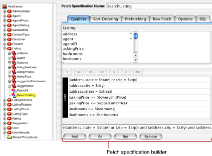
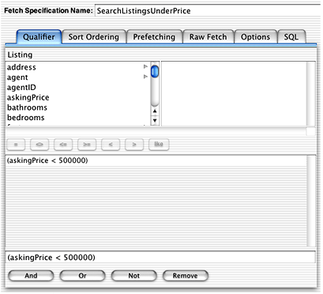
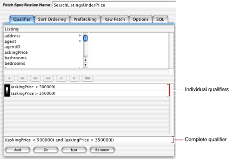
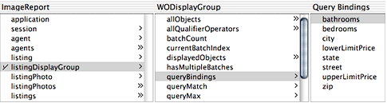
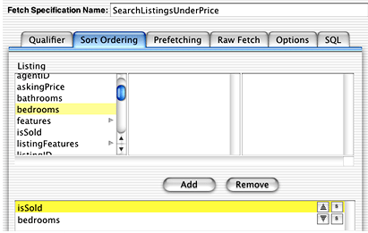
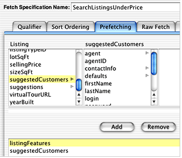

> 导航：[总目录](../../../README.md) · [documentation](../../../_indexes/documentation.md) · [EOModeler User Guide](Introduction%20to%20EOModeler%20User%20Guide.md)


[Next](Document%20Revision%20History.md)[Previous](Modeling%20Inheritance.md)

# Working With Fetch Specifications

After you create and configure entities in EOModeler, you can also use it to build queries on those entities called _fetch specifications_. A fetch specification (a `com.webobjects.eocontrol.EOFetchSpecification` object) is the object Enterprise Objects uses to get data from a data source.

Each fetch specification can contain a qualifier, which fetches only those rows that meet the criteria in the qualifier. A fetch specification allows you to specify a sort ordering to sort the rows of data returned. A fetch specification can also have other characteristics, as discussed in this chapter.

This chapter is organized in the following sections:

- [Creating a Fetch Specification](#apple-f4xwc4dqnrsv64tfmyxwi33df52wszbpkridgmbqgaytamjyfvbuqmrqhawueqkcincuiqsg) describes how to use EOModeler to add a fetch specification to an entity.
- [Assigning a Sort Ordering](#apple-f4xwc4dqnrsv64tfmyxwi33df52wszbpkridgmbqgaytamjyfvbuqmrqhawueqkcjjbeirkf) describes how to assign a sort ordering to a fetch specification.
- [Prefetching](#apple-f4xwc4dqnrsv64tfmyxwi33df52wszbpkridgmbqgaytamjyfvbuqmrqhawueqkcjfbussck) describes what prefetching is and how to configure it.
- [Configuring Raw Row Fetching](#apple-f4xwc4dqnrsv64tfmyxwi33df52wszbpkridgmbqgaytamjyfvbuqmrqhawueqkcjfbecr2j) describes what raw row fetching is, how to use it, and when to use it.
- [Other Fetch Specification Options](#apple-f4xwc4dqnrsv64tfmyxwi33df52wszbpkridgmbqgaytamjyfvbuqmrqhawueqkcjfauircd) describes the other characteristics of fetch specifications that you can set in EOModeler, such as fetch limit and deep fetching.
- [Using Named Fetch Specifications](#apple-f4xwc4dqnrsv64tfmyxwi33df52wszbpkridgmbqgaytamjyfvbuqmrqhawueqkcinbusrsi) tells you how to invoke a fetch specification you build in EOModeler from business logic classes.

Although you can create fetch specifications programmatically, it’s easier and less error-prone to create and configure them in EOModeler. To create a fetch specification in EOModeler:

1. Select the entity with which the fetch specification is associated.

   A fetch specification is related to a single entity, so all the fields used in a particular fetch specification are relative to the entity to which it belongs.
2. Choose Add Fetch Specification from the Property menu.
3. Type a name for the fetch specification in the Fetch Specification Name field and press Return.

   __Figure 7-1__  A sample fetch specification

   

Figure 7-1 shows a fetch specification called SearchListing in an entity called Listing. There are six panes in the fetch specification builder, which you can use to configure a fetch specification. They are each described in the following sections.

A qualifier (a concrete instance of a `com.webobjects.eocontrol.EOQualifier` subclass) restricts the rows of data that are fetched with a fetch specification object. For example, in a real estate application, you may want to retrieve the records of homes that are priced under $500,000. To build the qualifier for this query in EOModeler:

1. Using the Real Estate model in the WebObjects examples folder, add a fetch specification to the Listing entity.
2. In the Qualifier pane, click in the text field below the list of attributes, then select the `askingPrice` attribute, and type `< 500000` after it, as shown in Figure 7-2.

   __Figure 7-2__  Static qualifier

   

This fetch specification returns only those listings whose asking price is under $500,000. Although you may have the need to build a static qualifier like this one, you’ll most often want to use qualifier variables to supply dynamic values to qualifiers, such as $350,000 or $700,000 in this example. This is described in [Using Qualifier Variables](#apple-f4xwc4dqnrsv64tfmyxwi33df52wszbpkridgmbqgaytamjyfvbuqmrqhawueqkcjfbeoq2e).

You can also use the qualifier builder to create compound qualifiers made up of multiple expressions. For example, you may want to build a qualifier that restricts a query on home listings to homes whose asking price is less than $500,000 but greater than $350,000.

To create a compound qualifier from the qualifier created in [Building a Qualifier](#apple-f4xwc4dqnrsv64tfmyxwi33df52wszbpkridgmbqgaytamjyfvbuqmrqhawueqkcijbumrsc), select the expression `askingPrice < 500000` and click the And button. Then add a second expression by again selecting the `askingPrice` attribute from the attribute list and completing the expression with `> 350000`, as shown in Figure 7-3.

__Figure 7-3__  A compound qualifier



As you build up a complex query, the text field at the bottom of the Qualifier pane updates to include the full text of the compound qualifier. Instead of building up expressions one by one with the And, Or, and Not buttons, you can type directly into this text field. The qualifier builder parses this string and displays the individual expressions.

You can specify static criteria for a fetch specification’s qualifier, as is done in [Building a Qualifier](#apple-f4xwc4dqnrsv64tfmyxwi33df52wszbpkridgmbqgaytamjyfvbuqmrqhawueqkcijbumrsc) and in [Creating Compound Qualifiers](#apple-f4xwc4dqnrsv64tfmyxwi33df52wszbpkridgmbqgaytamjyfvbuqmrqhawueqkcjbcuqrkb). However, such a qualifier is of limited use. More commonly, you want to specify the form of a qualifier and let users supply specific values when they run the application. You can do this with qualifier variables.

You specify a qualifier variable using the dollar sign character ($), as in the following:

```
askingPrice < $maxPrice
```

You can build this qualifier in EOModeler as specified in the previous sections and then bind its qualifier variables to your application’s user interface. You do this by dragging a fetch specification into either WebObjects Builder or Interface Builder and then binding user interface elements to keys in the display group that correspond to the fetch specification’s variables.

Figure 7-4 shows the `queryBindings` attribute of a display group that was added to a WOComponent. The `queryBindings` attribute includes bindings for the attributes that are the keys of qualifiers in the fetch specification to which the display group is associated. You bind values in the user interface to these keys by making a connection between the keys and certain dynamic elements.

__Figure 7-4__  Fetch specification bindings in WebObjects Builder



You can also bind qualifier variables to values in your application programmatically, as described in [Using Named Fetch Specifications](#apple-f4xwc4dqnrsv64tfmyxwi33df52wszbpkridgmbqgaytamjyfvbuqmrqhawueqkcinbusrsi).

It’s common to want a fetch specification to return a sorted array of objects. You can assign a sort ordering to a fetch specification in the Sort Ordering pane of the fetch specification builder.

Simply choose an attribute on which to sort and click Add. The order in which you add attributes specifies the weight to assign to them. Figure 7-5 shows a sort ordering that sorts first on whether the listing is sold and second on the number of bedrooms.

__Figure 7-5__  Sort ordering



You can also specify an ascending or descending order to sort on for each attribute and whether to perform case-sensitive or case-insensitive comparison. Figure 7-5 specifies an ascending order for the `isSold` attribute and a descending order for the `bedrooms` attribute.

Among the numerous options you can use to tune a fetch specification’s behavior is _prefetching_. In the Prefetching pane of the fetch specification builder, you identify relationships that should be fetched along with the objects specified by the fetch specification. For example, when fetching Listing objects, you can prefetch associated `listingFeatures` and `suggestedCustomers` relationships. This tells Enterprise Objects to retrieve a Listing’s `listedFeatures` and `suggestedCustomers` relationships along with the Listing itself, as opposed to creating faults for the objects in those relationships.

Although prefetching increases the initial fetch cost, it can improve overall performance by reducing the number of round trips made to the data source.

To specify a relationship to prefetch, in the Prefetching pane of the fetch specification builder, select the relationship you want to prefetch and click Add, as shown in Figure 7-6.

__Figure 7-6__  Configure prefetching



When you perform a fetch in an Enterprise Objects application, the information from the database is fetched and stored in a graph of enterprise objects. This object graph provides many advantages, but it can be large and complex.

If you’re creating a simple application, you may not need all the benefits of enterprise objects and the object graph. For example, an application that simply displays information from a database without ever performing database updates and without ever traversing relationships might be just as well served by fetching the information into a set of dictionaries rather than a set of enterprise objects.

You can do this in Enterprise Objects by using _raw row fetching_. In raw row fetching, each row from the database is fetched into an NSDictionary object.

When you use raw row fetching, you lose some important features:

- The objects in the dictionary are not uniqued.
- The objects in the dictionary aren’t tracked by an editing context.
- You can’t access to-many relationship information. (However, you can use key paths to access to-one relationships).

And, if you need an enterprise object at some point in your application, you can easily construct one from a raw row dictionary.

You can configure raw row fetching in the Raw Fetch pane of the fetch specification builder. In this pane, you can choose to fetch all or some of the attributes of a particular entity as raw rows.

The Options pane of the fetch specification builder lets you configure other aspects of a fetch specification. These other aspects are usually used for performance tuning. These are the options:

- __Fetch Limit__ lets you specify the maximum number of objects to fetch for a particular fetch specification. You enter the maximum number in the Max Rows text field in the Options pane. The default limit is zero, indicating that there is no fetch limit.

  Use the “Prompt on limit” option to specify how Enterprise Objects should behave when the fetch limit is reached. If the “Prompt on limit” option is selected, the user is prompted about whether to continue fetching after the maximum has been reached. If the box isn’t checked, Enterprise Objects simply stops fetching when it reaches the limit.
- __Perform deep inheritance fetch__ specifies whether to fetch deeply or not. This is used with inheritance hierarchies when fetching for an entity with subentities. A deep fetch produces all instances of the root entity and its subentities while a shallow fetch produces only instances of the entity in the fetch specification. See [Modeling Inheritance](Modeling%20Inheritance.md#apple-f4xwc4dqnrsv64tfmyxwi33df52wszbpkridgmbqgaytamjyfvbuqmrqg4wviubr) for more details on inheritance.
- __Fetch distinct rows__ specifies whether to return distinct results or not. Normally if a record or object is selected several times, such as when forming a join, it appears several times in the fetch results. A fetch specification that fetches distinct rows filters out duplicates so that each record or object appears exactly once in the result set.
- __Lock all fetched objects__ specifies that a fetch specification locks fetched objects, which means that each row in the data source is locked when it is read. This is one way to implement pessimistic locking in your application.
- __Refresh refetched objects__ specifies that existing objects affected by the fetch specification should be overwritten with newly fetched values when they’ve been updated or changed. With fetch specifications that don’t refresh, existing objects aren’t updated when their data is refetched (the fetched data is simply discarded).
- __Require all variable bindings__ specifies whether a missing value for a qualifier variable is ignored or whether Enterprise Objects requires that each qualifier variable have a value assigned to it. If this option is selected, an exception is thrown during variable substitution if a missing value is present. If this option isn’t selected, any qualifier expressions for which there are no variable bindings are pruned from the qualifier. See [Using Qualifier Variables](#apple-f4xwc4dqnrsv64tfmyxwi33df52wszbpkridgmbqgaytamjyfvbuqmrqhawueqkcjfbeoq2e) for related information.

Fetch specifications you build in EOModeler are referred to as named fetch specifications. To use a named fetch specification requires that you get hold of the model object in which the fetch specification exists. The code in Listing 7-1 retrieves a fetch specification called “MyFetch” in an entity named “Listing” by looking for it in all the models in the application’s default model group.

__Listing 7-1__  Get a fetch specification programmatically

```
EOModelGroup modelGroup = EOModelGroup.defaultGroup();
EOFetchSpecification fs = modelGroup.fetchSpecificationNamed(“MyFetch”, “Listing”);
```

If the fetch specification has qualifier variables, you can bind them to a dictionary of values in the application using the code in Listing 7-2.

__Listing 7-2__  Bind qualifier variables

```
fs = fs.fetchSpecificationWithQualifierBindings(dictionary);
```

In Listing 7-2, the variable `bindings` is an NSDictionary object of key-value pairs. So if you have three qualifier variables in the fetch specification called `$askingPrice`, `$bedrooms`, and `$bathrooms`, the dictionary object would look like Table 7-1.

__Table 7-1__  Bindings dictionary

| Key | Value |
| `askingPrice` | 500000 |
| `bedrooms` | 4 |
| `bathrooms` | 3 |

If you define a qualifier like this:

```
(askingPrice < $askingPrice) and (bedrooms = $bedrooms) and (bathrooms = $bathrooms)
```

then the qualifier variables are replaced by 500000 (`askingPrice`), 4 (`bedrooms`), and 3 (`bathrooms`).

You can construct the dictionary in Table 7-1 with this code:

```
NSMutableDictionary dictionary = new NSMutableDictionary();
dictionary.takeValueForKey(“500000”, “askingPrice”);
dictionary.takeValueForKey(“4”, “bedrooms”);
dictionary.takeValueForKey(“3”, “bathrooms”);
```

The complete code listing for this example appears is:

```
EOModelGroup modelGroup = EOModelGroup.defaultGroup();
EOFetchSpecification fs = modelGroup.fetchSpecificationNamed(“MyFetch”, “Listing”);
fs = fs.fetchSpecificationWithQualifierBindings(dictionary);
NSMutableDictionary dictionary = new NSMutableDictionary();
dictionary.takeValueForKey(“500000”, “askingPrice”);
dictionary.takeValueForKey(“4”, “bedrooms”);
dictionary.takeValueForKey(“3”, “bathrooms”);
```

[Next](Document%20Revision%20History.md)[Previous](Modeling%20Inheritance.md)

