> 导航：[总目录](../../../README.md) · [documentation](../../../_indexes/documentation.md) · [EOModeler User Guide](Introduction%20to%20EOModeler%20User%20Guide.md)

[Next](Working%20With%20Entities.md)[Previous](Working%20With%20Attributes.md)

# Working With Relationships

This chapter describes how to create and configure relationships in EOModeler. It also provides an introduction to relationships. It is organized in the following sections:

- [About Relationships](#apple-f4xwc4dqnrsv64tfmyxwi33df52wszbpkridgmbqgaytamjyfvbuqmrqguwueqkcijbesscd) introduces the concept of relationships as defined by the entity-relational paradigm. It also discusses basic principles of relationships such as cardinality, joins, and relationship keys.
- [Creating Relationships](#apple-f4xwc4dqnrsv64tfmyxwi33df52wszbpkridgmbqgaytamjyfvbuqmrqguwueqkcizdemski) describes how to use EOModeler to create relationships.
- [Tips for Specifying Relationships](#apple-f4xwc4dqnrsv64tfmyxwi33df52wszbpkridgmbqgaytamjyfvbuqmrqguwueqkcjbducqkb) provides some general design patterns when creating relationships.
- [Adding Referential Integrity Rules](#apple-f4xwc4dqnrsv64tfmyxwi33df52wszbpkridgmbqgaytamjyfvbuqmrqguwueqkcinbuuq2j) discusses the various referential integrity rules supported by Enterprise Objects, such as the delete rules and optionality.
- [Flattened Relationships](#apple-f4xwc4dqnrsv64tfmyxwi33df52wszbpkridgmbqgaytamjyfvbuqmrqguwueqkcjjdusr2f) describes what flattened relationships are and how to form them in EOModeler.
- [Modeling Many-to-Many Relationships](#apple-f4xwc4dqnrsv64tfmyxwi33df52wszbpkridgmbqgaytamjyfvbuqmrqguwueqkci5eeqr2h) discusses how to build many-to-many relationships using EOModeler.

Relational databases derive much of their value from the relationships between the tables they store. Likewise, the Enterprise Object technology includes infrastructure that brings relationship data to life in data-driven applications.

A relationship expresses the affinity between tables in a data source. In the most simple case, a relationship expresses a meaningful connection between two tables in a data source. You can also think of relationships as cross-references much like entries in a book’s index. A single index entry can cross-reference one or more other index entries so that there is a relationship between index entries.

For example, a Person table could be related to a PersonPhoto table by a relationship called `toPhoto`. In relationship lingo, the Person table is referred to as the source table or source entity that contains source records. The PersonPhoto table is referred to as the destination table or destination entity that contains destination records.

Relationships are unidirectional, which means that the path that leads from the source to the destination can’t be traveled in the opposite direction—you can’t use a relationship to go from the destination to the source. So, although you can use a `toPhoto` relationship to find the photo for a particular person, you can’t use this relationship in reverse to get a person’s name.

Unidirectionality is enforced by the way a relationship is resolved. Resolving a relationship means finding the correct destination record or records given a specific source record.

Bidirectional relationships—in which you can look up records in either direction—can be created by adding a separate return-trip, or inverse, relationship. But there is no concept of a single relationship that is bidirectional.

Every relationship has a _cardinality_. The cardinality defines how many destination records can potentially resolve the relationship. In relational database systems, there are generally two cardinalities:

- to-one relationship—for each source record, there is exactly one corresponding destination record
- to-many relationship—for each source record, there may be zero, one, or more corresponding destination records

An `employeeDepartment` relationship is an example of a to-one relationship: An employee can be associated with only one department in a company. An Employee entity might also be associated with a Project entity. In this case, there would be a to-many relationship from Employee to Project called `projects` since an Employee can have many projects.

The construction of a relationship requires that you designate at least one attribute in each entity as a _relationship key_. Relationship keys are necessary so a relationship can be resolved. For example, the `toPhoto` relationship which relates a Person entity to a PersonPhoto entity, uses two relationship keys: `personPhotoID`, the source key in the Person entity, and `personPhotoID`, the destination key in the PersonPhoto entity.

Figure 4-1 shows the `PERSON` table’s columns.

__Figure 4-1__  Foreign key for PersonPhoto in Person table

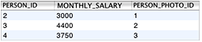

When Enterprise Objects resolves this relationship, it creates a join table by looking up the `PERSON_PHOTO_ID` key in the `PERSON_PHOTO` table. In Figure 4-1, the row with `PERSON_ID` = `2` has a value of 1 in the `PERSON_PHOTO_ID` column. The relationship specifies that the `PERSON_PHOTO_ID` column in the `PERSON` table resolves to the `PERSON_PHOTO_ID` column in the `PERSON_PHOTO` table. As shown in Figure 4-2, the row with `PERSON_PHOTO_ID` = `1` in the `PERSON_PHOTO` table holds binary data that represents a photo.

__Figure 4-2__  PersonPhoto primary key in PersonPhoto table

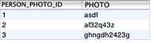

There are some general guidelines when choosing which attributes to use as relationship keys. In to-one relationships, the destination key must be a primary key in the destination entity. In to-many relationships, the destination key is usually a foreign key in the destination entity (which is most often a copy of the source entity’s primary key). The source key or foreign key should emulate the destination key in that the data types must be the same and the names should be similar.

So, in the previous example, `PERSON_PHOTO_ID` is the primary key for the `PERSON_PHOTO` table and it is a column of type `int`. In the `PERSON` table, `PERSON_PHOTO_ID` is a foreign key that is of the same type and name as the primary key it maps to in the `PERSON_PHOTO` table.

When you use relationship keys to express an affiliation between two entities, keep in mind these general rules:

- For to-one relationships, the source attribute is a foreign key in the source entity while the destination key is the primary key of the destination entity.
- For to-many relationships, the source attribute is the primary key in the source entity (but it can also be a foreign key in the source entity) while the destination key is a foreign key of the destination entity.

If you have consistency checking enabled in EOModeler, it warns you if any to-one relationships in your model have destination keys that are not primary keys.

A unique kind of relationship is the _reflexive relationship_—a relationship that shares the same source and destination entity. Reflexive relationships are important when modeling data in which an instance of an entity points to another instance of the same entity.

For example, to show who a given person reports to, you could create a separate manager entity. It would be easier, however, to just create a reflexive relationship. The `managerID` attribute is the relationship’s source key whereas `employeeID` is the relationship’s destination key. Where a person’s `managerID` is the `employeeID` of another employee object, the first employee reports to the second. If an employee doesn’t have a manager, the value for the `managerID` attribute is `null` in that employee’s record.

Figure 4-3 shows this relationship as it exists in the Employee table. The row with `NAME = Brent` references the row with `NAME = K. Boss` since the manager relationship is defined with `MANAGER_ID` as the source key and `EMPLOYEE_ID` as the destination key.

__Figure 4-3__  Reflexive relationship table

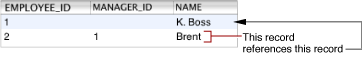

Reflexive relationships can represent arbitrarily deep recursions. So, in the model above, a person can report to another person who reports to yet another person, and so on. This could go on until a person’s `managerID` attribute is `null`, which denotes that person reports to no one.

The Owns Destination option lets you specify whether the relationship’s source owns its destination objects. When a source object owns its destination object, for example, as when an Agent object owns its Customer objects, when a destination object (Customer) is removed from the relationship, it is also removed from the data source. Ownership implies that an owned object cannot exist without its owner.

The Propagate Primary Key option lets you specify that the primary key of the source entity should be propagated to newly inserted objects in the destination of the relationship. That is, when inserting objects that are the destination of the relationship, this option suppresses primary key generation for the destination entity and instead uses the source object’s primary key as the primary key for the newly inserted destination object.

This option is used for an owning relationship where the owned object has the same primary key as the source. Propagating primary key confers a performance improvement as it doesn’t require the generation of a primary key for the destination entity. Primary key propagation is also commonly used to generate primary keys for join tables in many-to-many relationships.

If the data source on which your model is based includes foreign key definitions, these definitions are automatically expressed in your model when you create a model from an existing data source with the New Model Wizard. But if you are creating the schema within EOModeler, you need to define relationships in the model editor.

EOModeler provides two mechanisms for forming relationships. You can form them in the model editor’s diagram view or in the Relationship Inspector. Using the diagram view is the quickest way to create new relationships, but using the Relationship Inspector gives you access to more relationship characteristics. Each mechanism is discussed in the following sections.

To create a relationship in diagram view, Control-drag from a source attribute to a destination attribute, as shown in Figure 5-4.

__Figure 4-4__  Control-drag from source key to destination key to form a relationship

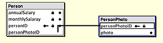

The cardinality of the relationship is determined by the primary key characteristic of the destination attribute. If the destination attribute is the entity’s primary key, the relationship is modeled as a to-one relationship. If the destination attribute is a foreign key, the relationship is modeled as a to-many relationship.

Control-dragging to form a relationship actually creates two relationships: one in the source attribute’s entity and an inverse relationship in the destination attribute’s entity. In Figure 4-5, Control-dragging from `Person.personPhotoID` (a foreign key) to `PersonPhoto.personPhotoID` (a primary key) creates a to-one relationship from the Person entity to the PersonPhoto entity and a to-many relationship from the PersonPhoto entity to the Person entity.

__Figure 4-5__  Control-dragging also creates an inverse relationship

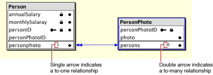

In Figure 4-5, the single line indicating the relationships between the Person and PersonPhoto entities should not be mistaken for a “bidirectional” relationship, which is not possible in the object-relational model. It is actually two relationships but when you create a relationship in diagram view, it appears as a single line.

For the `personPhoto` relationship, it doesn’t make sense for the inverse relationship (`persons` in PersonPhoto) to be a to-many relationship. You can make it a to-one relationship in the Relationship Inspector as well as set other characteristics of the relationship. The Relationship Inspector is described in detail in [Forming Relationships in the Inspector](#apple-f4xwc4dqnrsv64tfmyxwi33df52wszbpkridgmbqgaytamjyfvbuqmrqguwviucykjcummjtgi) and [Forming Relationships Across Models and Data Sources](#apple-f4xwc4dqnrsv64tfmyxwi33df52wszbpkridgmbqgaytamjyfvbuqmrqguwviucykjcummjtgm).

Creating relationships in the Relationship Inspector is a more manual process than creating one in the diagram view. The inspector provides only the ability to configure a relationship that already exists. So before you can edit a relationship in the Relationship Inspector, you must add a relationship to an entity.

Assuming that the entities in the previous example exist (Person and PersonPhoto), you can form a relationship between them by selecting an entity (Person) and then choosing Add Relationship from the Property menu. Then, select the new relationship in the tree view by clicking the plus sign next to an entity and open the Relationship Inspector by choosing Inspector from the Tools menu.

Now you can use the Relationship Inspector to configure the relationship. Follow these steps and refer to Figure 4-6 for clarity:

1. In the Relationship Inspector, select the destination entity (PersonPhoto) from the Entity list in the Destination box.
2. Select the source attribute (`personPhotoID`) in the Source Attributes list.
3. Select the destination attribute (`personPhotoID`) in the Destination Attributes list.
4. Make sure the relationship has the proper cardinality, To One in this case.
5. Click Connect.

__Figure 4-6__  Using the Relationship Inspector to build a relationship

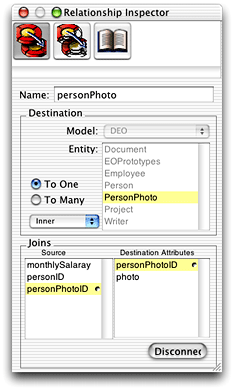

EOModeler assigns the relationship a default name based on the name of the destination entity and the cardinality of the relationship. You can edit this name using the Relationship Inspector or in table mode.

The source and destination attributes you chose are based on general rules for relationships, which are described in [Relationship Keys](#apple-f4xwc4dqnrsv64tfmyxwi33df52wszbpkridgmbqgaytamjyfvbuqmrqguwviucykjcummjsg4).

The entities in one model can have relationships to the entities in another model. You can form such relationships even if the models map to different databases and different database servers.

When you add a model to a project, it becomes part of a model group. Every Enterprise Objects application includes a default model group, even if the project contains only one model. Each model you add to a project automatically becomes part of the project’s model group. The only regulation between multiple models in a model group is that entity names must be unique.

To form a relationship from one model to another, use the Relationship Inspector as follows:

1. Add a relationship to the entity you want to use as the source of the relationship.
2. In the Relationship Inspector, use the Model pop-up menu to choose the model that contains the entity you want to use as the relationship’s destination. This menu displays all the models in the application’s model group. Figure 4-7 shows two models in an application’s model group, RealEstate and DEO.

   __Figure 4-7__  Multiple models to choose from

   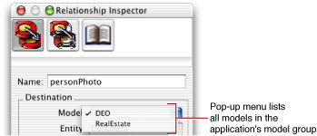
3. Specify the relationship as you normally would.

The following tips are useful to keep in mind as you add relationships to your model:

- The relationships you define in a model must reflect corresponding implementations in the data source, as well as the features supported by the adaptor your model uses. Enterprise Objects doesn’t know, for example, if your adaptor supports left outer joins, so you need to be careful with regard to the characteristics you set for relationships.
- Use the diagram view to quickly create pairs of inverse relationships by Control-dragging between source and destination attributes.
- Use the Relationship Inspector to specify information about a relationship, such as whether it’s to-one or to-many, its semantics (join type), the destination model, and the destination entity in the destination model.
- Relationships can be compound, meaning that they can consist of multiple pairs of connected attributes. You can specify additional pairs of attributes only in the Relationship Inspector. Simply select a second source attribute and a second destination attribute and click Connect a second time.
- A to-one relationship from one foreign key to a primary key must always have exactly one row in the destination entity—if this isn’t guaranteed to be the case, use a to-many relationship. This rule doesn’t apply to a foreign key to primary key relationship where a `null` value for the foreign key in the source row indicates that no row exists in the destination.
- To-one relationships must join on the complete primary key of the destination entity.

You can use the Advanced Relationship Inspector to add referential integrity rules for relationships. These rules specify relationship characteristics such as optionality and delete rule. The referential integrity rules you specify are not written back to the data source: When Enterprise Objects creates objects for relationships, the objects include the referential integrity rules you specify in the model.

The Optionality section lets you specify whether a relationship is optional or mandatory. For example, you could require that all Document objects have a related Writer object but not require that all Document objects have a related Illustrator object. When you attempt to save an object that has a mandatory relationship that is not set (so the relationship is `null`), Enterprise Objects refuses the save and displays an error message stating that the object being saved has a mandatory relationship that must be set.

The options in the Delete Rule section specify what to do when the source object of a relationship is deleted. There are four options:

- __Nullify__ disassociates all destination objects from the source object by removing references to them. So, when an Agent object is deleted, its related Customer objects are not deleted but the Customer objects’ references to Agent are nullified (the entry in the join table is set to `null`).
- __Cascade__ deletes all objects that are the destination of a relationship whose source is deleted. So, when an Agent object is deleted, all of its related Customer objects are also deleted.
- __Deny__ refuses the deletion if a source object has any destination objects. So, if an Agent object has any Customer objects, deleting the Agent object is denied. In order for the deletion of the Agent object to succeed, its destination objects (Customer objects) must either be deleted or changed to something other than destination objects of the Agent object.
- __No Action__ deletes the destination object but does not remove any back references to the source object. So, if a Customer object is deleted, its reference to its Agent object is not removed. Using this option may result in dangling references in the data source.

Just as you can flatten attributes (see [Flattened Attributes](Working%20With%20Attributes.md#apple-f4xwc4dqnrsv64tfmyxwi33df52wszbpkridgmbqgaytamjyfvbuqmrqgqwueqkci5dukrsb)), you can also flatten relationships. Flattening a relationship gives a source entity access to relationships that a destination has with other entities. It’s equivalent to performing a multitable join. Note that flattening either an attribute or a relationship can result in degraded performance when the destination objects are accessed, since traversing multiple tables makes fetches slower.

As discussed in [When Should You Flatten Attributes?](Working%20With%20Attributes.md#apple-f4xwc4dqnrsv64tfmyxwi33df52wszbpkridgmbqgaytamjyfvbuqmrqgqwueqkcizbegsck), flattening is a technique you should use only under certain conditions. Instead of flattening an attribute or a relationship, you can instead directly traverse the object graph, either programmatically or by using key paths. This ensures that your application maintains an internally consistent view of its data.

There is one scenario in which you might want to use a flattened relationship: If you’re modeling a many-to-many relationship and you want to perform a multitable hop to access a table that lies on the other side of an intermediate table.

For example, in the Real Estate database, the Suggestion table acts as an intermediate table between Customer and Listing. It’s highly unlikely that you would ever need to fetch instances of Suggestion into your application. In this situation, it makes sense to specify a relationship between Customer and Suggestion and flatten that relationship to give Customer access to the Listing table.

Follow these steps to flatten a relationship:

1. Add a relationship from one entity (entity_1) to a second entity (entity_2). For example, add a to-many relationship called `suggestions` from Customer to Suggestion.
2. Add a relationship from entity_2 (Suggestion) to a third entity (entity_3, Listing). For example, add a to-many relationship called `listing` from Suggestion to Listing.
3. In browser mode, from entity_1 (Customer), select the relationship to entity_2 (`suggestions`) to display its attributes and relationships.

   __Figure 4-8__  Select the relationship that contains the relationship to flatten

   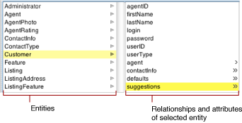
4. In the list of attributes and relationships for entity_2 (Suggestion), select the relationship (`listing`) you want to flatten.

   __Figure 4-9__  Select the relationship to flatten

   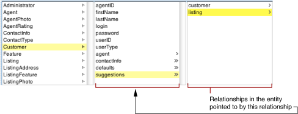
5. Choose Flatten Property from the Property menu. The flattened relationship should appear in bold typeface as shown in Figure 4-10; the name is derived from the relationship key path.

   __Figure 4-10__  A flattened relationship displayed in browser mode

   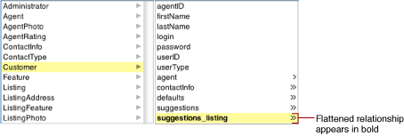

The flattened relationship (in this example, `suggestions_listing`) appears in the list of properties for Customer.

Modeling a many-to-many relationship between objects is simple: Each object manages a collection of the other kind. For example, consider the many-to-many relationship between employees and projects. To think of this relationship in objects, an Employee object has an array of Project objects representing all of the projects the employee works on; and a Project object has an array of Employee objects representing the people working on the project.

To model a many-to-many relationship in a database, you have to create an intermediate table (also known as a correlation or join table). For example, the database for employees and projects might have `EMPLOYEE`, `PROJECT`, and `EMPLOYEE_PROJECT` tables, where `EMPLOYEE_PROJECT` is the correlation table.

Given the relational database representation of a many-to-many relationship, how do you get the object model you want? You don’t want to see evidence of the correlation table in your object model, and you don’t want to write code to maintain database correlation rows. With Enterprise Objects, fortunately, you don’t have to. You can simply use flattened relationships to hide correlation tables.

A model with the following features has the effect of hiding the `EMPLOYEE_PROJECT` correlation table from its object model:

- Employee and Project entities whose to-many relationships to the EmployeeProject entity are not class properties. These to-many relationships (named `projectEmployees` in this example) are never instantiated or used at the application level.
- The flattened relationships `projects` and `employees` in Employee and Project, respectively, are class properties.

Consequently, EmployeeProject enterprise objects are never created, Employee objects have an array of related Projects, and Project objects have an array of related Employees. Furthermore, Enterprise Objects automatically manages rows in the `EMPLOYEE_PROJECT` correlation table.

Still, creating a model with the parameters described in this section would take quite a bit of work and would be error prone. Fortunately, EOModeler does all the work for you.

Follow these steps to create a many-to-many relationship between two entities:

1. Switch to diagram view.
2. Select the entities you want to join in a many-to-many relationship.

   __Figure 4-11__  Two entities before joining in a many-to-many relationship

   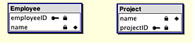
3. Choose Join in Many-to-Many from the Property menu.

This creates a join table between the two entities, adds flattened relationships in the two entities, and sets the class property characteristic for the new relationship as described in this section. The two entities in Figure 4-11 when joined in a many-to-many relationship appear in the diagram view as shown in Figure 4-12.

__Figure 4-12__  Two entities after being joined in a many-to-many relationship

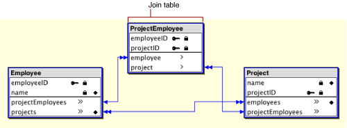

[Next](Working%20With%20Entities.md)[Previous](Working%20With%20Attributes.md)

