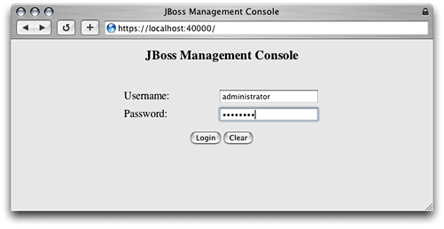
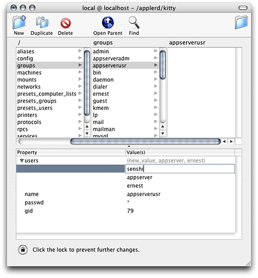
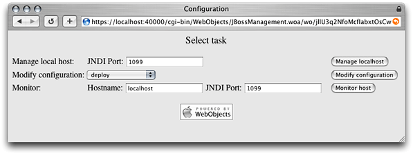
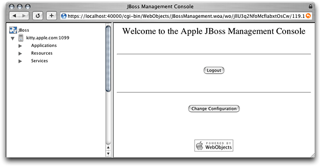
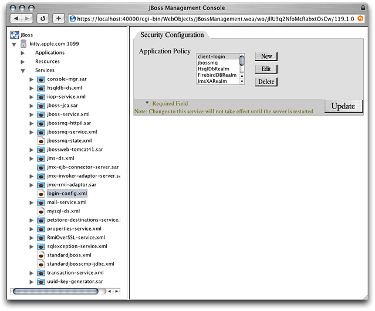
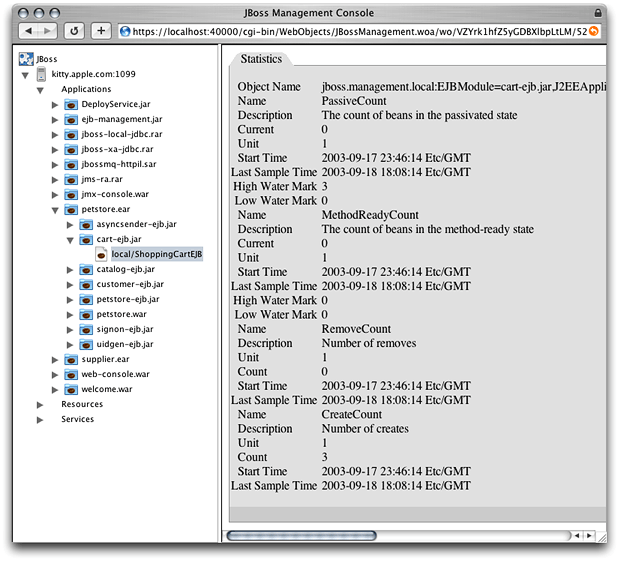
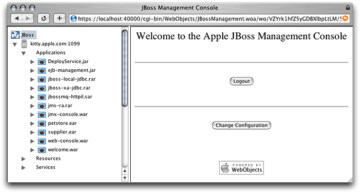
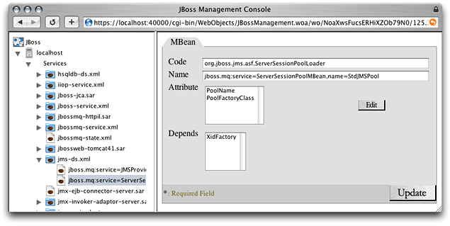
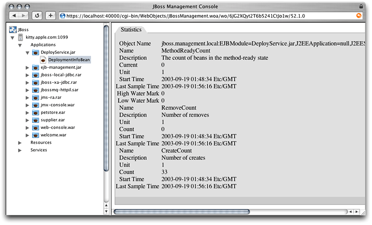
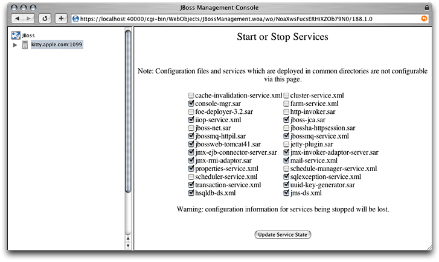

> 导航：[总目录](../../../README.md) · [documentation](../../../_indexes/documentation.md) · [Java Application Server Guide](Introduction%20to%20Java%20Application%20Server%20Guide.md)


[Next](Balancing%20User%20Load%20and%20Replicating%20Sessions.md)[Previous](Configuring%20and%20Deploying%20Sun%E2%80%99s%20Pet%20Store.md)

# Administering Application Servers

Application-server management involves configuring the services available in an application server, turning services on and off, deploying applications, and monitoring application-server resources. This chapter teaches how to manage application servers, which are JBoss instances running on one or more computers.

Before you can log in to the management tool, the tool must be running. You can launch the management tool by executing the following command:

```
$ /Library/JBoss/Applications/JBossManagement.woa/JBossManagement
```

You log in to the management tool through your web browser. To connect to the management tool, enter the following URL into the Address text field in your web browser: `https://localhost:40000`.



Alternatively, you can click Manage JBoss in the Settings pane in the Server Admin window.

To log in to the management tool you must enter the user name and password of an administrator of your computer or a user who is a member of the `appserveradm` group or the `appserverusr` group.

There are two types of users with the authority to use the management tool: administrator users (which are members of the `appserveradm` group) and monitor users (which are members of the `appserverusr` group). The user defined while configuring OS X Server for the first time is added to the `appserveradm` group.

To authorize another user to manage application servers with the management tool, execute the following command in the command line, and restart your computer:

```
$ sudo /usr/bin/dscl . -create Groups/appserveradm GroupMembership <user_ID>
```

If you need to authorize a user to only monitor application servers with the management tool, execute the following command, and restart the computer:

```
$ sudo /usr/bin/dscl . -create Groups/appserverusr GroupMembership <user_ID>
```

You can also use NetInfo Manager to add users to the `appserveradm` and `appserverusr` groups:

1. Launch NetInfo Manager, located in `/Applications/Utilities`.
2. If the lock in the bottom-left corner of the window is locked, click it and authenticate yourself and the server’s administrator.
3. In the “/” column, select “groups.” Then select the appropriate group in the “groups” column.
4. In the Properties list, select “users” and choose Directory > New Value.
5. Replace `new_value` with the appropriate user name.

   
6. Save the changes and restart your computer.

After logging in to the management tool, the Configuration window appears. This window lets you choose the kind of activity you want to perform with the management tool. There are three activities to choose from:

- __Managing__: Allows you to start and stop services, configure services, observe resource statistics, create data sources, create topics or queues, and deploy applications.
- __Configuring__: Lets you start and stop services, create data sources, create topics or queues, and deploy applications.
- __Monitoring__: Allows you to observe resource statistics of application servers.

To manage an application server, enter the JNDI port of the application server you want to manage (by default, `1099`) in the Configuration window (shown in Figure 4-1), and click “Manage localhost”.

__Figure 4-1__  The Configuration window of the management tool



The left side of the JBoss Management Console window (shown in Figure 4-2) lists the application servers available and the resources they provide. You specify the resource you want to manage by clicking the triangle next to the appropriate resource type and selecting a resource from the list that appears.

__Figure 4-2__  The JBoss Management Console window



For example, to change an application server’s security configuration, click the triangle next to the Services resource group and select `login-config.xml`. After that, the Security Configuration pane (shown in Figure 4-3) appears on the right side of the window, showing the application policy list, which you can modify by clicking the appropriate buttons. However, any changes you make take effect only after you restart the application server.

__Figure 4-3__  The JBoss Management Console window showing the Security Configuration pane of the log-in configuration service



When you’re managing the services deployed on the application server, you can also monitor the statistics of deployed applications and resources. For example, if you deploy Sun’s Pet Store in your application server, log in to the management tool, choose to manage the application server from the Configuration window, and click `local/ShoppingCartEJB` under `cart-ejb.jar` under `petstore.ear` under the Applications group in the application-server list, the JBoss Management Console window displays the Statistics pane with information on the performance of the ShoppingCart enterprise bean, as shown in Figure 4-4.

__Figure 4-4__  The JBoss Management Console window showing the Statistics pane of the Pet Store ShoppingCart enterprise bean



When you’re done managing, click JBoss in the server list, and click Logout or Change Configuration.



To configure local application servers, choose the configuration you want to modify from the “Modify configuration” pop-up menu, and click “Modify configuration” in the Configuration page.

The JBoss Management Console window appears. This window allows you to select a service and change its configuration.

For example, to configure the transaction-connection factory service, select `jms-ds.xml` under services in the application-server list.

You can also configure the provider and the session pool of the transaction-connection factory service by clicking the triangle next to `jms-ds.xml` in the application-server list and selecting the appropriate item, as shown in Figure 4-5.

__Figure 4-5__  The JBoss Management Console window showing one of the configuration panes for the JMS Directory Service



To monitor application servers, enter the name of the computer on which the application server is running (by default, `localhost`) and the JNDI port of the application server (by default, `1099`) in the Configuration page, and click “Monitor host”.

To view the statistics provided by particular applications, resources, or services, select the appropriate item in the application-server list. The statistics appear in the Statistics pane, shown in Figure 4-6.

__Figure 4-6__  The JBoss Management Console window showing the statistics of the Deploy Service



You can start and stop services while managing or configuring application servers. To do so, in the application server list, select the application server you want to configure, and click Start/Stop Services in the Host Information pane. The Start or Stop Services pane is displayed in the right side of the JBoss Management Console window, as shown in Figure 4-7.

__Figure 4-7__  The JBoss Management Console window showing the Start or Stop Services pane



You can create a data source while managing or configuring application servers. To do so, select the application server you want to add the data source to in the server list. Next, enter the name of the data source in the Datasource Name text field in the Create a Datasource group in the Host Information pane, choose a data-source type from the Datasource Type pop-up menu, and click Create Datasource.

Enter the appropriate information in the Local TX Datasource pane, and click Update.

The newly added data source appears under the Resources group in the application-server list.

You can create a topic or a queue while managing or configuring an application server. Follow these steps to create a topic or a queue:

1. In the application server list, select the application server you want to add the topic or queue to.
2. From the Topic or Queue pop-up menu in the Create a Topic or Queue group in the Host Information pane, choose Topic or Queue.
3. In the Topic or Queue Name text field, enter the name of the topic or queue.
4. Enter the name of the file in which the topic or queue configuration is to be saved in the Filename text field.

You can deploy applications while managing or configuring application servers. Follow these steps to deploy an application:

1. Select the application server you want to deploy the application or service on in the application server list.
2. In the “Select an application to deploy” group in the Host Information pane, click Choose File, and choose the file to deploy.
3. Click Deploy Application.

[Next](Balancing%20User%20Load%20and%20Replicating%20Sessions.md)[Previous](Configuring%20and%20Deploying%20Sun%E2%80%99s%20Pet%20Store.md)

