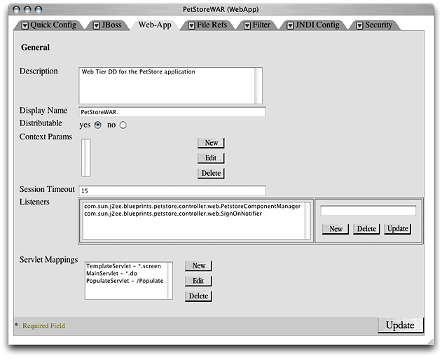
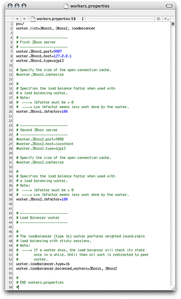

> 导航：[总目录](../../../README.md) · [documentation](../../../_indexes/documentation.md) · [Java Application Server Guide](Introduction%20to%20Java%20Application%20Server%20Guide.md)


[Next](Document%20Revision%20History.md)[Previous](Administering%20Application%20Servers.md)

# Balancing User Load and Replicating Sessions

HTTP load balancing provides a way to distribute user load among a group of application servers. The application servers can be standalone or configured as a cluster, in which case they are know as _nodes_. Load balancing is better used with _sticky sessions_. This means that once the load balancer (a web server) forwards a client request to a particular application server, it sends all further requests from the client to the same application server.

Using load balancing across standalone application servers allows you to scale your deployment with little increase in request-processing overhead. However, when an application server fails, other application servers cannot pick up the failed-server’s load, which may provide an undesirable user experience: Users may have to log in to the application again or may lose the contents of their “shopping carts.”

Load balancing across clustered application servers (or nodes) provides session replication among the nodes, so that when a node fails, another node can take over its duties with little or no user impact. However, as you add nodes to the cluster, each request may take longer to process.

This chapter explains how to enable an application to be distributable among cluster nodes and walks you through configuring HTTP load balancing for Sun’s Pet Store using three computers: One serving only as the web server and load balancer, and the other two serving as application-server nodes.

Before deploying an application in a cluster of nodes using the `deploy-cluster` configuration, make sure that the application is distributable.

To make an application distributable set Distributable to yes in the Web-App pane of the application’s WebApp window. Figure 5-1 shows the WebApp window of the `petstore.ear` archive.

__Figure 5-1__  The WebApp window of the `petstore.ear` archive



Load balancing provides a way to distribute user load among application servers. Clustering enables session failover when a node in a cluster becomes unavailable. Load balancing can be used with a group of standalone application servers or with a cluster or application server or nodes. This section describes a simple, three-computer setup in which one computer runs the web server and balances user load among two application servers.

Start by stopping the Web service on the web-server computer and the application servers on the nodes. Then follow the steps described in the following sections.

Follow these steps to configure a computer as the web server and load balancer for a deployment:

1. Launch Server Admin, if it’s not already running.
2. Select Web in the Computers & Services list, and click Settings in the configuration pane.
3. Click the Modules tab and select “jk_module,” which is at the bottom of the modules list.
4. Click the Sites tab.
5. Double-click the appropriate site in the list (by default there’s only one), which should be enabled.
6. Click the Options tab, and deselect Performance Cache.
7. Click Save.
8. Open `httpd.conf` file, located in `/etc/httpd`, in a text editor.
9. Look for `<IfModule mod_jk.c>`.
10. Add `JKMount /petstore/* loadbalancer` as the last item of the `IfModule` element.

    The `IfModule` element should look similar to this:

```
<IfModule mod_jk.c>
        JKWorkersFile /etc/httpd/workers.properties
        JKLogFile /var/log/httpd/mod_jk.log
        JKLogLevel error
        JKMount /*.jsp JBoss1
        JKMount /servlet/* JBoss1
        JKMount /examples/* JBoss1
        JKMount /petstore/* loadbalancer
</IfModule>
```
11. Save the file.
12. Open the `workers.properties` file, which is also located in `/etc/httpd`, in a text editor.

    The file as configured in OS X Server is shown in Figure 5-2.

    __Figure 5-2__  The `workers.properties` file in `/etc/httpd`

    
13. Change line 2 to:

```
worker.list=loadbalancer
```
14. Change line 8 so that it references the first node. It should look similar to this:

```
worker.JBoss1.host=node1.mydomain.com
```
15. Change line 12 to:

```
worker.JBoss1.cachesize=10
```
16. Uncomment lines 26 through 28.
17. Change line 26 so that it looks like this:

```
worker.JBoss2.port=9007
```
18. Change line 27 so that it references the second node. It should look similar to this:

```
worker.JBoss2.host=node2.mydomain.com
```
19. Change line 31 to:

```
worker.JBoss2.cachesize=10
```
20. Add the following line to the file to enable sticky sessions:

```
worker.loadbalancer.sticky_session=1
```
21. Save the file.

For load balancing to work, each application server has to report its existence to the web server. Follow these steps to configure the application-server so that they identify themselves to the web server:

1. Open the `jboss-service.xml` file, located at `/Library/JBoss/3.2/deploy-cluster/deploy/jbossweb-tomcat41.sar/META-INF`, in a text editor.

   For non-cluster deployment, open the `jboss-service.xml` file at `/Library/JBoss/3.2/deploy-standalone/deploy/jbossweb-tomcat41.sar/META-INF`.
2. Look for the following line:

```
<Engine name="MainEngine" defaultHost="localhost">
```
3. Edit the line so that it looks like this:

```
<Engine jvmRoute="JBoss1" name="MainEngine" defaultHost="localhost">
```
4. Look for the following lines:

```
<!--Connector className="org.apache.coyote.tomcat4.CoyoteConnector"
    port="9007" minProcessors="5" maxProcessors="200" address="0.0.0.0"
    enableLookups="false" acceptCount="50" debug="0"
    connectionTimeout="20000"
    protocolHandlerClassName="org.apache.jk.server.JkCoyoteHandler"/-->
```
5. Remove the `!--` at the beginning of the first line and the `--` and end of the last line while making sure to leave the left angle bracket and the right angle bracket in place.
6. Save the file.
7. Repeat steps 1 through 6 for the second application server, but set `jvmRoute` to `"JBoss2"` in step 3.

Follow these steps to make sure that client requests are balanced among the application servers:

1. Start the Web service in the web-server computer.
2. Start the application server in each of the application-server computers and run the following commands on both:

```shell
$ cd /Library/JBoss/Logs
$ tail -f localhost_access<today's_date_YYYY-MM-DD>.log
```
3. In the web-server computer, connect to `http://<host_name>/petstore/index.jsp`. The first node should show a log entry similar to this:

```
17.203.255.255 - - [26/Sep/2003:15:56:58 -0800] "GET /petstore/index.jsp HTTP/1.1" 200 2769
```
4. Now, access the same URL from another computer. You should see a log entry in the second node.

[Next](Document%20Revision%20History.md)[Previous](Administering%20Application%20Servers.md)

