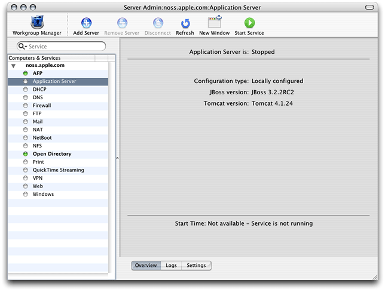
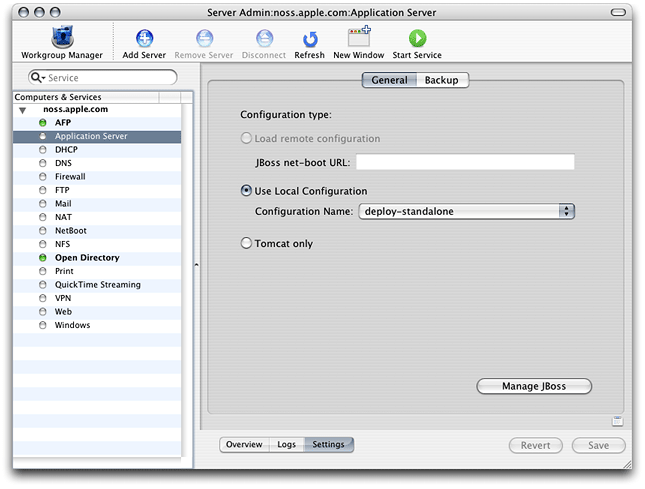
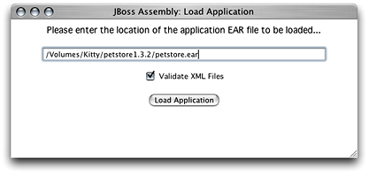
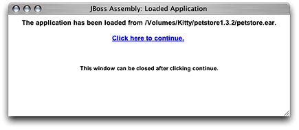
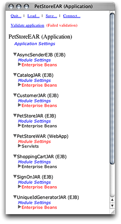
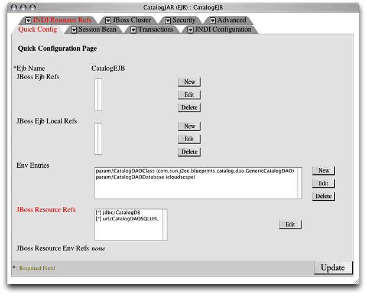
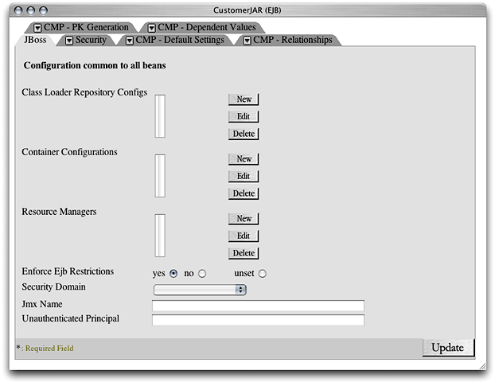
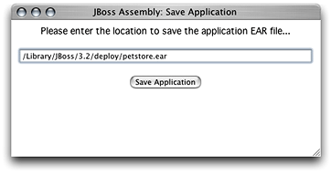

> 导航：[总目录](../../../README.md) · [documentation](../../../_indexes/documentation.md) · [Java Application Server Guide](Introduction%20to%20Java%20Application%20Server%20Guide.md)


[Next](Configuring%20and%20Deploying%20Sun%E2%80%99s%20Pet%20Store.md)[Previous](Application%20Server%20Overview.md)

# Configuring Applications

Before you can deploy an application on an application server, you have to start the application server and then configure or _assemble_ the application. This is the process through which you specify data sources, database mappings, JNDI resources, and so on.

You configure J2EE applications by modifying XML files in `META-INF` and `WEB-INF` directories in application archives. Performing this task manually is tedious and error prone. The JBoss deployment tool allows you to configure applications without having to unarchive EAR files, WAR files, or JAR files, as the tool lets you configure these files directly.

This chapter explains how to start the application server and configure and deploy your application.

To configure an application using the deployment tool, you must connect to a running application server. Follow these steps to start the application server on a computer.

1. Launch Server Admin, located in `/Applications/Server`.
2. In the Computers & Services list, select Application Server.

   
3. In the configuration pane, click Settings. From Configuration Name pop-up menu, choose the appropriate configuration.

   
4. Click the Start Service toolbar button. After a few seconds the application server should be running. You can confirm that JBoss is running by accessing `http://localhost:8080` in your web browser. You should see a webpage titled Welcome to JBoss/Tomcat.

You can also start JBoss in Terminal with the following command:

```
$ /Library/JBoss/3.2/bin/run.sh -c deploy-standalone
```

To get detailed information on JBoss activities, use the `develop` configuration. This is useful when you need to make sure JBoss notices when you deploy or undeploy a module, or when you need to determine whether exceptions are thrown as JBoss starts a deployed application. The `develop` configuration produces a detailed log of JBoss activities. It is more useful when you launch the application server from the command line because you see the results of actions immediately in the Terminal window from which you launch the application server.

The following sections teach you how to start the deployment tool and configure your application.

To start the deployment tool, double-click `DeploymentTool.woa` in `/Library/JBoss/Applications` or enter the following command in Terminal:

```
$ /Library/JBoss/Applications/DeploymentTool.woa/DeploymentTool
```

After a moment, the Load Application window appears.

The Load Application window is where you specify the location of the application or component you want to configure. Although the window is titled Load Application, you can also use the deployment tool to configure EAR files, WAR files, and JAR files.

Figure 2-1 shows the Load Application window.

__Figure 2-1__  The Load Application window of the deployment tool



1. Enter the full path to the file in the text field in the Load Application window, and click Load Application.

   Normally, you cannot save an application with invalid XML files. That is, you have to configure all the elements that show up in red in the main window. You can override this by deselecting Validate XML Files in the Load Application window. However, you may not be able to reload an application that has been saved in this state.

   After the deployment tool loads the application, it displays the Loaded Application window, shown in Figure 2-2.

   __Figure 2-2__  The Loaded Application window

   
2. Click “Click here to continue” to move on.

   The deployment tool displays the main window (also known as the navigation window). The main window presents a hierarchy of components generated from the XML files present in the `META-INF` and `WEB-INF` directories of the components contained in the archive you opened. For example, Figure 2-3 shows the components present in the `petstore.ear` file of Sun Microsystem’s Pet Store application. You must configure the items in red to save the application. [Configuring Your Application’s Components](#apple-f4xwc4dqnrsv64tfmyxwi33df52wszbpkridimbqgazdgmrtfvbuqmrrguwueqkki5cecr2k) shows you how to do this.

__Figure 2-3__  The deployment-tool main window



Figure 2-3 shows the components of the `petstore.ear` archive. The following list describes some of the items in the main window:

- __PetStoreEAR (Application)__ Represents the Pet Store enterprise-application archive.
- __Application Settings__ Clicking this link allows you to configure settings that affect all the modules in the archive when the application is deployed.
- __AsyncSenderEJB (EJB)__ Represents the archive (JAR file) that contains the files that define the AsyncSender enterprise bean (the `asyncsender-ejb.jar` file). Clicking the Module Settings link lets you configure module-wide settings and set default values for some settings for all the enterprise beans defined in the module. See [Configure the Customer Module](Configuring%20and%20Deploying%20Sun%E2%80%99s%20Pet%20Store.md#apple-f4xwc4dqnrsv64tfmyxwi33df52wszbpkridimbqgazdgmrtfvbuqmrrgywueq2jijcumqke) for an example.
- __PetStoreWAR (WebApp)__ Represents the archive (WAR file) that contains the files that define the web module of the Pet Store enterprise application.

To configure a component, you choose it from the main window by clicking the appropriate link. This causes the deployment tool to display the configuration window for the component. As you can see in Figure 2-4, this is a tabbed window that contains one or more panes, which you use to configure specific aspects of the component. The configuration window also contains a Quick Config pane, which contains elements of the component that you must configure for the application to be deployable. Figure 2-4 shows the Quick Config pane of the CatalogEJB module. It indicates that the JBoss resource references must be configured. The JBoss resource references also appear in the JNDI Resource Refs pane. However, you need to configure them in only one of the two panes.

__Figure 2-4__  The Quick Config pane of a component’s configuration window



Some settings apply to an entire module, for example, security roles. In addition, some module settings serve as defaults for settings of individual components in the module. Figure 2-5 shows some of the module settings of the CustomerJAR module of the `petstore.ear` application. Configuring modules settings can help to speed up the configuration of a module. See [Configure Module-Wide Settings](Configuring%20and%20Deploying%20Sun%E2%80%99s%20Pet%20Store.md#apple-f4xwc4dqnrsv64tfmyxwi33df52wszbpkridimbqgazdgmrtfvbuqmrrgywueq2jizaukrck) for an example.

__Figure 2-5__  A module-settings window



After configuring the elements in a pane, you click Update to confirm the changes. Keep in mind that the changes are not saved until you save the application.

To save a configured application, that is, when no components are shown in red in the main window, click Save in the top of the main window. The Save Application window (Figure 2-6) appears.

__Figure 2-6__  The Save Application window of the deployment tool



Enter the destination of the configured application in the text field of the Save Application window, and click Save Application.

To deploy a configured application from the deployment tool, simply save the application to `/Library/JBoss/3.2/deploy` in a single-server deployment or `/Library/JBoss/3.2/farm` in a cluster deployment.

[Next](Configuring%20and%20Deploying%20Sun%E2%80%99s%20Pet%20Store.md)[Previous](Application%20Server%20Overview.md)

