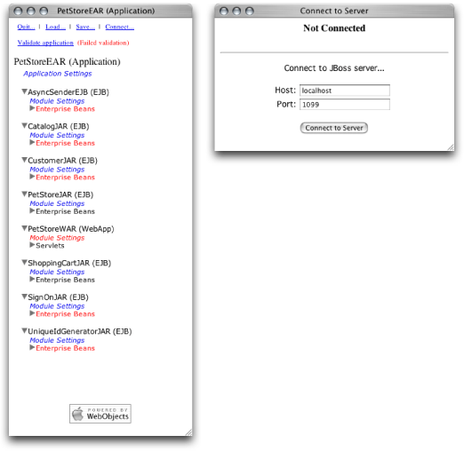
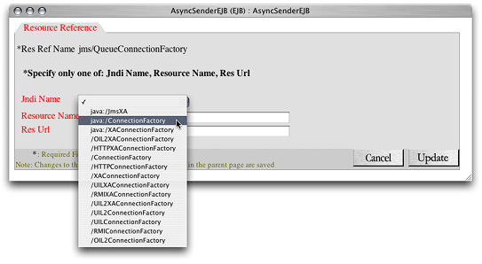
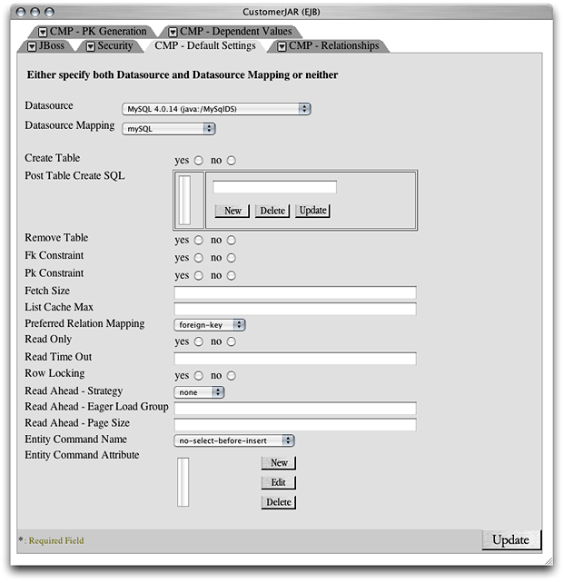
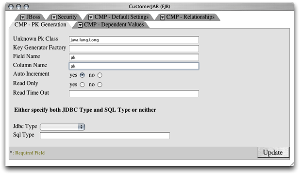

> 导航：[总目录](../../../README.md) · [documentation](../../../_indexes/documentation.md) · [Java Application Server Guide](Introduction%20to%20Java%20Application%20Server%20Guide.md)

[Next](Administering%20Application%20Servers.md)[Previous](Configuring%20Applications.md)

# Configuring and Deploying Sun’s Pet Store

Pet Store is a sample J2EE application from Sun Microsystems. Pet Store showcases the power and flexibility of the J2EE platform. This chapter provides a tutorial on the configuration of Sun’s Pet Store for deployment in OS X Server.

Sun’s Pet Store is comprised of several applications. This tutorial uses the Pet Store enterprise application and the Supplier enterprise application.

In this tutorial you obtain the Pet Store files from Sun, prepare your OS X Server system for a Pet Store deployment, and configure the Pet Store and Supplier applications for deployment on JBoss.

See [http://developer.java.sun.com/developer/releases/petstore](http://developer.java.sun.com/developer/releases/petstore) for more information on Sun’s Pet Store application.

Before you can configure an enterprise application for deployment in OS X Server, make sure that you have all the files you need. Then create any necessary tables in your database, and ensure that the appropriate processes are running:

1. Get Pet Store from Sun.

   Download the Pet Store enterprise application from [http://developer.java.sun.com/developer/releases/petstore](http://developer.java.sun.com/developer/releases/petstore), and place the `petstore1.3.2` directory in your home directory. (Pet Store 1.3.2 is also included as part of this document’s companion files.)
2. Configure MySQL:

   1. Launch MySQL Manager, located in `/Applications/Server`.
   2. Click the lock button, and authenticate as the system administrator.
   3. Click Install and then click Start.
   4. Quit MySQL Manager.
3. Create the Pet Store Tables:

   1. In Terminal, run the `mysql` command-line tool.
   2. Enter `use test` and press Return.
   3. Copy the text in `Application_Server_companion/Pet_Store_resources/create_tables_sql.txt` (in this document’s companion files) to the Clipboard, and paste its contents into the `mysql` command-line tool.
   4. Enter `quit` and press Return.
4. Deploy the `petstore-destinations-service.xml` file.

   To prepare JBoss for running Pet Store, copy the `Application_Server_companion/Pet_Store_resources/petstore-destinations-service.xml` file included in this document’s companion files to `/Library/JBoss/3.2/deploy`.
5. Start the application server.

   You must be running the application server to configure Pet Store. Make sure the application server is running on your computer. See [Starting the Application Server](Configuring%20Applications.md#apple-f4xwc4dqnrsv64tfmyxwi33df52wszbpkridimbqgazdgmrtfvbuqmrrguwueqkkjbeuoqsc) for details.

This section guides you through the steps required to configure the `petstore.ear` file so that it can be deployed in OS X Server. This process involves specifying the data source that enterprise beans use to obtain a connection to the database, mapping the enterprise beans’ CMP fields to table columns, defining relationships among enterprise beans, and so on.

1. Launch the JBoss deployment tool. (See [Starting the JBoss Deployment Tool](Configuring%20Applications.md#apple-f4xwc4dqnrsv64tfmyxwi33df52wszbpkridimbqgazdgmrtfvbuqmrrguwueqkki5cuurcj) for details.)
2. In the Load Application window, enter the full path to the `petstore.ear` file in the text field, and click Load Application.
3. Click “Click here to continue.”
4. In the PetStoreEAR (Application) window (also known as the main window or the navigation window), click Connect.
5. In the Connect to Server window, enter the host name and the port of the application server. (By default the host is `localhost` and the port is `1099`.)

   
6. Click Connect to Server.
7. Close the Connect to Server window.

In this section you configure the settings that affect all the modules in the `petstore.ear` archive.

1. Under PetStoreEAR (Application), click Application Settings.
2. In the PetStoreEAR window, click the JBoss tab.
3. Set J2EE Compliant Class Loading to no, and click Update.
4. Close the window.

1. Under AsyncSenderEJB (EJB), click Enterprise Beans. Then click AsyncSenderEJB.
2. In the AsyncSenderEJB window, select `jms/QueueConnectionFactory` in the JBoss Resource Refs list, and click Edit.
3. From the Jndi Name pop-up menu, choose `java:/ConnectionFactory` , and click Update.

   
4. In the JBoss Resource Env Refs list, select `jms/AsyncSenderQueue` , and click Edit.
5. From the Jndi Name pop-up menu, choose `/queue/supplier/PurchaseOrderQueue`, and click Update.
6. Click Update to finish configuring the AsyncSender enterprise bean, and close the window.

1. Under CatalogJAR (EJB), click Enterprise Beans. Then click CatalogEJB.
2. In the JBoss Resource Refs list in the CatalogEJB window , select `jdbc/CatalogDB`, and click Edit.
3. From the Jndi Name pop-up menu, choose `java:MySqlDS` , and click Update.
4. In the JBoss Resources Refs list in the CatalogEJB window, select `url/CatalogDAOSQLURL` , and click Edit.
5. In the Resource URL text field, enter `http://localhost:8080/petstore/CatalogDAOSQL.xml`, and click Update.
6. Click Update to finish configuring the Catalog enterprise bean, and close the window.

The following sections guide you through the configuration of the Customer module.

This section walks you through setting the data source and data-source mapping for the enterprise beans in the Customer module. It also details how to configure the relationships between some of the enterprise beans.

1. Under CustomerJAR (EJB), click Module Settings.
2. In the CustomerJAR window, click the CMP - Default Settings tab.
3. From the Datasource pop-up menu, choose MySQL 4.0.14 (java:/MySqlDS).
4. From the Datasource Mapping pop-up menu, choose `mySQL`, and click Update.
5. From the Entity Command Name pop-up menu, choose `no-select-before-insert`.

   

   The advantage of configuring the database and the data-source mapping at the module level is that the settings apply to all the enterprise beans in the module. Therefore, you don’t have to configure those settings for each enterprise bean in the module, unless they differ from the ones set for the module.
6. Click the CMP - PK Generation tab.
7. In the Unknown Pk Class text field, enter `java.lang.Long`.
8. In the Field Name text field, enter `pk`.
9. In the Column Name text field, enter `pk`.
10. Set Auto Increment to yes.

    
11. Click the CMP - Relationships tab.
12. Configure the relationships.

    Table 3-1 lists the relationship information for the customer module.

    __Table 3-1__  Relationship information for the Customer module

    | Relationship name | Role name | Column name |
    | CustomerEJB-AccountEJB Relationship | AccountEJB | `account_fk` |
    | ContactInfoEJB-AddressEJB Relationship | AddressEJB | `address_fk` |
    | CustomerEJB-ProfileEJB Relationship | ProfileEJB | `profile_fk` |
    | AccountEJB-ContactInfoEJB Relationship | ContactInfoEJB | `contactInfo_fk` |
    | AccountEJB-CreditCardEJB Relationship | CreditCardEJB | `creditCard_fk` |

    Perform the following steps to configure each relationship listed in Table 3-1.

    1. In the Ejb Relations list, select the relationship to configure, and click Edit.
    2. In the Relationship Roles list, click the corresponding relationship role.
    3. Click New next to the Key Fields list.
    4. In the Field Name text field, enter `pk`.
    5. From the Column Name pop-up menu, choose the name of the appropriate column, and click Update.
    6. Click Update to finish configuring the relationship role.
    7. Click Update to finish configuring the relationship.
13. Click Update to finish configuring the Customer module settings, and close the window.

1. Under CustomerJAR (EJB), click Enterprise Beans. Then click AccountEJB.
2. From the Table Name pop-up menu in the AccountEJB window, choose `PS_Account`.
3. Map the CMP fields to the appropriate column names by selecting the field in the Cmp Fields list, clicking Edit, choosing the corresponding column name from the Column Name list, and clicking Update.
4. Click the CMP - Mapping tab. From the Entity Command Name pop-up menu, choose `mysql-get-generated-keys`.
5. Click Update to finish configuring the Account enterprise bean, and close the window.

1. Under Enterprise Beans under CustomerJAR (EJB), click AddressEJB.
2. From the Table Name pop-up menu in the AddressEJB window, choose `PS_Address`.
3. Map the CMP fields to the appropriate column names by selecting the field in the Cmp Fields list, clicking Edit, choosing the corresponding column name from the Column Name list, and clicking Update.
4. Click the CMP - Mapping tab. From the Entity Command Name pop-up menu, choose `mysql-get-generated-keys`.
5. Click Update to finish configuring the Address enterprise bean, and close the window.

1. Under Enterprise Beans under CustomerJAR (EJB), click ContactInfoEJB.
2. From the Table Name pop-up menu in the ContactInfoEJB window, choose `PS_ContactInfo`.
3. Map the CMP fields to the appropriate column names by selecting the field in the Cmp Fields list, clicking Edit, choosing the corresponding column name from the Column Name list, and clicking Update.
4. Click the CMP - Mapping tab. From the Entity Command Name pop-up menu, choose `mysql-get-generated-keys`.
5. Click Update to finish configuring the ContactInfo enterprise bean, and close the window.

1. Under Enterprise Beans under CustomerJAR (EJB), click CreditCardEJB.
2. From the Table Name pop-up menu in the CreditCardEJB window, choose `PS_CreditCard`.
3. Map the CMP fields to the appropriate column names by selecting the field in the Cmp Fields list, clicking Edit, choosing the corresponding column name from the Column Name list, and clicking Update.
4. Click the CMP - Mapping tab. From the Entity Command Name pop-up menu, choose `mysql-get-generated-keys`.
5. Click Update to finish configuring the CreditCard enterprise bean, and close the window.

1. Under Enterprise Beans under CustomerJAR (EJB), click CustomerEJB.
2. From the Table Name pop-up menu in the CustomerEJB window, choose `PS_Customer`.
3. Map the CMP fields to the appropriate column names by selecting the field in the Cmp Fields list, clicking Edit, choosing the corresponding column name from the Column Name list, and clicking Update.
4. Click Update to finish configuring the Customer enterprise bean, and close the window.

1. Under Enterprise Beans under CustomerJAR (EJB), click ProfileEJB.
2. From the Table Name pop-up menu in the ProfileEJB window, choose `PS_Profile`.
3. Map the CMP fields to the appropriate column names by selecting the field in the Cmp Fields list, clicking Edit, choosing the corresponding column name from the Column Name list, and clicking Update.
4. Click the CMP - Mapping tab. From the Entity Command Name pop-up menu, choose `mysql-get-generated-keys`.
5. Click Update to finish configuring the Profile enterprise bean, and close the window.

1. Under PetStoreWAR (WebApp), click Module Settings.
2. In the JBoss Resource Refs list in the PetStoreWAR window, select `jdbc/CatalogDB`, and click Edit.
3. From the Jndi Name pop-up menu, choose `java:/MySqlDS`, and click Update.
4. In the JBoss Resource Refs list, select `url/CatalogDAOSQLURL`, and click Edit.
5. In the Resource URL text field, enter `http://localhost:8080/petstore/CatalogDAOSQL.xml`, and click Update.
6. Click Update to finish configuring the PetStore web application, and close the window.

1. Under SignOnJAR (EJB), click Module Settings.
2. In the SignOnJAR window, click the CMP - Default Settings tab.
3. From the Entity Command Name pop-up menu, choose `no-select-before-insert`, and click Update.
4. Close the window.

1. Under Enterprise Beans under SignOnJAR (EJB), click UserEJB.
2. From the Datasource pop-up menu in the UserEJB window, choose MySQL 4.0.14 (java:/MySqlDS).
3. From the Datasource Mapping pop-up menu, choose `mySql`.
4. From the Table Name pop-up menu, choose `PS_User`.
5. Map the CMP fields to the appropriate column names by selecting the field in the Cmp Fields list, clicking Edit, choosing the corresponding column name from the Column Name list, and clicking Update.
6. Click Update to finish configuring the User enterprise bean, and close the window.

1. Under UniqueIdGeneratorJAR (EJB), click Enterprise Beans. Then click CounterEJB.
2. From the Datasource pop-up menu in the CounterEJB window, choose MySQL 4.0.14 (java:/MySqlDS).
3. From the Datasource Mapping pop-up menu, choose `mySql`.
4. From the Table Name pop-up menu, choose `PS_Counter`.
5. Map the CMP fields to the appropriate column names by selecting the field in the Cmp Fields list, clicking Edit, choosing the corresponding column name from the Column Name list, and clicking Update.
6. Click Update to finish configuring the Counter enterprise bean, and close the window.

To save the configured PetStore application, click Save in the navigation window and choose a location for it:

1. Using the Finder or Terminal, create a directory under `/Library` named Configured_Apps.
2. In the main window, click Save.
3. In the text field in the Save Application window, enter `/Library/Configured_Apps/petstore.ear`, and click Save Application.
4. Close the window.

The following sections guide you through configuring the Supplier enterprise application.

1. In the PetStoreEAR window, click Load.
2. In the text field in the Load Application window, enter the path to the `supplier.ear` file, and click Load Application or press Return.
3. In the navigation window, click Connect.
4. If the Connect to Server window indicates that you’re not connected to the application server, click Connect to Server.
5. Close the Connect to Server window.

1. Under SupplierEAR (Application), click Application Settings.
2. In the SupplierEAR window, click the JBoss tab.
3. Set J2EE Compliant Class Loading to no, and click Update.
4. Close the window.

The following sections explain how to configure the SupplierJAR module.

1. Under SupplierJAR (EJB), click Module Settings.
2. In the SupplierJAR window, click the CMP - Default Settings tab.
3. From the Datasource pop-up menu, choose MySQL 4.0.14 (java:/MySqlDS).
4. From the Datasource Mapping pop-up menu, choose `mySql`, and click Update.
5. Close the window.

1. Under SupplierJAR (EJB), click Enterprise Beans. Then click InventoryEJB.
2. From the Table Name pop-up menu, choose `SUPP_Inventory`.
3. Map the CMP fields to the appropriate column names by selecting the field in the Cmp Fields list, clicking Edit, choosing the corresponding column name from the Column Name list, and clicking Update.
4. Click Update to finish configuring the Inventory enterprise bean, and close the window.

1. Under Enterprise Beans under SupplierJAR (EJB), click OrderFulfillmentFacade.
2. In the JBoss Resource Refs list in the OrderFulfillmentFacadeEJB window, select `url/EntityCatalogURL`, and click Edit.
3. In the Res URL text field, enter `http://localhost:8080/opc/EntityCatalog.jsp`, and click Update.
4. Click Update to finish configuring the OrderFulfillmentFacade enterprise bean, and close the window.

1. Under Enterprise Beans under SupplierJAR (EJB), click SupplierOrderMDB.
2. In the JBoss Resource Refs list, select `jms/QueueConnectionFactory`, and click Edit.
3. From the Jndi Name pop-up menu, choose `/ConnectionFactory`, and click Update.
4. In the JBoss Resource Refs list, select `jms/TopicConnectionFactory`, and click Edit.
5. From the Jndi Name pop-up menu, choose `/ConnectionFactory`, and click Update.
6. In the JBoss Resource Env Refs list, select `jms/opc/InvoiceTopic`, and click Edit.
7. From the Jndi Name pop-up menu, choose `/topic/opc/InvoiceTopic`, and click Update.
8. Click Update to finish configuring the SupplierOrder message-driven bean, and close the window.

These sections explain how to configure the SupplierPurchaseOrderJAR module.

1. Under SupplierPurchaseOrderJAR (EJB), click Module Settings.
2. In the SupplierPurchaseOrderJAR window, click the CMP - Default Settings tab.
3. From the Datasource pop-up menu, choose MySQL 4.0.14 (java:/MySqlDS).
4. From the Datasource mapping pop-up menu, choose `mySql`.
5. From the Entity Command Name pop-up menu, choose `no-select-before-insert`.
6. Click the CMP - PK Generation tab.
7. In the Unknown Pk Class text field, enter `java.lang.Long`.
8. In the Field Name text field, Enter `pk`.
9. In the Column Name text field, enter `pk`.
10. Set Auto Increment to yes, and click Update.
11. Close the window.

1. Under SupplierPurchaseOrderJAR (EJB), click Enterprise Beans. Then click AddressEJB.
2. From the Table Name pop-up menu in the AddressEJB window, choose `PS_Address`.
3. Map the CMP fields to the appropriate column names by selecting the field in the Cmp Fields list, clicking Edit, choosing the corresponding column name from the Column Name list, and clicking Update.
4. Click the CMP - Mapping tab. From the Entity Command Name pop-up menu, choose `mysql-get-generated-keys`.
5. Click Update to finish configuring the Address enterprise bean, and close the AddressEJB window.

1. Under Enterprise Beans under SupplierPurchaseOrderJAR (EJB), click ContactInfoEJB.
2. From the Table Name pop-up menu in the ContactInfoEJB window, choose `PS_ContactInfo`.
3. Map the CMP fields to the appropriate column names by selecting the field in the Cmp Fields list, clicking Edit, choosing the corresponding column name from the Column Name list, and clicking Update.
4. Click the CMP - Mapping tab. From the Entity Command Name pop-up menu, choose `mysql-get-generated-keys`.
5. Click Update to finish configuring the ContactInfo enterprise bean, and close the window.

1. Under Enterprise Beans under SupplierPurchaseOrderJAR (EJB), click LineItemEJB.
2. From the Table Name pop-up menu in the LineItemEJB window, choose `SUPP_LineItem`.
3. Map the CMP fields to the appropriate column names by selecting the field in the Cmp Fields list, clicking Edit, choosing the corresponding column name from the Column Name list, and clicking Update.
4. Click the CMP - Mapping tab. From the Entity Command Name pop-up menu, choose `mysql-get-generated-keys`.
5. Click Update to finish configuring the LineItem enterprise bean, and close the window.

1. Under Enterprise Beans under SupplierPurchaseOrderJAR (EJB), click SupplierOrderEJB.
2. From the Table Name pop-up menu in the SupplierOrderEJB window, choose `SUPP_SupplierOrder`.
3. Map the CMP fields to the appropriate column names by selecting the field in the Cmp Fields list, clicking Edit, choosing the corresponding column name from the Column Name list, and clicking Update.
4. Click the CMP - Mapping tab. From the Entity Command Name pop-up menu, choose `mysql-get-generated-keys`.
5. Click Update to finish configuring the SupplierOrder enterprise bean, and close the window.

1. Under SupplierWAR (WebApp), click Module Settings.
2. In the JBoss Resource Env Refs list, select `jms/opc/InvoiceTopic`, and click Edit.
3. From the Jndi Name pop-up menu, choose `/topic/opc/InvoiceTopic`, and click Update.
4. In the JBoss Resource Refs list, select `jms/TopicConnectionFactory`, and click Edit.
5. From the Jndi Name pop-up menu, choose `/ConnectionFactory`, and click Update.
6. Click Update to finish configuring the Supplier web-application module, and close the window.

1. In the navigation window, click Save.
2. In the text field in the Save Application window, enter `/Library/Configured_Apps/supplier.ear`, and click Save Application.
3. Close the window.

To deploy Pet Store in OS X Server, copy the configured files to `/Library/JBoss/3.2/deploy`. (You can also use the management tool to deploy the application. See [Deploying Applications](Administering%20Application%20Servers.md#apple-f4xwc4dqnrsv64tfmyxwi33df52wszbpkridimbqgazdgmrtfvbuqmrrg4wugsscirdesqkh) for details.) After about a minute, open `http://localhost:8080/petstore` in your web browser. You could also have saved the EAR files directly to the JBoss `deploy` directory. However, it’s generally safer to configure application files of undeployed archives.

Follow these steps to test Pet Store:

1. Open `http://localhost:8080/petstore` in a web-browser window.
2. Click the link that takes you to the store.
3. In the Welcome to the BluePrints Petstore webpage, click Birds.
4. In the Items webpage, click Amazon Parrot.
5. In the Product webpage, click Add to Cart.
6. In the Cart webpage, click Check Out.
7. In the Sign On webpage, click Sign In.
8. In the Enter Order Information webpage, click Submit.

If you get an error page during the test, make sure JBoss is running and recheck the configuration settings described in [Configure the Pet Store Enterprise Application](#apple-f4xwc4dqnrsv64tfmyxwi33df52wszbpkridimbqgazdgmrtfvbuqmrrgywueq2ji5besq2h) and [Configure the Supplier Enterprise Application](#apple-f4xwc4dqnrsv64tfmyxwi33df52wszbpkridimbqgazdgmrtfvbuqmrrgywueq2jizbeurkc).

[Next](Administering%20Application%20Servers.md)[Previous](Configuring%20Applications.md)

