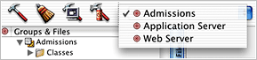
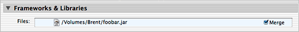
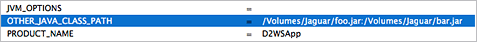
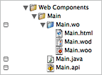
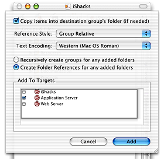
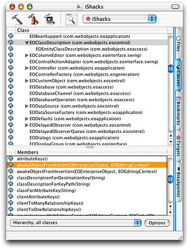

> 导航：[总目录](../../README.md) · [documentation](../../_indexes/documentation.md)


# Project Builder for WebObjects Developers

This document supplements the main Project Builder documentation which is located at [http://developer.apple.com/documentation/DeveloperTools/index.html](https://developer.apple.com/documentation/DeveloperTools/index.html). It provides information that is specific to WebObjects projects. It is divided into the following sections:

- [Project Types](#apple-f4xwc4dqnrsv64tfmyxwi33df52wszbpkridgmbqgaytamjufvbuqmrqgiwugscei5eusrkc) describes the kinds of WebObjects projects you can create using Project Builder.
- [File Types](#apple-f4xwc4dqnrsv64tfmyxwi33df52wszbpkridgmbqgaytamjufvbuqmrqgiwugsceijeuorkj) describes the WebObjects-specific file types.
- [Targets](#apple-f4xwc4dqnrsv64tfmyxwi33df52wszbpkridgmbqgaytamjufvbuqmrqgiwugscejjdekqsd) describes the concept of targets in Project Builder and how they relate to WebObjects projects.
- [Build Styles](#apple-f4xwc4dqnrsv64tfmyxwi33df52wszbpkridgmbqgaytamjufvbuqmrqgiwugscejjeucq2d) describes the concept of build styles in Project Builder and how they relate to WebObjects projects.
- [Third-Party JAR Files](#apple-f4xwc4dqnrsv64tfmyxwi33df52wszbpkridgmbqgaytamjufvbuqmrqgiwugscei5aueqki) describes how to add third-party JAR files to WebObjects projects.
- [Groups and Folder References](#apple-f4xwc4dqnrsv64tfmyxwi33df52wszbpkridgmbqgaytamjufvbuqmrqgiwugsceijcuurkk) describes the different types of groupings Project Builder provides.
- [Rapid Turnaround](#apple-f4xwc4dqnrsv64tfmyxwi33df52wszbpkridgmbqgaytamjufvbuqmrqgiwugsceijbemrkg) describes the rapid turnaround feature of WebObjects and how it relates to Project Builder.
- [Documentation Lookup](#apple-f4xwc4dqnrsv64tfmyxwi33df52wszbpkridgmbqgaytamjufvbuqmrqgiwugscejfcugrki) describes how to use Project Builder's documentation lookup in WebObjects projects.
- [Renaming Projects](#apple-f4xwc4dqnrsv64tfmyxwi33df52wszbpkridgmbqgaytamjufvbuqmrqgiwugscejjaugr2k) tells you how to rename WebObjects projects.

WebObjects provides a number of templates you use when creating new WebObjects projects. They are described in [Table 1-1](#apple-f4xwc4dqnrsv64tfmyxwi33df52wszbpkridgmbqgaytamjufvbuqmrqgiwugsceirbeoskj).

__Table 1-1__  WebObjects project types

| Project type | Description |
| Cocoa Enterprise Objects Application | Creates a two-tier Cocoa Java application that uses Enterprise Objects as a data access mechanism. It allows you to use Enterprise Objects within Interface Builder so that you can build nib files that display data from an application's enterprise object instances. See the note at the end of this table. |
| Direct to Java Client Application (Three Tier) | Creates a three-tier application that includes both a server-side application and a client-side application. The client application uses the Java Swing toolkit as the user interface. The user interface is generated dynamically with the help of the WebObjects rule system. |
| Direct to Web Application | Creates an HTML WebObjects application that uses the WebObjects rule system to dynamically generate an HTML user interface based on the application's data models. |
| Direct to Web Services Application | Creates an application that allows you to use the Web Services Assistant to build an application that vends Web services based on an application's data models. |
| Display Group Application | Creates an HTML WebObjects application with a single component that contains a WODisplayGroup dynamic element that you initially configure with the new project assistant. It is useful for quickly building a read-only application that you can use to browse data. |
| Enterprise JavaBean Framework | Creates a reusable framework of enterprise beans that can be shared among many WebObjects applications. To use an enterprise bean in a WebObjects application, it must be part of a framework against which the application links; this project type provides a template for building that kind of framework. |
| Java Client Application (Three Tier) | Creates a three-tier application that includes both a server-side application and a client-side application. The client application uses the Java Swing toolkit as the user interface. The user interface is built with nib files using Interface Builder. |
| WebObjects Application | Creates an HTML WebObjects application. The default project includes a single WOComponent file called Main. |
| WebObjects Framework | Creates a reusable framework that can be shared among many WebObjects applications. The project template creates a project that includes the three standard WebObjects targets and that links to the core WebObjects frameworks. The project template does not add any files to the project. |

WebObjects provides a number of templates you use when creating new WebObjects projects. They are described in [Table 1-2](#apple-f4xwc4dqnrsv64tfmyxwi33df52wszbpkridgmbqgaytamjufvbuqmrqgiwugsceizeusr2j).

__Table 1-2__  WebObjects new file types

| File type | Description |
| Cocoa Enterprise Objects Interface | Creates a standard nib file. It differs from the Java Client Interface file type in that this type of nib file isn't translated to Swing when saving. |
| Component | Adds a new WOComponent file to a project. |
| Display Group Component | Creates a WOComponent file that contains a WODisplayGroup dynamic element that you can configure with the assistant. |
| Enterprise JavaBean | Creates and configures an enterprise bean. |
| Java Class | Adds a new Java class file to a project. |
| Java Client Interface | Creates a nib file that, when saved, is translated into Swing. It differs from the Cocoa Enterprise Objects Interface file type only in this regard. |

Project Builder uses targets to know how to build applications. A target is like the instructions for building a model from the parts in a kit. Each target builds one, and only one, product. Some common types of products are frameworks, libraries, applications, and command-line tools. A target consists of a list of files from your project and instructions for transforming them into a product. If you want to build more than one type of product, you need more than one target.

WebObjects applications need more than one target because the product of a WebObjects application has two parts. One part is the application executable, which runs on the application server, and includes an application's dynamically generated components. The other part is the application's client-side resources, which include images, movies, and other types of resources that can be accessed through a "normal" URL. Client-side resources are made available to the client through a Web server rather than through the application server.

WebObjects projects identify which parts of a project to build for the application server by looking for project resources that are associated with the Application Server target. Resources that are associated with the Web Server target are built as part of the product for the Web Server target. Java Client applications also use the Web Server target to identify nib files and Java class files that are part of the client-side Java application.

All WebObjects application project types (excluding the Cocoa Enterprise Objects Application type) include three targets: the Application Server target, the Web Server target, and an aggregate or root target with the same name as the application. Aggregate targets are used to group two or more build targets into a single unit. When an aggregate target is built, the build targets it contains are built in turn.

Targets appear in a project's targets pop-up menu as shown in Figure 1-1.

__Figure 1-1__  Target pop-up menu



You usually don't need to think about a project's targets except when adding files to a project. Follow these guidelines when adding new files to a project to ensure they get built with the correct product:

- Java Client resources (such as nib files and custom controller classes) must always be associated with the Web Server target.
- Rule files (`.d2wmodel` files) must be associated with the Application Server target.
- Server-side enterprise object classes (entities for which you use custom classes) must be associated with the Application Server target.
- Client-side enterprise object classes (entities for which you use custom classes) must be associated with the Web Server target.
- Nondynamic resources (such as images) that are displayed in the client application (either in a Web browser within HTML markup or in Swing in a Java Client application), must be associated with the Web Server target.
- Any frameworks your project links against should usually be associated with both the Application Server and the Web Server target.
- WOComponent files and D2WComponent files must always be associated with the Application Server target.
- EOModel files must always be associated with the Application Server target.
- No element of any project should be associated explicitly with the project's aggregate target, except third-party JAR files.
- JAR files that are individually added to a project (they are not in a framework) must be associated with the aggregate target and the Application Server target. If the JAR file is used in the client-side application of a Java Client application, it must also be associated with the Web Server target.

Here's a short list of what you need to know about targets:

- Every file in a project must be associated with at least one target.
- No files in a project are explicitly associated with the aggregate target except third-party JAR files.
- You should never rename targets.

A build style is a variation for building a target in slightly different ways. It lets you override some of a target's build settings without needing to create a new target. WebObjects projects include three build styles, which differ primarily in where a project's products are installed:

- __Development__—This build style builds an application into a `.woa` bundle that includes both the application's Web Server resources and Application Server resources (not a split install). The `.woa` is installed in the project's build directory, which by default is the project's root directory.
- __Deployment__—This build style builds an application into a `.woa` bundle that includes both the application's Web Server resources and Application Server resources (not a split install). The `.woa` is installed in the directory specified by the `INSTALL_PATH` target setting, which by default is set to `/Library/WebObjects/Applications`.
- __WebServer__—This build style installs the application's Web Server resources into the Web server's document root directory (a split install). When building an application with the WebServer build style, you must also build it with the Deployment build style to install the application's `.woa`.

If a project contains JAR files that are not located in a framework against which the project links or that are not located in `/Library/WebObjects/Extensions`, you must either add the JAR files to an application's class path or merge the JAR files at build time.

To merge JAR files at build time, first add a JAR file to your project and associate it with the aggregate target and at least the Application Server target or the Web Server target (both are possible if the JAR files are used in the client-side application of a Java Client application). Then, from the targets pop-up menu, select the target with which you associated the JAR files and choose Edit Active Target from the Project menu. In the Build Phases group, select Frameworks and Libraries. Select Merge for each JAR file, as shown in Figure 1-4. Make sure to repeat this process for each target with which you associate a JAR file.

__Figure 1-2__  Merging JAR files



Alternatively, you can add JAR files to an application's classpath by providing a colon-separated list of paths to JAR files in a target's `OTHER_JAVA_CLASS_PATH` build setting. This isn't a default build setting so you have to add it in the expert view setting of a project's target, as Figure 1-3 illustrates.

__Figure 1-3__  `OTHER_JAVA_CLASS_PATH` build setting



Project Builder provides two mechanisms to group files together in projects: groups and folder references.

A group is a collection of related files, which can contain any number of files, frameworks, libraries, and other groups—it is an arbitrary grouping of things in a project. In the Files list, a group is displayed as a yellow folder. A group may or may not correlate directly to a specific location in the file system; it may exist only within a particular project. The contents of a group are not necessarily related and they don't necessarily reflect their location in the file system.

A folder reference represents the location of a directory in the file system; its contents are treated as one unit. This kind of grouping is useful if you need to manipulate the folder as a whole but not the items within it. In the Files list, a folder reference is displayed as a blue folder.

The complete set of files that define a WOComponent (the component's `.wo` file, `.java` file, and `.api` file) are represented by a group in a project. A WOComponent's `.wo` file (which contains its `.html`, `.wod`, and `.woo` files) is represented as a folder reference. A WOComponent group, then, contains `.wo` file (a folder reference), a `.java` file, and a `.api` file. The elements of a WOComponent named `Main` is shown in Figure 1-4.

__Figure 1-4__  A WOComponent's elements



When you add a WOComponent (a `.wo` file) to a project in a way other than selecting Component from the WebObjects group in the New File pane of the assistant, you should select the option to copy the item into the destination group's folder, select the option to create folder references for any added folders, and select the Application Server target. These options are shown in Figure 1-5. The added WOComponent is then displayed as a blue folder in the files list (it is a folder reference).

__Figure 1-5__  Adding a `.wo` to a project



You then also need to add the WOComponent's corresponding `.java` file and `.api` file. You should create a group with the same name as the WOComponent, move the already added `.wo` file into the group, and then add the component's `.java` file and `.api` file to that group.

Another thing to consider when adding any file to a project is the reference style. The sheet that displays the options for adding files to a project includes a pop-up menu called Reference Style. You should always change the reference style for any file you add to a project to any style except Absolute Path or Default (which is Absolute Path). Otherwise, when you work on a project on another computer, files that have a reference style of Absolute Path won't be available. You can change a file's reference style in the Info window for a particular file. See Project Builder's help for more information on reference styles.

Folder references in Project Builder have a few subtle characteristics. When you add or remove a file from a folder in the file system, this change isn't immediately reflected in the folder reference in Project Builder. You must close the folder reference and then reveal the folder reference to refresh what it displays in the Files list. If you delete a group that contains a WOComponent, although the WOComponent disappears from the Files list, the component's `.wo` file is not removed from the file system.

Rapid turnaround is a feature of WebObjects that provides a number of conveniences during application development, including these:

- You don't have to perform an install build to test an application.
- You can make changes to WOComponents, rule models, and static resources in a project and see the changes in the application without needing to rebuild the project or restart the application.
- You don't need to run the application through a Web server, which among other things allows you to develop and test applications on the same computer.

In most cases, you don't need to think about rapid turnaround or do anything to get it to work. As long as a project is open in Project Builder, rapid turnaround should be available for it. If you experience problems using rapid turnaround, it may help to know how it works so you can know where to start troubleshooting.

Here's how rapid turnaround works in Mac OS X with Project Builder:

- When WebObjects Builder opens a component, it first attempts to find that component's project by asking Project Builder.
- If Project Builder returns a project for the component, rapid turnaround parses all of the project's source files and opens all the project's EOModel files.
- For each framework in a project, rapid turnaround looks for a file called `pbdevelopment.plist`, which contains the path to the project. If this file is found, rapid turnaround asks Project Builder if the project specified in that path is open. If it is, rapid turnaround parses all of the framework's source files and opens all of its EOModel files.
- If the `pbdevelopment.plist` file is not found in a framework, (which is the case for the core WebObjects frameworks that you import but don't build or have the source code to), or it is found but the project it references is not open in Project Builder, rapid turnaround finds and opens all of the EOModel files in the project that contains the framework.

To ensure that your frameworks are prepared for rapid turnaround, build them, which adds a `pbdevelopment.plist` file to them if necessary. If a project is not open in Project Builder, rapid turnaround is not available for it. This also means that if you make a change to an installed framework, those changes won't be reflected in WebObjects Builder or another client of rapid turnaround until you rebuild and reinstall the framework.

Project Builder includes a number of ways to find documentation. You can find documentation for an identifier in an editor window by Option–double-clicking it or by using the Find pane. You can browse classes and interfaces using the class browser and you can access documentation for those classes and interfaces from within the class browser, too. Starting with the December 2002 release of Project Builder, Java projects in Project Builder take advantage of all these features.

The class browser is shown in Figure 1-6.

__Figure 1-6__  Class browser



The top pane of the class browser displays classes and interfaces. Classes and interfaces for which Project Builder found documentation appear with the blue book icon next to them. In Figure 1-6, the EOClassDescription class is selected in the top pane of the browser. Selecting that class displays its members in the lower pane of the class browser. Again, methods for which Project Builder found documentation appear with the blue book icon next to them. Double-clicking a member opens the documentation viewer and displays the API reference for the selected member.

To enable these features for WebObjects projects, however, you must set a command-line default that tells the indexer to also index the JAR files in the WebObjects frameworks. Copy and paste this command on the command line:

```
defaults write com.apple.ProjectBuilder PBXIndexJavaPackages '(
"/System/Library/Frameworks/JavaVM.framework/Classes/
classes.jar#java", "/System/Library/Frameworks/JavaEOControl.framework/Resources/Java/javaeocontrol.jar#", "/System/Library/
Frameworks/JavaEOAccess.framework/Resources/Java/javaeoaccess.jar#",
"/System/Library/Frameworks/
JavaDirectToWeb.framework/Resources/Java/javadirecttoweb.jar#",
"/System/Library/Frameworks/
JavaEOApplication.framework/Resources/Java/javaeoapplication.jar#",
"/System/Library/Frameworks/
JavaEODistribution.framework/Resources/Java/javaeodistribution.jar#",
"/System/Library/Frameworks/
JavaEOGeneration.framework/Resources/Java/javaeogeneration.jar#",
"/System/Library/Frameworks/JavaEOInterface.framework/
Resources/Java/javaeointerface.jar#",
"/System/Library/Frameworks/JavaEOInterfaceSwing.framework/Resources/Java/
javaeointerfaceswing.jar#",
"/System/Library/Frameworks/JavaFoundation.framework/Resources/Java/javafoundation.jar#", "/
System/Library/Frameworks/JavaEORuleSystem.framework/Resources/
Java/javaeorulesystem.jar#", "/System/Library/
Frameworks/JavaWebObjects.framework/Resources/Java/javawebobjects.jar#",
"/System/Library/Frameworks/
JavaJDBCAdaptor.framework/Resources/Java/javajdbcadaptor.jar#",
"/System/Library/Frameworks/JavaJNDIAdaptor.framework/
Resources/Java/javajndiadaptor.jar#",
"/System/Library/Frameworks/JavaWebServicesClient.framework/Resources/Java/
javawebservicesclient.jar#",
"/System/Library/Frameworks/JavaWebServicesGeneration.framework/Resources/Java/
javawebservicesgeneration.jar#",
"/System/Library/Frameworks/JavaWebServicesSupport.framework/Resources/Java/
javawebservicessupport.jar#",
"/System/Library/Frameworks/JavaWOExtensions.framework/Resources/Java/
JavaWOExtensions.jar#",
"/System/Library/Frameworks/JavaWOJSPServlet.framework/
Resources/Java/javawojspservlet.jar#", "/
System/Library/Frameworks/JavaWOSMIL.framework/Resources/Java/javawosmil.jar#",
"/System/Library/Frameworks/
JavaWebServicesClient.framework/Resources/Java/javawebservicesclient.jar#",
"/System/Library/Frameworks/
JavaXML.framework/Resources/Java/javaxml.jar#")'
```


To learn how to rename WebObjects projects built with Project Builder in Mac OS X, see the KBase article 75297 at [http://www.apple.com/support](http://www.apple.com/support).

