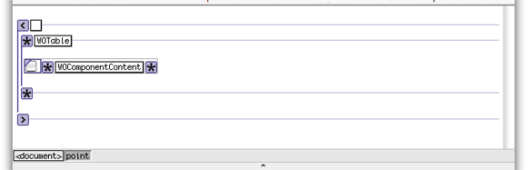
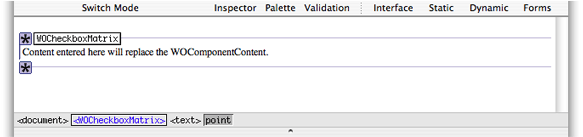
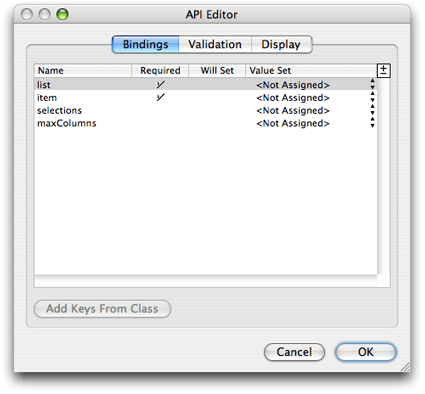
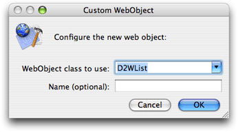
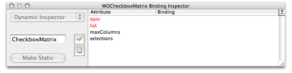

> 导航：[总目录](../../../README.md) · [documentation](../../../_indexes/documentation.md) · [WebObjects Builder User Guide](Introduction%20to%20WebObjects%20Builder.md)

[Next](Validating.md)[Previous](Working%20With%20Palettes.md)

# Custom Components

Custom components are reusable components that have some business logic and custom bindings. Any component that you define, whether it represents an entire page or part of a page, can be reused by any HTML-based WebObjects application and in any other WebObjects component. A reusable component can be used in multiple pages or even multiple times in the same page.

Typically, you use custom components to implement headers, footers, and any custom user interface component, such as a navigation bar, that you use repeatedly in your pages.

For example, all of the components in the WebObjects Extensions framework are custom components and are an excellent source of sample code. The source code for the `JavaWOExtensions.framework`is located in `/Developer/Examples/JavaWebObjects/Source/JavaWOExtensions`.

Custom components are partial documents defined in a single `.wo` folder. You reuse them by adding them first to your project and then to your component. You can add the `.wo` folder to your project directly or add a framework containing the component to your project.

You add custom components to your component using the custom WebObjects element in WebObjects Builder. You can also create palettes containing custom components and drag them from the palette to your component. However, not all palette items are custom components. Some palette items, like the Repeated Header on the PremadeElements palette, are just components built from existing elements.

This chapter explains how to build custom components and reuse them in your applications.

First you create your component in WebObjects Builder and add your business logic to the Java file. You can use the WOComponentContent and WOSwitchComponent elements to help you construct complex components. If you have custom bindings, you use the API Editor in WebObjects Builder to specify them.

Create a new component using WebObjects Builder and add it to your project.

Custom components that are added to other components must be partial documents. This way WebObjects Builder does not wrap `<HTML>`, `<HEAD>`, and `<BODY>` tags around the component when it is added to the parent component. Read [Body and Document](Working%20With%20Static%20Elements.md#apple-f4xwc4dqnrsv64tfmyxwi33df52wszbpkridimbqgazdgnbxfvjvomy) for how to change a component to a partial document.

If your component is a container, use WOComponentContent to represent the content that is placed in the container. Since WOComponentContent is just a placeholder, it has no bindings. For example, `WOCheckboxMatrix.wo` in the WebObjects Extensions framework uses a WOComponentContent element to represent the content that appears in the table cells as show in Figure 7-1.

__Figure 7-1__  The graphical view of WOCheckboxMatrix

Figure 7-2 shows what a WOCheckboxMatrix looks like when added to your component. You add a WOCheckboxMatrix by dragging it from the WOExtensions palette. Any content you enter inside the WOCheckboxMatrix boundary replaces the WOComponentContent in the `WOCheckboxMatrix.wo` when rendered. Hence, you can use only one WOComponentContent per custom component.

__Figure 7-2__  Adding a WOCheckboxMatrix

WOSwitchComponent is similar to WOComponentContent except that WOSwitchComponent can have dynamic content. WOSwitchComponent has a single binding called `WOComponentName`. You bind WOComponentName to a variable or method in your component that returns a String. Using a WOSwitchComponent is useful when you have more than two choices for the content of your component. If you have just two choices, you can use a WOConditional.

Another advantage of using a WOSwitchComponent is that any additional bindings added to the element are passed on to the chosen component (the component that replaces the WOSwitchComponent when rendered). Hence, all the components that might replace the WOSwitchComponent should be key-value coding compliant—respond to `takeValueforKey()` without throwing an exception.

You use the API Editor to define your custom bindings. You can specify the binding name, the value type, and validation rules, You can even specify an image to display when your component is added to another component. Follow these steps to configure your component using the API Editor:

1. Choose Window > API

   The API Editor window appears. Figure 7-3 shows what the API Editor window looks like for the WOCheckboxMatrix component.

   __Figure 7-3__  The API Editor

   
2. Select "Add binding" from the +/- menu in the upper-right corder of the table to add a binding.
3. Enter the name of the binding in the Name column.
4. Click in the Required column if the binding is required.
5. Choose a value from the Value Set pop-up menu if you know or want to restrict the type.
6. Click Validation to configure additional validation checks.
7. Click Display to set the image representation of the component.

Before using a component it needs to be added to your project. You can either add the component to a framework and include that framework in your project, or add the component directly to your project.

Some WebObjects frameworks—for example, `JavaWOExtensions.framework` and `JavaDirectToWeb.framework`—already contain custom components that you can reuse. If these frameworks are added to your project, their components are already available. Read _Xcode 2.2 User Guide_for more information on creating your own frameworks.

Follow these steps to add an existing component directly to your project:

1. Drag the component (a folder with a `.wo` extension) from the Finder or Desktop to your component window.

   A panel appears asking if you want to add the component to your project.
2. Click Yes.

   The component is copied to your project folder and added to the Web Components group in Xcode. A custom element appears in your component window at the insertion point.
3. Select the component and open the inspector to bind its attributes.

Follow these steps to add a custom element to your component:

1. Choose Dynamic > Custom.

   A Custom WebObject panel appears prompting you for more information as show in Figure 7-4.

   __Figure 7-4__  The custom WebObject panel

   
2. Select the web component class from the "WebObject class to use" combo box menu.

   The menu contains all components that are in the current project and its frameworks. For example, the WOAnyField and WOCheckBox components contained in the menu are defined in `JavaWOExtensions.framework`.
3. Alternatively, you can enter the component's class name in the combo box text field.
4. Optionally, enter the component's name in the Name text field.

   WebObjects Builder gives each instance of a component a unique name that appears in the `.wod` file that appears in Source mode. Enter a name in the Name field if you want to use a different logical name.

Many of the standard palettes, described in [Working With Palettes](Working%20With%20Palettes.md#apple-f4xwc4dqnrsv64tfmyxwi33df52wszbpkridimbqgazdgnjzfvjvomi) also contain reusable components. To add a custom element from a palette, drag the element from the palette to your component window. Read [Working With Palettes](Working%20With%20Palettes.md#apple-f4xwc4dqnrsv64tfmyxwi33df52wszbpkridimbqgazdgnjzfvjvomi)for how to create your own palettes.

A component that is designed for reuse can export keys and actions, which become attributes that you can bind, just as you would bind the attributes of any other dynamic element. When the component is added to your component, these attributes show up in the inspector as shown in Figure 7-5. The `item` and `list` bindings appears in red because they were specified as required using the API Editor in [Figure 7-3](#apple-f4xwc4dqnrsv64tfmyxwi33df52wszbpkridimbqgazdkmbqfvjvoni).

__Figure 7-5__  The WOCheckboxMatrix Binding Inspector

If the custom bindings do not appear, read [Adding Bindings](Working%20With%20Dynamic%20Elements.md#apple-f4xwc4dqnrsv64tfmyxwi33df52wszbpkridimbqgazdgnbzfvjvomzq) for steps to add them using the inspector. If you are adding your own custom component, then read [Using the API Editor](#apple-f4xwc4dqnrsv64tfmyxwi33df52wszbpkridimbqgazdkmbqfvjvomq).

[Next](Validating.md)[Previous](Working%20With%20Palettes.md)

