> 导航：[总目录](../../../README.md) · [documentation](../../../_indexes/documentation.md) · [WebObjects Builder User Guide](Introduction%20to%20WebObjects%20Builder.md)

[Next](Working%20With%20Static%20Elements.md)[Previous](Getting%20Started%20With%20WebObjects%20Builder.md)

# Editing Components

You can edit your web component in WebObjects Builder using either the graphical editor in Layout mode or the HTML source editor in Source mode. For your convenience, you can easily switch from Layout mode to Source mode. Read [Getting Started With WebObjects Builder](Getting%20Started%20With%20WebObjects%20Builder.md#apple-f4xwc4dqnrsv64tfmyxwi33df52wszbpkridimbqgazdgmzsfvjvomi) for a description of the component window, commands, menus and different types of modes. This chapter describes how to add elements to your component and use other basic editing functions.

A dynamic web page or part of a web page is represented by a web component. A web component consists of elements, some static, some dynamic, some with HTML counterparts, and others that are completely unique to WebObjects.

WebObjects Builder allows you to add most of the common HTML elements to a component by using its graphical editing tools. You can type text directly into a component window and you can add additional HTML elements using the buttons and menus in WebObjects Builder. HTML elements are called _static elements_.

In addition, you can add dynamic elements, whose look and behavior are determined at runtime, to a web component. Dynamic elements that have HTML counterparts are called _concrete elements_.

You can also use _abstract elements_ in a web component that do not have an HTML counterpart but control the generation of HTML content. Conditionals and repetitions are examples of abstract elements.

Elements that contain other elements are called _container elements_. Container elements can be static or dynamic.

WebObjects also provides a wealth of reusable components on palettes. Components represent partial web pages and are constructed from one or more elements. You can create your own components specific to your enterprise and add them to a custom palette.

You can add a variety of elements to your web component including static HTML elements, dynamic elements, and other form elements. Read [Working With Static Elements](Working%20With%20Static%20Elements.md#apple-f4xwc4dqnrsv64tfmyxwi33df52wszbpkridimbqgazdgnbxfvjvomi) and [Working With Dynamic Elements](Working%20With%20Dynamic%20Elements.md#apple-f4xwc4dqnrsv64tfmyxwi33df52wszbpkridimbqgazdgnbzfvjvomi) to learn more about specific types of elements. The steps for adding these elements to your component are the same:

1. Switch to Layout or Source mode.
2. Move the insertion point to where you want to insert an element.
3. Choose the element from either the menus in the menu bar, the toolbar, or the Elements & Components window. For example, you can choose WOString from the Dynamic folder in the Elements & Components window (choose Windows > Elements & Components to open the window).

   The element appears at the insertion point. Typically, the new element is selected unless it is a container element. If it is a container element, the default content is selected or the insertion point is inside the container, so you can begin typing the contents.
4. If the element is not selected, select it by clicking it in either the graphical or path view in Layout mode, or selecting the HTML in Source mode. (Read [Selecting Elements in Layout Mode](#apple-f4xwc4dqnrsv64tfmyxwi33df52wszbpkridimbqgazdgnbvfvjvomq) and [Selecting Elements in Source Mode](#apple-f4xwc4dqnrsv64tfmyxwi33df52wszbpkridimbqgazdgnbvfvjvomy) for details.)
5. Open the inspector window by clicking the Inspector button in the toolbar or choosing Window > Inspector.

   Use the inspector to set element-specific properties and bind dynamic elements. For example, you can change a paragraph's type from plain to preformatted or bind the `value` attribute of a WOString to an application variable as shown in Figure 2-1.

   __Figure 2-1__  Binding value attribute of a WOString

   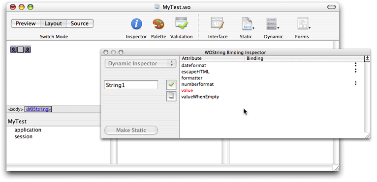

This is the behavior if you have text or other elements selected when you add a new element:

- If the new element is a container element, the selected elements are wrapped or contained inside the new element. For example, Figure 2-2 shows the result of selecting WORepetition when a WOString element is selected—the WOString is wrapped with a WORepetition.

  __Figure 2-2__  Wrapping a WOString with a WORepetition

  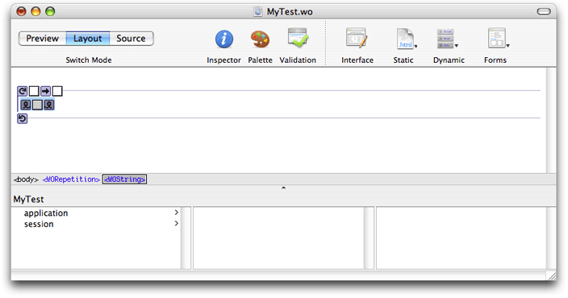
- If the new element cannot contain other elements (for example, a horizontal rule or image), the new element _replaces_ the selection.

Some elements can be added to your component by dragging them from the Finder or the desktop into your component window. Types of objects that can be dragged into a web component are:

- Components
- Client-side Java components
- EO model files (of type `.eomodeld`)
- Image files and image maps

Certain file types (such as `.gif,``.jpeg`, `.tif,``.eps`, and `.bmp`) are automatically recognized by WebObjects Builder. Use the WebObjects Builder Preferences window to view and edit the list of filename extensions that WebObjects Builder accepts. You can drag any item with one of those extensions into a component window, and the item will be added to your project. If the extension of your file is in the Application Resources table, Xcode adds the file to the Resources group in your project. If the extension of your file is in the Web Server Resources table, Xcode adds the file to the Web Server Resources group in your project. Read _[WebObjects Deployment Guide Using JavaMonitor](../WebObjects%20Deployment%20Guide%20Using%20JavaMonitor/Introduction%20to%20WebObjects%20Deployment%20Guide%20Using%20JavaMonitor.md#apple-f4xwc4dqnrsv64tfmyxwi33df52wszbpkridgmbqgaytambz)_for a description of these different groups.

If you need to, you can add additional file types to the lists as follows:

1. Choose WebObjects Builder > Preferences.

   The WebObjects Builder Preferences window appears.
2. Click the Resources button.

   The preferences window displays a table containing the application resources and another table containing the web server resources.
3. Click the plus button below either the Resources or Web Server Resources table to add an extension.

   A blank row is inserted into the table.
4. Double-click the new row and enter the new filename extension.

You use the inspector to configure individual elements in your component.

Select an element and open the inspector to view its properties. To open the inspector, click the Inspector button on the toolbar in the component window, choose Window > Inspector, or choose Inspect from an element's contextual menu (Control-click an element to display its contextual menu). For example, if you select a Heading element and click the Inspector button on the toolbar, the Header Inspector window appears as shown in Figure 2-3.

__Figure 2-3__  The Header Inspector

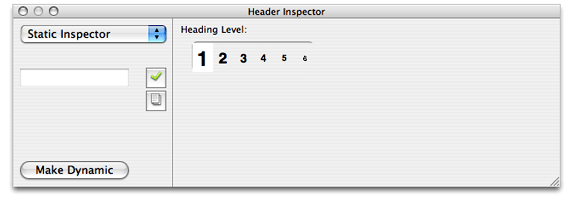

The inspector window title and contents reflect the selected element. Each element has its own inspector that allows you to set properties appropriate for that element. For example, the Heading Inspector in [Figure 2-3](#apple-f4xwc4dqnrsv64tfmyxwi33df52wszbpkridimbqgazdgnbvfvjvomjx) allows you to set the level of a heading element. Other elements have different properties that you can set.

Most dynamic elements have generic, dynamic, and static properties that you can set. You can set the static properties of concrete dynamic elements that have HTML counterparts. You can also change a dynamic element to a static element and vice versa as explained in [Making Elements Dynamic or Static](#apple-f4xwc4dqnrsv64tfmyxwi33df52wszbpkridimbqgazdgnbvfvjvomzz).

The pop-up menu in the upper-left corner of an element inspector is used to switch between generic, static, and dynamic properties. This menu may be disabled if an element does not have static properties.

For example, choose Forms > WOForm to create a form element, and choose Forms > WOTextArea to insert a text area element in the form element as shown in Figure 2-4.

__Figure 2-4__  Adding a WOTextArea element

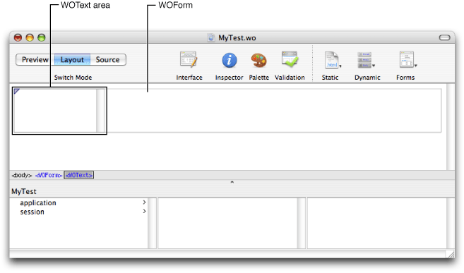

Click inspector on the toolbar to open the inspector for the dynamic text area element. The WOText Binding Inspector displays the attributes that you can bind for this element as shown in Figure 2-5.

__Figure 2-5__  A Dynamic element Inspector

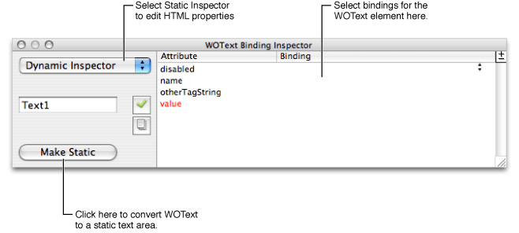

If you choose Static Inspector from the pop-up menu, the Text Area Inspector appears as shown in Figure 2-6. This is the same inspector you would see for a static text area element (`<textarea>`) and allows you to set its HTML properties (such as the `COLS` and `ROWS` properties). You can also add bindings to the dynamic inspector to set HTML properties. (The static inspector is provided for your convenience only.)

__Figure 2-6__  A Static element Inspector

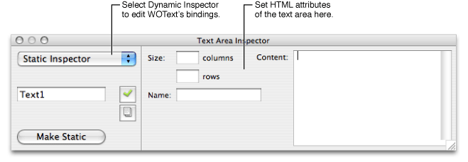

Choose Dynamic Inspector from the pop-up menu to switch back to the WOText Binding Inspector.

A static element has a Make Dynamic button in the lower-left corner that converts it to the corresponding dynamic element. For example, if you click the Make Dynamic button in an Anchor Inspector window, the selected element is converted to a WOHyperlink dynamic element. Similarly, a concrete dynamic element has a Make Static button in its inspector that converts it to its HTML counterpart.

The following table shows the dynamic counterparts for each of the static HTML elements shown:

|  |  |
| --- | --- |
| Image | WOImage, WOActiveImage |
| Form | WOForm |
| Textfield | WOTextField |
| Text area | WOText |
| Button | WOSubmitButton, WOResetButton, WOImageButton |
| Checkbox | WOCheckBox |
| Radio button | WORadioButton |
| Select | WOBrowser, WOPopupButton |
| Hyperlink | WOHyperlink |
| Applet | WOApplet |
| Other | Generic WebObjects |

If you convert a static element to its dynamic counterpart by clicking Make Dynamic and no direct counterpart exists, the element becomes a WOGenericElement whose element name is the HTML tag for the static element. Read [Generic WebObjects Elements](Working%20With%20Dynamic%20Elements.md#apple-f4xwc4dqnrsv64tfmyxwi33df52wszbpkridimbqgazdgnbzfvjvomzu)for more information on generic elements.

Typically, you use the graphical editor in Layout mode to create your web component. This editor is easy to use and behaves like the editors in other Apple applications. However, because it is more than an HTML editor—you edit dynamic WebObjects elements too—there are some different features.

There are several operations you can perform in WebObjects Builder that require you to select an element, such as copying, deleting, inspecting, or wrapping elements (placing one element inside another).

You select text elements in the graphical view in Layout mode as you would in most text-editing applications: by dragging, by double-clicking words, by triple-clicking lines, or by Shift-clicking to make a multiple selection. The selected text appears highlighted.

Some elements, such as text fields and text areas, can be selected simply by clicking them.

Other elements, such as tables, require you to click outside the element and then drag across the element in order to select it.

To select a range of elements, drag across them, or press the Shift key while clicking at the end of the range.

In Layout mode, you can use the path view to verify your selection or to select the parent element. The selected element appears highlighted at the end of the path. You select elements and their containing elements by clicking the HTML tag corresponding to the parent element. The selected element is highlighted in the graphical view.

For example, if you want to select a particular row in a table, click anywhere in the row and the path view displays the enclosing elements as show in Figure 2-7. Click the `<td>` tag to select the entire cell or the `<tr>` tag in the path view to select the entire row.

Read [Editing Tables](#apple-f4xwc4dqnrsv64tfmyxwi33df52wszbpkridimbqgazdgnbvfvjvomzu) for more tips on selecting table parts

__Figure 2-7__  Selecting a table row

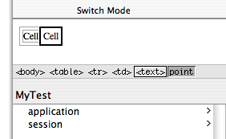

If you choose New from the File menu to create a new web component, the cursor appears in the upper-left corner of the graphical view in Layout mode. If you begin typing text directly into this pane, the text appears in the default font and size. Here are some convenient keyboard shortcuts for editing text:

- Press Shift-Return to insert a line break, ` ` tag.
- Press Return to insert a paragraph element, `
`tag.

You use the Format menu to format the selected text. If there is no selection, the format changes apply to any text typed at the insertion point. Items in the Format menu have direct HTML equivalents. You can switch to Source mode to check the formating changes you make to the HTML file, and switch to preview mode to see the effect of those changes.

The following Format > Font submenu items make these HTML edits:

- Choose Show Fonts, select a font from the list, and click Apply to change the font of the current selection—wrap the selection with a Font element, ``.
- Choose Bold to change the style to bold—wrap the selection with a bold element, `<b>`.
- Choose Italic to change the style to italic—wrap the selection with an italic element, `<i>`.
- Choose Underline to change the style to underline—wrap the selection with an underline element, `<u>`.
- Choose Typewriter to change the style to typewriter (fixed-width font)—wrap the selection with a typewriter element, `<tt>`.

The Format > Alignment submenu items allow you to center or justify text by setting the align property of the enclosing paragraph. For example, if you choose Format > Alignment > Center when the insertion point is on a paragraph element, the paragraph element's align property is set to `center`.

The Format > Size submenu items change the font size of selected text—wraps the selection with a font element and sets the font element's size property to the selected size. For example, if you select some text and choose Format > Size > 6, the selection is wrapped with a font element with the size set to `6`. In the HTML source, `` is inserted before the selection and `` is inserted after the selection.

The Format > Table submenu is used to format tables. Read [Editing Tables](#apple-f4xwc4dqnrsv64tfmyxwi33df52wszbpkridimbqgazdgnbvfvjvony) for details on using tables.

The Format > Frame submenu is used to format frames. Read [Editing Frames](#apple-f4xwc4dqnrsv64tfmyxwi33df52wszbpkridimbqgazdgnbvfvjvooa) for details on using frames.

Choose Window > Show Colors to open the Colors window and change the color of the selection—wrap the selection with a font element and set the color property. The colors can also be applied to entire pages and hyperlinks.

Choose Format > Indent to indent the selection—wrap the current selection with a block quote element, `<blockquote>`. Select Format > Outdent to move indented text to the left—remove the enclosing block quote element.

Most elements displayed in the graphical and path views in Layout mode have contextual menus that are displayed when you Control-click the elements or a selection. The contextual menus are element specific. For example, the contextual menu of a table allows you to split cells and add or remove columns and rows as discussed in [Editing Tables](#apple-f4xwc4dqnrsv64tfmyxwi33df52wszbpkridimbqgazdgnbvfvjvony). Container elements have menu items for deleting and unwrapping their contents.

Objects in the object browser also have contextual menus that are accessed by Control-clicking the object. These contextual menus are discussed in [Binding Dynamic Elements](Working%20With%20Dynamic%20Elements.md#apple-f4xwc4dqnrsv64tfmyxwi33df52wszbpkridimbqgazdgnbzfvjvona).

You can also change the appearance of the graphical editor by changing the preferences. For example, you can turn on table tags in the graphical view to make it easier to bind dynamic elements in tables or wrap table cells or rows with a repetition as discussed in [Wrapping Table Rows and Cells With Repetitions](Working%20With%20Dynamic%20Elements.md#apple-f4xwc4dqnrsv64tfmyxwi33df52wszbpkridimbqgazdgnbzfvjvooi). To turn on the table tags, open the Preferences window, click the Layout button, and select tables from the "Show inline graphical tags for" options.

The Source mode displays the `.html` file in an HTML source editor and the `.wod` file for your component in a text editor. If you are familiar with HTML syntax, you might prefer using the HTML source editor to change your component. Otherwise, you can continue to edit your component using the graphical view in Layout mode and view your changes in Source mode. The editing commands and preferences are different in Source mode.

You select text elements in the HTML source editor as you would in most text-editing applications: by dragging, by double-clicking words, or by Shift-clicking to make a multiple selection. Selected text appears highlighted.

When you triple-click a tag in the HTML source editor, you select the tag, the matching tag, and the HTML in between. For example, if you triple-click `<title>` in a new page, WebObjects Builder selects `<title>`, `</title>`, and the "Page Title" text. You can also drag a tag after it has been selected to move the entire section of HTML source to a new location.

The bottom pane in Source mode displays your component's declarations file (a `.wod` file). This file stores the binding information when you bind variables and methods to your dynamic elements. Editing is enabled in this window but normally, you don't edit this file directly. Read [Binding Elements](Working%20With%20Dynamic%20Elements.md#apple-f4xwc4dqnrsv64tfmyxwi33df52wszbpkridimbqgazdgnbzfvjvomq) for how to bind elements in Layout mode.

WebObjects Builder automatically inserts necessary elements such as `<html>`, `<head>` and `<body>` for you. However, the HTML source file is not an ordinary HTML file. It can contain static, dynamic, concrete, and abstract elements specific to WebObjects. To distinguish these different types of elements, you can change the colors of the tags and text in Source mode using the Preferences window as follows:

1. Choose WebObjects Builder > Preferences.
2. Click Source.

   The Source preferences pane appears as show in Figure 2-8.

   __Figure 2-8__  The Source preferences

   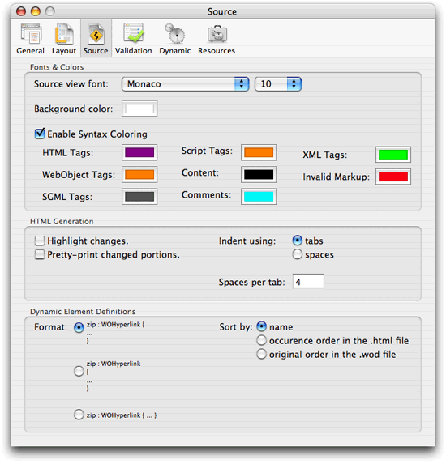
3. Select Enable Syntax Coloring to turn on the colors in Source mode.

   The default colors appear in the HTML source editor.
4. Set the desired colors for the tags and text by clicking the specific color wells for each tag.
5. If you want to turn off the colors, deselect Enable Syntax Coloring.

   The HTML in the source editor appears in black text with a white background.

Similarly, use the "Background color" colorwell to change the background color in the HTML source editor. You can also choose a different font and font size from the "Source view font" pop-up menu.

To reformat HTML entered in the HTML source editor, choose Format > Reformat HTML. This menu item is enabled only in Source mode. Choosing this menu item reformats the HTML source for your component using HTML preferences you can change, such as number of spaces per tab.

To change Source mode preferences, open the Preferences window and click the Source button. The HTML preferences are in the HTML Generation box, as shown in [Figure 2-8](#apple-f4xwc4dqnrsv64tfmyxwi33df52wszbpkridimbqgazdgnbvfvjvomrs), and allow you to highlight changes, pretty-print changes, and specify tabs or spaces for indentation.

You can also change the appearance of declarations in the `.wod` file that appear in the lower pane in Source mode. Typically, you do not edit the `.wod` file directly, but you might want to format it differently and change the order of declarations. Open the Preferences window and click the Source button. The `.wod` file preferences are in the Dynamic Element Definitions box, shown in [Figure 2-8](#apple-f4xwc4dqnrsv64tfmyxwi33df52wszbpkridimbqgazdgnbvfvjvomrs), and allow you to select a format style and sort order.

Tables are a common tool for organizing and formatting large amounts of information on a webpage. Tables can be used to implement menu bars and even incrementally display large graphics in small pieces. This section describes how to create, edit, and format tables using WebObjects Builder.

Follow these steps to create a table:

1. Select Table from the Static menu to add a table at the insertion point.

   The New Table panel appears allowing you to configure the table before you insert it as shown in Figure 2-9.

   __Figure 2-9__  Creating tables

   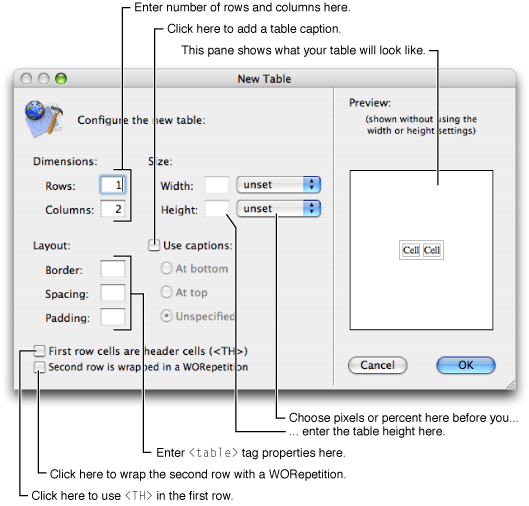
2. Use the Dimensions fields to change the number of rows or columns in the table.

   You can add rows and columns later but its more convenient to to use the New Table panel. When you are done entering the dimensions, the Preview pane in the New Table panel shows approximately what your table looks like.
3. Optionally, select a unit for the width (pixels or percent) in the Width pop-up menu, and enter the table width in the Width text field. Similarly, set the table height.
4. To add a caption to the table, select "Use captions", and set the location of the caption by clicking either "At bottom", "At top" or Unspecified.

   If you select "Unspecified" then the user browser decides where to put the caption.
5. To change the table's border, spacing (corresponding to the HTML `cellspacing` table property), and padding (corresponding to the HTML `cellpadding` table property), enter the appropriate sizes (in pixels) in the Layout fields.
6. To add a header to the table, click the checkbox labeled "First row cells are header cells."

   The first row cells are wrapped in an HTML `<th>` tag instead of a `<td>` tag, which causes the cells to appear in bold in most browsers.
7. To create a table whose contents depend on a repetition, click the checkbox marked "Second row is wrapped in a WORepetition."

   The Preview pane renders the repeated row in blue. See [Using Abstract Dynamic Elements](Working%20With%20Dynamic%20Elements.md#apple-f4xwc4dqnrsv64tfmyxwi33df52wszbpkridimbqgazdgnbzfvjvoni) for more information on repetitions.
8. Click OK to insert the table; otherwise click Cancel.

The PremadeElements palette contains some common tables that are wrapped in repetitions—tables that can expand in both the horizontal and vertical directions. Read [PremadeElements Palette](Working%20With%20Palettes.md#apple-f4xwc4dqnrsv64tfmyxwi33df52wszbpkridimbqgazdgnjzfvjvomjr) for details on these tables.

Typically, you select a cell, row, or multiple parts of a table and open the inspector to edit its properties. For example, you might select a cell and use the inspector to change the cell's width or height. In the graphical view, you can use a combination of the mouse and keyboard to select and create table parts:

- To begin entering content in a cell, click the cell and enter the content.
- To add content to a cell, type text in the cell or add elements—for example, select an element from one of the toolbar menus.
- To move to the cell to the right, or to the first cell on the next row (if you are in the rightmost column), press Tab.
- To create a new row when you are at the end of a table, press Tab.
- To move backwards through a table (for example, select the cell to the left), press Shift-Tab.
- To move to the cell at the end of the table when you are at the beginning of a table, press Shift-Tab.
- To make a contiguous multiple cell selection, click in a cell and drag across adjacent cells, or select a cell and Shift-click another cell.
- To make a noncontiguous multiple cell selection, Command-click multiple cells as shown in Figure 2-10.

  __Figure 2-10__  Selecting noncontiguous multiple cells

  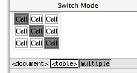

It may be more convenient to use the path view to select table parts for editing. An HTML table (a `<table>` tag) is a hierarchical structure that contains rows (`<tr>` tags). Rows in turn contain cells (`<th>` or `<td>` tags). When you select a cell, the path view shows the path from the cell up to the page (a `<body>` tag). You can inspect any element in the path by clicking its tag in the path view. For example, if you select a table cell, you can inspect the cell by clicking the `<td>` tag, the row by clicking the `<tr>` tag, or the table by clicking the `<table>` tag.

Figure 2-11 shows a table in graphical view with the cell tag, `<td>`, selected in the path view.

__Figure 2-11__  Selecting a cell using the path view

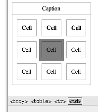

Selecting all the cells in a row or table is not the same as selecting the row or table. You need to make selections in both the graphical and path views to select an entire row or table.

- _To select a row_, select one or more cells in a row and click the `<tr>` element in the path view, as shown in Figure 2-12.

  __Figure 2-12__  Selecting a row

  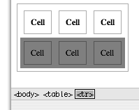
- _To select a table_, select one or more cells or rows in the table and click the `<table>` element in the path view, as shown in Figure 2-13.

  __Figure 2-13__  Selecting a table

  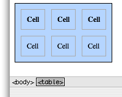

There are several ways to edit tables: split and merge cells, add and delete columns, and add and delete rows. These actions are the same whether you choose a menu item or click a button to execute them.

- The most convenient method is to select a table, row or cell and use the control buttons on the Inspector, show in Figure 2-14, to edit the table.

  __Figure 2-14__  Editing a table

  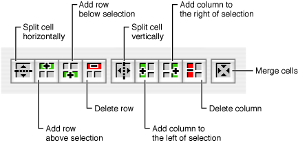
- Otherwise, you can select a table, row, or cell and use the contextual menu to edit the table (Control-click the element to open the contextual menu).
- Finally, you can choose an item from the Format > Tables menu to change the structure of a table as shown in Figure 2-15.

  __Figure 2-15__  Editing a table using the Table menu

  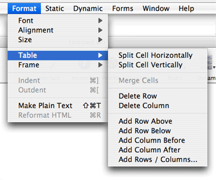

The table editing commands below are in the Format > Table menu.

- To split a cell, select it and choose Split Cell Vertically to split it vertically. Choose Split Cell Horizontally to split it horizontally.
- To merge multiple cells, select a contiguous region of cells and choose Merge Cells. This menu item isn't enabled unless the selected cells make up a group that could logically be merged into one cell.
- To delete a row, select the row you want to delete (or a cell within that row) and choose Delete Row.
- To delete a column, select a cell within the column you want to delete and choose Delete Column.
- To add a row, select a cell or row and choose Add Row Above to add a row above your selection. Choose Add Row Below to add a row below your selection.
- To add a column, select a cell and choose Add Column Before to add a column to the left of your selection. Choose Add Column After to add a column to the right of your selection.
- To add multiple rows or columns, choose Add Rows / Columns. The Add Rows / Columns panel appears as shown in Figure 2-16. Select row(s) or column(s), enter the number of rows or columns, select above or below for rows and before or after for columns (when you select column(s) the radio button labels on the right change from above and below to before and after). Click OK.

  __Figure 2-16__  Adding multiple table rows or columns

  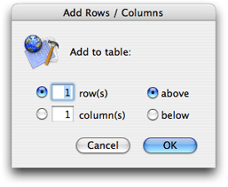

You modify other properties of a table or part of a table by selecting it and opening the Table, Table Row, or the Table Data Inspector. For example, read [Resizing Tables and Cells](#apple-f4xwc4dqnrsv64tfmyxwi33df52wszbpkridimbqgazdgnbvfvjvonbq) for how to change the size of cells and rows.

You can wrap a row or cell with an abstract dynamic element such as a conditional or repetition. You use a conditional if you want to optionally display a row or cell. You use a repetition if the content of a table is dynamic.

To wrap an abstract dynamic element around a selected row or cell, select the row or cell, and add a dynamic element. For example, select a row and choose WORepetition from the Dynamic menu. A row or cell that is wrapped appears highlighted. If you click in the row or cell, the dynamic element appears highlighted in the path view, too.

See [Using Abstract Dynamic Elements](Working%20With%20Dynamic%20Elements.md#apple-f4xwc4dqnrsv64tfmyxwi33df52wszbpkridimbqgazdgnbzfvjvoni) for more information on configuring conditionals and repetitions.

By default, the size of an HTML table is determined by the contents of the table's cells. If you type text (or insert other elements) inside a table cell, the cell's width expands as necessary to fit the data. The width of any column, therefore, will be the width of the widest cell in the column.

In WebObjects Builder, a cell does not resize until you finish editing the cell and either move to another cell or move out of the table. To update the cell immediately, press the Escape key.

Use the inspector to set the size of a cell or table directly:

- To set the width or height of a table, select the table and open the Table Inspector as shown in Figure 2-17. Enter the table size in the Width and Height text fields.

  __Figure 2-17__  Setting table width and height

  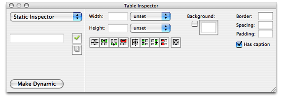
- To set the width or height of a cell, select the cell and open the Table Data Inspector. Read [Selecting Table Parts in the Path View](#apple-f4xwc4dqnrsv64tfmyxwi33df52wszbpkridimbqgazdgnbvfvjvomzw) for how to select a cell. Figure 2-18 shows what the inspector looks like. Enter the cell size in the Width and Height text fields.

  __Figure 2-18__  Setting cell width and height

  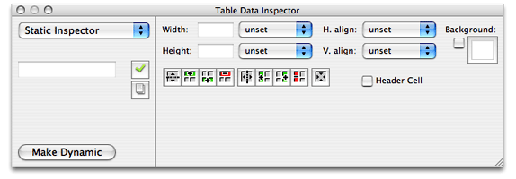

Use the inspector to set the row and cell alignment properties as follows:

1. Select the row or cell—for example, click in a cell and select the `<td>` tag in the path view.
2. Open the inspector—for example, click Inspector on the toolbar.

   The Table Data Inspector appears if a cell is selected (see [Figure 2-18](#apple-f4xwc4dqnrsv64tfmyxwi33df52wszbpkridimbqgazdgnbvfvjvomzs)), and the Table Row Inspector appears if a row is selected (see [Figure 2-19](#apple-f4xwc4dqnrsv64tfmyxwi33df52wszbpkridimbqgazdgnbvfvjvomzt)). Both inspectors contain the same controls for setting the alignment.
3. To set the horizontal alignment, choose left, center, or right from the "Horizontal align" pop-up menu.

   If the value is unset, the browser determines the horizontal alignment.
4. To set the vertical alignment, choose top, middle, bottom, or baseline from the "Vertical align" pop-up menu.

   If the value is unset, the browser determines the vertical alignment.

Use the Table Inspector, shown in [Figure 2-17](#apple-f4xwc4dqnrsv64tfmyxwi33df52wszbpkridimbqgazdgnbvfvjvomzr), to set remaining table properties, such as the background color, border thickness, spacing, and padding properties. You can also choose to include a caption with your table.

Use the Table Data Inspector, shown in [Figure 2-18](#apple-f4xwc4dqnrsv64tfmyxwi33df52wszbpkridimbqgazdgnbvfvjvomzs), to set remaining cell properties, such as the background color of a cell and whether or not a cell is a header cell.

Use the Table Row Inspector, shown in Figure 2-19, to set remaining row properties such as the background color of all cells in a row.

__Figure 2-19__  Setting row properties

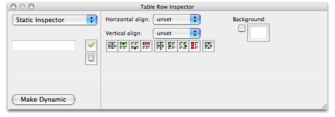

Before editing frames you need to create a new web component based on a frameset. A _frameset_ element is a container of frame elements that specifies the layout of the frames. Choose File > New Frameset to create a web component with frames. A new component window appears containing a single `<frame>` element with a root `<frameset>` element

Follow these steps to edit individual frames. Select a frame element inside a frameset and perform one of the following actions:

- To split a frame in two horizontally, choose Edit > Frame > Split Horizontally.
- To split a frame in two vertically, choose Edit > Frame > Split Vertically.
- To specify the frame width, choose Absolute Width, Percentage Width, or Proportional Width from the Edit > Frame menu.
- To specify the frame height, choose Absolute Height, Percentage Height, or Proportional Height from the Edit > Frame menu.
- To connect the frame with a URL, choose Edit > Frame > Connect To Source.

  Select a file from the "Connect frame to" window and click Open.

You can also configure properties using the inspector as follows:

1. Select the frame and click the Inspector button on the toolbar.

   The Frame Inspector appears as shown in Figure 2-20.

   __Figure 2-20__  The Frame Inspector

   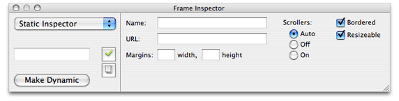
2. Optionally, enter a name in the Name field.
3. Optionally, enter a URL for the initial contents of the frame in the URL field.
4. Optionally, enter the margins, using pixel values, in the width and height text fields.
5. Select Auto to leave the decision to use scroll bars to the browser, select Off to remove scroll bars, and select On to add scroll bars.

   If you select Auto, the browser or user agent on the client side determines whether or not scrollers are used.
6. Select Bordered if you want a border around the frame.
7. Select Resizable to allow the frame to be resized.
8. Click Make Dynamic to convert the frame element into a WOFrame.

   If you use a WOFrame, you can specify the content of the frame dynamically.

This section describes how to use cascading style sheets (CSS) in your web component to format content.

Choose Static > CSS to add a ``. Replace `CSS Content` with your style instructions.

For example, Figure 2-21 shows the `Main.wo` component for the TradingCards sample code. The highlighted section specifies the format of elements tagged with the names: `card`, `portrait`, `name`, `title` and `power`. Note the use of the span and division elements in the HTML that appears after the style element that marks sections to apply the formatting.

See [www.w3.org/Style/CSS](http://www.w3.org/Style/CSS/) for a complete description of cascading style sheets.

__Figure 2-21__  A CSS Sample

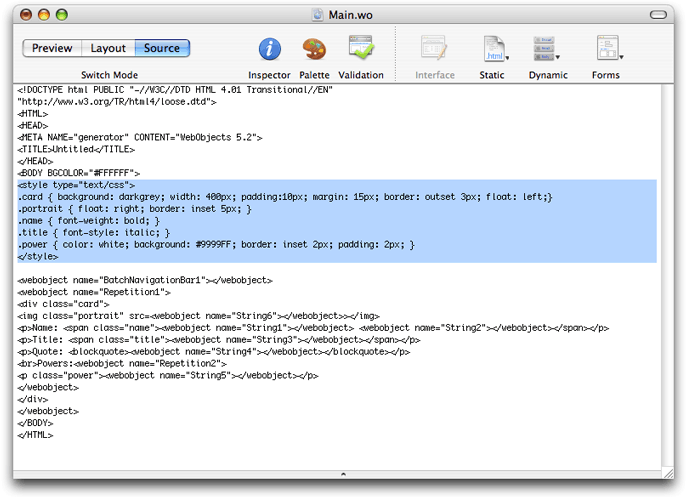

[Next](Working%20With%20Static%20Elements.md)[Previous](Getting%20Started%20With%20WebObjects%20Builder.md)

