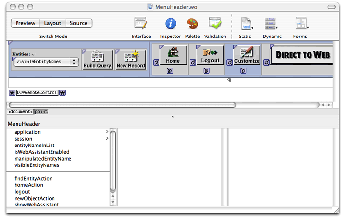
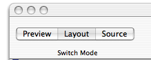
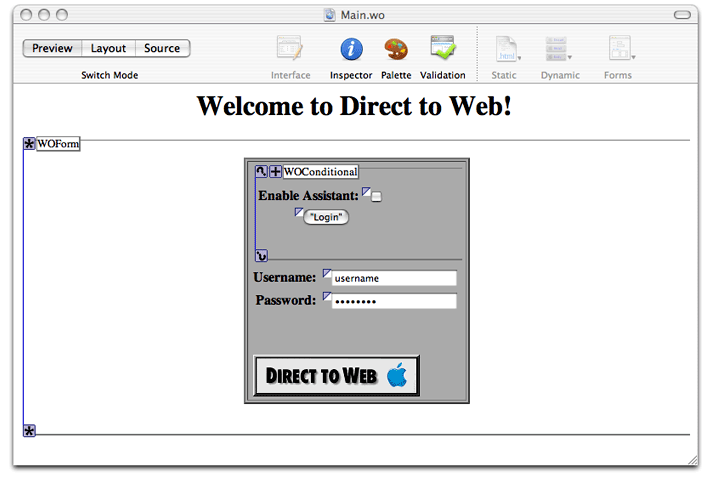
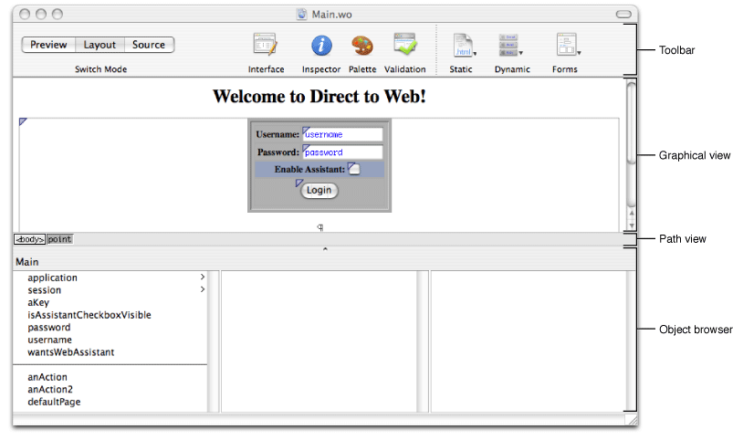
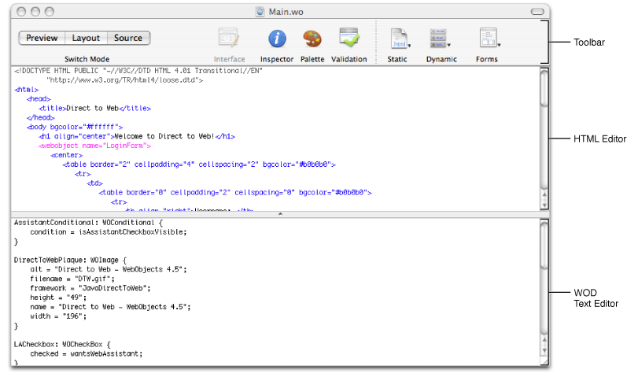
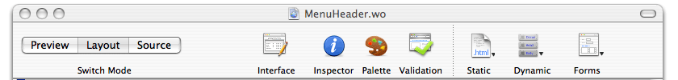
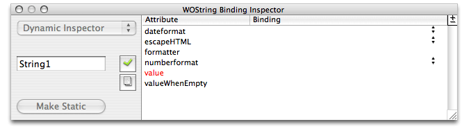
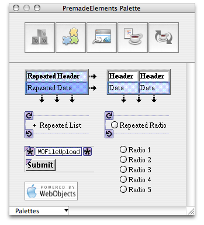
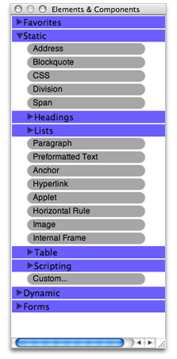
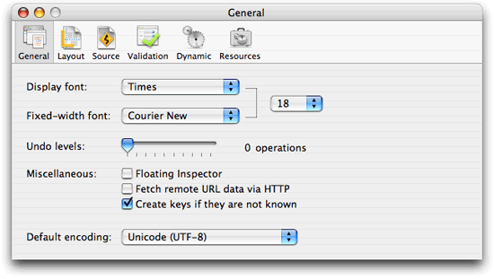

> 导航：[总目录](../../../README.md) · [documentation](../../../_indexes/documentation.md) · [WebObjects Builder User Guide](Introduction%20to%20WebObjects%20Builder.md)

[Next](Editing%20Components.md)[Previous](Introduction%20to%20WebObjects%20Builder.md)

# Getting Started With WebObjects Builder

WebObjects Builder is a graphical tool for creating web components for WebObjects applications. A web component represents a webpage or part of a webpage—typically, webpages that contain dynamic content. Web components are HTML-based—therefore, they are used only by web applications—you do not use WebObjects Builder if you are developing other types of WebObjects applications such as web services and Java Client applications. For example, a web service application created using the Direct To Web Services Application template in Xcode does not generate HTML.

WebObjects Builder is not a complete integrated development environment (IDE) either. You use Xcode to manage the rest of your WebObjects project files, and use Xcode to build and test your application. Read _Xcode 2.2 User Guide_ if you are not familiar with Xcode.

Before editing your web component, you should be familiar with the layout of the web component window and common functions and features, such as setting preferences, opening the inspector, and switching between editing modes. WebObjects also provides a wealth of elements and prebuilt components you use to construct your web component. It helps to understand the breadth, organization and location of these windows, menus, and controls before you begin editing your component.

There are several ways to create web components—some web components are created automatically for you and others you can create manually.

Typically, standard web components, like `Main.wo`, `MenuHeader.wo` and `PageWrapper.wo`, are created for you by the Xcode assistant when you select a WebObjects template. The Main component represents the first page displayed by your web application. The MenuHeader and PageWrapper components are specific to Direct to Web applications. For example, you edit the PageWrapper component to add or remove information from every webpage—this component is a wrapper for every page in your application.

Follow the steps in _[WebObjects Web Applications Programming Guide](../WebObjects%20Web%20Applications%20Programming%20Guide/Introduction%20to%20WebObjects%20Web%20Applications%20Programming%20Guide.md#apple-f4xwc4dqnrsv64tfmyxwi33df52wszbpkridgmbqgaytamjq)_ to create a Xcode project using one of the web application templates. Double-click any of the web components that appear in the Web Components group in Xcode to launch WebObjects Builder. For example, double-click the `MenuHeader.wo` file in a Direct to Web application to open it as shown in Figure 1-1.

__Figure 1-1__  The MenuHeader component window

To create a new component and add it to your existing Xcode project, follow these steps:

1. Launch WebObjects Builder, located in the `/Developer/Applications/WebObjects` folder.
2. Choose File > New to create a new web component.

   A blank web component window appears.
3. Choose File > Save to save the component.
4. Enter a filename and location—for example, your project directory.
5. Click "Save as."

   A panel appears asking if you want to add the web component to the open Xcode project.
6. Click Yes.

   The new component is added to the Web Components group in your Xcode project.

The rest of this chapter explains the layout of the web component window and the main WebObjects Builder menus and buttons.

When you open a web component, WebObjects Builder displays it in a _component window_, similar to the window shown in [Figure 1-1](#apple-f4xwc4dqnrsv64tfmyxwi33df52wszbpkridimbqgazdgmzsfvjvona). The component window has a toolbar at the top and panes below that depend on the editing mode you select. Use the buttons in the upper-left corner of the component window, shown in Figure 1-2, to switch among the following edit modes: Preview, Layout, and Source mode.

__Figure 1-2__  The Switch Mode buttons

The _Preview mode_ shows a visual representation of your component. This view displays an approximation of what the user sees in the browser and is not editable. The elements are collapsed as much as possible and bindings are not displayed. Figure 1-3 shows the Preview mode of a Direct to Web component.

__Figure 1-3__  The Preview mode

The _Layout mode_ shows an editable visual representation of your component, including its dynamic elements. The visual representation is similar to that of the preview mode except that elements are expanded and bindings are displayed as shown in Figure 1-4.

__Figure 1-4__  The Layout mode

When you select Layout, you create your component's appearance graphically in the upper pane of the component window called the  _graphical view_. The browser at the bottom of the window, called the _object browser_, displays variables and methods you use to bind elements to your application objects.

The _path view_, which is visible in the Layout mode only, lies between the two panes. It displays the element path to the selected element. Any element can be contained in a hierarchy of several levels of elements and can in turn contain other elements. For example, the main component is typically enclosed by an HTML `<body>` element tag, which is the top level of the hierarchy. You can click an element in the path view to select it in the graphical view.

The _Source mode_ allows you to view and edit your HTML source file directly as shown in Figure 1-5.

__Figure 1-5__  The Source mode

When you select Source, the HTML source for your component (the `.html` file) is displayed in the upper pane and the text of your declarations (the `.wod` file) is displayed in the bottom pane. Both panes are editable views. You can enter any HTML code in the upper-pane HTML source editor. For example, you can include HTML elements that are not directly supported by WebObjects Builder's layout tools. You can also add elements using the toolbar and menus.

When you add elements in the Layout mode, their corresponding HTML tags appear in this HTML source file.

The toolbar at the top of the component window contains additional buttons and menus as shown in Figure 1-6.

__Figure 1-6__  The Toolbar

The first four buttons on the toolbar to the right of the Switch Mode buttons perform specific tasks and open additional tools. Some of the menu equivalents for these buttons are in the Window menu (where you can find the keyboard equivalents too).

- The _Interface button_ contains menu items that modify the interface of your component's Java source. You use this menu to add variables and actions to your component.
- The _Inspector button_ opens the _inspector window_, which allows you to set properties of the selected element.

  You use the inspector window to set both HTML and dynamic element attributes. You can open the inspector window by selecting an element in either Layout or Source mode and clicking the Inspector button, or choosing Window > Inspector. The Inspector window is unique for each element but has some common controls. For example, Figure 1-7 shows the inspector for a WOString element. Read [Inspecting Elements](Editing%20Components.md#apple-f4xwc4dqnrsv64tfmyxwi33df52wszbpkridimbqgazdgnbvfvjvonq) for more information on inspectors and editing elements.

  __Figure 1-7__  The WOString Binding Inspector

  
- The _Palette button_ opens the _Palette window_, which contains additional elements and components that you use to construct your web component as shown in Figure 1-8. You can also open the Palette window by choosing Window > Palette.

  WebObjects Builder contains some standard palettes including palettes containing components specifically for Direct to Web and Java Client. There's also a JavaScript palette containing various flyover and panel components. You can also create your own palettes and add them to the Palette window. Read [Working With Palettes](Working%20With%20Palettes.md#apple-f4xwc4dqnrsv64tfmyxwi33df52wszbpkridimbqgazdgnjzfvjvomi) for more information on this.

  __Figure 1-8__  The Palette window

  
- The _Validation button_ opens the _Validation window_, which displays any binding validation errors on the page. Read [Validating](Validating.md#apple-f4xwc4dqnrsv64tfmyxwi33df52wszbpkridimbqgazdgnbwfvjvomi) for more information on validating your web component.

The next three buttons on the toolbar are convenience pop-up menus for adding elements to your component—you can also add the elements using the menus in the menu bar which have the same names.

- The _Static_ pop-up menu contains common static HTML elements.

  Read [Working With Static Elements](Working%20With%20Static%20Elements.md#apple-f4xwc4dqnrsv64tfmyxwi33df52wszbpkridimbqgazdgnbxfvjvomi) for how to use static elements.
- The _Dynamic_ pop-up menu contains dynamic HTML elements that are WebObjects-specific.

  Some of these elements are concrete—have HTML counterparts—and others are abstract, such as WOConditional. Read [Working With Dynamic Elements](Working%20With%20Dynamic%20Elements.md#apple-f4xwc4dqnrsv64tfmyxwi33df52wszbpkridimbqgazdgnbzfvjvomi) for details on these elements.
- The _Forms_ pop-up menu contains dynamic elements that you typically use in a form—a user interface that obtains information from the user and contains a submit button.

  Read [Using Dynamic Form Elements](Working%20With%20Dynamic%20Elements.md#apple-f4xwc4dqnrsv64tfmyxwi33df52wszbpkridimbqgazdgnbzfvjvomy) for details on using form elements.

Optionally, you can use the Elements & Components window to add elements to your component with a single click as described in [The Elements & Components Window](#apple-f4xwc4dqnrsv64tfmyxwi33df52wszbpkridimbqgazdgmzsfvjvomy).

The _Elements & Components window_, shown in Figure 1-9, provides a convenient, single-click approach to adding elements to your component.

__Figure 1-9__  The Elements & Components window

The Elements & Components window contains an outline view with folders for each type of element: Static, Dynamic, and Forms. You click to the left of a folder name to reveal its contents. The folders contain the same elements that are available in the pop-up menus on the toolbar and the element menus on the menu bar.

However, using the Elements & Components window, you click on an element name once to add it to your component. The element is added at the insertion point in either the Layout or Source mode. All of the same editing rules that apply to selecting elements from the menus apply to the Elements & Components window. Read [Editing Components](Editing%20Components.md#apple-f4xwc4dqnrsv64tfmyxwi33df52wszbpkridimbqgazdgnbvfvjvomi) for details on these editing rules.

Just drag elements from the Static, Dynamic, and Forms folders to the Favorites folder. You can use the Favorites folder at the top of the window to quickly locate frequently used elements.

There are many ways to customize the views and behavior of WebObjects Builder. Choose Preferences from the application menu to open the Preferences window as show in Figure 1-10.

__Figure 1-10__  The Preferences window

The preferences window has three panes:

- _General preferences_ apply to the entire application and include preferences for setting display font, undo, and encoding attributes.
- _Layout preferences_ affect the appearance of the graphical view in Layout mode. Use these preferences to set colors and turn graphical tags on and off. Read [Changing the Appearance of the Graphical Editor](Editing%20Components.md#apple-f4xwc4dqnrsv64tfmyxwi33df52wszbpkridimbqgazdgnbvfvjvomjt)for details on these preferences.
- _Source preferences_ affect the appearance of the HTML source editor, HTML source generation, and text editor containing the .`wod` file. Read [Changing the Appearance of the HTML Source Editor](Editing%20Components.md#apple-f4xwc4dqnrsv64tfmyxwi33df52wszbpkridimbqgazdgnbvfvjvomjr) for details on the Fonts & Colors preferences, [Reformatting HTML](Editing%20Components.md#apple-f4xwc4dqnrsv64tfmyxwi33df52wszbpkridimbqgazdgnbvfvjvomjs) for details on the HTML Generation preferences, and [Changing the Appearance of the WOD Text Editor](Editing%20Components.md#apple-f4xwc4dqnrsv64tfmyxwi33df52wszbpkridimbqgazdgnbvfvjvomju) for details on the Dynamic Element Definitions preferences.
- _Validation preferences_ affect the behavior of the validation functions. Read [Validating](Validating.md#apple-f4xwc4dqnrsv64tfmyxwi33df52wszbpkridimbqgazdgnbwfvjvomi) for more information on validation and these preferences.
- _Dynamic preferences_ apply to the graphical view in the Layout mode. Read [Setting Dynamic Element Preferences](Working%20With%20Dynamic%20Elements.md#apple-f4xwc4dqnrsv64tfmyxwi33df52wszbpkridimbqgazdgnbzfvjvomzr)to learn more about using dynamic elements.
- _Resources preferences_ apply to files that you import into your web component. Read [Adding Elements From the File System](Editing%20Components.md#apple-f4xwc4dqnrsv64tfmyxwi33df52wszbpkridimbqgazdgnbvfvjvomjq)for details on these preferences.

There are menu and keyboard equivalents, located on the menu bar, for the toolbar buttons, toolbar pop-up menus and the Elements & Components window described earlier in the chapter. The toolbar and Elements & Components window are designed for your convenience. Optionally, you can use the menus on the menu bar.

The menu bar also contains the typical File, Edit, Window, and Help menus. (Power users may wish to memorize the keyboard equivalents for some of these menu items.) These are the menus in the WebObjects Builder menu bar:

- The _File menu_ contains commands for creating and opening web components. Read [Creating Web Components](#apple-f4xwc4dqnrsv64tfmyxwi33df52wszbpkridimbqgazdgmzsfvjvomq) for details on using this menu.
- The _Edit menu_ contains typical menu items for undo, cut, copy and paste, searching, and spell checking. You can also use this menu to edit your source and switch between views. Read [Modifying the Web Component Interface](Working%20With%20Dynamic%20Elements.md#apple-f4xwc4dqnrsv64tfmyxwi33df52wszbpkridimbqgazdgnbzfvjvomzs) for details on the Edit Source submenu.
- The _Format menu_ contains menu items to format text, tables, and frames. Read [Editing Text in Layout Mode](Editing%20Components.md#apple-f4xwc4dqnrsv64tfmyxwi33df52wszbpkridimbqgazdgnbvfvjvona), [Editing Tables](Editing%20Components.md#apple-f4xwc4dqnrsv64tfmyxwi33df52wszbpkridimbqgazdgnbvfvjvony), and [Editing Frames](Editing%20Components.md#apple-f4xwc4dqnrsv64tfmyxwi33df52wszbpkridimbqgazdgnbvfvjvooa) for details on using these menu items.
- The _Static menu_ is equivalent to the Static pop-up menu on the toolbar. The same elements are also available in the Elements & Components window. Read [Working With Static Elements](Working%20With%20Static%20Elements.md#apple-f4xwc4dqnrsv64tfmyxwi33df52wszbpkridimbqgazdgnbxfvjvomi) for how to use static elements.
- The _Dynamic menu_ is equivalent to the Dynamic pop-up menu on the toolbar. The same elements are also available in the Elements & Components window. Read [Working With Dynamic Elements](Working%20With%20Dynamic%20Elements.md#apple-f4xwc4dqnrsv64tfmyxwi33df52wszbpkridimbqgazdgnbzfvjvomi) for details on these elements.
- The _Forms menu_ is equivalent to the Forms pop-up menu on the toolbar. The same elements are also available in the Elements & Components window. Read [Using Dynamic Form Elements](Working%20With%20Dynamic%20Elements.md#apple-f4xwc4dqnrsv64tfmyxwi33df52wszbpkridimbqgazdgnbzfvjvomy) for details on using form elements.
- The _Window menu_ contains commands for opening the tools and windows described in this chapter.
- Use the _Help menu_ to access WebObjects Builder documentation.

[Next](Editing%20Components.md)[Previous](Introduction%20to%20WebObjects%20Builder.md)

