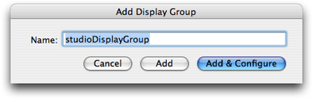
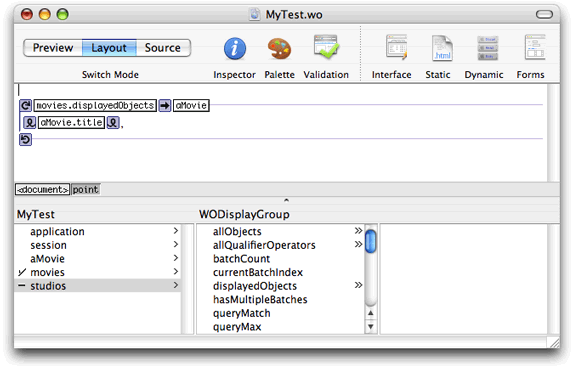
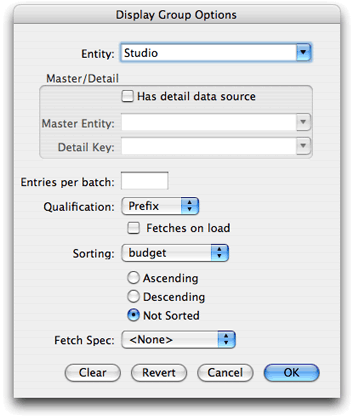
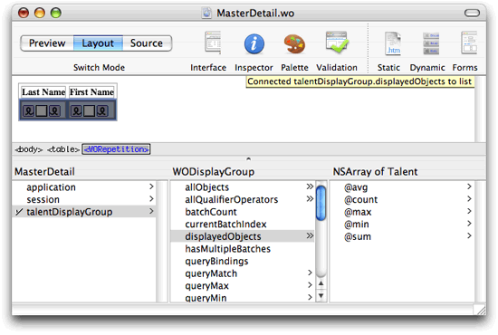
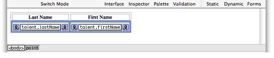
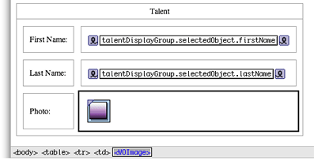
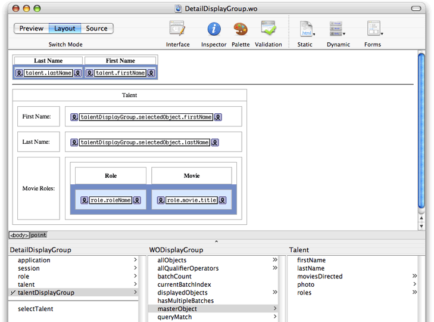

> 导航：[总目录](../../../README.md) · [documentation](../../../_indexes/documentation.md) · [WebObjects Builder User Guide](Introduction%20to%20WebObjects%20Builder.md)


[Next](Working%20With%20Palettes.md)[Previous](Working%20With%20Dynamic%20Elements.md)

# Using Display Groups

Display groups are special controller objects that manage a collection of enterprise objects. They fetch, insert, delete, display, update, and search records in a database. Using display groups in combination with dynamic elements, such as tables, and abstract elements, such as repetitions, is very powerful.

This section describes the mechanics of adding display groups to a web component using WebObjects Builder, how to implement a master-detail interface, and how to use a detail-display group. Read _WebObjects 5.3 Reference_ for details about the WODisplayGroup class. Read _[WebObjects Enterprise Objects Programming Guide](../WebObjects%20Enterprise%20Objects%20Programming%20Guide.md#apple-f4xwc4dqnrsv64tfmyxwi33df52wszbpkridgmbqgaytamjr)_ for concepts on enterprise objects that make display groups work.

WebObjects applications access databases through _enterprise objects_, which are represented by database rows. Enterprise object classes typically correspond to database tables, and an enterprise object instance corresponds to a single row or record in a table.

In a database application, you use an entity-relationship model, called an _EO model_, to associate database columns with instance variables of objects. You create a model with either the EOModeler application or the Xcode EO Model design tool. Alternatively, you can add an existing EO model using the assistant when creating an Xcode project. The EO model appears in the Resources group in Xcode. Read _[EOModeler User Guide](../EOModeler%20User%20Guide/Introduction%20to%20EOModeler%20User%20Guide.md#apple-f4xwc4dqnrsv64tfmyxwi33df52wszbpkridgmbqgaytamjy)_ or _Xcode 2.2 User Guide_ for more information on creating EO models.

The EO model contains _entities_, _attributes_, and _relationships_. An entity associates a database table with an enterprise object class. An attribute associates a database column with an instance variable. A relationship is a link between two entities. In database terms, a relationship is a join between tables.

Display groups use an EO model to get information about the type of objects they manage. Display groups manage objects associated with a single entity.

You may already have a display group added to your component that was created by the assistant when you created your WebObjects project. Otherwise, you can add a display group by dragging a model from the Finder or entity from EOModeler as follows:

1. Drag a model (a folder with the extension `.eomodeld`) from the file system to the object browser in your component window, or drag an entity from the EOModeler application, or Option-drag an entity from the Xcode EO Model design tool into the object browser.

   An Add Display Group panel appears, as shown in Figure 5-1, asking if you want to add the model to your project.

   __Figure 5-1__  The Add Display Group panel

   
2. Enter the name of the display group in the Name field.
3. Click Add & Configure.

   A Display Group Options window appears prompting you for more information. (Alternatively, you can click Add on the Add Display Group panel and configure the display group later.)
4. Follow the steps in [Configuring Display Groups](#apple-f4xwc4dqnrsv64tfmyxwi33df52wszbpkridimbqgazdgmzufvjvomq) to configure the display group and click OK when done.

You can also add a display group to your web component directly and hook it up to a model manually as follows:

1. Choose Add Key from the Interface pop-up menu on the toolbar.

   A sheet appears prompting you for more information.
2. Type the name of the key in the Name field.
3. Choose WODisplayGroup from the Type pop-up menu.
4. Select the appropriate source-code generation options.
5. Click Add.

Alternatively, you can declare the display group directly in the code:

```
protected WODisplayGroup myDisplayGroup;
```

When you add a display group directly, you are responsible for ensuring that the EO model containing your entity is added to your Xcode project. You also need to configure your display group as described in [Configuring Display Groups](#apple-f4xwc4dqnrsv64tfmyxwi33df52wszbpkridimbqgazdgmzufvjvomq).

A display group must be configured in order for it to be created and initialized automatically at runtime. Display groups are instantiated from an archive file (with the extension `.woo`) that is stored in the component folder. You shouldn't edit the `.woo` file directly—it is maintained by WebObjects Builder.

A checkmark appears next to a display group in the object browser if it has been configured. A minus sign next to a display groups means that it has not been configured. In Figure 5-2, the `movies` display group is configured and the `studios` display group is not. If a display group is not configured, it is not created at runtime. If you select a configured display group, its keys and actions are displayed in the next column in the object browser. You can bind these keys and actions to elements in your program.

__Figure 5-2__  Configuring display groups



Follow these steps to configure a display group or change its configuration:

1. Double-click the display group in the object browser.

   The Display Group Options panel appears as shown in Figure 5-3.

   __Figure 5-3__  The Display Group Options panel

   
2. Choose an entity name from the Entity pop-up menu or enter an entity name in the text field.

   The Entity combo box contains entities from the models in your project.
3. Click "Has detail data source" if you are creating a master-detail interface.

   Read [Creating a Detail Display Group](#apple-f4xwc4dqnrsv64tfmyxwi33df52wszbpkridimbqgazdgmzufvjvomy) for steps to create this type of interface.
4. If you want to batch fetched objects, enter the number of objects to fetch in a single batch in the "Entries per batch" text field.

   Batching is turned on if you enter a nonzero value in this text field. Otherwise, all enterprise objects are displayed.
5. When fetching objects that match a query, choose a qualifier from the Qualification pop-up menu to narrow the query.

   Choose Prefix to match the beginning of an attribute, choose Contains to match any part of an attribute, and choose Suffix to match the ending of an attribute.
6. Click "Fetches on load" if you want to fetch all records when the component is loaded.
7. If you want to sort the objects by attribute, choose an attribute from the Sorting pop-up menu, and select sort order: Ascending, Descending, or Not Sorted.
8. If you are using a fetch specification, select it from the Fetch Spec pop-up menu.

   The Fetch Spec pop-up menu contains all the fetch specifications defined in your model. A fetch specification is a predefined query that you create using EOModeler or the Xcode EO Model design tool. For example, you can create a fetch specification that fetches all records with a date attribute between some start and end date. Read _[EOModeler User Guide](../EOModeler%20User%20Guide/Introduction%20to%20EOModeler%20User%20Guide.md#apple-f4xwc4dqnrsv64tfmyxwi33df52wszbpkridgmbqgaytamjy)_ or _Xcode 2.2 User Guide_for more information on fetch specifications.
9. Click OK.

   The attribute is added to the object browser and a checkmark appears next it its name. If you select a configured display group, you will see its attributes, such as `allObjects`, displayed in the next column.

Typically, you use display groups to create a master-detail interface. In a _master-detail interface_, the user can select objects from a list of objects and inspect the selected objects. The master interface displays the collection of objects, and the detail interface implements an inspector of the selected object. Whenever the user changes the selection in the master interface, the detail interface is updated to show the new selection. If no object is selected, the detail interface displays nothing or disables itself (if it is editable). If multiple objects are selected (assuming multiple selection is allowed), the detail interface is disabled or it applies to all selected objects. Typically, such an interface also allows users to add and remove objects from the collection.

This section assumes you created a project using the Movies example EO model. If you have not already done so, follow these steps to create it:

1. Create a simple web application using Xcode by choosing File > New Project in Xcode.
2. Select Web Application under WebObjects as the Xcode template.
3. When prompted for existing EO model files, enter `Movies.eomodeld` located in `/Developer/Examples/JavaWebObjects/Frameworks/JavaBusinessLogic`.
4. After your Xcode project is created, double-click `Main.wo` located in the Web Components suitcase to launch WebObjects Builder and begin creating your component.

The steps to create a master-detail interface involve creating a display group (similar to a NSArrayController object in Cocoa), creating views (the web component interface), and binding the views to the controller. In addition, you need to implement a mechanism for changing the selected object in the master interface.

You use a display group to manage your collection of model objects—your collection of enterprise objects. It's easy to do this if you drag your entity from Xcode or EOModeler to WebObjects Builder as follows:

1. Open `Movies.eomodeld` in Xcode and Option-drag the Talent entity from the EO Model design tool to the graphical view in Layout mode in WebObjects Builder.

   A panel appears asking if you want to add a display group to your component.
2. Click Add.

   A configured `talentDisplayGroup` key is added to your component's interface. The entity is set to Talent.
3. Double-click `talentDisplayGroup` to open the Display Group Options window and configure other settings. For example, you might select "Fetches on load."
4. Click OK.

Typically, you use a table with its row wrapped in a repetition to display an array of enterprise objects. For example, you use a repetition to display the objects in `talentDisplayGroup.displayedObjects`. First you create the table and then you bind the contents to the display group.

Follow these steps to create the table:

1. Choose Static > Table to create the table of Talent records.

   The New Table panel appears allowing you to configure the table before inserting it in your component.
2. Enter `2` in the Rows and Columns text fields, check "First row cells are header cells," and "Second row is wrapped in a WORepetition." Click OK.

   A table with two columns and two rows is added to your component. The second row is wrapped in a repetition.
3. Type `Last Name` and `First Name` for the headings in the first and second columns of the table.
4. Double-click Cell in the second row of the first column and choose Dynamic > WOString.
5. Double-click Cell in the second row and second column and choose Dynamic > WOString.

   Your web component window should look like Figure 5-4. Next you bind the repetition and dynamic elements.

   __Figure 5-4__  Master-detail interface

   

Follow these steps to bind the repetition and table content to your objects:

1. Click in a cell in the second row to show the WORepetition in the path view.
2. Drag from `talentDisplayGroup.displayedObjects` in the object browser to the `<WORepetition>` element in the path view and choose `list` from the menu to bind the rows in the table to the Talent records.
3. Add a `talent` key to your interface to reference the current object in the repetition by choosing Add Key from the Interface menu.

   A sheet appears prompting for more information.
4. Enter `talent` as the name, enter `Talent` as the type, and click Add.
5. Connect the `talent` key to the WORepetition by dragging from `talent` in the object browser to `<WORepetition>` in the path view and choosing `item` from the menu.
6. Bind the content of the table to your objects by dragging from `talent.lastName` in the object browser to the center box of the WOString in the graphical view.

   Dragging to the center box is a shortcut for binding the `value` attribute of the WOString.
7. Similarly, bind `talent.firstName` to the WOString in the second row and second column of the table.

   When done the graphical view in Layout mode should look like the table in Figure 5-5.

   __Figure 5-5__  Master interface

   

The detail interface displays information about the selected object. For example, create a detail interface that displays the first name, last name, and photo of the selected Talent record. Follow these steps to create this detail interface:

1. Insert a horizontal line after the master interface by choosing Static > Horizontal Rule.
2. Insert a table with three rows and two columns after the horizontal line by choosing Static > Table.
3. Change the text in the first column to these labels: `First Name`, `Last Name` and `Photo`.
4. Insert a WOString in the first and second row of the second column to display the talent's first and last name.
5. Insert a WOImage in the third row of the second column to display the talent's photo.
6. Bind `talentDisplayGroup.selectedObject.firstName` to the first WOString and `talentDisplayGroup.selectedObject.lastName` to the second WOString.
7. Bind `talentDisplayGroup.selectedObject.photo.photo` (an NSData object) to the `data` attribute of the WOImage.
8. Select the WOImage and open the inspector to set the `mimeType`. Set the `mimeType` to `"image/jpeg"`.

   Figure 5-6 shows what your detail interface might look like.

   __Figure 5-6__  A detail interface

   

At runtime, each row in the master interface table in [Figure 5-4](#apple-f4xwc4dqnrsv64tfmyxwi33df52wszbpkridimbqgazdgmzufvjvomjs) contains a Talent record. The `selectedObject` of the display group is expected to reference the currently selected object. However, since this interface is HTML, not a Java Client or Cocoa application, you have to implement a mechanism for selecting a row and setting `talentDisplayGroup.selectedObject`.

When you click in a row, either on a hyperlink or button, WebObjects stores the selected item, corresponding to that row, in the `item` attribute of the WORepetition. Hence, the application variable you bind to `item` stores the selected enterprise object. However, the value is only valid within the scope of the action method. After the action method returns, `item` may be used for something else—for example, to traverse the rest of the objects in the array when generating the HTML for the table. Therefore, your action method needs to record the selected object. You can record the selected object by setting the display group's `selectedObject` property to the value of `item`.

Follow these steps to implement a select action for the master-detail interface:

1. Choose Interface > Add Action.
2. Enter `selectAction` as the action name and click Add.

   If you don't select a component from the Component combo box menu, the action returns `null` and the component page is redisplayed with the selected talent details.
3. Control-click `selectAction` in the object browser and select "View selectAction" from the context menu.

   Xcode displays your component source code—for example, `MasterDetail.java`.
4. Using Xcode, implement the `selectAction` method as follows:

```
public WOComponent selectAction(){
         talentDisplayGroup.selectObject(talent);
         return null;
}
```

Now you need to implement some mechanism for the action method to be invoked—implement a user interface for selecting a row in the table. The master-detail interfaces in Direct to Web applications use a inspect or edit button column in the table to do this. Alternatively, you could wrap the WOString that displays the last name with a WOHyperlink so that when the user clicks the last name, the action method is invoked. Follow these steps to wrap the last name with a WOHyperlink and bind it to the action method:

1. Select the last name WOString in the master interface.
2. Choose Dynamic > WOHyperlink to wrap the WOString with a hyperlink element.
3. Drag from `selectAction` in the object browser to the new WOHyperlink in the graphical or path view.

   A menu appears containing the WOHyperlink bindings.
4. Choose action from the menu.
5. Build and test your application.

This interface is similar to a master-detail interface except that you use a second display group to manage the destination objects of a to-many relationship.

For example, in the Talent entity, there is a to-many relationship from Talent to MovieRole. If you want your interface to display the associated movie roles in a detail interface, you need to create a detail display group to manage the movie roles—you need two display groups, one per collection.

What other components you use to implement a detail interface depends on your application. Typically, you use a table and repetition to display a collection of objects in both the master and detail interfaces. The example in this section uses the same interface as shown in [Creating a Master-Detail Interface](#apple-f4xwc4dqnrsv64tfmyxwi33df52wszbpkridimbqgazdgmzufvjvonq) with the addition of movie roles added to the detail interface.

If you are following along, you can skip some of the steps below by modifying the previous example to use a detail display group.

Follow the same steps in [Creating a Display Group](#apple-f4xwc4dqnrsv64tfmyxwi33df52wszbpkridimbqgazdgmzufvjvooi) and [Creating a Master Interface](#apple-f4xwc4dqnrsv64tfmyxwi33df52wszbpkridimbqgazdgmzufvjvona) to create your master display group and interface. When done, you should have `talent` and `talentDisplayGroup` variables added to your component. Also, follow the same steps in [Implementing a Select Action](#apple-f4xwc4dqnrsv64tfmyxwi33df52wszbpkridimbqgazdgmzufvjvooa) to implement the action method. Optionally, you can extend the master-detail example in [Creating a Master-Detail Interface](#apple-f4xwc4dqnrsv64tfmyxwi33df52wszbpkridimbqgazdgmzufvjvonq) to display the movie roles in the detail interface.

Follow the same steps in [Creating the Detail Interface](#apple-f4xwc4dqnrsv64tfmyxwi33df52wszbpkridimbqgazdgmzufvjvony) to create your detail interface except replace the row that displays the photo with a row that displays the movie roles.

1. Enter `Movie Roles:` in the first column of the last row as a label.
2. Remove content from the second column of the last row and choose Static > Table to insert a table into that cell.

   A New Table panel appears prompting you for more information.
3. Enter `2` in the Rows and Columns text fields, select "First row cells are header cells" and "Second row is wrapped in a WORepetition," and click OK.
4. Enter `Role` as the heading for the first column and `Movie` as the heading for the second column.
5. Insert a WOString in each cell in the second row to display the role name and movie title respectively.

Follow these steps to create a detail display group—for example, to display a collection of movie roles:

1. Double-click the `talentDisplayGroup`display group in the object browser.

   The Display Group Options panel appears as shown in [Figure 5-3](#apple-f4xwc4dqnrsv64tfmyxwi33df52wszbpkridimbqgazdgmzufvjvomjr) except that the entity is Talent.
2. Select "Has detail data source."

   The Master Entity pop-up list is enabled. It lists all entities in the models contained in your project.
3. Select the Master Entity from the pop-up list or type it in the text field—for example, select Talent.

   The Detail Key pop-up list now contains all the to-many keys belonging to the master entity.
4. Select the Detail Key from the pop-up list or type the key name in the text field—for example, select `roles`, the to-many relationship from Talent to MovieRole.
5. Click OK.

   Display groups that have detail data sources have a `masterObject` attribute. Select `talentDisplayGroup.masterObject` in the object browser to see properties of the master object. You use the master object to bind elements in the detail interface. For example, bind elements to the collection of movie roles.

Follow these steps to bind the detail repetition to the to-many `roles` relationship in the master object:

1. Click in a cell in the second row of the detail table to show the WORepetition in the path view.
2. Drag from `talentDisplayGroup.masterObject.roles` in the object browser to the `<WORepetition>` element in the path view and choose `list` from the menu to bind the rows in the table to the MovieRole records.
3. Add a `role` key to your interface to reference the current object in the repetition by choosing Add Key from the Interface menu.

   A sheet appears prompting for more information.
4. Enter `role` as the name, enter `MovieRole` as the type, and click Add.
5. Connect the `role` key to the WORepetition by dragging from `role` in the object browser to `<WORepetition>` in the path view and choosing `item` from the menu.
6. Bind the content of the table to your objects by dragging from `role.roleName` in the object browser to the center box of the WOString in the graphical view.

   Dragging to the center box is a shortcut for binding the `value` attribute of the WOString.
7. Similarly, bind `role.movie.title` to the WOString in the second row and second column of the table.

   When done the graphical view in Layout mode should look like Figure 5-7.

   __Figure 5-7__  A complete detail display group interface

   

You can also create a detail display group by dragging a to-many relationship from EOModeler or the EO Model Xcode design tool to your component window. Follow the steps in [Adding Display Groups](#apple-f4xwc4dqnrsv64tfmyxwi33df52wszbpkridimbqgazdgmzufvjvoni) to create a display group. When the Display Group Options panel appears it will already be configured as a detail display group for the dragged relationship. Just click OK to create the display group.

[Next](Working%20With%20Palettes.md)[Previous](Working%20With%20Dynamic%20Elements.md)

