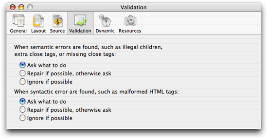

> 导航：[总目录](../../../README.md) · [documentation](../../../_indexes/documentation.md) · [WebObjects Builder User Guide](Introduction%20to%20WebObjects%20Builder.md)

[Next](Document%20Revision%20History.md)[Previous](Custom%20Components.md)

# Validating

This section describes how to validate your web component. Typically, the validating process identifies common errors in your web component such as missing bindings, wrong location of elements, and wrong tags. However, it can't catch all errors in your component, just those that don't conform to the HTML and WebObjects specifications. You can validate individual elements or an entire web component.

You can validate individual dynamic elements using the inspector as follows:

1. Select the element.
2. Click Inspector on the toolbar to open the inspector window.
3. Click the verify button (the green checkmark).

   An HTML Validation window appears detailing the binding errors. The text view is blank if there are no errors.
4. If errors are listed in the text view, click them individually to view the elements or HTML that contains the errors.

The steps to validate the entire web component are identical to validating individual elements except that you do not need to select an element. Just choose Window > Validation to validate your component and errors will be displayed in the HTML Validation window.

The validation process can repair some errors, if possible, or ignore them. Choose WebObjects Builder > Preferences to open the preferences window, and click Validation to view the preferences as show in Figure 8-1. Use this pane to configure exactly how you want semantic and syntactic errors handled.

__Figure 8-1__  Validation preferences

[Next](Document%20Revision%20History.md)[Previous](Custom%20Components.md)

