> 导航：[总目录](../../../README.md) · [documentation](../../../_indexes/documentation.md) · [WebObjects Builder User Guide](Introduction%20to%20WebObjects%20Builder.md)


[Next](Using%20Display%20Groups.md)[Previous](Working%20With%20Static%20Elements.md)

# Working With Dynamic Elements

You use dynamic elements to build dynamic web pages whose content is determined at runtime by your application. You should understand conceptually how dynamic elements work before using them in your component. Dynamic elements use a Model-View-Controller design pattern and rely on key-value coding to work. Binding dynamic elements involves adding keys to your objects and editing Java code.

[Binding Dynamic Elements](#apple-f4xwc4dqnrsv64tfmyxwi33df52wszbpkridimbqgazdgnbzfvjvona) explains how dynamic elements work, describes the techniques you use to add dynamic elements to your components and describes how to bind them to variables and methods in your code. The rest of this chapter briefly covers the different types of dynamic elements—forms, concrete, and abstract—and provides examples of each.

Read _WebObjects Dynamic Elements Reference_ for reference details of each dynamic element.

Before you begin using dynamic elements, you should understand the concepts that make dynamic elements work. WebObjects uses the Model-View-Controller design pattern and key-value coding to encapsulate and reuse objects that have distinct roles. This section describes this design pattern and explains how to bind dynamic elements through examples.

Although WebObjects doesn't use the same terminology, it loosely follows a Model-View-Controller (MVC) design pattern. Understanding how this design pattern works helps you understand dynamic elements and bindings.

In the MVC design pattern, _models_ encapsulate application data and the logic, or methods, that operate on that data. Models are typically the objects that you want to live beyond the lifetime of an application instance—they are the persistent objects that you store on disk. In WebObjects, the models are _enterprise objects_.

_Views_ display a representation of model data and often allow users to edit that data. In WebObjects, views are _dynamic elements_.

_Controllers_ mediate between the two, allowing for a clear separation of functionality between model and view. In WebObjects, controllers are your web component object and any other objects you can access via your web component, such as the application and session objects and any display groups you might add. A display group is analogous to an NSArrayController in Cocoa.

Essentially, controllers are the objects that appear in the object browser pane in Layout mode. You add keys and actions to controller objects and bind them to dynamic elements. For example, a display group is a typical controller that manages a collection of enterprise objects that are displayed via a repetition in a table. Read [Binding Elements](#apple-f4xwc4dqnrsv64tfmyxwi33df52wszbpkridimbqgazdgnbzfvjvomq) for more advanced topics.

A _dynamic element_ is an element whose exact HTML representation isn't determined until runtime. Dynamic elements are represented in the HTML template by the `<webobject>` tag.

There are several types of dynamic elements that you can use in your WebObjects applications. Some of them—for example, dynamic forms or images—have counterparts in standard HTML—for example,  `<form>` and ``—and are always translated into those counterparts at runtime. These are called _concrete dynamic elements_.

Others don't translate directly into HTML but control the generation of other elements—for example, conditionals and repetitions. These are called _abstract dynamic elements_.

However, all dynamic elements have similar characteristics and the technique for binding them is the same. In general, dynamic elements have one or more attributes whose purpose is to either:

- Determine the exact HTML to generate when the element is displayed
- Capture information from users—for example, dynamic form elements
- Specify actions to take when an event occurs

The process of associating a dynamic element attribute with a variable or method in your code is called _binding_. WebObjects Builder provides tools that make it easy to create bindings. Information about the bindings you make are stored in the declarations (`.wod`) file in your component.

Most dynamic elements have a number of attributes that you can bind. Some are required and others are optional. Read _WebObjects Dynamic Elements Reference_ for a complete description of each dynamic element.

You bind objects using the object browser, the bottom pane of the component window in Layout mode. The object browser displays your application objects and their variables and methods. The object browser allows you to visually bind objects in your code to dynamic elements in the component. For example, Figure 4-1shows the object browser for the `MenuHeader.wo` component of a Direct To Web application.

__Figure 4-1__  The MenuHeader object browser

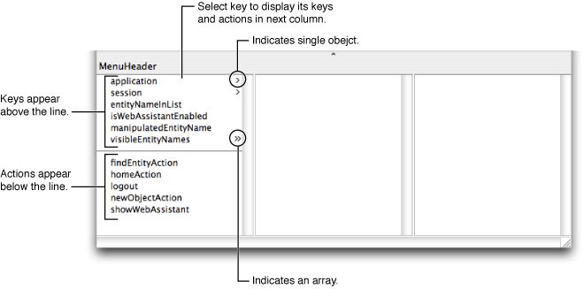

The first column in the object browser displays both keys and actions that belong to your component. _Keys_ are displayed above the horizontal line and can be either an instance variable or method that returns a value. _Actions_ are displayed below the line—they are methods that take no parameters and return a component that is the next page. If an action returns `null`, the current page is redisplayed.

You use the object browser to essentially navigate your web component's object graph. A greater-than character (>) appears next to an object's name in the browser if it contains additional keys and actions (if it has children). When you select an object, its keys and actions are displayed in the next column. If a key is an array, then two greater-than characters appear next to its name (>>). When you select an array, it's `count` attribute along with other attributes is displayed in the next column. For example, [Figure 4-1](#apple-f4xwc4dqnrsv64tfmyxwi33df52wszbpkridimbqgazdgnbzfvjvomjq) shows that the web component has a key called `visibleEntityNames` that is an array.

All components have `application` and `session` keys because they are keys inherited from WOComponent. You can subclass WOApplication and WOSession to add additional keys and actions to these objects.

You can add keys and actions to your web component interface using either WebObjects Builder or by editing the component source in Xcode. When you save your changes in Xcode, WebObjects Builder parses the file, detects items that have been added, deleted, or changed and updates the object browser to reflect those changes.

Alternatively, you can add a display group key by dragging an EO model entity or relationship from EOModeler or Xcode to your component window. Read [Using Display Groups](Using%20Display%20Groups.md#apple-f4xwc4dqnrsv64tfmyxwi33df52wszbpkridimbqgazdgmzufvjvomi) for more information on adding display groups in this manner.

Follow the instructions in this section to modify your web component interface using WebObjects Builder. The instructions use the Interface pop-up menu on the toolbar but all of these actions are also available from either the Edit Source submenu in the Edit menu or a contextual menu in the object browser (Control-click an object in the object browser to display the contextual menu).

Note that your component needs to be saved and added to your Xcode project before you can modify the interface—the component's Java source file needs to be on disk. If you created a new component, the Interface menu may be disabled. Save your component to enable this menu.

Keys are the variables in your code that contain application-specific data. You can bind keys to dynamic elements to either push data to the user or pull data from the user. Use the Interface menu to add a key as follows:

1. Choose Interface > Add Key.

   A sheet appears prompting you for more information.
2. Type the name of the key in the Name field.
3. If the key is a mutable array, select "Mutable array of" as the type and choose the contained type from the pop-up menu or enter the type in the combo box directly.

   WebObjects Builder needs to know the type of objects that will be contained in the array so you can make additional bindings to those objects in the object browser. The pop-up menu also contains the entity names in your models. If you are unsure which type to use, choose Object.

   For example, in [Figure 4-2](#apple-f4xwc4dqnrsv64tfmyxwi33df52wszbpkridimbqgazdgnbzfvjvomjr)the key is a mutable array of type Talent.

   __Figure 4-2__  Add key sheet

   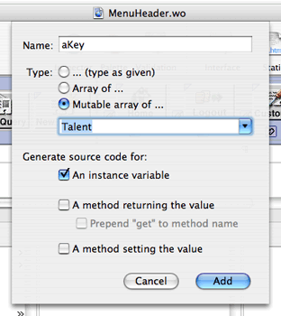
4. If the key is a non-mutable array, select "Array of" as the type and choose the contained type from the pop-up menu or enter the type in the combo box directly.
5. If the key is not an array, select "(type as given)" and choose the type from the pop-up menu or enter the type in the combo box directly.
6. Select the appropriate objects under "Generate source code for." For example, select "An instance variable" if you want an instance variable created in the source code.

   The key can be an instance variable whose value is accessed directly or a method that returns a value (not necessarily associated with an instance variable). You can also create a method that sets the value of an instance variable.

   Note that at least one source code option must be selected. You cannot deselect all of the source code options.
7. Click Add when done.

   The new key appears in the object browser (below `application` and `session`) and the corresponding source code is updated.

If you choose an entity name from the Type pop-up menu—for example, if you enter `selectedMovie` as the name and choose Movie as the type—the following code is added to your source file:

```
/** @TypeInfo Movie */
protected EOEnterpriseObject selectedMovie;
```

The instance variable `selectedMovie` is declared as type EOEnterpriseObject. The comment `/** @TypeInfo Movie */` is a structured comment that WebObjects Builder uses to identify the entity associated with the object—don't edit it. The structured comment enables WebObjects Builder to display the attributes of `selectedMovie` in the object browser as shown in Figure 4-3.

__Figure 4-3__  Viewing object properties

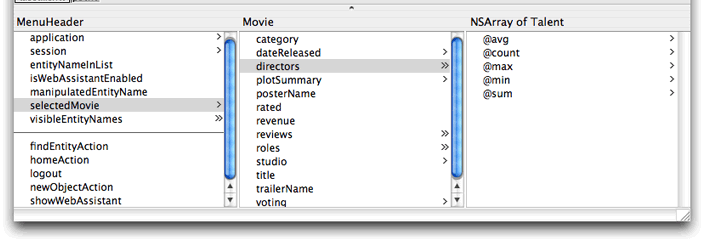

Add actions to your interface to perform some business logic or processing when, for example, a button is clicked. The action needs to return the next component or webpage that will be displayed. Follow these steps to add an action to your component:

1. Choose Interface > Add Action.

   A sheet appears prompting you for more information.
2. Enter the name of the action in the Name field.
3. Select the response page from the Component pop-up menu or type in the name of the component in the text field.

   The Component pop-up menu that appears contains standard JavaScript components used for action buttons.

   If you type in a component name, make sure the component is loaded in your project; otherwise the action will fail at runtime.
4. Click Add when done.

   The new action appears below the line in the object browser and the corresponding source code is updated.

Follow these steps to delete a key or action:

1. Select the key or action to delete in the object browser.
2. Choose Interface > Delete Key.

   Any variables and methods associated with the key or action are deleted from the source file. You can restore the deleted key or action by choosing Edit > Undo.

Follow these steps to rename a key or action:

1. Select the key or action to rename.
2. Choose Interface > Rename Key.

   A sheet appears to obtain the new name.
3. Enter the new name in the Name field.
4. Click Rename.

Choose Interface > View Source to open the web component Java source file in Xcode.

Similarly, you can add keys and actions to your `application` and `session` objects. Your WebObjects application should contain `Application.java` and `Session.java` files located in the Classes group. These classes are subclasses of WOApplication and WOSession respectively. When you add keys and actions to the `application` and `session` variables in your component, you are modifying the Application and Session class interfaces respectively.

Follow these steps to modify the application interface:

1. Select `application` in the object browser and Control-click anywhere in the second column including the heading.

   A menu appears containing various options to modify the application interface as shown in Figure 4-4.

   __Figure 4-4__  The Interface menu

   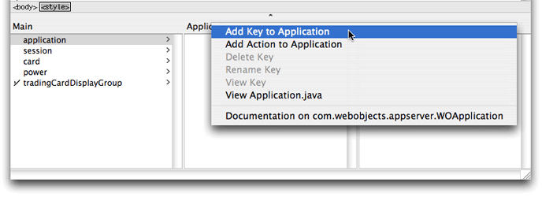
2. To add a key, choose Add Key to Application.
3. To add an action, choose Add Action to Application.

Follow the same steps to modify `session` except select `session` in the object browser.

No matter what dynamic elements you use, the procedure to bind them to your objects—for example, application, session, web component, or display group object—is the same. This section discusses the basic procedure for binding elements. Read [Using Dynamic Form Elements](#apple-f4xwc4dqnrsv64tfmyxwi33df52wszbpkridimbqgazdgnbzfvjvomy), [Using Other Concrete Dynamic Elements](#apple-f4xwc4dqnrsv64tfmyxwi33df52wszbpkridimbqgazdgnbzfvjvonq), and [Using Abstract Dynamic Elements](#apple-f4xwc4dqnrsv64tfmyxwi33df52wszbpkridimbqgazdgnbzfvjvoni) for element-specific details and more examples.

Figure 4-5 shows a form element (WOForm) wrapped around a dynamic text element (WOTextField). The triangle in the top-left corner of the WOTextField distinguishes a dynamic text element from a static HTML text element. The long rectangle surrounding the text element represents the containing form element.

__Figure 4-5__  Binding a WOTextField

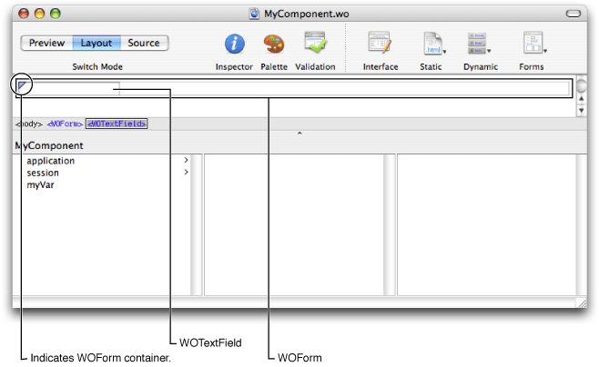

Follow these steps to bind the dynamic text element to an application object—for example, bind the WOTextField to `myVar` (follow the steps in [Adding Keys](#apple-f4xwc4dqnrsv64tfmyxwi33df52wszbpkridimbqgazdgnbzfvjvooa) to add `myVar` to your component).

1. In the object browser, drag from `myVar` to inside the text field element in Layout mode.

   A black line appears from `myVar` to the current mouse location. As you drag over an element, a black box appears around the element indicating that you can bind to that element.
2. Release the mouse button.

   A menu containing the attributes for that element appears as shown in Figure 4-6.

   __Figure 4-6__  Binding the value attribute

   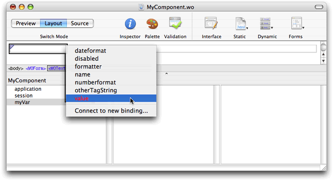
3. To complete the binding, choose the attribute you want to bind to from the menu—for example, choose `value` if the element is a WOTextField.

   The name of the binding appears in the element—for example, `myVar` appears in the WOTextField. The bindings available depend on the element. Read _WebObjects Dynamic Elements Reference_ for a detailed description of each dynamic element and its bindings.

Some dynamic elements have icons that appear at the beginning and end of the element in Layout mode. You can optionally drag to the icon to create a binding. Some elements, like WOString elements, have shortcuts—for example, you can drag from a key to the center of a WOString (as shown in Figure 4-7) to bind to the `value` attribute of the WOString. The binding appears directly in the box, and the attribute menu doesn't appear.

__Figure 4-7__  Binding a WOString

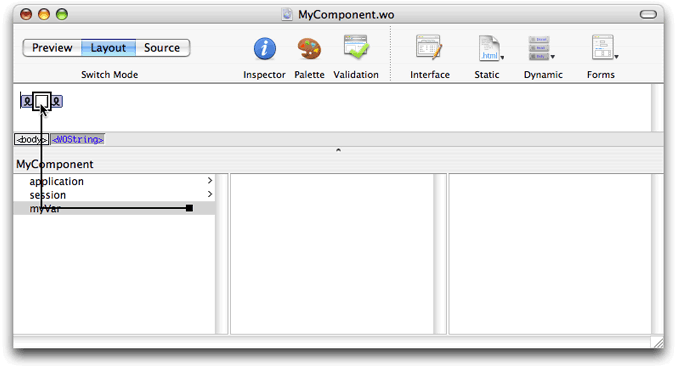

You can also view the bindings using the inspector. Select the element in either the graphical view or the path view and click the Inspector button on the toolbar to open the Inspector. The name of the variable appears in the Binding column next to the attribute as show in Figure 4-8.

__Figure 4-8__  The WOTextField Binding Inspector

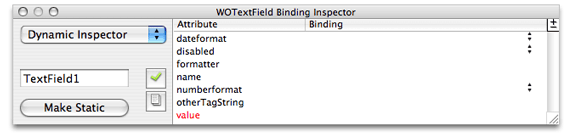

You can also bind an element's attributes by typing in the inspector directly as follows:

1. Double-click in the Binding column of the row for the attribute you want to set.

   A cursor appears in the Binding column, allowing you to type.
2. Type the binding in the text field.

   As you type, WebObjects Builder attempts to complete the binding using keys in the object browser.
3. When the desired key appears in the binding column, press Return.

These rules apply when entering bindings directly in the inspector:

- Constant strings (such as "MyVar") must be in double quotes.
- Variable and method names (such as `myVar`) must not be in quotes.
- Symbolic constants (such as `true` and `false`) must not be in quotes.
- You must specify the full key path when entering a binding.

Use the inspector to delete a binding as follows:

1. Select the element.
2. Click Inspector on the toolbar to open the inspector window.
3. Click the row that contains the binding you wish to delete.
4. Choose "Delete binding" from the +/- menu in the top-right corner of the inspector window. Optionally, press the Delete key.

You can also add bindings to a dynamic element. Typically, you add bindings to a custom element that may not appear in the inspector—WebObjects Builder already knows about the bindings for existing elements. Follow these steps to add a binding to an element:

1. Select the element.
2. Click Inspector on the toolbar to open the inspector window.
3. Choose "Add binding" from the +/- menu in the top-right corner of the inspector window.
4. Enter the name of the binding in the Attribute column as shown in Figure 4-9.

   __Figure 4-9__  Adding bindings

   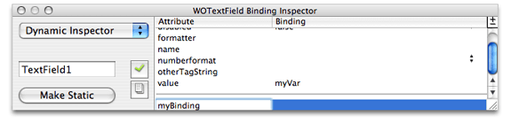

You can use the inspector to view documentation about an element and its bindings as follows:

1. Select the element.
2. Click Inspector on the toolbar to open the inspector window.
3. Click the documentation button.

   A window opens displaying the documentation for the element and its bindings as shown in Figure 4-10.

   __Figure 4-10__  Viewing documentation

   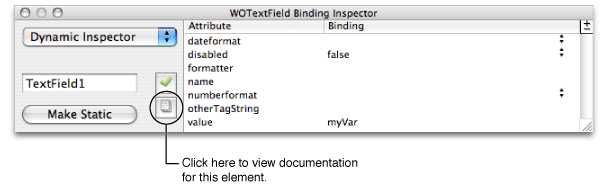

This section explains how to use the dynamic form elements to create forms where users enter information. A form is a page or portion of a page containing fields that the user edits. Typically, the user clicks a button or types Return when done entering information in a form. WebObjects gives your application access to the data entered by users by allowing you to associate, or _bind_, these elements to variables and actions in your application.

In WebObjects Builder, you create form elements by choosing one of the dynamic elements from the Forms pop-up menu on the toolbar or Forms menu in the menu bar. All the form elements in this menu are _concrete_—they have static HTML counterparts. You can convert any dynamic form element to its static equivalent (and vice versa) by using the inspector. Read [Inspecting Elements](Editing%20Components.md#apple-f4xwc4dqnrsv64tfmyxwi33df52wszbpkridimbqgazdgnbvfvjvonq) for how to convert dynamic elements to their static counterparts.

In HTML, a form is a container element—an element that contains other elements. Typically, forms contain input elements–for example, text fields, radio buttons and checkboxes—to capture user information, a button or active image to submit the form data, as well as display elements such as text and images.

Most form elements have a `value` binding that represents the information entered by the user. You bind this attribute to a key in your application so that your application can use it. Other elements, such as WOSubmitButton, WOImageButton, or WOForm, don't receive information but have an `action` binding representing an action to be taken when the form is submitted. Follow the general procedure for binding elements as described in [Binding Elements](#apple-f4xwc4dqnrsv64tfmyxwi33df52wszbpkridimbqgazdgnbzfvjvomq).

Typically, you create a WOForm element to contain other form elements, including buttons. If you add submit and reset buttons to the form, they apply to all elements in the form. Read [Login Panel Example](#apple-f4xwc4dqnrsv64tfmyxwi33df52wszbpkridimbqgazdgnbzfvjvomzv) to understand how to create a form. The rest of this section introduces the form elements.

Follow the steps below to implement a simple login panel where the user enters a user name and password and then clicks Submit. This example covers the general procedure for creating a form: create form elements, add keys and actions, create bindings, and implement methods. You can extend this example to create your own form.

Follow these steps to create the form for a login panel shown in Figure 4-11:

1. Choose Forms > WOForm to add a WOForm element to a new component.
2. Type `Username:` in the WOForm.
3. Choose Forms > WOTextField to create a username text field.
4. Press Return to create a new paragraph.
5. Type `Password:` in the WOForm.
6. Choose Forms > WOPasswordField to create a text field with hidden text.
7. Press Return to create a new paragraph.
8. Choose Forms > WOSubmitButton to add a submit button

__Figure 4-11__  Creating login elements

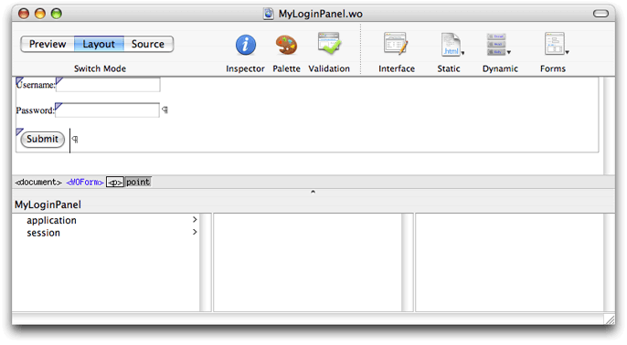

You can extend this example by using a table to format the login panel. For example, use one column in a table to right-justify the labels and another column to left-justify the text fields. Use the last row in the table to center the Submit button under the text fields.

Follow these steps to add keys needed by the login panel to your web component source:

1. Choose Interface > Add Key.

   A sheet appears prompting you for more information as shown in Figure 4-12.
2. Type `username` in the Name text field.
3. Type `String` in the Type text field or choose String from the menu.
4. Select "An instance variable."
5. Click Add.

   A `username` key appears in the object browser.
6. Repeat steps above to add a `password` key.

__Figure 4-12__  Adding login keys

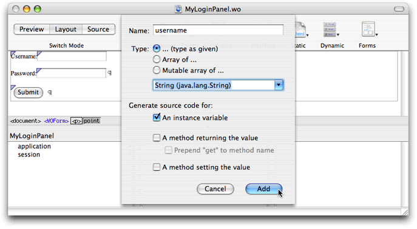

Follow these steps to add a login action to your web component source:

1. Choose Interface > Add Action.

   A sheet appears prompting you for more information as shown in Figure 4-13.
2. Type `login` in the "Action name" text field.
3. Choose a component or type the name of the component in the Component combo box.

   Typically, you have a component representing a default page—the page that appears after the user logs in. The Component menu contains all the components in your project. Choose the appropriate component for your application from this menu.
4. Click Add.

   A `login` action appears in the object browser.

__Figure 4-13__  Adding login actions

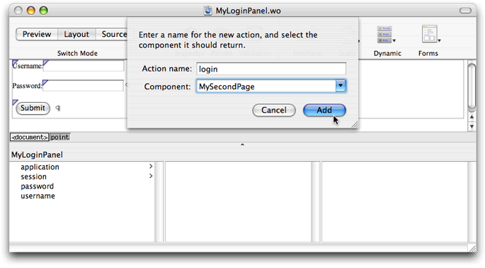

Follow these steps to bind the Username and Password text fields to your component:

1. Drag from the `username` key in the object browser to the Username text field in the layout mode.
2. Release the mouse button while on the WOTextField element.

   A menu appears containing the bindings for the WOTextField as shown in Figure 4-14.
3. Choose `value` from the menu.

   The text `username` appears in the WOTextField.
4. Follow the same steps above to bind the `password` key to the Password WOTextField.

   The text `password` appears in the WOTextField.

__Figure 4-14__  Creating login bindings

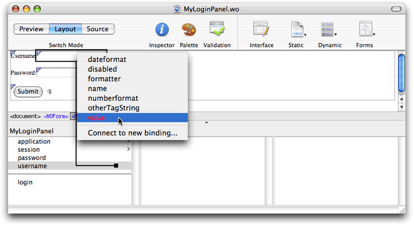

Follow these steps to bind the Submit button to the `login` action:

1. Drag from the `login` action in the object browser to the Submit button in the layout mode.
2. Release the mouse button while on the WOSubmitButton.

   A menu appears containing the bindings for the WOSubmitButton.
3. Choose action from the menu.

Finish by implementing the login action in your web component source to verify the `username` and `password` provided by the user (how you verify the login fields is application-dependent). The method should return the default page if the `username` and `password` are correct; otherwise, return `null` to show the same page.

Optionally, you can add an error message using a WOString element to the page. The WOString can display an error message when the login action failed—for example, display "Your password is incorrect. Please try again." You can wrap the WOString in a conditional so it appears only when an error occurs.

You use the following text elements to display or input text:

- WOText is a multiple-line text field for input or display.
- WOTextField is a single-line text field for input and display.
- WOPasswordField is similar to WOTextField but hides the text entered by the user.
- WOHiddenField adds hidden text to an HTML page. You can use this element to store application state data in a page.

Use WOBrowser to display a list of selectable items in a scroll view. Use the related element, WOPopUpButton, if you want to display the selected item in a pop-up menu.

Use checkboxes, pop-up menus, and radio buttons for selecting items from a list. You use checkboxes for multiple selections of `boolean` values. Use pop-up menus and radio buttons for selecting one of many items. The specific elements are:

- WOCheckBox is a single checkbox with a label that you can use to turn on/off a flag. Use the WOCheckBoxList element if you want to create a list of checkboxes.
- WOPopUpButton is a menu button that pops up a list when selected. The user can select only one item in the list.
- WORadioButton is a single on/off switch you can use for a selection. Use WORadioButtonList if you want a group of WORadioButton elements where the user selects no more than one of several choices.

Read [PremadeElements Palette](Working%20With%20Palettes.md#apple-f4xwc4dqnrsv64tfmyxwi33df52wszbpkridimbqgazdgnjzfvjvomjr) for how to create multiple radio buttons wrapped in a repetition.

There are three button elements:

- WOImageButton is a submit button where you specify the button image. Clicking the image of a WOImageButton has the same behavior as clicking a WOSubmitButton.
- WOSubmitButton submits the enclosing form's values to the WebObjects application.
- WOResetButton resets the form to the original state.

Use the WOFileUpload element if you want to allow the user to upload a file to the web server. Read [PremadeElements Palette](Working%20With%20Palettes.md#apple-f4xwc4dqnrsv64tfmyxwi33df52wszbpkridimbqgazdgnjzfvjvomjr) for how to create a file upload element with a submit button.

In addition to dynamic form elements, WebObjects provides a number of concrete dynamic elements—elements that have HTML counterparts at runtime and display dynamic content. For example, a hyperlink element whose address is determined at runtime. You can bind these dynamic elements to variables and methods in your application to control how they are displayed.

The dynamic elements described in this section are concrete with HTML counterparts but do not need to be in a form. For example, use WOActiveImage if you need a button outside a form, and use WOImageButton if you need a button inside a WOForm.

Read [Using Dynamic Form Elements](#apple-f4xwc4dqnrsv64tfmyxwi33df52wszbpkridimbqgazdgnbzfvjvomy) for more information on form elements. Read [Using Abstract Dynamic Elements](#apple-f4xwc4dqnrsv64tfmyxwi33df52wszbpkridimbqgazdgnbzfvjvoni) to learn more about abstract dynamic elements—for example, conditionals and repetitions—that control how dynamic web content is generated.

WOString elements dynamically generate string content. You bind the `value` attribute of a WOString to a variable or method in your web component that returns a string at runtime. The counterpart to a WOString element is not an HTML element but plain text. Therefore, WOString elements are treated like plain text—they can be contained in any HTML element that contains text and can be formatted in a way similar to the way text is formatted.

WebObjects Builder provides a shortcut for binding the `value` attribute of commonly used elements such as WOString. Instead of dragging to one of the icons on either side of the WOString element in the layout mode, drag to the center box as shown in [Figure 4-7](#apple-f4xwc4dqnrsv64tfmyxwi33df52wszbpkridimbqgazdgnbzfvjvomju). The binding appears directly in the box, and the attribute menu doesn't appear.

WOHyperlink elements allow you to specify a hyperlink where the link's name and destination are dynamic. You can even specify your own action method to be invoked when the link is clicked. Read _WebObjects Dynamic Elements Reference_ for a complete list of hyperlink bindings.

__Figure 4-15__  An email hyperlink

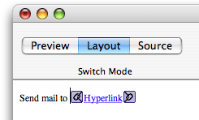

For example, follow these steps to create a hyperlink at the bottom of your page to send email as shown in Figure 4-15:

1. Type `Send mail to` in layout mode followed by a space.
2. Choose Dynamic > WOHyperlink.

   A hyperlink element appears with the word `Hyperlink` highlighted.
3. Type `support@mycompany.com` into the WOHyperlink text area (this text replaces the word `Hyperlink`).

   The text that appears inside of a WOHyperlink is displayed at runtime—it doesn't need to be a URL, it can be a logical name, such as the name of a page. If you want the name to be dynamic, you can put a WOString inside of a WOHyperlink and bind the WOString to your variable.
4. Select the WOHyperlink in the graphical view or path view.
5. Click Inspector in the toolbar.

   The WOHyperlink Binding Inspector appears.
6. Double-click the cell, in the Binding column, to the right of `href`.
7. Type `"mailto:support@mycompany.com"` in the cell (include the quotes) as shown in Figure 4-16.

   __Figure 4-16__  The WOHyperlink Binding Inspector

   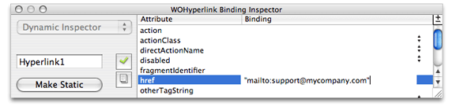
8. Press Return.

When the user clicks `support@mycompany.com` on the webpage, the default mail program is launched and the email message is addressed to `support@mycompany.com`.

The WOImage and WOActiveImage elements are dynamic images. At runtime, WOImage is rendered as a passive image and WOActiveImage as a mapped, active image (behaves like a button). You bind the dynamic image's `filename` or `src` attribute to a key (variable or method) in your application that returns a file URL to your image. The `filename` attribute is a relative URL and `src` is an absolute URL. You can optionally bind the `width` and `height` of the image, too. Hence the content of an image can be dynamic.

This section contains some examples of using dynamic images. Read _WebObjects Dynamic Elements Reference_ for a complete list of image bindings.

If you want to just display an image on a page, use WOImage and bind the `filename` or `src` attributes to a variable or method in your application. For example, follow these steps to add an image to your component that displays content returned by a method in your component. Assume that the `currentImage` method already exists in your component source.

1. Choose Dynamic > WOImage.
2. Select the new WOImage element and click Inspector on the toolbar.

   The WOImage Bindings Inspector appears. Mandatory bindings appear in red text as shown in Figure 4-17. You can bind either `data`, `filename`, or `src` although all of these bindings appear in red text when no bindings are set.

   __Figure 4-17__  The WOImage Binding Inspector

   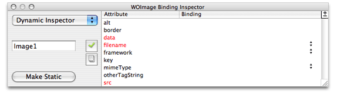
3. Drag from `currentImage` in the object browser to the WOImage in the graphical view or path view.
4. Choose `src` from the pop-up menu.

   You are done when none of the bindings in the WOImage Bindings Inspector appear in red text. Otherwise, a validation error will occur.

Typically, you use a WOActiveImage when you need a button outside of a form. The buttons described in [Buttons](#apple-f4xwc4dqnrsv64tfmyxwi33df52wszbpkridimbqgazdgnjqfvjvomq) work only inside of a WOForm element. WOActiveImage has the same `filename` and `src` attributes, to specify the image, that you used to create a WOImage. After binding either `filename` or `src`, you just need to bind `action` to the method in your component that you want invoked when the button is clicked.

Containers wrap around other types of elements. Use WOBody if you want a dynamic image as the background. Use WONestedList if you want to display hierarchical content. Use WOEmbeddedObject to add a Netscape plug-in. Use a WOFrame to specify the content of a frame dynamically. Read [Editing Frames](Editing%20Components.md#apple-f4xwc4dqnrsv64tfmyxwi33df52wszbpkridimbqgazdgnbvfvjvooa)for more information on using frames.

Use WOJavaScript to embed a script written in JavaScript in a dynamically generated page. Use WOActionURL and WOResoourceURL to facilitate communication between JavaScript and your web application. Use WOActionURL to add a URL that invokes methods or specific pages. Use WOResourceURL to add a URL that returns resources such as images and sounds.

The WOApplet dynamic element represents a Java applet or client-side component. There are two ways to create a WOApplet:

- Choose Dynamic > WOApplet.

  A WOApplet element is added to your component and you must open the inspector to set its bindings as shown in Figure 4-18. Set the `code` binding to the corresponding Java class—for example, `"MyApplet.class"`—and set the `codebase` binding—for example, set it to `"/Java/"`. By default, the Applet executable should be placed in `/Library/WebServer/Documents/Java`.

  __Figure 4-18__  The WOApplet Binding Inspector

  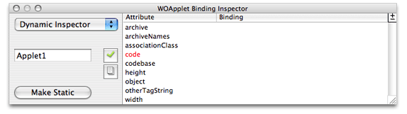
- Drag a file of type `.class` into your component.

  You are asked whether you want to add the `.class` file to your project. If you click Yes, it is added to the Web Server Resources group. A WOApplet appears in your component, with its `code` attribute set to the name of the file.

You use a generic WebObject element to create a dynamic version of any HTML element.

Follow these steps to create a generic WebObjects element from a supported HTML element:

1. Add an HTML element to your component as described in [Inserting Elements](Editing%20Components.md#apple-f4xwc4dqnrsv64tfmyxwi33df52wszbpkridimbqgazdgnbvfvjvoni).
2. While the element is selected, open the inspector as shown in Figure 4-19and click Make Dynamic.

   __Figure 4-19__  The Generic WebObject Inspector

   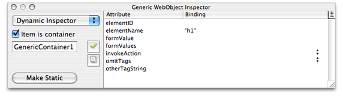

   If the element has no dynamic counterpart in WebObjects, it becomes a generic WebObjects element—that is, a WOGenericContainer or a WOGenericElement.

Follow these steps to create a generic WebObjects element from HTML that doesn't appear in WebObjects Builder:

1. Choose Dynamic > WOGenericContainer.
2. Click Inspector on the toolbar.

   The Generic WebObject Inspector appears with the `elementName` attribute in red text. The `elementName` attribute specifies the type of element that is generated at runtime in place of this generic element.
3. Double-click in the binding column next to `elementName` and type the name of the element in quotes.

   If the name isn't in quotes, WebObjects assumes it is a binding that should be resolved at runtime. You might use a binding if you want to choose the type of element programmatically rather than specifying it in advance.
4. Use the "Add binding" item in the +/- menu to specify any additional properties of the element that don't appear in the inspector.

If you create a WOGenericElement and want to change it to a WOGenericContainer, select "Item is container" in the inspector.

Use WOXMLNode to build web components that are complex XML documents (not HTML). WOXMLNode has a single binding, `elementName`, that should be set to the name of the element you want wrapped around the content.

For example, choose Dynamic > WOXMLNode to add a WOXMLNode element. The HTML added to your component is `<webobject name="XMLNode1"></webobject>`. Whatever content you insert in this element in your component file will be wrapped in the `elementName` tag when rendered.

WebObjects also provides abstract dynamic elements that do not have HTML counterparts. These abstract elements, such as conditionals and repetitions, are used to control the generation of other elements. Using these abstract elements is similar to programming. You can wrap content with abstract dynamic elements `N` levels deep. Hence, you can generate very sophisticated HTML webpages using abstract elements.

A WOConditional element is a dynamic container element that displays its contents only if a particular condition is `true`.

The main binding of a WOConditional element is `condition` which is a `boolean` value. If `condition` is `true`, the contents is displayed. If `condition` is `false`, the contents is not displayed.

Follow these steps to add a conditional:

1. Choose Dynamic > WOConditional.

   Any selected elements will be contained within the conditional. [Figure 4-20](#apple-f4xwc4dqnrsv64tfmyxwi33df52wszbpkridimbqgazdgnbzfvjvomrv)shows a new conditional with the default content when nothing is selected.
2. Select the conditional and click Inspector on the toolbar.

   The WOConditional Binding Inspector window appears with the `condition` binding in red text as shown in Figure 4-20.

   __Figure 4-20__  Adding a conditional

   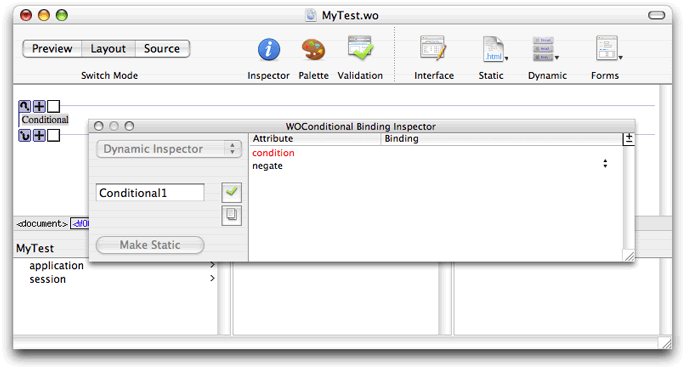
3. Bind `condition` to a variable or method in your application that returns a `boolean` value.
4. Set the `negate` attribute to `true` if you want the content displayed when `condition` is `false`.

You can use conditionals to implement the equivalent of an "if-then-else" structure in a programming language; that is, "if `condition` is `true`, display this text; if not, display this other text." You use the `negate` binding of a conditional to do this. If `negate` is `true`, then the contents of the conditional is displayed only if `condition` is `false`. Follow these steps to create an if-then-else structure:

1. Choose Dynamic > WOConditional twice to create two adjacent conditionals.
2. Bind `condition` of both conditionals to the same variable or method.

   If using a variable, it must be a `boolean` type. If using a method, it must return a `boolean` value.
3. Click the plus icon on the second conditional to change `negate` to `true`.

   The button changes from a plus to a minus. By default `negate` is `false`, so you do not need to bind the first conditional's `negate` attribute unless you changed it. Your if-then-else structure should look like the one in Figure 4-21.

   __Figure 4-21__  An if-then-else structure

   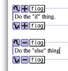

WebObjects provides these shortcuts for binding conditionals, as show in Figure 4-22:

- Drag from the object browser to the question mark icon to bind to any attribute.

  Choose a binding from the pop-up menu.
- Click the +/- button to toggle the `negate` state.
- Drag from the object browser to the first box to bind to `condition` directly.

  The conditional binding appears inside the box.

__Figure 4-22__  Conditional shortcuts

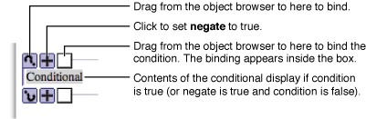

You can wrap a conditional around a table row or cell to optionally display that row or cell.

To wrap a table row or cell with a conditional, select the row or cell—for example, click `<tr>` or `<td>` in the path view—and choose Dynamic > WOConditional. The selection is wrapped with the conditional. The conditional symbol doesn't appear by default in the graphical view but the row appears with a dark blue border and the cell or cells appears with a light blue background. (Read [Editing Tables](Editing%20Components.md#apple-f4xwc4dqnrsv64tfmyxwi33df52wszbpkridimbqgazdgnbvfvjvomzu)for more details on selecting rows and cells.)

To select a conditional that is inside a table, click in the table and select the `<WOConditional>` element from the path view.

To bind a conditional that is inside a table, select inside the row or cell, and drag from your application variable or method to the `<WOConditional>` element in the path view. Or select the `<WOConditional>` element in the path view and open the inspector. Use the inspector to bind `condition` and `negate` to your application variables and methods.

Optionally, you can turn on the table tags to see the elements that are wrapped around rows and cells. If you do this, you can bind your elements using the shortcuts. To turn on the table tags, open the Preferences window, click the Layout button, and select tables from the "Show inline graphical tags for" options.

A WORepetition element is a container element that repeats its content the specified number of times. It is like a loop in a structured programming language. Repetitions are one of the most important elements in WebObjects, since it is common for applications with database backends to display numerous records, and the amount of data to be displayed, is not known until runtime. For example, a repetition is used to generate items in a list, multiple rows in a table, or multiple tables.

This section describes how to create and bind your own repetitions. However, the PremadeElements palette contains some reusable components that use repetitions. There are examples of tables, list items, and radio buttons wrapped in repetitions. Read [PremadeElements Palette](Working%20With%20Palettes.md#apple-f4xwc4dqnrsv64tfmyxwi33df52wszbpkridimbqgazdgnjzfvjvomjr)for more information on using this palette.

Typically, you bind these two attributes of a repetition: `list` and `item`. The `list` attribute must be bound to an array. WebObjects generates the elements in the repetition once for each item in the array. Each time through the array, the `item` attribute points to the current array object. Typically, you bind `item` to an application variable and then use that variable in the contents of a repetition.

Follow these steps to create and bind a repetition:

1. Choose Dynamic > WORepetition.

   The repetition appears in the component window at the insertion point as shown in Figure 4-23.

   __Figure 4-23__  Adding a repetition

   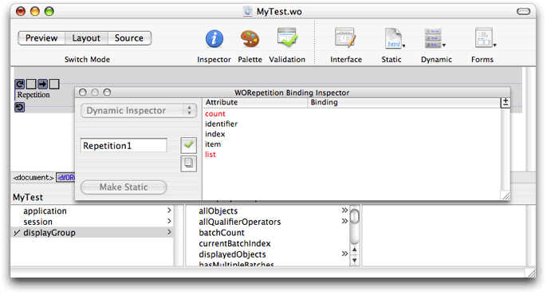
2. Add content to be repeated inside the repetition, replacing the word `Repetition`.

   A repetition can contain any other elements, either static HTML or dynamic WebObjects elements.
3. Select the repetition and click Inspector on the toolbar to open the inspector.

   The `count` and `list` bindings appear in red text. Typically, you bind `item` and `list`.
4. Bind `list` to an array in your application—for example, the `displayedObjects` attribute of a display group.

   The array appears in the first text box between the repetition icon and right arrow icon as shown in Figure 4-24. If the inspector is open, `count` changes to black text and `item` changes to red text. If you bind `list` you must also bind `item`; otherwise a validation error will occur.

   __Figure 4-24__  Binding a repetition

   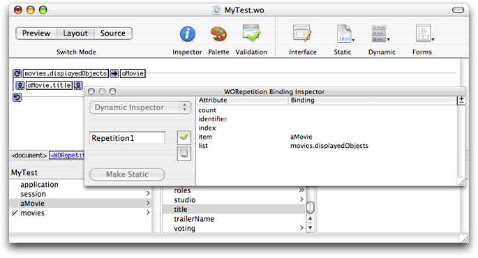
5. Bind `item` to a variable in your application that can be used within the repetition to reference the current item.

   The variable appears in the second text box after the right arrow icon as shown in Figure 4-25.
6. Finally, you add content inside the repetition that displays something about the item.

For example, using `Movies.eomodeld`, you can add a display group to your interface, called `movies`, that manages all the Movie objects, and a variable, called `aMovie`, that you use within the repetition to reference the current item. [Figure 4-25](#apple-f4xwc4dqnrsv64tfmyxwi33df52wszbpkridimbqgazdgnbzfvjvomzx) shows what the repetition looks like in Layout mode when you bind `item` and `list`. The content of the repetition is a WOString that displays the `title` of `aMovie`. This repetition displays all the movie titles delimited by a comma. Read [Wrapping Table Rows and Cells With Repetitions](#apple-f4xwc4dqnrsv64tfmyxwi33df52wszbpkridimbqgazdgnbzfvjvooi)for how to use a table to format large amounts of data.

__Figure 4-25__  A bound repetition

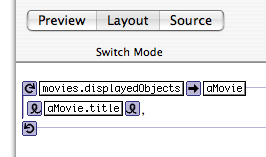

WebObjects Builder also provides shortcuts for binding repetitions so that you don't have to use the inspector. Drag to the first binding box to bind the `list` attribute, and drag to the second box to bind to the `item` attribute as shown in Figure 4-26.

__Figure 4-26__  Repetition shortcuts

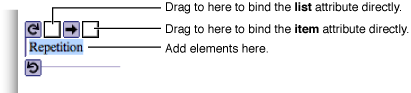

You can use tables to format large amounts of data where the quantity and content of the data is not known until runtime. Typically, you use tables, repetitions, and display groups to implement lists of your entity objects. Each row in the table corresponds to an enterprise object and each column corresponds to a property you want to display about that object. The display group is used to provide the array of objects. Because you can wrap both rows and cells with a repetition, the properties you display about enterprise objects in these tables can be determined at runtime too.

For example, Figure 4-27 shows a repetition wrapped around a row in a table. At runtime, this table will display information about Movie objects. The first column displays the title of the movie, the second displays the name of the studio who produced the movie, and the last displays the rating of the movie. The size of the table expands at runtime to contain all the records provided by the `movies` display group.

__Figure 4-27__  Wrapping table rows with repetitions

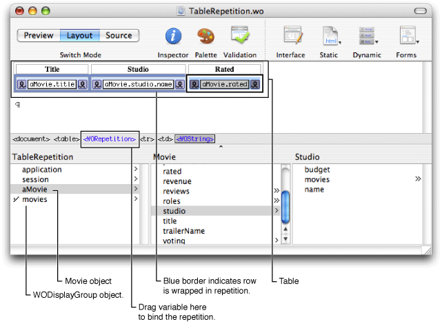

To wrap a table row or cell with a repetition, select the row or cell and choose Dynamic > WORepetition. The repetition symbol doesn't appear by default in the graphical view but the row appears with a dark blue border and the cell or cells appear with a light blue background. (Read [Editing Tables](Editing%20Components.md#apple-f4xwc4dqnrsv64tfmyxwi33df52wszbpkridimbqgazdgnbvfvjvomzu)for more details on selecting rows and cells.)

To select a repetition that is inside a table, click in the table and select the `<WORepetition>` element from the path view.

To bind the repetition that is inside a table, drag from the object browser to the `<WORepetition>` element in the path view. The attribute menu appears, allowing you to bind the element as usual. Otherwise, you can select the `<WORepetition>` element in the path view and open the inspector to bind the element.

Optionally, you can turn on the table tags to see the elements that are wrapped around rows and cells. If you do this, you can bind your elements using the shortcuts. _To turn on the table tags_, open the Preferences window, click the Layout button, and select tables from the "Show inline graphical tags for" options.

WOComponentContent is another abstract dynamic element that helps support another programming concept, reusability. You can build reusable web components and add them to other components or place them on a palette. You use the WOComponentContent element to group other elements and components together. Like the WORepetition and WOConditional dynamic elements, reusable components can wrap HTML elements. When you are editing a reusable component, the wrapped HTML elements are collectively called the component content. Use the WOComponentContent dynamic element to refer to it. Read [Custom Components](Custom%20Components.md#apple-f4xwc4dqnrsv64tfmyxwi33df52wszbpkridimbqgazdkmbqfvjvomi) for details on using WOComponentContent.

Choose Dynamic > WOComponentContent to create a component content. This dynamic element has no bindings, and you can only have one WOComponentContent element in a given component.

You can also configure the look of dynamic elements in the graphical view in Layout mode. Choose WebObjects Builder > Preferences to open the window and click Dynamic to view the dynamic element preferences as shown in Figure 4-28.

__Figure 4-28__  Dynamic element preferences

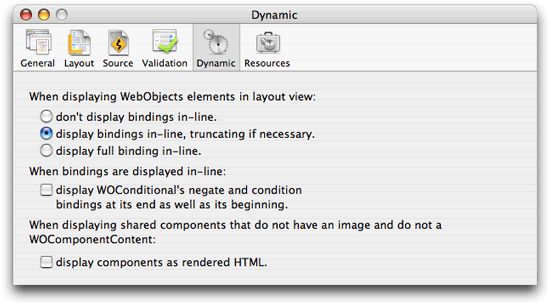

[Next](Using%20Display%20Groups.md)[Previous](Working%20With%20Static%20Elements.md)

