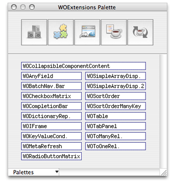
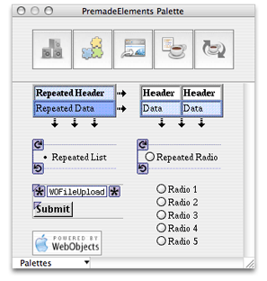
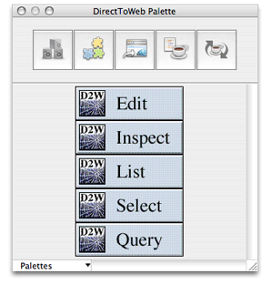
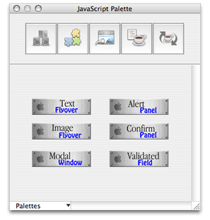
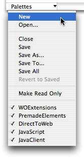
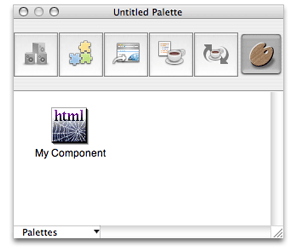

> 导航：[总目录](../../../README.md) · [documentation](../../../_indexes/documentation.md) · [WebObjects Builder User Guide](Introduction%20to%20WebObjects%20Builder.md)

[Next](Custom%20Components.md)[Previous](Using%20Display%20Groups.md)

# Working With Palettes

A palette is a collection of resources (such as images, static or dynamic HTML elements, and components) that you can drag to your component—items on a palette are reusable. There are several predefined palettes described in this chapter but you can also create your own custom palettes and drag elements from a component to your palette.

Regardless of which palette you use, the steps for adding palette items to your component are the same. Follow these steps to add a palette item to your component:

1. Choose Window > Palette or select Palette from the toolbar to open the Palette window.
2. Select the palette you want from the buttons at the top of the Palette window.

   The window title reflects the name of the selected palette.
3. Drag an element from the palette to your component window at the insertion point.

   The palette item is added to your component.
4. Use the inspector to configure any attributes—bind them to the variables and actions in your component.

The WOExtensions palette, shown in Figure 6-1, contains a number of reusable components provided by the WebObjects Extensions Framework. Read _WebObjects Extensions Reference_for a detailed description of all the components in this framework.

Because these components are examples, you can also examine the source code for the WebObjects Extensions Framework, located in `/Developer/Examples/JavaWebObjects/Source/JavaWOExtensions`. Examining these components is an excellent way to learn more about creating your own reusable components. Since you have the source code, you can also extend these components. Note that some of these components or similar components are used to construct Direct to Web pages.

__Figure 6-1__  The WOExtensions palette

These are the components that appear on this are:

- WOCollapsibleComponentContent allows you to expand or collapse content, as in a hierarchical view of content similar to the outline view in Cocoa.
- WOAnyField can be used on a query page to filter enterprise objects by an attribute value.
- WOBatchNavigationBar can be used on a list view to control the number of enterprise objects fetched in a batch, and fetch the next and previous batches.
- WOCheckboxMatrix displays a multicolumn array of checkboxes.
- WOCompletionBar displays a progress bar on a page.
- WODictionaryRepetition is similar to WORepetition except iterates a dictionary of key-value pairs.
- WOIFrame is a dynamic element that corresponds to the `<iframe>` tag. Use WOFrame if you want a regular frame corresponding to the `<frame>`tag.
- WOKeyValueConditional is similar to WOConditional except that it displays content depending on the value of the parent component's key. This component is used in conjunction with WOTabPanel.
- WOMetaRefresh inserts a refresh tag into your page that instructs the user's browser to display a new page after a specified time interval.
- WORadioButtonMatrix displays a multicolumn array of radio buttons.
- WOSimpleArrayDisplay displays the specified number of objects in an array in a single-column table. If the entire array does not fit in the table, the last item is a hyperlink to a page that displays all the objects.
- WOSimpleArrayDisplay2 displays all the objects in an array in a single-column table. If all the objects do not fit in the table, an inspect button is displayed which links to a page that displays all the objects.
- WOSortOrder uses multiple buttons to allow the user to specify the sort order of objects in a display group—for example, unsorted, ascending, or descending.
- WOSortOrderManyKey is similar to WOSortOrder except that the user can select a destination key to sort by—for example, sort by last name or first name.
- WOTable is a container similar to WORepetition but displays the contents in a multicolumn table. This component is used to display a matrix of checkboxes or radio buttons.
- WOTabPanel displays a tab panel. When the user selects a tab the corresponding panel appears.
- WOToManyRelationship allows the user to edit the destination objects of a to-many relationship.
- WOToOneRelationship allows the user to edit the destination object of a to-one relationship.

The PremadeElements palette, shown in Figure 6-2, contains some commonly used components built from other elements. For example, elements that you would use in a repetition. This palette is provided for your convenience to reduce repetitive actions when designing your component.

__Figure 6-2__  The PremadeElements palette

These are the components on the palette:

- Repeated Header is a table that uses repetitions to expand in both the horizontal and vertical directions.
- Repeated Table is a table that uses a repetition to expand in the vertical direction—the first row is a header and the second row is wrapped in a repetition.
- Repeated List is list wrapped in a repetition.
- Repeated Radio Button is a radio button wrapped in a repetition.
- Upload Form is a component containing a WOFileUpload and Submit button.
- Multiple Radio Buttons is a component containing multiple radio buttons.
- WebObjects Logo is a graphic you can add to your webpage.

The DirectToWeb palette, shown in Figure 6-3, contains Direct To Web pages. You can use these components in any page as long as your project includes the Direct To Web frameworks.

__Figure 6-3__  The DirectToWeb palette

These are the components on the palette:

- D2WEdit is used to edit a single enterprise object.
- D2WInspect is used to view a single enterprise object.
- D2WList is used to view a collection of enterprise objects, as in a master interface.
- D2WSelect is used to display the selected object, as in a detail interface.
- D2WQuery is used to query or search for enterprise objects.

The JavaScript palette, shown in Figure 6-4, contains all the JavaScript components provided by the WebObjects Extensions Framework.

__Figure 6-4__  The JavaScript palette

These are the components on the palette:

- Text Flyover displays a hyperlink containing text that changes color when the user passes the mouse over it.
- Image Flyover displays an active image that changes to another image when the user passes the pointer over it.
- Modal Window displays a hyperlink and when clicked opens a modal panel.
- Alert Panel displays a hyperlink and when clicked opens an alert panel.
- Confirm Panel displays a hyperlink and when clicked opens a confirm panel. The confirm panel displays a message and an OK button. The panel disappears when the user clicks the OK button.
- Validated Field is similar to WOTextField—it needs to be placed in a WOForm—except that the text in the field is validated before the form is submitted.

You can create your own custom palettes to store frequently used items, such as forms, tables, or images, and you can load palettes created by third parties. This section explains how to create, add, remove, and edit custom palettes.

_To create a new palette_, choose New from the Palettes pop-down menu at the bottom-left of the Palette window shown in Figure 6-5. The palette appears in the palette window represented by a generic palette icon. Read [Changing Palette Icons](#apple-f4xwc4dqnrsv64tfmyxwi33df52wszbpkridimbqgazdgnjzfvjvomq) to change the palette's icon.

__Figure 6-5__  Palettes pop-down menu

Follow these steps to add an item to a palette:

1. If your palette background is grey, choose Palettes > Make Editable to make it editable.

   A newly created palette is editable by default. If the background is white, it is editable. If the background is grey, it is read only. You cannot edit standard palettes.
2. Select the element or elements that you want to add to the palette in the component window.
3. Option-drag the selection in the component window to the editable palette.

   A generic HTML icon appears on the palette labeled "Untitled."
4. You can change the title of the item by selecting its name and typing as show in Figure 6-6.

   __Figure 6-6__  Adding items to palettes

   
5. Read [Changing Palette Icons](#apple-f4xwc4dqnrsv64tfmyxwi33df52wszbpkridimbqgazdgnjzfvjvomq)to change the item's icon.

You can also add any item from the file system to a palette (including such things as a component, an image, or an EOModel). Follow these steps to add items from the file system:

1. Make your palette editable.
2. Locate the item using the Finder.
3. Drag the item from the Finder onto the palette.

   For example, to add a component to a palette, you drag the `.wo` folder to the palette.

To remove an item from a palette, simply drag it off the palette while the palette is editable.

When you are done adding items to your palette, choose Palettes > Save, Save As, Save To, or Save All. A sheet appears prompting you for a palette name and location to save it.

To open an existing palette and add it to the Palette window, choose Palettes > Open.

To close or remove a palette from the palettes window, choose Palettes > Close.

You can change the icon of any palette or item on a palette following these steps:

1. Open the palette window and select the palette whose icon you want to change.
2. Make the palette editable.
3. Drag an image from the file system onto the palette's icon or an item's icon.

   You can use any image file recognized by WebObjects Builder (such as a GIF, TIFF or JPEG files).
4. Save the palette.

The steps for using palette items from your custom palettes are the same as using items from any type of palette. However, you might want to make your palette read only first. If the background of your palette is white, choose Palettes > Make Read Only.

[Next](Custom%20Components.md)[Previous](Using%20Display%20Groups.md)

