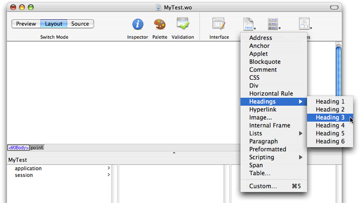
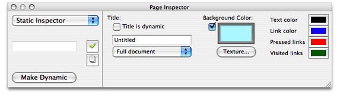
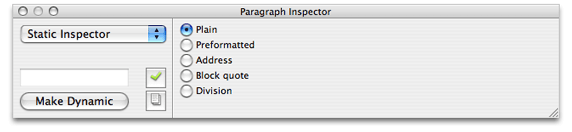
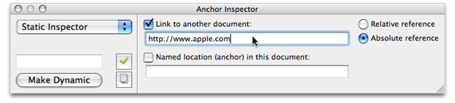
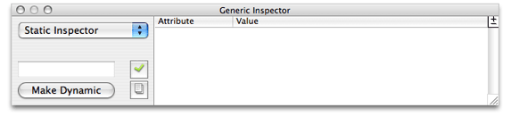

> 导航：[总目录](../../../README.md) · [documentation](../../../_indexes/documentation.md) · [WebObjects Builder User Guide](Introduction%20to%20WebObjects%20Builder.md)

[Next](Working%20With%20Dynamic%20Elements.md)[Previous](Editing%20Components.md)

# Working With Static Elements

WebObjects Builder allows you to add common static HTML elements to your web component—for example, paragraphs, lists, images, and other static HTML elements that add structure to your web component. You can add static HTML elements using the Elements menu or the Elements pop-up menu on the toolbar in the component window as shown in Figure 3-1.

__Figure 3-1__  Static elements menu

This chapter describes only static HTML elements. Read [Using Dynamic Form Elements](Working%20With%20Dynamic%20Elements.md#apple-f4xwc4dqnrsv64tfmyxwi33df52wszbpkridimbqgazdgnbzfvjvomy) if you are creating a form and [Using Other Concrete Dynamic Elements](Working%20With%20Dynamic%20Elements.md#apple-f4xwc4dqnrsv64tfmyxwi33df52wszbpkridimbqgazdgnbzfvjvonq) if you want to use other dynamic elements. Read [Editing Tables](Editing%20Components.md#apple-f4xwc4dqnrsv64tfmyxwi33df52wszbpkridimbqgazdgnbvfvjvomzu) for details on using tables, and read [Editing Frames](Editing%20Components.md#apple-f4xwc4dqnrsv64tfmyxwi33df52wszbpkridimbqgazdgnbvfvjvooa) for details on using frames.

The _body element_ is the root element used for a full document and the _document element_ is the root element used for a partial document. Both elements are containers representing the entire web component. For example, the main component has a body element as the root element. You edit the body attributes to change the overall appearance of your page. However, unlike other elements, the body and document elements don't appear in the Static menu. These elements are automatically added when you create your component.

To inspect a page's attributes, click either the body tag (`<body>`) or the document tag (`<document>`) in the path view, and open the Inspector (click the Inspector button on the toolbar). Using the inspector shown in Figure 3-2, you can switch from a full document to a partial document by selecting Full Document or Partial Document from the pop-up menu. This action simply changes the HTML tag from `<body>` to `<document>`.

__Figure 3-2__  Switching from a full to a partial document

The Title text field allows you to set the title of the document. If you select the "Title is dynamic" checkbox, the title becomes a dynamic string whose value is determined at runtime. You enter its bindings in the Title text field.

You can also set the background color or texture of the page. You can set the colors of specific text objects: text, links, pressed links, and visited links. To change a color, click the border of the color well and then select a color from the Colors window.

The dynamic element counterpart for the body element is WOBody. See [Working With Dynamic Elements](Working%20With%20Dynamic%20Elements.md#apple-f4xwc4dqnrsv64tfmyxwi33df52wszbpkridimbqgazdgnbzfvjvomi) for more information on WOBody and binding dynamic elements.

Use the _paragraph element_ if you want a plain paragraph. Use the _address element_ if you want to wrap author contact information. Use the _blockquote element_ if you want browsers to indent a long quotation. Use the _division element_ if you want to add structure to your document—browsers usually place a line break before and after a division element. Use the _preformatted element_ if you don't want browsers to modify the format of your paragraph.

To add a new paragraph element (
), choose Paragraph from the Static menu or simply press Return in the graphical view in Layout mode. If there is a selection, it is wrapped in a paragraph element.

To add an address, blockquote, division, or preformatted element choose the element from the Static menu. If there is a selection, it is wrapped in the chosen element.

The address, blockquote, division, paragraph, and preformatted static elements are all related and share the same Paragraph Inspector shown in Figure 3-3. Select the element and click Inspector on the toolbar to open the Paragraph Inspector.

__Figure 3-3__  The Paragraph Inspector

You can use the Paragraph Inspector to convert any of these elements to the following elements with the corresponding HTML tags:

- Plain (`
`)
- Preformatted (`<pre>`)
- Address (`<address>`)
- Blockquote (`<blockquote>`)
- Division (`
`)

Read [Formatting with Cascading Style Sheets](Editing%20Components.md#apple-f4xwc4dqnrsv64tfmyxwi33df52wszbpkridimbqgazdgnbvfvjvomzv) for examples of using division element with cascading style sheets.

An _anchor_ is a named location within a document that can be referenced by a hyperlink. A _hyperlink_ links to another location. Anchors and hyperlinks are both represented by an _anchor element_, `<a>`, and have the same Anchor Inspector.

Choose Anchor or Hyperlink from the Elements menu to add an anchor element. If text is selected, it is wrapped in an anchor element. Otherwise, you can begin typing the text you want contained in the anchor element. The text is underlined as you type.

If you are adding a hyperlink, open the Anchor Inspector as shown in Figure 3-4. Select the "Link to another document" checkbox and enter the destination of the link (the URL) in the text field below the checkbox. You can also specify if the path is relative or absolute by clicking the "Relative reference" or "Absolute reference" radio buttons.

__Figure 3-4__  The Anchor Inspector

If you are adding an anchor, select the "Named location (anchor) in this document" checkbox, and enter the named location within a document in the text below the checkbox.

Use the _applet element_, `<applet>`, if you want to embed a Java applet in an HTML document. Choose Static > Applet to add an applet element.

Use a _comment element_ if you want to enter text into the document that is ignored when rendering the HTML. For example, in Layout mode, choose Static > Comment and enter some text. Switch to the Preview mode and you see that the comments are not displayed.

A _horizontal rule_ is a line across the page. Choose Static > Horizontal Rule to add a horizontal rule element (`
`). You can change the height, width, and style of a horizontal rule element using the Horizontal Rule Inspector.

_Headings_ are the titles of sections and are typically displayed in larger font sizes and bold. HTML supports six levels of headings. Choose a submenu from the Static > Headings menu to add a header element (`<h1>` thru `<h6>`). If there is a selection, it is wrapped with the header element. You can change the header level (select a number from 1 to 6) using the Header Inspector.

You can also embed images in your HTML document. Choose Static > Image to add an image element (``). A Select Image panel appears, allowing you to select an image file to display at the insertion point. Use the Image Inspector to change image properties, including its size, file path, and whether it uses an absolute or relative reference. See [Body and Document](#apple-f4xwc4dqnrsv64tfmyxwi33df52wszbpkridimbqgazdgnbxfvjvomy)to set the background image of a page.

Frames support multiple views of content using independent windows or subwindows. An _inline frame element_ allows you to insert a frame within a block of text. Choose Static > Internal Frame to add an inline frame element at the insertion point. Read [Editing Frames](Editing%20Components.md#apple-f4xwc4dqnrsv64tfmyxwi33df52wszbpkridimbqgazdgnbvfvjvooa) for details on creating and editing frames.

Lists provide support for enumerating information. All lists must contain one or more list items. WebObjects Builder supports ordered and unordered lists.

Choose Static > Lists > Ordered List menu to add an ordered list (`<ol>`), and choose Unordered List to add an unordered list (`<ul>`). If there is a selection, each line in the selection becomes a list item (`<li>`). You can use the inspector to change the list to an unordered or ordered list. You can also change the numbering style and the starting number.

When typing in a list:

- Press Return to create a new list item.
- Press Shift-Return to create a line break but no new list item.
- Press Tab to create a new list nested inside the original list.
- Press Shift-Tab to move the nesting back one level.

Read [PremadeElements Palette](Working%20With%20Palettes.md#apple-f4xwc4dqnrsv64tfmyxwi33df52wszbpkridimbqgazdgnjzfvjvomjr) for how to create multiple list items wrapped in a repetition.

Use a _script element_ to embed a script within a document. Choose JavaScript or VBScript from the Script submenu to add a script element. Use the Script Inspector to enter the script, select the type of scripting language, and set other script properties.

Use a _span element_ to help structure your document. The span element defines content to be inline versus block-level (the division element described in [Address, Blockquote, Division, Paragraph, and Preformatted](#apple-f4xwc4dqnrsv64tfmyxwi33df52wszbpkridimbqgazdgnbxfvjvona)). Choose Static > Span to add a span element.

Read [Formatting with Cascading Style Sheets](Editing%20Components.md#apple-f4xwc4dqnrsv64tfmyxwi33df52wszbpkridimbqgazdgnbvfvjvomzv)for examples on using the division element with cascading style sheets.

Use a _table element_ to display content in column and row format. Choose Static > Table to add a table at the insertion point. Read [Editing Tables](Editing%20Components.md#apple-f4xwc4dqnrsv64tfmyxwi33df52wszbpkridimbqgazdgnbvfvjvony) for details on creating and editing tables.

Use a _custom element_ to add an HTML element that is not provided in one of the WebObjects Builder menus. Follow these steps to create a custom element:

1. Move the insertion point to where you want to add the custom element.
2. Choose Static > Custom.
3. Enter the custom marker in the "Tag to use" text field.
4. If the element doesn't require an end tag, the "New element is a container" option should not be selected.
5. Click OK.

   The marker is inserted in the component and HTML source—for example, `<marker>Custom Marker</marker>` is inserted in the HTML source.
6. If the element has attributes that you want to specify, select the custom tag in the path view and open the inspector window.

   A Generic Inspector window appears as shown in Figure 3-5.

   __Figure 3-5__  The Generic Inspector

   
7. To set attribute values, choose "Add attribute" from the +/- button menu and type the attribute's name and value in the table below.
8. To remove an attribute, select it in the table and choose "Delete attribute" from the +/- button menu.

Alternatively, you can set the attributes in source mode by editing the HTML text directly.

If you want to reuse the custom element, you can save it on a palette. Read [Working With Palettes](Working%20With%20Palettes.md#apple-f4xwc4dqnrsv64tfmyxwi33df52wszbpkridimbqgazdgnjzfvjvomi)for details on custom palettes.

[Next](Working%20With%20Dynamic%20Elements.md)[Previous](Editing%20Components.md)

