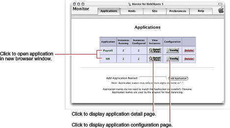
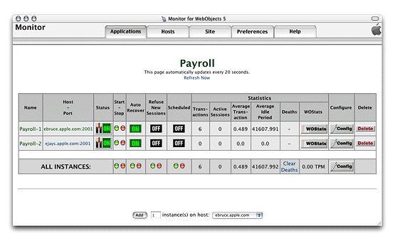
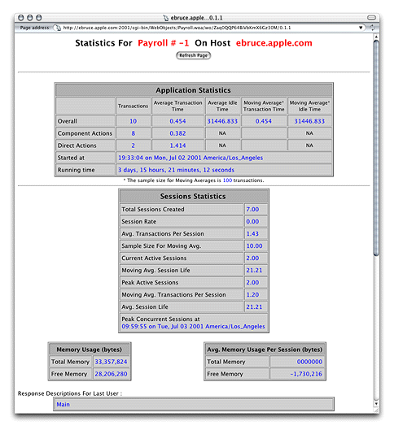
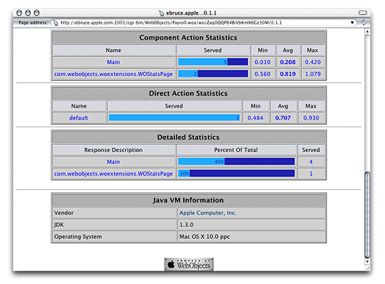

> 导航：[总目录](../../../README.md) · [documentation](../../../_indexes/documentation.md) · [WebObjects Deployment Guide Using JavaMonitor](Introduction%20to%20WebObjects%20Deployment%20Guide%20Using%20JavaMonitor.md)


[Next](Application%20URLs.md)[Previous](Deployment%20Tasks.md)

# Application Administration

After deploying applications, you should monitor their performance to find out, among other things, whether you need to add instances to an application to improve response times. [Monitoring Activity](#apple-f4xwc4dqnrsv64tfmyxwi33df52wszbpkridgmbqgaydanrvfvkfawcsivddcmbs) shows you the kind of performance data you can collect about an application.

There are several steps you can take to improve your site’s performance; most of them have been explained earlier. The section [Improving Performance](#apple-f4xwc4dqnrsv64tfmyxwi33df52wszbpkridgmbqgaydanrvfvkfawcsivddcmjx) contains a list of recommended measures that help optimize your site’s operation.

There are several ways to obtain information about the applications deployed on your site. You can

- use JavaMonitor
- analyze logs from application instances and HTTP adaptors
- view instance statistics webpages

JavaMonitor’s Applications page gives you an overall view of a site. Figure 6-1 illustrates the kind of information you can access through the Applications page:

- configured applications
- number of configured instances per application
- number of running instances per application

__Figure 6-1__  The Applications page



From this page, you can perform several tasks:

- __Connect to an instance of an application__. The entry page of the application is displayed in a new web browser window.
- __Display the application detail page of an application__. For details on the information provided, see [Adding an Application](Deployment%20Tasks.md#apple-f4xwc4dqnrsv64tfmyxwi33df52wszbpkridgmbqgaydanrufvkfawcsivddcmju).
- __Display the application configuration page__. See [Configuring an Application](Deployment%20Tasks.md#apple-f4xwc4dqnrsv64tfmyxwi33df52wszbpkridgmbqgaydanrufvkfawcsivddcmjv) for more information.
- __Delete an application__. You confirm that you really want to delete the application (including all of its instances) in a confirmation page before the deletion takes place.

Figure 6-2 depicts the application detail page.

__Figure 6-2__  The application detail page



The application’s name is displayed centered and in bold letters. When there are active instances, it is a link to the application through the HTTP adaptor; the request is load balanced among the application hosts configured in the adaptor. (For this to work, the HTTP adaptor URL property must be set; see [Configuring Sites](Deployment%20Tasks.md#apple-f4xwc4dqnrsv64tfmyxwi33df52wszbpkridgmbqgaydanrufvbegskfjbfeksa) for details.) If no value has been entered for the property, the default URL `(http://localhost/cgi-bin/WebObjects/`) is used instead.) The URL used to connect to the application looks similar to the following:

```
http://localhost/cgi-bin/WebObjects/Payroll
```

The following list describes the performance-related information shown on the application detail page in the Statistics column group:

- __Transactions__: The number of requests the instance has received since it was started.
- __Active Sessions__: The number of active sessions (users) currently maintained by the instance.
- __Average Transaction__: Average time, in seconds, the instance has taken to process requests.
- __Average Idle Period__: The average time, in seconds, that the instance is idle (average time between requests).
- __Deaths__: The number of unexpected failures or deaths the instance has had since it was started. These exclude scheduled shutdowns or manual shutdowns through JavaMonitor.
- __WOStats__: Click the WOStats button to display the statistics page for the instance in a new web browser window. See [The Instance Statistics Page](#apple-f4xwc4dqnrsv64tfmyxwi33df52wszbpkridgmbqgaydanrvfvkfawcsivddcmbw) for details.

  Before you can view the instance statistics page, you have to enter the password you set on the instance configuration page. See [Setting a Password for the Instance Statistics Page](Deployment%20Tasks.md#apple-f4xwc4dqnrsv64tfmyxwi33df52wszbpkridgmbqgaydanrufvbegskhjfdukrq) for details.

The row with the caption ALL INSTANCES contains application-wide performance information, including the average number of transactions processed per minute (TPM).

You can access the instance statistics page of an instance through JavaMonitor or directly through a web browser.

To use JavaMonitor, go to the application detail page and click WOStats for the instance whose statistics you want to view.

To use your Web browser, access a URL similar to the following:

```
http://myhost/cgi-bin/WebObjects/MyApp.woa/wa/WOStats
```

If there are multiple instances, specify the instance number as well:

```
http://myhost/cgi-bin/WebObjects/MyApp.woa/1/wa/WOStats
```

Figure 6-3 and Figure 6-4 show the information the instance statistics page provides.

__Figure 6-3__  The instance statistics page—part 1 of 2



__Figure 6-4__  The instance statistics page—part 2 of 2



WebObjects applications can log information that can be analyzed by a Common Log File Format (CLFF) standard analysis tool. Applications do not log their activities by default; logging must be enabled through an application’s code. When enabled, the application records a list of components accessed during each session. By default, only component names are recorded, but you may add more information. An application’s activity log is sent to the standard error stream.

To enable adaptor logging, you create a file called `logWebObjects` in the temporary directory of the computer where the web server runs. When logging is enabled, the adaptor logs its activity in a file called `WebObjects.log` in the temporary directory.

The location of the temporary directory depends on Mac OS X Server is `/tmp`.

On UNIX-based platforms, do the following to create the `logWebObjects` file (you must have root privileges):

1. Start a command-shell window.
2. Set the working directory to the temporary directory.
3. Enter the following command:

```
touch logWebObjects
```

You can use the `tail` (UNIX) command to display the adaptor log file in your console.

On UNIX-based systems, use the following:

```
tail -f WebObjects.log
```


You can analyze the information in the log to find out such things as which applications are being requested, which applications are being auto-started, and what the HTTP headers of the requests are. You can also use the log to verify that the HTTP adaptor is properly configured for load balancing.

The following excerpt includes an error message that indicates that an instance of Payroll wasn’t running when a request for it came in:

```
Info: <WebObjects Apache Module> new request: /cgi-bin/WebObjects/Payroll
Debug: App Name: Payroll (7)
Info: Specific instance Payroll: not found. Reloading config.
```

After Payroll is started, the same request produces the following log entries:

```swift
Info: New response: HTTP/1.0 200 Apple WebObjects
Info: ac_newInstance(): added Payroll:2 (2001)
Info: V4 URL: /cgi-bin/WebObjects/Payroll
Info: loadaverage: selected instance at index 4
Info: Selected new app instance at index 4
Debug: Composed URL to '/cgi-bin/WebObjects/Payroll.woa/1'
Info: New request is GET /cgi-bin/WebObjects/Payroll.woa/1 HTTP/1.0

Info: Sending request to instance number 1, port 2001
Info: Trying to contact Payroll:1 on (2001)
Info: attempting to connect to ebruce.apple.com on port 2001
Info: Created new pooled connection [1] to ebruce.apple.com:2001
Info: Using pooled connection to ebruce.apple.com:2001
Info: Payroll:1 on (2001) connected [pooled: Yes]
Info: Request GET /cgi-bin/WebObjects/Payroll.woa/1 HTTP/1.0
 sent, awaiting response
Debug: ac_readConfiguration(): skipped reading config
Info: New response: HTTP/1.0 200 Apple WebObjects
Info: Payroll 1 load avg = 1
Info: received ->200 Apple
```


Performance is a major concern of website administrators. This section provides a list of areas you can check to achieve the maximum performance possible.

- Configure your operating system so that it delivers the highest performance for your needs. Consult your operating system’s documentation and your web server’s documentation for performance-tuning information.
- When possible, use an API-based HTTP adaptor instead of a CGI adaptor.
- Make sure that the applications are written to perform optimally.

  The WebObjects developer documentation contains coding suggestions that help improve the performance of WebObjects applications.
- Enable component-definition caching for all applications.

  When applications are deployed, component-definition caching should be enabled so that each component’s HTML and declarations files are parsed only once per session.
- Shut down and restart application instances periodically.

  Scheduling instances to shut down and restart periodically increases application performance and reliability by reducing the effects of memory leaks. For more on scheduling, see [Scheduling](Deployment%20Tasks.md#apple-f4xwc4dqnrsv64tfmyxwi33df52wszbpkridgmbqgaydanrufvkfawcsivddcmjy).

  If your applications use custom scheduling algorithms to shut down, you should not use JavaMonitor’s scheduling feature. Instead, use JavaMonitor’s auto-recover feature. For more information, see information about Auto Recover in [New Instance Defaults](Deployment%20Tasks.md#apple-f4xwc4dqnrsv64tfmyxwi33df52wszbpkridgmbqgaydanrufvkfawcsivddcmjw).
- Consider changing the physical configuration of your system.

  Determine the size of a single application instance (you can find this data on the application’s instance statistics page) and multiply it by the number of instances you intend to run on a given computer. (For information on the instance statistics page, see [The Instance Statistics Page](#apple-f4xwc4dqnrsv64tfmyxwi33df52wszbpkridgmbqgaydanrvfvkfawcsivddcmbw).) The result is the amount of physical memory needed for that application. You have to add the memory required by the operating system, web server, and any other applications that run constantly on the computer. The result is the amount of physical memory that should be installed on the computer.
- Try to reduce the size of the application instance by limiting the amount of state that it stores. Set the session timeout value to ensure that sessions expire after a reasonable length of time. See `WOSessionTimeOut` in _[WebObjects Application Properties Reference](../WebObjects%20Application%20Properties%20Reference/Introduction%20to%20WebObjects%20Application%20Properties%20Reference.md#apple-f4xwc4dqnrsv64tfmyxwi33df52wszbpkridgmbqgaytamrq)_ for details on setting the session timeout interval for application instances.
- Make sure that the web server serves all static content, not your application.

If you use WebObjects Deployment mainly to deploy applications that access a data store, you achieve the best performance with a dedicated data-store server and a separate server for WebObjects applications.

[Next](Application%20URLs.md)[Previous](Deployment%20Tasks.md)

