> 导航：[总目录](../../../README.md) · [documentation](../../../_indexes/documentation.md) · [WebObjects Deployment Guide Using JavaMonitor](Introduction%20to%20WebObjects%20Deployment%20Guide%20Using%20JavaMonitor.md)


[Next](Application%20Administration.md)[Previous](Managing%20Application%20Instances.md)

# Deployment Tasks

Now that you are acquainted with the deployment tools of WebObjects, you are ready to put that knowledge to work by deploying your applications.

This chapter explains how JavaMonitor allows you to perform most of the tasks required to maintain a WebObjects application site with point-and-click ease. The sections below guide you through the process of adding and configuring hosts, applications, and application instances. Also explained is the load-balancing mechanism used by the HTTP adaptor, which performs load balancing among the instances of an application (which can be distributed across more than one host) and how to set up email notifications so that you and your colleagues are notified when problems arise.

This chapter addresses the following subjects:

- [Setting Up Hosts](#apple-f4xwc4dqnrsv64tfmyxwi33df52wszbpkridgmbqgaydanrufvkfawcsivddcmjq) explains how you add and configure hosts for application deployment. Note that this is different from configuring hosts in the HTTP adaptor.
- [Installing Applications](#apple-f4xwc4dqnrsv64tfmyxwi33df52wszbpkridgmbqgaydanrufvbegskejfeuira) shows you where to place application files and web server resources on an application host before deploying an application.
- [Setting Up Applications](#apple-f4xwc4dqnrsv64tfmyxwi33df52wszbpkridgmbqgaydanrufvkfawcsivddcmjt) details the ways you can customize a deployment. These include choosing a load-balancing algorithm and scheduling instances to restart at regular intervals.
- [Configuring Sites](#apple-f4xwc4dqnrsv64tfmyxwi33df52wszbpkridgmbqgaydanrufvbegskfjbfeksa) describes the site-wide properties available. These include configuring JavaMonitor to use your SMTP (Simple Mail Transfer Protocol) server to send email notifications.
- [Setting JavaMonitor Preferences](#apple-f4xwc4dqnrsv64tfmyxwi33df52wszbpkridgmbqgaydanrufvbegskgizfeoqq) shows you the JavaMonitor-specific settings you can use to tailor the tool’s behavior.
- [Load Balancing](#apple-f4xwc4dqnrsv64tfmyxwi33df52wszbpkridgmbqgaydanrufvbegskjjfbekqq) explains how load balancing distributes user load among the running instances of an application in your site.
- [Deploying Multiple Sites](#apple-f4xwc4dqnrsv64tfmyxwi33df52wszbpkridgmbqgaydanrufvbegskgjbbueqq) shows how you can maintain multiple sites on one set of computers.

An application host is a computer that runs application instances. For JavaMonitor to be able to identify a host, the host has to be running a wotaskd process. In addition, JavaMonitor itself has to run on a registered host. That is, after launching JavaMonitor for the first time, you must add the computer it’s running on as an application host, as described in [Adding a Host](#apple-f4xwc4dqnrsv64tfmyxwi33df52wszbpkridgmbqgaydanrufvkfawcsivddcmjr).

Before you can deploy applications, you need to tell JavaMonitor which hosts you want to use for deployment. (See [Load Balancing](#apple-f4xwc4dqnrsv64tfmyxwi33df52wszbpkridgmbqgaydanrufvbegskjjfbekqq) for additional information regarding load balancing and hosts added in JavaMonitor.) Figure 5-1 shows JavaMonitor’s Hosts page, which you use to add and configure hosts.

__Figure 5-1__  The Hosts page

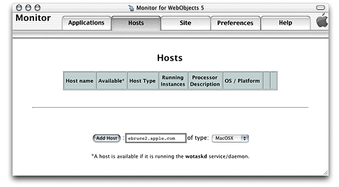

Follow these steps to add an application host to a deployment:

1. In JavaMonitor, click the Hosts tab.
2. Enter the name or IP address of the host you want to add in the host text input field.

   The computer must be running a wotaskd process in the port that JavaMonitor sends its lifebeats to.

   Avoid using a _loopback_ address (a connection that does not go over the network), such as `localhost` or `127.0.0.1`. If you do, it must be the only application host in your site.
3. Choose the appropriate platform from the pop-up menu.
4. Click Add Host.

Figure 5-2 shows the Hosts page after a host has been added.

__Figure 5-2__  Newly added host in JavaMonitor

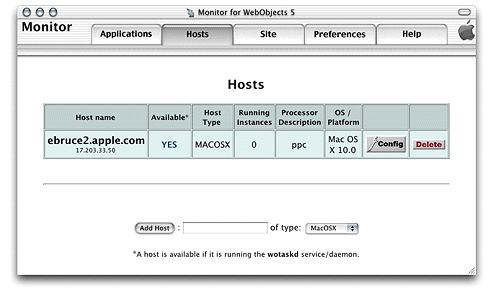

To change the configuration of an application host, click the Config button on the Hosts page. A page similar to the one in Figure 5-3 appears. It allows you to set the type of the host and to resynchronize configuration information if needed.

__Figure 5-3__  Host configuration page

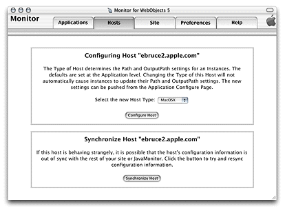

To display the configuration of a host, click YES, on the Hosts page. A page similar to the one in Figure 5-4 is displayed in a separate web browser window.

__Figure 5-4__  Host configuration information page

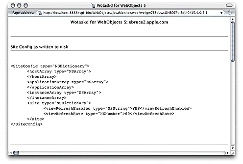

This page displays the current state of the host in several sections.

The section visible in Figure 5-4 shows the contents of the host’s `SiteConfig.xml` file. For more information on the `SiteConfig.xml` file, see [Configuration Files](Managing%20Application%20Instances.md#apple-f4xwc4dqnrsv64tfmyxwi33df52wszbpkridgmbqgaydanrtfvbegskjivcekrq).

The next section shows the adaptor configuration sent to local HTTP adaptors, which lists all running application instances that wotaskd knows about (this includes JavaMonitor processes).

```xml
<?xml version="1.0" encoding="ASCII"?>
<adaptor>
    <application name="JavaMonitor">
        <instance id="-8888" port="8888" host="ebruce2.apple.com"/>
    </application>
</adaptor>
```

Note that the instance ID of the JavaMonitor process is negative. When wotaskd receives a lifebeat from an unregistered application instance (one that has not been added to your site through JavaMonitor), it discloses the instance to the web server with a negative ID number. This allows developers (internal users) to connect to development instances through the HTTP adaptor for testing purposes. To address security concerns, external users can connect to instances with negative ID numbers only if they know the instance’s port number. However, this can be disabled by setting `WODirectConnectEnabled` to `false`. See `WODirectConnectEnabled` in _[WebObjects Application Properties Reference](../WebObjects%20Application%20Properties%20Reference/Introduction%20to%20WebObjects%20Application%20Properties%20Reference.md#apple-f4xwc4dqnrsv64tfmyxwi33df52wszbpkridgmbqgaytamrq)_ for details.

To connect to a development instance through the web server, the instance must run on the same computer that the web server runs on, and the computer must be the `localhost`.

Next is the local adaptor configuration sent to remote HTTP adaptors. This section lists all instances that are active, registered (configured through JavaMonitor), and available to external users.

```xml
<?xml version="1.0" encoding="ASCII"?>
<adaptor>
  <application name="Payroll" urlVersion="4">
    <instance id="1" port="2001" host="ebruce.apple.com"/>
  </application>
  <application name="HR" urlVersion="4">
    <instance id="1" port="2002" host="ebruce.apple.com"/>
  </application>
</adaptor>
```

The next section shows the contents of the HTTP adaptor configuration file. If you tell wotaskd to write the HTTP adaptor configuration file, it lists all the registered application instances on the site, whether they are running or not. (This file is identical across all the site’s application hosts.) See [The HTTP Adaptor Configuration File](HTTP%20Adaptors.md#apple-f4xwc4dqnrsv64tfmyxwi33df52wszbpkridgmbqgaydanrsfvbeeq2iijdumsq) for more information and an example of the file’s contents.

The last section lists information on the wotaskd process’s environment, including its port and multicast address.

```
The Configuration Directory is: /Library/WebObjects/Configuration/
Wotaskd is NOT writing WOConfig.xml to disk
The multicast address is: 239.128.14.2
This wotaskd is running on Port: 1085
Wotaskd is NOT responding to Multicast
WOAssumeApplicationIsDeadMultiplier is 4
The System Properties are: ...
```


Before you can deploy applications on your site, you have to install them on the hosts on which you want to run instances of them. Most applications have files of two types:

- __application files,__ which store the application’s logic
- __Web server resources,__ which store resources that can be shared among applications

You can use either Xcode or the Ant build system to install an application on a host. Using these tools, you create an application bundle, also known as the WOA bundle, containing all the files the application needs to run. However, most web applications contain web server resources, such as images. You should place these resources in the web server’s `Document Root` directory. You do this that by performing a split installation.

In a split installation, a directory containing an application’s web server resources is placed in the web server’s `Document Root` directory. This directory mirrors the WOA bundle’s organization, but it contains only web server resources. You can place the WOA bundle anywhere you like, preferably a location inaccessible to the outside world.

To perform a split installation of your application using Xcode 2.1 or later, navigate to your project’s directory and execute the following commands as the `root` user using your shell editor:

```
xcodebuild install -configuration Deployment DSTROOT=/
xcodebuild install -configuration WebServer DSTROOT=/
```

To perform a split installation of your application using Xcode 2.0 or earlier, navigate to your project’s directory and execute the following commands as the `root` user using your shell editor:

```
xcodebuild install -buildstyle Deployment DSTROOT=/
xcodebuild install -buildstyle WebServer DSTROOT=/
```


Starting with WebObjects 5.4 and later, Xcode no longer supports building for deployment for new WebObjects applications based on the Ant build system. As an alternative, you can use the Java Ant build tool to do a split installation.

The steps to build for deployment described below apply to a WebObjects example project. You can find the WebObjects examples in the `/Developer/Examples/JavaWebObjects` directory.

To perform a split installation of your application using the WebObjects Ant build system, navigate to your project’s directory and execute the following commands while logged in as the `root` user from a shell:

`ant deployment`

This command places the application files in the `/Library/WebObjects/Applications` directory and the web server resources in the `Document Root/WebObjects` directory.

The WebObjects Ant build system provides three types of application bundles in the `dist` directory of your project folder:

- The legacy WOA application bundle

  This is the traditional WebObjects WOA or Framework bundle.
- The self-contained WOA application bundle

  This self-contained WOA bundle embeds all dependent framework Jar files and resources within the bundle. The class path is configured to look for the internal bundled classes instead of the installed ones. It is generally recommended that you use a self-contained WOA bundle for deployment to keep the WebObjects application running even when the WebObjects runtime on the deployment machine is upgraded to a different version.
- A J2EE-style war bundle with an embedded WebObjects application

After producing a split installation on the development computer, copy the WOA bundle and the application’s resources to their final destination (or destinations, in case you want to run instances of the application in several computers) and use JavaMonitor to configure the deployment.

You can place application files in any directory of the application host. Web server resources, however, must be placed in the `Document Root` directory of the application host. Make sure that you use the following organization:

```
<Web server Document Root>/
    WebObjects/
        AppName.woa/
            Contents/
                WebServerResources/
                    <resource files>
```

In most situations you should deploy an application’s logic and resources on different computers. For example, while developing an application on Mac OS X, you can test it with the web server included with the system. However, you should not deploy the application in Mac OS X. Always deploy WebObjects applications on Mac OS X Server.

To deploy an application on your site, it must be installed in the appropriate directories on the hosts that run instances of it. For more information, see [Installing Applications](#apple-f4xwc4dqnrsv64tfmyxwi33df52wszbpkridgmbqgaydanrufvbegskejfeuira).

Setting up an application in your site involves three main steps:

- __Adding the application,__ which is described in [Adding an Application](#apple-f4xwc4dqnrsv64tfmyxwi33df52wszbpkridgmbqgaydanrufvkfawcsivddcmju).
- __Configuring the application__, which includes the following subtasks:

  - defining a default configuration for new instances of the application
  - defining the recipients of email notifications
  - defining a schedule (only available for existing instances)
  - choosing a load-balancing algorithm

  These steps are detailed in [Configuring an Application](#apple-f4xwc4dqnrsv64tfmyxwi33df52wszbpkridgmbqgaydanrufvkfawcsivddcmjv).
- __Adding application instances,__ which is described in [Adding Application Instances](#apple-f4xwc4dqnrsv64tfmyxwi33df52wszbpkridgmbqgaydanrufvbegskjjfcuqsq).

You add applications to your site using JavaMonitor’s Applications page, shown in Figure 5-5.

__Figure 5-5__  Adding an application using JavaMonitor’s Applications page

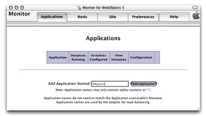

Follow these steps to add an application to your site:

1. Enter the application’s name (without the extension) in the Add Application Named text field.
2. Click Add Application.

After you add an application, the application configuration page is displayed. This page has five major sections, which you can show and hide using the disclosure triangles:

- The New Instance Defaults section lets you set the default values for the instance settings for application instances you add afterward. For example, you can change the default JVM setting for your application. See New Instance Defaults for details.
- The Application Settings section contains properties that apply to all the instances of the application. For more, see [Application Settings](#apple-f4xwc4dqnrsv64tfmyxwi33df52wszbpkridgmbqgaydanrufvkfawcsivddcmjx).
- The Scheduling section allows you to individually schedule instances to restart at specific intervals. See [Scheduling](#apple-f4xwc4dqnrsv64tfmyxwi33df52wszbpkridgmbqgaydanrufvkfawcsivddcmjy) for details.
- The Email Notifications section is where you specify the list of email addresses you want email notifications to be sent to. For details, see [Email Notifications](#apple-f4xwc4dqnrsv64tfmyxwi33df52wszbpkridgmbqgaydanrufvkfawcsivddcmjz).
- The Load Balancing and Adaptor Settings section lets you choose the algorithm that the HTTP adaptor uses to perform load balancing among the instances of the application. See [Load Balancing and Adaptor Settings](#apple-f4xwc4dqnrsv64tfmyxwi33df52wszbpkridgmbqgaydanrufvbegskcivfeqqy).

Figure 5-6 shows the section of the application configuration page that allows you to set defaults for the application instances. If application instances are running when you change these settings, you need to restart them to apply your changes. For details on the options shown on this page, see the description below or refer to _[WebObjects Application Properties Reference](../WebObjects%20Application%20Properties%20Reference/Introduction%20to%20WebObjects%20Application%20Properties%20Reference.md#apple-f4xwc4dqnrsv64tfmyxwi33df52wszbpkridgmbqgaytamrq)_ as indicated.

- Path: The file system path of the application launch script in the ".woa" directory.
- Auto Recover: Indicates whether JavaMonitor automatically restarts instances that are manually shut down or that have become unresponsive.
- Minimum Active Sessions: The minimum number of active sessions an instance must have before JavaMonitor can terminate it.
- Caching Enabled: See the description of `WOCachingEnabled` in _[WebObjects Application Properties Reference](../WebObjects%20Application%20Properties%20Reference/Introduction%20to%20WebObjects%20Application%20Properties%20Reference.md#apple-f4xwc4dqnrsv64tfmyxwi33df52wszbpkridgmbqgaytamrq)_.
- Debugging Enabled: See the description of `WODebuggingEnabled` in _[WebObjects Application Properties Reference](../WebObjects%20Application%20Properties%20Reference/Introduction%20to%20WebObjects%20Application%20Properties%20Reference.md#apple-f4xwc4dqnrsv64tfmyxwi33df52wszbpkridgmbqgaytamrq)_.
- Output Path: See the description of `WOOutputPath` in _[WebObjects Application Properties Reference](../WebObjects%20Application%20Properties%20Reference/Introduction%20to%20WebObjects%20Application%20Properties%20Reference.md#apple-f4xwc4dqnrsv64tfmyxwi33df52wszbpkridgmbqgaytamrq)_.
- Auto-Open in Browser: See the description for `WOAutoOpenInBrowser` in _[WebObjects Application Properties Reference](../WebObjects%20Application%20Properties%20Reference/Introduction%20to%20WebObjects%20Application%20Properties%20Reference.md#apple-f4xwc4dqnrsv64tfmyxwi33df52wszbpkridgmbqgaytamrq)_
- Lifebeat Interval: See the description of `WOLifebeatInterval` in _[WebObjects Application Properties Reference](../WebObjects%20Application%20Properties%20Reference/Introduction%20to%20WebObjects%20Application%20Properties%20Reference.md#apple-f4xwc4dqnrsv64tfmyxwi33df52wszbpkridgmbqgaytamrq)_.

__Figure 5-6__  The New Instance Defaults section of the application configuration page

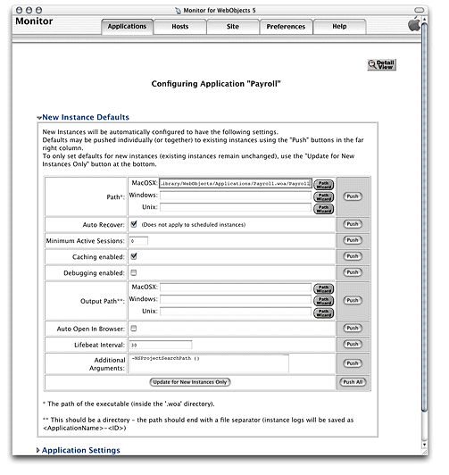

Here’s an explanation of the buttons on the page:

- __Push__: updates the value of the property for new and configured (registered) instances of the application. The changes take effect after the instances are restarted.
- __Push All__: updates the value of the all the properties for new and configured instances of the application. As with Push, the changes become effective when the instances are restarted.
- __Update for New Instances Only__: sets the defaults to be used when you create new instances of the application. The properties of existing instances are not changed.
- __Path Wizard__: opens a tool that allows you to navigate through a host’s file system.

By default, the maximum allowed RAM usage for a Java application is 64 MB. Changing this setting using JavaMonitor affects only the applications launched by JavaMonitor. Follow these steps to change the JVM size used by applications deployed with JavaMonitor:

1. Double-click the Applications tab in JavaMonitor.
2. In the Applications view, click the Config icon to bring up the Configuration window.
3. Type `-Xmx128m` in the Additional Arguments text field.

The `-Xmx128m` option sets the maximum RAM usage to 128 MB, but that is only an example. Experiment with different values to find out what has the best performance for your application. Setting the value too high may cause temporary slowdowns during garbage collection or disk paging. Some applications may benefit from setting the minimum RAM usage equal to the maximum. You can do this by setting the Java VM options to `-Xms128m -Xmx128m`

[Figure 5-7](#apple-f4xwc4dqnrsv64tfmyxwi33df52wszbpkridgmbqgaydanrufvbegskji5deirq) shows the Application Settings section of the application configuration page. In it, you define application settings that apply to all the instances of the application. For details of the properties shown in this section, see the description below or refer to _[WebObjects Application Properties Reference](../WebObjects%20Application%20Properties%20Reference/Introduction%20to%20WebObjects%20Application%20Properties%20Reference.md#apple-f4xwc4dqnrsv64tfmyxwi33df52wszbpkridgmbqgaytamrq)_ as indicated.

- Name: This property is used by the HTTP adaptor to implement load balancing. The adaptor can load-balance only between instances with the same application name. The property can be used to create groups of instances, even when the instances share the same executable file. See the description of the `WOApplicationName` application property in _[WebObjects Application Properties Reference](../WebObjects%20Application%20Properties%20Reference/Introduction%20to%20WebObjects%20Application%20Properties%20Reference.md#apple-f4xwc4dqnrsv64tfmyxwi33df52wszbpkridgmbqgaytamrq)_.
- Starting Port: The first port number JavaMonitor tries to assign to a new instance of the application. If the port is in use by another instance of any application, JavaMonitor uses the next unassigned port number.
- Time Allowed for Startup: The number of seconds JavaMonitor waits for an instance to start before determining that the instance failed to start.
- Phased Startup: If this option is selected, when a wotaskd process starts up, the instances that it manages that have Auto Recover selected are started one at a time instead of all at once. This option is selected by default. For more information, see the description of Auto Recover in [New Instance Defaults](#apple-f4xwc4dqnrsv64tfmyxwi33df52wszbpkridgmbqgaydanrufvkfawcsivddcmjw).
- Adaptor: The default adaptor class an instance uses (This is not the HTTP adaptor used by the web server.) You use this if the application defines a subclass of the WOAdaptor class to be used to create adaptor objects (instead of using the WOAdaptor class itself).
- Minimum Adaptor Threads: The initial number of worker threads the adaptor creates to handle requests to the application. It applies only to adaptor processes of the WODefaultAdaptor class in WebObjects 5.
- Maximum Adaptor Threads: The maximum number of worker threads the HTTP adaptor creates to handle requests to the application. It applies only to adaptor processes of the WODefaultAdaptor class in WebObjects 5. The purpose of these threads is to process TCP or UDP packets; they have nothing to do with request processing.
- Adaptor Threads: The number of worker threads that the HTTP adaptor creates to handle requests to the application. It applies only to adaptor objects of the WODefaultAdaptor class in WebObjects 4.5.
- Listen Queue Size: Determines the depth of the listen queue. While the instance handles a request, the socket buffer can hold as many additional requests as this setting indicates before it starts refusing them. Keep in mind that if an application instance’s listen queue size becomes full and a request is refused by it, the request does not get redirected to another instance with space left over in its queue. The client has to resend the request. If you expect spikes in the traffic level of a specific application, consider increasing the listen queue size. Doing so does not necessarily improve performance or allow the instance to process more requests at sustained high loads, but it may reduce the number of times an application’s user must resend a particular request during high-traffic periods.
- Project Search Path: List of file-system paths that WebObjects searches in rapid-turnaround mode. These are the paths where your projects are located (relative paths are relative to your project’s launch script). WebObjects searches for your projects in the order in which you specify the paths. You must specify the paths using the following format: `("firstPath","secondPath",...)`
- Session TimeOut: Specifies the time interval, in seconds, since the last request is processed after which the session times out and is terminated.
- Statistics Page Password: Specifies the password that must be entered to gain access to the instance statistics page of an application instance.

__Figure 5-7__  The Application Settings section of the application configuration page

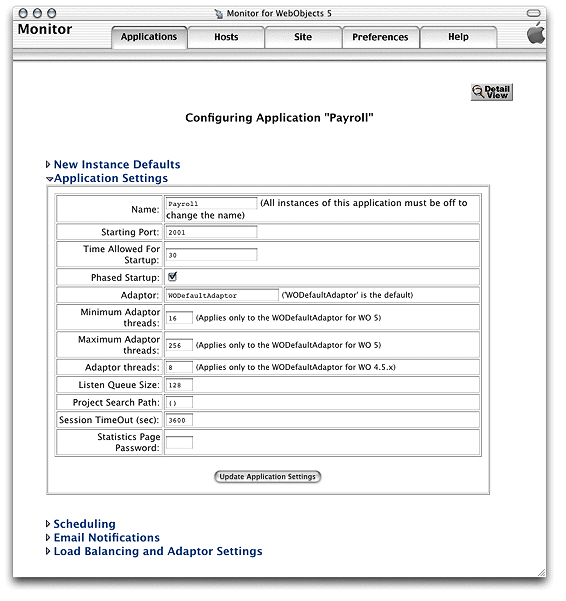

Figure 5-8 shows the Scheduling section of the application configuration page. After you add instances of an application, you can schedule them individually here. For details, see the description below or _[WebObjects Application Properties Reference](../WebObjects%20Application%20Properties%20Reference/Introduction%20to%20WebObjects%20Application%20Properties%20Reference.md#apple-f4xwc4dqnrsv64tfmyxwi33df52wszbpkridgmbqgaytamrq)_.

- Graceful Scheduling: Determines whether an instance is shut down gracefully or immediately at its scheduled shut-down time. During a graceful shutdown, the instance does not create sessions for new users (they are automatically directed to other available instances, if any). Existing sessions remain active until they time out or are destroyed programmatically. When the number of active sessions drops to the value set for the Minimum Active Sessions property, the instance is restarted. When Graceful Scheduling is not selected for the instance, it is restarted immediately, terminating active sessions. See description of Minimum Active Sessions in [New Instance Defaults](#apple-f4xwc4dqnrsv64tfmyxwi33df52wszbpkridgmbqgaydanrufvkfawcsivddcmjw) for more information.
- Is Scheduled: Determines whether the schedule defined for a particular instance is active.
- Types of Schedule:

  There are three types of schedule available for instances:

  - Hourly: The instance is restarted after a certain number of hours from a particular hour.
  - Daily: The instance is restarted at a particular hour every day.
  - Weekly: The instance is restarted a particular hour on a specific day of the week.

__Figure 5-8__  The Scheduling section of the application configuration page

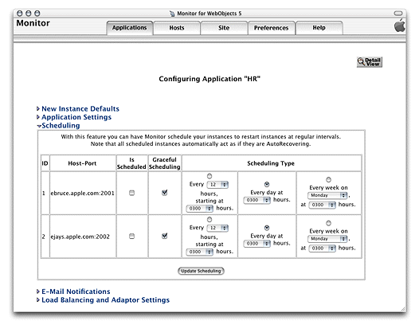

Figure 5-9 shows the Email Notification Settings section of the application configuration page. In it you can enter the email addresses of people that are to be notified when instances of the application terminate unexpectedly. For more information, see _[WebObjects Application Properties Reference](../WebObjects%20Application%20Properties%20Reference/Introduction%20to%20WebObjects%20Application%20Properties%20Reference.md#apple-f4xwc4dqnrsv64tfmyxwi33df52wszbpkridgmbqgaytamrq)_.

__Figure 5-9__  The Email Notifications section of the application configuration page

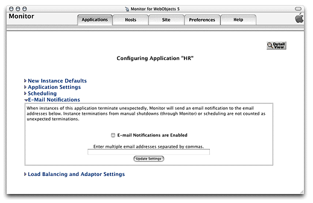

Figure 5-10 shows the Load Balancing and Adaptor Settings section of the application configuration page. This is where you enter values for the HTTP adaptor’s configuration properties, including the load-balancing algorithm the adaptor uses to balance user load among the application instances. These settings override the values entered in the HTTP Adaptor Settings section of the Site page. For information on the properties you can set, see the description below or _[WebObjects Application Properties Reference](../WebObjects%20Application%20Properties%20Reference/Introduction%20to%20WebObjects%20Application%20Properties%20Reference.md#apple-f4xwc4dqnrsv64tfmyxwi33df52wszbpkridgmbqgaytamrq)_ as indicated.

- Load-Balancing Scheme: The load-balancing method used by the adaptor for instances of the application. The options available are Round Robin, Random, and Load Average. You can also use a custom load balancer by choosing Custom in the pop-up menu and entering the load balancer’s name in the Custom Scheduler Name text field.
- Retries: The number of times a request is retried (trying several instances) if a communications failure occurs before an error page is returned to the web server.
- Redirection URL: The URL to which the user is redirected when an instance fails to respond to a direct request.
- Dormant: The number of times the adaptor skips an instance of the application before trying again.
- Send Timeout: The maximum number of seconds before the adaptor gives up attempting to send data to an instance of the application.
- Receive Timeout: The length of time, in seconds, the adaptor waits for a response from an instance of the application before giving up.
- Connect Timeout: The maximum number of seconds before the adaptor gives up connecting to an instance.
- Send Buffer Size: The size, in bytes, of the TCP socket send buffer used for adaptor-to-instance communication.
- Receive Buffer Size: The size, in bytes, of the TCP socket receive buffer used for HTTP adaptor-to-instance communication.
- Connection Pool Size: The maximum number of simultaneous connections the HTTP adaptor should keep open for each configured instance.
- URL Version: The WebObjects version to use for URL parsing and formatting. All WebObjects 4, 4.5, and 5 applications use version 4 URLs by default.

__Figure 5-10__  The Load Balancing and Adaptor Settings section of the application configuration page

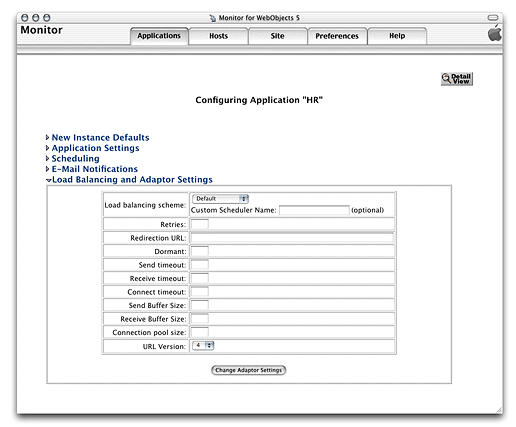

After configuring an application in JavaMonitor, you can create application instances with ease.

1. In JavaMonitor, click the Applications tab. The Applications page is displayed, as shown in Figure 5-11.

   __Figure 5-11__   The Applications page with one application

   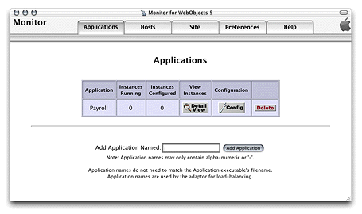
2. Click the Detail View button under View Instances. The application detail page is displayed, as shown in Figure 5-12.

   __Figure 5-12__   The application detail page

   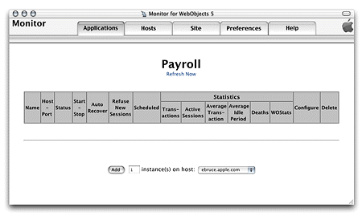
3. Enter the number of instances you want to add in the text input field.
4. Choose the application host you want the instances to run on from the pop-up menu.

   The application must be installed on the host you choose; otherwise, an error message is displayed when you try to start the instance. See [Installing Applications](#apple-f4xwc4dqnrsv64tfmyxwi33df52wszbpkridgmbqgaydanrufvbegskejfeuira) for details.
5. Click Add. Your web browser displays a page like the one in Figure 5-13.

   __Figure 5-13__   The application detail page after an instance has been added

   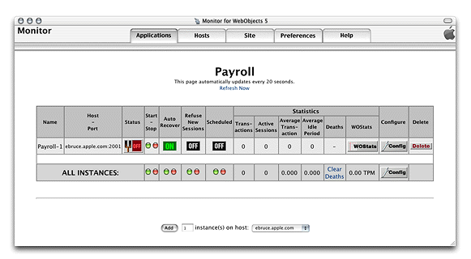

The Status column indicates whether the instance is on or off. The first time the page is displayed, the newly added instances are off. After a moment (or if you click Refresh Now), and if Auto Recover is enabled for the instance, the page refreshes, showing that the instance is active. For details on Auto Recover, see the description of Auto Recover in New Instance Defaults. (Read [Setting JavaMonitor Preferences](#apple-f4xwc4dqnrsv64tfmyxwi33df52wszbpkridgmbqgaydanrufvbegskgizfeoqq) for how to change the length of the interval between the automatic updates of the application detail page.)

Figure 5-14 shows the application detail page of the HR application, with two instances configured.

__Figure 5-14__  The application detail page with two instances added

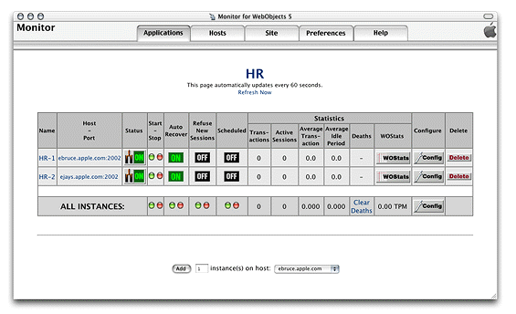

The following list describes the instance configuration information that appears in the application detail page:

- __Page heading__: A link to the application through the HTTP adaptor. When you click it, the adaptor uses load balancing to determine which of the application’s instances should receive the request. Then, your web browser displays a new window showing your application’s entry page. For this to work, the HTTP adaptor URL has to be set ([Configuring Sites](#apple-f4xwc4dqnrsv64tfmyxwi33df52wszbpkridgmbqgaydanrufvbegskfjbfeksa) shows you how to do this).
- __Name__: A link to the instance through the HTTP adaptor. When you click it, the request goes through the adaptor but it’s not load balanced. The URL is derived in the same way the URL of the page heading is derived but with the addition of the instance number. Such a URL looks similar to the following:

```
http://ebruce2.apple.com/cgi-bin/WebObjects/HR.woa/1
```
- __Host-Port__: A direct link to the instance; does not go through the HTTP adaptor.
- __Status__: Tells whether the instance is on, off, starting, or stopping.
- __Start-Stop__: Click the green button to turn the instance on or the red button to turn it off.
- __Auto Recover__: Click to toggle between ON and OFF. This is available only if the instance is not scheduled. See description of Auto Recover in [New Instance Defaults](#apple-f4xwc4dqnrsv64tfmyxwi33df52wszbpkridgmbqgaydanrufvkfawcsivddcmjw).
- __Refuse New Sessions__: Click to toggle between ON and OFF. When ON, the instance does not accept new users. This is available only if the instance is not scheduled.
- __Scheduled__: Click to toggle between ON and OFF. When ON, JavaMonitor uses the schedule defined for the instance.
- __Configure__: Click the Config button to go to the instance configuration page for the instance.
- __Delete__: Click the Delete button to delete the instance. JavaMonitor displays a confirmation page before executing the deletion.

For an explanation of the columns under Statistics, see [The Application Detail Page](Application%20Administration.md#apple-f4xwc4dqnrsv64tfmyxwi33df52wszbpkridgmbqgaydanrvfvkfawcsivddcmjz).

The row with the caption ALL INSTANCES contains buttons that perform some of the functions listed above on all the instances of the application. Clicking Config displays the application configuration page.

After adding an instance, you can change its configuration in the instance configuration page, shown in Figure 5-15. You can access this page through the instance’s Config button in the application detail page. It contains two sections: Instance Settings and Adaptor Settings. For information on those sections, see [Instance Settings](#apple-f4xwc4dqnrsv64tfmyxwi33df52wszbpkridgmbqgaydanrufvbegskkjfbeksi) and [Adaptor Settings](#apple-f4xwc4dqnrsv64tfmyxwi33df52wszbpkridgmbqgaydanrufvbegskci5euqqy).

__Figure 5-15__  Instance configuration page

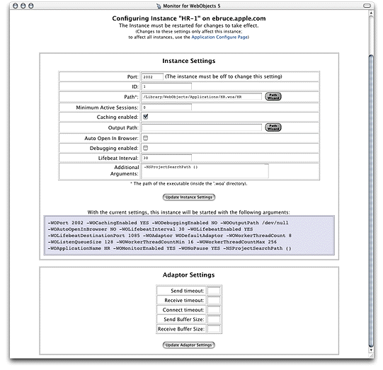

This section is very similar to the New Instance Defaults section of the application configuration page ([New Instance Defaults](#apple-f4xwc4dqnrsv64tfmyxwi33df52wszbpkridgmbqgaydanrufvkfawcsivddcmjw)). It has two additional properties: ID and Port, which can be changed only after an instance has been added. ID is the application instance number which must be unique for each instance of an application. For Port details, see `WOPort` in _[WebObjects Application Properties Reference](../WebObjects%20Application%20Properties%20Reference/Introduction%20to%20WebObjects%20Application%20Properties%20Reference.md#apple-f4xwc4dqnrsv64tfmyxwi33df52wszbpkridgmbqgaytamrq)_.

In this section you can change a subset of the properties available in the Load Balancing and Adaptor Settings section of the application configuration page. For details, see the descriptions in [Load Balancing and Adaptor Settings](#apple-f4xwc4dqnrsv64tfmyxwi33df52wszbpkridgmbqgaydanrufvbegskcivfeqqy).

For each instance of your application, there’s a statistics page that displays information such as its running time and memory usage. See [The Instance Statistics Page](Application%20Administration.md#apple-f4xwc4dqnrsv64tfmyxwi33df52wszbpkridgmbqgaydanrvfvkfawcsivddcmbw) for more information on this page. If you want to prevent outside agents from gaining access to the instance statistics page, you can set a password in the Instance Settings section of the instance configuration page. Add the following to the Additional Arguments property:

`-WOStatisticsPassword password`

Figure 5-16 shows an example where the `WOStatisticsPassword` argument has been added to the Additional Arguments field.

__Figure 5-16__   Setting a password for an instance’s statistics page

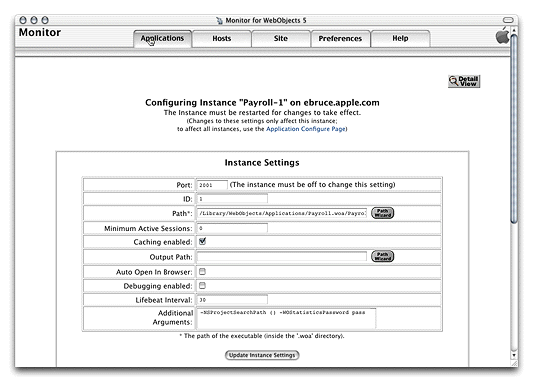

When you click the Site tab in JavaMonitor, the site configuration page is displayed. It contains three sections:

- __HTTP Adaptor URL__. This is where you tell JavaMonitor how to compose an application’s URL, which is used in the application detail page to connect you to instances of your application.

  To set the URL for your application, enter the URL in the URL to Adaptor field.
- __HTTP Adaptor Settings__. This is where you set default HTTP adaptor settings for all your deployed applications. They can be overridden by each application. For more information, see the descriptions in [Load Balancing and Adaptor Settings](#apple-f4xwc4dqnrsv64tfmyxwi33df52wszbpkridgmbqgaydanrufvbegskcivfeqqy).
- __Email Notifications__. Here’s where you specify the SMTP host and the return address that JavaMonitor uses for email notifications.

Figure 5-17 shows the site configuration page.

__Figure 5-17__  The site configuration page

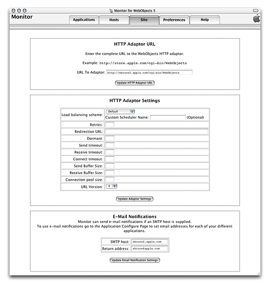

When you click the Preferences tab in JavaMonitor, the page in Figure 5-18 is displayed. It contains two sections: JavaMonitor Password and Detail View Refresh Settings.

__Figure 5-18__  The preferences page

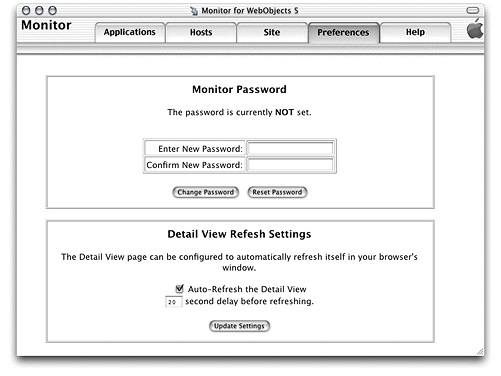

You can restrict access to JavaMonitor by requiring its users to enter a password before they can use it. When a site is protected this way, the site’s wotaskd processes are also protected; that is, you cannot directly obtain a wotaskd process’s information by connecting to its port.

Figure 5-19 shows the login page that JavaMonitor displays after you password-protect your site.

__Figure 5-19__  Login page displayed by JavaMonitor on a password-protected site

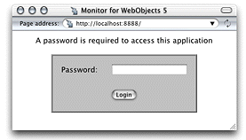

When you try to view the configuration of an application host on a site that you’ve password-protected by connecting to the appropriate wotaskd process’s port, you see a page similar to the one shown in Figure 5-20 (the page’s content varies according to your deployment platform).

__Figure 5-20__  Page returned by wotaskd when the site is password-protected

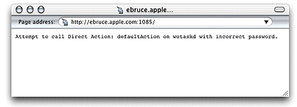

On password-protected sites, you have to use JavaMonitor to view an application host’s configuration.

This section allows you to tell JavaMonitor if you want it to refresh the application detail page and how often to do it.

Load balancing is a mechanism by which user-load is spread out among the instances of an application; these instances can be running on different hosts. Load balancing ensures that your site’s hardware resources are used efficiently and with the highest level of performance. The default load-balancing scheme used is Random. The following list describes how user load is distributed under each of the provided algorithms:

- __Random__: Assigns a user to an arbitrarily-chosen instance.
- __Round Robin__: Assigns users among instances sequentially.
- __Load Average__: Balances load by distributing users evenly among instances.

You can choose a load-balancing algorithm at two levels:

- __Site level__: You set a site-wide load-balancing algorithm in the HTTP Adaptor Settings section of the Site page. From then on, the applications in your site will use that load-balancing algorithm.
- __Application level__: You can override the site-wide load-balancing algorithm in the Load Balancing and Adaptor Settings section of the application configuration page.

You can deploy and configure separate sites on a set of computers by running multiple web servers, each with its own HTTP adaptor. Such a deployment requires a separate group of wotaskd processes running on the same port. You also need a separate JavaMonitor process to configure each site.

The default installation of the WebObjects Deployment package provides you with one site—one wotaskd process per host, running on port `1085`. To create a second site, using the same hardware, you have to add an additional wotaskd process to each of the hosts you want to use.

What separates the environments from each other are the `WOPort` and `WOLifebeatDestinationPort` settings of each wotaskd process and the configuration directory used for each site. The application instances send their lifebeats to their `WOLifebeatDestinationPort`, while wotaskd processes listen for them in their `WOPort`. Figure 5-21 illustrates two sites on one host.

__Figure 5-21__  Multiple application environments on one computer

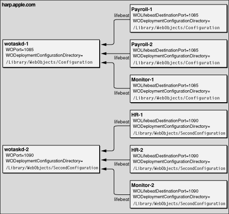

Because JavaMonitor is not started by a wotaskd process, its `WOLifebeatDestinationPort` argument needs to be set to match wotaskd’s `WOPort` setting.

For details on how to set the command-line argument values required when starting wotaskd and JavaMonitor processes for separate application environments, see `WOPort`, `WOLifebeatDestinationPort`, and `WODeploymentConfigurationDirectory` in _[WebObjects Application Properties Reference](../WebObjects%20Application%20Properties%20Reference/Introduction%20to%20WebObjects%20Application%20Properties%20Reference.md#apple-f4xwc4dqnrsv64tfmyxwi33df52wszbpkridgmbqgaytamrq)_.

[Next](Application%20Administration.md)[Previous](Managing%20Application%20Instances.md)

