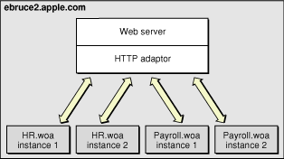
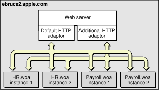
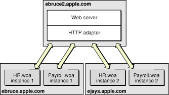
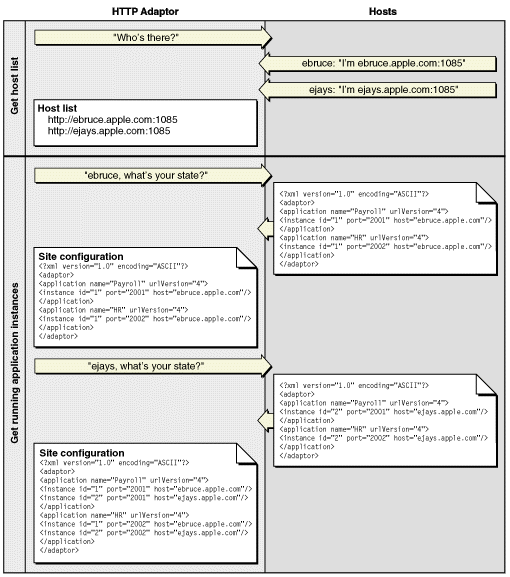
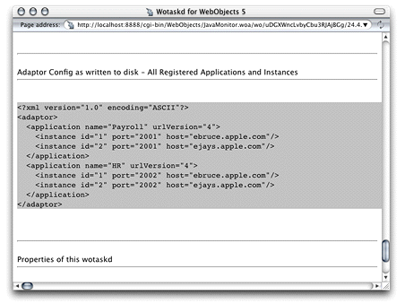
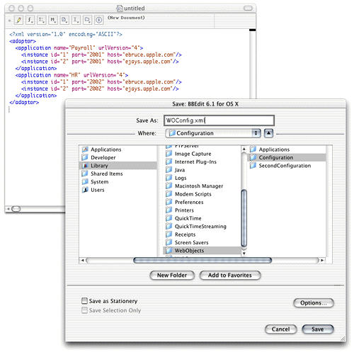
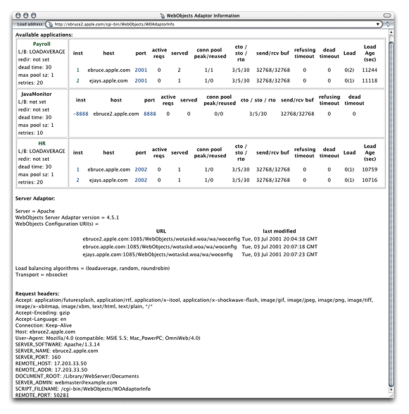

> 导航：[总目录](../../../README.md) · [documentation](../../../_indexes/documentation.md) · [WebObjects Deployment Guide Using JavaMonitor](Introduction%20to%20WebObjects%20Deployment%20Guide%20Using%20JavaMonitor.md)


[Next](Managing%20Application%20Instances.md)[Previous](Installing%20Software.md)

# HTTP Adaptors

This chapter provides detailed information about the HTTP adaptors that are included in a WebObjects Deployment installation. The HTTP adaptor is an important piece of an application site. It sits between your web server and your application instances. It forwards requests from the web server to the appropriate application instance and responses from the instance back to the web server. It also performs load balancing between instances of an application.

This chapter contains the following sections:

- [Adaptors, Applications, and Hosts](#apple-f4xwc4dqnrsv64tfmyxwi33df52wszbpkridgmbqgaydanrsfvbeeq2hjfbegsi) provides a high-level view of the interaction between the HTTP adaptor, application instances, and application hosts.
- [Types of Adaptors](#apple-f4xwc4dqnrsv64tfmyxwi33df52wszbpkridgmbqgaydanrsfvbeeq2hifeeerq) explains the differences among the two types of HTTP adaptors that you can use on your site.
- [State Discovery](#apple-f4xwc4dqnrsv64tfmyxwi33df52wszbpkridgmbqgaydanrsfvbeeq2gifausri) describes how to configure an HTTP adaptor to obtain your site’s state dynamically or using a configuration file. It also explains how to change a dynamic configuration into a static one.
- [The WebObjects Adaptor Information Page](#apple-f4xwc4dqnrsv64tfmyxwi33df52wszbpkridgmbqgaydanrsfvbeeq2divbuqrq) shows an example of the web browser page that displays information about an HTTP adaptor.
- [Customizing HTTP Adaptors](#apple-f4xwc4dqnrsv64tfmyxwi33df52wszbpkridgmbqgaydanrsfvbeeq2ei5feosa) summarizes all the settings available for HTTP adaptors.

The HTTP adaptor forwards requests from an web server to application instances and returns responses from instances back to the server. You may need to have more than one instance of a given application to support a large number of concurrent users. Figure 3-1 illustrates a simple site, implemented with one computer. It serves two applications, with two instances for each application.

__Figure 3-1__  Deployment on one computer, using one adaptor



Although the WebObjects installation provides several HTTP adaptors, only one is active by default (see [HTTP Adaptors](Installing%20Software.md#apple-f4xwc4dqnrsv64tfmyxwi33df52wszbpkridgmbqgaydanrrfvbegskejbdukri) for details). However, an application instance can communicate with an adaptor other than the active adaptor.

Figure 3-2 depicts an application site running on one computer, using two adaptors.

__Figure 3-2__  Deployment on one computer using two adaptors



Most sites require multiple computers to ensure that an instance of a particular application is always available. In this kind of deployment, usually one computer runs the web server and the HTTP adaptor, while one or more additional computers serve as application hosts. Figure 3-3 illustrates an application site using three computers, one running the web server and the adaptor, and the other two running application instances.

__Figure 3-3__  Deployment using three computers using one adaptor



The HTTP adaptor needs to periodically determine your site’s state—which application instances are running. There are two ways in which the adaptor can obtain this information:

- __dynamically__: The adaptor determines your site’s state by asking each application host for its state. The adaptor can use a multicast request to find out which hosts are available or you can define a host list for it. Using this method, you avoid having to configure new hosts as you add them to your site.
- __from a static file__: An adaptor configuration file contains host and application information about your site; it includes information about every application instance you want to run. After the adaptor reads the file, it has all the information it needs to communicate with the application instances you want to run. Using this kind of configuration avoids multicast requests and host polling. However, when you add new hosts, you have to update the configuration file. For more information on the adaptor configuration file, see [Using a Configuration File](#apple-f4xwc4dqnrsv64tfmyxwi33df52wszbpkridgmbqgaydanrsfvbeeq2djbaumqq).

There are two general types of HTTP adaptors, _CGI adaptors_ and _API-based adaptors_. CGI adaptors are portable across many platforms. API-based adaptors are generally more efficient than CGI adaptors.

WebObjects Deployment includes a CGI adaptor, which is an executable file named `WebObjects`. The CGI adaptor resides in the Web server’s `cgi-bin` or `scripts` directory. This adaptor works with any web server that conforms to the CGI standard.

The major drawback of CGI adaptors is their performance. When the web server receives a request from a web browser, it creates a new process for the HTTP adaptor. When the adaptor is done processing the request, the process is terminated.

The CGI adaptor is installed by default on all platforms, but it may not be the active one on your platform. See [HTTP Adaptors](Installing%20Software.md#apple-f4xwc4dqnrsv64tfmyxwi33df52wszbpkridgmbqgaydanrrfvbegskejbdukri) for more information.

API-based adaptors are founded on API specific to a particular web server. They allow CGI-like tasks to run as part of the main server process, avoiding the creation and termination of a process for each request. WebObjects Deployment includes Apache’s module API.

Your site’s state is represented by

- a list of application hosts
- a list of running application instances on each host

The HTTP adaptor captures your site’s state at regular intervals, which you set when you configure the adaptor. You also define the method that the adaptor uses to gather state information by configuring the adaptor itself. For details, see [Customizing HTTP Adaptors](#apple-f4xwc4dqnrsv64tfmyxwi33df52wszbpkridgmbqgaydanrsfvbeeq2ei5feosa).

The adaptor can obtain the state of your site using one of three methods:

- __Multicast request__: The adaptor sends a multicast request to find out what application hosts are available. After compiling the host list, the adaptor polls each host to get its list of running application instances.
- __Static host list__: This method requires that you configure the host list in the adaptor itself. As with the first method, the adaptor polls the hosts on the list for their lists of running application instances.
- __Configuration file__: The adaptor obtains the site’s configuration by reading an _XML_ (Extensible Markup Language) document.

The method that requires the least administration on your part is the multicast request. If an application host goes down, the adaptor automatically removes the application instances running on it from its list of active instances. When the host is brought back up, the adaptor adds the instances back to its list. You should use this method if your site has many application hosts. See [Using a Multicast Request](#apple-f4xwc4dqnrsv64tfmyxwi33df52wszbpkridgmbqgaydanrsfvbeeq2gi5eemri) for more information.

The second method, defining a host list for your adaptor, eliminates the multicast request. Use this method if you do not want the adaptor to send regular multicast requests out on your network or if you seldom add or remove application hosts from your site. This is the method that is active by default. However, the host list contains only one host, `localhost`. For details, see [Using a Static Host List](#apple-f4xwc4dqnrsv64tfmyxwi33df52wszbpkridgmbqgaydanrsfvbeeq2jivdeiqq).

In the third method, using a configuration file, the HTTP adaptor obtains your site’s configuration by reading a file. This file can be static or it can be dynamically updated as you configure your site with Monitor. For details, see [Using a Configuration File](#apple-f4xwc4dqnrsv64tfmyxwi33df52wszbpkridgmbqgaydanrsfvbeeq2djbaumqq).

You can write the adaptor configuration file in one of two ways:

- __Manually__: The information in the configuration file is stored in an XML document. For details, see [The HTTP Adaptor Configuration File](#apple-f4xwc4dqnrsv64tfmyxwi33df52wszbpkridgmbqgaydanrsfvbeeq2iijdumsq).
- __Using JavaMonitor and wotaskd__: After configuring your site to your liking using JavaMonitor, you can have a file created for you or you can copy-and-paste the information. See [Creating the HTTP Adaptor Configuration File](#apple-f4xwc4dqnrsv64tfmyxwi33df52wszbpkridgmbqgaydanrsfvbeeq2hijduuqi) for more information.

When you configure an adaptor to obtain your site’s state using a multicast discovery request, the adaptor obtains the list of active application hosts by broadcasting a message to which each computer configured as a WebObjects application host responds. After the adaptor compiles the list of available hosts, it polls each one to obtain its state (the list of running application instances).

There are drawbacks to using the multicast method:

- It increases network traffic. By default, the HTTP adaptor sends a multicast request every 100 seconds.
- A host may become unavailable between discovery requests if the multicast request or a wotaskd process’s response is lost (multicast is an inherently unreliable protocol).
- Normally, multicast broadcasts are limited to a subnet. However, you can configure your routers to pass-on the multicast request to other subnets if you wish.

To discover available hosts, the adaptor sends a host-discovery request on the multicast channel (a nonrouting IP address and a port number), which is set to IP address `239.128.14.2` and port `1085` by default. The frequency of each multicast request is ten times as long as the adaptor’s configuration refresh interval. For details on how to change the multicast channel, read [Setting the Multicast Address and Port](#apple-f4xwc4dqnrsv64tfmyxwi33df52wszbpkridgmbqgaydanrsfvbeeq2dindemsi). Also, see `WOPort`, `WOMulticastAddress`, and `WORespondsToMulticastQuery` in _[WebObjects Application Properties Reference](../WebObjects%20Application%20Properties%20Reference/Introduction%20to%20WebObjects%20Application%20Properties%20Reference.md#apple-f4xwc4dqnrsv64tfmyxwi33df52wszbpkridgmbqgaytamrq)_. When a wotaskd process starts, it creates a UDP (User Datagram Protocol) socket that listens to the multicast channel through which it receives multicast requests.

When each wotaskd process receives the multicast request, it replies with its URL, such as `http://host1.site.com:1085`. The adaptor in turn compiles a list of these URLs.

Sending a multicast request on an entire subnet is an expensive process. If your available hosts never change, consider using a static host list instead.

After the HTTP adaptor constructs the host list, it polls each application host on the list for information on the active application instances running on it. Each wotaskd process, in turn, sends its state information using the format in [Listing 3-2](#apple-f4xwc4dqnrsv64tfmyxwi33df52wszbpkridgmbqgaydanrsfvbeeq2civbeisq). Host polling to obtain information on active instances occurs at the interval indicated in the configuration refresh interval setting for the HTTP adaptor. Figure 3-4 illustrates the process used to determine the configuration of the site in [Figure 3-3](#apple-f4xwc4dqnrsv64tfmyxwi33df52wszbpkridgmbqgaydanrsfvbeeq2hjjduoqi).

__Figure 3-4__  Dynamic site configuration using multicast request and polling



This method is similar to the one described in [Using a Multicast Request](#apple-f4xwc4dqnrsv64tfmyxwi33df52wszbpkridgmbqgaydanrsfvbeeq2gi5eemri). The only difference is that the HTTP adaptor skips the first part, the multicast request. The host polling process occurs at the interval set in the adaptor’s configuration refresh interval setting.

You must explicitly define a host list for each adaptor. See [Setting the Host List](#apple-f4xwc4dqnrsv64tfmyxwi33df52wszbpkridgmbqgaydanrsfvbeeq2di5cemqi) for details on defining the host list for each of the adaptors provided.

Using an HTTP adaptor configuration file is useful when you want to have a static site configuration (one in which application instances are not stopped after they are started) or if you want to use JavaMonitor to configure your site and have the adaptor read your configuration changes immediately. (The adaptor reads the configuration file every 10 seconds to determine which application instances are active.)

This method also provides a way of having more than one configuration of your site available. You can switch among different configurations by placing the appropriate configuration file in the configuration directory.

[The HTTP Adaptor Configuration File](#apple-f4xwc4dqnrsv64tfmyxwi33df52wszbpkridgmbqgaydanrsfvbeeq2iijdumsq) explains how the file is structured and lists the properties that it defines. For instructions on creating the configuration file and configuring the HTTP adaptor to use it, see [Creating the HTTP Adaptor Configuration File](#apple-f4xwc4dqnrsv64tfmyxwi33df52wszbpkridgmbqgaydanrsfvbeeq2hijduuqi).

You can set up the HTTP adaptor to get your site’s configuration by reading an HTTP adaptor configuration file (called `WOConfig.xml` by default) in the configuration directory (`/Library/WebObjects/Configuration` by default). You should have only one adaptor configuration file per web server so that it can perform load balancing effectively. (See [Load Balancing](Deployment%20Tasks.md#apple-f4xwc4dqnrsv64tfmyxwi33df52wszbpkridgmbqgaydanrufvbegskjjfbekqq) for details.) In addition, in a site with multiple web servers, if two servers share the configuration file, instead of deploying two sites you would be deploying the same site twice. Listing 3-1 shows a configuration file that defines a site with two application hosts (`ebruce.apple.com` and `ejays.apple.com`), each running two application instances, one of the Payroll application and the other of the HR application.

__Listing 3-1__  A WebObjects adaptor configuration file

```xml
<?xml version="1.0" encoding="ASCII"?>
<adaptor>
  <application name="Payroll" urlVersion="4">
    <instance id="1" port="2002" host="ebruce.apple.com"/>
    <instance id="2" port="2001" host="ejays.apple.com"/>
  </application>
  <application name="HR" urlVersion="4">
    <instance id="1" port="2001" host="ebruce.apple.com"/>
    <instance id="2" port="2002" host="ejays.apple.com"/>
  </application>
</adaptor>
```

The HTTP adaptor configuration file provides the HTTP adaptor with information about your site’s registered application instances. The structure of the configuration file is provided in Listing 3-2 (you can also view it by opening the `woadaptor.dtd` file, located in the `/Developer/Examples/WebObjects/Source/Adaptors` directory). For information on the properties defined in the configuration file, consult [Table 3-1](#apple-f4xwc4dqnrsv64tfmyxwi33df52wszbpkridgmbqgaydanrsfvkfawcsivddcmbw).

__Listing 3-2__  Structure of the HTTP adaptor configuration file


```xml
<?xml version="1.0" encoding="ASCII"?>
<!DOCTYPE WebObjectsAdaptorConfiguration SYSTEM "woadaptor.dtd">
<adaptor>
    <application name=STRING
            retries=NUMBER
            scheduler=["RANDOM"|"ROUNDROBIN"|"LOADAVERAGE"]
            dormant=NUMBER
            protocol="http"
            redir=URL
            poolSize=NUMBER
            urlVersion=["3"|"4"]
            additionalArgs="unspecified"
        >
        <instance    id=NUMBER  port=NUMBER  host=STRING
            sendTimeout=NUMBER
            recvTimeout=NUMBER
            cnctTimeout=NUMBER
            sendBufSize=NUMBER
            recvBufSize=NUMBER
            additionalArgs="unspecified"
        >
        </instance>
    </application>
</adaptor>
```


__Table 3-1__  The properties of the HTTP adaptor configuration file

| Property | Description |
| `name` | This property is used by the adaptor to implement load balancing. The adaptor can load-balance only between instances with the same application name. The property can be used to create groups of instances, even when the instances share the same executable file. This argument is set automatically for instances started by wotaskd. |
| `retries` | The number of times a request is retried (trying several instances) if a communications failure occurs before an error page is returned to the web server. |
| `scheduler` | The load-balancing scheme used by the adaptor for instances of the application. The options provided by WebObjects are Round Robin, Random, and Load Average. You can also use a custom load balancer; see [Load Balancing and Adaptor Settings](Deployment%20Tasks.md#apple-f4xwc4dqnrsv64tfmyxwi33df52wszbpkridgmbqgaydanrufvbegskcivfeqqy) for details. |
| `dormant` | The number of times the adaptor skips an instance of the application before trying again. |
| `redir` | The URL that the user is redirected to when an instance fails to respond to a direct request. |
| `poolSize` | The maximum number of simultaneous connections the adaptor should keep open for each configured instance. |
| `urlVersion` | The WebObjects version to use for URL parsing and formatting. All WebObjects 4, 4.5, and 5.x applications use version 4 URLs by default. |
| `additionalArgs` | Additional information to send to the instance when it’s started. |
| `id` | The instance’s identification number. Must be unique for the load-balancing process to operate correctly. |
| `port` | The port on which the instance runs. |
| `host` | Specifies the network interface that an instance binds to. This argument should only be used on hosts with multiple network interfaces (IP addresses). |
| `sendTimeout` | The length of time, in seconds, that the adaptor attempts to send data to an instance of the application before giving up. |
| `recvTimeout` | The length of time, in seconds, that the adaptor waits for a response from an instance of the application before giving up. |
| `cnctTimeout` | The length of time, in seconds, before the adaptor gives up connecting to an instance. |
| `sendBufSize` | The size, in bytes, of the TCP/IP socket send buffer that’s used for adaptor-to-instance communication. |
| `recvBufSize` | The size, in bytes, of the TCP/IP socket receive buffer that’s used for adaptor-to-instance communication. |

You can define your site’s configuration by writing the HTTP adaptor configuration file by hand. However, JavaMonitor provides you with an easy-to-use interface that facilitates this task.

[Deployment Tasks](Deployment%20Tasks.md#apple-f4xwc4dqnrsv64tfmyxwi33df52wszbpkridgmbqgaydanrufvkfawcsivddcmbr) shows you how to configure your site using JavaMonitor. When you are satisfied with the configuration, you can save the settings into a configuration file by copying and pasting or by telling wotaskd to write the file.

To use the copy-and-paste method, follow these steps:

1. In JavaMonitor, display the Hosts page.
2. Click YES for any host.

   The host configuration page is displayed in a new web browser window.
3. Copy the contents of the section Adaptor Config as written to disk—All Registered Applications and Instances, as shown in Figure 3-5.

   __Figure 3-5__  Copying the information that makes up the HTTP adaptor configuration file

   
4. Using a text editor, create a new file and paste the contents of the clipboard into it.
5. Save the file as `WOConfig.xml` (or any other name you choose) in the configuration directory.

   __Figure 3-6__  Creating and saving the HTTP adaptor configuration file

   

If instead of copying and pasting you want wotaskd to create the configuration file for you, you can start a wotaskd process specifically to create the file or you can tell wotaskd to continually maintain the configuration file.

To start a wotaskd process specifically to create the file, you must first stop the process that corresponds to the site you configured if it’s already running on the web server computer.

To start a wotaskd process that writes the configuration file to the default location, execute the following two commands using your command shell editor:

```
cd /System/Library/WebObjects/JavaApplications/wotaskd.woa
./wotaskd -WOPort <port> -WOSavesAdaptorConfiguration true
```

To specify a different location for the HTTP adaptor configuration file, see `WODeploymentConfigurationDirectory` in _[WebObjects Application Properties Reference](../WebObjects%20Application%20Properties%20Reference/Introduction%20to%20WebObjects%20Application%20Properties%20Reference.md#apple-f4xwc4dqnrsv64tfmyxwi33df52wszbpkridgmbqgaytamrq)_. If you want to give the file a different name, [Setting the Name of the HTTP Adaptor Configuration File](#apple-f4xwc4dqnrsv64tfmyxwi33df52wszbpkridgmbqgaydanrsfvbeeq2divdeora) shows you how.

To tell wotaskd to maintain the configuration file on a permanent basis, add the following to the WOServices script line that starts the wotaskd process:

`-WOSavesAdaptorConfiguration true`

When you restart your web server, the HTTP adaptor configuration file is updated every time you make a change to your site’s configuration through JavaMonitor. The changes are picked up by the HTTP adaptor the next time it reads the configuration file.

To configure the HTTP adaptor to read the configuration file instead of using a multicast request or a host list, follow the instructions in [Setting the Name of the HTTP Adaptor Configuration File](#apple-f4xwc4dqnrsv64tfmyxwi33df52wszbpkridgmbqgaydanrsfvbeeq2divdeora).

The WebObjects Adaptor Information page displays information about an HTTP adaptor. Access to this page is disabled by default so you must modify the adaptor configuration file to allow access. See [Setting Access to the WebObjects Adaptor Information Page](#apple-f4xwc4dqnrsv64tfmyxwi33df52wszbpkridgmbqgaydanrsfvbeeq2civdesqy) for details. Figure 3-7 shows an example of the WebObjects Adaptor Information page.

__Figure 3-7__  The WebObjects Adaptor Information page



For the most part, you shouldn’t need to modify the default values of settings in the configuration file. However, if you want to change the way the HTTP adaptor obtains your site’s state information, for example, you need to perform some of the procedures explained here.

These are the tasks explained in this section:

- [Setting the Multicast Address and Port](#apple-f4xwc4dqnrsv64tfmyxwi33df52wszbpkridgmbqgaydanrsfvbeeq2dindemsi)
- [Setting the Host List](#apple-f4xwc4dqnrsv64tfmyxwi33df52wszbpkridgmbqgaydanrsfvbeeq2di5cemqi)
- [Setting the Name of the HTTP Adaptor Configuration File](#apple-f4xwc4dqnrsv64tfmyxwi33df52wszbpkridgmbqgaydanrsfvbeeq2divdeora)
- [Setting Access to the WebObjects Adaptor Information Page](#apple-f4xwc4dqnrsv64tfmyxwi33df52wszbpkridgmbqgaydanrsfvbeeq2civdesqy)
- [Setting an Alias for cgi-bin in the WebObjects URL](#apple-f4xwc4dqnrsv64tfmyxwi33df52wszbpkridgmbqgaydanrsfvbeeq2cjbcuosi)
- [Setting the Document Root Path of the Web server](#apple-f4xwc4dqnrsv64tfmyxwi33df52wszbpkridgmbqgaydanrsfvbeeq2givceksa)
- [Setting WebObjects Options](#apple-f4xwc4dqnrsv64tfmyxwi33df52wszbpkridgmbqgaydanrsfvbeeq2jineegry)

The following list explains how to set the multicast address, port, and configuration refresh interval (in seconds) in the supported HTTP adaptors. The default values for each of these properties are `239.128.14.2`, `1085`, and `10` respectively. The adaptor uses the configuration interval to determine the amount of time that passes between state discoveries on your site. The host-discovery process occurs 10 times less frequently than the time indicated by the configuration refresh interval. For example, with the configuration refresh interval set to `10`, the discovery process occurs every 100 seconds.

- __Apache__: Set the value of the `WebObjectsConfig` variable in the `apache.conf` file to the desired values, using the format shown below:

```
WebObjectsConfig webobjects://<address>:<port> <configuration_interval>
```
- __CGI__: Set the `WO_CONFIG_URL` environment variable to `webobjects://<address>:<port>`. Make sure your web server is configured to pass the variable to the adaptor (consult your web server’s documentation for instructions).

The following list explains how to set a host list for a site with two hosts, `host1` and `host2`, in the supported adaptors with a configuration interval of `10` (the configuration interval cannot be set in the CGI adaptor).

- __Apache__: Set the `WebObjectsConfig` variable in the `apache.conf` file to the desired list of hosts. By default it’s set to `http://localhost:1085 10` (the `10` is the configuration refresh interval). Separate each host with a comma, as shown in the following example:

```
WebObjectsConfig http://host1:1085,http://host2:1085 10
```
- __CGI__: Set the `WO_CONFIG_URL` environment variable to `http://host1:1085,http://host:1085`. Make sure the web server is configured to pass the variable to the adaptor (consult your web server’s documentation for instructions).

The following list shows how to set the name and location of the HTTP adaptor configuration file for the supported HTTP adaptors.

- __Apache__: Set the value of `WebObjectsConfig` variable in the `apache.conf` file to the path of the adaptor configuration file.

```
WebObjectsConfig file://<path-to-an-xml-config-file> 10
```
- __CGI__: Set the `WO_CONFIG_URL` environment variable to `file://<path-to-an-xml-config-file>`. Make sure the web server is configured to pass the variable to the adaptor (consult your web server’s documentation for instructions).

You can provide access to the WebObjects adaptor information page (WOAdaptorInfo) to a specific user or to everyone. To provide access to a single user, you set the values of the `username` and `password` properties. To provide public access, set the `username` attribute to `public`. The following list explains how to provide access to the information page to a user named Joe in the supported adaptors. For the changes to take effect, you need to restart the web server.

- __Apache__: Add the following lines to the `apache.conf` file, located in the `/System/Library/WebObjects/Adaptors/Apache` directory:

```
WebObjectsAdminUsername joe
WebObjectsAdminPassword secret
```
- __CGI__: Set the `WO_ADAPTOR_INFO_USERNAME` and `WO_ADAPTOR_INFO_PASSWORD` environment variables to the appropriate values. Make sure the web server is configured to pass the variables to the adaptor (consult your web server’s documentation for instructions).

The following list explains how to change the `cgi-bin` part of the URL used to connect to an application instance to `Store` in the Apache, and CGI adaptors:

- __Apache and CGI__: In the `apache.conf` file, change the line

```
WebObjectsAlias /cgi-bin/WebObjects
```

  to

```
WebObjectsAlias /Store/WebObjects
```


The following list explains how to set the path to the document root of the supported web servers.

- __Apache__: In the `apache.conf` file, change the line

```
WebObjectsDocumentRoot /Library/WebServer/Documents
```

  to

```
WebObjectsDocumentRoot <document-root-path>
```
- __CGI__: Set the value of the `CGI_DOCUMENT_ROOT` environment variable to the desired path. Make sure that your web server is configured to pass the variable to the adaptor (consult your web server’s documentation for instructions).

You can set several WebObjects options through an environment variable or Registry setting, depending on which web server you’re using. Table 3-2 shows the WebObjects options available:

__Table 3-2__  WebObjects options

| Option | Description |
| `logPath` | Full path to log file. |
| `logLevel` | Logging level used to log HTTP adaptor activity. Values (from most verbose to least verbose) `Debug`, `Info`, `Warn`, `Error`, and `User`. |
| `stateFile` | Filename to use for the shared state file (applicable to Apache and CGI on Unix or Mac OS X Server only). Use when running multiple HTTP adaptors on a single computer. |
| `redir` | The URL users are redirected to when the application or Web page they try to access is unavailable. |

The following list explains how to set WebObjects options for the supported HTTP adaptors:

- __Apache__: Add the `WebObjectsOptions` variable to the `apache.conf` file:

```
WebObjectsOptions redir=<redirection_url>, logLevel=Debug
```
- __CGI__: Set the `WEBOBJECTS_OPTIONS` environment variable to the appropriate value; for example, `redir=<redirection_url>, logLevel=Debug`. Make sure the web server is configured to pass the variable to the adaptor (consult your web server’s documentation for instructions).

[Next](Managing%20Application%20Instances.md)[Previous](Installing%20Software.md)

