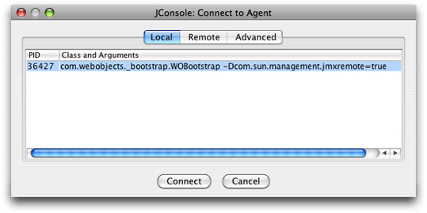
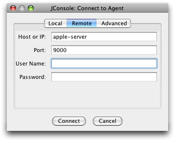
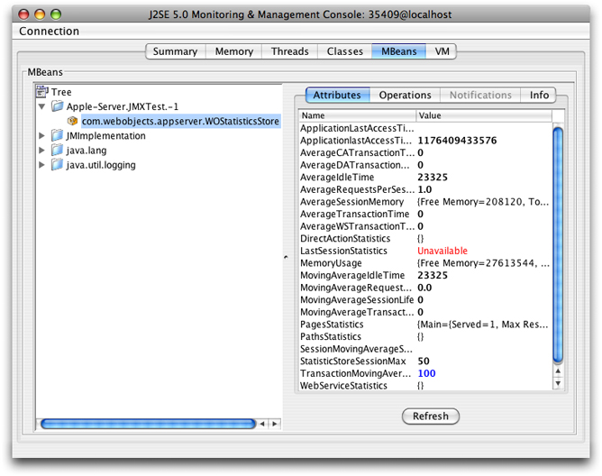

> 导航：[总目录](../../../README.md) · [documentation](../../../_indexes/documentation.md) · [WebObjects Deployment Guide Using JavaMonitor](Introduction%20to%20WebObjects%20Deployment%20Guide%20Using%20JavaMonitor.md)


[Next](Deployment%20Issues%20with%20Java%20Client.md)[Previous](Application%20URLs.md)

# JMX Monitoring

You can monitor WebObjects applications using Sun's Java JDK 1.5 Java Management Extensions (JMX) management and monitoring tools. Specifically, you use Sun’s `jconsole` tool to collect statistics on running WebObjects applications. This appendix explains how to set the Java virtual machine (JVM) system properties for local and remote monitoring of a WebObjects application and how to view the WebObjects statistics with JMX.

This appendix provides only a brief introduction to JMX. They can be an alternative solution for monitoring your applications instead of using JavaMonitor and can be useful for tracing memory and thread usage during development. See Sun’s [Using the Platform MBean Server and Platform MBeans](http://java.sun.com/j2se/1.5.0/docs/guide/management/mxbeans.html) for more information on accessing Sun’s MBeans.

To enable the JMX agent and use `jconsole` to configure its operation, you must first set some system properties when you start the JVM. Note that properties specified on the command line override properties specified in a configuration file. You can either monitor a WebObjects application locally as described in Local Monitoring or remotely as described in [Remote Monitoring](#apple-f4xwc4dqnrsv64tfmyxwi33df52wszbpkridgmbqgaytambzfvbuqmrrgywvgvzs). Local monitoring is useful in a development environment, but not for deployment, since running `jconsole` is very resource intensive.

To enable JMX local monitoring, add the property either via the command line or in the `build-properties.xml` file of the WebObjects application. For reference, see a sample `build-properties.xml` in the `/Developer/Examples/JavaWebObjects/HelloWorld` folder.

From the command line, set the `com.sun.management.jmxremote` property to `true` when starting the WebObjects application as follows:

`cd MyApplication.woa`

`./MyApplication -Dcom.sun.management.jmxremote=true`

To set this property in the `build-properties.xml` file located in your project directory, open the file using a text editor, and modify it as follows:

`<jvmopts>-Dcom.sun.management.jmxremote=true</jvmopts>`

To turn off JMX monitoring, make sure that you do not define the property anywhere in your application. For example, if the property is set in the `build-properties.xml` file, you should delete the definition of the property in that file.

To enable JMX remote monitoring, use either the command line or add the following JVM properties to the `build-properties.xml` file of the WebObjects application.

From the command line, set the port number for `com.sun.management.jmxremote.port` to some unused port number. Setting the port number automatically enables JMX monitoring. In a development environment, you can turn off authentication by setting the `com.sun.management.jmxremote.authenticate` and `com.sun.management.jmxremote.ssl` properties to `false`.

To set these properties in the `build-properties.xml` file for remote monitoring in a development environment, set the following JVM properties as follows:

- `<jvmopts>-Dcom.sun.management.jmxremote.port=9000</jvmopts>`
- `<jvmopts>-Dcom.sun.management.jmxremote.authenticate=false</jvmopts>`
- `<jvmopts>-Dcom.sun.management.jmxremote.ssl=false</jvmopts>`

After enabling JMX monitoring, you can view various measurements about the performance and resource consumption of your WebObjects application using Sun’s `jconsole` tool.

To monitor locally, start `jconsole` in a terminal shell and select the WebObjects application process ID (PID) as shown in Figure A-1.

__Figure A-1__  Local monitoring



To monitor remotely, start your WebObjects application on the remote machine with the proper JVM properties set as described in [Remote Monitoring](#apple-f4xwc4dqnrsv64tfmyxwi33df52wszbpkridgmbqgaytambzfvbuqmrrgywvgvzs). Start `jconsole` in a terminal shell on a local machine and select the Remote tab as shown in [Figure A-2](#apple-f4xwc4dqnrsv64tfmyxwi33df52wszbpkridgmbqgaytambzfvbuqmrrgywvgvzw). Enter the host name and port number for the remote machine, and a user name and password if password authentication is enabled.

__Figure A-2__  Remote monitoring



You can define what to monitor by declaring Java standard MBean interfaces for your Java classes. Whenever you want to monitor your object, you register your object with the MBean server. Similarly, you can unregister your object with the MBean server whenever you are no longer interested in monitoring your object.

To accomplish these tasks, use the following WOApplication methods:

```
public MBeanServer getMBeanServer() throws IllegalAccessException
public String getJMXDomain()
public void registerMBean(Object aMBean, ObjectName aName)
public void registerMBean(Object aMBean, String aDomainName, String  aMBeanName) throws IllegalArgumentException
public void unregisterMBean(ObjectName aName)
```

For example, registering your application with WOStatisticsStore MBean server gives you a view of various runtime statistics using `jconsole`. The WOStatisticsStore object records the bulk of its statistics at the end of each cycle of the request-response loop.

Listing A-1 shows how to register your WebObjects application with WOStatisticsStore MBean. To view the WebObjects statistics, start your application, launch `jconsole`, and select the MBeans tab to view various information as shown in [Figure A-3](#apple-f4xwc4dqnrsv64tfmyxwi33df52wszbpkridgmbqgaytambzfvbuqmrrgywvgvzx).

__Listing A-1__  Registering your application with the WOStatisticsStore MBean

```
// JMX API
import javax.management.MBeanServer;
public class Application extends WOApplication {
    public static void main(String argv[]) {
        WOApplication.main(argv, Application.class);
    }
    public Application() {
        super();
        System.out.println("Welcome to " + this.name() + "!");
        /* ** Put your application initialization code here ** */
        try {
            MBeanServer server = getMBeanServer();
            String mbeanClassName = "com.webobjects.appserver.WOStatisticsStore";
            String mbeanObjectNameStr = getJMXDomain() + ":type=" + mbeanClassName;
            registerMBean((Object)statisticsStore(), getJMXDomain(), mbeanClassName);
        } catch (Exception iae) {
            NSLog.debug.appendln("WARNING: couldn't initialize JMX monitoring due to "+iae.getMessage()+"\n");
            iae.printStackTrace();
        }
    }
}
```


__Figure A-3__  Viewing WebObjects statistics



[Next](Deployment%20Issues%20with%20Java%20Client.md)[Previous](Application%20URLs.md)

