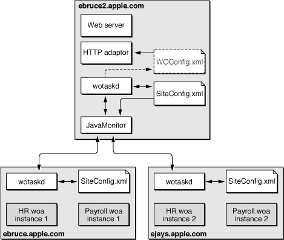
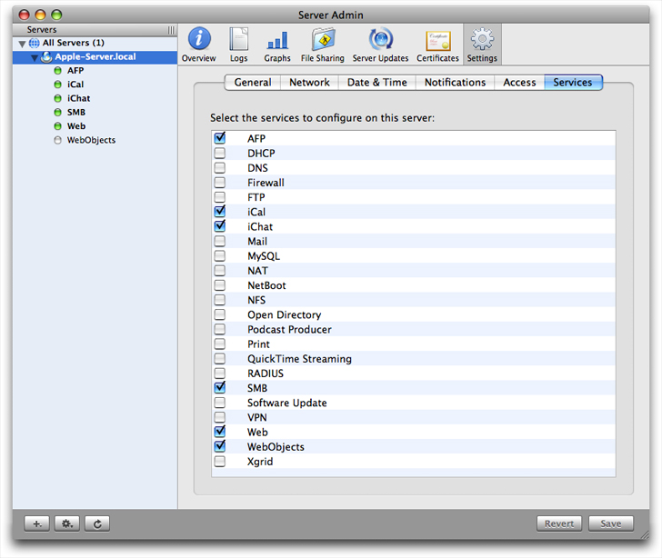
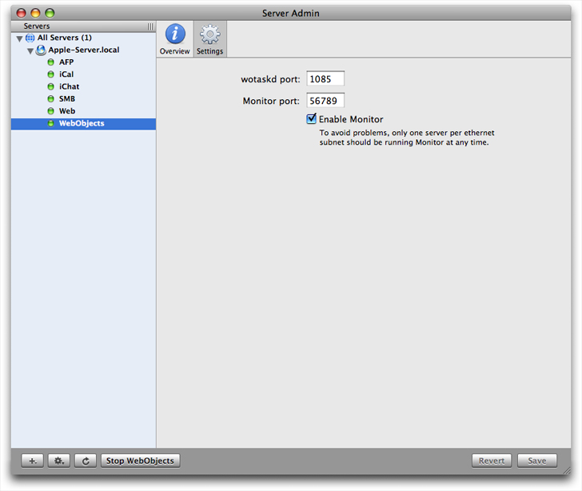
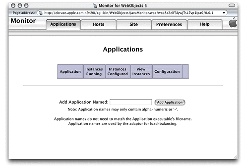

> 导航：[总目录](../../../README.md) · [documentation](../../../_indexes/documentation.md) · [WebObjects Deployment Guide Using JavaMonitor](Introduction%20to%20WebObjects%20Deployment%20Guide%20Using%20JavaMonitor.md)


[Next](Deployment%20Tasks.md)[Previous](HTTP%20Adaptors.md)

# Managing Application Instances

This chapter provides a detailed description of JavaMonitor and wotaskd, two tools you use to manage the application instances running on your site, and it explains how instances communicate with wotaskd:

- [Configuration Files](#apple-f4xwc4dqnrsv64tfmyxwi33df52wszbpkridgmbqgaydanrtfvbegskjivcekrq) provides an overview of the configuration files that can be used in your site.
- [Lifebeats](#apple-f4xwc4dqnrsv64tfmyxwi33df52wszbpkridgmbqgaydanrtfvkfawcsivddcmbv) introduces lifebeats, the mechanism used by wotaskd processes to determine the status of the application instances that they manage.
- [wotaskd Processes](#apple-f4xwc4dqnrsv64tfmyxwi33df52wszbpkridgmbqgaydanrtfvbegskejffeusq) explains how wotaskd processes ensure that the application instances they manage are always running. It also describes how to restrict access to wotaskd using JavaMonitor.
- [Security Issues with wotaskd](#apple-f4xwc4dqnrsv64tfmyxwi33df52wszbpkridgmbqgaydanrtfvjvomi) lists the security risks when using wotaskd and JavaMonitor.
- [Starting WebObjects Services](#apple-f4xwc4dqnrsv64tfmyxwi33df52wszbpkridgmbqgaydanrtfvbegskhirdukrq) shows you how to configure a computer to start wotaskd and JavaMonitor during its startup process.

You use JavaMonitor to configure your site. With it you configure hosts, applications, and application instances. You also define schedules for restarting instances and choose the algorithm used to balance the user load among the instances of an application. For details on the tasks that you can perform using JavaMonitor, see [Deployment Tasks](Deployment%20Tasks.md#apple-f4xwc4dqnrsv64tfmyxwi33df52wszbpkridgmbqgaydanrufvkfawcsivddcmbr).

The `SiteConfig.xml` file, which is maintained on each host’s deployment-configuration directory by wotaskd, stores the configuration choices you make in JavaMonitor. You should not modify the contents of this file directly. The user under which wotaskd runs must have read and write privileges to `SiteConfig.xml` and the user under which JavaMonitor runs must have read privileges.

You can create another configuration file (the HTTP adaptor configuration file), which is called `WOConfig.xml` by default. This is the file the HTTP adaptor uses to obtain your site’s configuration when you choose the configuration file method for the adaptor.

Figure 4-1 shows how the configuration files are distributed in a deployment with one web server and two application hosts. For information on how to generate the HTTP adaptor configuration file, see [Creating the HTTP Adaptor Configuration File](HTTP%20Adaptors.md#apple-f4xwc4dqnrsv64tfmyxwi33df52wszbpkridgmbqgaydanrsfvbeeq2hijduuqi).

__Figure 4-1__  WebObjects configuration-file distribution



JavaMonitor reads the `SiteConfig.xml` file when it starts up but never writes to it. wotaskd writes the `SiteConfig.xml` file when instructed by JavaMonitor to do so—such as when existing entities are configured, added, or deleted. Furthermore, JavaMonitor tells wotaskd to update the `SiteConfig.xml` file only when you use it to change an aspect of your site’s configuration.

After adding an application to your site, you need to add instances of it as well. This allows the application’s users connect to it. One of the main goals of WebObjects Deployment is to provide you with tools that help you deploy a resilient site. To accomplish that, wotaskd restarts application instances that become unresponsive.

A _lifebeat_ is a status message that an application instance sends to a wotaskd process to keep it informed of the instance’s status. There are four kinds of lifebeats:

- has started
- is alive
- will stop
- will crash

An application instance is configured by default to send lifebeats to a wotaskd process through TCP (Transmission Control Protocol) sockets. (A _socket_ is a mechanism through which two processes communicate.) Instances can also send lifebeats using UDP (User Datagram Protocol) sockets. UDP sockets use fewer resources than TCP sockets.

The lifebeat mechanism is how the state of your site is constantly updated. Lifebeats are sent from a separate execution thread in a WebObjects application and do not interfere with, nor are they affected by, normal request processing.

By default, application instances try to send a lifebeat every 30 seconds. If a failure occurs (there is no wotaskd process listening on the port indicated by `WOLifebeatDesinationPort`), the instance does the following:

1. Sends up to 10 TCP lifebeats until a response is received. After the tenth unanswered lifebeat, the instance goes to stage 2.
2. Sends UDP lifebeats (low-resource–lifebeat mode) until a response is received. If the instance cannot create a UDP socket, it goes back to stage 1. When the instance receives an acknowledgement, it resumes sending TCP lifebeats.

The two-stage mechanism allows application instances to go into low-resource lifebeat mode if wotaskd isn’t running when the instance starts.

WebObjects Deployment uses wotaskd to manage the application instances running on your application hosts. Its main task is to start up instances when hosts are restarted. To accomplish this, wotaskd itself has to be restarted when the host starts up. This is done by configuring wotaskd as a service started when the computer boots. By default, a wotaskd process running on port `1085` is configured as a service on all supported platforms. The implementation of this feature is platform-specific. See [Starting WebObjects Services](#apple-f4xwc4dqnrsv64tfmyxwi33df52wszbpkridgmbqgaydanrtfvbegskhirdukrq) for details.

You need to run a wotaskd process on every computer that you want to use as an application host. These processes constantly receive lifebeats from the application instances they manage. Lifebeats communicate the instance’s state and allow wostaskd to determine the state of the instances it oversees. A wotaskd process assumes that an application instance is dead if it does not receive a lifebeat within a certain period. For details, see `WOAssumeApplicationIsDeadMultiplier` in _[WebObjects Application Properties Reference](../WebObjects%20Application%20Properties%20Reference/Introduction%20to%20WebObjects%20Application%20Properties%20Reference.md#apple-f4xwc4dqnrsv64tfmyxwi33df52wszbpkridgmbqgaytamrq)_.

When you restrict access to JavaMonitor with a password, wotaskd processes running on hosts configured in JavaMonitor are also protected: They do not respond to `http://<hostname>:<wotaskd-port>`.

To access the state information of a particular wotaskd process, you use JavaMonitor’s Host page. See [Viewing a Host’s Configuration](Deployment%20Tasks.md#apple-f4xwc4dqnrsv64tfmyxwi33df52wszbpkridgmbqgaydanrufvbegskfirfegry) for more information.

It is very important to secure your website using a firewall to avoid security problems. Using wotaskd and JavaMonitor with Apache but without a firewall has the following security risks:

- Passwords are sent in clear text.
- There is no authentication mechanism between wotaskd and JavaMonitor.
- The sockets used by wotaskd are not secure.

You use JavaMonitor and wotaskd to build and troubleshoot your site. WebObjects provides ways that allow you to control some of the behavior of JavaMonitor and wotaskd. Specifically, you can determine whether they are started automatically when a computer starts up. That way, you have one less item to worry about if a computer goes down. On the other hand, if you prefer a more hands-on approach to site management, you can start and stop WebObjects services manually.

To set wotaskd and JavaMonitor to start automatically upon boot, you need to first add the WebObjects module to the Server Admin application. (On Mac OS X Server v10.4 the WebObjects module is already included.) To add the WebObjects module, choose General Settings > Services to display the list of services as shown in Figure 4-2.

__Figure 4-2__  General Settings pane



Select the WebObjects module and save your changes to display the WebObjects pane shown in Figure 4-3. Next, select WebObjects in the outline view and select the Enable Monitor option to start JavaMonitor on boot.

__Figure 4-3__  WebObjects pane



You can also set wotaskd and JavaMonitor to start automatically from your command shell editor. To start wotaskd, open `/System/Library/LaunchDaemons/com.apple.wotaskd.plist` and set the `Disabled` key value to `false`. To start JavaMontior, open `/System/Library/LaunchDaemons/com.apple.womonitor.plist` and set the `Disabled` key value to `false`.

After setting these values, you need to either restart your server or use the `launchctl` application to load these property lists. For more information on `launchctl`, type `man launchctl` in your command shell editor.

Follow these steps to load the property lists manually:

1. Run launchctl as root.
2. Use the `list` command to verify that `com.webobjects.womonitor.plist` and `com.webobjects.wotaskd.plist` are listed.
3. If these files exist, load them manually using these commands:

   `load /System/Library/LaunchDaemons/com.apple.wotaskd.plist`

   `load /System/Library/LaunchDaemons/com.apple.womonitor.plist`
4. Start the services with the commands:

   `start com.webobjects.wotaskd`

   `start com.webobjects.womonitor`
5. Quit launchctl by typing `Control-c`.

To start JavaMonitor, enter the following commands in your command shell editor:

```
cd ($NEXT_ROOT)/System/Library/WebObjects/JavaApplications/JavaMonitor.woa
./JavaMonitor
```

You should see output similar to that in Listing 4-1.

__Listing 4-1__  Starting JavaMonitor

```
Reading MacOSClassPath.txt ...
Launching JavaMonitor.woa ...
...
Creating LifebeatThread now with: JavaMonitor 49490 ebruce.apple.com/17.203.33.19 1085 30000
Opening application's URL in browser:
http://ebruce.apple.com:49490/cgi-bin/WebObjects/JavaMonitor
Waiting for requests...
```

A page like the one in Figure 4-4 should display in your web browser. If your browser is not launched automatically, you can copy the URL from your shell and paste it into your browser’s address field.

__Figure 4-4__  JavaMonitor—empty Applications page



[Next](Deployment%20Tasks.md)[Previous](HTTP%20Adaptors.md)

