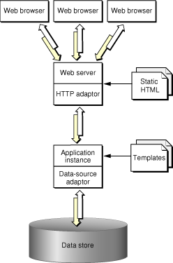
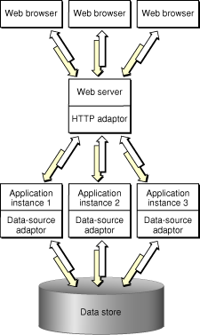
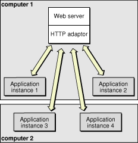
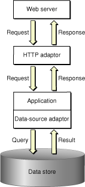
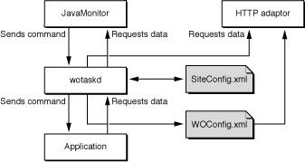
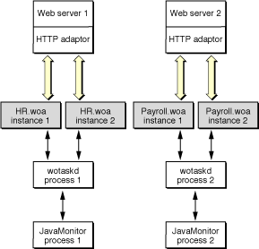
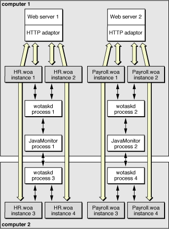

> 导航：[总目录](../../../README.md) · [documentation](../../../_indexes/documentation.md) · [WebObjects Deployment Guide Using JavaMonitor](Introduction%20to%20WebObjects%20Deployment%20Guide%20Using%20JavaMonitor.md)


[Next](Installing%20Software.md)[Previous](Introduction%20to%20WebObjects%20Deployment%20Guide%20Using%20JavaMonitor.md)

# WebObjects Deployment

This chapter introduces the essential concepts and tools you use when you deploy WebObjects applications.

The chapter contains the following sections:

- [The WebObjects Deployment Model](#apple-f4xwc4dqnrsv64tfmyxwi33df52wszbpkridgmbqgaydanrqfvbecssiizbeiry) introduces you to the WebObjects way of deploying applications. It explains how the users of your applications send requests to application instances running on your site and how responses (webpages) are generated and sent back to users.
- [The WebObjects Deployment Environment](#apple-f4xwc4dqnrsv64tfmyxwi33df52wszbpkridgmbqgaydanrqfvbecsscivcesry) describes the functions of several elements (both in your platform and in WebObjects Deployment) in a site.
- [Keeping Your Site Secure](#apple-f4xwc4dqnrsv64tfmyxwi33df52wszbpkridgmbqgaydanrqfvbecssiivcucra) lists the security-minded features available in WebObjects Deployment.

A WebObjects deployment has six major parts:

- __Client__: A user’s web browser or the client side of a Java Client application.
- __Web server__: Application that receives HTTP requests from clients and sends responses back to them.
- __HTTP adaptor__: Application that serves as the interface between your web server and your application instances. The HTTP adaptor routes requests from the web server to the appropriate instance and sends the responses generated back to the web server. The adaptor does this while performing _load balancing_ to distribute an application’s users among its active instances. Load balancing helps to spread the user load of your site evenly across your application hosts.
- __Application instances__: Individual processes that receive requests from the HTTP adaptor and send responses back to it. To create a response, an instance can perform calculations, or save or retrieve data from a data store.
- __Data-store adaptor__: Interface between an application instance and a data store. WebObjects includes a _JDBC_ adaptor, allowing your applications to connect to any JDBC-compliant data store. Also included is a JNDI (Java Naming and Directory Interface) adaptor, which allows applications to communicate with an LDAP (Lightweight Directory Access Protocol) server.

  For JDBC connectivity, your database needs a JDBC driver, which you obtain from your database vendor. WebObjects applications can connect to databases that use Type 2 (partly Java) or Type 4 (all Java) JDBC drivers. The JDBC adaptor included with WebObjects Deployment has been certified to work adequately with Type 4 drivers. Type 2 drivers may require special configuration for them to work properly with the adaptor. If your database provides a Type 2 driver, consult with your database vendor to determine how it needs to be configured to work properly with a JDBC adaptor.
- __Data store__: The mechanism that your applications use to store persistent data. Consult with your database vendor or directory service vendor to obtain configuration and optimization details.

When an application user sends a request through a web browser to your web server, the server forwards the request to the HTTP adaptor. The adaptor then determines which application instance should process the request and forwards the request to it. When the application instance receives the request, it performs the necessary processing to produce a response (a new webpage). The instance then sends the response page to the adaptor, which forwards it to the web server. The web server then forwards the response page to the user’s web browser. This process is illustrated in Figure 1-1.

__Figure 1-1__  WebObjects deployment model



Notice that both the application instance and the web server contribute to the response page’s content. The instance uses templates and logic to generate the HTML code for dynamic pages, while the web server provides the content of images contained in those pages. The server can also dispense static pages.

The number of instances of your application necessary to support its users depends on the number of users that connect to your application concurrently. In some cases a single instance is adequate. When one instance is not able to process requests in a timely manner, additional instances can solve the problem. This way, the amount of user-state information that a single instance stores is reduced. In addition, with less state to keep track of, an instance can process requests faster. Figure 1-2 shows a site with one host running multiple instances of an application.

__Figure 1-2__  WebObjects deployment model—multiple instances of an application



However, adding instances of your application to a host may not be the most effective solution. Eventually, a point of diminishing returns will be reached, where adding instances actually decreases your application’s performance. In such a case, you should consider adding additional application hosts that run the extra instances required to handle the increased traffic to your site. Figure 1-3 shows how a site with two computers, one acting as an web server and application host, and the other just as an application host would look.

__Figure 1-3__  Deployment using two computers



Before deploying applications, you need to master two important aspects of WebObjects Deployment: the communication paths of client requests and server activity, and the deployment tools you use to configure your site.

Communication among the elements that make up a deployment occurs in two paths: the data path and the control path.

A client HTTP request takes the data path after it reaches your web server. Figure 1-4 shows how an HTTP request that your web server receives is passed to the elements that generate the response.

__Figure 1-4__   The data path of a WebObjects deployment



JavaMonitor requests take the control path to propagate configuration changes to application hosts and, ultimately, application instances. These include adding application instances and starting and stopping instances according to a schedule that you define. The HTTP adaptor can obtain site information by polling wotaskd (WebObjects task daemon) processes or by reading the adaptor configuration file. (See [Deployment Tools](#apple-f4xwc4dqnrsv64tfmyxwi33df52wszbpkridgmbqgaydanrqfvkfawcsivddcmbt) for information about JavaMonitor and wotaskd.) Figure 1-5 shows the control path.

__Figure 1-5__   The control path of a WebObjects deployment



Figure 1-6 shows how the data path and control path are differentiated in the rest of the document.

__Figure 1-6__  The symbols used to represent the data path and the control path


The main tools you use to manage your site are wotaskd and JavaMonitor. Normally, one wotaskd process runs on each application host. If you want to concurrently deploy multiple sites on the same hardware, you can configure a computer to run more than one wotaskd process. This essentially provides you with several independent application hosts per computer.

You manage a group of application hosts using JavaMonitor, a tool that uses your web browser as its user interface. JavaMonitor lets you set, among other things, instance scheduling and the load-balancing scheme to be used for each application. Because each JavaMonitor process maintains state information locally, you must run only one instance of JavaMonitor per site. Figure 1-7 shows two application sites on one computer.

__Figure 1-7__  Two sites deployed on one computer



Figure 1-8 shows how you can distribute application instances among two computers.

__Figure 1-8__  Two sites deployed on two computers



After you configure your site using JavaMonitor, it enforces that configuration by performing tasks such as stopping and restarting application instances according to a schedule you set and sending email notifications when problems arise. The HTTP adaptor performs load balancing across the instances of each application on your site.

For detailed information on the subjects introduced above, see the following chapters or sections:

- [HTTP Adaptors](HTTP%20Adaptors.md#apple-f4xwc4dqnrsv64tfmyxwi33df52wszbpkridgmbqgaydanrsfvkfawcsivddcmbr) shows you the different ways in which you can configure the WebObjects HTTP adaptor.
- [Deployment Tasks](Deployment%20Tasks.md#apple-f4xwc4dqnrsv64tfmyxwi33df52wszbpkridgmbqgaydanrufvkfawcsivddcmbr) describes how you use JavaMonitor to configure your site.
- [Setting Up Hosts](Deployment%20Tasks.md#apple-f4xwc4dqnrsv64tfmyxwi33df52wszbpkridgmbqgaydanrufvkfawcsivddcmjq) describes how you use JavaMonitor to add application hosts to your site.
- [Configuration Files](Managing%20Application%20Instances.md#apple-f4xwc4dqnrsv64tfmyxwi33df52wszbpkridgmbqgaydanrtfvbegskjivcekrq) shows you how the configuration you define in JavaMonitor is distributed among the application hosts of your site.
- [wotaskd Processes](Managing%20Application%20Instances.md#apple-f4xwc4dqnrsv64tfmyxwi33df52wszbpkridgmbqgaydanrtfvbegskejffeusq) explains how wotaskd processes communicate with and manage application instances.
- [Lifebeats](Managing%20Application%20Instances.md#apple-f4xwc4dqnrsv64tfmyxwi33df52wszbpkridgmbqgaydanrtfvkfawcsivddcmbv) explains how application instances communicate with a wotaskd process.
- [Deploying Multiple Sites](Deployment%20Tasks.md#apple-f4xwc4dqnrsv64tfmyxwi33df52wszbpkridgmbqgaydanrufvbegskgjbbueqq) explains how to configure your platform to deploy multiple sites concurrently.
- [Load Balancing](Deployment%20Tasks.md#apple-f4xwc4dqnrsv64tfmyxwi33df52wszbpkridgmbqgaydanrufvbegskjjfbekqq) describes how load balancing works and lists the algorithms that the HTTP adaptor can use to implement it.

In a WebObjects deployment, you have several features at your disposal to enhance the security of your site:

- __split-installation of applications (application files and web server resources)__: By installing application-related files in two locations, you can put sensitive information (such as business logic) into protected locations. Nonsensitive resources (such as image files) can be installed on the Web server’s `Document Root` directory. For more information, see [Installing Applications](Deployment%20Tasks.md#apple-f4xwc4dqnrsv64tfmyxwi33df52wszbpkridgmbqgaydanrufvbegskejfeuira).
- __restricted access to deployment tools__: [JavaMonitor Password](Deployment%20Tasks.md#apple-f4xwc4dqnrsv64tfmyxwi33df52wszbpkridgmbqgaydanrufvbeeq2cjbbuuqy) explains how you can password-protect access to JavaMonitor and wotaskd through a single page.
- __restricted access to development application instances__: If your computing environment supports both the development and deployment of applications through the same Web server, access to development instances is restricted by the HTTP adaptor. See [Viewing a Host’s Configuration](Deployment%20Tasks.md#apple-f4xwc4dqnrsv64tfmyxwi33df52wszbpkridgmbqgaydanrufvbegskfirfegry) for details.
- __ability to disallow direct connections (through host name and port number) to an application instance__: With direct connect you can connect to an instance with the following URL:

```
http://myhost:1234
```

  When you disallow direct connect for an instance, the only way to connect to it is through an Web server. For more information, see `WODirectConnectEnabled` in _[WebObjects Application Properties Reference](../WebObjects%20Application%20Properties%20Reference/Introduction%20to%20WebObjects%20Application%20Properties%20Reference.md#apple-f4xwc4dqnrsv64tfmyxwi33df52wszbpkridgmbqgaytamrq)_.
- __restricted access to application-instance statistics__: Agents external to your organization can use the statistics that your application instances produce to get privileged information. To avoid this, access to the instance statistics page is restricted. See [Setting a Password for the Instance Statistics Page](Deployment%20Tasks.md#apple-f4xwc4dqnrsv64tfmyxwi33df52wszbpkridgmbqgaydanrufvbegskhjfdukrq) for details.
- __restricted access to HTTP adaptor information (the WebObjects Adaptor Information page) by default__: This closes another potential hacker entry point. For details, see [Setting Access to the WebObjects Adaptor Information Page](HTTP%20Adaptors.md#apple-f4xwc4dqnrsv64tfmyxwi33df52wszbpkridgmbqgaydanrsfvbeeq2civdesqy).
- __restricted access to the wotaskd port__: wotaskd uses Port 1085. The access to this port (both UPD and TCP) must be protected through a firewall in order to have a secure environment. See also [Security Issues with wotaskd](Managing%20Application%20Instances.md#apple-f4xwc4dqnrsv64tfmyxwi33df52wszbpkridgmbqgaydanrtfvjvomi)

[Next](Installing%20Software.md)[Previous](Introduction%20to%20WebObjects%20Deployment%20Guide%20Using%20JavaMonitor.md)

