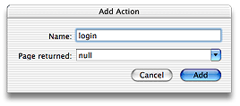
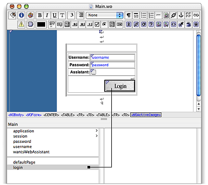

> 导航：[总目录](../../../README.md) · [documentation](../../../_indexes/documentation.md) · [WebObjects Direct to Web Guide](Introduction%20to%20WebObjects%20Direct%20to%20Web%20Guide.md)


[Next](EditStatePopup%20Listings.md)[Previous](Direct%20to%20Web%20Architecture.md)

# Customizing a Direct to Web Application

This chapter shows some of the ways you can customize the behavior of a Direct to Web application. Specifically, this chapter discusses how to

- add a logo to your Direct to Web pages
- use Direct to Web in other WebObjects applications
- modify the Direct to Web factory
- create a custom property-level component
- modify a Direct to Web task
- add a task to Direct to Web
- add methods to the Direct to Web rule engine

The Neutral look is well-suited for adding a logo because it doesn’t already display the Apple or WebObjects logos, unlike the Basic and WebObjects looks. To add a company logo to your Direct to Web pages, you need to add the HTML code that displays the logo to two components: `Main.wo`, which implements the login page, and `PageWrapper.wo`, which provides the backdrop for all of the pages Direct to Web generates. In this example, the Apple logo is added to `PageWrapper.wo`.

1. Edit `PageWrapper.html`. Line five reads:

```
<TABLE BORDER=0 CELLPADDING=4 CELLSPACING=0WIDTH=”99%”>
```

   After this line add

```
<TR>
    <TD><WEBOBJECTNAME=Image1></WEBOBJECT></TD>
    <TD COLSPAN=3></TD>
</TR>
```
2. Edit `PageWrapper.wod` to specify the bindings for the WOImage. Add the following lines:

```
Image1:WOImage {
    filename = “Apple-fade.gif”;
    framework = “JavaDirectToWeb”;
}
```

Now all of the pages Direct to Web generates appear with the Apple logo. If you want to use a custom image already added to your WebObjects project, `filename` would be the image name, and `framework` would most likely be `“app”`.

WebObjects applications that were not generated using the Direct to Web option in the wizard can use the Direct to Web framework to display query, list, edit, and other pages in the Direct to Web repertoire. Making use of Direct to Web can be a convenient shortcut for many applications when all they need is a standard database-related page. They can use Direct to Web in one of two ways:

- by embedding Direct to Web components in the pages of their application
- by linking to a dynamically created Direct to Web page and appropriately implementing the action method invoked when the link is clicked

Using a Direct To Web component is not much different than using any other reusable component. In this section you create a D2WQuery that searches for Listing entities based on the address. The procedure is the following:

1. Add the Direct to Web and the Direct to Web Generation frameworks to your project. The path for these frameworks is `/System/Library/Frameworks` and the file names are `JavaDirectToWeb.framework`, `JavaDTWGeneration.framework`, and `JavaEOProject.framework`.
2. Decide which Direct to Web component you want to use and become familiar with its API.

   See the “D2W” class reference in the WebObjects API Reference for summaries of these components.
3. Put a WebObjects tag for the component in the page that is to display it.

```
<WEBOBJECT NAME=MyD2WQuery></WEBOBJECT>
```

   This is a step you can complete in WebObjects Builder. The reusable components are available from the “DirectToWeb” palette.
4. Make the appropriate bindings for the component.

```
MyD2WQuery:D2WQuery {
    entityName="Listing";
    displayKeys="(address.city,address.state, address.zip)";
    queryDataSource=listingDisplayGroup.dataSource;
}
```

   All embedded components require an `entityName` binding to specify the entity the page works with. Extra bindings could be required, depending on the functionality of the page. For example, List pages require a `dataSource` binding. If you want to use a named configuration, specify it with a `pageConfiguration` binding. See [Named Configurations](An%20Introduction%20to%20Direct%20To%20Web.md#apple-f4xwc4dqnrsv64tfmyxwi33df52wszbpkridgmbqgaytamjvfvcg63tujruw422dnbqxa5dfojeuixzvfvbecqsdjjcegqy) for more information about named configurations.

   You can also complete this step in WebObjects Builder.
5. If necessary, implement the action method for the component.
6. You can customize embedded Direct to Web components using the Web Assistant. You can launch the Web Assistant using the `appletviewer` tool.

   When the Web Assistant acts upon an application that was not generated using Direct to Web, it does not automatically track which page is displayed. Thus you must set the task and entity for the page you want to modify in Expert mode. For example, if you want to customize a list page for Customers, click Expert mode and select the list task and the Customer entity. You can then customize a component in the same way you customize Direct to Web pages. Also, when you click Update to send the new settings to the application, the browser does not automatically refresh your page. You must either click the Reload button in your browser or (especially when you select a new task or entity) you must renavigate to the page.

By default, your component appears in the Neutral look.

The second way to use Direct to Web in you application is to link directly to a dynamically generated page of the appropriate type. The D2W class defines methods that create components (inspect, query, list, and so on) defined for an entity in a session. The returned component objects implement the appropriate interface:

```
QueryPageInterfacequeryPageForEntityNamed (String entity,
    WOSession session);
ListPageInterface listPageForEntityNamed(String entity,
    WOSession session);
EditPageInterface editPageForEntityNamed(String entity,
    WOSession session);
InspectPageInterface inspectPageForEntityNamed(String entity,
    WOSession session);
SelectPageInterface selectPageForEntityNamed(String entity,
    WOSession session);
EditRelationshipPageInterfaceeditRelationshipPageForEntityNamed
    (String entity, WOSessionsession);
QueryAllPageInterface queryAllPage(WOSession session);
```

To create a named configuration page, you use the method

```
WOComponentpageForConfigurationNamed
    (String namedConfiguration,WOSession session);
```

To link to a Direct to Web page, you need to implement an action method that returns a Direct to Web component implementing the appropriate page interface.

To implement the action methods that link to Direct to Web pages, you must use methods of the D2W class and the page-specific Direct to Web interfaces. You also need to specify a hyperlink, active image, or similar HTML control that invokes the action method. The following example shows such a hyperlink; first, the `WEBOBJECT` tag in the HTML template file:

```
<WEBOBJECTname=D2WListPage>D2W list page</WEBOBJECT>
```

Then, in the `.wod` file, bind the hyperlink to the `d2wList` action method:

```
D2WListPage:WOHyperlink {
    action = d2wList;
}
```

The action method must return a component (that is, a WOComponent object) that implements the interface appropriate to the required type of page. For example, if you want to link to a dynamically generated list page, the component returned must implement the ListPageInterface interface. The D2W class provides methods that create such components:

```
importcom.webobjects.directtoweb.*;
.
.
.
public WOComponent d2wList(){
    ListPageInterface lpi =
        D2W.factory().listPageForEntityNamed("Listing",session());
    lpi.setDataSource(listingDisplayGroup.dataSource());
    lpi.setNextPage(this);
    return (WOComponent)lpi;
}
```

Notice that before you return the component, you must set things such as the data source for the component and the page to go to when users click Return (`setNextPage`). This example assumes that the data you want to display is contained in the EODataSource for a WODisplayGroup called `listingDisplayGroup`.

For some pages, you need to specify the action method that navigates to the next page. Consider a component called MyListPage that displays a list of objects and has a hyperlink that adds objects to the list. To determine which objects to add, the component invokes a Direct to Web query page.

The query page behavior differs from the normal Direct to Web query page behavior in two ways:

- Normally a query page creates a Direct to Web list page when the user clicks the Search DB button. In this example, however, the query page jumps back to the MyListPage component.
- When the query executes, it adds the objects to the list of objects displayed by the MyListPage component, an action the normal query component does not perform.

To implement this custom behavior, you need to define and instantiate a delegate object in addition to creating the query component. The delegate object must implement the NextPageDelegate interface and include a method called `nextPage`, which is invoked when the user clicks the submit button for the query page (Query DB). The query component’s next page delegate must be assigned to this object using the `nextPageDelegate` method.

[Listing 3-1](#apple-f4xwc4dqnrsv64tfmyxwi33df52wszbpkridgmbqgaytamjvfvcg63tujruw422dnbqxa5dfojeuixztfvbecqsciveemqq) shows how this can be done.

__Listing 3-1__  Sample code that sets up a next-page delegate

```
publicclass MyListPage extends WOComponent {

    public WODisplayGroup myDisplayGroup;
...

    public WOComponent showD2WQuery(){
        QueryPageInterface qpi=
            D2W.factory().queryPageForEntityNamed(“Customer”,session());
        qpi.setNextPageDelegate(new NextPageDelegate() {
            // delegate implementation
            public WOComponentnextPage(WOComponent sender) {
                EODataSourceds;
                NSArray objectsToAdd;
                Enumeratione;
                ds =((QueryPageInterface)sender).queryDataSource();
                objectsToAdd= ds.fetchObjects();
                e = objectsToAdd.objectEnumerator();
                while (e.hasMoreElements()){
                    EOEnterpriseObjecteo;
                    eo =(EOEnterpriseObject)e.nextElement();
                    MyListPage.this.myDisplayGroup.
                        insertObjectAtIndex(eo,0);
                }
                return MyListPage.this;
            }
        });
        return (WOComponent)qpi;
    }
}
```

The `showD2WQuery` method first creates a query page component. It then creates a delegate object and sets the query page’s next-page delegate to the newly created object. Finally, the method returns the new query page component, which causes WebObjects to display the query page.

The next-page delegate object contains an action method called `nextPage`, which is invoked when the user clicks Query DB on the query page. This method gets the query data source containing the query specification. Next, the `nextPage` method fetches the objects matching the query specification and adds them to the display group in the MyListPage component. Finally, it returns the MyListPage component, where you have access to the newly fetched objects in the WODisplayGroup. The WODisplayGroup could be hooked up to a WORepetition which then lists all the fetched objects.

Every application that links to a dynamically created Direct to Web page should have a component called `PageWrapper.wo`. This component acts as a “wrapper” for the dynamically generated content and can have customized header and footer material. If your application does not have a page wrapper, Direct to Web displays your pages in an empty page wrapper. [Listing 3-2](#apple-f4xwc4dqnrsv64tfmyxwi33df52wszbpkridgmbqgaytamjvfvcg63tujruw422dnbqxa5dfojeuixztfvbecqsejbdeisq) and [Listing 3-3](#apple-f4xwc4dqnrsv64tfmyxwi33df52wszbpkridgmbqgaytamjvfvcg63tujruw422dnbqxa5dfojeuixztfvbecqsginbuusa) show how a `PageWrapper.wo` component might be set up. You can use a text editor, Project Builder, or WebObjects Builder to construct this component.

__Listing 3-2__  PageWrapper.html example

```
<HTML>
    <WEBOBJECT name=Head></WEBOBJECT>
    <BODY>
        <WEBOBJECT name=BodyContainer>
        <WEBOBJECT name=Body></WEBOBJECT>
        </WEBOBJECT>
    </BODY>
</HTML>
```


__Listing 3-3__  PageWrapper.wod example

```
BodyContainer:WOBody {
    filename = "Background.gif";
    framework = "JavaDirectToWeb";
    bgcolor="#c0c0c0";
    TEXT = "#000000";
    LINK = "#0000F0";
    VLINK = "#0000F0";
    ALINK = "#FF0000";
}

Head : D2WHead {
    _unroll = true;
}

Body: WOComponentContent {
    _unroll = true;
};
```

The only required component in `PageWrapper.wo` is the WOComponentContent. The other components shown in the example are optional, and you can create your own header, footer, and body-container components for your dynamically generated pages.

The `_unroll` attribute, when set to `true`, enables the Web Assistant to generate a static component from the dynamically generated one.

You can override the page-creation methods of the D2W class to customize the components they return. The `defaultPage` method of the D2W class is one you might want to override; this method returns the application’s default page, which is the query-all page by default.

If you make a subclass of D2W to override or add certain methods, make sure you call the `setFactory` class method with an instance of the new class as the argument.

[Listing 3-4](#apple-f4xwc4dqnrsv64tfmyxwi33df52wszbpkridgmbqgaytamjvfvcg63tujruw422dnbqxa5dfojeuixztfvbecqshifauqsa) is an example of how to extend the D2W class.

__Listing 3-4__  Customizing the D2W class

```
importcom.webobjects.foundation.*;
import com.webobjects.eocontrol.*;
import com.webobjects.directtoweb.*;
import com.webobjects.appserver.*;

public class D2WExtendedFactory extends D2W {

    public WOComponent defaultPage(WOSession session) {
        return WOApplication.application().
            pageWithName("MyDefaultPage",session.context());
    }
}
```

Add the following Java code to the application constructor in the `application.java` file:

```
D2W.setFactory(newD2WExtendedFactory());
```


Sometimes you need a custom property-level component that implements specialized behavior or that works with a type of attribute that Direct to Web doesn’t already support (such as a QuickTime movie). Direct to Web provides a property-level component called D2WCustomComponent to make it easier to create such a component. To use the D2WCustomComponent, you first create a custom component. Then you use the Web Assistant to tell Direct to Web to use it.

The custom property-level component must be a reusable component that defines two keys: `object` and `key`. The value for `object` specifies the enterprise object that the reusable component manipulates, for example, a Customer object. The value for `key` specifies the key of the property that the component manipulates, for example, `firstName`.

You can get the property by defining two instance variables in your component:

```
EOEnterpriseObjectobject;
String key;
```

and using the EOKeyValueCoding method `valueForKey`:

```
Stringfirst = object.valueForKey(key);
```

To store a value for the property, you use `takeValueForKey`:

```
object.takeValueForKey(first,key);
```

If you are using a nonsynchronizing component, you need to get the values for the `object` and `key` bindings using the `valueForBinding` method before you get or store the property.

```
EOEnterpriseObjectobject = valueForBinding(“object”);
String key = valueForBinding(“key”);
```

[EditStatePopup Listings](EditStatePopup%20Listings.md#apple-f4xwc4dqnrsv64tfmyxwi33df52wszbpkridgmbqgaytamjvfvcg63tujruw422dnbqxa5dfojeuixzrfvkfawcsivddcmbr) shows an example custom component called EditStatePopup that uses a pop-up list to edit US states. The example lists the `.html`, `.wod`, and `.java` files that specify the custom component.

Once the custom component has been compiled, you can use the Web Assistant to instruct your Direct to Web application to use it. Follow these steps to configure your application to use the pop-up list state editing component for the `state` attribute on the ListingAddress edit page:

1. Open the Web Assistant. See [Customizing Your Application With the WebAssistant](An%20Introduction%20to%20Direct%20To%20Web.md#apple-f4xwc4dqnrsv64tfmyxwi33df52wszbpkridgmbqgaytamjvfvcg63tujruw422dnbqxa5dfojeuixzvfvbegskii5feesq).
2. Click the “Expert mode” button.

   In Expert mode, you can make changes that affect all pages for a given task.
3. Select the Properties tab.
4. Select the `edit` task and the ListingAddress entity.
5. Click `state` in the Show column.
6. In the right column, choose D2WCustomComponent from the pop-up list.
7. Enter the name `EditStatePopup` in the Component text box.

You can also use the Web Assistant to configure your application to use a custom component on every edit page by following these steps:

1. Select the `edit` task and “\*all\*” for the entity.
2. Select the data type your component handles in the type browser in the second column.
3. In the right column, choose D2WCustomComponent from the pop-up list.
4. Enter the name `of` your component in the Component text box.

You can also configure your application to use the custom component by setting rules with the rule editor instead of using Web Assistant. To do so, use the rules shown in [Listing 3-5](#apple-f4xwc4dqnrsv64tfmyxwi33df52wszbpkridgmbqgaytamjvfvcg63tujruw422dnbqxa5dfojeuixztfvbecqsfjfcuosi). (To open the `user.d2wmodel` in the Resources group of Project Builder’s main window, drag its icon in Project Builder onto the RuleEditor icon in the Dock.)

__Listing 3-5__  Setting Rules With Rule Editor

```
((task= “edit”) and (entity.name = “ListingAddress”)
    and (propertyKey = “state”)
    => componentName = “D2WCustomComponent”

((task = “edit”) and (entity.name= “ListingAddress”)
    and (propertyKey = “state”)
    => customComponentName= “EditDatePopup”
```

You also need to set the assignment class (Assignment) and the priority (100) for each rule. For more information about using the rule editor, see [Adding Rules to Define the Default Behavior](#apple-f4xwc4dqnrsv64tfmyxwi33df52wszbpkridgmbqgaytamjvfvcg63tujruw422dnbqxa5dfojeuixztfvbegskdircuisa).

To change the appearance and function of all the pages Direct to Web generates for a particular task, you need to modify its template. You can use the Web Assistant to generate the template and WebObjects Builder to edit it.

To illustrate how to modify a template, this example shows how to add a hyperlink to the NEUListPage Direct to Web template. The hyperlink simply redraws the page for now, but in [Adding a New Direct to Web Task to Your Application](#apple-f4xwc4dqnrsv64tfmyxwi33df52wszbpkridgmbqgaytamjvfvcg63tujruw422dnbqxa5dfojeuixztfvbegskjjjdussq) it will be modified to navigate to a new task page. For this example, it is easiest to start by creating a new project.

1. Create a Direct to Web application using the Real Estate database. For the look, use the Neutral look. See [Creating a Direct to Web Project](An%20Introduction%20to%20Direct%20To%20Web.md#apple-f4xwc4dqnrsv64tfmyxwi33df52wszbpkridgmbqgaytamjvfvcg63tujruw422dnbqxa5dfojeuixzvfvbecqskjfbesqy).
2. Launch your application and run the Web Assistant. See [Using Your Direct to Web Application](An%20Introduction%20to%20Direct%20To%20Web.md#apple-f4xwc4dqnrsv64tfmyxwi33df52wszbpkridgmbqgaytamjvfvcg63tujruw422dnbqxa5dfojeuixzvfvbegskhjbaugsq) and [Customizing Your Application With the WebAssistant](An%20Introduction%20to%20Direct%20To%20Web.md#apple-f4xwc4dqnrsv64tfmyxwi33df52wszbpkridgmbqgaytamjvfvcg63tujruw422dnbqxa5dfojeuixzvfvbegskii5feesq).
3. Generate a Direct to Web template for the list task called “NEUListPage2” using the Web Assistant. [Generating a Template](An%20Introduction%20to%20Direct%20To%20Web.md#apple-f4xwc4dqnrsv64tfmyxwi33df52wszbpkridgmbqgaytamjvfvcg63tujruw422dnbqxa5dfojeuixzvfvbecqshjfbecqy).
4. From Project Builder, double-click `NEUListPage2.wo` in the project’s Web Components group. This opens the Direct to Web template in WebObjects Builder.

   Add a hyperlink after the first instance of the metallic Return button. This instance is displayed when the list is not empty.

   Add a WOImage inside the hyperlink.

   Bind the following attributes to the WOImage:

| Attribute | Value |
| --- | --- |
| `filename` | “EditMetalBtn.gif” |
| `framework` | “JavaDirectToWeb” |
| `border` | “0” |

   Add an action called `editList` that returns `null`.

   Bind the action to the Edit List hyperlink’s `action` attribute.
5. Save your template.
6. Build and launch your application. Navigate to a list page. It should now appear with an Edit button.

   Since the `editList` action returns `null`, the hyperlink just redraws the page. In [Adding a New Direct to Web Task to Your Application](#apple-f4xwc4dqnrsv64tfmyxwi33df52wszbpkridgmbqgaytamjvfvcg63tujruw422dnbqxa5dfojeuixztfvbegskjjjdussq), you will modify the action to create a new task page.

You can freeze a page based on your Direct to Web template using the Web Assistant. See [Generating Components](An%20Introduction%20to%20Direct%20To%20Web.md#apple-f4xwc4dqnrsv64tfmyxwi33df52wszbpkridgmbqgaytamjvfvcg63tujruw422dnbqxa5dfojeuixzvfvbegskkjfeuiri) for more details. Make sure that your template is selected in the template pop-up list in the third column of the Web Assistant.

In the example above, the `editList` action is missing from any component created by freezing the NEUListPage2 template.

Sometimes you add components to your Direct to Web template that have child components. For example, tables, WOConditionals, WORepetitions, and any reusable components with a WOComponentContent dynamic element all have child components. If you add such components to your Direct to Web template, add an attribute called `_unroll` and bind it to `YES`. This attribute enables Direct to Web to include the component’s children when you freeze the template.

A Direct to Web application can be expanded to handle new tasks. This section describes how to add an example task called edit-list. The edit-list task page looks like a regular list page but renders the data in text fields so the user can edit the data. To create a task and use it in a Direct to Web application you need to

- create the Direct to Web template that executes the task
- add rules to configure the default behavior of the page and make it available to the Web Assistant
- add a hyperlink to an existing Direct to Web template that links to the new task page

Once you have added the task, you can use it with any entity and configure it with the Web Assistant.

The easiest way to create a Direct to Web template is to modify one that the Web Assistant generates. The edit-list page most closely resembles the list page.

1. For this example, begin with the project you created in the last section, [Modifying a Direct to Web Template](#apple-f4xwc4dqnrsv64tfmyxwi33df52wszbpkridgmbqgaytamjvfvcg63tujruw422dnbqxa5dfojeuixztfvbegskcineusri). You should have a modified NEUListPage2 Direct to Web template in your project.
2. Create a Direct to Web template called “NEUEditListPage” based on the NEUListPage by following steps 2–4 in [Modifying a Direct to Web Template](#apple-f4xwc4dqnrsv64tfmyxwi33df52wszbpkridgmbqgaytamjvfvcg63tujruw422dnbqxa5dfojeuixztfvbegskcineusri).
3. Open `NEUEditListPage.wo` in WebObjects Builder. Follow the directions below to modify the template.
4. Remove the first and last columns of the main table. The left column contains an icon that opens the edit page. The right column contains an icon that deletes the record. Since the list page provides these functions, they are not duplicated on the edit-list page.
5. Now wrap the main table inside a WOForm. The easiest way to do this is to use the source view. Find the line

```
<WEBOBJECTNAME=NavBar></WEBOBJECT>
```

   Change it to

```
<WEBOBJECT NAME=NavBar></WEBOBJECT><WEBOBJECTNAME=Form1>
```

   Find the first `</CENTER>` tag in the file. Add a closing `</WEBOBJECT>` above this line.
6. In the next three steps, you change the Return hyperlink into a submit button and add a Save submit button that saves the changes to the database. Find the line

```
<WEBOBJECT NAME=ShowCancel><WEBOBJECTNAME=BackLink><WEBOBJECT
NAME=ReturnButton></WEBOBJECT></WEBOBJECT></WEBOBJECT>
```

   Add

```
<WEBOBJECTNAME=SubmitChanges></WEBOBJECT>
```

   between the last two `</WEBOBJECT>` tags. The line should now look like this:

```
<WEBOBJECTNAME=ShowCancel><WEBOBJECT NAME=BackLink><WEBOBJECT
NAME=ReturnButton></WEBOBJECT></WEBOBJECT><WEBOBJECTNAME=SubmitChanges>
</WEBOBJECT></WEBOBJECT>
```
7. In the bindings file, find the bindings for the ReturnButton WebObjects element. Change it so it reads as follows:

```
ReturnButton:WOImage {
    alt = "Cancels changes";
    border = "0";
    filename = "CancelMetalBtn.gif";
    framework = "JavaDirectToWeb";
    name = "Cancels changes";
}
```
8. Add the following bindings to the bindings file:

```
Form1:WOForm {
    action = backAction;
}

SubmitChanges: WOImageButton{
    action = saveChanges;
    alt = "Saves your changes";
    border = "0";
    filename = "SaveMetalBtn.gif";
    framework = "JavaDirectToWeb";
    name = "Saves yourchanges";
}
```

   The `backAction` method is defined by the NEUEditListPage component’s superclass, D2WListPage.
9. Switch back to the layout view to check for HTML syntax errors.
10. Save the `NEUEditListPage.wo` file.
11. Modify `NEUEditListPage.java` by adding the saveChanges method defined in [Listing 3-6](#apple-f4xwc4dqnrsv64tfmyxwi33df52wszbpkridgmbqgaytamjvfvcg63tujruw422dnbqxa5dfojeuixztfvbecqsiireessa).

    __Listing 3-6__  Implementation of the saveChanges method in NEUEditListPage.java

```
publicWOComponent saveChanges() {
    WOComponent nextPage = this.nextPage();
    try {
        session().defaultEditingContext().saveChanges();
    } catch (Exception exception){
        ErrorPageInterface epi= (ErrorPageInterface)
            D2W.factory().errorPage(session());
        epi.setMessage(exception.toString());
        epi.setNextPage(this);
        nextPage = (WOComponent)epi;
    } finally {
        return nextPage;
    }
}
```

This Java code tries to save changes to the session’s editing context. If it fails, it returns an error page. Otherwise, it returns to the page that called it.

When a Direct to Web application launches, it looks for rules in two files in your project, `user.d2wmodel` and `d2w.d2wmodel`, and merges them with the rules defined in the Direct to Web framework. The Web Assistant modifies the rules in the `user.d2wmodel` file. For basic customization tasks you don’t need to edit this file by hand. When you add rules that change the default behavior of your application, you modify the `d2w.d2wmodel` file.

Defining the default behavior of a new task page also informs the Web Assistant of the new task. Specifically, the Web Assistant collects a list of tasks based on the `task =`_“taskName”_ clauses on the left-hand side of rules.

Direct to Web provides an application called RuleEditor to edit the rules.

For the edit-list page example, you need to

- revise the Web Assistant rules in the `user.d2wmodel` file

  The Web Assistant created two rules when you generated the NEUEditListPage Direct to Web template. These rules state that the NEUEditListPage can and should be used with the list task. Since you are creating an edit-list task, which exclusively uses the NEUEditListPage Direct to Web template, these rules must be changed.
- create a `d2w.d2wmodel file` and put rules that define the edit-list page default behavior in it

1. Quit the Web Assistant if it is still running. You will modify the `user.d2wmodel` file using RuleEditor instead of the Web Assistant because the Web Assistant can’t perform the change.
2. Open the `user.d2wmodel` in the Resources group of Project Builder in RuleEditor.

   The top half of the window lists the rules. The bottom half of the window edits the selected rule.
3. Select this rule:

```
((task = “list”) and (look = “NeutralLook”))
    => pageAvailable = “NEUEditListPage”
```

   by clicking on it, and click Delete. The NEUEditListPage is now no longer a candidate to perform the list task.
4. Select this rule:

```
(task = “list”) => pageName= “NEUEditListPage”
```

   In the Value text field in the bottom right corner of the screen, enter `“NEUListPage2”` (including the quotation marks) and press Return. Direct to Web displays a NEUListPage2 component as the default list page.
5. Save the rule file.

   Choose File > Save.

1. Create a new rule file.

   In RuleEditor, choose File > New.
2. Click New to create a new rule.

   The first rule you add is

```
(task = “editList”) => displayPropertyKeys=
    “defaultPropertyKeysFromEntityWithoutRelationships”
```

   using DefaultAssignment as the custom class. The rule’s priority is 50, which overrides the default Direct to Web framework rules but not the Web Assistant rules. The details of adding this rule are covered in the next step.

   This rule specifies that the properties on the edit-list page include the entity’s attributes but not its relationships. The `defaultPropertyKeysFromEntityWithoutRelationships` method is defined in the DefaultAssignment class in the Direct to Web framework.
3. In the first line of the browser labeled “Left-Hand Side,” enter `(task = “editList”)`, and press Enter.

   Choose Custom from the Class pop-up list and enter `com.webobjects.directtoweb.DefaultAssignment` in the Custom text box. The DefaultAssignment class contains methods that derive values from the state in the Direct to Web context.

   Enter `displayPropertyKeys` in the Key text box.

   Enter `defaultPropertyKeysFromEntityWithoutRelationships` in the Value text box.

   Enter `50` in the Priority text box.
4. Add the following rules by repeating step 3. All of the rules have a priority of 50 and use the Assignment class (not the DefaultAssignment class). Assignment is available in the Class pop-up list; do not choose Custom.

   This rule specifies that the NEUEditListPage Direct to Web template can be used to display an edit-list page:

```
(task =“editList”) => pageAvailable = “NEUEditListPage”
```

   This rule specifies that the default edit-list Direct to Web template is NEUEditListPage:

```
(task = “editList”) => pageName= “NEUEditListPage”
```

   This rule specifies the name of the banner for the edit-list page:

```
(task =“editList”) => bannerFileName = “EditMetalBan.gif”
```

   The following rule specifies that the D2WEditString property-level component can be used to edit strings on the edit-list page. To enter the left-hand side, use the And and Not buttons.

```
((task= “editList”) and (not (attribute = null))
    and (attribute.className= “java.lang.String”))
    => componentAvailable= “D2WEditString”
```

   This rule specifies that the default property-level component that edits strings on an edit-list page is D2WEditString:

```
((task= “editList”) and (not (attribute = null))
    and (attribute.className= “java.lang.String”))
    => componentName = “D2WEditString”
```

   This rule specifies that the D2WEditNumber property-level component can be used to edit numbers on the edit-list page:

```
((task= “editList”) and (not (attribute = null))
    and ((attribute.className= “java.math.BigDecimal”)
        or (attribute.className= “java.lang.Number”)))
    => componentAvailable= “D2WEditNumber”
```

   This rule specifies that the default property-level component that edits numbers on an edit-list page is D2WEditNumber:

```
((task= “editList”) and (not (attribute = null))
    and ((attribute.className= “java.math.BigDecimal”)
        or (attribute.className= “java.lang.Number”)))
    => componentName = “D2WEditNumber”
```

   If your EOModel had dates as some of the attributes, you would also add the two following rules:

```
((task = “editList”) and(not (attribute = null))
    and (attribute.className= “com.webobjects.foundation.NSTimestamp”))
    => componentAvailable= “D2WEditDate”
```

```
((task= “editList”) and (not (attribute = null))
    and (attribute.className= “com.webobjects.foundation.NSTimestamp”))
    => componentName = “D2WEditDate”
```
5. Save the file as `d2w.d2wmodel` in the top-level directory of your project.
6. Add the `d2w.d2wmodel` file to your project.

   Choose Project > Add Files.

   Select the `d2w.d2wmodel` file created in the previous step and click Open.

   Select the Application Server target and click Add.

Now that Direct to Web can display the edit-list task page, you need to add a hyperlink to the list page to bring up the edit-list page.

1. Modify the editList method in `NEUListPage2.java` so it matches the implementation in listing below:

   __Listing 3-7__  Implementation of the editList method in NEUListPage2.java

```
publicListPageInterface editList {
    ListPageInterface lpi =(ListPageInterface)D2W.factory().
        pageForTaskAndEntityNamed(“editList”,entity().name(),
        session());
    lpi.setNextPage(this);
    lpi.setDataSource(displayGroup().dataSource());
    return lpi;
}
```

   The edit-list page uses the same interface as the list page (ListPageInterface) because the pages are very similar. The action method `editList` creates a new page using `pageForTaskAndEntityNamed` because the factory has no special method to create an edit-list page. You could add such a method if you like. See [Modifying the Direct to Web Factory](#apple-f4xwc4dqnrsv64tfmyxwi33df52wszbpkridgmbqgaytamjvfvcg63tujruw422dnbqxa5dfojeuixztfvbegskcineeisi).

   To specify the page to display when the user cancels the edits, the action method invokes `setNextPage`. When the user clicks the Cancel button, this list page will display. Finally, the action method sets the data source for the display group so it matches the list page’s data source. This ensures that the edit-list page displays the same objects the list page displays.
2. Build and launch your application. Navigate to a list page. Click the Edit button.

   The edit-list page should appear. You can type in a field to edit its contents. If you click cancel, the edits are discarded. If you click save, the edits are saved to the database. You can page through the displayed objects with the navigation bar at the top of the screen. When you move from one page to another, the edit-list page discards the edits.
3. You can use the Web Assistant to further customize the edit-list page.

This section describes how to implement basic authentication in a Direct to Web application.

The default Main component in a Direct to Web application includes a login panel that resembles [Figure 3-1](#apple-f4xwc4dqnrsv64tfmyxwi33df52wszbpkridgmbqgaytamjvfvcg63tujruw422dnbqxa5dfojeuixztfvbecqscifbekrq).

__Figure 3-1__  Default Main component


Unless you write custom code, clicking the Login button always lets the user into the application, regardless of what was entered into the Username and Password fields. Since the point of the login page is to protect the application from unauthorized users, it makes sense to implement a real authentication mechanism.

To implement login authentication, you need to edit the Main component and add some custom Java code. Open Main.wo in WebObjects Builder and add a new action called “login” returning `null`, as shown in [Figure 3-2](#apple-f4xwc4dqnrsv64tfmyxwi33df52wszbpkridgmbqgaytamjvfvcg63tujruw422dnbqxa5dfojeuixztfvbecqsgjbduqsq).

__Figure 3-2__  Add the login action



Change the binding for the `action` attribute of the Login button by dragging from the `login` action to the Login button, as shown in [Figure 3-3](#apple-f4xwc4dqnrsv64tfmyxwi33df52wszbpkridgmbqgaytamjvfvcg63tujruw422dnbqxa5dfojeuixztfvbecqscjbausrq). Choose “action” from the menu that pops up to bind it.

__Figure 3-3__  Dragging from the action method to the Login button



When you add an action to the Main component, WebObjects Builder generates Java code for the method based on the inputs specified in the Add Action dialog. In Main.java, you should see this code for the `login` action you added:

```
publicWOComponent login() {
    return null;
}
```

Clicking the Login button causes its `action` binding to be resolved. Since the action binding is “login”, this calls the `login` method defined in the component. The login method simply returns `null`, which returns a new instance of the component calling the method in WebObjects. In our example, this means a new instance of the Main component is created, returned, and displayed when the Login button is clicked. See the WebObjects API Reference for the WOComponent class to better understand this behavior.

Rather than return the calling component (Main), you can add logic that returns a different page depending on the success of the authentication. To authenticate a user, you need to add some data to authenticate against. For now, simply add fields to Main.java. Later on, you’ll implement authentication against a data source.

Add these fields:

```
   private final String _username = “bucky”;
    private final String _password= “longfang”;
```

You should notice that there are two instance variables already in Main.java, `username` and `password`. If you switch to WebObjects Builder, you can see that these variables are bound to the `value` attribute of the Username and Password WOTextFields, respectively. When the Login button is clicked, the strings contained in these textfields are automatically put into their corresponding variables, `username` and `password`. This means that you can add logic to test the value of each textfield against login information in a data store, or in this simple case, against variables in the class.

Before you add authentication logic, look at the `defaultPage` method in the class:

```
publicWOComponent defaultPage() {
    if (isAssistantCheckboxVisisble()){
        D2W.factory().setWebAssistantEnabled(wantsWebAssistant);
    }
    return D2W.factory().defaultPage(session());
}
```

In an uncustomized Direct to Web application, this returns the `queryAll` page. See [Query Pages](An%20Introduction%20to%20Direct%20To%20Web.md#apple-f4xwc4dqnrsv64tfmyxwi33df52wszbpkridgmbqgaytamjvfvcg63tujruw422dnbqxa5dfojeuixzvfvbegskdizeeksq) for more information. If a user successfully authenticates, they will see this page. You will alter the `login` method to return this page if the user authenticates successfully. To do this, use a simple conditional:

`if (_username.equals(username) && _password.equals(password))`

If the conditional is true, return the default `queryAll` page. Otherwise, return the Main page with the login form. The complete code for Main.java is shown below:

```
importcom.webobjects.foundation.*;
import com.webobjects.appserver.*;
import com.webobjects.directtoweb.*;

public class Main extends WOComponent{
    public String username;
    public String password;
    public boolean wantsWebAssistant= false;

    private final String _username= “bucky”;
    private final String _password= “longfang”;

    public Main(WOContext aContext){
        super(aContext);
    }

    public WOComponent defaultPage(){
        if (isAssistantCheckboxVisible()){
            D2W.factory().setWebAssistantEnabled(wantsWebAssistant);
        }
        return D2W.factory().defaultPage(session());
    }

    public boolean isAssistantCheckboxVisible(){
        return null == NSProperties.stringForKey(“D2WWebAssistantEnabled”)
        || NSProperties.booleanForKey(“D2WWebAssistantEnabled”);
    }

    public WOComponent login(){
        if (_username.equals(username)&& _password.equals(password))
            return defaultPage();

        return null;
    }
}
```


In a deployed application, you would likely want to authenticate users to information in a data store. Fortunately, WebObjects make this easy for you. By packaging the username and password into a dictionary object, you can use the EOUtilities class to query a data store for a match of the given username and password. To use EOUtilities, be sure to import the `com.webobjects.eoaccess` package.

The following code example uses the RealEstate EOModel. The `isAuthenticated` method checks to see if the given username and password match an Agent entitity’s `login` and `password` attributes, respectively. Here is the code:

```
publicboolean isAuthenticated() {
    NSMutableDictionary userCredentials= new NSMutableDictionary();

    if (username == null ||password == null)
        return false;

    userCredentials.setObjectForKey(username,"login");    userCredentials.setObjectForKey(password, "password");    NSArray foundObjects =
    EOUtilities.objectsMatchingValues(session().defaultEditingContext(),
    "Agent", userCredentials);
    if (foundObjects.count()== 1)        return true;

    NSLog.out.appendln("Authenticationfailed.");    return false;}
```

Lastly, you want to modify the `login` method as follows:

```
publicWOComponent login() {
    if (isAuthenticated())
        return defaultPage();

    return null;
}
```

When a user successfully authenticates, the default Direct to Web page is returned.

[Next](EditStatePopup%20Listings.md)[Previous](Direct%20to%20Web%20Architecture.md)

