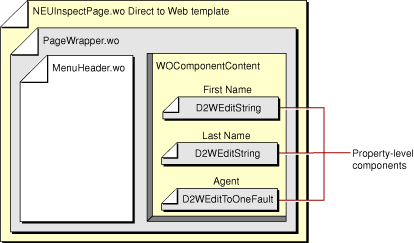
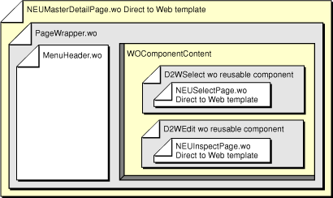
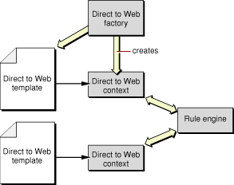

> 导航：[总目录](../../../README.md) · [documentation](../../../_indexes/documentation.md) · [WebObjects Direct to Web Guide](Introduction%20to%20WebObjects%20Direct%20to%20Web%20Guide.md)


[Next](Customizing%20a%20Direct%20to%20Web%20Application.md)[Previous](An%20Introduction%20to%20Direct%20To%20Web.md)

# Direct to Web Architecture

The Direct to Web framework works together with the WebObjects framework to generate web pages for nine database tasks including querying, editing, and listing. To do this, Direct to Web uses a task-specific component called a _Direct to Web template_ that can perform the task on any entity. Direct to Web also translates the information that the Enterprise Objects Framework provides about the entity into values the Direct to Web template needs to render the page.

This chapter discusses the Direct to Web architecture and how Direct to Web generates a page. More specifically, it describes

- the different types of components that Direct to Web uses to render the pages
- the _Direct to Web context_, an instance of the D2WContext class that resolves the bindings in the Direct to Web template’s binding file
- the _Direct to Web factory_, an instance of the D2W class that creates the Direct to Web pages
- how Direct to Web generates a query page
- the Direct to Web rule system, which contains application configuration information

Direct to Web provides nine types of Web pages to perform the tasks shown in Table 1. See [Dynamically Generated Pages](An%20Introduction%20to%20Direct%20To%20Web.md#apple-f4xwc4dqnrsv64tfmyxwi33df52wszbpkridgmbqgaytamjvfvcg63tujruw422dnbqxa5dfojeuixzvfvbecqsji5eeiry) for more information about these tasks.

__Table 2-1__  Direct to Web tasks

| Task | Description |
| Query | Allows the user to construct a query for a particular entity. |
| Query All | Displays all entities and lets the user construct queries on their attributes. |
| Inspect | Displays a single record of a given entity. |
| Edit | Displays a single record of a given entity and allows the user to change the record and save it to the database. |
| List | Displays several records of a particular entity in tabular form. |
| Select | Displays several records of a particular entity in tabular form and allows the user to choose one of them. |
| Edit relationship | Adds and removes objects from a relationship. |
| Confirm | Prompts the user to confirm that a record should be deleted. |
| Error | Displays information related to exceptions and other errors. |

To render these pages, Direct to Web uses three types of components: Direct to Web templates, Direct to Web reusable components, and property-level components.

Direct to Web generates the task Web pages using instances of the D2WPage class (itself a descendent of the WOComponent class) called Direct to Web templates. A Direct to Web template defines the basic layout for the task’s user interface. Direct to Web includes 29 templates: nine for the Basic look, ten for the Neutral look, and ten for the WebObjects look. For more information about looks, see [The Different Looks for WebObjects Applications](An%20Introduction%20to%20Direct%20To%20Web.md#apple-f4xwc4dqnrsv64tfmyxwi33df52wszbpkridgmbqgaytamjvfvcg63tujruw422dnbqxa5dfojeuixzvfvbegskjivfeqqy). The Direct to Web templates are listed in [Table 2-2](#apple-f4xwc4dqnrsv64tfmyxwi33df52wszbpkridgmbqgaytamjvfvcg63tujruw422dnbqxa5dfojeuixzsfvbecssjifceoqy).

__Table 2-2__  Direct to Web Templates

| Task | Basic Look | Neutral Look | WebObjects Look |
| Confirm | BASConfirmPage | NEUConfirmPage | WOLConfirmPage |
| Edit relationship | BASEditRelationshipPage | NEUEditRelationshipPage | WOLEditRelationship- Page |
| Error | BASErrorPage | NEUErrorPage | WOLErrorPage |
| Edit, Inspect | BASInspectPage | NEUInspectPage | WOLInspectPage |
| List, Select | BASListPage | NEUListPage | WOLListPage |
| List | BASMasterDetailPage | NEUMasterDetailPage | WOLMasterDetailPage |
| List, Select | BASPlainListPage | NEUPlainListPage | WOLPlainListPage |
| Query all | BASQueryAllEntitiesPage | NEUQueryAllEntitiesPage | WOLQueryAllEntities- Page |
| Query | BASQueryPage | NEUQueryPage | WOLQueryPage |
| Edit, Inspect |  | NEUTabInspectPage | WOLTabInspectPage |

Some Direct to Web templates perform multiple tasks. For example, an InspectPage template also edits. For some tasks, there are multiple Direct to Web templates in a given look that you can use. For example, you can use a ListPage, a PlainListPage, or a MasterDetailPage template to perform the list task.

Like any other WOComponent, a Direct to Web template has an HTML template (`.html` ) file and a bindings (`.wod` ) file. What differentiates a Direct to Web template from other components is that it resolves its bindings with the help of the Direct to Web framework at runtime.

Note that a Direct to Web template is different from a component’s HTML template (`.html` ) file: a Direct to Web template is a special type of component while an HTML template is a file containing the HTML code that defines a component’s appearance.

Some Direct to Web templates can be viewed as implementing more than one task:

- A MasterDetailPage template consists of a select component at the top and an edit component at the bottom.
- An EditRelationshipPage template consists of a select component at the top and query, select, and edit components at the bottom.

Direct to Web displays these subcomponents with Direct to Web templates. For example, a NEUMasterDetailPage displays its select component using a NEUListPage and its edit component with a NEUInspectPage. However, the Direct to Web templates are not designed to be nested directly within other Direct to Web templates. To permit nesting, Direct to Web uses another type of component called a _Direct to Web reusable component_, which acts as an interface between the outer template and the inner template. There are five types of Direct to Web reusable components; they are listed in [Table 2-3](#apple-f4xwc4dqnrsv64tfmyxwi33df52wszbpkridgmbqgaytamjvfvcg63tujruw422dnbqxa5dfojeuixzsfvbecsshijeegsa).

__Table 2-3__  Reusable components

| Name | Task |
| D2WEdit | Edit |
| D2WInspect | Inspect |
| D2WList | List |
| D2WQuery | Query |
| D2WSelect | Select |

[Table 2-4](#apple-f4xwc4dqnrsv64tfmyxwi33df52wszbpkridgmbqgaytamjvfvcg63tujruw422dnbqxa5dfojeuixzsfvbecssjifeugsa) shows how the reusable components are used in the Direct to Web templates containing multiple tasks. The remaining templates do not contain Direct to Web reusable components.

__Table 2-4__  Direct to Web templates and reusable components

| Direct to Web Template | Direct to Web Reusable Components Used |
| BASMasterDetailPageNEUMasterDetailPageWOLMasterDetailPage | D2WSelect, D2WEdit |
| BASEditRelationshipPageNEUEditRelationshipPageWOLEditRelationshipPage | D2WSelect, D2WQuery, D2WEdit |

In addition to allowing the nesting of Direct to Web templates, Direct to Web reusable components can also be embedded in your own components; they are available on a palette in WebObjects Builder. See the _Direct to Web Reference_ for more information about the individual Direct to Web reusable components.

Direct to Web uses _property-level components_ to display, query, and edit individual properties of an entity. A property is an attribute or relationship of an entity. Direct to Web defines components for manipulating strings, dates, numbers, to-one relationships, to-many relationships, and other objects. For example, [Table 2-5](#apple-f4xwc4dqnrsv64tfmyxwi33df52wszbpkridgmbqgaytamjvfvcg63tujruw422dnbqxa5dfojeuixzsfvbecsshifdukri) lists some property-level components; these components work with numbers.

__Table 2-5__  Number property-level components (java.lang.Number, java.math.BigDecimal)

| Display | Edit | Query |
| D2WDisplayNumber | D2WEditNumber | D2WQueryNumberOperator |
| D2WDisplayStyledNumber |  | D2WQueryNumberRange |
| D2WDisplayBoolean | D2WEditBoolean | D2WQueryBoolean |

At runtime when a template displays a property, Direct to Web chooses which property-level component should display the property. The choice depends on the property’s data type and how you configure the application with the Web Assistant.

[Figure 2-1](#apple-f4xwc4dqnrsv64tfmyxwi33df52wszbpkridgmbqgaytamjvfvcg63tujruw422dnbqxa5dfojeuixzsfvbecsskjbfeori) shows the components in an edit page for the Customer entity in the Neutral look, with only the attritubutes `firstName`, `lastName`, and `agent` showing. The top-level component is a Direct to Web template called `NEUInspectPage.wo`. It contains the project’s `PageWrapper.wo` component, which defines the overall layout of the page. The `PageWrapper.wo` component contains the `MenuHeader.wo` component, which defines the Direct to Web navigation menu. See [The Structure of a Direct to Web Project](An%20Introduction%20to%20Direct%20To%20Web.md#apple-f4xwc4dqnrsv64tfmyxwi33df52wszbpkridgmbqgaytamjvfvcg63tujruw422dnbqxa5dfojeuixzvfvbecqsiircugry) for more information about `PageWrapper.wo` and `MenuHeader.wo`.

__Figure 2-1__  Edit page component organization



The `PageWrapper.wo` component content comes from the NEUInspectPage Direct to Web template. This content includes HTML input elements for the visible attributes of an entity. Each attribute appears in a separate property-level component that depends on the attribute’s type. The `firstName` and `lastName` attributes are displayed using D2WEditString components. The `agent` relationship displays using a D2WEditToOneFault component.

Pages with nested Direct to Web templates contain Direct to Web reusable components. [Figure 2-2](#apple-f4xwc4dqnrsv64tfmyxwi33df52wszbpkridgmbqgaytamjvfvcg63tujruw422dnbqxa5dfojeuixzsfvbecsshifbugsi) shows a master detail page in the Neutral look. The `NEUMasterDetailPage.wo` Direct to Web template contains `PageWrapper.wo` which in turn, contains `MenuHeader.wo`. `NEUMasterDetailPage.wo` also contains two reusable components that act as interfaces to the templates they display: a D2WSelect component and a D2WEdit component. Each of these components is actually a WOSwitchComponent that displays a template—the D2WSelect component displays a NEUListPage Direct to Web template and the D2WEdit component displays a NEUInspectPage Direct to Web template.

__Figure 2-2__  Master-detail page component organization



As mentioned earlier, a Direct to Web template is rendered using runtime information about the entities it displays. To translate that information into something you can bind to the template’s dynamic elements, Direct to Web uses an instance of the D2WContext class called the Direct to Web context. This object has two functions: it maintains a _state dictionary_ that holds the state of a Direct to Web template as it renders, and it provides values that you can bind directly to attributes of dynamic elements. Each instance of a Direct to Web template has an associated Direct to Web context.

As the Direct to Web template changes state as it is rendered, the Direct to Web context changes state with it. Specifically, the Direct to Web context uses an NSDictionary containing

- the current task
- the current entity
- the current property (attribute or relationship)

The task and the entity remain constant while the template renders (with the exception of the query all template, for which only the task remains constant). The property does not stay constant, however. Consider an edit page. It displays the entity name and the entity’s visible properties. To display the properties, the Direct to Web template iterates through them using a WORepetition. As it iterates, the Direct to Web context updates the information about the current property in its dictionary.

Each Direct to Web template has a Direct to Web context called `d2wContext`, which implements the EOKeyValueCoding interface. Thus you can bind directly to keys that the context responds to. For example, [Listing 2-1](#apple-f4xwc4dqnrsv64tfmyxwi33df52wszbpkridgmbqgaytamjvfvcg63tujruw422dnbqxa5dfojeuixzsfvbecsskjfceoqy) shows the bindings file for a Direct to Web template that displays the name of the entity.

__Listing 2-1__  Bindings file for a Direct to Web template

```
String1: WOString {
    value = d2wContext.entity.name;
};
```

The Direct to Web context determines the values for the keys (`d2wContext.entity.name` for example) in one of three ways:

- it looks it up in its state dictionary
- it accesses application configuration information. (The Web Assistant is the primary way to modify the application configuration.)
- it derives values from the state and configuration information

The state dictionary contains the following entries:

| Key | Description of Value |
| --- | --- |
| `task` | A string representing the current task. |
| `entity` | An EOEntity representing the current entity. |
| `propertyKey` | A string representing the key of the current property. |
| `attribute` | An EOAttribute representing the current attribute (`null` if the current property is a relationship.) |
| `relationship` | An EORelationship representing the current relationship (`null` if the current property is an attribute.) |

If the dictionary contains the key the template needs, the Direct to Web context resolves the key by returning the value in the dictionary. Otherwise the Direct to Web context resolves the key using one of the other ways.

Some keys can only be resolved using the application configuration information, which is stored as a database of rules. For example, a rule to determine the property-level component for the `dateReleased` attribute might be “If the task is ‘edit’, the entity name is ‘Customer’, and the property key is ‘lastName’ then the value for the `componentName` key is ‘D2WEditString’.”

The Direct to Web context uses the _rule engine_ to resolve keys that aren’t in its dictionary. [Figure 2-3](#apple-f4xwc4dqnrsv64tfmyxwi33df52wszbpkridgmbqgaytamjvfvcg63tujruw422dnbqxa5dfojeuixzsfvbecssgizcumqq) shows how the rule engine relates to the Direct to Web context. [The Rule System](#apple-f4xwc4dqnrsv64tfmyxwi33df52wszbpkridgmbqgaytamjvfvcg63tujruw422dnbqxa5dfojeuixzsfvbecsseifauesq) contains detailed information on how the rule engine works.

__Figure 2-3__  Direct to Web Architecture



The rule engine also provides objects that have methods that derive values from the Direct to Web context’s state dictionary. An example of a derived value is the name displayed for a property: a method converts a property name like `lastName` to a display string “Last Name”. Using derived values is discussed in more detail in [The Rule System](#apple-f4xwc4dqnrsv64tfmyxwi33df52wszbpkridgmbqgaytamjvfvcg63tujruw422dnbqxa5dfojeuixzsfvbecsseifauesq).

Direct to Web pages are created by the Direct to Web factory, an instance of the D2W class (see [Figure 2-3](#apple-f4xwc4dqnrsv64tfmyxwi33df52wszbpkridgmbqgaytamjvfvcg63tujruw422dnbqxa5dfojeuixzsfvbecssgizcumqq)). This object creates pages by instantiating a Direct to Web context and a Direct to Web template for each page. [Rendering a Direct to Web Page: An Example](#apple-f4xwc4dqnrsv64tfmyxwi33df52wszbpkridgmbqgaytamjvfvcg63tujruw422dnbqxa5dfojeuixzsfvbecssiivceesq), shows how the factory generates a query page.

This section describes how the components, the Direct to Web context, and the Direct to Web factory interact while creating and rendering a query page for the Customer entity. This example begins with the user viewing a query all page in the Basic look and clicking a hyperlink labeled “more..” in the Customer row, which links to the query page. The query all page is rendered using a `BASQueryAllEntitiesPage.wo` template.

When the user clicks the hyperlink, the hyperlink invokes the `showRegularQueryAction` method defined in the D2WQueryAllEntitiesPage class, the superclass of the BASQueryAllEntitiesPage class. [Listing 2-2](#apple-f4xwc4dqnrsv64tfmyxwi33df52wszbpkridgmbqgaytamjvfvcg63tujruw422dnbqxa5dfojeuixzsfvbecssei5bekra) shows the implementation of the `showRegularQueryAction` method.

__Listing 2-2__  D2WQueryAllEntitiesPage.showReqularQueryAction

```
publicWOComponent showRegularQueryAction()
{
    QueryPageInterface newQueryPage= D2W.factory().queryPageForEntityNamed
        (entity().name(), session());
    return (WOComponent)newQueryPage;
}
```

The Direct to Web factory object creates a Direct to Web context and initializes its NSDictionary by setting the value for the `task` key to “query” and the value for the `entity` key to the Customer EOEntity.

__Table 2-6__  Initial Direct to Web context dictionary

| Key | Value |
| `task` | “query” |
| `entity` | <EOEntity Customer> |

To determine which Direct to Web template to create, the Direct to Web factory asks the Direct to Web context for the value of the `pageName` key. Since this key is neither in the dictionary nor a derived value from the dictionary, the Direct to Web context enlists the aid of the rule engine. [Listing 2-3](#apple-f4xwc4dqnrsv64tfmyxwi33df52wszbpkridgmbqgaytamjvfvcg63tujruw422dnbqxa5dfojeuixzsfvbecsscizeuorq) shows the rules that resolve the key.

__Listing 2-3__  Rules used to resolve the pageName key

```
((look= “BasicLook”) and (task = “query”)) => pageName = “BASQueryPage”

*true* => look = “BasicLook”
```

A rule has a left-hand side and a right-hand side separated by “=>”. The left-hand side specifies a condition that must be met for the rule to be a candidate to “fire,” or resolve a key. The right-hand side specifies the key-value assignment that takes place when the rule fires. Since the left-hand side for the second rule is true, the rule always fires when the Direct to Web context wants the value for the `look` key.

There are three sources for the rules that the rule engine uses:

- __The Direct to Web framework__ defines rules that determine the default application behavior.
- __You__ can write your own rules that override the framework’s defaults rules.
- __The Web Assistant__ generates rules involving the specific application information. These rules are generated automatically as you configure the application with the Web Assistant; you don’t have to write them.

See [The Rule System](#apple-f4xwc4dqnrsv64tfmyxwi33df52wszbpkridgmbqgaytamjvfvcg63tujruw422dnbqxa5dfojeuixzsfvbecsseifauesq) for more information about rules.

The two rules that resolve the `pageName` key (defined in the Direct to Web Framework) fire and the Direct to Web context returns “BASQueryPage” as the value for the `pageName` key.

Knowing the template name, the Direct to Web factory object creates a page using the `WOComponent.pageWithName` method. Then it attaches the Direct to Web context to the newly generated page.

Now the WebObjects framework begins to render the template. [Listing 2-4](#apple-f4xwc4dqnrsv64tfmyxwi33df52wszbpkridgmbqgaytamjvfvcg63tujruw422dnbqxa5dfojeuixzsfvbemrsejjbeosa) shows excerpts from the HTML template for the BASQueryPage Direct to Web template; the listed portions of the file are discussed in this example. [Listing 2-5](#apple-f4xwc4dqnrsv64tfmyxwi33df52wszbpkridgmbqgaytamjvfvcg63tujruw422dnbqxa5dfojeuixzsfvbecssdizbemqi) shows the corresponding sections in the bindings file.

First, the Direct to Web template displays the page wrapper. To do so, it needs to resolve the WOComponentName binding for the PageWrapper WOSwitchComponent (see [Listing 2-5](#apple-f4xwc4dqnrsv64tfmyxwi33df52wszbpkridgmbqgaytamjvfvcg63tujruw422dnbqxa5dfojeuixzsfvbecssdizbemqi)). A WOSwitchComponent displays a nested component that has the name specified by its WOComponentName binding, which in this case is bound to the `d2wContext.pageWrapperName` key. Since the Direct to Web Context can’t find it in its dictionary, it invokes the rule engine to resolve the key, which fires the rule:

```
*true*=> pageWrapperName = “PageWrapper”
```

The Direct to Web context returns “PageWrapper” for the WOComponentName binding and the WOSwitchComponent displays the application’s `PageWrapper.wo` component. The template continues to render, resolving its keys in a similar way.

__Listing 2-4__  BASQueryPage.html excerpts

```
<WEBOBJECTNAME=PageWrapper>
.
.
    <WEBOBJECT NAME=ResourceRepetition>
.
.
        ... <WEBOBJECT NAME=ResourceLabel>:... </WEBOBJECT>
.
.
        <WEBOBJECT NAME=ResourceInputRepresentation></WEBOBJECT>
.
.
    </WEBOBJECT>
</WEBOBJECT>
```


__Listing 2-5__  BASQueryPage.wod excerpts

```
PageWrapper:WOSwitchComponent {
    WOComponentName = pageWrapperName;
    ...
}

ResourceInputRepresentation:WOSwitchComponent {
    WOComponentName = d2wContext.componentName;
    ...
}

ResourceLabel: WOString {
    ...
    value = d2wContext.displayNameForProperty;
}

ResourceRepetition: WORepetition{
    ...
    item = d2wContext.propertyKey;
    list = d2wContext.displayPropertyKeys;
}
```


When the template begins to render the query fields for the entity’s attributes and relationships (like the agent and contact info) it encounters the WORepetition labeled `ResourceRepetition`. See [Listing 2-4](#apple-f4xwc4dqnrsv64tfmyxwi33df52wszbpkridgmbqgaytamjvfvcg63tujruw422dnbqxa5dfojeuixzsfvbemrsejjbeosa) and [Listing 2-5](#apple-f4xwc4dqnrsv64tfmyxwi33df52wszbpkridgmbqgaytamjvfvcg63tujruw422dnbqxa5dfojeuixzsfvbecssdizbemqi). The WORepetition’s `list` attribute is bound to `d2wContext.displayPropertyKeys`. Since `displayPropertyKeys` is not in its dictionary, the Direct to Web context resolves the key using the rule engine, which causes the following rule to fire:

```
*true*=> displayPropertyKeys = “defaultPropertyKeysFromEntity”
```

The `defaultPropertyKeysFromEntity` key refers to a method that derives a value based on the Direct to Web context’s dictionary. See [The Rule System](#apple-f4xwc4dqnrsv64tfmyxwi33df52wszbpkridgmbqgaytamjvfvcg63tujruw422dnbqxa5dfojeuixzsfvbecsseifauesq) for more information about the how derived values are handled. The `defaultPropertyKeysFromEntity` method returns an NSArray containing the Customer entity’s property keys, which resolves the WORepetition’s `list` binding.

As the repetition iterates, it sets the `item` attribute for each of the objects in the list. The first object is the string “agent”. Since `item` is bound to `d2wContext.propertyKey`, the Direct to Web context sets the value for `propertyKey` in its dictionary to “agent”. At the same time, it sets the value for the `attribute` key to `null` and the value for the `relationship` key to the `agent` EORelationship, since a Customer’s `agent` property is a relationship and not an attribute. Now the Direct to Web Context dictionary contains the information listed in [Table 2-7](#apple-f4xwc4dqnrsv64tfmyxwi33df52wszbpkridgmbqgaytamjvfvcg63tujruw422dnbqxa5dfojeuixzsfvbecssiifeeqsq).

__Table 2-7__  Direct to Web context dictionary after setting propertyKey

| Key | Value |
| `task` | “query” |
| `entity` | <EOEntity Customer> |
| `propertyKey` | “agent” |
| `attribute` | `null` |
| `relationship` | <EORelationship agent> |

As the WebObjects framework continues to render the `ResourceRepetition` WORepetition, it encounters the `ResourceLabel` WOString. See [Listing 2-4](#apple-f4xwc4dqnrsv64tfmyxwi33df52wszbpkridgmbqgaytamjvfvcg63tujruw422dnbqxa5dfojeuixzsfvbemrsejjbeosa). The `value` attribute is bound to `d2wContext.displayNameForProperty`. This causes the following rule to fire:

```
*true*=> displayNameForProperty = “defaultDisplayNameForProperty”
```

The derived value for the `defaultDisplayNameForProperty` key is implemented by a method that capitalizes the property key in the context’s dictionary, inserts spaces between words with mixed case, and returns the resulting name “Agent”, which the template displays.

Next, the template displays the property-level component that queries for the `agent` relationship. Since this component is known only at runtime, the Direct to Web template displays it with a WOSwitchComponent called `ResourceInputRepresentation`. See [Listing 2-5](#apple-f4xwc4dqnrsv64tfmyxwi33df52wszbpkridgmbqgaytamjvfvcg63tujruw422dnbqxa5dfojeuixzsfvbecssdizbemqi). The WOSwitchComponent’s `WOComponentName` attribute is bound to `d2wContext.componentName`. When the context evaluates this key, the following rule fires:

```
((task= “query”) and (propertyType = “r”)
    and (not (relationship.isToMany= (java.math.BigDecimal)”1”))
    => componentName = “D2WQueryToOneField”
```

Thus the WOSwitchComponent displays a `D2WQueryToOneField.wo` reusable component from the DirectToWeb framework.

The rest of the template renders in a similar way.

Direct to Web stores its configuration in the form of rules. The following is an example of a rule:

```
((task= “query”) and (not (attribute = null))
    and (attribute.valueClassName= “java.lang.String”)
    => componentName = “D2WQueryStringComponent”
```

A rule consists of five parts, of which three are shown in the example:

- __a left-hand side__, which is separated from the right-hand side by “=>”

  The left-hand side specifies a condition that must be true for the rule to be a candidate to fire. In this case, the task must be “query”, the attribute must not be `null` and its value must be a Java String.
- __a right-hand-side key__ (`componentName` in this case)

  The right-hand-side key must match the key the Direct to Web context is seeking for the rule to be a candidate to fire.
- __a right-hand-side value__ (”D2WQueryStringComponent” in this case)

  The right-hand-side value specifies the value for the right-hand-side key when the rule fires. It can be a constant value (as in this case) or a value computed by a method.
- __a priority__

  The priority helps Direct to Web decide which rule should fire when there are several candidates. See [Deciding Which Candidate Should Fire](#apple-f4xwc4dqnrsv64tfmyxwi33df52wszbpkridgmbqgaytamjvfvcg63tujruw422dnbqxa5dfojeuixzsfvbecsscineuora) for more information about the rule priority.
- __an assignment class specifier__

  The assignment class sets the value for the right-hand-side key when the rule fires. The default assignment class, Assignment, defined in the Direct to Web framework, assigns a constant value like “D2WQueryStringComponent”. When the right-hand-side value is derived using a method, the assignment class specifies a class that contains the method.

When the Direct to Web context asks for the value for a key, there are typically several rules that can fire. For example, consider the following rules to resolve the `componentName` key:

```
*true*=> componentName = “D2WUneditable”

(task = “inspect”) =>componentName = “D2WDisplayString”

((task = “inspect”) and
    (attribute.valueClassName= “com.webobjects.foundation.NSTimestamp”))
    => componentName = “D2WDisplayDate”
```

The left-hand side of the first rule is always true. Such rules are useful for providing “fallback” values when all other rules fail to fire. Note that if the left-hand side for the third rule is true, all three rules are candidates for firing. The rule engine must choose which rule will fire.

To make the choice, Direct to Web employs a priority system. Each rule has a priority. The single rule with the highest priority fires. By convention, the following priorities are used in Direct to Web.

| Priority | Description |
| --- | --- |
| 0-10 | Reserved for Direct to Web framework and fallback rules |
| 100-105 | WebAssistant rules |

If two or more rules have the same priority, the rule with the most specific left-hand side (applying to the least number of cases) fires. Direct to Web measures how specific a rule is by counting the number of clauses joined by an _and_ operator; the more clauses the rule has, the more specific it is. Clauses joined by the _or_ operator count as a single clause.

If two or more rules have the same priority and are equally specific, Direct to Web arbitrarily chooses one.

The rule system resolves keys recursively. In other words, the rule system can resolve a rule based on the outcome of another rule. Consider a rule for the `pageName` key:

```
((look= “BasicLook”) and (task = “query”)) => pageName = “BASQueryPage”
```

The `look` key is defined by a rule like this:

```
*true*=> look = “BasicLook”
```

To resolve the `pageName` key, the rule engine asks the Direct to Web context for values for the `look` and the `task` keys. The Direct to Web context then invokes the rule engine to resolve the `look` key. This extra step isn’t necessary for the task key; it’s already in the Direct to Web context’s local dictionary. Although recursive rules are powerful, they can hamper Direct to Web’s performance.

To see the rules that fire as Direct to Web renders pages, run your application with the switch `-D2WTraceRuleFiringEnabled YES`.

The Web Assistant defines rules that pertain to specific entities and properties in your application, unlike the rules from the Direct to Web framework. These rules have a priority of 100, which override the default rules in the Direct to Web framework. Consequently, if you want to define your own default rules that the Web Assistant can override, you need to specify them with a priority between 11 and 99.

When you click Update in the Web Assistant window, the settings are compared to the settings on the server and the appropriate rules are added or deleted from the rule database in memory. When you click Save in the Web Assistant window, the rule database is stored in the application’s `user.d2wmodel` file.

To build the Web Assistant’s list of available task pages and property-level components, Direct to Web uses the rule system differently from when it renders a page. Instead of firing the single best candidate rule to find a particular key, Direct to Web asks for all rules that can resolve the key given the state of the Direct to Web context and collects the resulting values into a list that the Web Assistant presents to you. Two special keys are handled this way: `pageAvailable` for collecting task pages and `componentAvailable` for collecting property-level components.

If you want to see which rules the Web Assistant creates and deletes at runtime, you can run your application with the switch `-D2WTraceRuleModificationsEnabled YES`.

When a rule fires, its right-hand-side value is cached to improve Direct to Web’s rendering performance. Once the value is cached, subsequent requests for the key may cause the rule engine to access the cache to resolve its value instead of finding a rule to fire. The cache is retained for the life of the application or until you click Update, Save, or Revert in the Web Assistant.

It is important to note that the right-hand-side value is cached based on the values of a collection of keys that does not necessarily include all of the keys on the left-hand side of the rule. Only the values of a list of _significant keys_ and the right-hand-side key are used to uniquely identify the cache entry. By default, the significant keys are

- task
- entity
- propertyKey
- configuration

The configuration key refers to the named configuration of the current page. You can add to this list using the D2W class’s `newSignificantKey` method.

Consider this rule:

```
((task= “edit”) and (entity.name = “Customer”)
    and (propertyKey = “agent”))
    => componentName = “D2WEditToOneRelationship”
```

When it fires, Direct to Web creates the cache entry described in [Table 2-8](#apple-f4xwc4dqnrsv64tfmyxwi33df52wszbpkridgmbqgaytamjvfvcg63tujruw422dnbqxa5dfojeuixzsfvbecssejjdugra).

__Table 2-8__  Example of Cached Rule

| `task` | “edit” |
| `entity` | `<EOEntity Customer>` |
| `propertyKey` | “agent” |
| `configuration` | `null` |
| `key` | `componentName` |
| `value` | “D2WEditToOneRelationship” |

If the Direct to Web context is asked for the value of the `componentName` key again, and the context’s values for `task`, `entity`, `propertyKey`, and `configuration` are unchanged, this rule does not fire. Instead, the rule system uses the cached value. On the other hand, if the value of any of these keys changes, the cache entry no longer applies and the rule engine must find a rule to fire to resolve the `componentName` key.

If you watch the rules as they fire (with `-D2WTraceRuleFiringEnabled YES`), you may find rules that fire when you expect Direct to Web to use the values in the cache. Or rules you expect to fire don’t appear because Direct to Web gets the values from the cache.

To see how a rule might fire when you expect its value to be cached, consider the rule that resolves the `look` key, which defines whether the application is using the Basic look, the Neutral look, or the WebObjects look. Suppose the rule is

```
*true*=> look = “NeutralLook”
```

The first time this rule fires is when the Direct to Web factory asks for the name of the Direct to Web template to display the QueryAll page. The following cache entry is created:

__Table 2-9__  Example of Cached Rule First Time it Fires

| `task` | “queryAll” |
| `entity` | null |
| `propertyKey` | null |
| `configuration` | `null` |
| `key` | look |
| `value` | “NeutralLook” |

Note that the `entity` key is `null`. The next time Direct to Web asks for the `look` key is when it wants to know the background color for the Query form table. The entity is still `null` so Direct to Web gets the value from the cache.

Now the QueryAll template begins to iterate through the entities. It sets the first entity to the Administrator EOEntity. This time the `entity` key is no longer `null` so the old cache entry does not apply. Consequently, the rule engine fires the `look` rule again.

What is more difficult to debug is when the rule engine resolves a key using the cache when you expect a rule to fire. This happens when the outcome of the rule depends on a key that is not cached (that is, not in the list of significant keys). This can arise in an application that has different behavior depending on the user’s access privileges.

Consider an online real estate database application that behaves differently based on the user’s access privileges. In particular, the real estate agent (access level 1) sees the AgentListListing template and the customer (access level 3) sees the CustomerListListing template. You can set this up with these rules:

```
((task= “list”) and (entity = “Listing”) and (session.user.accessLevel= 1))
    => pageName = “AgentListListing”

((task = “list”) and (entity= “Listing”) and (session.user.accessLevel = 3))
    => pageName = “CustomerListListing”
```

Suppose the real estate agent logs into the application and accesses the list page. Direct to Web creates this cache entry:

__Table 2-10__  Cached Rule for Real Estate Agent Login

| `task` | “list” |
| `entity` | <EOEntity Listing> |
| `propertyKey` | null |
| `configuration` | `null` |
| `key` | pageName |
| `value` | “AgentListListing” |

| task | entity | propertyKey | configuration | key | value |
| --- | --- | --- | --- | --- | --- |
| “list” | `<EOEntityListing>` | `null` | `null` | `pageName` | “AgentListListing” |

Later a customer logs on and accesses the list page. Instead of showing the customer list page, Direct to Web displays the real estate agent’s list page, which is an obvious security violation. This happens because the second rule never fires. Instead, the cache entry from the first rule resolves the value for the `pageName` key.

To fix the application, you need to add `session.user.accessLevel` to the list of significant keys using the D2W class’s `newSignificantKey` method. For example, `D2W.factory().newSignificantKey(“session.user.accessLevel”);`.

[Next](Customizing%20a%20Direct%20to%20Web%20Application.md)[Previous](An%20Introduction%20to%20Direct%20To%20Web.md)

