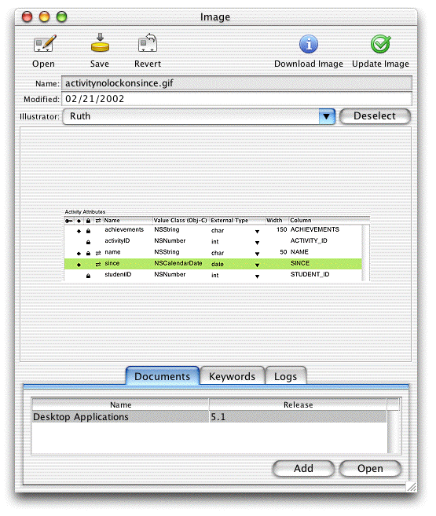

> 导航：[总目录](../../../README.md) · [documentation](../../../_indexes/documentation.md) · [WebObjects Java Client Programming Guide](Introduction%20to%20WebObjects%20Java%20Client%20Programming%20Guide.md)


[Next](Common%20Rules.md)[Previous](Adding%20Custom%20Menu%20Items.md)

# Adding Custom Actions to Controllers

When building Direct to Java Client applications, it’s common to want to add actions to the application’s controllers. The default actions in a form controller are insert, delete, revert, save, and open. There are many ways to add actions to controllers and still preserve the dynamism of the application. This chapter describes some of the possible ways.

_Problem:_ You need to add actions to a controller yet still preserve the dynamic character of the controller.

_Solution:_ Subclass the controller class and use the rule system to use it throughout the application.

This technique is used in [Extend a Controller Class](Enhancing%20the%20Application.md#apple-f4xwc4dqnrsv64tfmyxwi33df52wszbpkridgmbqgaytamjxfvbuqmzqgmwviucykjcummjtg4) in the chapter [Enhancing the Application](Enhancing%20the%20Application.md#apple-f4xwc4dqnrsv64tfmyxwi33df52wszbpkridgmbqgaytamjxfvbuqmzqgmwviubr).

Subclassing a controller class and writing a rule to use it is the best way to add custom actions to your application’s controllers. As well as taking real advantage of object-oriented programming, it preserves the dynamism of Direct to Java Client applications. The other mechanisms to add actions require freezing XML, and anytime you freeze XML, you lose a lot of the dynamism of the rule system.

The dynamically generated user interfaces in Java Client rely on a core set of controller classes: EOFormController, EOQueryController, and EOListController. In an application that, for example, stores images in records, you need custom actions to both select images from the file system and download them to the file system. This requires two additional action buttons in a form window, Download Image and Update Image.

To add these actions, create a new class called FormController, as shown in Listing 14-1.

__Listing 14-1__  Subclassing EOFormController

```
package assetmanager.client;

import javax.swing.*;
import com.webobjects.foundation.*;
import com.webobjects.eocontrol.*;
import com.webobjects.eoapplication.*;
import com.webobjects.eogeneration.*;
import com.webobjects.eodistribution.client.*;

public class FormController extends EOFormController {

    public FormController(EOXMLUnarchiver unarchiver) {
        super(unarchiver);
    }

    public NSArray defaultActions() {
        Icon icon =
            EOUserInterfaceParameters.localizedIcon("ActionIconInspect");
        NSMutableArray actions = new NSMutableArray();
        actions.addObject(EOAction.actionForControllerHierarchy("saveImageToDisk",
           "Download Image", "Download Image", icon, null, null, 300, 50, false));

        icon = EOUserInterfaceParameters.localizedIcon("ActionIconOk");
        actions.addObject(EOAction.actionForControllerHierarchy("updateImageInRecord",
            "Update Image", "Update Image", icon, null, null, 300, 50, false));
        return EOAction.mergedActions(actions, super.defaultActions());
    }

    public boolean canPerformActionNamed(String actionName) {
        return actionName.equals("saveImageToDisk") ||
           super.canPerformActionNamed(actionName));
    }

    public void saveImageToDisk() {
        //some code
    }

    public void updateImageInRecord() {
        //some code
    }
}
```

Subclasses of the core controller classes must contain these methods: a method overriding `defaultActions`, a method overriding `canPerformActionNamed`, and a method for each action defined in `defaultActions`. By overriding `defaultActions`, you are adding to the controller’s actions, and by overriding `canPerformActionNamed`, you are authorizing the additional actions.

To use this class in all form windows throughout the application, you need only write a simple rule:

**Left-Hand Side:**
: `((task='form') and (controllerType='entityController'))`

**Key:**
: `className`

**Value:**
: `"assetmanager.client.FormController"`

**Priority:**
: `50`

So, without needing to freeze XML, these customizations change the default form window to include new actions, as shown in Figure 14-1.

__Figure 14-1__  Image form window with new actions



The standard actions delete and insert are disabled by another rule:

**Left-Hand Side:**
: `*true*`

**Key:**
: `disabledActionNames`

**Value:**
: `(insertWithTask, delete)`

**Priority:**
: `50`

This rule is described in [Restricting Access to an Application](Restricting%20Access%20to%20an%20Application.md#apple-f4xwc4dqnrsv64tfmyxwi33df52wszbpkridgmbqgaytamjxfvbuqmzqhawviubr).

_Problem:_ For any number of reasons, subclassing the core controller classes to provide custom actions doesn’t meet your needs.

_Solution:_ Subclass EOController and write a rule or XML to use it.

This mechanism of writing a custom action is very similar to that described in [Subclassing Controller Classes](#apple-f4xwc4dqnrsv64tfmyxwi33df52wszbpkridgmbqgaytamjxfvbuqmzrgewugskiincuussh), except that you subclass EOController instead of an entity-level controller like EOFormController and EOQueryController. [Listing 14-2](#apple-f4xwc4dqnrsv64tfmyxwi33df52wszbpkridgmbqgaytamjxfvbuqmzrgewugskiivbecrsg) shows the code for the class that adds an action that displays a simple information dialog.

__Listing 14-2__  A custom controller class

```
package businesslogic.client;
import java.awt.event.*;
import javax.swing.*;
import com.webobjects.foundation.*;
import com.webobjects.eoapplication.*;
import com.webobjects.eogeneration.*;

public class NewController extends EOController {

    public NewController(EOXMLUnarchiver unarchiver) {
        super(unarchiver);
    }

    protected NSArray defaultActions() {
        Icon icon =
           EOUserInterfaceParameters.localizedIcon("ActionIconInspect");
          NSMutableArray actions = new NSMutableArray();
            actions.addObject(EOAction.actionForControllerHierarchy("runInfoDialog", "Run
            Info Dialog", "Run Info Dialog", icon, null, null, 300, 50, false));

        return EOAction.mergedActions(actions, super.defaultActions());
    }

    public boolean canPerformActionNamed(String actionName) {
        return actionName.equals("runInfoDialog") ||
                super.canPerformActionNamed(actionName);
    }

    public void runInfoDialog() {
        EODialogs.runInformationDialog("Hello World!", "Hello World!");
    }
```

The most common way to use this custom controller in an application is in a frozen XML component. You can add a `CONTROLLER` tag specifying the fully qualified class name of the new class:

```
CONTROLLER className="businesslogic.client.NewController"/>
```

You can also write a rule to use the custom controller:

**Left-Hand Side:**
: `((task='query') and (controllerType='entityController'))`

**Key:**
: `className`

**Value:**
: `"businesslogic.client.NewController"`

**Priority:**
: `50`

[Next](Common%20Rules.md)[Previous](Adding%20Custom%20Menu%20Items.md)

