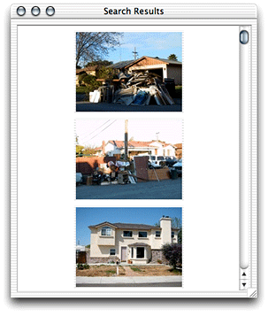
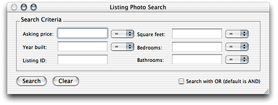
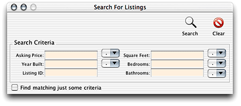

> 导航：[总目录](../../../README.md) · [documentation](../../../_indexes/documentation.md) · [WebObjects Java Client Programming Guide](Introduction%20to%20WebObjects%20Java%20Client%20Programming%20Guide.md)


[Next](Inside%20the%20Rule%20System.md)[Previous](Nondirect%20Java%20Client%20Development.md)

# Building Custom Controllers With XML

Direct to Java Client’s dynamic user-interface generation may not always provide all the kinds of user interfaces your applications require. As described in [Nondirect Java Client Development](Nondirect%20Java%20Client%20Development.md#apple-f4xwc4dqnrsv64tfmyxwi33df52wszbpkridgmbqgaytamjxfvbuqmzqgqwviubr), you can use Interface Builder to build nondirect, static interfaces and use them within Direct to Java Client applications. Interface Builder generates a Java class file that contains Swing code. Although this saves you from writing Swing, it is not ideal.

When you use nib files, you need to provide a separate nib file for each language and platform your application supports. So if your customers use both Windows and Mac OS X and require the application to be localized in French, German, and English, you need to build at least six nib files for every nib file your application uses. The maintenance burden should be obvious.

When you use controller classes, however, you need to write only a single version. Direct to Java Client dynamically provides localized and platform-specific versions of the controller when requested by the client. And when you need to write custom controllers for user interface elements that are not provided by Direct to Java Client, you need to write only minimal Swing code.

This chapter describes both how to write a custom controller class for a user interface element that isn’t provided by Direct to Java Client and also how to define user interfaces in XML using the provided controllers.

When you run the JCRealEstatePhotos example, you may recognize a custom controller—the scroll view controller that displays photos of listings that are returned by a query. This controller is shown in Figure 8-1.

__Figure 8-1__  Scroll view controller with clickable images



It was necessary to write a custom controller class to achieve this functionality because Direct to Java Client does not provide a scroll view controller whose contents are images. Direct to Java Client provides a number of prebuilt controller classes, but your applications may need to use specialized controllers that it doesn’t provide.

The custom scroll view controller requires you to do three things: write a Java class file that defines the controller in Swing, add a D2WComponent to the project that contains XML that references the custom controller, and register a new task with the rule system that can be invoked to display the custom controller.

Custom controller classes that are used to provide widget-level functionality to an application inherit from `com.webobjects.eogeneration.EOWidgetController`. All you need to do to provide a custom widget is to subclass that class and override the `newWidget` method, which returns a JComponent. The ScrollViewController class in the JCRealEstatePhotos example constructs and returns a JPanel that contains a JScrollPane that contains a number of JButton subclassed objects. See the class file in the example project.

The ScrollViewController class is referenced in a D2WComponent’s XML description—that’s how it gets displayed. That XML description is quite simple, as shown in Listing 8-1. The JCRealEstatePhotos example names this component ScrollViewComponent.

__Listing 8-1__  Reference the custom controller in XML

```
<FRAMECONTROLLER reuseMode="never" horizontallyResizable="false"
       verticallyResizable="true" label="Search Results" disposeIfDeactivated="true">
    <CONTROLLER
         className="webobjectsexamples.realestatephotos.client.ScrollViewController"
          horizontallyResizable="true" verticallyResizable="true" minimumHeight="300"
          minimumWidth="300"/>
</FRAMECONTROLLER>
```

The other controllers in the XML description give you a lot of functionality for free. The `FRAMECONTROLLER` controller displays a JFrame, gives it a label, and specifies its resizing constraints. Likewise, the `CONTROLLER` controller references the custom controller class and adds it to the JFrame specified by the `FRAMECONTROLLER` controller, specifies its resizing constraints, and specifies its minimum dimensions. This is one of the great benefits of controllers—you can write user interfaces at a higher level than raw Swing.

To actually display the custom controller, you need to invoke a particular task. So, you need to first register a new task with the rule system. The JCRealEstatePhotos example uses this rule to register a new task that displays the custom controller:

**Left-Hand Side:**
: `(task='scroll')`

**Key:**
: `window`

**Value:**
: `"ScrollViewComponent"`

**Priority:**
: `50`

You can ask the controller factory to invoke the task with this call:

```
EOControllerFactory.sharedControllerFactory().openWindowForTaskName("scroll");
```

That’s all you need to do to write and use static controllers that are not based on nib files in a Direct to Java Client application. Although writing your own controller hierarchies may not be fun, it’s the right way to build a static user interface for use in a Direct to Java Client application. You can use the Direct to Java Client Assistant to get clues on how to structure the XML hierarchy to get the user interface you want.

Building user interfaces in Interface Builder allows you to specify exactly the layout of a particular window. With that tool, you can specify exact widget sizes, the spacing between widgets, and other particular characteristics of a user interface. This is the advantage of using nib files: You have exact control over the look of a user interface.

However, you must weigh this advantage against the maintenance costs of using nib files. A good compromise between the precise user interface layout you can achieve in Interface Builder and dynamically generated user interfaces that you get for free from Direct to Java Client is to build up a user interface controller hierarchy by hand. While this does not afford you quite the same flexibility as using a nib file, you should able to achieve similar results.

Figure 8-2 shows a user interface built in Interface Builder. A similar user interface built with a controller hierarchy appears in Figure 8-3.

__Figure 8-2__  Nib-based query window



__Figure 8-3__  Controller-based query window



The controller hierarchy for the user interface in Figure 8-3 looks like Listing 8-2.

__Listing 8-2__  Controller hierarchy for a user interface

```
<FRAMECONTROLLER horizontallyResizable="false" verticallyResizable="false" label="Search For Listings" minimumWidth="550">
 <ACTIONBUTTONSCONTROLLER widgetPosition="TopRight">
  <CONTROLLER usesHorizontalLayout="false" verticallyResizable="false"
     className="webobjectsexamples.realestatephotos.client.SearchController">
    <BOXCONTROLLER borderType="Etched" usesTitledBorder="true" label="Search
       Criteria" usesHorizontalLayout="true" horizontallyResizable="true"
       verticallyResizable="false">
      <BOXCONTROLLER usesTitledBorder="false" alignsComponents="true" borderType="None"
        horizontallyResizable="true" verticallyResizable="false">
      <TEXTFIELDCONTROLLER suppressesAssociation="true" label="Asking Price"
         typeName="askingPrice input field" isQueryWidget="true"/>
      <TEXTFIELDCONTROLLER suppressesAssociation="true" label="Year Built"
         typeName="yearBuilt input field" isQueryWidget="true"/>
      <TEXTFIELDCONTROLLER suppressesAssociation="true" label="Listing ID"
         typeName="listingID input field" isQueryWidget="true"/>
     </BOXCONTROLLER>
     <COMPONENTCONTROLLER alignsComponents="true" horizontallyResizable="false"
        verticallyResizable="false">
       <CONTROLLER
           className="webobjectsexamples.realestatephotos.client.ComboBoxController"
           typeName="askingPrice combo box" minimumWidth="55" minimumHeight="22"/>
       <CONTROLLER
           className="webobjectsexamples.realestatephotos.client.ComboBoxController"
           typeName="yearBuilt combo box" minimumWidth="55" minimumHeight="22"/>
      </COMPONENTCONTROLLER>
      <BOXCONTROLLER usesTitledBorder="false" alignsComponents="true" borderType="None"
         horizontallyResizable="true" verticallyResizable="false">
       <TEXTFIELDCONTROLLER suppressesAssociation="true" label="Square Feet"
         typeName="squareFt input field" isQueryWidget="true"/>
       <TEXTFIELDCONTROLLER suppressesAssociation="true" label="Bedrooms"
          typeName="bedrooms input field" isQueryWidget="true"/>
       <TEXTFIELDCONTROLLER suppressesAssociation="true" label="Bathrooms"
          typeName="bathrooms input field" isQueryWidget="true"/>
       </BOXCONTROLLER>
         <COMPONENTCONTROLLER alignsComponents="true" horizontallyResizable="false"
            verticallyResizable="false">
            <CONTROLLER
               className="webobjectsexamples.realestatephotos.client.ComboBoxController"
               widgetPosition="Right" typeName="squareFt combo box" minimumWidth="55"
               minimumHeight="22"/>
            <CONTROLLER
               className="webobjectsexamples.realestatephotos.client.ComboBoxController"
               widgetPosition="Right" typeName="bedrooms combo box" minimumWidth="55"
               minimumHeight="22"/>
               <CONTROLLER className="webobjectsexamples.realestatephotos.client.ComboBo
              xController" widgetPosition="Right" typeName="bathrooms combo box"
               minimumWidth="55" minimumHeight="22"/>
         </COMPONENTCONTROLLER>
        </BOXCONTROLLER>
        <CHECKBOXCONTROLLER alignment="Right" suppressesAssociation="true"
          typeName="searchtype input checkbox" label="Find matching just some criteria"/>

        </CONTROLLER>
    </ACTIONBUTTONSCONTROLLER>
</FRAMECONTROLLER>
```

There are a few interesting things to point out in Listing 8-2. Except for the window frame and button toolbar, the rest of the controllers are wrapped in a `CONTROLLER` tag whose class is `webobjectsexamples.realestatephotos.client.SearchController`. This class inherits from EOComponentController and is shown in [Listing 8-3](#apple-f4xwc4dqnrsv64tfmyxwi33df52wszbpkridgmbqgaytamjxfvbuqmzqguwueq2giveesskd). It serves as the supercontroller for the controllers nested within it. A supercontroller has access to all the controllers nested within it, which allows you to retrieve information about those nested controllers and any data they contain (such as text users enter in a text field or the value of a checkbox).

Most of the controllers in Listing 8-2 include the attribute `suppressesAssociation="true"`. This tells the rule system that a particular controller is not associated with an enterprise object. Rather, that controller is just a user interface controller that is used to display a user interface widget and allows a user to enter data.

All the controllers in Listing 8-2 that accept user data include a `typeName` tag. This tag is used to identify each controller in the controller hierarchy so when you traverse the controller hierarchy looking for data, you can identify specific controllers.

One of the tasks you need to perform when using a controller-based user interface is getting values the user enters. As discussed in [Use Controllers Rather Than Nib Files](#apple-f4xwc4dqnrsv64tfmyxwi33df52wszbpkridgmbqgaytamjxfvbuqmzqguwueq2gjfcucscj) and as implemented in [Listing 8-2](#apple-f4xwc4dqnrsv64tfmyxwi33df52wszbpkridgmbqgaytamjxfvbuqmzqguwueq2gijcecr2d), by assigning controllers a value for the `typeName` attribute, you can traverse a given controller hierarchy and look up controllers based on that attribute.

The methods `valueFromInputField`, `valueFromCheckBox`, and `valueFromComboBox` in the SearchController class in Listing 8-3 accomplish this. Remember, SearchController is the supercontroller for the user interface elements in the controller hierarchy in [Listing 8-2](#apple-f4xwc4dqnrsv64tfmyxwi33df52wszbpkridgmbqgaytamjxfvbuqmzqguwueq2gijcecr2d). From any supercontroller, you can traverse its subcontroller hierarchy to find certain controllers. This is what the `valueFrom` methods in Listing 8-3 do.

__Listing 8-3__  SearchController class

```
package webobjectsexamples.realestatephotos.client;

import com.webobjects.foundation.*;
import com.webobjects.eoapplication.*;
import com.webobjects.eogeneration.*;
import javax.swing.*;
import java.awt.*;

public class SearchController extends EOComponentController {

    public SearchController(EOXMLUnarchiver unarchiver) {
        super(unarchiver);
    }

    protected NSArray defaultActions() {
        NSMutableArray actions = new NSMutableArray();

        String title = EOUserInterfaceParameters.localizedString("Search");
        String clearTitle = EOUserInterfaceParameters.localizedString("Clear");

        Icon icon = EOUserInterfaceParameters.localizedIcon("ActionIconFind");
        actions.addObject(EOAction.actionForControllerHierarchy("search", title, title,
         icon, null, null, 0, 0, false));

        icon = EOUserInterfaceParameters.localizedIcon("ActionIconClear");

        actions.addObject(EOAction.actionForControllerHierarchy("clear", clearTitle,
           clearTitle, icon, null, null, 0, 300, false));
        return EOAction.mergedActions(actions, super.defaultActions());
    }

    public void search() {

        NSMutableDictionary valuesAndSuch = new NSMutableDictionary();
        valuesAndSuch.takeValueForKey(valueFromInputField("askingPrice"),
           "askingPriceValue");
        valuesAndSuch.takeValueForKey(valueFromComboBox("askingPrice"),
           "askingPriceCompareBy");
        valuesAndSuch.takeValueForKey(valueFromInputField("yearBuilt"),
           "yearBuiltValue");
        valuesAndSuch.takeValueForKey(valueFromComboBox("yearBuilt"),
           "yearBuiltCompareBy");
        valuesAndSuch.takeValueForKey(valueFromInputField("listingID"),
           "listingIDValue");
        valuesAndSuch.takeValueForKey(valueFromInputField("squareFt"),
           "squareFtValue");
        valuesAndSuch.takeValueForKey(valueFromComboBox("squareFt"),
           "squareFtCompareBy");
        valuesAndSuch.takeValueForKey(valueFromInputField("bedrooms"),
           "bedroomsValue");
        valuesAndSuch.takeValueForKey(valueFromComboBox("bedrooms"),
           "bedroomsCompareBy");
        valuesAndSuch.takeValueForKey(valueFromInputField("bathrooms"),
           "bathroomsValue");
        valuesAndSuch.takeValueForKey(valueFromComboBox("bathrooms"),
           "bathroomsCompareBy");
        valuesAndSuch.takeValueForKey(valueFromCheckBox("searchtype"), "searchtype");

        ImageSearch search = new ImageSearch(valuesAndSuch);
    }

    public String valueFromInputField(String identifier) {
        EOWidgetController controller =
          (EOWidgetController)(controllerWithKeyValuePair(EOController.SubcontrollersEnu
         meration, null, "typeName", identifier + " input field"));
        if (controller == null) {
            throw new IllegalStateException("Can't find input checkbox controller for "             + identifier);
        }
        return (((JTextField)controller.widget()).getText());
    }

    public String valueFromComboBox(String identifier) {
        EOWidgetController controller =
           (EOWidgetController)(controllerWithKeyValuePair(EOController.SubcontrollersEn
           umeration, null, "typeName", identifier + " combo box"));
        if (controller == null) {
            throw new IllegalStateException("Can't find input checkbox controller for "
              + identifier);
        }
        return (String)(((JComboBox)controller.widget()).getSelectedItem());
    }

    public Boolean valueFromCheckBox(String identifier) {
        EOWidgetController controller =
          (EOWidgetController)(controllerWithKeyValuePair(EOController.SubcontrollersEnu
         meration, null, "typeName", identifier + " input checkbox"));
        if (controller == null) {
            throw new IllegalStateException("Can't find input checkbox controller for "
           + identifier);
        }
        return new Boolean(((JCheckBox)controller.widget()).isSelected());
    }

    public void clear() {
        NSLog.out.appendln("clearing in controller");
    }

}
```

The `search` method collects the search criteria as entered by the user, as well as the values of the combo boxes that control how the qualifier for a particular search criteria is constructed. It then passes these values in a dictionary to the ImageSearch class (not shown here), which actually performs the search.

[Next](Inside%20the%20Rule%20System.md)[Previous](Nondirect%20Java%20Client%20Development.md)

