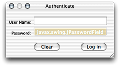
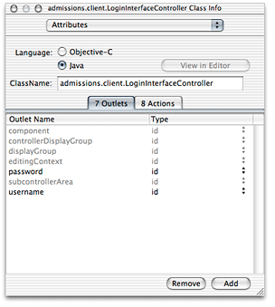
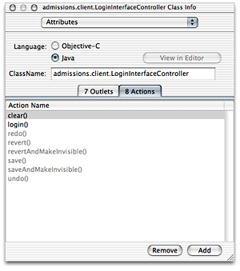
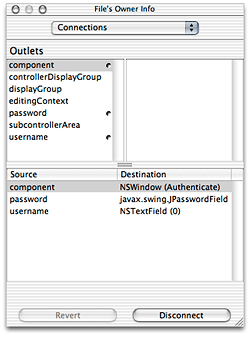
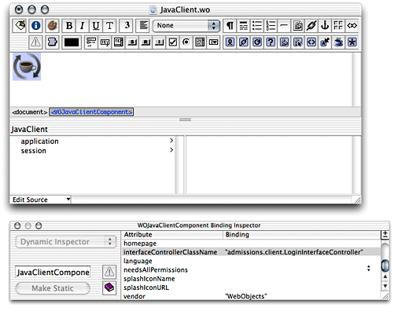
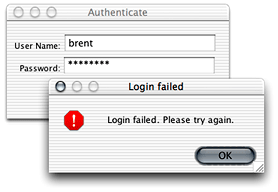

> 导航：[总目录](../../../README.md) · [documentation](../../../_indexes/documentation.md) · [WebObjects Java Client Programming Guide](Introduction%20to%20WebObjects%20Java%20Client%20Programming%20Guide.md)


[Next](Document%20Revision%20History.md)[Previous](Using%20HTML%20on%20the%20Client.md)

# Building a Login Window

Most of the tasks you need to perform to implement a login window in a Direct to Java Client application are explained in earlier task chapters. This task provides a road map and some helpful hints to successfully implement a login window in your application.

The WebObjects Java Client examples use the JCAuthentication framework to provide a sophisticated login window for Java Client applications that includes logout, password change, and registration capabilities. It is considerably more complex than the simple login window this chapter describes and you’ll probably want to use it to implement authentication functionality in your applications.

However, the JCAuthentication framework is rather complex and is difficult to understand for those new to Java Client development. This chapter is provided to help you understand the basic concepts in implementing access controls in a Java Client application. After you grasp the concepts in this chapter, you should seriously consider using the JCAuthentication framework in your application rather than an authentication framework you build from start to finish without the benefit of any pre-built components.

First, you’ll build the login window’s user interface. Then, you’ll provide logic for authenticating users to a data store. Finally, you’ll intercept the default startup sequence for Direct to Java Client applications to disable certain menu items and windows.

The first step in building a login window is to build the user interface for it. Add a nib file to your project and open it in Interface Builder. Add two text fields with labels and two buttons. A suggestion appears in Figure 24-1.

__Figure 24-1__  Login window user interface



If you want to make the password text field secure (so that typing in it produces asterisks rather than characters), see [Custom Views](Using%20Custom%20Views%20in%20Nib%20Files.md#apple-f4xwc4dqnrsv64tfmyxwi33df52wszbpkridgmbqgaytamjxfvbuqmzrguwugrkhivceussi) to learn how to add custom view widgets to a nib file. Substitute `javax.swing.JPasswordField` in place of the custom view widget used in that section.

Then, add outlets to File’s Owner for each text field, naming them `username` and `password`. See [Custom Views](Using%20Custom%20Views%20in%20Nib%20Files.md#apple-f4xwc4dqnrsv64tfmyxwi33df52wszbpkridgmbqgaytamjxfvbuqmzrguwugrkhivceussi) or [Programmatic Access to Interface Components](Nondirect%20Java%20Client%20Development.md#apple-f4xwc4dqnrsv64tfmyxwi33df52wszbpkridgmbqgaytamjxfvbuqmzqgqwviucykjcummrx) to learn how to add outlets. The outlets pane should then appear as shown in Figure 24-2.

__Figure 24-2__  Add outlets named `username` and `password`



Also add two new actions called `login` and `clear`. You add actions the same way as you add outlets except you add them in the Actions pane rather than in the Outlets pane. The Actions pane should then appear as in Figure 24-3.

__Figure 24-3__  Add actions



Finally, connect the outlets and the actions to the widgets you added. Control-drag from File’s Owner to the User Name text field and bind it to the `username` outlet. Control-drag from File’s Owner to the Password text field and bind it to the `password` outlet. Control-drag from the Log In button to File’s Owner and bind its target aspect to the `login` action. Control-drag from the Clear button to File’s Owner and bind its target aspect to the `clear` action. Also make sure that File’s Owner `component` outlet is bound to the nib file’s Window object. The File’s Owner connections should then appear as shown in Figure 24-4.

__Figure 24-4__  File’s Owner with new connections



Save the nib file.

To load this interface when the application launches, you use a binding provided on the JavaClient component. Open `JavaClient.wo` in WebObjects Builder and select the WOJavaClientComponent dynamic element, as shown in Figure 24-5.

__Figure 24-5__  Select the WOJavaClientComponent dynamic element



Then, open the WOJavaClientComponent Binding Inspector by choosing Inspector from the Window menu. This shows you all the possible bindings for the WOJavaClientComponent dynamic element. For the `interfaceControllerClassName` binding, enter the fully qualified name of the login nib file you created in this chapter, making sure to put it in quotation marks. An example appears in Figure 24-5.

Save the JavaClientcomponent.

The nib file specified as the value for this binding is loaded when the application starts up. Before you can use the nib file, you need to add instance variables in its controller class that correspond to the outlets you added to the nib. You’ll do this in the next section.

Now that you have a user interface for the login window, you need to add logic to authenticate users. The first step is to add an entity called Person to your application’s EOModel and generate a table for it in the database. This is the table against which your users will be authenticated. The entity needs three attributes: a primary key, an attribute named "username," and an attribute named "password." (The sample code in this section assumes these names but there is no reason you can’t use an entity named "User" and attributes with different names).

You also need to generate client and server Java class files for the Person entity. See [Add Custom Business Logic](Enhancing%20the%20Application.md#apple-f4xwc4dqnrsv64tfmyxwi33df52wszbpkridgmbqgaytamjxfvbuqmzqgmwviucykjcummjqgy) for a reminder of how to do this using EOModeler.

The second step is to extract the values of the two text fields in the nib file. To do this, you need access to the text fields in the nib file’s controller class, as described in [Programmatic Access to Interface Components](Nondirect%20Java%20Client%20Development.md#apple-f4xwc4dqnrsv64tfmyxwi33df52wszbpkridgmbqgaytamjxfvbuqmzqgqwviucykjcummrx). Add an instance variable of type EOTextField for both of the text fields in the nib file. The instance variable’s names must correspond to the name of the outlets with which the text fields are connected. If you made the password field a JPasswordField, make its type JPasswordField.

__Listing 24-1__  Outlets using plain-text fields

```
public EOTextField username, password;
```


__Listing 24-2__  Outlets using one password field

```
public EOTextField username;
public JPasswordField password;
```

EOTextField is defined in the EOInterface Swing package and JPasswordField in the standard Swing package, so add import statements for both packages:

```
import com.webobjects.eointerface.swing.*;
import javax.swing.*;
```

The client part of the application needs a reference to an authenticated user. Since you added a Person entity to your model, a user is an object of type Person. Add another instance variable for a user:

```
private Person _user;
```

Now, add methods for the actions you added to the nib file. You added two actions, `clear` and `login`, so add two methods with those names to the nib file’s controller class:

```
public void login() {}
public void clear() {}
```

The `clear` method simply clears the values of the text fields. Add this code to the class:

```
username.setText("");
password.setText("");
```

The `login` method authenticates users by sending the user-entered values from the User Name and Password text fields to remote methods on the server-side application, which query a data store to perform the authentication. If a user successfully authenticates, the client-side method that invoked the server-side method receives an object (an EOGlobalID) representing the user who authenticated.

Add the method in [Listing 24-3](#apple-f4xwc4dqnrsv64tfmyxwi33df52wszbpkridgmbqgaytamjxfvbuqmzsgewueqkdjfbumrsb) to the nib file’s controller class to perform the remote method invocation. If the user successfully authenticates, the method returns `true` and sets the `_user` instance variable to the enterprise object representing the user who successfully authenticated.

__Listing 24-3__  Client-side login method

```
public boolean clientSideRequestLogin() {
    EOGlobalID person =
          (EOGlobalID)(_distributedObjectStore().invokeStatelessRemoteMethodWithKeyPath(
         "session", "clientSideRequestLogin", new Class[] {String.class, String.class},
           new Object[] {username.getText(), new String(password.getPassword())}));
    if (person != null) {
        EOEditingContext ec = new EOEditingContext();
        _user = (Person)(ec.faultForGlobalID(person, ec));
        return true;
    }
    else
        return false;
}
```

Remember to also add the method that returns the client’s parent object store, as described in [Distributed Object Store](The%20Distribution%20Layer.md#apple-f4xwc4dqnrsv64tfmyxwi33df52wszbpkridgmbqgaytamjxfvbuqmzqgiwviucykjcumnbt) since the remote method invocation is invoked on the client’s parent object store. Remember to also add the import statement for the distributed object store’s package:

```
import com.webobjects.eodistribution.client.*;
```

Now, invoke the client-side method `clientSideRequestLogin` in the `login` method, adding a conditional based on the response, as shown in Listing 24-4.

__Listing 24-4__  The `login` method

```
public void login() {
     if (this.clientSideRequestLogin()) {
        //allow user into application
     }
     else {
        EODialogs.runErrorDialog("Login failed", "Login failed. Please try
           again.");
        }
    }
```

This is all you need to do on the client side. Now, you need to add the method on the server-side that actually performs the authentication. The remote method invocation specifies the key path `session` and the method `clientSideRequestLogin`, so add a method in `Session.java` with that name, as shown in [Listing 24-5](#apple-f4xwc4dqnrsv64tfmyxwi33df52wszbpkridgmbqgaytamjxfvbuqmzsgewueqkdjfeusq2d). The `clientSideRequestLogin` method uses the EOUtilities class which is defined in the access layer, so also add the import statement for `com.webobjects.eoaccess` in `Session.java`.

__Listing 24-5__  Authentication in `Session.java`

```
public EOGlobalID clientSideRequestLogin(String username, String password) {
        EOGenericRecord user;
        EOEditingContext editingContext = new EOEditingContext();

        NSMutableDictionary userCredentials = new NSMutableDictionary();
        userCredentials.setObjectForKey(username, "username");
        userCredentials.setObjectForKey(password, "password");

        NSArray foundObjects = EOUtilities.objectsMatchingValues(editingContext, "Person",
         userCredentials);
        if (foundObjects.count() == 1) {

            user = (EOGenericRecord)foundObjects.objectAtIndex(0);

            return(editingContext.globalIDForObject(user));
        }
        else {
            return null;
        }
    }
```

This method constructs a dictionary based on the values passed in from the client side (the user-entered name and password). Then, using the class `com.webobjects.eoaccess.EOUtilities`, the method performs a fetch against the data store in the Person entity. If a record matching the user’s credentials is found, the method returns the EOGlobalID for that user.

The client-side method `clientSideRequestLogin` receives the result of this method, and if it is not `null`, allows the user into the application. If it receives `null`, however, it displays a dialog with an error message, as shown in Figure 24-6.

__Figure 24-6__  Login failed



Of course, authentication fails if you don’t add users to the entity in the data store on which you perform the fetch specification, so remember to add users.

The login window you added won’t be of much use until you change the default startup sequence to remove the Documents menu and the default query window. Otherwise, users can simply ignore the login window and start using the application.

To learn how to remove the Documents menu, see [The Documents Menu](Restricting%20Access%20to%20an%20Application.md#apple-f4xwc4dqnrsv64tfmyxwi33df52wszbpkridgmbqgaytamjxfvbuqmzqhawviucykjcummzy). To learn how to suppress the default query window, see [The Default Query Window](Restricting%20Access%20to%20an%20Application.md#apple-f4xwc4dqnrsv64tfmyxwi33df52wszbpkridgmbqgaytamjxfvbuqmzqhawviucykjcumnbq).

Finally, now that you’ve disabled all the default mechanisms for users to use the application, you need to provide custom access. In [Listing 24-4](#apple-f4xwc4dqnrsv64tfmyxwi33df52wszbpkridgmbqgaytamjxfvbuqmzsgewueqkdjfbuqscf), currently nothing happens if the user successfully authenticates—except that they don’t see the error dialog stating that authentication failed.

However, there are many things you can do, such as using the controller factory programmatically ([Generating Controllers With the Controller Factory](Generating%20Controllers%20With%20the%20Controller%20Factory.md#apple-f4xwc4dqnrsv64tfmyxwi33df52wszbpkridgmbqgaytamjxfvbuqmzqhewviubr)) or loading another nib file that provides a menu of the application’s primary tasks. You can display the default query window after the user authenticates by adding this code in the `if` part of the conditional in the `login` method in [Listing 24-4](#apple-f4xwc4dqnrsv64tfmyxwi33df52wszbpkridgmbqgaytamjxfvbuqmzsgewueqkdjfbuqscf):

```
EOControllerFactory.sharedControllerFactory().queryControllerWithEntity
(“entityName”)
```

Make sure to add the import statement for the `com.webobjects.eogeneration` package to the nib file.

To load a nib file programmatically, change the `login` method in [Listing 24-4](#apple-f4xwc4dqnrsv64tfmyxwi33df52wszbpkridgmbqgaytamjxfvbuqmzsgewueqkdjfbuqscf) to [Listing 24-6](#apple-f4xwc4dqnrsv64tfmyxwi33df52wszbpkridgmbqgaytamjxfvbuqmzsgewviucykjcumnbu).

__Listing 24-6__  Load a nib file programmatically

```
public void login() {
     if (this.clientSideRequestLogin()) {
        MainMenuInterfaceController mainMenu = new// 1
             MainMenuInterfaceController();// 2
        EOFrameController.runControllerInNewFrame(mainMenu, null);// 3
     }
     else {
        EODialogs.runErrorDialog("Login failed", "Login failed. Please try          again.");
        }
}
```

Code line 1 instantiates a new instance of the nib file named `MainMenuInterfaceController` and code line 2 displays the nib file.

[Next](Document%20Revision%20History.md)[Previous](Using%20HTML%20on%20the%20Client.md)

