> 导航：[总目录](../../../README.md) · [documentation](../../../_indexes/documentation.md) · [WebObjects Java Client Programming Guide](Introduction%20to%20WebObjects%20Java%20Client%20Programming%20Guide.md)


[Next](Inside%20Assistant.md)[Previous](Java%20Client%20Concepts.md)

# Building a Simple Application

This chapter leads you through the creation of a Java Client application starting with the Direct to Java Client project type. You’ll learn how to

- create a simple database using OpenBase Manager
- create tables in that database using EOModeler
- build a Direct to Java Client application using Project Builder
- perform simple customizations of the application using the Direct to Java Client Assistant

You’ll create a simple college admissions application with a rich user interface and database access. The application stores records of prospective students, which allows you to track students throughout the admissions process. Figure 3-1 shows a sample student record from this application.

__Figure 3-1__  Part of the application created in this chapter

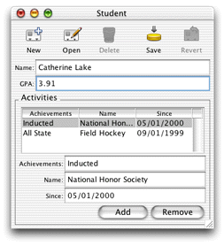

The WebObjects developer software package includes a limited-use version of OpenBase, a SQL database server. Follow these steps to configure a new OpenBase database:

1. In Mac OS X, navigate to `/Applications/OpenBase` and launch OpenBase Manager.
2. Choose New from the Database menu.
3. Name the database `Admissions`. Select the Start Database at Boot option. Choose ISO LATIN 1 from the Internal Encoding pop-up menu. The Configure Database dialog should appear as shown in Figure 3-2.

   __Figure 3-2__  Configuring a new database

   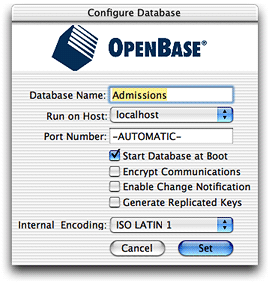
4. Click Set.
5. Select the new database in the database list under localhost and start it manually. Make sure the database is started (denoted by the green icon, as Figure 3-3 shows).

   __Figure 3-3__  OpenBase Manager main window

   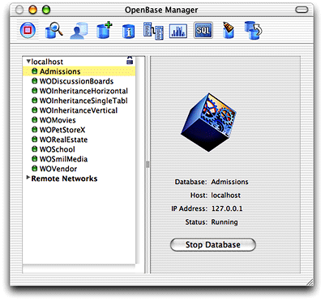
6. Quit OpenBase Manager.

EOModeler is a powerful application that provides tools to build a data model that describes the entity-relationship mapping between the data sources your application uses and the Java business objects that bring that stored data to life. Its product is an EOModel, which contains database connection information, such as the database adaptor, version number, and login information. EOModels also form the foundation of your business logic—they offer an object-oriented view of the tables and relationships in your database. You use EOModeler to

- create tables and relationships in a database
- generate SQL
- generate client and server Java files based on EOModels
- build fetch specifications

A good model is important because Direct to Java Client’s dynamic user-interface generation system analyzes EOModels and generates user interfaces from them. If you build good models, Direct to Java Client can generate a full-featured application automatically without requiring you to write a line of code. In fact, a Direct to Java Client application is a great way to test the integrity of EOModels.

Follow these steps to create an EOModel:

1. In Mac OS X, navigate to `/Developer/Applications` and launch EOModeler.
2. Choose New from the Model menu.
3. Select JDBC as the adaptor.
4. In the JDBC Connection window, enter `jdbc:openbase://localhost/Admissions` in the URL field, as shown in [Figure 3-4](#apple-f4xwc4dqnrsv64tfmyxwi33df52wszbpkridgmbqgaytamjxfvbuqmzqgawueq2jijfecssh). Click OK.

   __Figure 3-4__  JDBC connection information

   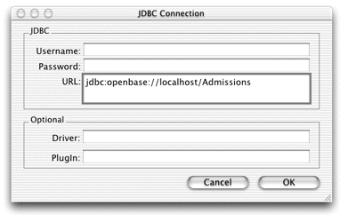
5. Since the database is empty, deselect the four options in the next window and click Next. See Figure 3-5.

   __Figure 3-5__  Deselect all options for this model

   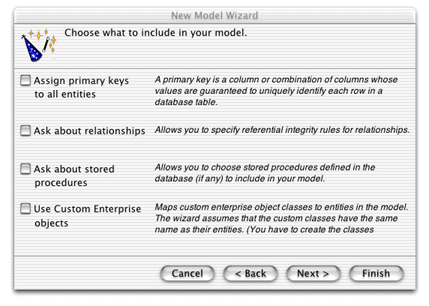
6. There are currently no tables in the database, so click Finish in the Choose Tables to Include dialog.

Step 3: WebObjects 5 supports databases with JDBC Type 2 and Type 4 connectivity. Oracle, OpenBase, MSSQL 2000, Sybase, and MySQL are qualified for WebObjects 5.2. See the document _Post-Installation Guide_ for more exact specifications. Third parties have developed JDBC adaptor plug-ins for other JDBC-compliant databases. See the Apple Support Knowledge Base for information on creating custom JDBC adaptor plug-ins.

WebObjects database connectivity is not limited to JDBC-compliant databases. In principle, you can also write adaptors for ERP systems and even flat file systems. WebObjects 5.2 also supports data stores with JNDI connectivity.

Step 5: EOModeler works by reverse-engineering your database. So, if your database is already populated with tables, primary keys, relationships, and stored procedures, you can tell EOModeler to consider these attributes when building a model.

- Assign primary keys to all entities—When reading and writing to databases, the access layer of Enterprise Objects uses primary keys to uniquely identify enterprise objects and to map them to the appropriate database row. Therefore, each entity in your model needs a primary key. The EOModeler Wizard automatically assigns primary keys to the model if it finds primary key information in the database.

  However, if primary keys aren’t defined in the database schema information, the wizard prompts you to choose primary keys.
- Ask about relationships—If the Wizard finds foreign key definitions in the database schema information, it includes the corresponding relationships in the model. However, foreign key definitions in the schema don’t provide enough information for the Wizard to set all of a relationship’s options. If you select this option you will be prompted to provide additional information, such as the join type, delete rule, batch faulting batch size, and more.
- Ask about stored procedures—Selecting this option causes the Wizard to display the stored procedures it finds in the schema and allows you to choose which to include in your model.
- Use Custom Enterprise objects—Each entity in the model corresponds to a table in the database and each has a corresponding Java class. This Java class can be an instance of `com.webobjects.eocontrol.EOGenericRecord` or a custom subclass of EOGenericRecord.

  If you deselect this option, the Wizard maps all database tables to EOGenericRecord classes. Otherwise, it maps each entity to a subclass of EOGenericRecord of the same name (a table named “STUDENT” corresponds to an entity named “Student,” which corresponds to a Java class named “Student.java.”)

  You use custom enterprise object classes to add custom business logic to your application (which is quite common).

EOModeler creates an empty model containing just a database connection dictionary, which specifies the adaptor type, database URL, and other basic information. Click the root of the object tree (probably titled “UNTITLED0”), and then choose Inspector from the Tools menu to see the database connection dictionary.

Follow these steps to add a table with attributes to the model:

1. Create a new entity by selecting Add Entity from the Property menu.
2. Select Inspector from the Tools menu if it is not already present. When you created an entity in step 1, the Inspector focused on that entity, so its title is now “Entity Inspector.”
3. In the Entity Inspector, change the Name field to `Student` and the Table Name field to `STUDENT`. Leave the Class field EOGenericRecord. See Figure 3-6.

   __Figure 3-6__  Entity Inspector

   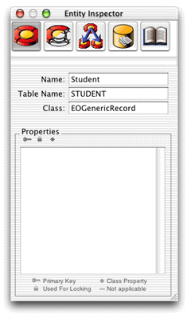
4. Select the Student entity in the tree view and add a new attribute to it by selecting Add Attribute from the Property menu. The title of the Inspector window changes to “Attribute Inspector.”
5. In the Attribute Inspector, change the Name field to `name` and the Column name to `NAME`.
6. In the External Type field, enter `char`.
7. Choose String from the Internal Data Type pop-up menu, and enter `50` in the External Width field, as shown in Figure 3-7. Make sure to press Enter or tab out of the field so the value sticks.

   __Figure 3-7__  Attribute Inspector for the `name` attribute

   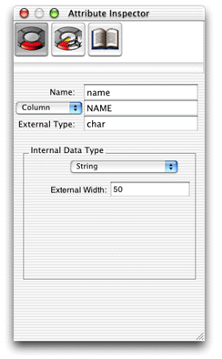
8. Add a second attribute named `gpa` with Column name `GPA`. Enter `int` in the External Type field and choose Integer for Internal Data Type. The types selected here are the suboptimal part of the model that will be corrected in a later step.

Step 3: In this book, the naming conventions for entities and attributes follow standard Java naming conventions and common relational database conventions.

Entities adhere to the naming convention for Java classes: The name begins with a capital letter, and the first letter of inner words is capitalized, such as “NewStudent.”

Table names adhere to the common relational database convention of capitalizing every letter, and separating inner words with the underscore (_) character, such as “NEW_STUDENT.”

Attribute names follow the Java convention for methods: The name begins with a lowercase letter, and the first letter of inner words is capitalized, such as “firstName.”

Column names adhere to the same database conventions that tables do.

Step 6: When adding attributes, you can choose the external type from a pop-up menu in EOModeler’s table view, rather than type it in. Simply click the downward pointing arrow to the right of a row in the External Type column. Doing this will also familiarize you with the different external types for the database you are using.

Simply creating entities with attributes does not make a complete model. You must also assign a primary key to the entity and select certain properties to send to the client. Follow these steps to complete the basic model:

1. Add a third attribute to the Student entity named `studentID`. The column name is `STUDENT_ID`. Give it an external type of `int` and choose Integer for the internal data type. This attribute is the entity’s primary key. See Figure 3-8.

   __Figure 3-8__  The primary key attribute

   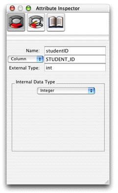
2. In table mode (Tools > Table Mode), there are three icons in the table heads of the attributes pane for an entity, as shown in Figure 3-9.

   __Figure 3-9__  Default attribute columns in table mode

   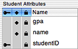

   If the key icon is present for a particular attribute, that attribute is or is part of the entity’s primary key. If the diamond icon is present for a particular attribute, that attribute is a server-side class property. If the pad lock icon is present for a particular attribute, that attribute is used for optimistic locking. Make the `studentID` attribute the primary key by clicking in its key field.
3. Unmark the primary key (`studentID`) as a server-side class property by clicking the diamond icon to its left.
4. To select which attributes are available to the client-side application, you need to add a view column in table mode. From the Add Column pop-up menu, choose Client-Side Class Property. This adds a column with two opposing arrows to the attribute’s table. (You can remove columns by selecting a column and pressing the Delete key). Make sure that only the `gpa` and `name` attributes are selected as client-side class properties, as shown in [Figure 3-10](#apple-f4xwc4dqnrsv64tfmyxwi33df52wszbpkridgmbqgaytamjxfvbuqmzqgawviucykjcumnjz).
5. Save the model as `Admissions.eomodeld`. It should look like [Figure 3-10](#apple-f4xwc4dqnrsv64tfmyxwi33df52wszbpkridgmbqgaytamjxfvbuqmzqgawviucykjcumnjz), though the columns you see in the table view may be different if you’ve added or removed columns from it.

   __Figure 3-10__  The finished model

   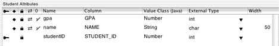

Step 2: Each of the records in a table must be unique—no two records can contain exactly the same values. To ensure this, each entity must contain an attribute that’s guaranteed to represent a unique value for each record; this value is called the entity’s primary key.

By default, EOModeler makes all of an entity’s attributes class properties. When an attribute is a class property, it means that the property is included in your class definition and that it can be fetched from the database. To put it another way, only attributes that are marked as class properties become part of your enterprise objects.

You should mark as class properties only those attributes whose values are meaningful in the objects that are created when you fetch from the database. Attributes that are essentially database artifacts, such as primary and foreign keys, shouldn’t be marked as class properties unless the key has meaning to the user and must be displayed in the user interface.

There are two types of class properties: client-side class properties and server-side class properties. EOModeler indicates that an attribute is a server-side class property with the diamond icon. Client-side class properties are represented by the double-arrow icon.

Step 3: Primary keys are of no use to client-side classes, so they need to be unmarked as client-side class properties.

Step 4: Likewise, primary keys are of no use to server-side classes, so they need to be unmarked as server-side class properties.

Now that you’ve built an EOModel, you need to write the table information to the database. Fortunately, EOModeler generates SQL for you; just follow these steps:

1. Select the Student entity in the tree view.
2. Choose Generate SQL from the Property menu.
3. Deselect all options except Create Tables, Primary Key Constraints, and Create Primary Key Support, as shown in Figure 3-11.
4. Click Execute SQL. The SQL generated is specific to OpenBase. EOModeler knows to generate OpenBase-specific SQL because of the adaptor plug-in the model is using. Were the model connecting to an Oracle database, Oracle-specific SQL would instead be generated.

   __Figure 3-11__  Generate SQL

   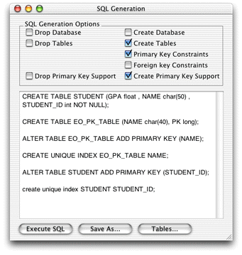
5. To verify the table was written to the database, in OpenBase Manager, select the Admissions database and then choose Schema from the Database menu. You should see two tables: EO_PK_TABLE and STUDENT. Select the Student table and verify that the attributes you added to the model were written to the database.

Step 3: EOModeler’s SQL generation feature generates database-specific SQL based on the EOAdaptor chosen for the model. These are the eight SQL generation options:

- __Drop Database__ deletes all entity tables, key constraints, and primary key support tables. This option may not be available for some data stores.
- __Drop Tables__ deletes only the entity tables selected in EOModeler’s main window.
- __Drop Primary Key Support__ deletes primary key support from the database; for OpenBase databases, this option deletes the EO_PK_TABLE table.
- __Create Database__ generates tables in the database for all entities in the EOModel.
- __Create Tables__ generates tables in the database only for the models selected in EOModeler’s main window.
- __Primary Key Constraints__ generates database-specific key constraints.
- __Foreign Key Constraints__ generates database-specific key constraints.
- __Create Primary Key Support__ generates the `EO_PK_TABLE` for OpenBase databases.

Step 5: The EO_PK_TABLE table is used by Enterprise Objects when it generates primary keys. This table is written only to certain data sources when you generate SQL from EOModeler. The table is not generated, for example, when the data source is an Oracle database.

Project Builder is the WebObjects integrated development environment. Its many functions include these:

- creating working projects from project templates
- organizing project files and resources
- source-code editing
- compiling and debugging projects
- running projects
- communicating with other WebObjects development tools

Project Builder is a complex, feature-rich development environment that is designed to support many types of application development from Mac OS X device drivers to WebObjects rule-based Java applications. Because it supports so many different kinds of development, it takes some time to learn.

When you launch Project Builder for the first time, you’ll be asked a few questions including what kind of user interface you want to use. The Window Environment pane of the Project Builder setup assistant appears as shown in Figure 3-12.

__Figure 3-12__  Project Builder’s Window Environment options

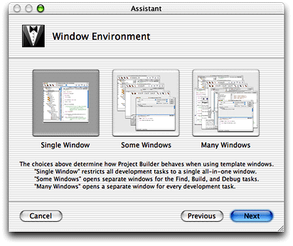

The first versions of Project Builder in Mac OS X limited you to a single window in which all files and operations in a project occurred. With the Mac OS X 10.2 version of Project Builder, a new multiwindow user interface is available, which provides a much more flexible workspace.

The tutorials in this book assume you’re working in Single Window mode but you’re free to choose another window mode if you’re comfortable with Project Builder.

Project Builder provides an assistant to help you build a Java Client application starting with the Direct to Java Client project type. Follow these steps to create a new project:

1. In Mac OS X, navigate to `/Developer/Applications` and launch Project Builder.
2. Choose New Project from the File menu.
3. Select Direct to Java Client Application (Three Tier) under the WebObjects group as the new project type and click Next.
4. Name the project `Admissions` and choose a location in the file system that has no spaces in the complete pathname. Click Next.
5. In the Enable J2EE Integration pane, make sure neither option is selected, and click Next.
6. In the Choose Adaptors pane, select JavaJDBCAdaptor.framework and click Next.
7. In the Choose Frameworks pane, click Next.
8. In the Choose EOModels pane, click Add and select the EOModel you just created. Then click Next. See Figure 3-13.

   __Figure 3-13__  Choose the EOModel

   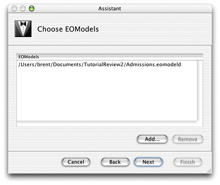
9. In the Choose Download Classes pane, select the option “Download main bundle and custom framework classes” and click Next. See Figure 3-14.

   __Figure 3-14__  Configure the class loader

   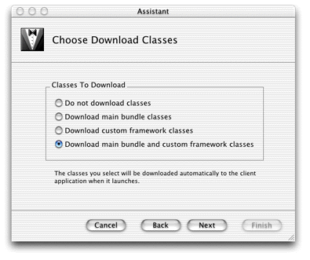
10. In the Web Start pane, you can enter your company’s name in the Vendor Name field and a description of the application in the Description field, but neither is required. This pane is used to configure the Web Start JNLP file when deploying the client application.
11. In the Build and Launch Project pane, make sure “Build and launch project now” is selected and click Finish. Project Builder sets up the project, builds it, and runs it. If you’re developing in Mac OS X, the client application is automatically launched. If you’re developing in Windows, however, you must manually launch the client application. See [Add a Launch Argument](#apple-f4xwc4dqnrsv64tfmyxwi33df52wszbpkridgmbqgaytamjxfvbuqmzqgawviucykjcummrt) to learn how to manually build and run the application.

    If you’re developing in Mac OS X, you can skip to [Using the Application](#apple-f4xwc4dqnrsv64tfmyxwi33df52wszbpkridgmbqgaytamjxfvbuqmzqgawviucykjcummzs). Or, if you want to learn more about the default project, Project Builder, launch arguments, and manually running the client application, continue with the next section.

Step 7: It is common to build a custom framework to contain your EOModels and other custom business logic. You add custom frameworks to your project in this step.

Step 8: The EOModel you select is copied into your project’s directory. From this point on, open the model from within the project to edit it.

Step 9: This step configures the Java Client Class Loader feature that first shipped with WebObjects 5.1. It facilitates the download of classes to the client for Java Client applications that are deployed as desktop applications. It does not apply to client applications that are deployed with Web Start or as applets. The class loader has four configuration options:

- __Do not download classes__ suppresses the class loader.
- __Download main bundle class__ downloads the `.woa` build product that includes custom Java classes defined in your project (but not classes defined in custom frameworks).
- __Download custom framework classes__ downloads custom frameworks that your project links against, including custom Java classes in these frameworks.
- __Download main bundle and custom framework classes__ downloads the `.woa` build product and custom frameworks your project links against.

Unlike applets running in browsers, Java desktop applications do not have an automatic mechanism to download classes. This usually requires you to install the complete application manually, which can be inconvenient and makes updating the software complicated.

But with the new Java Client Class Loader feature you need only install a Java Client base system (including Foundation, EOControl, and EOAccess) on the client and download all classes specific to your application (business logic, interface controllers, user interface code, and so forth) at startup time. You configure whether and which classes should be downloaded through bindings of the WOJavaClientComponent of the WebObjects server-side application (the Project Builder Assistant for Java Client projects configures these bindings for you based on the selection you make in the Choose Download Classes pane). All you have to supply on the client is the base Enterprise Objects stack, which is contained in the `wojavaclient.jar` file.

The four possible bindings for the Java Client Class Loader are

- `noDownloadClientClasses`
- `mainBundleClientClasses`
- `customFrameworksClientClasses`
- `customBundlesClientClasses`

This feature is useful for deployment (since installing an update of the client desktop application is necessary only when you switch the version of WebObjects you use, not when you update your own custom classes) and for development (since you can create generic launch programs or scripts without worrying about the classpath).

For Direct to Java Client projects, the Project Builder Assistant creates a fully functional application. Take a moment to examine the default project.

As in all WebObjects applications, `Application.java`, `Session.java`, `DirectAction.java`, and `Main.java` are present, along with `Main.wo`. In the Resources group, notice that there is no interface file (no nib file), only the EOModel and an empty Direct to Web model (the `user.d2wmodel` file) to store rules generated by the Direct to Java Client Assistant.

Project Builder offers several tools that allow you to visually organize all the files in a project. This allows you to easily locate a project’s files in a central repository. It also lets you assign files to specific targets to facilitate the building process.

A group is a collection of related files, similar to folders or directories in a file system. They allow you to collect all of your project’s components, resources, classes, frameworks, and other groups under general categories. There is no restriction on the type of file you can put in a group.

When you create a Direct to Java Client application, Project Builder creates a default hierarchy with eight major groups. You can modify this organization by adding, removing, or deleting groups, and by moving files between groups. Keep in mind that groups are useful only for organizational purposes: they have no effect on how their content or the application behaves.

These are the eight major groups in a Direct to Java Client application:

- __Classes__ stores the core Java files (`.java`) in the project such as `Application.java`, `Session.java`, and `DirectAction.java`. The Java files related to components, such as `Main.java`, are by default organized in subgroups of the Web Components group.
- __Web Components__ stores the WebObjects components used in your project. By default, Java Client applications have a single WebObjects component, `Main.wo`. Later on, you’ll put frozen XML user-interface components in this group.
- __Resources__ stores the model files (`.eomodeld`) used in the project as well as custom rule files (`d2w.d2wmodel`) and Direct to Java Client Assistant’s `user.d2wmodel` file.
- __Web Server Resources__ contains image files (`.gif`, `.jpg`, `.png`) and localizable string tables.
- __Interfaces__ contains Interface Builder files (`.nib`) for Java Client applications or for Direct to Java Client applications using frozen interface files.
- __Frameworks__ is a visual representation of the frameworks your project links against at compile and runtime.
- __Documentation__ contains documentation for your application.
- __Products__ contains the build application as well as intermediate build files.

You can freely move files to different groups, rename groups, and remove groups. The only attribute of a project file that really matters is the target with which each file is associated.

When built, Java Client applications include two products: the client product and the server product. The client product is the client-side application and the server product is the server-side application. The client product is the result of the files built for the Web Server target. The server product is the result of the files built for the Application Server target.

The Web Server and Application Server targets are build targets and the Admissions target (or the target named after your application) is the root or aggregate target.

- __Build targets__ are used to configure the settings for a particular target, either the client application or the server application. When you define a build target, you tell Project Builder which files are a part of the target and how to build the target’s product.
- __Root targets__ or aggregate targets are used to group two or more build targets into a single unit. No files are associated with root targets except through their association with build targets. When an aggregate target is built, the build targets it contains are built in turn. The root target is the target you compile on.

Use the Target pop-up menu to switch between a project’s targets, as [Figure 3-15](#apple-f4xwc4dqnrsv64tfmyxwi33df52wszbpkridgmbqgaytamjxfvbuqmzqgawviucykjcumnrt) shows.

__Figure 3-15__  Target pop-up menu

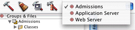

For Java Client applications, the files associated with the Web Server target are Interface Builder archive files (`.nib`), interface controller classes (`.java`), custom controller classes (`.java`), client-side image resources (`.gif`, `.jpg`, `.png`), client-side business logic classes (`.java`), and client-side localized string tables (`Localizable.strings`).

The server-side project files created by Project Builder are distributed across several groups. Most notable of these are the two WebObjects components (WOComponent classes). Starting in WebObjects 5.2, Java Client projects include both a Main component (`Main.wo`) and a JavaClient (`JavaClient.wo`) component. Both components are put in the Web Components group by default. The two components work together to provide the client application via Web Start.

The `Main.html` file in `Main.wo` contains this markup:

```
<HTML>
    <HEAD>
        <TITLE>Main</TITLE>
    </HEAD>
    <BODY>
        <CENTER>
            Please
            <WEBOBJECT NAME=JavaClientLink>click here</WEBOBJECT>
            to start RealEstatePhotos through Web Start.
        </CENTER>
    </BODY>
</HTML>
```

The `Main.wod` file contains this code:

```
JavaClientLink: WOHyperlink {
    href = javaClientLink;
}
```

The `<WEBOBJECT NAME=JavaClientLink>` tag in `Main.html` is bound to the definition of `JavaClientLink` in `Main.wod`, which resolves to the value of the `javaClientLink` method in the component’s class file (`Main.java`). That method returns a URL that points to the Web Start JNLP file of the client application.

The other WOComponent class, `JavaClient.wo`, stores information that is used to dynamically generate the Web Start JNLP file when a user clicks the hyperlink in `Main.wo` that resolves `<WEBOBJECT NAME=JavaClientLink>`. This component contains a number of interesting bindings.

The most important of these is the `applicationClassName` binding. This binding is the switch that determines if a Java Client application is of the direct type or nondirect type. As the project type in this tutorial is of the direct type, the binding specifies `com.webobjects.eogeneration.EODynamicApplication`. The default binding is `com.webobjects.eoapplication.EOApplication`, so if the binding is not present in `Main.wod`, the default is assumed (this is the case for projects begun with the nondirect project type).

The `applicationName`, `applicationDescription`, and `vendor` bindings are used in the Web Start JNLP file, and the `downloadClientClasses` binding is used to configure the Java Client Class Loader feature (see [More About the Java Client Class Loader](#apple-f4xwc4dqnrsv64tfmyxwi33df52wszbpkridgmbqgaytamjxfvbuqmzqgawueq2jjbaukrck) for more details). The optional `interfaceControllerClassName` binding specifies the fully qualified class name of a `.nib` file to load at application launch time.

Bindings are also available to customize the behavior of the distribution layer. See [Distribution Layer Objects](The%20Distribution%20Layer.md#apple-f4xwc4dqnrsv64tfmyxwi33df52wszbpkridgmbqgaytamjxfvbuqmzqgiwviucykjcummzy) for more information on these bindings.

Other server files include

- the `Application.java`, `Session.java`, and `DirectAction.java` class files
- any EOModels your application uses
- the exported bindings for the Main component (`Main.api`)

Figure 3-16 shows the default groups and files.

__Figure 3-16__  The default groups and files

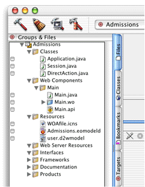

The next section continues building the tutorial project.

Java Client applications have usage patterns that are more like those of desktop applications rather than those of HTML applications. Desktop applications are often left open for hours at a time, with only intermittent usage. Users expect to return to desktop applications after hours of no use and start working again.

The default session timeout (60 minutes) is too short, so you need to set the timeout higher. Setting the timeout to 24 hours (86400 seconds) will better match the usage pattern of Java Client applications.

Follow these steps to change the session timeout:

1. Choose Edit Active Executable from the Project menu.
2. In the Arguments section, click the plus-sign button and enter `-WOSessionTimeOut 86400` as a launch argument as shown in [Figure 3-17](#apple-f4xwc4dqnrsv64tfmyxwi33df52wszbpkridgmbqgaytamjxfvbuqmzqgawueq2jireeiq2k).

   __Figure 3-17__  Add session timeout launch argument

   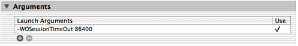

What happens when the session times out and a client application is still running? The next time the client tries to connect to the server (either to save or retrieve data or when a request is made to the rule system), an error dialog appears noting that the session timed out and that any data not saved before the timeout was lost.

The dialog is modal, so the user has no choice but to quit the client application, and there is no way to reconnect except by restarting the client application.

You could implement an auto-save feature whereby the client application would display a warning dialog shortly before the session times out. Or, the client could just automatically save changes shortly before timeout. You would have to write code to poll for the timeout and implement the method `EOEditingContext.saveChanges()` accordingly.

You build a Java Client application using Project Builder. It handles everything for you, including specifying the correct Java classpath, configuring makefiles, creating directories, setting permissions, and so on.

1. Make sure that the Admissions target is selected in the Target pop-up menu as shown in Figure 3-18.

   __Figure 3-18__  Select the Admissions target

   
2. Click the Build button (the one with the hammer) in the toolbar to build the application. The Build pane slides down and displays all console messages during the build, including any errors.

A Java Client application is made up of two parts: a server-side application and a client-side applet or application. You start the server application as you do any WebObjects application using one of these techniques:

- using Project Builder (during development)
- from the command line
- using Monitor (the preferred deployment mechanism)

The book _[WebObjects Deployment Guide Using JavaMonitor](../WebObjects%20Deployment%20Guide%20Using%20JavaMonitor/Introduction%20to%20WebObjects%20Deployment%20Guide%20Using%20JavaMonitor.md#apple-f4xwc4dqnrsv64tfmyxwi33df52wszbpkridgmbqgaytambz)_ covers the second and third options. You can run the server application from Project Builder by clicking the Launch icon or choosing Run Executable from the Debug menu.

By default, Project Builder in Mac OS X runs the client application as a Java desktop application. However, there are many other ways to run the client application. By entering the application URL in a Web browser, you can start the client application as a Web Start application. You can also start applications from the command line or use the client launch script as described later in this section.

In Mac OS X with WebObjects 5.1 and later, the client application is automatically started once the server application is up and running. So if you are developing with that configuration, you can skip this section and continue with [Using the Application](#apple-f4xwc4dqnrsv64tfmyxwi33df52wszbpkridgmbqgaytamjxfvbuqmzqgawviucykjcummzs).

The `-WOAutoOpenClientApplication` flag (which, if not present in the launch arguments assumes the `YES` flag on development systems only) tells Project Builder to run the client launch script, which opens the client application as a Java desktop application.

The other methods of running the client application require some tweaks to the project. Add these launch arguments to make running the project manually a bit easier (add them to the same line as the `WOSessionTimeOut` argument):

`-WOAutoOpenClientApplication NO -WOAutoOpenInBrowser NO -WOPort 8888`

`-WOAutoOpenClientApplication NO` tells Project Builder to not automatically start the client application as a Java desktop application. Add this flag only if you always want to start the client application manually. When this feature is disabled, Project Builder automatically starts the client application as an applet in a Web browser unless it finds the `-WOAutoOpenInBrowser NO` launch argument. Although you can deploy Java Client application as applets, it’s easier and often faster to deploy them as desktop applications during the development process.

By default, WebObjects runs applications on different ports each time they are run. During development, it’s more convenient to use the same port; you can set a fixed port number using `WOPort`. Any arbitrarily high number (8888) is valid, but avoid common ports like 23 (telnet) and 80 (HTTP).

The client launch script is available only in Mac OS X. On WebObjects 5.1 running in Mac OS X, the `-WOAutoOpenClientApplication` flag invokes the client launch script automatically.

In Mac OS X, Project Builder creates a client launch script that includes all the classpath and executable information. All you need to feed it is the application URL. The launch script is named after your project, with a `_Client` suffix. It’s located in your application’s `.woa` in the `Contents/MacOS` directory. By default, an application’s `.woa` file is in the `build` directory in the project’s root directory.

To run the application:

1. Open a Terminal shell and `cd` to that directory (`Admissions.woa/Contents/MacOS`).
2. Copy the application URL from the Run pane in Project Builder.
3. At the shell prompt, paste the URL after entering the following:

   `./Admissions_Client`

   The complete shell command to run the script is `./Admissions_Client http://localhost:8888/cgi-bin/WebObjects/Admissions`. Alternatively, you can enter the command with the full pathname from any directory in the shell: `~/Projects/Admissions/build/Admissions.woa/Contents/MacOS/Admissions_Client http://localhost:8888/cgi-bin/WebObjects/Admissions`

The Java virtual machine starts up, and in a few moments, the Direct to Java Client application is ready to use.

Step 3. The “./” command followed by a script name tells the shell to look for the script name starting in the current directory. The client launch script is simply a shell script, and you may want to open it in a text editor to see exactly what it does.

To start the client as a stand-alone Java application outside a browser, use the `java` command-line tool. The syntax for starting a Java Client application is

```
java -classpath path
com.webobjects.eoapplication.EOApplication
-applicationURL url
-page pageName
```

The `classpath` argument must specify all the Enterprise Object classes and your custom classes. Fortunately, the `wojavaclient.jar` file includes all the Enterprise Object classes the client needs, so you simply need to specify its location in the `classpath` argument.

The `applicationURL` argument specifies the URL to connect to, which is displayed in the server application’s console after initialization. The `page` argument specifies the name of the page that contains the WOJavaClientComponent. If it is not specified, “Main” is assumed, which is the default. Here’s an example:

```
[trivium] brent% java -classpath /System/Library/Java/wojavaclient.jar
com.webobjects.eoapplication.EOApplication -applicationURL http://
trivium.apple.com:8888/cgi-bin/WebObjects/Admissions
```


In Mac OS X, you can package Java Cilent applications as double-clickable desktop applications. This deployment method is not practical during development and is more appropriate during deployment. See [Desktop Applications](Deploying%20Client%20Applications.md#apple-f4xwc4dqnrsv64tfmyxwi33df52wszbpkridgmbqgaytamjxfvbuqmzqg4wueqkcincegrki) for instructions.

When you launch a Direct to Java Client application, the generation layer analyzes your EOModel and generates the user interface accordingly. Currently, your model and database have only a single table, and by default, Direct to Java Client displays a window to enumerate that table, as shown in [Figure 3-19](#apple-f4xwc4dqnrsv64tfmyxwi33df52wszbpkridgmbqgaytamjxfvbuqmzqgawueqsdjfbucssj).

__Figure 3-19__  Default enumeration window

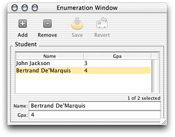

You can add, delete, and save records, as well as revert changes made since the last save. You can also rearrange the columns.

So far, you haven’t written a single line of code, yet the Enterprise Object technology has provided the following for you:

- automatic primary-key generation when you insert new objects
- communication between client and server
- coordination between user interface and data store

Notice that only the attributes you marked as client-side class properties are displayed in the client. `studentID`, the entity’s primary key, isn’t displayed since it wasn’t marked as a client-side class property in the EOModel.

There is a significant problem with the GPA field. You’ll notice that decimal points are automatically truncated, which is unacceptable when recording GPAs. This is due to that field’s data type: `int` (external) and `Integer` (internal).

Since uncustomized Direct to Java Client user interfaces are contingent on the contents of their corresponding EOModels, you need to edit the EOModel to correct this problem.

Follow these steps to edit the EOModel:

1. First, quit the client application by choosing Quit from the File menu, and quit the server application by clicking the Stop button in the Project Builder toolbar.
2. When you created the project, Project Builder made a copy of the EOModel and put it in the project directory. So, you must edit that copy. Find `Admissions.eomodeld` in the Resources group and double-click it to open it in EOModeler.
3. Change the external type for the `gpa` attribute to `float`. You can do this with the Inspector or in the table view. In the Inspector, change the internal data type to `Double`. The model should now resemble Figure 3-20.

   __Figure 3-20__  Revised model

   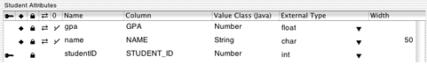
4. External types are database-specific, so you need to synchronize the model with the database. Save the model, then select the root of the entity tree (Admissions) and choose Synchronize Schema from the Model menu. Deselect all three options in the Schema Synchronization window as shown in Figure 3-21. Then click Synchronize.

   __Figure 3-21__  Schema Synchronization window

   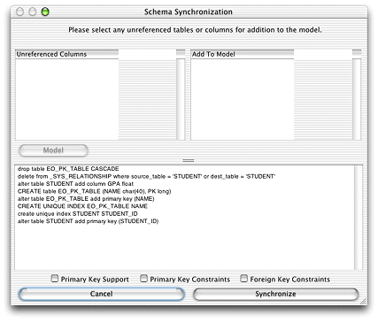
5. In OpenBase Manager, verify that the data type for the `gpa` attribute changed. Do this by choosing the Admissions database and clicking the Schema Design button to view the database’s tables.
6. Save the model, build the project, and run both the client and server applications.
7. Enter a few new records, and save changes. Notice how decimals are now preserved as shown in Figure 3-22.

   __Figure 3-22__  Revised enumeration window

   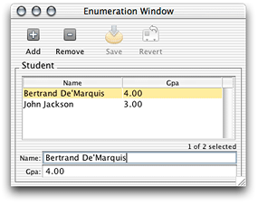

Step 4: Many model modifications do not require you to synchronize the schema. However, anytime you add, remove, or change the name or type of an attribute, synchronization is necessary.

There are many ways to customize Direct to Java Client applications, including the tool Direct to Java Client Assistant. Assistant is a Java application included in every Direct to Java Client application, and it provides an easy way to perform simple customizations. It is described in depth in [Inside Assistant](Inside%20Assistant.md#apple-f4xwc4dqnrsv64tfmyxwi33df52wszbpkridgmbqgaytamjxfvbuqmzqgewviubr).

The following steps introduce you to Assistant:

1. While the Direct to Java Client application is running, select Assistant from the Tools menu.
2. Change the Student entity from an Enumeration entity to a Main entity as shown in Figure 3-23.

   __Figure 3-23__  Change entity type

   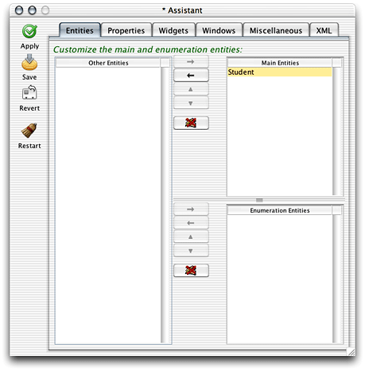
3. Click Save, then Restart to see how the window type changes. You can now search the database using a query string. Alternatively, you can fetch all records in the database by clicking the Find button without entering a query string, as shown in Figure 3-24.

   __Figure 3-24__  Query window with data

   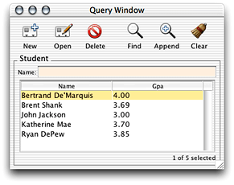
4. Click New to add records; then enter different query strings to test the application. [Figure 3-25](#apple-f4xwc4dqnrsv64tfmyxwi33df52wszbpkridgmbqgaytamjxfvbuqmzqgawueq2jijaugrki) illustrates a query for names containing “k.”

   __Figure 3-25__  Query window searching for names containing “k”

   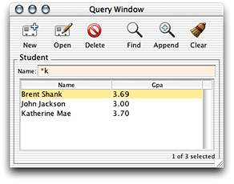
5. You might want to also query on the `gpa` attribute. In Assistant, switch to the Properties pane, and choose “query” in the Task pop-up menu. You’ll notice that the `gpa` property key is listed in the Other Property Keys list. Move it to the Property Keys list as shown in [Figure 3-26](#apple-f4xwc4dqnrsv64tfmyxwi33df52wszbpkridgmbqgaytamjxfvbuqmzqgawueq2jizdukqsd), save, and restart the application. You can now query on the `gpa` field also, as illustrated in [Figure 3-27](#apple-f4xwc4dqnrsv64tfmyxwi33df52wszbpkridgmbqgaytamjxfvbuqmzqgawueq2jijcukq2g). By default, the application provides two fields so you can search for a range of GPAs.

   __Figure 3-26__  Properties pane in Assistant

   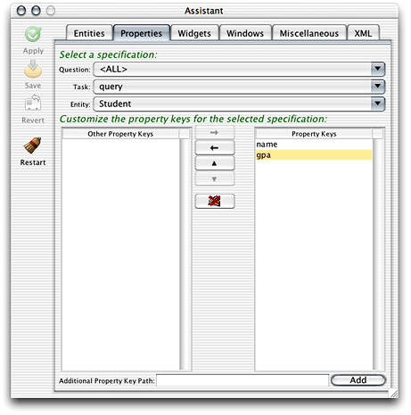

   __Figure 3-27__  Query on GPA

   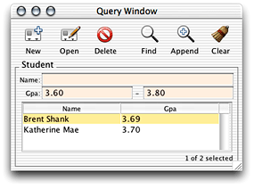
6. You should probably improve the label for the `gpa` field. It should be all capitals. In Assistant, switch to the Widgets pane. Make sure the Property Key pop-up menu reads “gpa.” Under Customize Widget Parameters, change the Label field to `GPA`. Save and restart the application. Notice how the widget label changed.
7. In Assistant, switch to the Windows tab and change the window label to `Admissions`. Save and restart to see the changes.
8. Direct to Java Client user interfaces are defined in XML descriptions. The XML pane in Assistant displays the XML descriptions for the various specifications in an application. Switch to the XML pane and browse the specifications in the current application.

The changes you made in Assistant are stored in the project’s `user.d2wmodel` file. Open this file in Rule Editor to see the rules that were created when you made changes using Assistant. The Rule Editor application is installed in `/Developer/Applications`.

Figure 3-28 shows the left-hand side or conditional of each rule that Assistant created as you customized the application. It says “if the application is in this state, fire the rule and resolve the rule’s right-hand side.”

__Figure 3-28__  Left-hand side of rules

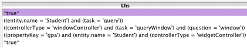

Figure 3-29 shows the right-hand side of each rule. The first rule says that none of the entities in the application are considered enumeration entities. The second rule says to provide fields in query windows for both the `name` and `gpa` properties of the Student entity. The third rule says to use the label “Admissions” for query windows for the Student entity. The fourth rule says to use the label “GPA” for the property key label for the `gpa` attribute of the entity `Student`. The fifth rules says that the Student entity is a main entity.

__Figure 3-29__  Right-hand side of rules

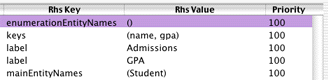

At this point, your application should resemble Figure 3-30.

__Figure 3-30__  The application with simple customizations

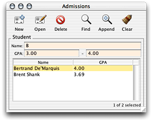

Step 1: To disable Assistant in the client application, pass `-EOAssistantEnabled NO` as a launch argument for the server application.

Assistant is available only when rapid turnaround mode is enabled (it is enabled by default on development systems). Rapid turnaround mode allows the application to access resources from the project directory rather than from the `.woa` bundle, which eases development and testing. Also, in Mac OS X, Assistant runs only if the project is open in Project Builder. Assistant needs access to write out the `user.d2wmodel` file, and it can do this only while the project is open.

Step 2: The Entities pane is selected by default. The entity type determines the window type. That is, each entity type has a default window type. Enumeration entities are represented by Enumeration windows; Main entities are represented by Query windows; Other entities are not represented by any particular window type. The rule system, which will be discussed later on at length, determines these rules.

Now that you’re familiar with Direct to Java Client, you need to expand your EOModel so you can use more of its features. You’ll add a new relationship representing a student’s extracurricular activities.

To create a new relationship, you need more than one entity. Quit the client application, stop the server application, and open the `Admissions.eomodeld` file from within Project Builder. In EOModeler, complete the following steps to enhance the model:

1. Add a new entity named “Activity” with table name “ACTIVITY”. Its class is EOGenericRecord.
2. Add new attributes:

   - Name: `activityID`; Column: ACTIVITY_ID; External Type: `int`; Internal Data Type: `Integer`. Do not make this a client-side class property or a server-side class property.
   - Name: `name`; Column: NAME; External Type: `char`; Internal Data Type: `String`, width 50. Make this a client-side class property. Verify that this attribute is also marked as a server-side class property.
   - Name: `achievements`; Column: ACHIEVEMENTS; External Type: `char`; Internal Data Type: `String`, width 150. Make this a client-side class property. Verify that this attribute is also marked as a server-side class property.
   - Name: `since`; Column: SINCE; External Type: `date`; Internal Data Type: `Date`; Make this a client-side class property. Verify that this attribute is also marked as a server-side class property. _Don’t lock on this attribute: Deselect the lock icon to the left of the attribute to do this._
3. Make `activityID` the primary key in the Activity entity by clicking in the key column.
4. Add a foreign key by copying Student’s primary key (`studentID`) into the Activity table. Do this by selecting `studentID` in the Student table, then choose Copy from the Edit menu, then click in the Activity table, and choose Paste from the Edit menu. Verify that `Activity.studentID` is not marked as a primary key, as a server-side class property, or as a client-side class property in the Activity entity. The new entity should look as shown in [Figure 3-31](#apple-f4xwc4dqnrsv64tfmyxwi33df52wszbpkridgmbqgaytamjxfvbuqmzqgawviucykjcumnry).

   __Figure 3-31__  Activity entity

   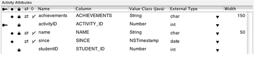
5. Select the Activity entity in the tree view and choose Generate SQL from the Property menu. Since you already generated primary key support the first time you generated SQL, make sure to deselect the option Create Primary Key Support. Only Create Tables and Primary Key Constraints should be selected.

The relationship you’ll add to the model is a _one-to-many_ relationship. That is, one Student object can be related to many Activity objects. In most cases, to-many relationships need at least a foreign key and a primary key. These keys are the attributes on which the relationship joins. Follow these steps to form a relationship between Student and Activity:

1. In diagram view (Tools > Diagram View), Control-drag from Student’s primary key (`studentID`) to Activity’s foreign key (`studentID`) as shown in [Figure 3-32](#apple-f4xwc4dqnrsv64tfmyxwi33df52wszbpkridgmbqgaytamjxfvbuqmzqgawviucykjcumnrz).

   __Figure 3-32__  Relate Student and Activity

   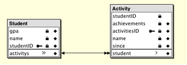

   This action creates a relationship in both entities: a to-many relationship from Student to Activity and a to-one relationship from Activity to Student.
2. The Relationship Inspector allows you to customize the relationship. If it is not visible on the screen, select Inspector from the Tools menu.

   Change the relationship name to “activities.”

   __Figure 3-33__  Relationship Inspector for Student’s `activities` relationship

   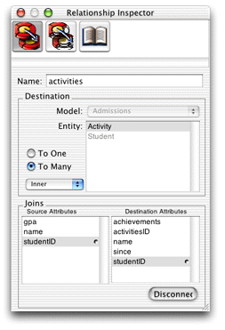
3. As each student can have multiple activities, the relationship from the Student entity to the Activity entity is a to-many relationship. Click the plus sign next to the Student entity in the tree view to show its relationship, `activities`.

   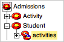

   Select the relationship and in the inspector, make sure To Many is selected and that `studentID` is selected in both the Source Attributes list and the Destination Attributes list, as shown in [Figure 3-33](#apple-f4xwc4dqnrsv64tfmyxwi33df52wszbpkridgmbqgaytamjxfvbuqmzqgawueq2jjbdeqrsj).
4. Each activity is specific to a particular student so you need to establish ownership and a delete rule that reflects this business logic. With the `activities` relationship selected, switch to the Advanced Relationship Inspector. Select Cascade as the delete rule and select the box labeled Owns Destination, as shown in Figure 3-34.

   __Figure 3-34__  Configure ownership and delete rule

   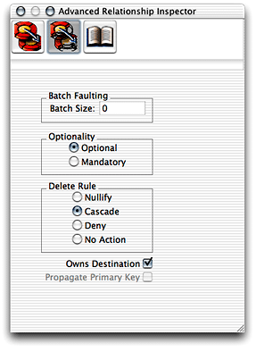
5. Each activity and its attributes are unique to a single student, so the relationship from Activity to Student is a to-one relationship. Click the plus sign next to the Activity entity in the tree view to show its relationship, `student`. Select the relationship and in the inspector, make sure To One is selected. Also verify that `studentID` is selected in both attributes lists as shown in [Figure 3-35](#apple-f4xwc4dqnrsv64tfmyxwi33df52wszbpkridgmbqgaytamjxfvbuqmzqgawueq2ji5aumrch).

   __Figure 3-35__  Relationship Inspector for Activity’s `student` relationship

   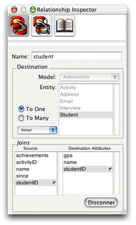
6. As with entity attributes, you can choose to make relationships available to the client application. You need to add the new relationships as client-side class properties. Switch to table mode (Tools > Table Mode). Below the attributes table is a table for relationships. You may need to add the client-side class properties column to the relationship view.

   If the Student entity is selected in the tree view, its relationship (`activities`) is shown in this table, as [Figure 3-36](#apple-f4xwc4dqnrsv64tfmyxwi33df52wszbpkridgmbqgaytamjxfvbuqmzqgawviucykjcumnzq) illustrates. Selecting the Activity entity displays its relationship (`student`), as [Figure 3-37](#apple-f4xwc4dqnrsv64tfmyxwi33df52wszbpkridgmbqgaytamjxfvbuqmzqgawviucykjcumnzr) illustrates. Make the `activities` relationship in the Student entity a client-side class property by clicking in the double-arrow column to the left of it, as shown in [Figure 3-36](#apple-f4xwc4dqnrsv64tfmyxwi33df52wszbpkridgmbqgaytamjxfvbuqmzqgawviucykjcumnzq). However, do not make the `student` relationship in the Activity entity a client-side class property, as shown in [Figure 3-37](#apple-f4xwc4dqnrsv64tfmyxwi33df52wszbpkridgmbqgaytamjxfvbuqmzqgawviucykjcumnzr).

   __Figure 3-36__  Make Student to Activity relationship a client-side class property

   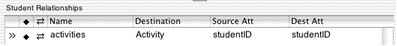

   __Figure 3-37__  Do not make Activity to Student relationship a client-side class property

   
7. Save the model.

You do not need to synchronize the schema as the Enterprise Object technology manages the relationships for you. This helps you build reusable enterprise object models since the relationship is not database-specific.

Build the project and run both the client and server applications. Direct to Java Client analyzes the altered EOModel file and generates the user interface based on the new relationship. Now, when you make a new Student record you can also add activities for that student as shown in [Figure 3-38](#apple-f4xwc4dqnrsv64tfmyxwi33df52wszbpkridgmbqgaytamjxfvbuqmzqgawueq2ji5cuiqse).

__Figure 3-38__  Add activities to new Student record

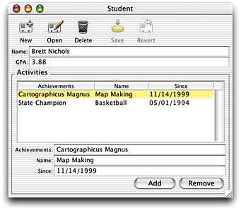

When you added the Activity entity to the model and related it to the Student entity, you changed how the rule system considers the two entities. They are both now considered Main entities. However, this doesn’t precisely fit the application’s requirements. The Student entity’s `activities` relationship is a master-detail relationship in which Student objects are the master objects and Activity objects are the detail objects. Each Activity record is specific to a single student so that you can only add Activity records from within a Student record—you cannot add Activity records that aren’t immediately related to a Student record.

For the rule system to provide a user interface that reflects this relationship, you need to explicitly make the Activity entity an “other” entity in Assistant. Doing this allows you to add activities to a Student record by clicking the Add button in form windows for the Student entity, but it doesn’t allow users to query on Activity records or add Activity records outside the scope of a Student record.

If you make Activity an enumeration or a main entity using Assistant, the application provides different mechanisms to add activities to student records. Experiment with this by changing Activity’s entity type in Assistant and restarting the client application.

Make sure to change the Activity entity back to an “other” entity to successfully complete the other tutorials.

[The Distribution Layer](The%20Distribution%20Layer.md#apple-f4xwc4dqnrsv64tfmyxwi33df52wszbpkridgmbqgaytamjxfvbuqmzqgiwviubr) provides an important overview of how client-server communication in Java Client applications works. Some of the concepts in that chapter are put into practice in [Enhancing the Application](Enhancing%20the%20Application.md#apple-f4xwc4dqnrsv64tfmyxwi33df52wszbpkridgmbqgaytamjxfvbuqmzqgmwviubr) However, you may want to continue with the second tutorial and then read the chapter on the distribution layer as it assumes a deeper understanding of Java Client concepts that you’ll learn in [Enhancing the Application](Enhancing%20the%20Application.md#apple-f4xwc4dqnrsv64tfmyxwi33df52wszbpkridgmbqgaytamjxfvbuqmzqgmwviubr).

[Next](Inside%20Assistant.md)[Previous](Java%20Client%20Concepts.md)

