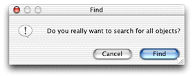
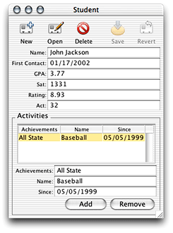

> 导航：[总目录](../../../README.md) · [documentation](../../../_indexes/documentation.md) · [WebObjects Java Client Programming Guide](Introduction%20to%20WebObjects%20Java%20Client%20Programming%20Guide.md)


[Next](Freezing%20XML%20User%20Interfaces.md)[Previous](Adding%20Custom%20Actions%20to%20Controllers.md)

# Common Rules

This chapter provides examples of some common rules you can use to customize applications. It first provides a section listing common left-hand side qualifier keys. You use these keys to tell the rule system which part of an application to affect with a particular rule.

Most rules that you write are likely to use the following keys in the left-hand side qualifier:

- `task`: A name of the task for which information is requested from the rule system. The values used in the default rule system are

  - `form` (editing an enterprise object)
  - `list` (listing multiple enterprise objects)
  - `query` (qualifying enterprise objects for a search)
  - `identify` (describing enterprise objects in a short form)
  - `select` (a combination of query and list)
  - `editor` (a combination of list and form)
  - `queryWindow` (the task for requesting the complete query window)
  - `enumerationWindow` (the task for requesting the complete enumeration window)
- `entity`: The entity the rule system works on for a particular rule. You most often identify an entity using the key path `entity.name`.
- `propertyKey`; `attribute`; `relationship`: The property key the rule system works on for a particular rule. You can use `attribute.name` or `relationship.name` rather than `propertyKey`. You’d likely do this if an entity contains ambiguously named property keys, such as an attribute and relationship that have the same name.

You can further restrict a left-hand side qualifier using these keys:

- `question`: A question the rule system is supposed to answer. The most important question keys in the rule system are

  - `window`
  - `modalDialog`
  - `controller`
  - `propertyKeys`
  - `actions`
  - `availableSpecifications`
  - `defaultSpecifications`
  - `userInterfaceParameters`
- `controllerType`: An indication of what kind of controller the rule system works on for a particular rule. The values in the default rule system are

  - `actionWidgetController`
  - `dividingController`
  - `groupingController`
  - `entityController`
  - `inspectorController`
  - `modalDialogController`
  - `statisticsController`
  - `tableController`
  - `splitController`
  - `widgetController`
  - `windowController`
- `isRootController`: Specifies whether the rule system is working on the root controller (in which case this key evaluates to `null`) or a subcontroller (in which case this key evaluates to `false`).
- `rootQuestion`, `rootTask`, `rootEntity`: These represent copies of the `question`, `task`, and `entity` values of the original request triggered by the controller factory. For example, through `rootTask` you can find out whether you are in a `form` window.

_Problem:_ By default when you query on an entity without supplying a qualifier, you are presented with a dialog to confirm the action, as shown in Figure 15-1. This behavior is intended to warn users about performing unqualified queries of the data store, which could fetch hundreds or thousands of records.

__Figure 15-1__  Confirm dialog on unqualified queries



_Solution:_ Use the rule system to override the default behavior.

The confirmation dialog appears when a user invokes an unqualified query (a query with no search criteria). Whenever you want to modify the behavior of a controller in a Direct to Java Client application, you should first consult [Controllers and Actions Reference](Controllers%20and%20Actions%20Reference.md#apple-f4xwc4dqnrsv64tfmyxwi33df52wszbpkridgmbqgaytamjxfvbuqmzsgmwviubr). If you look for EOQueryController, you’ll find an XML attribute called `runsConfirmDialogForEmptyQualifiers`. This is the switch you’re looking for. So to disable the confirmation dialog, add this rule to your application’s `d2w.d2wmodel` file:

**Left-Hand Side:**
: `*true*`

**Key:**
: `runsConfirmDialogForEmptyQualifiers`

**Value:**
: `"false"`

**Priority:**
: `50`

_Problem:_ You want to specify a minimum width and height for all windows in your application.

_Solution:_ Use the rule system.

To set the minimum width of all windows in your application to 512 pixels, use this rule:

**Left-Hand Side:**
: `(controllerType='windowController')`

**Key:**
: `minimumWidth`

**Value:**
: `512`

**Priority:**
: `50`

To set the minimum height of all windows in your application to 350 pixels, use this rule:

**Left-Hand Side:**
: `(controllerType='windowController')`

**Key:**
: `minimumHeight`

**Value:**
: `350`

**Priority:**
: `50`

_Problem:_ You want to right-align all widgets that contain numbers.

_Solution:_ Write a rule.

To right-align all widgets in your application whose attribute’s value class is a number type, use this rule:

**Left-Hand Side:**
: `((not (attribute= nil)) and (attribute.valueClassName='NSNumber') or (attribute.valueClassName='NSDecimalNumber'))`

**Key:**
: `alignment`

**Value:**
: `"Right"`

**Priority:**
: `50`

_Problem:_ You’ve subclassed one of the core controller classes (EOFormController, EOListController, EOQueryController) and you want to use it in place of the default controller throughout the application.

_Solution:_ Write a rule.

To use a custom subclass of EOQueryController called QueryController in the package `com.mypackage`, use this rule:

**Left-Hand Side:**
: `((task='query')and (controllerType='entityController'))`

**Key:**
: `className`

**Value:**
: `"com.mypackage.QueryController"`

**Priority:**
: `50`

To use the custom subclass only for a specific entity, use this rule:

**Left-Hand Side:**
: `((task='query') and (entity.name="<entity name>"))`

**Key:**
: `className`

**Value:**
: `"com.package.CustomQueryController"`

**Priority:**
: `50`

_Problem:_ You want to use a custom widget class for a particular widget in your application.

_Solution:_ Write a rule.

To use a custom widget class for the `creditCardNumber` attribute of a Person entity, use this rule:

**Left-Hand Side:**
: `((entity.name='Person') and (attribute.name="creditCardNumber"))`

**Key:**
: `widgetController`

**Value:**
: `"com.client.CustomController"`

**Priority:**
: `50`

CustomController is a subclass of EOWidgetController:

```
package com.client;

import javax.swing.*;
import com.webobjects.foundation.*;
import com.webobjects.eogeneration.*;
import com.webobjects.eointerface.swing.*;

public class CustomController extends EOWidgetController {

    public CustomController(EOXMLUnarchiver unarchiver) {
        super(unarchiver);
    }

    protected JComponent newWidget() {
        return new JPasswordField("");
    }
}
```


_Problem:_ You want to set custom attributes for a particular type of controller throughout your application.

_Solution:_ Write a rule.

The Direct to Java Client Assistant allows you to set attributes for controllers such as `horizontallyResizable`, `editability`, and `label`. The attributes for each controller are listed in [Controllers and Actions Reference](Controllers%20and%20Actions%20Reference.md#apple-f4xwc4dqnrsv64tfmyxwi33df52wszbpkridgmbqgaytamjxfvbuqmzsgmwviubr). To disable horizontal resizing for all modal dialogs in an application, use this rule:

**Left-Hand Side:**
: `(controllerType = "modalDialogController")`

**Key:**
: `horizontallyResizable`

**Value:**
: `"false"`

**Priority:**
: `50`

_Problem:_ You want to implement continuous change notification for a particular controller.

_Solution:_ Write a rule.

Starting with WebObjects 5.2, some controllers can implement continuous change notification. To implement continuous change notification for a dynamically generated controller using rules, you must first identify the controller and then write a rule with a right-hand side key of `prefersContinuousChangeNotification` and value of `true`.

The example application Admissions in [Enhancing the Application](Enhancing%20the%20Application.md#apple-f4xwc4dqnrsv64tfmyxwi33df52wszbpkridgmbqgaytamjxfvbuqmzqgmwviubr) could benefit from continuous change notification. In the section [Add Custom Code](Enhancing%20the%20Application.md#apple-f4xwc4dqnrsv64tfmyxwi33df52wszbpkridgmbqgaytamjxfvbuqmzqgmwviucykjcummjrga), you added custom business logic that calculates a rating for a particular student record. By default, the rating is updated after the user tabs out of one of the fields that is part of the rating calculation. By applying continuous change notification to one of those fields, however, the rating updates each time a user makes a change in one of those fields.

The user interface element to which you’ll add continuous change notification is the Student form window, as shown in Figure 15-2.

__Figure 15-2__  Field to add continuous change notification to



The first step is to identify the form controller in the rule system. The best way to do this is to open Assistant and make a trivial change to that controller, such as changing the default window location. Doing so writes a rule to the application’s `user.d2wmodel` file. That rule’s left-hand side is how the controller is identified in the rule system. By copying the left-hand side of that rule to the application’s `d2w.d2wmodel` file, you can customize its behavior and characteristics by adding right-hand side keys and values.

Here is the rule to implement continuous change notification in this example:

**Left-Hand Side:**
: `((task = 'form') and (entity.name = 'Student'))`

**Key:**
: `prefersContinuousChangeNotification`

**Value:**
: `"true"`

**Priority:**
: `50`

If you implemented the validation methods in [Validation](Enhancing%20the%20Application.md#apple-f4xwc4dqnrsv64tfmyxwi33df52wszbpkridgmbqgaytamjxfvbuqmzqgmwviucykjcummjsgi), you may see many validation exception dialogs when you implement continuous change notification, depending on what kind of validation you implement.

[Next](Freezing%20XML%20User%20Interfaces.md)[Previous](Adding%20Custom%20Actions%20to%20Controllers.md)

