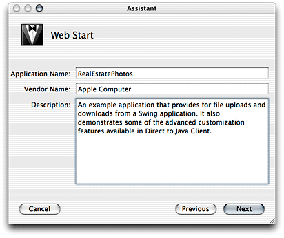
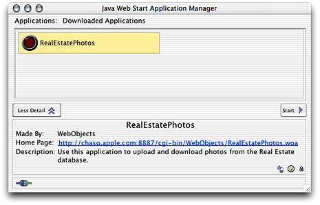
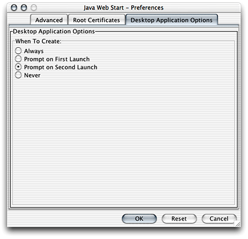
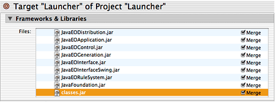
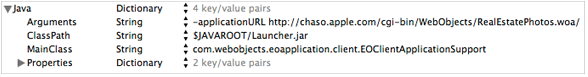

> 导航：[总目录](../../../README.md) · [documentation](../../../_indexes/documentation.md) · [WebObjects Java Client Programming Guide](Introduction%20to%20WebObjects%20Java%20Client%20Programming%20Guide.md)


[Next](Restricting%20Access%20to%20an%20Application.md)[Previous](Inside%20the%20Rule%20System.md)

# Deploying Client Applications

There are two phases in deploying Java Client applications: deploying the server-side application and deploying the client-side application. If you’re familiar with deploying HTML-based WebObjects applications, you already know everything you need to deploy the server-side application. If you’re unfamiliar with this process, however, you need to read the document _[WebObjects Deployment Guide Using JavaMonitor](../WebObjects%20Deployment%20Guide%20Using%20JavaMonitor/Introduction%20to%20WebObjects%20Deployment%20Guide%20Using%20JavaMonitor.md#apple-f4xwc4dqnrsv64tfmyxwi33df52wszbpkridgmbqgaytambz)_.

After you’ve deployed the server-side part of a Java Client application, there are two ways you can deploy the client application. They are described in this chapter, after a section comparing the three options:

- [Deployment Options](#apple-f4xwc4dqnrsv64tfmyxwi33df52wszbpkridgmbqgaytamjxfvbuqmzqg4wueqkcjbauirsb)
- [Web Start](#apple-f4xwc4dqnrsv64tfmyxwi33df52wszbpkridgmbqgaytamjxfvbuqmzqg4wueqkcjfbemssk)
- [Desktop Applications](#apple-f4xwc4dqnrsv64tfmyxwi33df52wszbpkridgmbqgaytamjxfvbuqmzqg4wueqkcincegrki)

HTML-based WebObjects applications require only a Web browser on the client to run on the user’s computer. The client requirements for Java Client desktop applications, however, are considerably more demanding.

Java Client applications can be deployed as real desktop applications or through Web Start. Each deployment option is feasible, but you should carefully evaluate both options after understanding their respective strengths and weaknesses.

- __Installation:__ Applets and Web Start require no installation of the Java Client application on the user’s part, since the Web browser or Web Start application handles the downloading of classes. Applications, however, need to be installed on the client.
- __Upgrades:__ Using applets or Web Start, the upgrade process is invisible to the user. Using applications, the user must perform upgrades manually, and a versioning scheme must be devised to ensure compatibility between client and server.
- __Platform support:__ All deployment options require the presence of JRE 1.3 or later on the client. Mac OS X provides out-of-the-box support for JRE 1.3. On other platforms, the JRE must be downloaded and installed. Internet Explorer for Mac OS X 10.1 supports embedded applets as well, and Sun’s Java plug-in for Web browsers provides support for running applets on other platforms. So, in terms of portability, systems with the correct JRE can run Java Client applications as applets, as full desktop applications, or through Web Start.
- __User experience:__ Running Java Client applications as desktop applications or through Web Start always provides a better user experience than running as applets. Applets can take down the Java virtual machine and other applets, and applets generally don’t have the fit and finish of Java desktop applications or Web Start applications. Java Client applications running as desktop applications or as Web Start applications in Mac OS X take advantage of platform-specific features such as the global menu bar and the dirty window marker.
- __Performance:__ Generally, applications perform better than applets and Web Start applications, since Web browsers provide more security checks than applications and perform other operations that degrade performance. But even so, the performance difference between applets and applications or Web Start applications should be an insignificant factor in choosing a deployment method.
- __Security:__ From the user’s perspective, running as applets or through Web Start is inherently more secure, since those deployment options prevent the JVM from accessing the file system or other parts of the user’s system. Web Start allows applications to access the user’s system only after the user authorizes such access. Developers usually prefer applications over applets and Web Start because they don’t have to worry about the security restrictions inherent to Web browsers, but this usually isn’t a deciding factor when choosing how to deploy the client-side application.

The easiest way to deploy the client part of Java Client applications is to use Web Start. Starting with WebObjects 5.2, Web Start is integrated with all Java Client applications, which takes care of these Web Start tasks for you:

- writing a JNLP file
- creating `.jar` files from `.class` files

In WebObjects 5.2, Java Client projects have two default WOComponent files, `Main.wo` and `JavaClient.wo`. `Main.wo` provides an HTML entry page for the client application that includes an HTML link to the JNLP file of the client application. The JNLP file is generated dynamically when the application starts up so you don’t need to worry about it at all.

Attributes of the JNLP file such as vendor, description, and application name are specified with bindings in the JavaClient component. You probably configured these bindings in the Java Client project assistant, as shown in Figure 10-1.

__Figure 10-1__  JNLP configuration in new project assistant



When a user clicks the link that points to the client application’s JNLP file, that file is downloaded to their computer. If you’ve added the JNLP MIME type to your Web server, the client’s Web browser should automatically invoke the Web Start application to launch the client application. 

Deploying the client application with Web Start provides a platform-independent, standards-based deployment solution that is easy for end users to use and that is easy for you to update and maintain. It is perfect for an environment of distributed heterogeneous client systems.

Java Client signs the `wojavaclient.jar` file (the core Java Client client-side runtime classes) with its own security certificate. However, there is no way you or your clients can verify the authenticity of this certificate, so the `wojavaclient.jar` appears as signed by an “unknown issuer” and recommend to users that they do not install applications that use it. If this presents a problem for your organization, you’ll need to resign the `wojavaclient.jar` . If your application includes custom client-side classes (such as nib files and custom controller classes), you may also need to sign the `.jar` file that contains them with your certificate.

With that said, Java Client applications usually do not need to be run as trusted since they don’t usually need access to the client computer’s file system.

To make accessing your application easier for users, you should instruct them to use the Web Start application to launch the client application after the first use. This frees them from needing to remember the Web address of the client application. Figure 10-2 shows the Web Start application running in Mac OS X.

__Figure 10-2__  Run the client application from the Web Start application



The Web Start application also includes a preference to make a platform-specific application executable on the user’s computer so that they can launch the application without needing to use the Web Start application or visit the client application’s Web page. This preference pane is shown in Figure 10-3.

__Figure 10-3__  Configure Web Start to create a desktop application for the client application



Although Web Start is the default and recommended client deployment mechanism, you can also deploy the client part of Java Client applications as platform-specific desktop applications. You may want to do this to avoid the security contract imposed by Web Start or to achieve optimum performance.

To do this in Mac OS X, follow these steps in Project Builder:

1. Make a new project of type Java Swing Application.
2. Add all the `.jar` files for the frameworks the client application uses. These include at least the following:

   - `/System/Library/Frameworks/JavaEOApplication.framework/WebServerResources/JavaEOApplication.jar`
   - `/System/Library/Frameworks/JavaEOControl.framework/WebServerResources/JavaEOControl.jar`
   - `/System/Library/Frameworks/JavaEODistribution.framework/WebServerResources/JavaEODistribution.jar`
   - `/System/Library/Frameworks/JavaFoundation.framework/WebServerResources/JavaFoundation.jar`
   - `/System/Library/Frameworks/JavaEOGeneration.framework/WebServerResources/JavaEOGeneration.jar`
   - `/System/Library/Frameworks/JavaEOInterface.framework/WebServerResources/JavaEOInterface.jar`
   - `/System/Library/Frameworks/JavaEOInterfaceSwing.framework/WebServerResources/JavaEOInterfaceSwing.jar`
   - `/System/Library/Frameworks/JavaEORuleSystem.framework/WebServerResources/JavaEORuleSystem.jar`
3. Open the project that you want to deploy. Build but don’t run the project.
4. Open a terminal window and change directory to the project’s `.woa` file (named _ProjectName_.woa). By default, the `.woa` is created in your project’s directory.
5. Change directory to Contents -> WebServerResources -> Java.
6. This directory should contain a `.jar` file that contains the application’s client-side classes. Add the `.jar` file to the project you created in step 1.
7. In the project you created in step 1, choose Edit Active Target from the Project menu.
8. Under Build Phases, select Frameworks & Libraries. Make sure the checkbox next to Merge is selected for each `.jar` file in the project, as shown in Figure 10-4.

   __Figure 10-4__  Configure merging of `.jar` files

   
9. Delete all the methods except `main` from the Java class with the same name as the project you created in step 1. So if you named the project “Launcher,” change the file `Launcher.java` to look like Listing 10-1.

   __Listing 10-1__  Launcher class

```
public class Launcher extends Object
{

    public static void main(String args[]) {
       com.webobjects.eoapplication.client.EOClientApplicationSupport(new String[]{"",         ""});
    }

}
```
10. Under Info.plist Entries, select Expert View.
11. Add a key to the Java entry called Arguments, of type String and with a value that is the WebObjects application URL of the server application. The form of the value is `http://`_hostName_`/`_adaptorName_`/WebObjects/`_applicationName_`.woa/`. In development mode, enter the direct connect URL (see the launch console) as shown in Figure 10-5.
12. Modify the `MainClass` key in the Java entry to be `com.webobjects.eoapplication.client.EOClientApplicationSupport`, as shown in Figure 10-5.

    __Figure 10-5__  Add keys to the Info.plist entry

    
13. Build the project. The product is a double-clickable Mac OS X application bundle.

[Restricting Access to an Application](Restricting%20Access%20to%20an%20Application.md#apple-f4xwc4dqnrsv64tfmyxwi33df52wszbpkridgmbqgaytamjxfvbuqmzqhawviubr) through [Building a Login Window](Building%20a%20Login%20Window.md#apple-f4xwc4dqnrsv64tfmyxwi33df52wszbpkridgmbqgaytamjxfvbuqmzsgewviubr) contain information on various tasks you’ll perform when adding features to Java Client applications. Some of the chapters contain scenarios listing specific problems and their solutions. You can use those chapters as a reference guide while building applications.

Table 10-1 provides a high-level overview of the task chapters.

__Table 10-1__  Task chapter overview

| Chapter | Difficulty Level | Task Category |
| [Restricting Access to an Application](Restricting%20Access%20to%20an%20Application.md#apple-f4xwc4dqnrsv64tfmyxwi33df52wszbpkridgmbqgaytamjxfvbuqmzqhawviubr) | Intermediate | Access control |
| [Generating Controllers With the Controller Factory](Generating%20Controllers%20With%20the%20Controller%20Factory.md#apple-f4xwc4dqnrsv64tfmyxwi33df52wszbpkridgmbqgaytamjxfvbuqmzqhewviubr) | Easy | Programmatic customizations |
| [Adding Custom Menu Items](Adding%20Custom%20Menu%20Items.md#apple-f4xwc4dqnrsv64tfmyxwi33df52wszbpkridgmbqgaytamjxfvbuqmzrgawviubr) | Intermediate | XML customizations |
| [Adding Custom Actions to Controllers](Adding%20Custom%20Actions%20to%20Controllers.md#apple-f4xwc4dqnrsv64tfmyxwi33df52wszbpkridgmbqgaytamjxfvbuqmzrgewviubr) | Intermediate | XML, rule, and programmatic customizations |
| [Common Rules](Common%20Rules.md#apple-f4xwc4dqnrsv64tfmyxwi33df52wszbpkridgmbqgaytamjxfvbuqmzrgiwviubr) | Easy | Rule customizations |
| [Freezing XML User Interfaces](Freezing%20XML%20User%20Interfaces.md#apple-f4xwc4dqnrsv64tfmyxwi33df52wszbpkridgmbqgaytamjxfvbuqmzrgmwviubr) | Intermediate | XML and rule customizations |
| [Mixing Static and Dynamic User Interfaces](Mixing%20Static%20and%20Dynamic%20User%20Interfaces.md#apple-f4xwc4dqnrsv64tfmyxwi33df52wszbpkridgmbqgaytamjxfvbuqmzrgqwviubr) | Advanced | Nib file and rule customizations |
| [Using Custom Views in Nib Files](Using%20Custom%20Views%20in%20Nib%20Files.md#apple-f4xwc4dqnrsv64tfmyxwi33df52wszbpkridgmbqgaytamjxfvbuqmzrguwviubr) | Advanced | Nib file customizations |
| [Using and Extending Image Views in Nib Files](Using%20and%20Extending%20Image%20Views%20in%20Nib%20Files.md#apple-f4xwc4dqnrsv64tfmyxwi33df52wszbpkridgmbqgaytamjxfvbuqmzrgywviubr) | Intermediate | Nib file customizations |
| [Using Pop-up Menus in Nib Files](Using%20Pop-up%20Menus%20in%20Nib%20Files.md#apple-f4xwc4dqnrsv64tfmyxwi33df52wszbpkridgmbqgaytamjxfvbuqmzrg4wviubr) | Advanced | Nib file customizations |
| [Localizing Dynamic Components](Localizing%20Dynamic%20Components.md#apple-f4xwc4dqnrsv64tfmyxwi33df52wszbpkridgmbqgaytamjxfvbuqmzrhawviubr) | Advanced | Localization; rule and programmatic customizations |
| [Building Custom List Controllers](Building%20Custom%20List%20Controllers.md#apple-f4xwc4dqnrsv64tfmyxwi33df52wszbpkridgmbqgaytamjxfvbuqmzrhewviubr) | Advanced | Programmatic customizations |
| [Using HTML on the Client](Using%20HTML%20on%20the%20Client.md#apple-f4xwc4dqnrsv64tfmyxwi33df52wszbpkridgmbqgaytamjxfvbuqmzsgawviubr) | Advanced | WebObjects HTML integration |
| [Building a Login Window](Building%20a%20Login%20Window.md#apple-f4xwc4dqnrsv64tfmyxwi33df52wszbpkridgmbqgaytamjxfvbuqmzsgewviubr) | Advanced | Access control |

[Next](Restricting%20Access%20to%20an%20Application.md)[Previous](Inside%20the%20Rule%20System.md)

