> 导航：[总目录](../../../README.md) · [documentation](../../../_indexes/documentation.md) · [WebObjects Java Client Programming Guide](Introduction%20to%20WebObjects%20Java%20Client%20Programming%20Guide.md)


[Next](Nondirect%20Java%20Client%20Development.md)[Previous](The%20Distribution%20Layer.md)

# Enhancing the Application

In this chapter you’ll further customize the application you created in the basic tutorial. You’ll learn how to

- add custom business logic to your application
- use NSValidation to validate data
- use remote method invocations
- subclass controller classes to customize applications
- use rules to change application behavior
- add custom actions to the client application

This tutorial uses some of the Direct to Java Client customization techniques. Before teaching you how to implement them, however, this section provides a summary of all the customization techniques available in Direct to Java Client, including their costs and appropriate usage.

[Table 6-1](#apple-f4xwc4dqnrsv64tfmyxwi33df52wszbpkridgmbqgaytamjxfvbuqmzqgmwviucykjcummjrhe) compares the five customization techniques using several criteria.

__Table 6-1__  Consequences of each customization technique

|  | Synchronization with data model | Maintainability | Source code writing | Localization |
| Assistant | Mostly automatic | Easy | None | Easy |
| Custom rules | Easy | Easy | None | Easy |
| Freezing XML | More difficult | Moderate | Minimal | More difficult |
| Freezing interface files | More difficult | Moderate to difficult | Minimal | Moderately easy, using rule system |
| Custom controller classes | Not applicable | Difficult | Much | Easy, using EOUserDefaults |

The first customization tool is the Direct to Java Client Assistant, which you’ve already used in [Building a Simple Application](Building%20a%20Simple%20Application.md#apple-f4xwc4dqnrsv64tfmyxwi33df52wszbpkridgmbqgaytamjxfvbuqmzqgawviubz) It allows you to

- change an entity’s type (main, enumeration, or other)
- change the properties that are displayed in any of the four tasks (form, query, list, and identify)
- add new property keys
- change the widget type of property keys
- make basic customizations to the client application, such as changing the window titles and setting window sizes

The costs of using Assistant are very low: If you make changes to your data model, in most cases the rule system picks them up. (Some changes you make in Assistant, such as changing entity types, may not guarantee that changes in your model are picked up by the rule system.) You should do as much customization as possible within Assistant before moving on to more advanced customization techniques, which make synchronizing the user interface with the data model more complicated.

The second customization tool is writing custom rules. You do this in the Rule Editor application. The look and behavior of Direct to Java Client applications is defined by rules that work with the WebObjects rule system. The rule system is an integral part of the two WebObjects rapid development solutions, Direct to Web and Direct to Java Client. You can learn more about it in [Inside the Rule System](Inside%20the%20Rule%20System.md#apple-f4xwc4dqnrsv64tfmyxwi33df52wszbpkridgmbqgaytamjxfvbuqmzqgywviubr)

Using custom rules is more difficult than just using Assistant, but the costs of using the rules are no higher than using Assistant (Assistant simply writes rules based on the customizations you make within it.) Many custom rules apply to specific entities, so if you change the entities in your model, you may invalidate some rules. But this is easily fixed by changing the argument in the rule that references a particular entity.

A simple rule is to specify the minimum width for all windows in an application:

**Left-Hand Side:**
: `(controllerType='windowController')`

**Key:**
: `minimumWidth`

**Value:**
: `512`

**Priority:**
: `50`

You can define this characteristic for windows throughout your application programmatically, but it’s much easier and more maintainable to just write a rule. Rules are very abstract, and once you learn their syntax and semantics, you’ll find them to be a powerful customization technique.

The next customization technique is freezing XML, which allows you to explicitly state the result of a rule system request. The dynamically generated user interfaces Direct to Java Client produces are described in XML. In Assistant, the XML pane shows the XML description for each task for each entity for each window type in your application. Usually you start with this generated XML and customize it to suit your needs. This technique is fully explained in the chapter [Freezing XML User Interfaces](Freezing%20XML%20User%20Interfaces.md#apple-f4xwc4dqnrsv64tfmyxwi33df52wszbpkridgmbqgaytamjxfvbuqmzrgmwviubr).

Freezing XML incurs more costs than writing custom rules or using Assistant since the user interface description is static. If you make changes to your data model, you’ll have to manually find and update any specific references to the entities and attributes in the user interface description. Since the XML descriptions are very abstract, this task is not too difficult. But, you should use Assistant as much as possible to customize your application before moving on to frozen XML.

In addition to using frozen XML, you can use frozen interface files created in Interface Builder. Although this gives you more control over the user interface, it makes maintenance more difficult, it makes platform-specific layout and localization much harder, and it makes data model synchronization more challenging. [Mixing Static and Dynamic User Interfaces](Mixing%20Static%20and%20Dynamic%20User%20Interfaces.md#apple-f4xwc4dqnrsv64tfmyxwi33df52wszbpkridgmbqgaytamjxfvbuqmzrgqwviubr) teaches you to how freeze interface files and integrate them in dynamically generated user interfaces.

Among the most advanced techniques is writing custom controller classes. These are usually subclasses of EOController, and they can include any Swing component or any component written in Java. For instance, if you’d like a `JPasswordField` widget somewhere in your application, you’d have to write a custom controller class since this widget isn’t provided for you by default. Then, in the XML description for the window or modal dialog, you’d specify the custom controller class using the `className` attribute.

Using custom controller classes provides you with total control over the user interface, but it incurs high costs. It requires you to write source code (an inherently buggy process), which makes data model synchronization quite difficult, especially if you use the custom controller class with frozen XML.

The application in the basic tutorial uses a rather simple data model that offers little opportunity to customize applications that use it. A more advanced model will better demonstrate the customization features of Direct to Java Client. Since you’ll be modifying the model, however, it’s kept rather simple so you won’t have to spend too much time editing it.

1. Open the `Admissions.eomodeld` file from within the Admissions project.
2. Add these attributes to the Student entity:

   - Name: `act`; Column: ACT; External Type: `int`; Internal Data Type: `Integer`.
   - Name: `sat`; Column: SAT; External Type: `int`; Internal Data Type: `Integer`.
   - Name: `firstContact`; Column: FIRST_CONTACT; External Type: `date`; Internal Data Type: `Date`. _Don’t lock on this attribute: Deselect the lock icon in the attribute’s row._

   Make all the new attributes client-side class properties. By default, they should also be set as server-side class properties, so make sure the diamond icon is present for all the new attributes.
3. Since you added attributes to the entity, you must synchronize the model and the database schema. Refer to [Using the Application](Building%20a%20Simple%20Application.md#apple-f4xwc4dqnrsv64tfmyxwi33df52wszbpkridgmbqgaytamjxfvbuqmzqgawviucykjcummzs) and [Figure 3-21](Building%20a%20Simple%20Application.md#apple-f4xwc4dqnrsv64tfmyxwi33df52wszbpkridgmbqgaytamjxfvbuqmzqgawviucykjcumnrv) for a reminder.

The Student entity should now resemble [Figure 6-1](#apple-f4xwc4dqnrsv64tfmyxwi33df52wszbpkridgmbqgaytamjxfvbuqmzqgmwviucykjcummjrgq).

__Figure 6-1__  The updated Student entity

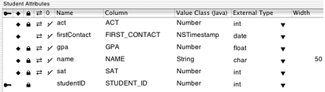

As the basic tutorial illustrates, you can go far in developing a Direct to Java Client application without writing any code. However, the real power of a Java Client application is in the enterprise objects you create and customize. The behavior or business logic you add to enterprise objects brings stored data to life.

By default, EOModeler assigns new entities the class EOGenericRecord. EOGenericRecord is sufficient when all you want the entity to do is get and set properties. However, when you want to add custom behavior to a class (for example, to assign default values when you create new objects or to perform validation), you need to implement a custom enterprise objects class. This class includes the default behavior provided by EOGenericRecord as well as the custom behavior you implement.

To use custom business logic in your application, you assign custom classes to the entities in your model.

1. In EOModeler, select the Admissions model root (top of the tree). Make sure you’re in table mode. If the Client-Side Class Name column is not visible, choose Client-Side Class Name from the Add Column pop-up menu at the bottom of the window.
2. Double-click the Class Name cell for Student in the table and enter `businesslogic.server.Student`.
3. Double-click the Client-Side Class Name cell for Student and change `server` to `client` so it reads `businesslogic.client.Student`.
4. Repeat these steps for the Activity entity, substituting `Activity` for `Student` in the package name.

   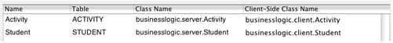
5. Save the model.

The recommended naming convention of custom class names is to adhere to Java package syntax.

By giving both the Class Name (server) attribute and the Client-Side Class Name (client) attribute custom class names, you are telling the model to use custom classes on both the client and the server. But this isn’t required—you can implement a class only on the server or only the client, depending on your needs. See [Design Recommendations](The%20Distribution%20Layer.md#apple-f4xwc4dqnrsv64tfmyxwi33df52wszbpkridgmbqgaytamjxfvbuqmzqgiwviucykjcummzs) for more information.

Once you specify a custom class for an entity in EOModeler, you can generate Java source files for that entity. Before doing that should prepare your project to handle the new files.

Project Builder stores most of a project’s files at the top level of the project directory in the file system even though it organizes files in logical groupings inside the project itself. It’s a good idea to separate your business logic files from other WebObjects files both in the project directory in the file system and in logical groupings inside the Project Builder project.

Follow this step to create a `BusinessLogic` directory with subdirectories in the file system, and to create a `BusinessLogic` group in the project:

Create the following directories at the top level of your project directory (do this in the file system, not in Project Builder): `BusinessLogic``BusinessLogic/Client``BusinessLogic/Server`

The directory structure should look like [Figure 6-2](#apple-f4xwc4dqnrsv64tfmyxwi33df52wszbpkridgmbqgaytamjxfvbuqmzqgmwueq2jijeegrsd).

__Figure 6-2__  Directory structure for custom business logic

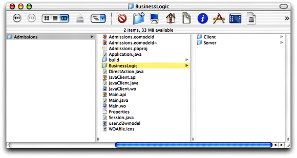

EOModeler can generate Java files for your model. You’ll use these source files to add custom business logic to your enterprise objects.

Follow these steps to generate Java files for the client:

1. In EOModeler, select the Student entity.
2. Choose Property > Generate Client Java Files.
3. Select the `Client` directory inside the `BusinessLogic` directory in the project, as shown in [Figure 6-3](#apple-f4xwc4dqnrsv64tfmyxwi33df52wszbpkridgmbqgaytamjxfvbuqmzqgmwueq2jiveucqsg).
4. Click Save.
5. Repeat the process for the Activity entity.

   __Figure 6-3__  Save Client Java files in BusinessLogic/Client

   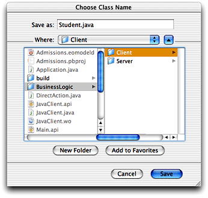

Follow these steps to generate Java files for the server:

1. In EOModeler, select the Student entity.
2. Choose Property > Generate Java Files.
3. Select the `Server` directory inside the `BusinessLogic` directory in the project.
4. Click Save.
5. Repeat the process for the Activity entity.

The Java class files generated by EOModeler include the necessary import declarations as well as constructors and accessor methods derived from the properties of the entity defined in the model file.

Although you told EOModeler where to put the generated files, Project Builder did not automatically add them to the project.

Follow these steps to import the generated files into Project Builder:

1. Select the Classes group in the Files list of Project Builder (click the Files tab if this list isn’t visible).
2. Choose Project > Add Files.
3. Select the `BusinessLogic` directory and click Open. This creates a new group and imports the `BusinessLogic` directory and its subdirectories into the group.
4. Select Application Server as the target as shown in Figure 6-4. Also make sure that “Recursively create groups for any added folders” is selected.

   __Figure 6-4__  Import BusinessLogic directory

   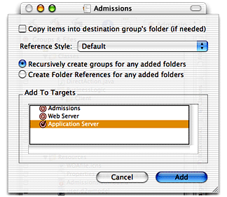
5. Click Add. The new files should appear in the Files list as illustrated in Figure 6-5.
6. After the import, change the target for the files in `BusinessLogic/Client` to Web Server. Do this by changing the target to Web Server in the target’s pop-up menu and selecting the checkbox to the left of each file in the `BusinessLogic/Client` group. Refer to Figure 6-5 for clarity.

   Make sure you also disassociate the files in `BusinessLogic/Client` from the Application Server target by switching to that target and deselecting the checkbox to the left of each file in that group. The client Java files must be built as part of the Web Server target rather than as part of the Application Server target.

   Make sure that Admissions is the target selected in the targets pop-up menu after you’ve correctly associated the imported files with their targets.

__Figure 6-5__  BusinessLogic group with imported files and associated targets

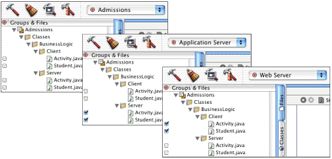

Now the project uses custom classes for the Student and Activity enterprise objects instead of EOGenericRecord. These class files can be edited to implement custom behavior.

If you examine the code in any of the imported classes, you’ll notice that the class generated by EOModeler does not have actual instance variables or fields. Rather, the methods to access the attributes of the custom enterprise objects are implemented using key-value coding.

Step 4: You were instructed to assign all the imported classes to the Application Server target for convenience. You could also import the files in `BusinesssLogic/Client` and `BusinessLogic/Server` separately and assign them to the correct target at that time.

Step 6: As an alternative to importing all the custom Java classes at once and then changing the target accordingly, you can also import the server and client classes separately and assign them to the appropriate target at that time.

The business logic you’ll add is quite simple: It calculates a rating for a student by aggregating the three scores in the database: ACT, SAT, and GPA. You can use Assistant to prepare the application for this new business logic.

Here’s how:

1. Build and run the application and open Assistant. You have to build the application again since you changed the model.
2. In the Properties pane, add a new property key path called `rating` for Task > form and Entity > Student using the Additional Property Key Path text field and the Add button as shown in [Figure 6-6](#apple-f4xwc4dqnrsv64tfmyxwi33df52wszbpkridgmbqgaytamjxfvbuqmzqgmwueq2jjjaugssd). See [Additional Property Key Path Field](Inside%20Assistant.md#apple-f4xwc4dqnrsv64tfmyxwi33df52wszbpkridgmbqgaytamjxfvbuqmzqgewviucykjcumnbv) for more information on what’s happening in this step.

   __Figure 6-6__  Add a property key for the form task

   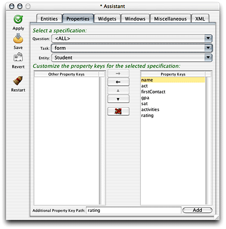
3. Since you’d like to see the rating displayed in the list view of a query window, you also need to add the additional property for the list task. Choose list in the Task pop-up menu and click Add, as shown in Figure 6-7.

   __Figure 6-7__  Additional property key for list task

   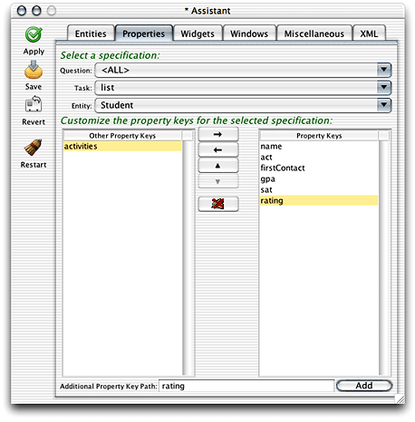
4. The new property will be associated (via an EOAssociation, see [Associations](Java%20Client%20Concepts.md#apple-f4xwc4dqnrsv64tfmyxwi33df52wszbpkridgmbqgaytamjxfvbuqmrzhewviucykjcumojz)) with a method of the same name in a client-side business logic class for the entity (`businesslogic.client.Student` in this case).

   To make this association, switch to the Widgets pane and choose Task > form and Entity > Student, then select rating in the Property Keys list. From the Widget Type pop-up menu, choose EOTextFieldController if it is not already chosen. Doing this binds the association aspect of the EOTextFieldController widget (rating) with the `rating` method, which you’ll define in a few steps.

   __Figure 6-8__  Change the widget type to make the association.

   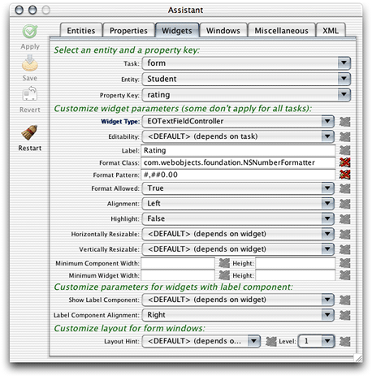
5. Since the rating is calculated on the server side, the text field should be marked as not editable by the user. So, while in the Widgets pane, select Never in the Editability pop-up menu.
6. Finally, you should apply a number formatter to the widget so the number displayed is more meaningful. Change the Format Class field to read `com.webobjects.foundation.NSNumberFormatter`. Formatters need a pattern, and since the rating is a decimal number, the Format Pattern field should be `#,##0.00` as shown in [Figure 6-8](#apple-f4xwc4dqnrsv64tfmyxwi33df52wszbpkridgmbqgaytamjxfvbuqmzqgmwviucykjcummjsga). See the API reference documentation for NSNumberFormatter for more information on format patterns.
7. Since the rating also appears as a column in list views, switch the task to list and set the format options for the EOTableColumnController as shown in [Figure 6-9](#apple-f4xwc4dqnrsv64tfmyxwi33df52wszbpkridgmbqgaytamjxfvbuqmzqgmwueq2ji5duorsg).

   __Figure 6-9__  Change formatter for property in list view

   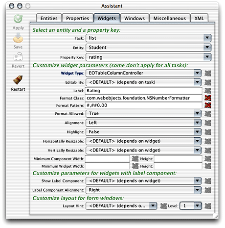
8. Save changes and quit the client and server applications.

You now need to add a method for the new property you added in Assistant. The new `rating` attribute in the Student entity is designed to aggregate ACT and SAT scores and GPAs into a numeric rating based on how each of those attributes is weighted. You need to add a method to perform the calculation, a method to invoke the calculation, and class constants to define the weighting.

The algorithm used to calculate the rating is “sensitive” business logic, so it should exist only on the server side. The client business logic class simply invokes the concrete implementations of the rating methods on the server side.

Add these class constants to the server-side `Student.java` file:

```
private static final double ACT_WEIGHT = 0.30;
private static final double SAT_WEIGHT = 0.30;
private static final double GPA_WEIGHT = 0.40;
```

Add this method to the server-side `Student.java` file:

```
public Number rating() {
    float aggregate = 0;
    float satTemp;
    float actTemp;
    float gpaTemp;

    if (sat() != null && act() != null && gpa() !=null) {
        satTemp = sat().floatValue() / 1600;
        actTemp = act().floatValue() / 36;
        gpaTemp = gpa().floatValue() / 4;

        aggregate = (float)(((gpaTemp * GPA_WEIGHT) + (actTemp * ACT_WEIGHT)            + (satTemp * SAT_WEIGHT)) * 10);
    }

    return (new Float(aggregate));
 }
```

Add a method called `clientSideRequestRating` in the server-side `Student.java` file that invokes the `rating` method, as shown:

```
public Number clientSideRequestRating() {
        return rating();
}
```

Add this code to client-side `Student.java` file to invoke the remote method:

```
 public Number rating() {
        return (Number)(invokeRemoteMethod("clientSideRequestRating", null,
              null));
 }
```

In the last section, you bound the association aspect of the EOTextFieldController (rating) to a method called `rating` in the client-side business logic class. You’ve just defined this method, so now whenever the rating property needs a value, the `rating` method is invoked. It’s that easy—Java Client handles all the communication between the business logic and the user interface for you.

There is more going on behind the scenes, though. The `rating` in the client-side business logic class invokes a remote method called `clientSideRequestRating` in the server-side business logic class. This method in turn invokes a method called `rating`, which actually performs the calculation.

Rebuild and run the application. Make a new student record and see how the rating field is populated upon saving as shown in [Figure 6-10](#apple-f4xwc4dqnrsv64tfmyxwi33df52wszbpkridgmbqgaytamjxfvbuqmzqgmwviucykjcummjsha). That figure is shown with a layout hint of Row (see [Widgets Pane](Inside%20Assistant.md#apple-f4xwc4dqnrsv64tfmyxwi33df52wszbpkridgmbqgaytamjxfvbuqmzqgewviucykjcumnbw) for more information).

__Figure 6-10__  The rating field in action


To learn how to implement continuous change notification for the rating field, see [Continuous Change Notification](Common%20Rules.md#apple-f4xwc4dqnrsv64tfmyxwi33df52wszbpkridgmbqgaytamjxfvbuqmzrgiwueqkcizauersd).

WebObjects provides some useful classes and methods to validate user input. You should validate the entered data for each of the three score fields. To do this, add the following code in the server-side `Student.java` class:

```
public Number validateSat(Number score) throws NSValidation.ValidationException {
    if ((score.intValue() > 1600) || (score.intValue() < 0)) {
        throw new NSValidation.ValidationException("Invalid SAT score");
    }
    else
        return score;
}

public Number validateAct(Number score) throws NSValidation.ValidationException {
    if ((score.intValue() > 36) || (score.intValue() < 0)) {
        throw new NSValidation.ValidationException("Invalid ACT score");
    }
    else
        return score;
}

public Number validateGpa(Number score) throws NSValidation.ValidationException {
    if ((score.floatValue() > 4.0) || (score.floatValue() < 0.0)) {
        throw new NSValidation.ValidationException("Invalid GPA");
    }
    else
        return score;
}
```

The code you added is rather trivial, but it demonstrates a particularly powerful feature of WebObjects—validation. The NSValidation class in the Foundation framework provides this functionality. By throwing a `NSValidation.ValidationException`, a method tells Enterprise Objects that the current object graph is not cleared to be saved to the database.

In this case, if one of the attributes fails to validate, the object graph is not cleared by NSValidation and the current record won’t be committed to the data store until a valid value is entered.

You were instructed to put all the validation methods in the server-side business logic class, but this is not necessary. In fact, it often makes more sense to validate some values on the client. This reduces network traffic (there is no round-trip to the server to perform the validation) and increases overall application performance. Experiment with this by moving one of the validation methods to the client-side business logic class.

Validation methods are of the form `validate`_Attribute_. In this example, be sure that `validateGpa` is capitalized correctly—`validateGPA` will not invoke validation on the `gpa` attribute.

If you write validation methods, they are invoked in the framework by various classes and interfaces such as EOValidation, EODisplayGroup, and EOEditingContext. Validation is performed for these activities:

- updating the client-side distribution context (`validateForUpdate`)
- saving to the database (`validateForSave`)
- deleting from the database (`validateForDelete`)
- inserting a new record (`validateForInsert`)
- updating the server-side database context (`validateForUpdate`)

When you create a new record, you might want to supply some default values for the fields in that record. Although none of the fields in the Student record really need a default value, you’ll override `awakeFromInsertion` in order to learn how to give a field a default value.

Add this code in the server-side `Student.java` file:

```
public void awakeFromInsertion(EOEditingContext context) {
        super.awakeFromInsertion(context);
        if (gpa() == null) {
            setGpa(new BigDecimal("0"));
        }
        if (sat() == null) {
            setSat(new BigDecimal("0"));
        }
        if (act() == null) {
            setAct(new BigDecimal("0"));
        }
        if (name() == null) {
            setName("");
        }
 }
```

Build and run the application and create a new student record. You’ll notice that some of the fields are populated in the new record as shown in Figure 6-11.

__Figure 6-11__  Initial values


Also try entering some invalid data to see how the validation you implemented works. If you enter an invalid score, you should get a validation exception message when saving, as shown in Figure 6-12.

__Figure 6-12__  Validation exception message

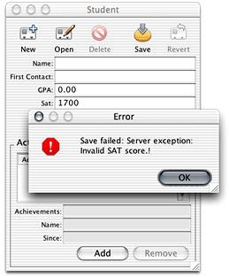

Before you learn more about customizing Direct to Java Client applications, you should know what’s going on behind the scenes.

In nondirect Java Client applications, user interfaces are stored in Interface Builder nib files. In Direct to Java Client applications, user interfaces are dynamically generated by the EOGeneration layer, which produces XML descriptions of the controllers in a user interface. Each user interface element in a Direct to Java Client application is managed by a controller. Multiple controllers are organized in a controller hierarchy, which defines the complete functionality of the application.

There is an application-wide controller hierarchy with an EOApplication object at its root. Each window or modal dialog in an application is defined by a more granular controller hierarchy. The controller hierarchies for windows or modal dialogs are referred to as the application’s subcontrollers. Window controllers and modal dialog controllers have subcontrollers of their own such as text fields, table views, and checkboxes.

The objects in the controller hierarchy are instances of EOController subclasses. The EOController class defines basic controller behavior. Collectively, controllers are responsible for managing the controller hierarchy (which includes building, connecting, and traversing the hierarchy) and handling actions. Controllers define and know how to respond to the actions users can perform.

Fundamentally, controllers are your best friend. They save you from writing raw Swing or from needing to maintain user interfaces in Java. They allow you to define user interfaces in XML descriptions with a common set of tags that are mapped into Swing-specific user interface elements and characteristics. Controllers also save you from needing to interact with Enterprise Objects programmatically. They automatically construct qualifiers and fetch specifications, fetch data into editing contexts, and in general take care of all the heavy lifting required in an application that uses Enterprise Objects.

The EOController subclasses fall into the following categories:

- __Application-level controllers__ define application-level functionality. They define actions such as Quit and Save. Additionally they provide document management support such as tracking documents with unsaved changes. An application-level controller (such as `EOApplication` or `EODynamicApplication`) is the root of an application’s controller hierarchy.
- __User interface–level controllers__ manage portions of an application’s user interface, such as windows (`EOWindowController`) and tab views (`EOTabViewController`). They determine the layout of their subcontrollers, resizing behavior, and so on.
- __Entity-level controllers__ specify the user interface for performing a particular task on an entity. Entity-level controllers determine the functionality for querying, listing, and editing objects. They include `EOQueryController` and `EOListController`.
- __Property-level controllers__ manage widgets for displaying properties. They provide widgets for entering text, displaying properties in a table, and so on. They include `EOTextFieldController` and `EOTableColumnController`.

The process for creating the controller hierarchy involves a `com.webobjects.eogeneration.EOControllerFactory` object, an application object, the rule system, and D2WComponent objects.

In a Direct to Java Client application, the client-side application object (`com.webobjects.eogeneration.EODynamicApplication` or a subclass of it) initializes the controller factory object. The controller factory, which lives on the client side, makes a request to the rule system on the server side for a particular controller or controller hierarchy. The rule system analyzes the application’s data models (`.eomodeld` files) and rule models (`.d2wmodel` files) and generates an XML description of the controller or controller hierarchy that the controller factory requested.

The rule system then sends the XML descriptions it generated back to the controller factory. The controller factory then builds a user interface based on the XML descriptions it receives (it parses the XML using a `com.webobjects.eoapplication.EOXMLUnarchiver` object) .

The EOXMLUnarchiver maps XML tags to EOController classes, as illustrated in [Table 6-2](#apple-f4xwc4dqnrsv64tfmyxwi33df52wszbpkridgmbqgaytamjxfvbuqmzqgmwviucykjcummzq).

__Table 6-2__  A subset of the controllers available in Direct to Java Client

| XML tag | Controller class |
| `MODALDIALOGCONTROLLER` | EOModalDialogController |
| `ACTIONBUTTONSCONTROLLER` | EOActionButtonsController |
| `QUERYCONTROLLER` | EOQueryController |
| `TEXTFIELDCONTROLLER` | EOTextFieldController |
| `LISTCONTROLLER` | EOListController |
| `TABLECONTROLLER` | EOTableController |
| `TABLECOLUMNCONTROLLER` | EOTableColumnController |

As an XML unarchiver creates the controller hierarchy, it configures the controllers according to the specified XML attribute values. For example, two of the XML attributes for EOTextField are `valueKey` and `isQueryWidget`:

```
<TEXTFIELDCONTROLLER valueKey="name" isQueryWidget="true"/>
```

These attributes correspond to the EOTextField methods `setValueKey` and `setIsQueryWidget`. The `valueKey="name"` attribute specifies that the text field controller corresponds to a property named “name.” The `isQueryWidget="true"` attribute specifies that the text field is used to get search criteria from the user and is not to display and edit a property’s value.

As users interact with the user interface, they may perform actions that require additional controllers. These requests are sent to the controller factory which communicates with the rule system on the server side, generates XML descriptions of controllers, and sends them back to the client.

For more information on the XML tags and attributes for controller classes, see [Controllers and Actions Reference](Controllers%20and%20Actions%20Reference.md#apple-f4xwc4dqnrsv64tfmyxwi33df52wszbpkridgmbqgaytamjxfvbuqmzsgmwviubr).

As well as understanding the role of controllers in Direct to Java Client applications, you need to know a bit more about the rule system. The default rule system in Direct to Java Client applications includes over one hundred rules. You can customize these rules and write new rules, too. So you need to know both how to leverage the default rules in your application and how to write custom rules.

Every Java Client class that can exist as part of an XML description for Direct to Java Client user interfaces includes XML identifiers. These identifiers come in the form of a single XML tag and one or more XML attributes.

For instance, EOComponentController’s XML tag is `COMPONENTCONTROLLER`, and its XML attributes include `alignmentWidth`, `iconName`, and `verticallyResizable`. This book includes a complete list of Java Client classes that have XML tags and XML attributes in [Controllers and Actions Reference](Controllers%20and%20Actions%20Reference.md#apple-f4xwc4dqnrsv64tfmyxwi33df52wszbpkridgmbqgaytamjxfvbuqmzsgmwviubr).

For example, when using a Direct to Java Client application, you may want to change the behavior of the query window. It’s not uncommon to want to query for all records in a particular entity, and the dialog asking if you want to search for all records can become repetitive. To see if the query window has any options for controlling its behavior, you’d first consult its XML attributes as found in [Controllers and Actions Reference](Controllers%20and%20Actions%20Reference.md#apple-f4xwc4dqnrsv64tfmyxwi33df52wszbpkridgmbqgaytamjxfvbuqmzsgmwviubr).

You’d find that the EOQueryController class includes an XML attribute called `runsConfirmDialogForEmptyQualifiers`. This attribute controls the confirmation dialog when you click Find in a query window without qualifying the search criteria. `runsConfirmDialogForEmptyQualifiers` is a Boolean attribute, so setting it to `false` disables the confirmation dialog.

You add this rule to your application’s `d2w.d2wmodel` file using Rule Editor. You add the `d2w.d2wmodel` file to a project by making a new file of type “Empty File,” naming it `d2w.d2wmodel` and associating it with the Application Server target.

Open your application’s `d2w.d2wmodel` file and add a rule with these attributes:

**Left-Hand Side:**
: `*true*`

**Key:**
: `runsConfirmDialogForEmptyQualifiers`

**Value:**
: `"false"`

**Priority:**
: `50`

In this case, you don’t need to specify the qualifier since only one controller has the `runsConfirmDialogForEmptyQualifiers` value. If you want to disable the confirmation dialog just for a specific entity, you can add this argument to the left-hand side: `entity.name="<entityName>"`.

See [Inside the Rule System](Inside%20the%20Rule%20System.md#apple-f4xwc4dqnrsv64tfmyxwi33df52wszbpkridgmbqgaytamjxfvbuqmzqgywviubr) for an explanation of rule priorities and for more general information on the rule system. Also see [Common Rules](Common%20Rules.md#apple-f4xwc4dqnrsv64tfmyxwi33df52wszbpkridgmbqgaytamjxfvbuqmzrgiwviubr) for examples of custom rules.

Adding actions to Direct to Java Client applications is rather easy. There are four recommended procedures:

- Use Assistant to specify a new property with an EOActionController widget (for actions on enterprise objects; the action method is in a client-side business logic class).
- Subclass a controller class and write a rule to use it in the application (the action method is in the subclass).
- Write a custom controller class and include it in an XML description (for actions on user interface; the action method is in the custom controller class).
- Edit XML by hand to include an EOActionController with an `actionKey` tag specifying the action method (for actions on enterprise objects; the action method is in the client-side business logic).

Before you take steps to customize the application to invoke a new action, you need to write the code for the action. The action you’ll add here sends the contents of a Student record to a specified email address. The code that constructs the email exists in your application’s `Session.java` class. Rather than send a plain text email, the email sent is a WebObjects component email. This means that you can use a dynamic WOComponent object to populate the contents of the email.

Follow these steps to make the new WOComponent:

1. Make a new WOComponent in Project Builder. Choose New File from the File menu and select Component from the WebObjects list. Name the component `Report` and add it the Application Server target.
2. Open the component in WebObjects Builder and add a new key called `student` of type `Student`, as shown in Figure 6-13. Follow these steps:

   - Double-click `Report.wo` in Project Builder to open it in WebObjects Builder.
   - Choose Add Key from the Edit Source pop-up menu at the bottom of the window.

   Select the options to generate source code for an instance variable and a method setting the value.

   __Figure 6-13__  New key of type Student in the Report component

   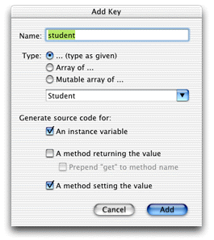
3. Add another new key called `activity` of type `Activity`, as shown in Figure 6-14. Select the option to generate source code for an instance variable.

   __Figure 6-14__  New key of type Activity in the Report component

   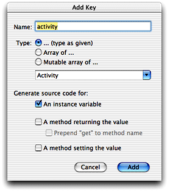
4. Add dynamic elements for Student’s attributes. Add WOStrings for the `gpa`, `act`, `sat`, and `name` attributes as shown in Figure 6-15. They are shown here in a table, but that is optional.

   - Choose WOString from the WebObjects menu.
   - Drag from an attribute in the student key (such as `student.name`) to the center of the WOString element to bind the attribute to the element’s `value` binding.
   - Repeat for all four elements.

   __Figure 6-15__  Dynamic elements for Student’s attributes

   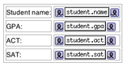
5. Add dynamic elements for Student’s `activities` relationship. Add a WORepetition with `list = student.activities` and `item = activity`. Add WOStrings for `activity.name`, `activity.achievements`, and `activities.since` as shown in Figure 6-16.

   __Figure 6-16__  WORepetition for Student’s activities

   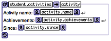
6. Add this method to `Session.java` to compose and send the message:

```
public void clientSideRequestSendRecordViaEmail(EOEnterpriseObject record) {
        String messageSubject, messageBody, message;
        NSMutableArray recipients = new NSMutableArray();
        recipients.addObject("person@foo.com");

        Report report = new Report(context());
        report.setStudent(record);

        messageSubject = "Student report for " + record.valueForKey("name");
         message =               WOMailDelivery.sharedInstance().composeComponentEmail("sender@foo.com",               recipients, null, messageSubject, report, true);
}
```

   This method uses the `com.webobjects.appserver.WOMailDelivery` class to send an email message containing information from a student record. You’ll notice that the method is named `clientSideRequestSendRecordViaEmail` to conform to the default rules for remote method invocation.
7. _This step is necessary only in WebObjects 5.0.x and 5.1.x._ Since the email is sent via remote method invocation, you need to provide a distribution layer delegate method in `Session.java` to allow the invocation. When the distribution layer starts up, it sets its delegate to the Session object, which allows you to override the methods defined in the EODistributionContext.Delegate class.

   In `Session.java`, add an import statement for the `com.webobjects.eodistribution` package and then add the distribution layer delegate method:

```
public boolean distributionContextShouldFollowKeyPath(EODistributionContext                   distributionContext, String path) {
        return (path.equals("session"));
}
```
8. You need to add a launch argument to the application representing the email server through which to send the message. Add `-WOSMTPHost` to your launch arguments with the name of a mail server on your network, as shown in Figure 6-17. Refer to [Add a Launch Argument](Building%20a%20Simple%20Application.md#apple-f4xwc4dqnrsv64tfmyxwi33df52wszbpkridgmbqgaytamjxfvbuqmzqgawviucykjcummrt) if you’ve forgotten how to add a launch argument.

   __Figure 6-17__  Add launch argument for SMTP host

   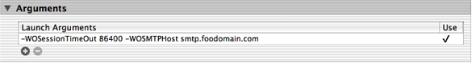

You can now add custom actions to invoke the email composition. How the `clientSideRequestSendRecordViaEmail` method in `Session.java` is invoked depends on how you add the custom action. The following four sections describe the possibilities, in order of recommendation.

Using Assistant is the easiest, fastest, but least flexible way to add an action to an application. Follow these steps:

1. Build and run the Admissions application and open Assistant.
2. Switch to the Properties pane and choose Question > window, Task > Form, and Entity > Student. Add a new property key called `sendRecordViaEmail` for Question=window, Task=form, Entity=Student. Do this using the Additional Property Key Path field. See Figure 6-18.

   __Figure 6-18__  Add property key for new action

   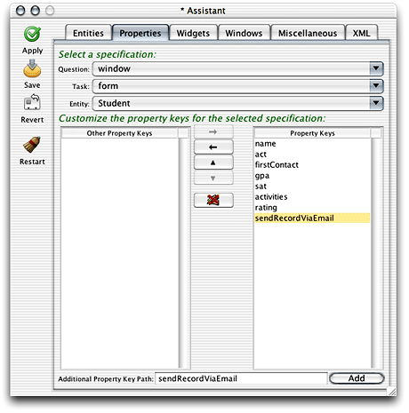
3. Switch to the Widgets pane, choose Task > form, Entity > Student, and Property key > sendRecordViaEmail. In the Widget Type pop-up menu, choose EOActionController as shown in Figure 6-19.

   __Figure 6-19__  Change the widget type of the new property key

   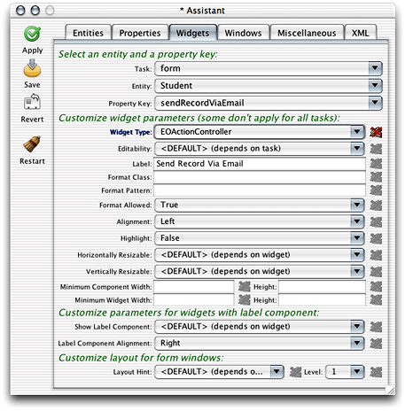
4. Save the changes and restart the client application from Assistant and you’ll see a new button called Send Record Via Email in form windows for the Student entity as shown in Figure 6-20. Since it’s an EOActionController defined in the Student entity, it invokes a method of the same name, `sendRecordViaEmail`, in the client-side business logic class for that entity (`businesslogic.client.Student` in this case).

   __Figure 6-20__  The new property key as an EOActionController

   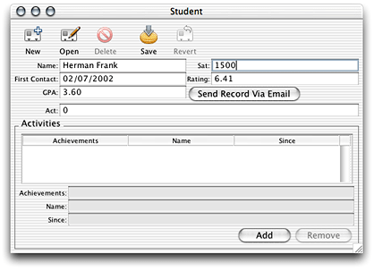

Make a new student record or open an existing record and click the new button. If you started the client application from the command line, you see an `IllegalArugmentException` is thrown, stating that the method `sendRecordViaEmail` can’t be found. (In Mac OS X, client applications started automatically by the `WOAutoOpenClientApplication` mechanism send exceptions to the console.) So, you need to add it to your client-side business logic class.

Add this method in the client-side `Student.java` file:

```
public void sendRecordViaEmail() {
        _distributedObjectStore().invokeRemoteMethodWithKeyPath(new
           EOEditingContext(), "session", "clientSideRequestSendRecordViaEmail", new
           Class[] {EOEnterpriseObject.class}, new Object[] {this}, true);
}
```

This method invokes the method you added to your `Session.java` class. It sends the enterprise object from which the action originated (the `this` parameter) and pushes the state of the client-side editing context to the server-side editing context (the `true` parameter). See the API reference documentation for `invokeRemoteMethodWithKeyPath` for detailed descriptions of each parameter.

In the code listing above, you’ll notice that the remote method invocation is made on an object returned from the method `_distributedObjectStore()`. You need to add this method to the client-side `Student.java` class:

```
private EODistributedObjectStore _distributedObjectStore() {
        EOObjectStore objectStore = EOEditingContext.defaultParentObjectStore();
        if ((objectStore == null) || (!(objectStore instanceof EODistributedObjectStore)))
       {
         throw new IllegalStateException("Default parent object store needs to be an
              EODistributedObjectStore");
      }
        return (EODistributedObjectStore)objectStore;
}
```

Client-side remote methods that are not invoked on business logic classes (on subclasses of EOCustomObject) are invoked on the client’s distributed object store. For instance, in an EOGenericRecord subclass, you can use the method `invokeRemoteMethod`(`String`_methodName_, `Class[]`_argumentTypes_, `Object[]`_arguments_), which invokes a method named _methodName_ in the server-side EOGenericRecord subclass of the same name.

But, if you want to invoke a remote method that is not in the server-side business logic class corresponding to the client-side business logic class from where the remote method invocation originates, you need to invoke the remote method on the client’s distributed object store, as the example above shows.

See the WebObjects API reference documentation for the `com.webobjects.eodistribution.client` package for more information on the distributed object store and the different varieties of remote method invocations. Also see [The Distribution Layer](The%20Distribution%20Layer.md#apple-f4xwc4dqnrsv64tfmyxwi33df52wszbpkridgmbqgaytamjxfvbuqmzqgiwviubr)for an introduction to the distribution layer and remote method invocation.

Next, you need to add the import statement for the client-side EODistribution layer to the `Student.java` class:

```
import com.webobjects.eodistribution.client.*;
```

Build and run the application, open a Student record, and click the Send Record Via Email button. If you added your email address to the recipients in the code you added to `Session.java`, you should see an email in your inbox with the information in the selected record.

Using Assistant to add an action may not provide you with the flexibility you need. Furthermore, the methods you added in the last section are not really appropriate in business logic classes. They are better suited to a dedicated controller class.

Extending a controller class and writing a rule to use it is the best way to provide custom actions in your application. It is much more flexible than just using Assistant and it’s much better than the next two options, which both require freezing XML. Anytime you freeze XML, you lose a lot of the dynamism of the rule system. This means, for instance, that you are not as able to use the rule system to localize your application or provide access controls via rules. Also, subclassing controller classes doesn’t incur the costs associated with writing completely custom controllers.

The dynamically generated user interfaces in Java Client rely on a core set of classes: EOFormController, EOQueryController, and EOListController. You can take real advantage of WebObjects’ excellent object-oriented design to extend these classes to provide custom behavior.

Add a new file to your application called `CustomFormController.java`. Add it to the Web Server target. Copy and paste the code for it, shown in [Listing 6-1](#apple-f4xwc4dqnrsv64tfmyxwi33df52wszbpkridgmbqgaytamjxfvbuqmzqgmwviucykjcummjthe).

__Listing 6-1__  CustomFormController code

```
package admissions.client;

import java.io.*;
import javax.swing.*;
import java.awt.*;
import com.webobjects.foundation.*;
import com.webobjects.eocontrol.*;
import com.webobjects.eointerface.*;
import com.webobjects.eoapplication.*;
import com.webobjects.eogeneration.*;
import com.webobjects.eodistribution.client.*;

public class CustomFormController extends EOFormController {

    public CustomFormController(EOXMLUnarchiver unarchiver) {
        super(unarchiver);
    }

    protected NSArray defaultActions() {
        Icon icon = EOUserInterfaceParameters.localizedIcon("ActionIconOk");
        NSMutableArray actions = new NSMutableArray();

        actions.addObject(EOAction.actionForControllerHierarchy("sendRecordViaEmail",
            "Send Record Via Email", "Send Record Via Email", icon, null, null, 300, 50,
            false));
        return EOAction.mergedActions(actions, super.defaultActions());
    }

    public boolean canPerformActionNamed(String actionName) {
        return actionName.equals("sendRecordViaEmail") ||
                 super.canPerformActionNamed(actionName);
    }

    public void sendRecordViaEmail() {
        _distributedObjectStore().invokeRemoteMethodWithKeyPath(new EOEditingContext(),
         "session","clientSideRequestSendRecordViaEmail", new Class[]
         {EOEnterpriseObject.class}, new Object[] { selectedObject()}, true);
    }


    private EODistributedObjectStore _distributedObjectStore() {
        EOObjectStore objectStore = EOEditingContext.defaultParentObjectStore();
        if ((objectStore == null) || (!(objectStore instanceof EODistributedObjectStore)))
         {
            throw new IllegalStateException("Default parent object store needs to be an
              EODistributedObjectStore");
        }
        return (EODistributedObjectStore)objectStore;
    }

}
```

When you examine this code, you’ll notice that two of its methods are those you added in the last section. So you can remove both `sendRecordViaEmail` and `_distributedObjectStore` from the client-side `Student.java` class. The `defaultActions` method adds to the application’s actions and `canPerformActionNamed` authorizes the invocation of the `sendRecordViaEmail` method.

To use this class in form windows for the Student entity, you need to add a rule to the project’s `d2w.d2wmodel` file:

**Left-Hand Side:**
: `((task='form') and (controllerType='entityController') and (entity.name='Student'))`

**Key:**
: `className`

**Value:**
: `"admissions.client.CustomFormController"`

**Priority:**
: `50`

You add the `d2w.d2wmodel` file to a project by making a new file of type “Empty File,” naming it `d2w.d2wmodel`, and associating it with the Application Server target. Control-click the file after adding it to the project to display its contextual menu. Choose “Open with Finder” to open the file in Rule Editor. Then add the rule shown above.

Build and run the application and remove the action you added with Assistant (you can either go to the Direct to Java Client Assistant and move the action to the Other Property Keys list or find the rule in the `user.d2wmodel` file and delete it by hand). If successful, form windows for the Student entity should look like Figure 6-21.

__Figure 6-21__  Image form window with new buttons

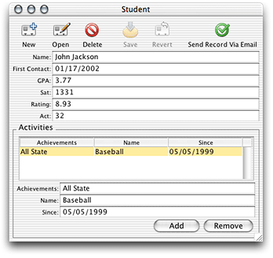

Clicking the Send Record Via Email button should send an email with the current record’s information to the recipients you declared in the method in `Session.java`, which constructs and sends the email.

For the custom action that sends a record via email, you may find that hard-coding the email recipients is not ideal. Rather, you might want the flexibility of choosing the recipients on a per-record basis. By using the controller factory programmatically, this is actually quite simple.

First, following the Model-View-Controller paradigm, you need to write a new class to display a dialog in which the user can select the email recipients. Although you could save writing a few lines of code by putting the controller factory invocation in the business logic class, this is bad design. Business logic classes (enterprise objects) should not include any user interface code. So, add a new client-side class called SelectEmail to your project :

```
package admissions.client;

import com.webobjects.foundation.*;
import com.webobjects.eocontrol.*;
import com.webobjects.eogeneration.*;

public class SelectEmail extends Object{

    public SelectEmail() {
        super();
    }

    public NSArray selectEmailAddresses() {
        return           EOControllerFactory.sharedControllerFactory().selectWithEntityName          ("Email", true, false);
    }
}
```

The class is rather simple and contains a single method that invokes a method on the controller factory. This displays a selection dialog for the Email entity as shown in [Figure 6-22](#apple-f4xwc4dqnrsv64tfmyxwi33df52wszbpkridgmbqgaytamjxfvbuqmzqgmwueq2jizceoqkd).

The second argument in the `selectWithEntityName` method (`true`) allows multiple selection in the select dialog so you can choose multiple email addresses. The method returns the objects that are selected in the selection dialog.

Before you see any email addresses in that dialog, however, you have to add an entity to your EOModel called “Email”, generate SQL for it, and add entries to it. Create a new entity and add to it two attributes:

- `emailID`; column name `EMAIL_ID`; external type `int`; internal type `Integer`; mark as the primary key; don’t mark as either kind of class property
- `address`; column name `ADDRESS`; external type `char`; internal type `String`; mark as both a client-side and server-side class property

When you generate SQL for the Email entity, select only Create Tables and Primary Key Constraints.

The Email entity is considered an Enumeration entity by the rule system, so you can add data to it by choosing Enumeration Window from the Tools menu in the client application.

Next, you need to modify the `sendRecordViaEmail` action method in `CustomFormController.java` as shown:

```
 public void sendRecordViaEmail() {
        SelectEmail select = new SelectEmail();
        NSArray globalIDs = select.selectEmailAddresses();

        _distributedObjectStore().invokeRemoteMethodWithKeyPath(new
          EOEditingContext(),"session", "clientSideRequestSendRecordViaEmail", new
          Class[] {EOEnterpriseObject.class, NSArray.class}, new Object[]
          {selectedObject(), globalIDs}, true);
 }
```

These modifications to `CustomFormController.java` instantiate a new SelectEmail object and invoke the method to display the dialog that allows users to select the email addresses to send the current report to.

The remote method invocation now sends the selected email address (represented by the `globalIDs` object) and the report from which the `sendRecordViaEmail` action was invoked (represented by the objects returned from the `selectedObject()` method in the remote method invocation) to the method `clientSideRequestSendRecordViaEmail` in the `Session.java` class on the server.

Next, you need to modify the `clientSideRequestSendRecordViaEmail` method in the server-side `Session.java` class to accept the new `globalIDs` argument:

```
public void clientSideRequestSendRecordViaEmail(EOEnterpriseObject record, NSArray                                                                       sendTo) {
        String messageSubject, messageBody, message;
        NSMutableArray recipients = new NSMutableArray();
        //recipients.addObject("person@foo.com");

        java.util.Enumeration e = sendTo.objectEnumerator();
        while (e.hasMoreElements()) {
            EOEnterpriseObject email =                defaultEditingContext().objectForGlobalID((EOGlobalID)e.nextElement());
            String emailAddress = (String)email.valueForKey("email");
            recipients.addObject(emailAddress);
        }

        Report report = new Report(context());
        report.setStudent(record);

        messageSubject = "Student report for " + record.valueForKey("name");
        message =            WOMailDelivery.sharedInstance().composeComponentEmail("sender@foo.com",            recipients, null, messageSubject, report, true);
}
```

Instead of statically setting the array recipients, the array is set dynamically to the email addresses passed in by the `sendTo` array.

Build and run the application. Open a student record and click Send Record Via Email. A dialog like that shown in Figure 6-22 should appear. Select some email addresses and click OK. Check your email to see if you are successful.

__Figure 6-22__  Choose email recipients

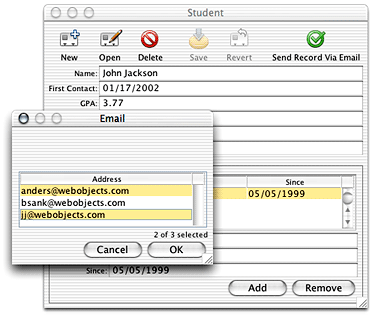

As you use more difficult customization techniques, you’ll need more debugging information. Direct to Java Client applications consist of much more than Java code. So, you need tools to help you debug the other main aspects: database access and the rule system.

You can see the SQL messages passed to the database by adding `-EOAdaptorDebugEnabled YES` to your launch arguments on the server application. By adding `-D2WTraceRuleFiringEnabled YES` to your launch arguments, you can see all the rule system rules and your custom rules as they are fired.

If those two flags don’t provide you with enough information, you can add `-NSDebugGroups -1` and `-NSDebugLevel 3` , which activate logging for the internal workings of WebObjects. Using `-NSDebugGroups -1` gives you debug logging information for all aspects of the system. By specifying specific debug groups, you can narrow down the amount of information logged. See the API reference for NSLog for more information on how to use NSLog.

[Next](Nondirect%20Java%20Client%20Development.md)[Previous](The%20Distribution%20Layer.md)

