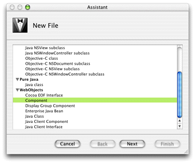
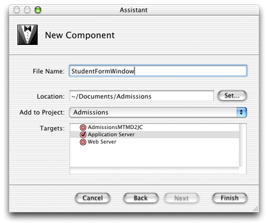
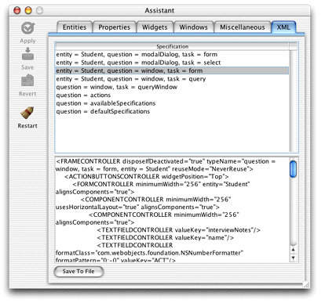
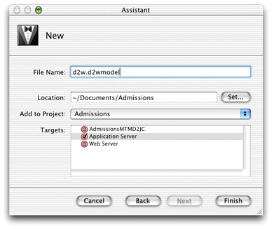
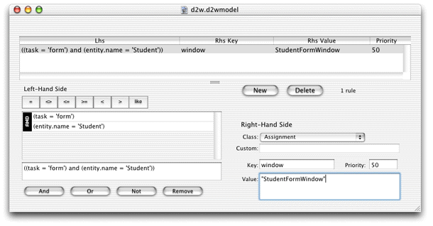
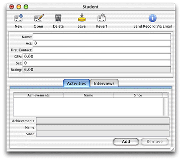
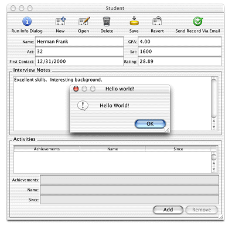

> 导航：[总目录](../../../README.md) · [documentation](../../../_indexes/documentation.md) · [WebObjects Java Client Programming Guide](Introduction%20to%20WebObjects%20Java%20Client%20Programming%20Guide.md)


[Next](Mixing%20Static%20and%20Dynamic%20User%20Interfaces.md)[Previous](Common%20Rules.md)

# Freezing XML User Interfaces

You can use the tutorial project you created earlier in [Enhancing the Application](Enhancing%20the%20Application.md#apple-f4xwc4dqnrsv64tfmyxwi33df52wszbpkridgmbqgaytamjxfvbuqmzqgmwviubr) as the basis for the exercises in this chapter.

_Problem:_ You need more finely grained control over the user interface than the Direct to Java Client Assistant allows.

_Solution:_ Use the XML generated by Assistant as a starting point, then edit it by hand to suit your needs.

Freezing XML is another way to customize Direct to Java Client applications. While Assistant allows you to make basic user interface customizations to your application, it is necessarily limited. Freezing XML, however, gives you finer control over your application’s user interface. With that said, you should use Assistant as much as you can since freezing XML makes your application more complex and less flexible than just using Assistant.

Freezing XML involves these steps:

- making a new D2WComponent
- copying an XML description from Assistant and editing it in the new component’s `.html` file
- writing a rule to tell the rule system to use the XML component

Follow these steps to customize the user interface of the Admissions application using frozen XML:

1. In Project Builder, select the Web Components group, choose File > New File, and select Component from the WebObjects list, as shown in Figure 16-1. Do not select Display Group Component or Java Client Component.

   __Figure 16-1__  Select Component as the file type

   
2. Name the new component `StudentFormWindow` and make sure Application Server is the selected target, as shown in Figure 16-2.

   The recommend convention for naming frozen XML components is _EntityNameTaskNameWindowType_. So, if the entity in question is Student, and the task is query, the frozen XML component should be named `StudentQueryWindow`.

   Click Finish.

   __Figure 16-2__  Name new component “StudentFormWindow”

   
3. The Project Builder assistant for new component files creates a standard WebObjects component, so you need to change it to a D2WComponent. Add the import statement for `com.webobjects.directtoweb` and change the superclass of `StudentFormWindow` to `D2WComponent`, as shown in [Listing 16-1](#apple-f4xwc4dqnrsv64tfmyxwi33df52wszbpkridgmbqgaytamjxfvbuqmzrgmwueq2jjfducssi).

   __Listing 16-1__  Change the superclass of StudentFormWindow to D2WComponent

```
import com.webobjects.foundation.*;
import com.webobjects.appserver.*;
import com.webobjects.eocontrol.*;
import com.webobjects.eoaccess.*;
import com.webobjects.directtoweb.*;

public class StudentFormWindow extends D2WComponent {
    public StudentFormWindow(WOContext context) {
        super(context);
    }
}
```
4. Build and run the application and start the client application.
5. Switch to the XML pane in Assistant.
6. Under Specification, choose entity > Student, question > window, and task > form. This puts the XML description for that selection in the XML window as shown in Figure 16-3.

   __Figure 16-3__  XML description of Student entity, form window

   
7. Copy the whole XML specification and paste it into the `StudentFormWindow.html` file in Project Builder. `StudentFormWindow.html` is in the StudentFormWindow component.
8. In Project Builder, select the Resources group and choose File > New File and select Empty File. Name the file `d2w.d2wmodel` and make sure Application Server is the selected target, as shown in [Figure 16-4](#apple-f4xwc4dqnrsv64tfmyxwi33df52wszbpkridgmbqgaytamjxfvbuqmzrgmwueq2ji5besrcc). This file will hold custom rules you write. Skip this step if your project already has a `d2w.d2wmodel` file.

   You need to have a  `d2w.d2wmodel` file for a few reasons. First, Assistant stores its rules in the `user.d2wmodel` file and writes out this file whenever it saves. So, any rules you add or change manually in the `user.d2wmodel` file is wiped out by Assistant.

   By writing rules in a separate file, you can maintain a custom set of rules and still use Assistant for basic customizations. At runtime, all the `user.d2wmodel` files in the frameworks and all the `d2w.d2wmodel` files in your project and in your project’s frameworks are merged, so the rule system picks up your custom rules and the rules you specified with Assistant, along with all the default rules.

   __Figure 16-4__  Make a new rule file for custom rules

   
9. Put the Rule Editor application (found in `/Developer/Applications/`) in the Dock. Drag the `d2w.d2wmodel` file to the Rule Editor icon in the Dock to open it.
10. Click New to make a new rule and add these arguments to the left-hand side: `(task = 'form') and (entity.name = 'Student')`.

    Collectively, the left-hand side arguments constitute the rule’s condition. If the condition exists (that is, the user or application performs some action that triggers the condition), the rule fires and the right-hand side of the rule is evaluated.

    In this case, if the form task is triggered (usually by a user action) on the Student entity, the condition of this rule is `true`, so the rule fires. Collectively, the left-hand side arguments ask “how should this part of the application behave?” And since the condition has been triggered, the behavior of this part of the application is changed per the right-hand side arguments.

    As described in [Task Pop-Up Menu](Inside%20Assistant.md#apple-f4xwc4dqnrsv64tfmyxwi33df52wszbpkridgmbqgaytamjxfvbuqmzqgewviucykjcumnbs), Direct to Java Client applications have four basic tasks: query, form, list, and identify. (The rule system defines other tasks with which you usually do not need to interact). In this step, specifying `task = 'form'` tells the rule system that this rule pertains to the form task. By specifying the entity with `entity.name = 'Student'`, the rule system knows that this rule pertains to the form task for the Student entity. However, if you want to use the frozen XML window for the query task, you would instead specify `task = 'query'`.
11. Set the right-hand side key to `window` and the value to `StudentFormWindow`. Set the priority to 50. Refer to Figure 16-5 for clarity. For an explanation of rule system priorities, see [Rule System Priorities](Inside%20the%20Rule%20System.md#apple-f4xwc4dqnrsv64tfmyxwi33df52wszbpkridgmbqgaytamjxfvbuqmzqgywueqkki5feeqsi).

    __Figure 16-5__  Add a rule to use frozen XML

    

    The right-hand side arguments constitute the answer to the question posed in the left-hand side arguments. The answer is made up of a key and a value for that key. In this case, the key is `window` and the value is `StudentFormWindow`. So in this case, the answer is “use the StudentFormWindow as the window for form tasks for the Student entity.”

    For high-level questions like `controller`, `window`, and `modalDialog`, the rule system expects the value to be the name of a D2WComponent, like StudentFormWindow or any of the default D2WComponent classes defined in `com.webobjects.eogeneration.*;` (see `/System/Library/Frameworks/JavaEOGeneration.framework/Resources/`).
12. Save the `.d2wmodel` file.

Now that you’ve successfully frozen XML, you need to customize it to see any benefit. The default Student form window generated by the EOGeneration framework isn’t too bad, but you might want to group Student’s attributes in a box controller for a cleaner look. Assistant doesn’t give you this level of control of the user interface, so you need to edit the XML by hand.

If you closely examine the XML, you’ll notice that the widgets are organized in a hierarchy of controllers. The window is defined by a `FRAMECONTROLLER` tag, the action buttons by an `ACTIONSBUTTONCONTROLLER` tag, the form elements by a `FORMCONTROLLER` tag, and the components of the form by `COMPONENTCONTROLLER` tags. You’ll notice that the `COMPONENTCONTROLLER` tag for the form that contains the attributes of the Student entity includes two nested `COMPONENTCONTROLLER` tags. You can group Student’s attributes into a box by adding a `BOXCONTROLLER` tag between Student’s outermost `COMPONENTCONTROLLER` tag and its first inner `COMPONENTCONTROLLER` tag. Add a `BOXCONTROLLER` tag with the following XML (also see code line 1 in [Listing 16-2](#apple-f4xwc4dqnrsv64tfmyxwi33df52wszbpkridgmbqgaytamjxfvbuqmzrgmwugsceiveeurch)):

```
<BOXCONTROLLER usesTitleBorder="false" highlight="true"
 border="RaisedBezel">
```

The beginning of the `StudentFormWindow.html` file should look like [Listing 16-2](#apple-f4xwc4dqnrsv64tfmyxwi33df52wszbpkridgmbqgaytamjxfvbuqmzrgmwugsceiveeurch). Make sure to also add a closing tag for the box controller `</BOXCONTROLLER>` before the closing tag of Student’s outermost `COMPONENTCONTROLLER` tag, as shown in code line 2 in [Listing 16-2](#apple-f4xwc4dqnrsv64tfmyxwi33df52wszbpkridgmbqgaytamjxfvbuqmzrgmwugsceiveeurch).

__Listing 16-2__  `StudentFormWindow.html` (frozen XML)

```
<FRAMECONTROLLER disposeIfDeactivated="true" typeName="question = window, task = form,
   entity = Student" reuseMode="NeverReuse">
    <ACTIONBUTTONSCONTROLLER widgetPosition="Top">
        <FORMCONTROLLER className="admissions.client.CustomFormController"
            alignsComponents="true" entity="Student" minimumWidth="256">
            <COMPONENTCONTROLLER minimumWidth="256" usesHorizontalLayout="true"
                alignsComponents="true">
                <BOXCONTROLLER usesTitleBorder="false" highlight="true"// 1
                    border="RaisedBezel">// 2
                <COMPONENTCONTROLLER minimumWidth="256" alignsComponents="true">
                    <TEXTFIELDCONTROLLER valueKey="name"/>
                    <TEXTFIELDCONTROLLER
                        formatClass="com.webobjects.foundation.NSNumberFormatter"
                        formatPattern="0;-0" valueKey="act"/>
                    <TEXTFIELDCONTROLLER
                        formatClass="com.webobjects.foundation.NSTimestampFormatter"
                        formatPattern="MM/dd/yyyy" valueKey="firstContact"/>
                </COMPONENTCONTROLLER>
                <COMPONENTCONTROLLER minimumWidth="256" alignsComponents="true">
                    <TEXTFIELDCONTROLLER
                        formatClass="com.webobjects.foundation.NSNumberFormatter"
                        label="GPA" formatPattern="#,##0.00;-#,##0.00" valueKey="gpa"/>
                    <TEXTFIELDCONTROLLER
                        formatClass="com.webobjects.foundation.NSNumberFormatter"                        formatPattern="0;-0" valueKey="sat"/>
                    <TEXTFIELDCONTROLLER editability="Never"
                        formatClass="com.webobjects.foundation.NSNumberFormatter"
                        formatPattern="#,##0.00" valueKey="rating"/>
                </COMPONENTCONTROLLER>
                </BOXCONTROLLER>// 3
```

Figure 16-6 shows an example of a Student form window with the new `BOXCONTROLLER`.

__Figure 16-6__  Student form window with `BOXCONTROLLER` tag



_Problem:_ You need to add custom actions to a frozen XML component.

_Solution:_ Specify an action method in a business logic class or write a custom controller class.

To add an action to a frozen XML component, you embed an `ACTIONCONTROLLER` tag inside an `ACTIONBUTTONSCONTROLLER` block (or elsewhere, depending on where you want the button) in a frozen XML file:

```
<ACTIONCONTROLLER label="Send Record Via Email" usesButton="false" usesAction="true" iconName="ActionIconOk" actionKey="sendRecordViaEmail">
</ACTIONCONTROLLER>
```

Implement the custom action method in the client-side business logic class.

You can also add actions to frozen XML components by using a custom controller class.

To do this, create an empty Java class file (File > New File, then select “Java class” in the Pure Java group) in Project Builder. Name the new file `NewController` and add it to the Web Server target. Add the import statements and methods shown in the code listing here:

```
package businesslogic.client;
import java.awt.event.*;
import javax.swing.*;
import com.webobjects.foundation.*;
import com.webobjects.eoapplication.*;
import com.webobjects.eogeneration.*;

public class NewController extends EOController {

public NewController(EOXMLUnarchiver unarchiver) {
        super(unarchiver);
    }

    protected NSArray defaultActions() {
        Icon icon =
         EOUserInterfaceParameters.localizedIcon("ActionIconInspect");
        NSMutableArray actions = new NSMutableArray();
        actions.addObject(EOAction.actionForControllerHierarchy("runInfoDialog",
 "Run Info Dialog", "Run Info Dialog", icon, null, null, 300, 50, false));
        return EOAction.mergedActions(actions, super.defaultActions());
    }

    public boolean canPerformActionNamed(String actionName) {
        return actionName.equals("sendRecordViaEmail") ||
                 super.canPerformActionNamed(actionName);
    }

    public void sendRecordViaEmail() {
        EODialogs.runInformationDialog("Hello World!", "Hello World!");
    }
}
```

By overriding `defaultActions`, you are adding to the actions that are displayed in the user interface by the `ACTIONBUTTONSCONTROLLER` tags. See the API reference for `EOApplication.defaultActions` for a description of the parameters.

Notice in the `defaultActions` method that a custom icon is specified using `EOUserInterfaceParameters.localizedIcon`. The method takes a string that is the name of an icon in the Web Server target. You should group all resources such as images in the Web Resources group in your project.

After writing the custom controller class, you must include it in a frozen XML component:

```
<CONTROLLER className="businesslogic.client.NewController">
```

Make sure to place it in the XML hierarchy within an `ACTIONBUTTONSCONTROLLER` block.

The implementation of the action method in this example simply puts up a dialog as shown in [Figure 16-7](#apple-f4xwc4dqnrsv64tfmyxwi33df52wszbpkridgmbqgaytamjxfvbuqmzrgmwviucykjcummjtga).

__Figure 16-7__  Action in custom controller class



[Next](Mixing%20Static%20and%20Dynamic%20User%20Interfaces.md)[Previous](Common%20Rules.md)

