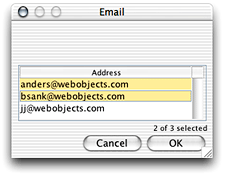

> 导航：[总目录](../../../README.md) · [documentation](../../../_indexes/documentation.md) · [WebObjects Java Client Programming Guide](Introduction%20to%20WebObjects%20Java%20Client%20Programming%20Guide.md)


[Next](Adding%20Custom%20Menu%20Items.md)[Previous](Restricting%20Access%20to%20an%20Application.md)

# Generating Controllers With the Controller Factory

Much of the magic behind Direct to Java Client applications happens in the controller factory, the class `com.webobjects.eogeneration.EOControllerFactory`. The purpose of the class is to produce controllers—windows, dialogs, list controllers, select controllers, controllers for particular tasks, and so on. By learning how to use the controller factory programmatically, you can take greater control of Direct to Java Client applications—you can learn to be the magician.

_Problem:_ You need a user interface and logic to provide a way for users to select an object or objects from a particular table in the data store.

_Solution:_ Use the controller factory to get a select controller for a particular entity.

If you tackle this task without using the rule system, you could spend an hour or more in Interface Builder building the user interface and connecting it to a custom controller class to get the selected objects and pass them on to the requesting object. But by using the rule system and the controller factory, a single method invocation does all of this for you.

In a client-side view class (such as the CustomFormController class in [Extend a Controller Class](Enhancing%20the%20Application.md#apple-f4xwc4dqnrsv64tfmyxwi33df52wszbpkridgmbqgaytamjxfvbuqmzqgmwviucykjcummjtg4) or a subclass of another core controller class), add the import statement for `com.webobjects.eogeneration`. This package contains the controller factory. Then, in the action method that triggers the selection, add this invocation on the controller factory:

`EOControllerFactory.sharedControllerFactory().selectWithEntityName("`_entityName_`", true, false);`

The method takes three arguments: the entity to select from, a Boolean value determining whether multiple selections are allowed, and a Boolean value representing whether the insertion of new records is allowed (if the dialog provides an action to add new records). When invoked, the method presents a select dialog like that shown in Figure 12-1.

__Figure 12-1__  Select dialog



The method returns an array of EOGlobalID objects representing the selected objects. To get enterprise objects from EOGlobalID objects, you can use the method `objectForGlobalID` defined in `com.webobjects.eocontrol.EOEditingContext`. See the API reference for more information.

_Problem:_ You need to provide a custom task to perform some function in the application. You need a way to trigger this task.

_Solution:_ Write a task using a rule and trigger it with an invocation on the controller factory.

Suppose that you have a frozen XML interface in your application. There is no method in the controller factory to simply invoke this frozen interface. But you can easily define a task to do this.

If the frozen XML component is called ImageQueryController, you would define the new task like this:

**Left-Hand Side:**
: `(task ='imageQuery')`

**Key:**
: `window`

**Value:**
: `"ImageQueryController"`

**Priority:**
: `50`

In a client-side view class (not a model class or a controller class), add the import statement for `com.webobjects.eogeneration`. This package contains the controller factory. Then, in the action method that triggers the selection, add this invocation on the controller factory:

```
EOControllerFactory.sharedControllerFactory().openWindowForTaskName("imageQuery");
```


_Problem:_ You need to provide a form window for a particular task so a user can insert new records into a table.

_Solution:_ Use the controller factory to get a form controller for a particular entity.

If you implement this feature without using the controller factory or the rule system, you could spend an hour or more in Interface Builder building the interface, connecting the controller, and then writing code to invoke the interface. But by using the rule system and the controller factory, a single method invocation does all of this for you.

In a client-side view class (not a model class or a controller class), add the import statement for `com.webobjects.eogeneration`. This package contains the controller factory. Then, in the action method that triggers the selection, add this invocation on the controller factory:

```
EOControllerFactory.sharedControllerFactory().insertWithEntityName("Document");
```

This method simply takes the name of an entity in the enterprise object model group of your application. It results in a form window like that shown in Figure 12-2.

__Figure 12-2__  Form window from controller factory


[Next](Adding%20Custom%20Menu%20Items.md)[Previous](Restricting%20Access%20to%20an%20Application.md)

