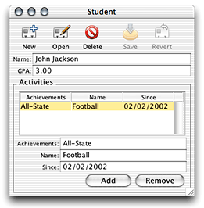
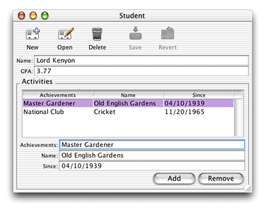
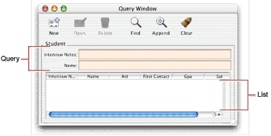
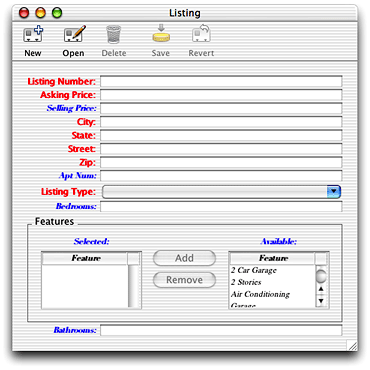

> 导航：[总目录](../../../README.md) · [documentation](../../../_indexes/documentation.md) · [WebObjects Java Client Programming Guide](Introduction%20to%20WebObjects%20Java%20Client%20Programming%20Guide.md)

[Next](The%20Distribution%20Layer.md)[Previous](Building%20a%20Simple%20Application.md)

# Inside Assistant

This chapter gives more details about the Direct to Java Client Assistant, the first tool to use for customizing Direct to Java Client applications. Assistant is an application that helps you write rules for Direct to Java Client applications. It edits the `user.d2wmodel` file that all Direct to Java Client applications have. Assistant does nothing special that you cannot do by hand in Rule Editor but it is saves you from needing to know all the keys , values, and valid key-value combinations in the rule system.

This chapter explains what you can do in each of the panes in the Direct to Java Client Assistant. This chapter does not explain the basics of the rule system. For that information, see [Inside the Rule System](Inside%20the%20Rule%20System.md#apple-f4xwc4dqnrsv64tfmyxwi33df52wszbpkridgmbqgaytamjxfvbuqmzqgywviubr).

Direct to Java Client defines three entity types: main, enumeration, and other. An entity can be only one of these types. The Entities pane provides an easy way for you to change entities from one type to another.

Although you can freely change an entity’s type, you should be cautious when doing so. The rule system considers an entity to be of a particular type based on certain heuristics (these are defined for each entity in the following sections). This means that when you change an entity’s type, you are changing what the rule system expects an entity to be. That is, you are changing how the rule system expects an entity to be defined in an EOModel.

If you need to change an entity’s type, you should first consider changing the application’s data model so that the rule system considers a particular entity to be of the type you want by default. The rule system is smart and if it interprets your data model in ways you don’t expect, it’s highly likely that your data model is misconfigured.

For example, if you want the rule system to consider a particular entity an enumeration entity, make sure that the entity has fewer than five attributes and that it is not the destination of any relationships that use the cascade delete rule. The rule system then by default considers the entity to be an enumeration entity. (Again, how the rule system determines an entity’s type is defined in the following sections).

In summary, although Assistant allows you to easily change an entity’s type, an entity’s type should reflect the entity’s characteristics as defined in the EOModel in which the entity is defined.

A main entity is generally a top-level entity that users work with most frequently. Consequently, Direct to Java Client creates a tab view for each main entity in the Query Window and provides form windows for editing each of the main entities.

Direct to Java Client by default defines a main entity as one that is not the destination of any relationships that have the following characteristics:

- propagate primary key
- own destination
- use the cascade delete rule

If you’re using entity inheritance, abstract entities are not considered main entities by default.

By default, an enumeration entity conforms to the conditions for main entities and additionally conforms to these conditions:

- the entity has fewer than five attributes
- the entity has no relationships that are mandatory
- all the entity’s relationships use the deny delete rule

In practice, enumeration entities should define a collection of values that represent a list of choices. The values in enumeration entities are usually fairly static, and you usually don’t want a complex user interface for changing them. Enumeration entities exist to provide a simple user interface for a list of choices.

An enumeration window contains a tab view for each of the application’s enumeration entities. The tab view for a particular entity shows the complete set of values in that entity. You can add a new value to the enumeration’s collection (Add), delete a value from the collection (Remove), and modify a value (make changes and click Save).

Entities that aren’t main or enumeration entities are considered other entities. Other entities can be manipulated through the master-detail user interfaces of main entities. You cannot directly query or enumerate on other entities: A tab view is not provided for them in query windows or in enumeration windows. The only way you can access an other entity is through a master-detail interface in a main entity in which the other entity is the detail interface. A master-detail interface represents a relationship in which the master object (such as a Student) has one or many detail objects (such as Activities).

The Properties pane lets you see how the rule system interprets the attributes of entities in the application’s data model. It simply tells you which attributes of each entity are displayed for each window type and each task in the client application. The attributes of a particular entity that are displayed for a particular window type and task are listed in the Property Keys list.

Figure 4-1 shows that for the Student entity for the query task for all question types (window or modal dialog, which simply represents the type of the window that is displayed) to display the `name` and `gpa` attributes. [Figure 3-30](Building%20a%20Simple%20Application.md#apple-f4xwc4dqnrsv64tfmyxwi33df52wszbpkridgmbqgaytamjxfvbuqmzqgawueq2ji5cekskk) shows a window that reflects this configuration. The window is a nonmodal window that is a query window that queries on the Student entity and provides fields for qualifying the query on the `name` and `gpa` attributes.

__Figure 4-1__  Properties pane in Assistant

The Task pop-up menu lists the four primary tasks in the client application: form, identify, list, and query. When you choose one of these tasks from the menu, the properties that are displayed for each entity for that task are shown in the Property Keys list. By selecting an entity, a task, and a question, you can choose which properties (attributes) are displayed in form windows (form task), in modal dialogs (identify task), in query windows (query task), and data lists (list task).

The different tasks correspond to four different window types:

**form**
: Used to enter new records or edit existing records. Contains a property key for each attribute of an entity that is a property key. Each property key is associated with a widget such as a text field or checkbox.

Figure 4-2 shows a form window for an entity named Student, which has two attributes that are in the Property Keys list in Assistant.

__Figure 4-2__  Form task

**identify**
: Used whenever an object is referenced in the user interface, such as in a master-detail interface. Figure 4-3 shows a form window that displays a master-detail relationship. You’ll add this relationship later in the chapter.

The student record is the master record, while the student’s activities are the detail records. The detail records are represented by the identify task in the rule system. So if you wanted to display only the `name` and `since` attributes of the activities records, you would select the identify task and the Activity entity in the Properties pane of Assistant and move all other attributes to the Other Property Keys list.

__Figure 4-3__  Identify task

**list**
: Displays the results of a query in a table view. Only the attributes that are property keys are displayed in the list. Figure 4-4 shows a list task within a query window.

**query**
: Provides a text field to query on for each property key that can be queried on as a string. That is, class properties that map to binary data types cannot be directly queried on. For attributes that map to numeric data types, two text fields are provided so users can query on a range of numbers.

Figure 4-4 shows a query window that contains a query task that maps to an entity named Student, which has two property keys, Interview Notes and Name.

__Figure 4-4__  Query window and list task

This menu allows you to change task behavior depending on the window type. By default, all changes to tasks affect both windows and modal dialogs. But if you want different behavior or a different look in one of the window types, choose it in the Question menu before making changes to the Task pop-up menu and Property Keys list.

The property keys displayed in Assistant are all the attributes of an entity that are marked as client-side class properties in the application’s EOModel. Only those attributes that are listed in the Property Keys list are visible in the client application. You can choose which attributes are displayed for a particular task for a particular entity by moving attributes to and from the Property Keys list.

A property key is by definition not just an attribute in an entity. A property key is any key in an enterprise object, which includes relationships, methods, and instance variables, that can be resolved by key-value coding.

By default, the property keys that are displayed in Assistant are the client-side properties (attributes and relationships) of the selected entity. It’s common to write methods in business logic classes (custom enterprise object classes) that return a value.

To display this value in the client application, you need to let the rule system know about the method. You do this by adding an additional property key path using the Additional Property Key Path field. The rule system then looks in the custom enterprise object class with which the entity is associated for a key that corresponds to the new property key path. Again, this key can be any key that is resolvable through key-value coding.

The Widgets pane lets you tweak user interface elements by adjusting their editability, label, format, alignment, size, and more. You make adjustments on a per-task basis. By assigning new property keys to a particular widget type, you can easily add custom actions, QuickTime movies, and other user interface features to applications.

Starting with WebObjects 5.2, the Widgets pane allows you to specify layout hints and levels for property keys in form windows. You can specify the following layout hints (components are property key widgets):

- __Columns__: Components are placed underneath each other from top down and in multiple columns if there are many.
- __Row__: Components are placed side-by-side from left to right.
- __FullWidth__: Components are placed underneath each other and each covers the full width of the window.
- __Box__: Components are placed in a titled box.
- __Switch__: Components are placed in a switch view (typically a tab view).
- __Subwindow__: Components are placed in a subwindow and a button appears in the main window to display the subwindow.
- __Inspector__: Components are placed in an inspector window and a button appears in the main window to display the inspector.
- __VerticalSplit__: Components are placed in a vertical split view. You must change the layout hint for exactly two property keys to use VerticalSplit.
- __HorizontalSplit__: Components are placed in a horizontal split view. You must change the layout hint for exactly two property keys to use HorizontalSplit.

For particularly complex data models, you may also want to specify a layout level. Layout levels specify the order in which components are generated by the rule system. The rule system generates the user interface one level at a time, with the order of the layout hints as listed above. Layout levels allow you to order the visual display of properties without regard to the entity with which those properties are associated.

For example, a window would display at the top the properties for which you specified a layout level of 1 and a layout hint of Columns, below that the properties with the layout level 1 and the hint Row, and so on through the list of layout hints at that level, which ends with the hint HorizontalSplit.

After that are displayed the properties for which you specified a layout level of 2 and a layout hint of Columns, then the properties with the layout level 2 and hint Row, and so on through the list of layout hints.

Before layout levels were available, the only way to specify the visual layout of properties was in the Properties pane by ordering the Property Keys list. This provided no facility to control the order of entities in a particular layout or to intermix properties from one entity with another.

You use the options in the Windows pane to change the window-level characteristics of specifications in the application. This allows you to specify whether a particular window is regular or modal, or is a dialog. You can also specify the title for each type of window, the default positioning, and minimum width and height.

The two options in the “Customize runtime behavior” section allow you to control how the controller factory caches the components it generates.

**Factory Reuse Mode**
: Tells the controller factory how and when to generate new windows. For example, the Enumeration Window has a factory reuse mode of AlwaysReuse whereas form windows have a factory reuse mode of NeverReuse (which tells the controller factory to open a new form window for each request for a form window).

**Dispose If Deactivated:**
: Tells the window controller whether closing it should dispose of the window in memory (that is, if it should not make an attempt to prevent it from being garbage collected). For example, form windows just disappear whereas an Enumeration Window stays in memory as single instance.

The Miscellaneous pane contains additional options for customizing the user interface. Starting with WebObjects 5.2, it offers considerably more options and allows you to take precise control over the user interface layout. Again, like everything throughout Assistant, the options in this pane generate rules rather than code.

Figure 4-5 shows the layout that results from many customizations in the Miscellaneous pane.

__Figure 4-5__  Very customized layout

The Optimize For Mac option generates a layout that adheres more closely to the Aqua Human Interface Guidelines. The Use Button and Use Action options control the placement and look of action buttons that activate subwindows, inspector windows, or other action controllers in the client application. For example, if you use the Inspector layout hint, you must also set Use Action to True and Use Button to False in order for that inspector’s action button to appear in the toolbar.

The XML pane provides a list of all the specifications that make up the components in the client application. Specifications are XML hierarchies that are generated by the rule system and that are transformed into Swing by the generation layer on the client. You’ll learn more about this in [Inside the Rule System](Inside%20the%20Rule%20System.md#apple-f4xwc4dqnrsv64tfmyxwi33df52wszbpkridgmbqgaytamjxfvbuqmzqgywviubr).

You use the information in this pane when freezing XML files as described in [Freezing XML User Interfaces](Freezing%20XML%20User%20Interfaces.md#apple-f4xwc4dqnrsv64tfmyxwi33df52wszbpkridgmbqgaytamjxfvbuqmzrgmwviubr). The Save button saves the XML description as a text file.

[Next](The%20Distribution%20Layer.md)[Previous](Building%20a%20Simple%20Application.md)

