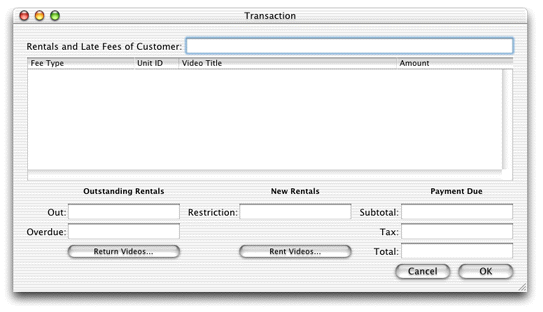
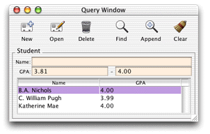
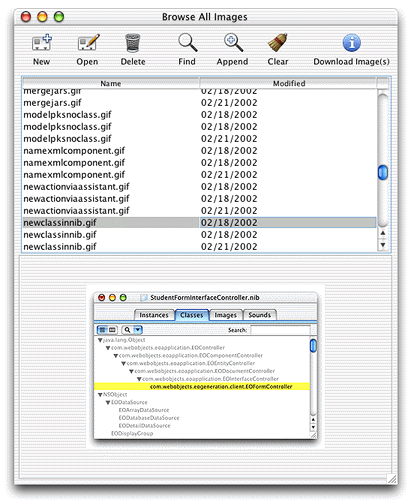

> 导航：[总目录](../../../README.md) · [documentation](../../../_indexes/documentation.md)

[Next](Development%20Process%20Overview.md)

# Introduction to WebObjects Java Client Programming Guide

WebObjects recognizes the need for distributed, three-tier application solutions with more complex, rich, and responsive user interfaces than HTML allows. So, in addition to HTML-based WebObjects applications, you can also write Java-based WebObjects desktop applications that use Swing for the user interface. The client part of these applications runs as real desktop applications in the client’s Java virtual machine. This feature of WebObjects is called Java Client.

WebObjects Java Client is a three-tier network application solution that allows you to develop platform-agnostic desktop applications with database access and rich user interfaces. Java Client applications are WebObjects applications: They share much of their API with traditional HTML-based WebObjects applications such as the Enterprise Object technology for database access, the WebObjects framework for session management, and the rule system, which enables rapid development and provides a flexible rule-based approach to application development.

This book introduces you to Java Client by first presenting key concepts such as architecture, enterprise objects, client-server communication, object distribution, the Model-View-Controller paradigm, and rule-based application development. Then, you are led through the development of simple yet practical tutorials that introduce you to the WebObjects developer tools and the features of Java Client. Finally, the book provides a number of task-specific chapters that teach you how to add to applications features like access controls, custom menu items, and sophisticated user interfaces.

There are two starting points in Java Client development—the Direct to Java Client project type and the Java Client project type. This book teaches you how to build Java Client applications starting with the Direct to Java Client approach. This approach reduces the amount of code you need to write and lets you take advantage of some of the best features of WebObjects such as the rule system and rule-based rapid development. And you can easily integrate all aspects of the nondirect approach (such as hand-built user interfaces) into the direct approach for maximum flexibility.

Some of the customizations you’ll perform in the tutorials—such as building user interfaces in Interface Builder—teach you just about everything you need to know to build strictly nondirect Java Client applications. So if you’re an experienced Java Client developer, don’t think that this book isn’t for you. By learning how to leverage the features of the Direct to Java Client approach, you’ll learn how to build better Java Client applications.

This book is intended for a wide variety of audiences, including

- new WebObjects developers
- new Web developers
- WebObjects HTML developers
- experienced WebObjects Java Client developers

This book assumes that you have some background in object-oriented programming, specifically in Java. Because WebObjects is most valuable when used to provide database connectivity to distributed applications, a basic understanding of relational databases is assumed throughout the book.

The book, however, does not assume any prior knowledge of WebObjects. Although you’ll better understand the advanced concepts in Java Client if you’ve developed HTML-based WebObjects applications, this knowledge isn’t necessary to be a successful Java Client developer.

If you’re new to WebObjects development, you may find the book _[WebObjects Web Applications Programming Guide](../WebObjects%20Web%20Applications%20Programming%20Guide/Introduction%20to%20WebObjects%20Web%20Applications%20Programming%20Guide.md#apple-f4xwc4dqnrsv64tfmyxwi33df52wszbpkridgmbqgaytamjq)_ useful when learning Java Client as it provides an introduction to the WebObjects tools and to common WebObjects programming techniques and concepts.

The most important part of any type of WebObjects application is the data model. If data modeling is a new concept for you, read _[EOModeler User Guide](../EOModeler%20User%20Guide/Introduction%20to%20EOModeler%20User%20Guide.md#apple-f4xwc4dqnrsv64tfmyxwi33df52wszbpkridgmbqgaytamjy)_ to learn how to build data models that describe the object-relational mapping model that forms the core of your application.

Finally, the book _[WebObjects Direct to Web Guide](../WebObjects%20Direct%20to%20Web%20Guide/Introduction%20to%20WebObjects%20Direct%20to%20Web%20Guide.md#apple-f4xwc4dqnrsv64tfmyxwi33df52wszbpkridgmbqgaytamjv)_ helps you better understand the rule system and the dynamic user-interface generation it provides. Familiarity with these concepts will help you grasp the mechanics of Direct to Java Client.

If you’re new to Java Client, start with the chapter [Java Client Concepts](Java%20Client%20Concepts.md#apple-f4xwc4dqnrsv64tfmyxwi33df52wszbpkridgmbqgaytamjxfvbuqmrzhewviubz) to familiarize yourself with the Java Client architecture and to learn about the fundamental objects used in a Java Client application, especially enterprise objects. Then, move on to [Building a Simple Application](Building%20a%20Simple%20Application.md#apple-f4xwc4dqnrsv64tfmyxwi33df52wszbpkridgmbqgaytamjxfvbuqmzqgawviubz) to learn how to set up a simple database and build a Direct to Java Client application that accesses it.

If you’ve had some experience with Java Client, you may want to start with the chapter [Enhancing the Application](Enhancing%20the%20Application.md#apple-f4xwc4dqnrsv64tfmyxwi33df52wszbpkridgmbqgaytamjxfvbuqmzqgmwviubr), which covers topics like business logic partitioning, user interface customization, and custom actions. Or, if you’re already comfortable with these topics, you may want to consult the task chapters, beginning with [Restricting Access to an Application](Restricting%20Access%20to%20an%20Application.md#apple-f4xwc4dqnrsv64tfmyxwi33df52wszbpkridgmbqgaytamjxfvbuqmzqhawviubr), to learn how to change application flow, integrate Interface Builder files into Direct to Java Client applications, write custom controller classes, and extend applications in other ways.

This book presents the topic of Java Client applications in a way different from previous books and tutorials in the WebObjects documentation suite. In the past, Direct to Java Client and Java Client were considered as two different approaches to Java Client development. But it is more correct to simply understand them as different starting points in Java Client development.

This book encourages you to begin development with the Direct to Java Client project type and it presents aspects of the nondirect approach as customization techniques for applications developed from the Direct to Java Client starting point. You are strongly encouraged to begin development with the direct approach and to use nondirect interfaces within it to leverage the best of both worlds. See [Java Client Development](#apple-f4xwc4dqnrsv64tfmyxwi33df52wszbpkridgmbqgaytamjxfvbuqmrzg4wviucykjcummjrge) for more information on this topic.

The Java Client feature of WebObjects has many parts. It includes these frameworks:

- JavaEOGeneration
- JavaEOApplication
- JavaEODistribution
- JavaEORuleSystem
- JavaEOInterface

The product also includes the following example projects that are specific to Java Client:

- JCDiscussionBoard
- JCRealEstate
- JCRealEstatePhotos
- JCAuthentication
- JCMovies
- JCPointOfSale
- JCRentalStore
- JCStudios
- JCEntityViewer
- JavaClientLauncher

In addition to this book, documentation for Java Client can be found in the API reference for these packages:

- `com.webobjects.eogeneration`
- `com.webobjects.eogeneration.rules`
- `com.webobjects.eoapplication`
- `com.webobjects.eoapplication.client`
- `com.webobjects.eointerface`
- `com.webobjects.eointerface.swing`
- `com.webobjects.eodistribution`
- `com.webobjects.eodistribution.client`

If you’re looking for a three-tier Java application platform with robust data access, rapid development tools, and powerful, innovative customization capabilities, WebObjects Java Client is the perfect solution. Consider the features it offers.

Java Client applications differ from HTML-based WebObjects applications in that the user interface is built on Sun’s JFC/Swing classes, rather than on HTML. This lets Java Client applications take advantage of the rich user interface elements the Swing toolkit offers. The primary reason for choosing to build a WebObjects application using Java Client is the need for a rich, more interactive user interface.

Rich user interfaces let you build more complex and interactive applications than HTML allows. As the user interface becomes more robust, it is easier to display and manipulate complex data. The more active feel of desktop applications gives users the ability to work more efficiently: Desktop applications feel like they are closer to the data store.

Java Client is built on the paradigm of object distribution. It distributes enterprise objects between an application server and one or more clients—Java applications or applets. The developer controls how this distribution occurs.

In all multitier network applications, it’s vitally important that the developer has control over where the business logic sits. Some information such as credit card numbers and passwords are important elements of business logic and should not be sent to the client. Likewise, certain algorithms represent confidential business logic and should live only on the application server. By partitioning your business logic into client-side and server-side classes, you can improve performance and secure business rules and legacy data.

In pure Java applications, object distribution is crucial in protecting business rules. Since Java bytecode is easily decompiled, it’s important that you have control over the objects that live on the client. Object distribution, coupled with remote method invocation, lets you build secure, high-performance applications.

As with any type of WebObjects application, Java Client gives you a lot for free. Its tight integration with the Enterprise Object technology takes care of many basic database access tasks for you. Without writing a single line of code, Java Client allows you to connect user interface widgets to database actions such as saving, retrieving, reverting, undoing, adding objects, and editing objects. Furthermore, Java Client’s integration with Enterprise Objects abstracts development above the need to ever write a line of SQL. And the development tools you use to build Java Client applications let you build complex user interfaces in Swing without writing any code.

It is the WebObjects philosophy that the technology should take care of all the tasks fundamental to three-tier applications: database access, user interface coding, deployment, and client-server communication. That way, you can focus on writing business logic that best leverages the powerful data access mechanisms all WebObjects applications offer.

The client-side application of WebObjects Java Client applications runs on any Java Runtime Environment (JRE) 1.3.1 or later system. The server-side application runs on any supported WebObjects deployment server, which includes many J2EE servers. Since the Java Client architecture isolates the application logic from any particular data access mechanism, you have the flexibility to use many types of JDBC and JNDI data sources regardless of the deployment platform.

In addition to supplying powerful data modeling, project development, and interface building tools, Java Client includes a sophisticated rapid-development environment based on the WebObjects rule system.

The Java Client rapid-development starting point, called Direct to Java Client, generates application user interfaces by analyzing your application’s data model. Direct to Java Client allows you to immediately see how changes in your data model affect your application’s user interface.

Direct to Java Client lets you focus on writing custom business logic and provides customization techniques that allow you to build sophisticated user interfaces without writing any code. Best of all, Direct to Java Client applications are completely integrated with the Enterprise Object technology, so they take full advantage of the rich data access and persistence mechanisms that technology offers. And applications built from the Direct to Java Client starting point benefit from all aspects of applications built from the nondirect Java Client starting point.

Java Client is a great technology for developing and deploying desktop applications with powerful database access in controlled network environments where the end users are known and are willing to install parts of the client application. It is not ideal, however, for use in uncontrolled Internet environments or for high-traffic websites. Typically, Java Client applications are practical only in _intranet_ environments.

Consider the case of a software company’s bug-tracking system. Perhaps the company wants to give premium support customers access to the system through a Java Client application. These customers are assumed to be knowledgeable users and would have no problem downloading and installing certain parts of the client application. However, providing the client application as a desktop application from the company’s main website to a large number of novice end users would be impractical due to the support those users would need installing and maintaining a current version of the client application.

When deployed as desktop applications, Java Client applications have special deployment requirements because part of the application runs on the user’s computer. Unlike HTML-based applications, it is not enough to have a browser application to run a Java Client application as a desktop application. You either need to install the client-side application on user computers, which requires system administration, or users need to download the client-side application every time they want to use it. This makes Java Client applications too complex for the average Internet application user who expects to type a URL in a browser and enter an application within seconds of hitting the website.

However, you can also deploy Java Client applications as applets that run in browsers. This alleviates many of the issues encountered when running Java Client applications as desktop applications as users don’t need to download or install the client application. However, applets introduce other usability and deployment issues, which are discussed in [Deployment Options](Deploying%20Client%20Applications.md#apple-f4xwc4dqnrsv64tfmyxwi33df52wszbpkridgmbqgaytamjxfvbuqmzqg4wueqkcjbauirsb). And, starting with WebObjects 5.2, support for deploying Java Client applications as applets is deprecated in favor of using Java Web Start.

Starting with WebObjects 5.1, the Java Client Class Loader eases deployment and improves usability, thereby alleviating many of the issues regarding application distribution and maintenance. See [More About the Java Client Class Loader](Building%20a%20Simple%20Application.md#apple-f4xwc4dqnrsv64tfmyxwi33df52wszbpkridgmbqgaytamjxfvbuqmzqgawueq2jjbaukrck) for more information.

Starting with WebObjects 5.2, all Java Client applications take advantage of Java Web Start. This technology eases client-side application deployment and usability by providing caching and other mechanisms to the client. It requires no installation or upgrades on the part of the user. It requires only the presence of the JRE and the Java Web Start Application Manager on the client. In short, Web Start expands the possible user base of Java Client applications by providing transparent application installation and upgrades.

That said, in deciding to use Java Client, you should evaluate the technology with these criteria in mind: portability, performance, network environment, administration, security, and user experience.

- __Portability.__ Java Client applications are 100% Pure Java applications, requiring a JRE 1.3 or later system. Java Client applications running in Mac OS X take advantage of platform-specific interface features such as the global menu bar and the dirty window marker without compromising platform independence.
- __Performance.__ After the initial download of Java classes to the client, Java Client applications don’t exchange large chunks of data between client and server. Rather, compact business objects are exchanged over the network. Also, the Java Client architecture separates the user interface layer from the data exchange layer, so data flows across the network independent of user interface data.

  For example, in an HTML-based application, switching panes in a tab view requires a round trip to the server to fetch more data or user interface information. However, in Java Client, the client application usually has no need to contact the server for these types of user interface actions. This allows Java Client applications to scale well, and a WebObjects application server should scale just as well serving Java Client applications or HTML-based applications.
- __Network environment.__ Java Client applications can be deployed across the Internet; they are not inherently constrained to intranet environments. However, they are not appropriate for high-volume, high-visibility websites because of the long initial download and other system administration requirements (including the presence of JRE 1.3 or later).
- __System administration.__ The presence of JRE 1.3 or later is not ubiquitous amongst desktop operating systems. Mac OS X includes JRE 1.3 out of the box; JRE 1.3 is not available for Mac OS 9 or earlier versions; Sun provides the JRE for Windows platforms, but it does not ship in the box; JRE 1.3 is available for many UNIX platforms. So, while the JRE is widely available, it must often be downloaded and installed by the end user. You should evaluate your target market, keeping in mind that installing the JRE will frustrate some customers.
- __Security.__ If you take careful steps to partition your business logic and implement the appropriate security mechanisms (delegates), Java Client applications offer security equal to that of HTML-based applications. By default, Java Client uses HTTP as the transport protocol between client and server, but it can be replaced with another, more secure protocol such as SSL.
- __Client-side processing.__ Web applications do the majority of their processing on the server, while Java Client moves much of an application’s processing to the client. This reduces the amount of client-server communication considerably, making Java Client applications much quicker than their Web counterparts for many operations.
- __User experience.__ All the preceding criteria affect user experience in some way. If your application demands a rich user interface, the manipulation of complex data, and long sessions, Java Client is an excellent choice.

There are two starting points in Java Client development represented by two Project Builder project types: Direct to Java Client and Java Client. _You should always start with the Direct to Java Client project type._ The nondirect project type gives you almost no advantages—you write more code, the application is less dynamic, and maintenance costs are much higher. And you can use all the features of nondirect Java Client in Direct to Java Client applications, so you don’t lose anything by starting with the Direct to Java Client project type. So unless you know that your application will not gain anything from using the rule system and dynamic user-interface generation, always choose the direct approach when building a Java Client application.

Without customizations, the fundamental difference between the two project types is that Direct to Java Client makes use of the rule system and nondirect Java Client does not.

You can think of the relationship this way: An uncustomized nondirect Java Client application is a completely customized Direct to Java Client application that doesn’t use the rule system for building user interfaces or managing the basic tasks of the client application such as application startup. Whereas the user interface in uncustomized Direct to Java Client applications is generated dynamically at runtime and can include static, hand-built user interfaces, the user interface in nondirect Java Client applications is always static and built by hand.

Perhaps the most significant difference between the two starting points is that Direct to Java Client provides a rapid development environment that is useful both for prototyping applications and for building full-featured, usable applications. When you start with the nondirect approach, you get almost nothing for free—you have to build all the user interfaces for the application by hand. This book highly recommends that you begin with the Direct to Java Client project type and use elements of the nondirect project type within it if necessary.

If you need the precise user-interface customization that the nondirect approach allows, it’s much easier to integrate a custom interface file in a Direct to Java Client application than to develop a completely custom Java Client application (though this is possible and supported). That way, you get the best of both worlds: the advantages of Direct to Java Client and the advantages of custom interfaces built with the nondirect approach.

The primary advantage of Direct to Java Client is that it’s not necessary to write source code to generate or manage all of an application’s user interface. This allows you to focus on writing business logic instead. The direct approach lets you manage user interfaces without writing much source code and offers a number of alternative mechanisms to customize user interfaces:

- Direct to Java Client Assistant (tool)
- custom rules (rule system)
- freezing XML (custom interface)
- freezing nib files (custom interface)
- using custom controller classes (custom code)
- using the controller factory programmatically

This book covers all of these customization methods.

The user interfaces for the two staring points to Java Client development each have a particular character. However, keep in mind that it’s possible to customize each type of interface to look like the other.

Typically, user interfaces built in Interface Builder for nondirect Java Client applications or for use as frozen interface files in Direct to Java Client applications resemble [Figure I-1](#apple-f4xwc4dqnrsv64tfmyxwi33df52wszbpkridgmbqgaytamjxfvbuqmrzg4wviucykjcummjrha).

__Figure I-1__  A custom Java Client interface

The dynamic user-interface generation provided in Direct to Java Client applications yields interfaces that resemble Figure I-2. However, advanced Direct to Java Client applications are likely to include other, nondynamically generated user interfaces such as custom controller classes or frozen interface files built in Interface Builder.

__Figure I-2__  A typical Direct to Java Client application

Figure I-3 shows dynamically generated user interfaces that make use of custom controller classes, custom rules, and programmatic invocations of the controller factory.

__Figure I-3__  Dynamically generated user interface

Direct to Java Client simplifies many parts of the development process and facilitates the addition of features such as localization, data access, and data model synchronization. The direct approach to Java Client is a great way to start developing Java Client applications because it allows you to rely on the rule system to dynamically generate user interfaces. Dynamically generated user interfaces are more flexible with regard to changes made in your data model than are static interfaces and provide other advantages as shown in [Table I-1](#apple-f4xwc4dqnrsv64tfmyxwi33df52wszbpkridgmbqgaytamjxfvbuqmrzg4wviucykjcummjsgq).

__Table I-1__  Comparison of static and dynamic user interfaces

|  | Static interfaces | Dynamic interfaces |
| Tools and techniques used to build | Interface Builder and raw Swing. | Assistant, XML freezing, Interface Builder files, custom controller classes, controller factory invocations. |
| Development speed | Moderate to slow depending on user interface design. | Rapid. User interfaces are automatically generated but are also easily customizable. |
| User interface synchronization with data model | Difficult. User interface not synchronized with data model once user interface building begins. | Synchronization happens throughout much of the customization process. |
| Localization | Must use different interface files. | Mostly automatic using the rule system. |
| Maintenance | More frozen code and frozen interface elements to manually maintain. | Applications are easier to maintain and bring forward. |

If you decide to start development with the nondirect Java Client approach, you should keep in mind that your application will be harder to bring forward and maintain than an application started with the Direct to Java Client approach. The maintenance costs are higher for a number of reasons:

- you write more code
- you have more frozen interface pieces
- you need multiple versions of the same interface file for each language and platform
- it’s harder to synchronize the user interface with changes in data models

So while you can write nondirect Java Client applications, the Direct to Java Client approach helps you build applications that are far easier to bring forward and maintain. You’ll also find that application development time is significantly reduced with the direct approach.

WebObjects applications gain much of their usefulness by interacting with data stores, and the Enterprise Object technology is the mechanism by which WebObjects applications interact with data stores.

The Enterprise Object technology is responsible for

- communicating with the data source
- representing data fetched from the data source in enterprise objects
- managing the graph of enterprise objects
- mediating between the object graph and user interfaces
- providing application utilities to Java Client applications
- managing object distribution across networks to Java clients

Enterprise Objects is introduced in more detail in [Enterprise Objects](Java%20Client%20Concepts.md#apple-f4xwc4dqnrsv64tfmyxwi33df52wszbpkridgmbqgaytamjxfvbuqmrzhewviucykjcumny).

Also see [Related Documents](#apple-f4xwc4dqnrsv64tfmyxwi33df52wszbpkridgmbqgaytamjxfvbuqmrzg4wuerkjineuuskg) to learn how to access the WebObjects API reference and other documents on the Enterprise Object technology.

There are many distributed multitier Java-based architectures on the market today. So how do they compare to WebObjects Java Client?

Client JDBC applications use a fat-client architecture. Custom code invokes JDBC on the client, which in turn goes through a driver to communicate with a JDBC proxy on the server. This proxy makes the necessary client-library calls on the server.

The shortcomings of this architecture are typical of all fat-client architectures. Security is a problem because the bytecodes on the client are easily decompiled, leaving both sensitive data and business rules at risk. In addition, this architecture doesn’t scale; it is expensive to move data over the channel to the client. Also, client JDBC applications access the data source directly—there is no server layer to validate data or control access to the data source.

JDBC three-tier applications (with CORBA as the transport) are a big improvement over client JDBC applications. In this architecture, the client can be thin since all that is required on the client side are the Java Foundation Classes (JFC), nonsensitive custom code (usually for managing the user interface), and CORBA stubs for communicating with the server. Sensitive business logic and database connection logic are stored on the server. In addition, the server handles all data-intensive computations.

The JDBC three-tier architecture has its own weaknesses. First, it results in too much network traffic. Because this architecture uses proxy business objects on the client as handles to real objects on the server, each client request for an attribute is forwarded to the server, causing a separate round trip. Second, JDBC three-tier requires developers to write much of the code themselves, from code for database access and data packaging, to code for user interface synchronization and change tracking. Finally JDBC three-tier does not provide much of the functionality associated with application servers, such as application monitoring and load balancing, nor does it provide HTML integration.

The Java Client architecture, however, scales well since real, fully functional data objects are copied to the client and round trips are made to the server only for database commits and new data fetches. Also, Java Client applications are designed to leverage custom business logic that lets you control which business objects are sent to the client and lets you validate data from the client before it’s committed to the data store (the server ultimately determines what data is committed).

The following documents provide more information on developing applications with WebObjects:

- _[WebObjects Overview](../WebObjects%20Overview/Introduction%20to%20WebObjects%20Overview.md#apple-f4xwc4dqnrsv64tfmyxwi33df52wszbpkridgmbqgaytamby)_ provides an introduction to the technologies in WebObjects.
- _[WebObjects Web Applications Programming Guide](../WebObjects%20Web%20Applications%20Programming%20Guide/Introduction%20to%20WebObjects%20Web%20Applications%20Programming%20Guide.md#apple-f4xwc4dqnrsv64tfmyxwi33df52wszbpkridgmbqgaytamjq)_ provides an introduction to WebObjects HTML development.
- _[EOModeler User Guide](../EOModeler%20User%20Guide/Introduction%20to%20EOModeler%20User%20Guide.md#apple-f4xwc4dqnrsv64tfmyxwi33df52wszbpkridgmbqgaytamjy)_ describes EOModeler, the tool you use to create data models in WebObjects.
- _[Enterprise JavaBeans](../Enterprise%20JavaBeans.md#apple-f4xwc4dqnrsv64tfmyxwi33df52wszbpkridgmbqgaytamjs)_ describes how to build Enterprise JavaBeans–based applications and how to use third-party beans in WebObjects applications.
- _[WebObjects J2EE Programming Guide](../WebObjects%20J2EE%20Programming%20Guide.md#apple-f4xwc4dqnrsv64tfmyxwi33df52wszbpkridgmbqgaytamjt)_ describes how you can leverage WebObjects components in JSP-based applications. It also describes how to deploy WebObjects applications as servlets.
- _[WebObjects Web Services Programming Guide](../WebObjects%20Web%20Services%20Programming%20Guide.md#apple-f4xwc4dqnrsv64tfmyxwi33df52wszbpkridgmbqgaytamjz)_ describes how to build Web Service providers using WebObjects and how to adapt WebObjects applications to consume Web services.

You can find further documentation for WebObjects and Java Client in three places:

- Project Builder’s Developer Help Center, accessible through the Help menu
- Apple’s WebObjects documentation site: [http://developer.apple.com/documentation/WebObjects](https://developer.apple.com/documentation/WebObjects)
- the WebObjects CD-ROM, which contains the WebObjects API reference, various documents in HTML and PDF, examples, what’s new, and legacy documentation
[Next](Development%20Process%20Overview.md)

