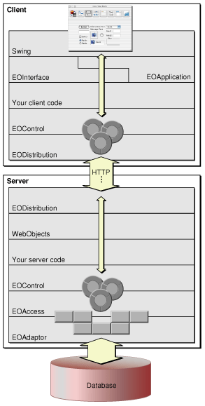
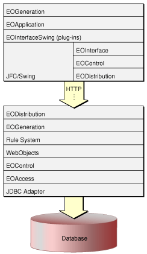

> 导航：[总目录](../../../README.md) · [documentation](../../../_indexes/documentation.md) · [WebObjects Java Client Programming Guide](Introduction%20to%20WebObjects%20Java%20Client%20Programming%20Guide.md)

[Next](Building%20a%20Simple%20Application.md)[Previous](Development%20Process%20Overview.md)

# Java Client Concepts

This chapter introduces you to the fundamental concepts of Java Client. It defines the Enterprise Object technology and explains how it maps your database schema into Java objects. It covers Java Client architecture and includes information on the different framework layers and the functionality they provide. [Building a Simple Application](Building%20a%20Simple%20Application.md#apple-f4xwc4dqnrsv64tfmyxwi33df52wszbpkridgmbqgaytamjxfvbuqmzqgawviubz) links the concepts presented here to practical use in a sample application.

To understand the Java Client architecture, you must first understand enterprise objects. Like all WebObjects applications, Java Client applications gain much of their usefulness by interacting with a persistent data store, usually a database. In WebObjects, databases are represented as collections of objects called enterprise objects that contain your application’s business logic.

The Enterprise Object technology maps your data to these enterprise objects, and you work with the objects rather than directly with the data store. The Enterprise Object technology handles all communication with the database, which frees you from writing SQL and other database-specific code.

The Enterprise Object technology is composed of specialized layers:

- `com.webobjects.eoaccess.EOAdaptor` subclasses use JDBC or JNDI to read and write from data stores.
- `com.webobjects.eoaccess` manages interaction with a database; it is responsible for object-relational mapping.
- `com.webobjects.eocontrol` manages a graph of enterprise objects; tracks insertions into, deletions from, and changes within the object graph.
- `com.webobjects.eointerface` mediates between the control layer and an application’s user interface; maps data to user interface elements.
- `com.webobjects.eodistribution` and `com.webobjects.eodistribution.client` distribute enterprise objects across the network to the client; they provide much of the functionality of the EOAccess layer on the client.
- `com.webobjects.eoapplication` and `com.webobjects.eoapplication.client` form a general user-interface utility layer specific to both types of Java Client applications.
- `com.webobjects.eogeneration` and `com.webobjects.eogeneration.rules` dynamically generate the user interface for Direct to Java Client applications.

These layers are described in more detail later in this chapter.

An enterprise object is like any other object in that it couples data with the methods for operating on that data. However, an enterprise object class has certain characteristics that distinguish it from other classes:

- It has properties that map to stored data; an enterprise object instance typically corresponds to a single row or record in a database.
- It knows how to interact with other parts of the Enterprise Object technology to give and receive values for its properties.

An enterprise object is made up of its class definition (such as `com.webobjects.eocontrol.EOGenericRecord`) and the data values from the database row or record with which the object is instantiated. An enterprise object has a corresponding model that defines the mapping between the class’s object model and the database schema. However, an enterprise object doesn’t explicitly “know” about its model. Rather, it accesses its model through a `com.webobjects.eocontrol.EOClassDescription` object.

One of the fundamental features of the Enterprise Object technology is that it maps the data in data stores (usually relational databases) to objects. The industry term for this is object-relational mapping. The correspondence between an enterprise object class and stored data is established and maintained by a model. A model defines the mapping between enterprise object classes and a data store in entity-relationship terms.

In addition to storing a mapping between the data store schema and enterprise objects, a model file stores information needed to connect to the data store. This connection information includes the name of an adaptor to load so that enterprise objects can communicate with the data store. WebObjects provides a JDBC adaptor that allows you to connect to any JDBC Type 2 compliant or Type 4 compliant database. It also provides a JNDI adaptor, and you can write your own adaptors to connect to other types of data stores.

A Java Client application is essentially an Enterprise Objects application distributed across an application server and one or more client applications or applets.

The design of Java Client breaks up some of the layers of the Enterprise Object technology and distributes them across the client and the application server. Figure 2-1 illustrates this architecture.

__Figure 2-1__  Java Client architecture

The packages `com.webobjects.foundation`, `com.webobjects.eocontrol`, and `com.webobjects.eodistribution.client` are provided on the client to allow real, full-fledged, first-class enterprise objects to exist on the client side. Other technologies similar to Java Client usually implement client stubs on the client side, instead of creating real objects.

The client stub design requires a round trip to the server anytime the user does anything with the business logic on the client. In the Java Client architecture, the business logic (represented in real objects) can be queried and otherwise manipulated without making a round trip to the server. Only when the user explicitly executes a database action, such as saving or fetching, is a round trip to the server made. This is made possible because the distribution layer uses a by-copy distribution mechanism, which is described in more detail in [Java Client and Other Multitier Systems](Introduction%20to%20WebObjects%20Java%20Client%20Programming%20Guide.md#apple-f4xwc4dqnrsv64tfmyxwi33df52wszbpkridgmbqgaytamjxfvbuqmrzg4wviucykjcummjrg4).

The Enterprise Object architecture abstracts business logic from data stores and from specific data-access mechanisms. This abstraction lets you build reusable business objects that are independent of any data store or of the mechanisms for accessing data. If you build well-behaving business objects, you can easily change the data store your model accesses.

To achieve the goal of reusability, the Enterprise Object technology requires that your business logic contains no data store schema information. Business objects should not be identifiable as relating to any specific data store except by the data they contain. That is, your business objects shouldn’t have any knowledge of database primary and foreign keys, JDBC code, or data store connection dictionary information. This allows you to use identical business logic classes on the client and on the server.

In Java Client applications, you must take extra control of your business logic and business objects. Unlike with HTML-based WebObjects applications, Java Client applications pass Java business logic classes (business objects) across the network. Clearly, you want to control which business logic and data each business object contains.

For instance, the client should hardly ever need to know credit card information, user passwords, algorithms specific to your business, or other sensitive business logic. Java Client defines these parameters for business logic partitioning:

- Each business object can be represented by a different class on the client and on the server.
- These different classes usually contain different sets of class properties.
- The goal in business logic partitioning is to pass as little data to the client as possible.
- Since some computations require additional data, it makes sense to let certain algorithms execute on the application server, which lives closer to the data store, and to control if this data is sent to the client.

The most important aspect of business logic partitioning is finding the partitioning scheme that minimizes the amount of data transferred from client to server. This and other business logic partitioning issues are discussed in more programmatic terms in [Business Logic Partitioning](The%20Distribution%20Layer.md#apple-f4xwc4dqnrsv64tfmyxwi33df52wszbpkridgmbqgaytamjxfvbuqmzqgiwviucykjcummzr).

The Foundation framework (`com.webobjects.foundation`) provides a set of robust and mature core classes, including utility, collection, key-value coding, time and date, notification, and debug logging classes.

Although you may choose to use the standard Java classes such as `java.util.Vector` and `java.util.HashTable`, Foundation provides a rich set of classes that you may find more flexible and robust than the standard Java foundation classes.

For historical reasons, the inner workings of WebObjects rely almost totally on Foundation for collections and other low-level functionality. In your custom classes, you are free to use the JDK foundation classes or the WebObjects Foundation classes. However, you’ll find that your custom classes will be better integrated with WebObjects if written with Foundation classes.

Listed here are classes that you may find especially useful in Foundation. Consult the Foundation API reference for complete details.

- __NSKeyValueCoding__ provides arbitrary access to data in objects; a better-performing alternative to standard Java set and get methods.
- __NSLog__ is the WebObjects debug logging system; it allows you to easily control debug logging for everything from SQL generation to user interface generation.
- __NSBundle__ provides file system and archiving services (server-side only).
- __NSDictionary and NSArray__ are common data structures used in object-relational mapping.

The EOAccess layer (`com.webobjects.eoaccess`) is directly responsible for communicating with the data store and for registering enterprise objects with the EOControl layer. It exists only on the server and provides these functions:

- generates SQL to fetch data from and commit data to data stores
- manages the communication chain between the data store and the control layer
- manages model files, which define the object-relational mapping between data stores and Java objects
- provides classes that represent various database elements, such as tables, relationships, stored procedures, and joins
- maps raw data to business objects

EOAccess provides an elegant way to interact programmatically with data stores in an abstract manner. It is designed to work with all different types of data stores and different data store vendors, so many of its objects are portable to different data access environments. Although EOAccess is an essential element of any WebObjects application, you rarely need to use it programmatically.

The following sections introduce important EOAccess classes. For complete details, see the EOAccess API reference.

EOAdaptor defines a server-independent interface for working with relational database systems. This class is subclassed to communicate with specific data sources. Server-specific subclasses encapsulate the behavior of a specific data source.

EOAdaptor isolates your application from any particular data source. By switching the EOAdaptor your application uses, you can change data sources without changing any source code in your application.

EODatabaseContext class has many responsibilities, including fetching, faulting, saving, and managing transactions and channels.

EOModels establish and maintain the correspondence between an enterprise object and stored data in entity-relationship terms. EOModels also store database connection information, including the adaptor’s name.

EOUtilities provides a collection of static convenience methods that make working with enterprise objects easier. The methods allow you to query editing contexts for information on the entities, objects, and relationships they manage. Convenience methods are provided that allow you to more easily work with raw SQL, if necessary.

The EOControl layer (`com.webobjects.eocontrol`) exists in identical form on both the client side and the server side of Java Client applications. This layer manages the object graph (a collection of enterprise objects), implements faulting (on-demand fetching), and tracks editing changes. The object store and data source used by the client control layer communicate changes to the object graph across the channel to the server.

The control layer in Java Client applications maintains an object graph on the client and on the server, but the set of objects in each object graph may differ depending on how you partition your business logic. An object that exists in both client and server object graphs is synchronized with the help of the distribution layer.

The EOControl layer is very abstract, which allows it flexibility. Its abstract nature allows EOControl objects to live independent of any persistence scheme, database, or data source. The client and server parts of a Java Client application have the exact same EOControl layer; it is the layer that plugs into EOControl that differs for the client and the server. On the server side, EOControl objects talk to the database using EOAccess; on the client side, EOControl objects talk to the server using EODistribution. The EOControl classes you will encounter in development are introduced here.

An EOEnterpriseObject is a flexible representation of your business logic. EOEnterpriseObjects are conceptually abstract—they are ignorant of specific data stores and data-access mechanisms. All EOEnterpriseObjects conform to these behaviors:

- __Key-value coding__ is a mechanism that allows arbitrary access to data in objects without requiring instance variables. The following are examples of key-value coding accessors: `student.valueForKey("name")``student.takeValueForKey("name", "Ernest")`.
- __Validation__ of data is done before saving, deleting, updating, and performing other operations.
- __Relationship manipulation__ provides methods to facilitate the management of objects in a relationship.
- __Faulting__ provides placeholders for data, rather than fetching all data at once.

These behaviors provide convenience and flexibility for your business objects, while enhancing performance and offering important business functionality.

EOEnterpriseObject is an interface, so you never instantiate it. Rather, WebObjects provides two classes that implement EOEnterpriseObject:

- __EOCustomObject__ inherits from `java.lang.Object`, implements `com.webobjects.eocontrol.EOEnterpriseObject`.
- __EOGenericRecord__ inherits from EOCustomObject.

An EOEditingContext manages the graph of enterprise objects in your application. The EOEditingContext is responsible for ensuring that all parts of your application stay in sync with one another and with your data store—it is the WebObjects change-tracking mechanism. When an enterprise object changes, the EOEditingContext sends a notification so that other parts of the application, such as the user interface, can update themselves accordingly.

The EOEditingContext also manages undo and revert and is the object through which you save changes to the database. EOEditingContext is designed to abstract these database operations from your business objects, which keeps any database-specific information from living inside your business logic.

An EOEditingContext is always associated with an instance of a parent object store. In Java Client applications, the client and server have separate editing contexts. The client-side editing context is associated with a client-side object store, `com.webobjects.eodistribution.client.EODistributedObjectStore`; the server-side editing context is associated with a server-side object store, `com.webobjects.eoaccess.EODatabaseContext`.

You can think of an EOEditingContext object as an abstract database transaction object. In WebObjects, a request to fetch data from a data store is usually done from the control layer, and fetches done from the control layer almost always happen from within an EOEditingContext. Once data is fetched into objects, an EOEditingContext manages the graph of fetched objects, tracks changes to those objects, and is the object through which you invoke data store commits.

Because database fetches are resource-intensive operations (expensive), you rarely ask for all the data at once. Rather, you provide criteria for the data to be fetched with an EOFetchSpecification. An EOFetchSpecification describes the objects to be retrieved using an EOQualifier (an object that restricts the selection of database rows based on a specified criterion).

To maintain database independence, EOControl provides an internal mechanism to identify objects. Other systems use database primary and foreign keys to identify objects, but these keys don’t represent data (they represent locations in the data store) and so shouldn’t be part of your business logic. The algorithm used to generate EOGlobalIDs is designed to guarantee completely unique identifiers.

A subclass of EOGlobalID, EOTemporaryGlobalID, identifies objects before they are committed to the data store.

A single Java Client application can access data from different data stores. In this case, each EOModel is usually associated with a different data store, and this added complexity requires an object to manage it. Each EOModel in an application has a corresponding EODatabaseContext object. The EOObjectStoreCoordinator sits between the client’s editing contexts and the EODatabaseContext objects and isolates the editing contexts from the application’s data sources.

The distribution layer (`com.webobjects.eodistribution` and `com.webobjects.eodistribution.client`) synchronizes the states of the object graphs on the client and on the application server. This layer exists in part on both the client and the server and moves business objects between the two. The distribution layer on the server fetches objects and saves changes from the database and communicates these actions to the distribution layer on the client.

The server-side distribution layer contains the EODistributionContext class. It encodes data to send to the client and decodes data it receives from the client over the distribution channel. (You can implement your own encoding and decoding schemes to improve security.) It also synchronizes the server and client object graphs by tracking the state of the server-side object graph and communicating any changes to the client. EODistributionContext also validates remote invocations originating from client objects to allow only authorized invocations.

Listed here are the classes you are most likely to deal with programmatically. For complete details, see the EODistribution API reference.

- __EODistributionChannel, EOHTTPChannel.__ The distribution layer provides classes for communication between the application server and client applications. EOHTTPChannel is a subclass of EODistributionChannel and implements an HTTP channel to communicate with clients. You can subclass EODistributionChannel to use a different transport protocol such as CORBA.
- __EODistributedObjectStore.__ This class mediates between the distribution layer’s channel (an EODistributionChannel object) and the client’s editing contexts. It sends messages to its child editing contexts from the server and sends messages to the server from its editing contexts.
- __EODistributedDataSource.__ Using an EOEditingContext, objects of this class fetch, insert, and delete objects from the object store. This class implements all the functionality of EODataSource, but it exists solely on the client side.
- __EODistributionContext.__ This object exists on the server and is responsible for communicating with its client-side counterpart EODistributionChannel. These two objects mediate object transfer over the network and handle remote method invocation.
- __WOJavaClientComponent.__ This object sits on the server side and forwards requests from the client’s EODistributionChannel to the server’s EODistributionContext. It also plays a critical role in application initialization.

See [The Distribution Layer](The%20Distribution%20Layer.md#apple-f4xwc4dqnrsv64tfmyxwi33df52wszbpkridgmbqgaytamjxfvbuqmzqgiwviubr) for more information on the distribution layer and to better understand how these objects work together.

The EOInterface layer (`com.webobjects.eointerface`) displays to the user the properties of the enterprise objects maintained in the client control layer. Changes to the object graph are automatically synchronized with the user interface, and user-entered data is automatically reflected in the object graph. The primary mechanisms behind this synchronization are associations and display groups.

A display group (`com.webobjects.eointerface.EODisplayGroup`) coordinates the flow of data between the user interface and the database. Display groups decide what data to allow associations to display. They fetch data from either database contexts or other display groups through `com.webobjects.eocontrol.EODataSource` objects.

As mentioned earlier, associations keep the user interface synchronized with enterprise object values. Associations in Java Client derive from EOAssociation, an object that maintains a two-way binding between the properties of a display object and the properties of one or more enterprise objects contained in EODisplayGroups.

EOAssociation defines the different parameters of the display object it controls using _aspects_. These parameters include the values displayed and whether the display object is enabled or editable. Each aspect of a display object can be bound to an EODisplayGroup object with a key denoting the property of its associated enterprise object.

For instance, EOTableAssociation (`com.webobjects.eointerface.EOTableAssociation`) defines these aspects:

- `source`—the object from which the table’s data is fetched, usually a display group.
- `bold`—sets a flag to make the text in the table bold.
- `italic`—sets a flag to make the text in the table italics.
- `textColor`—defines the color of the text in the table.
- `enabled`—a flag that controls editability, usually associated with an attribute in a display group.

The EOInterface framework includes associations for different types of user interface objects, such as table columns, text fields, and checkboxes. Each association has multiple aspects. Associations are defined in the EOInterface framework. See the EOInterface API reference for complete details.

Typically, you create and configure associations in Interface Builder when you build user interfaces by hand. Associations are created and configured automatically if you use the dynamic user interface generation of the Direct to Java Client approach. See the EOInterface API reference for information on configuring associations programmatically.

There are many different kinds of associations. These are some of the more common ones:

- __EOActionAssociation.__ Sits between an action widget (such as a button) and a display group. Reacts to a mouse click or a keypress and invokes a particular business method, based on the bound aspect.
- __EOMasterDetailAssociation.__ These associations bind one display group (the detail display group) to a relationship in another display group (the master display group) so that the detail display group contains the destination objects for the object selected in the master display group. Takes a relationship key rather than an entity name and displays a subset of data in the master display group.
- __EOTableAssociation.__ Maps all the objects in a display group to a user interface table view. This association takes no direct keys, but uses an EOTableColumnAssociation, which take keys.
- __EOTextFieldAssociation.__ Takes a value key that determines the property to be displayed in or taken from the text field.
- __EOValueAssociation.__ Associates a single property of the value display group’s selected object with a widget.

The EOApplication layer, defined in `com.webobjects.eoapplication` and in `com.webobjects.eoapplication.client` , isolates the developer from the idiosyncrasies of each client-side execution environment (Web Start, desktop applications, or applets). It provides the classes that are used to manage application-level data and resources, including transient and persistent defaults, localization information, menu operations like save and quit, documents, user interface controls, and so on.

JFC/Swing does not provide a full suite of application logic utility classes, so the Java Client application layer steps in and provides other basic services as well, such as application startup and shutdown.

The EOGeneration layer, defined in `com.webobjects.eogeneration` and `com.webobjects.eogeneration.rules`, dynamically generates user interfaces in Java Client applications that use the rule system. It is not used in nondirect Java Client applications. This layer analyzes your application’s business model (defined in an EOModel) and, using a sophisticated set of rules, generates a user interface. The user interface description is then sent to the client where it is executed. You can alter the rules in a number of ways for customization purposes.

The generation layer consists of predefined controller classes that are dynamically mapped to Swing user interface objects and Enterprise Objects at runtime. The generation layer uses the WebObjects rule system as part of this dynamic user interface generation. The rule system and the generation layer are the elements that make a Direct to Java Client application different from a nondirect Java Client application. They are illustrated in Figure 2-2.

__Figure 2-2__  The complete stack of WebObjects layers in Direct to Java Client

A common and useful paradigm for object-oriented applications, particularly business applications, is Model-View-Controller (MVC). Derived from Smalltalk-80, MVC proposes three types of objects in an application, separated by abstract boundaries and communicating with each other across those boundaries.

Model objects represent special knowledge and expertise, such as a company’s data and business logic. Model objects are not directly displayed. They often are reusable, distributed, persistent, and portable to a variety of platforms.

View objects represent things visible in the user interface such as windows, table views, and buttons. A View object is “ignorant” of the data it displays, as it relies exclusively on the Controller object for data. View objects tend to be very reusable and so provide consistency between applications.

The Controller object acts as a mediator between Model objects and View objects. Usually there is one Controller per application or per window. Controller objects communicate data back and forth between the Model objects and the View objects. A Controller’s function is usually very specific to an application, so it is generally not reusable like View and Model objects are.

Because of the Controller’s central mediating role, Model objects need not know about the state and events of the user interface, and View objects need not know about the programmatic interfaces of Model objects.

Within the MVC paradigm, enterprise objects are Model objects. By definition, Model objects represent data and business logic. The Enterprise Object technology extends the MVC paradigm so enterprise objects are independent of their persistent storage mechanism. Enterprise objects do not need to know about the database that holds their data, and the database doesn’t need to know about the enterprise object formed from its data.

[Next](Building%20a%20Simple%20Application.md)[Previous](Development%20Process%20Overview.md)

