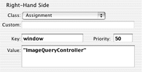
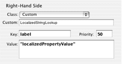
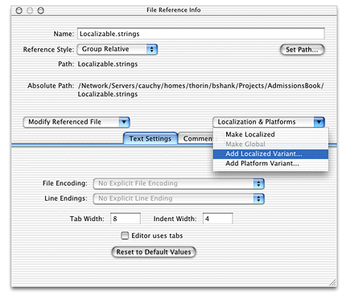
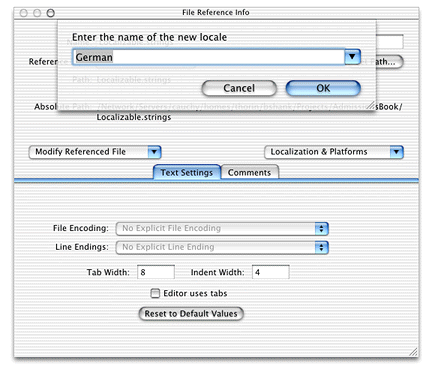
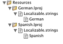

> 导航：[总目录](../../../README.md) · [documentation](../../../_indexes/documentation.md) · [WebObjects Java Client Programming Guide](Introduction%20to%20WebObjects%20Java%20Client%20Programming%20Guide.md)


[Next](Building%20Custom%20List%20Controllers.md)[Previous](Using%20Pop-up%20Menus%20in%20Nib%20Files.md)

# Localizing Dynamic Components

Localization can be a tedious and time-consuming part of application development. However, using the rule system in Java Client applications, localization is quite simple. You supply a Java class containing the localized strings and you write a rule to use the class for labels in dynamically generated user interfaces.

_Problem:_ You want to localize the labels of properties in your application.

_Solution:_ Write a Java class to perform the localized string lookup, get the user’s preferred languages, and write a rule to get the localized strings.

Most of the rules you write and use in the rule system have a right-hand side class of type Assignment as shown in Figure 21-1.

__Figure 21-1__  Right-hand side class of type Assignment



The rule you’ll write to localize dynamic components uses the type Custom. By specifying a class name in the Custom field and a method name in the Value field, the key specified in the Key field is assigned to the return value of the specified method in the specified class. In Figure 21-2, the key `label` is resolved to the result of the method named `localizedPropertyValue` in the class LocalizedStringLookup.

__Figure 21-2__  Right-hand class of type Custom



Before writing the rule, however, write the class that does the localized string lookup.

Add a class to your project called “LocalizedStringLookup.” Add it to the Application Server target. Copy and paste the code in Listing 21-1.

__Listing 21-1__  LocalizedStringLookup class

```
import com.webobjects.foundation.*;
import com.webobjects.appserver.*;
import com.webobjects.eocontrol.*;
import com.webobjects.directtoweb.*;

public class LocalizedStringLookup extends DefaultAssignment {

    /**
     *Used in this class to refer to the current D2WContext object.
     */
    D2WContext d2wcontext;

    public LocalizedStringLookup(EOKeyValueUnarchiver unarchiver) {
        super(unarchiver);
    }
    public LocalizedStringLookup(String key, String value) { super(key,value); }

    public static Object decodeWithKeyValueUnarchiver(EOKeyValueUnarchiver               eokeyvalueunarchiver)  {
        return new LocalizedStringLookup(eokeyvalueunarchiver);
    }

    /**
     *Since there is no public API to get the current D2WContext,override this method        to get a reference to the current D2Wcontext.
     */
    public synchronized Object fire(D2WContext context) {
        d2wcontext = context;
        Object result = KeyValuePath.valueForKeyOnObject((String) value(), this);
        return result;
    }

    public String localizedPropertyValue() {
        String displayName = (String)d2wcontext.valueForKey(D2WModel.PropertyKeyKey); // 1

        NSArray languages = (NSArray)d2wcontext.valueForKey("locales");

        String returnstr =               WOApplication.application().resourceManager().stringForKey(displayName,               "Localizable", displayName, null, languages);// 2

        return returnstr;

    }
}
```

Remember to change the package statement to the package your server-side (Application Server target) classes are in.

The most interesting part of the class is the `localizedPropertyValue` method. The rule you’ll write invokes this method to get the localized string for a particular property. First, the method gets the display name for the receiver’s property (code line 1). That is, if the property name is `date` (which corresponds to an attribute named `date` in an entity in one of the application’s EOModels) the display name is the label that appears next to the widget representing the `date` property in the application.

Code line 2 is the most important part of the method. It looks for a localized string in a string table called `Localizable` for the display name specified by _displayName_. Since a localized application usually contains `Localizable.strings` files for multiple languages, the `stringForKey` method looks first for a `Localizable.strings` file for the user’s first preferred language. If it finds a `Localizable.strings` file for that language, it returns the localized strings. If it does not, however, it continues through the user’s preferred languages (returned by `d2wcontext.valueForKey("locales")` ), defaulting to nonlocalized strings if it can’t find a `Localizable.strings` file matching one of the user’s preferred languages.

Now that you have the method to look up localized strings, you need to add localized string tables to your project.

First, add a new file to the Resources group of your project called `Localizable.strings`. Add it to the Application Server target. The syntax of a `Localizable.strings` file is rather simple:

```
{
    "propertyName" = “localizedString”;
}
```

A `Localizable.strings` table for the property name “date” for Spanish would be

```
{
    "date" = "Fecha";
}
```

In the `Localizable.strings` table you just added to the project, add string pairs for the property keys in your application in English. You can find the names of the property keys in a few ways: in the Direct to Java Client Assistant’s Properties pane; the output of the LocalizedStringLookup (which contains the log statement `NSLog.out.appendln("displayName: " + displayName);`); or by invoking `attributeKeys` on an enterprise object’s class description and printing the result.

When you’re done adding English-localized strings, you can add localized variants of the file to your project. Select the `Localizable.strings` file and choose Show Info from Project Builder’s Project menu. From the Localization and Platforms pop-up menu, choose Add Localized Variant as shown in Figure 21-3.

__Figure 21-3__  Add localized variant of `Localizable.strings` file



Add a localized variant for the language of your choice as shown in Figure 21-4. If the language is not listed, you can type it in the field underneath “Enter the name of the new locale.”

__Figure 21-4__  Add localized variant for German



This action creates a directory called `German.lproj` (or whatever language you chose) in your project and puts a copy of the `Localizable.strings` file in it. Figure 21-5 shows German and Spanish localized variants in the Files list.

__Figure 21-5__  Localized resources in project



Now that you’ve created localized variants, you need to edit the variant to provide the language-specific strings for each property key. The German-localized variant might look like [Listing 21-2](#apple-f4xwc4dqnrsv64tfmyxwi33df52wszbpkridgmbqgaytamjxfvbuqmzrhawugrkhjbeusqkd).

__Listing 21-2__  German-localized variants of strings file

```
{
    "modified" = "Geändert";
    "documents" = "Dokumente";
    "release" = "Freigeben";
    "keywords" = "Schlüsselwörter";
    "date" = "Datum";
    "notes" = "Anmerkungen";
    "illustrator" = "Illustrator";
}
```

There is just one more thing you need to do to complete localization. Although the current process may seem tedious, think of the time it will save you: It saves you from needing to build localized variants of Interface Builder files by hand, or worse yet, from building localized versions of raw Swing components.

The final step is to write a rule to use everything you’ve just added to the application.

**Left-Hand Side:**
: `*true*`

**Key:**
: `label`

**Class:**
: `Custom`

**Custom:**
: `LocalizedStringLookup`

**Value:**
: `"localizedPropertyValue"`

**Priority:**
: `50`

The key `label` is assigned to the return value of the method `localizedPropertyValue` in the class LocalizedStringLookup. In Rule Editor, this rule appears as in [Figure 21-2](#apple-f4xwc4dqnrsv64tfmyxwi33df52wszbpkridgmbqgaytamjxfvbuqmzrhawugrkhjbbugskg).

_Problem:_ You want to localize all the standard strings in an application such as action button labels and standard error message strings. You also want to localize the property labels for frozen XML components.

_Solution:_ Use similar localization techniques described in [Localizing Property Labels](#apple-f4xwc4dqnrsv64tfmyxwi33df52wszbpkridgmbqgaytamjxfvbuqmzrhawugrkhivceussi), adding string pairs for each string you want localized.

First, associate the `Localizable.strings` files in your project with the Web Server target. (These files should now be associated with both the Web Server target and the Application Server target.) In [Localizing Property Labels](#apple-f4xwc4dqnrsv64tfmyxwi33df52wszbpkridgmbqgaytamjxfvbuqmzrhawugrkhivceussi), you were instructed to associate these files with just the Application Server target. The localization technique described in that section happens in the server-side application. The technique described in this section, however, happens in the client-side application so the `.strings` files need to be made available to the client application.

By adding localized strings to the `Localizable.strings` files in each of your application’s language `.lproj` directories, you can easily localize all the standard application strings. To find out what all these strings are, find the `Localizable.strings` file in `/System/Library/Frameworks/JavaEOApplication.framework/WebServerResources/English.lproj/`.

The string table begins with these string pairs:

```
"About Web Objects" = "About Web Objects";
"Actions" = "Actions";
"Activate Previous Window" = "Activate Previous Window";
"Add" = "Add";
"Add failed" = "Add failed";
"Append" = "Append";
"Append failed" = "Append failed";
"Alert" = "Alert";
"Available" = "Available";
"Cancel" = "Cancel";
"Change Pane" = "Change Pane";
"Clear" = "Clear";
"Close" = "Close";
```

Then, look in the `German.lproj` directory in the same framework. Its string table begins with these string pairs:

```
"About Web Objects" = "Kurzinformation";
"Actions" = "Aktionen";
"Activate Previous Window" = "Fenster wechseln";
"Add" = "Anfügen";
"Add failed" = "Anfügen fehlgeschlagen";
"Append" = "Anhängen";
"Append failed" = "Anhängen fehlgeschlagen";
"Alert" = "Achtung";
"Available" = "Verfügbar";
"Cancel" = "Abbrechen";
"Change Pane" = "Ansicht wechseln";
"Clear" = "Leeren";
"Close" = "Schließen";
```

You can see that the strings are localized for German. Simply copy the string pairs you want to provide localization for into your `Localizable.strings` tables and localize them accordingly.

[Next](Building%20Custom%20List%20Controllers.md)[Previous](Using%20Pop-up%20Menus%20in%20Nib%20Files.md)

