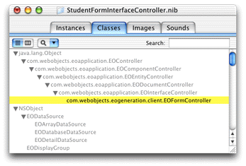
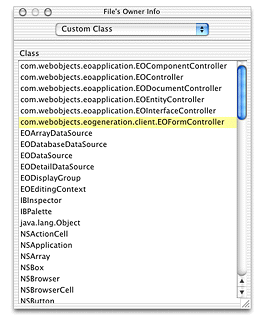

> 导航：[总目录](../../../README.md) · [documentation](../../../_indexes/documentation.md) · [WebObjects Java Client Programming Guide](Introduction%20to%20WebObjects%20Java%20Client%20Programming%20Guide.md)


[Next](Using%20Custom%20Views%20in%20Nib%20Files.md)[Previous](Freezing%20XML%20User%20Interfaces.md)

# Mixing Static and Dynamic User Interfaces

In this chapter, you’ll learn how to integrate static interfaces made in Interface Builder with dynamically generated user interfaces.

For this chapter you need a nib file. Any one will do, so you can use one from one of the WebObjects example projects or one you’ve created. It’s also sufficient to just add a Java Client Interface file to your project and add some widgets to it. Whatever nib file you use, make sure to first add it to your project and associate it with the Web Server target.

You must do a few things to make interface files created with the nondirect Java Client technique work within dynamically generated user interfaces.

Open the nib file from within Project Builder and click the Classes tab of the nib file window. View the classes in inheritance mode (the vertical list), and click the disclosure triangle next to `java.lang.Object` to reveal the Java Client classes. Continue clicking disclosure triangles up through `com.webobjects.eoapplication.EOInterfaceController` as shown in Figure 17-1.

__Figure 17-1__  Classes pane in the nib file window



To use a nib file in a Direct to Java Client application, the class must be the exact class you use to load the interface. So, if you want to use the nib file in a form controller, you’ll use EOFormController. To use it in a query controller, use EOQueryController. These classes are not automatically defined in the EnterpriseObjects palette in Interface Builder, so you need to add them.

Select `com.webobjects.eoapplication.EOInterfaceController` in the classes list and press Return. This subclasses EOInterfaceController and thus the new class inherits the targets and outlets you need for it. Name the new subclass `com.webobjects.eogeneration.EOFormController` as shown in [Figure 17-1](#apple-f4xwc4dqnrsv64tfmyxwi33df52wszbpkridgmbqgaytamjxfvbuqmzrgqwueqsdijeuescd).

Now that you’ve created a new class, you must associate the nib file with it. To do this, go back to the Instances pane of the nib file window and click File’s Owner. Choose Show Info from the Tools menu and choose Custom Class from the pop-up menu. In the list of classes, select `com.webobjects.eogeneration.EOFormController` as shown in Figure 17-2.

__Figure 17-2__  Assign the custom subclass to File’s Owner



Save the nib file.

Finally, associate the nib file’s controller class (its associated `.java` class) with the same package with which other client-side classes in your application are associated:

```
package edu.admissions.client;
```


The nib file is now ready to be integrated into a dynamically generated Java Client user interface. To load it in an application, you need to write a rule.

Open the `d2w.d2wmodel` file from within the your project. The rule shown here assumes that you want to use the nib file in a form controller for an entity named “Student,” that the nib file is named `StudentFormInterfaceController`, and that it’s in the package `edu.admissions.client`.

**Left-Hand Side:**
: `((task = 'form') and (entity.name = 'Student') and (controllerType = 'entityController'))`

**Key:**
: `archive`

**Value:**
: `"edu.admissions.client.StudentFormInterfaceController"`

**Priority:**
: `50`

This rule says that for the form task for the Student entity, use an archive (a nib file) with the name `StudentFormInterfaceController`. So, when you make a new Student record, the nib file is loaded.

However, at this point the XML-based interface generated by the rule system is loaded. Just because you’re loading a nib file does not suppress the mechanism for generating the interface’s subcontrollers. But, it’s easy to write a rule to fix this:

**Left-Hand Side:**
: `((task = 'form') and (entity.name = 'Student') and (controllerType = 'entityController'))`

**Key:**
: `generateSubcontrollers`

**Value:**
: `"false"`

**Priority:**
: `50`

Now when you open a form window for the Student entity, the custom interface is loaded and the XML generation is suppressed in certain parts of the window.

When you use nib files within dynamically generated user interfaces as described in [Mixing Static and Dynamic User Interfaces](#apple-f4xwc4dqnrsv64tfmyxwi33df52wszbpkridgmbqgaytamjxfvbuqmzrgqwviubr), the nib file’s controller class changes. This means that the class in which you declare actions that are the target of widgets in the nib file changes.

When you use nib files in nondirect Java Client applications, the controller class of each nib is an EOInterfaceController subclass that has the same name as the nib. This means that the File’s Owner object in the nib file is associated with this controller class. So, if a widget such as a button has a target that is a method called `search`, that method must be declared in the EOInterfaceController subclass that is the object with which File’s Owner is associated.

As described in [Integrating the Nib File](#apple-f4xwc4dqnrsv64tfmyxwi33df52wszbpkridgmbqgaytamjxfvbuqmzrgqwviucykjcummru), however, to use a nib file within a dynamically generated user interface, you need to change the nib file’s controller class to be the class that is the root controller class of the dynamically generated user interface.

So, for example, if you are integrating a nib file into a form window, as described in [Integrating the Nib File](#apple-f4xwc4dqnrsv64tfmyxwi33df52wszbpkridgmbqgaytamjxfvbuqmzrgqwviucykjcummru), that window’s root class is EOFormController. So the target methods of actions in that window, whether the actions originate from widgets in the nib file or widgets in the dynamically generated user interface, must be in the EOFormController subclass.

In summary, when you use a nib file within a dynamically generated user interface, the nib file’s original controller class (a subclass of EOInterfaceController) is no longer used so you must move any action methods out of that class and into the controller class of the user interface the nib file is used within (such as EOFormController and EOQueryController).

[Next](Using%20Custom%20Views%20in%20Nib%20Files.md)[Previous](Freezing%20XML%20User%20Interfaces.md)

