> 导航：[总目录](../../../README.md) · [documentation](../../../_indexes/documentation.md) · [WebObjects Java Client Programming Guide](Introduction%20to%20WebObjects%20Java%20Client%20Programming%20Guide.md)

[Next](Building%20Custom%20Controllers%20With%20XML.md)[Previous](Enhancing%20the%20Application.md)

# Nondirect Java Client Development

The direct approach to building Java Client applications and its customization techniques should allow you to sufficiently customize your application’s user interface. However, it is possible and often useful to build completely customized Java Client user interfaces in Interface Builder. This chapter teaches you how to build custom user interfaces.

You create nondirect Java Client applications in Project Builder using the Java Client Application project type.

Make a new Java Client project called `AdmissionsStatic`. Add the EOModel file from the last tutorial.

In the Interface Controller Class Name pane, the interface controller class name should be StudentFormInterfaceController as shown in Figure 7-1. Make sure the package name is `admissionsstatic.client`. When creating Java Cilent interfaces, you must always specify the correct package name.

__Figure 7-1__  Name the interface controller

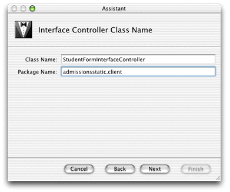

Add the `Admissions.eomodeld` file when prompted.

Select the fourth option in the Choose Download Classes pane (Download main bundle and custom framework classes). Optionally edit the fields in the Web Start pane.

In the Select a Template pane, select EOF Application Skeleton as shown in Figure 7-2.

__Figure 7-2__  Choose a template for the interface controller

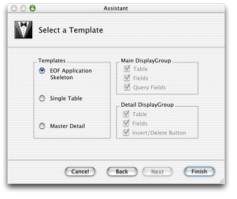

For Java Client applications, Project Builder creates an Interface Builder file (`.nib`) and its associated Java class. By default, it’s put in the Interfaces group. Double-click `StudentFormInterfaceController.nib` to open the file in Interface Builder.

Interface Builder needs a special palette to work with Java Client user interfaces. The EnterpriseObjects palette should load by default and appear in the Palettes pane of the Interface Builder Preferences window as shown in Figure 7-3.

__Figure 7-3__  Interface Builder palettes

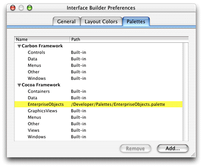

If it does not appear, click the Add button, navigate to `/Developer/Palettes` and double-click `EnterpriseObjects.palette`. The palette should then appear in Interface Builder’s palettes window as shown in [Figure 7-4](#apple-f4xwc4dqnrsv64tfmyxwi33df52wszbpkridgmbqgaytamjxfvbuqmzqgqwviucykjcummrz).

__Figure 7-4__  Enterprise Objects palette

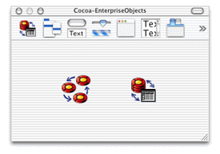

To create custom interfaces, you use Interface Builder, the same application used to build Cocoa desktop applications in Mac OS X. This tool gives you a wide variety of widgets to choose from, and most importantly, allows you to connect the user interface to objects in your data model.

The associations and connections you can make in Interface Builder make it the best tool for developing completely custom user interfaces for Java Client applications. You can write completely custom Java Client user interfaces in raw Swing or by using other third-party tools, but then you’ll have to make all the associations and connections programmatically.

Interface Builder’s integration with EOModeler allows you to easily build a user interface that is tightly coupled to your data model. It’s as easy as dragging model elements from EOModeler into the content window in Interface Builder.

A blank window (which corresponds to the MainWindow object), a nib file window, and a palette window appear when Interface Builder launches, as shown in Figure 7-5.

__Figure 7-5__  The Interface Builder environment

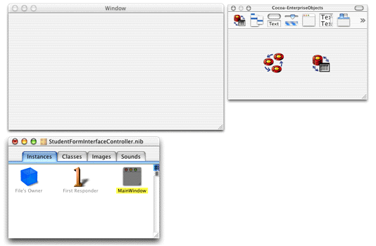

Before adding to the nib file, you may need to associate it with its controller class. This should happen automatically but if it doesn’t, you must make the association manually.

While the nib file is open in Interface Builder, click the Classes tab of the nib file window. View the classes in inheritance mode (the vertical list), and click the disclosure triangle next to `java.lang.Object` to reveal the Java Client classes. Continue clicking disclosure triangles up through `com.webobjects.eoapplication.EOInterfaceController` as shown in Figure 7-6.

__Figure 7-6__  Classes pane in the nib file window

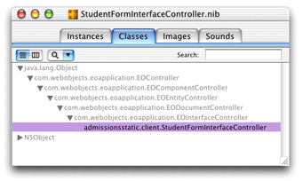

Click `com.webobjects.eoapplication.EOInterfaceController` in the classes list and press Return. This subclasses EOInterfaceController and thus the new class inherits its targets and outlets. The name of the new subclass is the fully qualified name of the nib file, `admissionsstatic.client.StudentFormController`, as shown in Figure 7-6.

Now that you’ve created a new class, you must associate the nib file with it. To do this, switch to the Instances pane of the nib file window and click File’s Owner. Choose Show Info from the Tools menu and choose Attributes from the pop-up menu. In the list of classes, select `admissionsstatic.client.StudentFormController` as shown in Figure 7-7.

__Figure 7-7__  Assign the custom subclass to File’s Owner

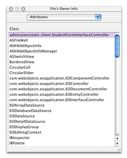

Open the `Admissions.eomodeld` from within the Admissions project to launch EOModeler. Then drag the Student entity from EOModeler into the main window in Interface Builder. The main window should then appear as in Figure 7-8.

__Figure 7-8__  The Student entity dragged into Interface Builder

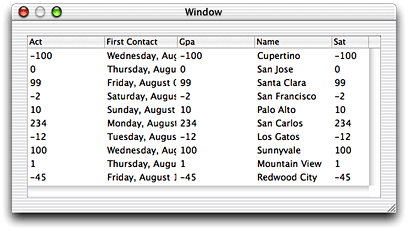

In the nib file window, there’s now an EODisplayGroup object named “Student.” The first display group you add to the model also adds an EOEditingContext object named “EditingContext” to the nib file window. The nib file window should appear as in [Figure 7-9](#apple-f4xwc4dqnrsv64tfmyxwi33df52wszbpkridgmbqgaytamjxfvbuqmzqgqwueqsdijcemsch).

__Figure 7-9__  Display group and editing context

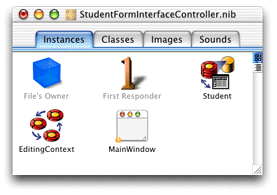

You can set options for the Student display group by selecting it in the nib file window and choosing Show Info from the Tools menu. In the Attributes pane, make sure “Fetch on load” is selected as shown in [Figure 7-10](#apple-f4xwc4dqnrsv64tfmyxwi33df52wszbpkridgmbqgaytamjxfvbuqmzqgqwviucykjcummzq). This option is important because it allows data to be fetched from the database when the application starts up.

__Figure 7-10__  Display group options in Interface Builder

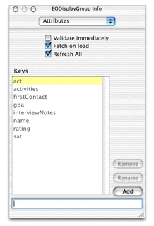

The keys listed in the EODisplayGroup Info window correspond to the class properties specified for the entity in EOModeler. You can add other keys that are not class properties such as methods you define in the associated Enterprise Objects class, as is done in [Using Pop-up Menus in Nib Files](Using%20Pop-up%20Menus%20in%20Nib%20Files.md#apple-f4xwc4dqnrsv64tfmyxwi33df52wszbpkridgmbqgaytamjxfvbuqmzrg4wviubr).

By dragging an entity from EOModeler into Interface Builder, you created a functional yet simple application. However, you should make some simple changes to improve it.

The columns for `gpa` and `firstContact` are numeric, and you can set the numeric format style for column data directly in Interface Builder. If you don’t, the `gpa` column defaults to an integer format, so the values will be rounded—making that data less relevant. The `firstContact` column defaults to a date format that includes the day of the week, information that is not particularly useful for that attribute in this application.

To change the formatters, double-click the `Gpa` column to bring up the Info window. Choose Formatter from the pop-up menu and select a formatter with a decimal point for the `Gpa` column as shown in [Figure 7-11](#apple-f4xwc4dqnrsv64tfmyxwi33df52wszbpkridgmbqgaytamjxfvbuqmzqgqwueqsdjbbeusce).

__Figure 7-11__  Choose a formatter for the `Gpa` column

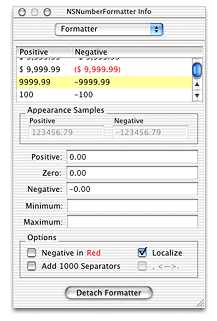

For the `FirstContact` column, select a simple date format as shown in Figure 7-12.

__Figure 7-12__  Choose a formatter for the `FirstContact` column

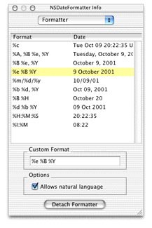

Finally, capitalize the column names so that they’re as shown in Figure 7-13.

Interface Builder provides the ability to test the application. It actually connects to the database and fetches data. You can test it by choosing File > Test Interface.

__Figure 7-13__  Testing the application

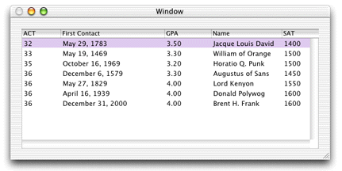

Note that because “Fetch on load” is enabled for the Student EODisplayGroup, the data is automatically fetched when you test the interface.

You can add basic behavior to your application, such as adding, deleting, and saving objects, without writing a line of code. This is possible because the EODisplayGroup, EOEditingContext, and EOInterfaceController objects in Interface Builder have predefined action methods that you can use to trigger operations in your application. An action method is a method that’s invoked when a user clicks a button or another control object.

Add a button to the interface by dragging a button from the Views palette. Make three buttons named “Add,” “Remove,” and “Save.” These buttons will be used to insert new Student records, delete Student records, and save changes, respectively.

Connect the Add button to the EODisplayGroup’s `insert` method by Control-dragging from the Add button to the Student EODisplayGroup. Choose Outlets in the pop-up menu in the NSButton Info window. Select target in the left column and double-click the `insert:` outlet in the right column. See Figure 7-14 and Figure 7-15.

__Figure 7-14__  Connect the Add button to the `insert` method of the Student EODisplayGroup

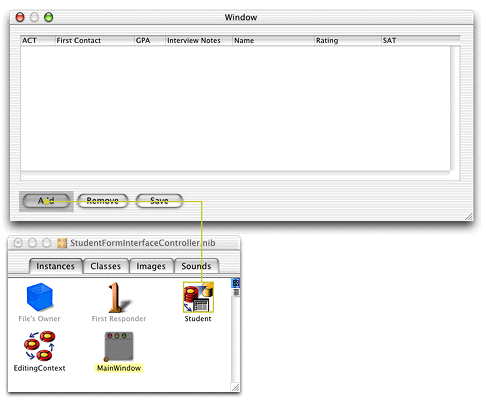

__Figure 7-15__  Select the `insert` method

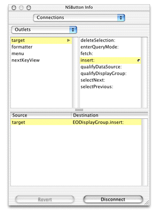

Using the same process, connect the Remove button to the `deleteSelection:` method. Finally, connect the Save button to the `saveChanges:` method in the EditingContext object.

Save the nib file. Build and run the project. You have a fully functional application with the capability to add, remove, and save records to the database.

To express the relationships in your EOModel, you use a master-detail interface. This interface includes a master table that holds records for the source of the relationship and a detail table that holds records for the destination. As individual records in the master table are selected, the contents of the detail table change to show the records that correspond to the selection in the master table.

Before adding a master-detail interface, delete the table view from the nib file’s main window and delete the Student EODisplayGroup and the EOEditingContext object from the nib file window.

You create a master-detail interface by simply dragging a relationship from EOModeler into a nib file window. Drag the Student entity’s `activities` relationship from EOModeler onto the main window in Interface Builder. This creates a master-detail relationship. The icon you drag is found under the Student entity in the entity list pane of EOModeler. You may have to click the plus icon to show the relationship.

__Figure 7-16__  The `activities` relationship in the Student entity

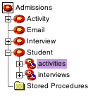

Reconnect the Add and Remove buttons to the Student EODisplayGroup. Add two buttons for the detail part of the relationship to add and remove activities. Connect them to the activities display group, connecting to the `insert` and `deleteSelection` methods respectively. Add formatters to the columns as you did earlier.

Test the master-detail interface by choosing Test Interface from the File menu. [Figure 7-17](#apple-f4xwc4dqnrsv64tfmyxwi33df52wszbpkridgmbqgaytamjxfvbuqmzqgqwueqsdjfdemqkj) shows the master-detail interface with each table in a subview of a box view.

__Figure 7-17__  A master-detail interface

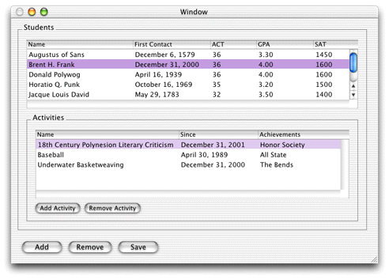

The master-detail interface you just created can be improved. Although you can add new records by entering text directly in the table columns, it would be nice to provide text fields for doing the same thing. Also, you should take advantage of more built-in features of the technology, such as reversion, undo, and redo.

It’s easy to add widgets in Interface Builder. Simply drag widgets from the Interface Builder palette onto the window. [Figure 7-18](#apple-f4xwc4dqnrsv64tfmyxwi33df52wszbpkridgmbqgaytamjxfvbuqmzqgqwueqsdijeeqssf) illustrates the complete widget set of text fields, text areas, and buttons for the master-detail interface.

__Figure 7-18__  Complete widget set for the master-detail interface

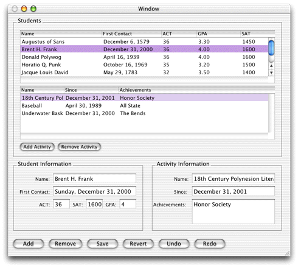

Once you drag a widget into a window, you must connect it to the application. Consider the Achievements text field for the Activities entity. Once it’s placed in the interface, Control-drag from the text field to the Activities entity in nib file window. In the Info window, choose EOTextAssociation from the pop-up menu and double-click “achievements” in the scrolling list, as shown in [Figure 7-19](#apple-f4xwc4dqnrsv64tfmyxwi33df52wszbpkridgmbqgaytamjxfvbuqmzqgqwueqsdijbugrck). This creates an association between the widget and the attribute in the entity. So, when you select a record, the value of the `achievements` attribute for that record is also displayed in the text field. This also allows you to edit the value of the attribute with which a text field is associated.

__Figure 7-19__  Connect widgets with associations

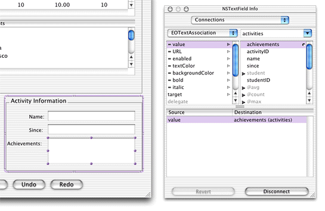

Associate each widget appropriately. Save the nib file.

In Project Builder, build and run the application just as you would for a Direct to Java Client application.

It’s common to want programmatic access to user interface components in nib files. In the Cocoa application framework, outlets for all appropriate user interface components are added to the corresponding Java file for that interface upon adding a component. However, this doesn’t happen when building Java Client interfaces in Interface Builder. Fortunately, it’s easy to add this functionality to your application.

In a nib file, select File’s Owner in the nib file window, switch to the Classes pane, and choose Add Outlet from the Classes menu. If the widget in question is a text field, for instance, name the outlet `textField` as shown in [Figure 7-20](#apple-f4xwc4dqnrsv64tfmyxwi33df52wszbpkridgmbqgaytamjxfvbuqmzqgqwueqkcjbbeeqsd).

__Figure 7-20__  Add an outlet

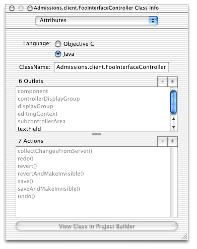

Connect the new outlet to a text field by Control-dragging from the File’s Owner icon to the text field and double-clicking `textField` in the Outlets column of the Connections pane of the File’s Owner Info window, as shown in [Figure 7-21](#apple-f4xwc4dqnrsv64tfmyxwi33df52wszbpkridgmbqgaytamjxfvbuqmzqgqwueqkci5eukq2b).

__Figure 7-21__  Connect the new outlet

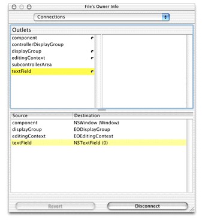

In the Java class file for the nib file, add a public variable called `textField`. You now have programmatic access to the value and attributes of that widget. This is useful, for instance, if you want to manipulate or extract the values of a particular widget.

In nondirect Java Client applications, you use Interface Builder to construct user interfaces. This application was intended to build Mac OS X Cocoa or Carbon applications. It was not designed to build Swing-based applications, and in fact, it does not build them directly. Rather, technology in Java Client translates Interface Builder Cocoa nib files to Swing for you.

Cocoa offers many user interface widgets, and Java Client supports most of them. Certain widgets are not supported because there is no Swing equivalent. Java Client translates the following user interface elements:

- __Cocoa widgets:__ NSWindow, NSButton, NSTextField, NSTextView, NSTableView, NSTableColumn, NSComboBox, NSPopUpButton, NSMatrix, NSForm, NSBox, NSImageView, NSTabView, NSCustomView; the corresponding cells for these widgets are also translated
- __Formatters:__ NSNumberFormatter, NSTimestampFormatter
- __Enterprise Objects:__ EOEditingContext, EODisplayGroup, EODataSource, EOAssociation
- __Interface Builder connections:__ Outlets, target-action, `nextKeyView`
- __Style attributes:__ Font sizes and some font styles (font styles depend on Swing’s ability to find and load fonts)

Java Client interface translation does not support colors, menus, scroll views (except when in text or table views), NSBrowsers, NSOutlineViews, NSProgressIndicators.

If you want to use a widget that is not supported by the Java Client interface translation, you can use an NSCustomView object and associate it with a Swing class you write. This is described in [Using Custom Views in Nib Files](Using%20Custom%20Views%20in%20Nib%20Files.md#apple-f4xwc4dqnrsv64tfmyxwi33df52wszbpkridgmbqgaytamjxfvbuqmzrguwviubr).

[Next](Building%20Custom%20Controllers%20With%20XML.md)[Previous](Enhancing%20the%20Application.md)

