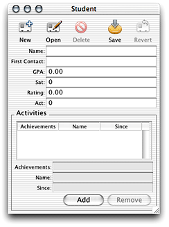
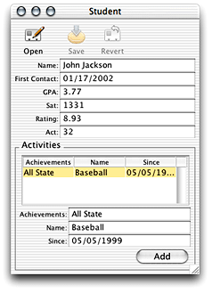

> 导航：[总目录](../../../README.md) · [documentation](../../../_indexes/documentation.md) · [WebObjects Java Client Programming Guide](Introduction%20to%20WebObjects%20Java%20Client%20Programming%20Guide.md)


[Next](Generating%20Controllers%20With%20the%20Controller%20Factory.md)[Previous](Deploying%20Client%20Applications.md)

# Restricting Access to an Application

In a real world application, you’ll likely need to restrict access to the application and to functions within the application. In a Java Client application that uses the rule system, you can use rules to accomplish this.

_Problem:_ The Documents menu in Direct to Java Client applications offers unrestricted access to the entities in the enterprise object models of the application. You want to restrict access to this menu.

_Solution:_ Use the rule system to override the default behavior.

The actions in the Documents menu are defined by the `actions` key in the rule system. You can write a rule overriding `actions` to point to a D2WComponent:

**Left-Hand Side:**
: `*true*`

**Key:**
: `actions`

**Value:**
: `"UserActions"`

**Priority:**
: `50`

See [New D2WComponent](Adding%20Custom%20Menu%20Items.md#apple-f4xwc4dqnrsv64tfmyxwi33df52wszbpkridgmbqgaytamjxfvbuqmzrgawugrkhivceussi) to learn how to add a D2WComponent to a project.

The HTML file of the UserActions component is simply an empty array:

```
<ARRAY></ARRAY>
```

If you override `actions` like this, however, your application is unusable since you’ve locked down all access to it. So you need to provide a custom mechanism to access its functionality. A common mechanism is to use an interface built in Interface Builder. That interface provides buttons or other widgets, which when clicked invoke actions in the application. See [Building the User Interface](Building%20a%20Login%20Window.md#apple-f4xwc4dqnrsv64tfmyxwi33df52wszbpkridgmbqgaytamjxfvbuqmzsgewviucykjcummzy) to learn how to load a nib file when an application starts up. See [Adding Custom Menu Items](Adding%20Custom%20Menu%20Items.md#apple-f4xwc4dqnrsv64tfmyxwi33df52wszbpkridgmbqgaytamjxfvbuqmzrgawviubr) to learn how to add custom menu items to an application.

_Problem:_ When a Direct to Java Client application starts up, the default behavior is to display a query window. From this window users can query on all entities in the application’s enterprise object model. You want to change this behavior.

_Solution:_ Use the rule system to override the default behavior.

When an application starts up, the rule system asks for all the available specifications in the application. These specifications are defined in `.d2wmodel` files in the project and in the project’s frameworks. Then, the rule system asks for all the default specifications. The default specifications are fired first when the application launches. So, by overriding the default specifications, you control what the user sees when the application launches.

You can override the default specifications with a rule like this:

**Left-Hand Side:**
: `*true*`

**Key:**
: `defaultSpecifications`

**Value:**
: `"BlankSpecifications"`

**Priority:**
: `50`

This rule points the default specifications to a D2WComponent called “BlankSpecifications.” The HTML file of the BlankSpecifications component is simply an empty array:

```
<ARRAY></ARRAY>
```

Now, when the application starts up, no windows are displayed on the screen and no menu items appear. So, you have to provide other mechanisms to allow users access to the application’s user interface. See [Building a Login Window](Building%20a%20Login%20Window.md#apple-f4xwc4dqnrsv64tfmyxwi33df52wszbpkridgmbqgaytamjxfvbuqmzsgewviubr) for some suggestions.

_Problem:_ In form windows in Direct to Java Client applications, a number of actions are available to the user by default as shown in Figure 11-1. These actions are insert, open, delete, save, and revert.You want to disable the buttons that invoke some of these actions.

__Figure 11-1__  Default actions in a form window



_Solution:_ Use the rule system to override the default behavior.

The rule system provides a key to disable certain actions. By providing the names of the actions you wish to disable as the right-hand side value of this rule, those actions are disabled in all dynamically generated controllers. This and many other rules have no effect on frozen XML or frozen interface files.

**Left-Hand Side:**
: `*true*`

**Key:**
: `disabledActionNames`

**Value:**
: `(insertWithTask, delete)`

**Priority:**
: `50`

This rule disables the insert and delete actions, which is appropriate for the application whose form window is shown in Figure 11-2.

__Figure 11-2__  Disabled actions in a form window



If you’re working with frozen XML components, you can remove the `ACTIONSBUTTONCONTROLLER`tags to disable the action buttons in that window. This may be too drastic a measure for your needs, but frozen XML is by definition less flexible than dynamically generated components, and this is one of its costs. If you do remove the `ACTIONSBUTTONCONTROLLER` tags, you can still specify custom action buttons by writing custom controller classes and specifying them with `CONTROLLER` tags in the XML. See [Using a Custom Controller Class in Frozen XML](Freezing%20XML%20User%20Interfaces.md#apple-f4xwc4dqnrsv64tfmyxwi33df52wszbpkridgmbqgaytamjxfvbuqmzrgmwviucykjcummru) to learn how to write and use custom controller classes.

[Next](Generating%20Controllers%20With%20the%20Controller%20Factory.md)[Previous](Deploying%20Client%20Applications.md)

