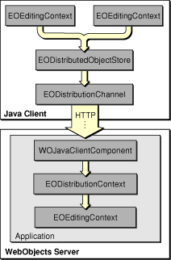

> 导航：[总目录](../../../README.md) · [documentation](../../../_indexes/documentation.md) · [WebObjects Java Client Programming Guide](Introduction%20to%20WebObjects%20Java%20Client%20Programming%20Guide.md)


[Next](Enhancing%20the%20Application.md)[Previous](Inside%20Assistant.md)

# The Distribution Layer

The distribution layer (`com.webobjects.eodistribution` and `com.webobjects.eodistribution.client`) consists of the objects that make client-server communication in Java Client applications different from client-server communication in HTML-based WebObjects applications. Understanding its details will help you write better designed, more advanced, and more secure Java Client applications.

This chapter covers the following topics as they relate to the distribution layer:

- business logic partitioning
- distribution layer objects and intralayer communication
- remote method invocations
- distribution channels
- distribution layer delegates

In HTML-based WebObjects applications, all business logic (and the business objects that use that logic) lives on the server. Business objects are never sent to the client (the Web browser). Rather, selected data from those business objects is sent along with HTML user interface data.

In Java Client, however, business objects are sent to the client application for performance reasons. Java Client applications generally access more data than do distributed HTML applications. To limit the number of round trips to the server, copies of the business objects containing the data live on the client.

While this helps performance, it also presents security issues. In Java Client, business objects are Java objects, which can be decompiled and analyzed quite easily. So you never want to send sensitive business objects (objects containing private algorithms or data) to the client.

To control which business objects are sent to the client, you use _business logic partitioning_. As well as securing business data, business logic partitioning can also improve performance. The key to business logic partitioning is to minimize the amount of data sent from server to client while simultaneously minimizing the number of round trips over the network.

There are many ways to perform business logic partitioning. Often, you create a business logic class for the server and one for the client. These classes can be identical or their implementations can differ, depending on what data you want sent to the client.

Alternatively, you can create a common superclass from which the client and server subclasses inherit. In the common superclass, provide abstract declarations of the methods you want to be different in the two subclasses. In the client subclass, the methods should simply invoke remote methods of which concrete implementations exist in the server subclass.

For example, a common superclass might resemble this one:

```
package example.common;
import com.webobjects.eocontrol.*;
public abstract class Foo extends EOGenericRecord {
    public abstract String bar();
}
```

The client class (with a remote method invocation) would then resemble this class:

```
package example.client;
import com.webobjects.eocontrol.*;
public class Foo extends example.common.Foo {
    public String bar() {
     return (String) invokeRemoteMethod("clientSideRequestBar", null, null);
    }
}
```

The server-side class would then resemble this class:

```
package example.server;
import com.webobjects.eocontrol.*;
public class Foo extends example.common.Foo {
    public String bar() {
        return "secret string";
    }
    public String clientSideRequestBar() {
        return bar();
    }
}
```

The actual partitioning of your business logic begins in your EOModel. In EOModeler, you can assign custom classes to each entity in the model. See [Add Custom Business Logic](Enhancing%20the%20Application.md#apple-f4xwc4dqnrsv64tfmyxwi33df52wszbpkridgmbqgaytamjxfvbuqmzqgmwviucykjcummjqgy) in the advanced tutorial for an example.

As well as providing security for your business logic, partitioning can also confer performance improvements, depending on where computations take place. For example, if a particular computation requires a lot of data, and the client does not already have the data, that computation should occur on the server, as the server is closer to the data store.

Likewise, since Java Client requires rather robust clients, nonsensitive computations can occur on the client. This relieves the server from expending more cycles.

In Java Client applications, you may want some methods to execute only on the server for both security and performance reasons, such as when the method consumes a lot of system resources. Java Client defines two categories of remote method invocations: those that apply to business logic and those that apply to application logic.

If you partition your business logic in the recommended way, your client business logic classes shouldn’t include any sensitive algorithms or computations. Rather, they should simply use remote method invocations to invoke concrete implementations of custom methods on the server that perform the sensitive computations. However, since remote method invocations require a round trip to the server, you _should_ put nonsensitive algorithms in client-side business logic classes to reduce network traffic.

There are many methods defined throughout the Enterprise Object technology to perform remote method invocations. Client-side business logic classes that inherit from `com.webobjects.eocontrol.EOCustomObject` can use `invokeRemoteMethod` to invoke a method in the corresponding enterprise object on the server. The method takes three arguments: the method to invoke in the server-side class, a `java.lang.Class` object representing the argument types, and an object containing the arguments. Here’s an example:

```
public void calculateRating() {
    invokeRemoteMethod("clientSideRequestCalculateRating", new Class[]          {NSArray.class}, new Object[] {globalIDs});
}
```

This code invokes a method called `clientSideRequestCalculateRating` on the server, which takes an NSArray as an argument. You can pass `null` for both the second and third arguments if the remote method takes no arguments.

When you invoke a remote method on an enterprise object, the state of the client-side editing context is pushed to the server side. This guarantees that the business objects in the server-side computations are up to date with their client-side counterparts. Keep in mind that if you nest editing contexts on the client, all the editing contexts are pushed to the server side upon remote method invocation.

Note that `com.webobjects.eodistribution.client.EODistributedObjectStore` has remote method invocation methods (`invokeRemoteMethod` and `invokeRemoteMethodWithKeyPath`) that include a Boolean flag to control the pushing of the client-side editing context to the server. Setting this flag to `false` prevents the client from pushing its editing context state to the server. Since these methods are defined in EODistributedObjectStore, you must call them on an object store object if you invoke them from business logic classes.

Remote method invocations raise some security concerns since the client is assumed to be trusted. However WebObjects Java Client is well-prepared to handle these concerns. It includes built-in security features that prevent unauthorized remote method invocations. By default, remote method names must be prefixed with `clientSideRequest`, otherwise the EODistributionContext object on the server does not allow the remote method invocation. You can use delegates on the distribution context to implement your own security mechanisms for remote method invocations, as described in [Delegates](#apple-f4xwc4dqnrsv64tfmyxwi33df52wszbpkridgmbqgaytamjxfvbuqmzqgiwviucykjcumnbr).

Not all remote method invocations relate directly to business logic. Sometimes, you’d like to get information from the server that is specific to your application, but not particular to your application’s business logic. This may include knowing what resources are available and how to handle user defaults.

Application-level remote methods are called with `invokeRemoteMethodWithKeyPath` and `invokeStatelessRemoteMethodWithKeyPath`, which are defined in EODistributedObjectStore. These methods are similar to `invokeRemoteMethod` except for two things. The receiver of the invocation can be any object (not just an enterprise object) that can be specified with a key path. The `keyPath` argument has special semantics:

- If `keyPath` is a fully qualified key path (for example, `session.editingContext`) the key path is followed starting from the invocation target of the EODistributionContext, which by default is the WOJavaClientComponent object.
- If `keyPath` is an empty string, the method is invoked on the WOComponent that is the invocation target of the EODistributionContext (typically a WOJavaClientComponent).
- If `keyPath` is `null`, the method is invoked on the server-side EODistributionContext.

The same security mechanism applies to these types of remote method invocations as to remote method invocations that occur on business logic classes (but only if the default distribution context delegate is used). That is, if the key path is `session`, the EODistributionContext on the server blocks all invocations sent with this method unless the `methodName` argument is prefixed with `clientSideRequest`.

If the key path specified is other than `session`, the EODistributionContext’s delegate (on the server) must implement `distributionContextShouldAllowInvocation` and `distributionContextShouldFollowKeyPath` to allow the target method of the remote method invocation to be executed.

You can also invoke application-specific remote methods with `invokeStatelessRemoteMethodWithKeyPath`. Unlike `invokeRemoteMethodWithKeyPath`, it does not synchronize the client and server editing contexts. It is useful if you want to do something that has nothing to do with business logic, such as loading resources, running checks in background threads, and so on. It is much faster than `invokeRemoteMethodWithKeyPath` since it doesn’t affect the object graph or editing contexts and avoids synchronization issues with client-side editing contexts in multithreaded applications.

In short, application-logic remote method invocations usually originate in custom Java Client controller classes, while business-logic remote method invocations usually originate from enterprise object classes (classes implementing the `com.webobjects.eocontrol.EOEnterpriseObject` interface).

To perform remote method invocation on application logic, you invoke the methods on the client’s distributed object store. The WebObjects API reference describes the distributed object store as follows:

“An EODistributedObjectStore functions as the parent object store on the client side of Java Client applications. It handles interaction with the distribution layer’s channel (an EODistributionChannel object), incorporating knowledge of that channel so it can forward messages it receives from the server to its editing contexts and forward messages from its editing contexts to the server.”

You can get the distributed object store object with this code (assuming you haven’t done anything special in the distribution layer with regard to the `EODistributedObjectStore`):

```
private EODistributedObjectStore _distributedObjectStore() {
    EOObjectStore objectStore = EOEditingContext.defaultParentObjectStore();
    if ((objectStore == null) || (!(objectStore instanceof EODistributedObjectStore))) {
        throw new IllegalStateException("Default parent object store needs to be an
          EODistributedObjectStore");
        }
        return (EODistributedObjectStore)objectStore;
}
```

Then you invoke the remote method on the object returned by the above method:

```
_distributedObjectStore().invokeRemoteMethodWithKeyPath(<arguments>);
```


There are a few things you need to know about using custom code in business logic classes. If you write methods that perform computations that require values in the enterprise object, two methods are provided to help you know when to invoke the custom computations: `awakeFromClientUpdate` and `prepareValuesForClient`.

The `awakeFromClientUpdate` method is invoked after the EOGenericRecord subclass on the server receives a notification that all the business objects have been received from the client. If you try to invoke a method from one of the class’s `set` methods that performs a computation using values of attributes in your business logic, there is no guarantee that the server-side object has received all the values from the client you use in that calculation. However, if you invoke the method with said calculation in `awakeFromClientUpdate`, you are guaranteed to have all the business data from the client.

The `prepareValuesForClient` method is invoked in the EOGenericRecord subclass right before the business objects are sent back to the client (it is actually invoked right before the objects are encoded). You can override it to set a value before it is sent to the client if the value is only a client-side class property.

The distribution layer’s client-server communication mechanism relies on four objects: `com.webobjects.eodistribution.WOJavaClientComponent`, `com.webobjects.eodistribution.EODistributionContext`, `com.webobjects.eodistribution.client.EODistributedObjectStore`, and `com.webobjects.eodistribution.client.EODistributionChannel`.

The flow of information works like this: The client editing contexts talk to the EODistributedObjectStore (client side), which uses an EODistributionChannel to transfer objects across the network to the WOJavaClientComponent object, which uses an EODistributionContext to talk to the server-side editing context and to take care of generating responses to client requests. This flow is illustrated in [Figure 5-1](#apple-f4xwc4dqnrsv64tfmyxwi33df52wszbpkridgmbqgaytamjxfvbuqmzqgiwviucykjcumnbs).

__Figure 5-1__  Objects in the distribution layer



Let’s examine each of these objects.

EODistributedObjectStore is the parent object store for all the editing contexts on the client. It makes the client editing contexts behave like a nested editing context to the server-side editing context. Its function is similar to that of the EODatabaseContext object, which lives on the server.

EODistributionChannel is responsible for sending data from the client to the server (it actually encodes the data).

The WOJavaClientComponent object is the target of the data sent by EODistributionChannel. It forwards data from the client’s EODistributionChannel to the server’s EODistributionContext. It is provided to isolate the application from different deployment environments and also plays a large role in application startup. It is also the object that embeds Java Client in a WebObjects application.You can learn more about application startup by reading the API reference documentation for the distribution layer classes and the application-level classes in the application layer.

EODistributionContext has many functions: It keeps track of the state of the enterprise objects graph; it tracks which objects the client has fetched; and perhaps most importantly, it synchronizes business objects on the client and server applications.

The distribution layer is responsible for synchronizing the client and server object stores. The data flow in a Java Client application occurs like this:

1. The user makes a query and the fetch specification is forwarded by the client’s EODistribution layer to the server’s EODistribution layer.
2. The normal WebObjects mechanisms take over, and a SQL call is eventually made to the database server.
3. The database server returns rows of requested data; these rows are mapped to enterprise object instances.
4. The server’s EODistribution layer sends copies of the requested data to the client.
5. The client’s EODistribution layer receives the objects and registers them with the client’s editing context (the data is cached in the client’s object graph).
6. Through the client’s display group and association mechanisms, the user interface is populated.

As users modify the data (or delete or add rows of data), the client’s object graph is updated to reflect the new state. When users request that this data be saved, the changed object graph is pushed to the server. If the business logic on the server validates these changes, the changes are committed to the database.

Synchronization of the client and server’s object graphs occurs automatically: Java Client automatically pushes updates from the server to the client.

The distribution channel in Java Client (EODistributionChannel) distributes data between the client and server applications. By default, Java Client uses HTTP as the transport mechanism (EOHTTPChannel), but you can subclass EOHTTPChannel to provide a custom mechanism such as SSL. Assuming that you’re using Sun’s JSSE SSL classes, you can use the class in Listing 5-1.

__Listing 5-1__  Subclass EOHTTPChannel to use SSL

```
package com.mycompany.client;

import java.io.*;
import java.net.*;
import java.security.*;

public class SSLChannel extends com.webobjects.eodistribution.client.EOHTTPChannel {

    static {
        System.setProperty("java.protocol.handler.pkgs",
          "com.sun.net.ssl.internal.www.protocol");
        Security.addProvider(new com.sun.net.ssl.internal.ssl.Provider());
    }

    public Socket createSocket(String protocol, String hostName, int portNumber) throws          IOException {
        if (!"https".equals(protocol)) {
            return super.createSocket(protocol, hostName, portNumber);
        }

        Socket socket =
           javax.net.ssl.SSLSocketFactory.getDefault().createSocket(hostName, 443);
        socket.setTcpNoDelay(true);
        return(socket);
    }
}
```

Make sure to add this subclass to the Web Server (client application) target in your project.

After you add this class, you need to add a binding on the server-side distribution layer component to tell the application to use the custom subclass. Add a binding to the `JavaClient.wo` component called `distributionChannelClassName`. Its value is the fully qualified name of the distribution layer subclass that uses SSL. Using the subclass in Listing 5-1, this is `com.mycompany.client.SSLChannel`.

If you’ve already configured your Web server to use SSL, there are no more steps to perform to use SSL in Java Client applications. Unfortunately, configuring a Web server to use SSL, obtaining SSL certificates, and other tasks necessary to implement a secure protocol are rather complicated tasks and are beyond the scope of this document.

However, if you’re deploying on Mac OS X, the included Apache Web server includes the mod_ssl module and documentation for configuring SSL. See `file:///Library/Documentation/Services/apache_mod_ssl/ssl_overview.html` on a Mac OS X system.

Since the Java Client distribution layer is rather complex, it provides a number of delegates you can use to customize its behavior, which saves you from subclassing. You can set delegates for EODistributionContext and EODistributionChannel to

- change the security mechanism for validating remote method invocations
- implement a custom encryption and decryption scheme for data transfer over the network
- control access to business objects
- handle client-side I/O exceptions
- handle server-side exceptions such as validation, null pointer exceptions, and session timeouts

The default delegate of the distribution layer is the application’s Session object. This is set in the EODistributionContext’s constructor and you set custom delegates with the `setDelegate` method in EODistributionChannel and EODistributionContext, as described in [Setting the Delegate](#apple-f4xwc4dqnrsv64tfmyxwi33df52wszbpkridgmbqgaytamjxfvbuqmzqgiwueqkcirceiqkb). Because the Session object is the default delegate, you can override the methods that are defined in the EODistributionContext.Delegate class in the Session class and they will be found and invoked by the distribution layer automatically.

To secure access to the data sources with which the server-side application communicates, you override methods defined in the class EODistributionContext.Delegate. A common design pattern is to override all the methods in the delegate class to return `true` only if a user has authenticated. The easiest and most common way to do this is to store the state of a user’s login in the Session object, as is described in [Building a Login Window](Building%20a%20Login%20Window.md#apple-f4xwc4dqnrsv64tfmyxwi33df52wszbpkridgmbqgaytamjxfvbuqmzsgewviubr) and as shown in the JCDiscussionBoard example project.

Assuming that you store a user’s authenticated state in an instance variable (`isAuthenticated`) in the Session class, you can use the code in Listing 5-2 to prevent unauthenticated access to the data store. By restricting access to the class description of entities in the application, you restrict access to and editing of all entities in the application.

__Listing 5-2__  Use a delegate to restrict access to data

```
public boolean distributionContextShouldAllowAccessToClassDescription(
     EODistributionContext context, EOClassDescription classDescription) {
     return (isAuthenticated());}
```

Other delegates defined in EODistributionContext.Delegate allow you to control whether editing contexts are allowed to save, whether particular fetch specifications are allowed to be invoked, and whether the target methods of remote method invocations are allowed to be invoked. There are also two methods you can use to encrypt and decrypt data across the wire, though using SSL as the EODistributionChannel protocol is probably a better idea to secure client-server communications. See the API reference for EODistributionContext.Delegate for more details.

To set the distribution context’s delegate, you need to know when the distribution context has been instantiated. You can use the code in Listing 5-3 to listen for the notification that is sent immediately after the distribution context is instantiated and to invoke custom behavior after that event has occurred.

__Listing 5-3__  Set the distribution context’s delegate

```
import com.webobjects.foundation.*;
import com.webobjects.appserver.*;
import com.webobjects.eocontrol.*;
import com.webobjects.eodistribution.*;

public class Session extends WOSession {

    public EODistributionContext dContext = null;
    public MyDistributionDelegate myDelegate = null;

    public Session() {
        super();

        myDelegate = new MyDistributionDelegate();

        NSNotificationCenter.defaultCenter().addObserver(this,
            new NSSelector("listenForContext", new Class[] { NSNotification.class } ),
            EODistributionContext.DistributionContextInstantiatedNotification, null);
    }

    public void listenForContext(NSNotification notification) {
        dContext = (EODistributionContext)notification.object();
        dContext.setDelegate(myDelegate);
    }
}
```

In Session’s constructor in Listing 5-3, the class registers with the default notification center to listen for the `EODistributionContext.DistributionContextInstantiatedNotification` notification. When that notification is received from the notification center, the method specified with the NSSelector argument (the method named `listenForContext`, which takes a single NSNotification object as an argument) is invoked. The `listenForContext` method is passed a reference to the distribution context object on which it invokes `setDelegate`. It sets the delegate to a custom class called MyDistributionDelegate, which is instantiated in Session’s constructor.

To set the delegate for the distribution channel object, simply replace EODistributionContext in Listing 5-3 with EODistributionChannel.

[Next](Enhancing%20the%20Application.md)[Previous](Inside%20Assistant.md)

