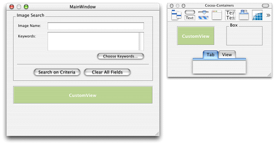
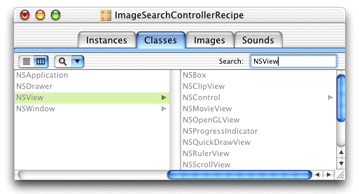
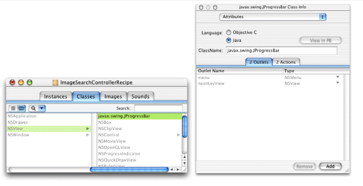
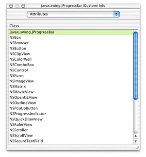
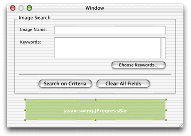
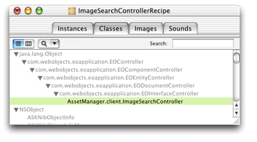
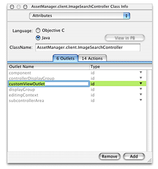
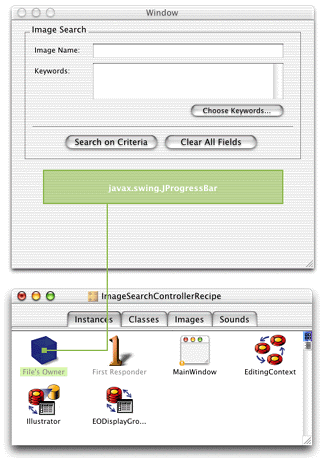
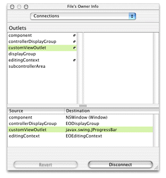

> 导航：[总目录](../../../README.md) · [documentation](../../../_indexes/documentation.md) · [WebObjects Java Client Programming Guide](Introduction%20to%20WebObjects%20Java%20Client%20Programming%20Guide.md)


[Next](Using%20and%20Extending%20Image%20Views%20in%20Nib%20Files.md)[Previous](Mixing%20Static%20and%20Dynamic%20User%20Interfaces.md)

# Using Custom Views in Nib Files

The Java Client interfaces you can build in Interface Builder support only a subset of all the standard Swing components. However, by using custom views in interface files, you can use any Swing component or custom components you write. This chapter describes how to use custom views in interface files and then provides some examples of custom view components.

You can use the nib file you built in [Nondirect Java Client Development](Nondirect%20Java%20Client%20Development.md#apple-f4xwc4dqnrsv64tfmyxwi33df52wszbpkridgmbqgaytamjxfvbuqmzqgqwviubr) for the exercises in this chapter.

_Problem:_ You want to add an unsupported view in an interface file such as `javax.swing.JProgressBar`.

_Solution:_ Place a custom view object and connect it to an outlet in File’s Owner.

In an Interface Builder file, place a custom view object in the main window. You can find this object in the Containers palette. Figure 18-1 shows this palette and a custom view placed in the main window.

__Figure 18-1__  Custom view object in window



Next, you need to assign the custom view to an NSView subclass. Before you can do this, you need to create an NSView subclass. Switch to the Classes pane in the nib file window and enter `NSView` in the Search field as shown in Figure 18-2.

__Figure 18-2__  Find NSView in class hierarchy



Select NSView if it is not already selected and press Return to subclass it. In the Info window, select Java as the language for the subclass. Then, provide a fully qualified name for the subclass. If the view represents a Swing class such as JProgressBar, use `javax.swing.JProgressBar` as shown in Figure 18-3. If the view represents a custom Swing subclass, specify the fully qualified name of that subclass.

__Figure 18-3__  Name the custom view class



Next, you need to associate the custom view you placed in the window with the new NSView subclass. Select the custom view widget in the main window and bring up the Attributes pane of the Info window. Select `javax.swing.JProgressBar`, as shown in Figure 18-4.

__Figure 18-4__  Associate custom view with NSView subclass



The name in the custom view should then change to the name of the new class, as shown in Figure 18-5.

__Figure 18-5__  Custom view as NSView subclass



Now you need to add an outlet to the interface file’s File’s Owner object for the custom view. This gives you programmatic access to the widget in the nib file’s controller class, which allows you to query and change the widget’s attributes. In the Classes pane of the nib file window, view the class hierarchy vertically and disclose the list starting with `java.lang.Object` as far as you can, as shown in Figure 18-6.

__Figure 18-6__  File’s Owner class



Select the last class in the hierarchy and bring up the Info window. Add an outlet to the class called `customViewOutlet`, as shown in Figure 18-7.

__Figure 18-7__  Add outlet to interface file



Next, you need to connect the custom view to the outlet you just created. Switch to the Instances pane of the nib file window and Control-drag from File’s Owner to the custom view in the main window as shown in Figure 18-8.

__Figure 18-8__  Connect new outlet to custom view



Then in the Connections pane of the Info window, select `customViewOutlet` and click Connect. The Connections pane of the Info window for File’s Owner should now appear as shown in Figure 18-9.

__Figure 18-9__  File’s Owner attributes



Save the interface file and open its controller class (`.java` file) in Project Builder. Add an instance variable for the outlet you added:

```
public JProgressBar customViewOutlet;
```

You now have a JProgressBar widget in your interface file. You can set its value by invoking `customViewOutlet.setValue(int value)` in the controller class. However, don’t attempt to invoke methods on the widget in the interface controller’s constructors as it may not be initialized at that point. Rather, override `controllerDidLoadArchive` as described in [Loading the Image](Using%20and%20Extending%20Image%20Views%20in%20Nib%20Files.md#apple-f4xwc4dqnrsv64tfmyxwi33df52wszbpkridgmbqgaytamjxfvbuqmzrgywueskijfdecrcc) or check to see if the component is initialized by invoking `isComponentPrepared`.

You can apply what you learned in the last section to extend the power of the user interface components supplied by the `com.webobjects.eointerface.swing` package. This section describes how to extend the EOImageView class to support mouse clicks.

_Problem:_ The class `com.webobjects.eointerface.swing.EOImageView` does not support mouse clicks.

_Solution:_ Subclass EOImageView and provide custom view outlets in an Interface Builder nib file or write a rule to use the subclass in certain controllers.

To make an EOImageView object respond to mouse clicks, you need to subclass MouseAdaptor within an EOImageView subclass. Add a file to your project named `CustomImageViewController`. Paste this code into it:

```
package com.mycompany.myapp;

import java.awt.*;
import javax.swing.event.*;
import com.webobjects.foundation.*;
import com.webobjects.eointerface.swing.*;
import com.webobjects.eogeneration.*;

public class CustomImageViewController extends EOImageView {

    public CustomImageViewController() {
        super();
        this.addMouseListener(new OpenRecord());
    }

    class OpenRecord extends MouseInputAdapter {

        public void mouseClicked(MouseEvent e) {
            NSLog.out.appendln("image clicked");
        }

    }

}
```

To use this custom class in an interface file, you subclass NSView as described in [Custom Views](#apple-f4xwc4dqnrsv64tfmyxwi33df52wszbpkridgmbqgaytamjxfvbuqmzrguwugrkhivceussi) and name the subclass `com.mycompany.myapp.CustomImageViewController`.

[Next](Using%20and%20Extending%20Image%20Views%20in%20Nib%20Files.md)[Previous](Mixing%20Static%20and%20Dynamic%20User%20Interfaces.md)

