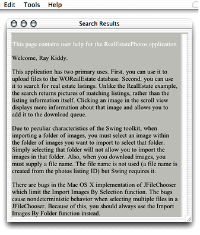

> 导航：[总目录](../../../README.md) · [documentation](../../../_indexes/documentation.md) · [WebObjects Java Client Programming Guide](Introduction%20to%20WebObjects%20Java%20Client%20Programming%20Guide.md)


[Next](Building%20a%20Login%20Window.md)[Previous](Building%20Custom%20List%20Controllers.md)

# Using HTML on the Client

The Swing toolkit usually provides all the user interface elements you need for desktop applications. However, there are circumstances in which you want to display HTML in the client application. Fortunately, Swing provides an HTML editing kit object that parses and displays HTML.

You can use WebObjects components and dynamic elements on the server to generate HTML pages, which you then pass back to the client as a String of HTML markup. This gives you the best of both worlds: a rich Swing user interface with the flexibility and power of WebObjects dynamically generated HTML pages.

One limitation of a Swing-based user interface is that it doesn’t give you the look and feel flexibility that HTML-based user interfaces do. By providing a small number of HTML components in Java Client applications, you can provide your customers with an application more tailored to their company or their specific needs.

This chapter leads you through this process in the context of providing user help files in a Direct to Java Client application. It is divided into the following sections:

- [Build the HTML Templates](#apple-f4xwc4dqnrsv64tfmyxwi33df52wszbpkridgmbqgaytamjxfvbuqmzsgawueqkcjbdugrkc)
- [Write a Controller Class](#apple-f4xwc4dqnrsv64tfmyxwi33df52wszbpkridgmbqgaytamjxfvbuqmzsgawueqkcivcukrkd)
- [Add a Menu Item](#apple-f4xwc4dqnrsv64tfmyxwi33df52wszbpkridgmbqgaytamjxfvbuqmzsgawueqkcizcugq2b)
- [Generate the HTML](#apple-f4xwc4dqnrsv64tfmyxwi33df52wszbpkridgmbqgaytamjxfvbuqmzsgawueqkcjbbekq2i)
- [Retrieve HTML From the Server](#apple-f4xwc4dqnrsv64tfmyxwi33df52wszbpkridgmbqgaytamjxfvbuqmzsgawueqkci5bumr2k)

To use HTML on the client, you need to first write a WOComponent that provides a template for the HTML. The document _[WebObjects Web Applications Programming Guide](../WebObjects%20Web%20Applications%20Programming%20Guide/Introduction%20to%20WebObjects%20Web%20Applications%20Programming%20Guide.md#apple-f4xwc4dqnrsv64tfmyxwi33df52wszbpkridgmbqgaytamjq)_ describes how to do this in depth. This book also provides a short tutorial on building WOComponents using WebObjects Builder. See [Write the Action (Build a WOComponent)](Enhancing%20the%20Application.md#apple-f4xwc4dqnrsv64tfmyxwi33df52wszbpkridgmbqgaytamjxfvbuqmzqgmwviucykjcummjtgy).

The HTML you’ll provide to the client in this example is used to display help information for the client application when the user chooses the Help item from the Help menu (you’ll add this in [Add a Menu Item](#apple-f4xwc4dqnrsv64tfmyxwi33df52wszbpkridgmbqgaytamjxfvbuqmzsgawueqkcizcugq2b)). So, the WOComponent need only contain static text that provides usage information.

However, you are free to use any of the WebObjects dynamic elements in the WOComponent. But keep in mind that some of the dynamic elements may generate HTML that is not supported by the Swing HTML editing kit you’ll use.

The remainder of this chapter assumes that you create a WOComponent named `HelpWindow.wo`.

Since Direct to Java Client does not provide a controller for an HTML editing kit, you have to write one. The HTML controller is simply another kind of widget, so the custom controller class you write can inherit from EOWidgetController. The HTML editing kit object you’ll use is an instance of `javax.swing.text.html.HTMLEditorKit`.

Listing 23-1 shows the HelpWindowController class that the JCRealEstatePhotos example uses.

__Listing 23-1__  Custom controller class for an HTML editing kit object

```
package webobjectsexamples.realestatephotos.client;

import java.awt.*;
import javax.swing.*;
import javax.swing.text.*;
import javax.swing.text.html.*;
import com.webobjects.eocontrol.*;
import com.webobjects.eogeneration.*;
import com.webobjects.eoapplication.*;
import com.webobjects.eodistribution.client.*;

public class HelpWindowController extends EOWidgetController {

    public HelpWindowController(EOXMLUnarchiver unarchiver) {
        super(unarchiver);
    }

    protected JComponent newWidget() {
        JEditorPane editorPane;
        JScrollPane scrollPane;

        editorPane = new JEditorPane();
        editorPane.setEditable(false);
        editorPane.setEditorKit(new HTMLEditorKit());
        editorPane.setText(helpText());
        editorPane.setPreferredSize(new Dimension(200, 400));
        scrollPane = new JScrollPane(editorPane, JScrollPane.VERTICAL_SCROLLBAR_ALWAYS,             JScrollPane.HORIZONTAL_SCROLLBAR_AS_NEEDED);

        return scrollPane;
    }
}
```

The HTMLEditorKit object is placed in an JEditorPane, which in turn is placed in a JScrollPane. The content of the HTMLEditorKit is set to the return value of the `helpText` method, which you’ll write in [Retrieve HTML From the Server](#apple-f4xwc4dqnrsv64tfmyxwi33df52wszbpkridgmbqgaytamjxfvbuqmzsgawueqkci5bumr2k).

To use this controller class, you need to add a D2WComponent to your application which contains an XML description of a controller hierarchy of which the custom controller is a part. To learn how to add a D2WComponent, see [New D2WComponent](Adding%20Custom%20Menu%20Items.md#apple-f4xwc4dqnrsv64tfmyxwi33df52wszbpkridgmbqgaytamjxfvbuqmzrgawugrkhivceussi). Name the new component HelpWindowComponent. The XML description, assuming that the controller class that includes the scroll view is named HelpWindowController, could be as shown in Listing 23-2.

__Listing 23-2__  HTML controller in XML description

```
<FRAMECONTROLLER reuseMode="never" horizontallyResizable="true"
 verticallyResizable="true" label="Search Results" disposeIfDeactivated="true"
 minimumHeight="300" minimumWidth="400">
    <CONTROLLER
         className="webobjectsexamples.realestatephotos.client.HelpWindowController"/>
</FRAMECONTROLLER>
```

To display this controller, you need to register a new task with the rule system. You can use this rule:

**Left-Hand Side:**
: `task = 'help'`

**Key:**
: `window`

**Value:**
: `"HelpWindowComponent"`

**Priority:**
: `50`

This rule is fired when the user selects the Help item from the Help menu, which you’ll add in [Add a Menu Item](#apple-f4xwc4dqnrsv64tfmyxwi33df52wszbpkridgmbqgaytamjxfvbuqmzsgawueqkcizcugq2b).

The user help is accessed from a new menu item called Help, which is in the Help menu. As described in [Adding Custom Menu Items](Adding%20Custom%20Menu%20Items.md#apple-f4xwc4dqnrsv64tfmyxwi33df52wszbpkridgmbqgaytamjxfvbuqmzrgawviubr), you add menu items to Direct to Java Client applications by adding to the application’s `actions` or `additionalActions`. Since the menu item you’ll add will be part of the Help menu, you want to add a menu-specific action as described in [Menu-Specific Actions](Adding%20Custom%20Menu%20Items.md#apple-f4xwc4dqnrsv64tfmyxwi33df52wszbpkridgmbqgaytamjxfvbuqmzrgawviucykjcumnbr).

To add a Help menu item to the Help menu that invokes a task in the rule system called `help`, add the XML shown in Listing 23-3 to a D2WComponent that describes an application’s actions. This rule system looks for actions and additional actions in a D2WComponent, which is specified as the right-hand side value of a rule that has a left-hand side of `actions` (or `additionalActions`). The JCRealEstatePhotos example identifies the application’s actions in the UserActions component.

__Listing 23-3__  Specify a Help menu action

```
<ARRAY>
<HELPWINDOWACTION task="help" menuAccelerator="shift T"descriptionPath="Help"/>
</ARRAY>
```

Selecting the Help item from the Help menu invokes the `help` task in the rule system which displays the HelpWindowComponent that includes the HelpWindowController class.

The HTML controller class you wrote retrieves its data from the WebObjects application on the server. This means that you can leverage the full power of WebObjects component-driven HTML generation, including most of the dynamic elements and the full power of Enterprise Objects and provide the results in a Swing user interface on the client.

All the HTML controller class needs for input is a string of HTML markup. You need to perform the following operations on the WebObjects application server to provide this HTML markup:

- ask the application instance to generate a WOComponent
- get the content of that component
- convert that content into a string

You can use the code in Listing 23-4 to do this.

__Listing 23-4__  Generate a WOComponent and convert it to a string of markup

```
public String clientSideRequestGenerateHelp() {
        NSData data;
        WOResponse response;
        WOComponent page;

        page = WOApplication.application().pageWithName("HelpWindow",            context());

        response = page.generateResponse();
        data = response.content();
        return new String(data.bytes(0, data.length()));
 }
```


To invoke the method you wrote in [Generate the HTML](#apple-f4xwc4dqnrsv64tfmyxwi33df52wszbpkridgmbqgaytamjxfvbuqmzsgawueqkcjbbekq2i), you need to perform a remote method invocation from the client application. In [Write a Controller Class](#apple-f4xwc4dqnrsv64tfmyxwi33df52wszbpkridgmbqgaytamjxfvbuqmzsgawueqkcivcukrkd), the content of the editor pane that contains the HTML editing kit is set to the return value of the `helpText` method. That method performs a remote method invocation, which invokes the method on the server side that generates the HTML and returns it as a string. You can use the code in Listing 23-5 to do this.

__Listing 23-5__  Perform a remote method invocation to generate and return HTML

```
public String helpText() {
        return               (String)_distributedObjectStore().invokeStatelessRemoteMethodWithKeyPath(               "session", "clientSideRequestGenerateHelp", null, null);
    }

    private EODistributedObjectStore _distributedObjectStore() {
        EOObjectStore objectStore = EOEditingContext.defaultParentObjectStore();
        if ((objectStore == null) || (!(objectStore instanceof EODistributedObjectStore))) {
            throw new IllegalStateException("Default parent object store needs to be an                 EODistributedObjectStore");
        }
        return (EODistributedObjectStore)objectStore;
    }
```

When you put all the ideas in this chapter together, you should see a new item in the Help menu called Help. Selecting this should display the HelpWindowComponent which contains the HTML view and the HTML that is generated by the server-side application. Figure 23-1 shows an example.

__Figure 23-1__  HTML help in the client



[Next](Building%20a%20Login%20Window.md)[Previous](Building%20Custom%20List%20Controllers.md)

