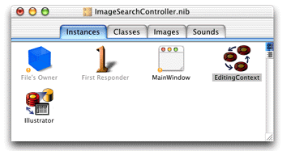
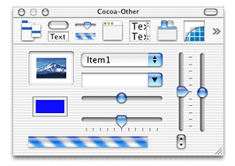
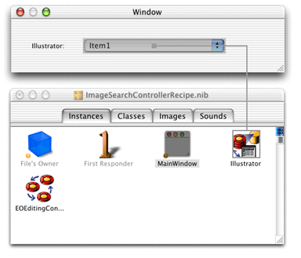
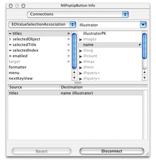
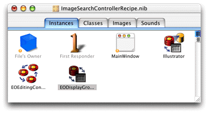
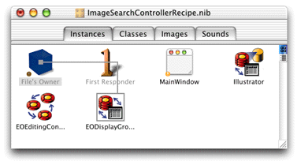
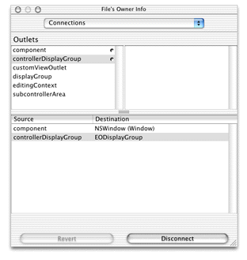
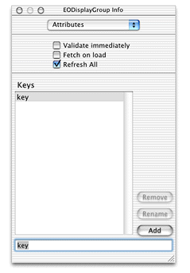
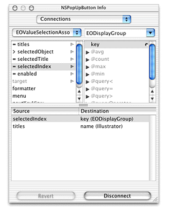
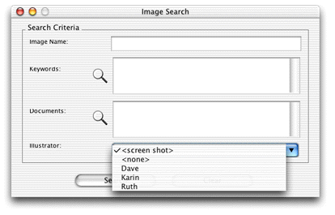

> 导航：[总目录](../../../README.md) · [documentation](../../../_indexes/documentation.md) · [WebObjects Java Client Programming Guide](Introduction%20to%20WebObjects%20Java%20Client%20Programming%20Guide.md)


[Next](Localizing%20Dynamic%20Components.md)[Previous](Using%20and%20Extending%20Image%20Views%20in%20Nib%20Files.md)

# Using Pop-up Menus in Nib Files

It’s common to want to display pop-up menus in interface files that display a short list of enumeration values. This chapter describes how to connect a pop-up menu widget (`javax.swing.JComboBox`) to a display group and how to get the value of the selected object in the interface file’s controller class.

_Problem:_ You want to display a pop-up menu (JComboBox) and extract the selected value.

_Solution:_ Place a pop-up menu widget in an interface file and use a controller display group to extract the value.

In a nib file, add the entity that contains the enumeration values to the nib file by dragging the entity from EOModeler into the nib file window. Figure 20-1 shows an entity called “Illustrator” as a display group in a nib file.

__Figure 20-1__  Illustrator entity in nib file



When you drag an entity from EOModeler into a nib file, an EOEditingContext object is also added if one is not already in the nib file.

Now add a widget for the pop-up menu. You can find it in the Other palette, as shown in Figure 20-2. It’s the widget that includes the text “Item1”.

__Figure 20-2__  Other palette



Then, Control-drag from the widget to the display group for the entity containing the enumeration values, as shown in Figure 20-3.

__Figure 20-3__  Connect widget to display group



This action displays the Info window so you can set the binding for the `titles` aspect of the EOValueSelectionAssociation. As shown in Figure 20-4, bind the `titles` aspect to the attribute of the entity that represents the enumeration value, `name` in the example shown here.

__Figure 20-4__  Bind the title aspect to the appropriate attribute



Save the nib file and choose Test Interface from the File menu. You should see the values of the attribute bound to the `titles` aspect of the pop-up menu as items in that menu.

To get the value of the selected object in the controller class for the interface file, there is more work to do. Add a new EODisplayGroup object to the interface file by dragging one out from the EnterpriseObjects palette into the nib file window. The nib file window should then appear as shown in Figure 20-5.

__Figure 20-5__  EODisplayGroup object in nib file



Then, bind the new EODisplayGroup object to the `controllerDisplayGroup` outlet of File’s Owner. Do this by Control-dragging from File’s Owner to the new display group as shown in Figure 20-6.

__Figure 20-6__  Bind File’s Owner `controllerDisplayGroup` outlet



Then, in the Info window, select `controllerDisplayGroup` and click Connect, as shown in Figure 20-7.

__Figure 20-7__  Bind the outlet



Now, add a key to the controller display group object called `key`. This represents the name of the action method that is invoked in the nib file’s controller class when a user chooses an object in the pop-up menu. To add a key, select the display group object in the nib file window and choose Show Info from the Tools menu. In the Attributes pane, add the key named `key` as shown in Figure 20-8.

__Figure 20-8__  Add a key to display group



Then, bind the `selectedIndex` attribute of the EOValueSelectionAssociation to the key named `key` in the controller display group. Control-drag from the pop-up menu to the display group bound to the `controllerDisplayGroup` outlet of File’s Owner and in the Info window, connect the binding as shown in Figure 20-9.

__Figure 20-9__  Bind `selectedIndex` attribute of association to display group key



Save the nib file.

In the nib file’s controller class, add a method called `setKey`. This is invoked when an object in the pop-up menu is selected.

```
public void setKey(int illustrator) {
     _illustrator =      (String)controllerDisplayGroup().valueForObjectAtIndex(illustrator,          "name");
}
```

It sets an instance variable in the class (`_illustrator`) to the String value of the object selected in the menu.

Figure 20-10 shows a pop-up menu in action.

__Figure 20-10__  A pop-up menu in action


[Next](Localizing%20Dynamic%20Components.md)[Previous](Using%20and%20Extending%20Image%20Views%20in%20Nib%20Files.md)

