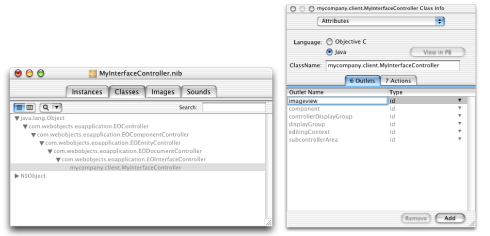
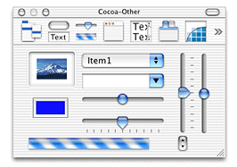
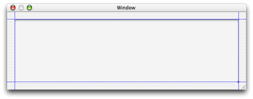
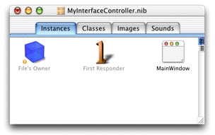
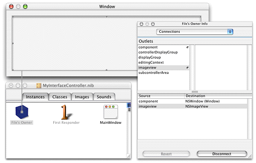
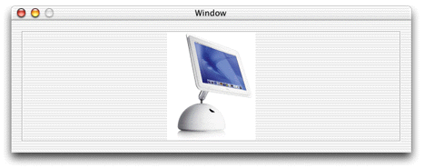

> 导航：[总目录](../../../README.md) · [documentation](../../../_indexes/documentation.md) · [WebObjects Java Client Programming Guide](Introduction%20to%20WebObjects%20Java%20Client%20Programming%20Guide.md)


[Next](Using%20Pop-up%20Menus%20in%20Nib%20Files.md)[Previous](Using%20Custom%20Views%20in%20Nib%20Files.md)

# Using and Extending Image Views in Nib Files

It’s common to want to display images in the user interfaces of Java Client applications. Although you can use Interface Builder to place the view area for an image, you must retrieve and load the image programmatically. This task describes the steps necessary to use an image view in an Interface Builder file.

_Problem:_ You want to display an image in an Interface Builder file.

_Solution:_ Place an image view in a nib file, add an outlet, and load the image programmatically.

To set the image in an image view, you need access to the widget in the controller class. This is described in [Programmatic Access to Interface Components](Nondirect%20Java%20Client%20Development.md#apple-f4xwc4dqnrsv64tfmyxwi33df52wszbpkridgmbqgaytamjxfvbuqmzqgqwviucykjcummrx). To review, to get programmatic access to user interface elements, you need to add outlets to File’s Owner, associate user interface widgets with those outlets, and add instance variables for the outlets to which you want programmatic access.

To add an outlet, switch to the Classes pane in the nib file window and select the class with which File’s Owner is associated. Bring up the Info window and choose Attributes from its pop-up list. Switch to the Outlets pane and click Add to add a new outlet. Name the new outlet `imageview`. Refer to Figure 19-1.

__Figure 19-1__  Add a new outlet



Now you’re ready to add the image view widget to the interface.

You now need to add a widget to represent the image you want to display. The Other palette includes an image view widget that works for these purposes. If the palettes window isn’t visible, choose Tools >Palettes > Show Palettes. Click the Other palette button in the toolbar (the one with the slider and the progress bar). The Other palette is shown in Figure 19-2.

__Figure 19-2__  Other palette



Drag the image view widget (the one in the upper-left corner of the Cocoa palette with the picture of a mountain in it) onto the main window. If the main window isn’t visible, switch to the Instances pane of the nib file window and double-click the MainWindow object. Place the widget in the upper-left corner of the window and use the guides Interface Builder provides to size and place it, as shown in Figure 19-3.

__Figure 19-3__  Place widget with guides



Now you need to connect the widget to the outlet you added to File’s Owner.

Interface Builder is the best tool for building Java Client user interfaces as it allows you to visually associate user interface widgets with outlets and actions in the class file. When you associated File’s Owner with the custom subclass of EOInterfaceController, the icon for File’s Owner changed to include an exclamation point, as shown in Figure 19-4.

__Figure 19-4__  File’s Owner icon with exclamation point



The exclamation point icon indicates that File’s Owner’s connections are broken or incomplete. In this case, the `imageview` outlet you added is not connected (it is not associated with anything). To make the connection, Control-drag from File’s Owner to the image view widget you placed in the main window as shown in Figure 19-5.

__Figure 19-5__  Connect outlet to widget



In the File’s Owner Info window, select the `imageview` outlet and click Connect. The File’s Owner Info window should then appear as in Figure 19-5.

Save the interface file. It is now prepared to display an image in the client application.

The image view widget you placed in the interface file did not specify a particular image. Rather, it specified an area in the window where an image can be displayed. You now need to add some code to retrieve the image and load it in the image view widget.

In Project Builder, open the Java class for the interface file you just edited. Before modifications, it should look something like this:

```
package mycompany.client;

import com.webobjects.foundation.*;
import com.webobjects.eocontrol.*;
import com.webobjects.eoapplication.*;

public class MyInterfaceController extends EOInterfaceController {

    public MyInterfaceController() {
        super();
    }

    public MyInterfaceController(EOEditingContext substitutionEditingContext) {
        super(substitutionEditingContext);
    }
}
```

To load and place the image, you use the EOInterface Swing package (`com.webobjects.eointerface.swing.*`). You also need to use the Java Swing and AWT packages, so add these import statements:

```
import com.webobjects.eointerface.swing.*;
import java.awt.*;
import javax.swing.*;
```

Next, you need to add an instance variable to get access to the outlet you defined in the interface file. The variable’s type is EOImageView, defined in `com.webobjects.eointerface.swing.*`. You named the outlet “imageview” so add an instance variable of the same name:

```
public EOImageView imageview;
```

To load an image into the EOImageView object, you need to make sure that the interface controller has finished loading. The method `controllerDidLoadArchive` is invoked when the controller is finished loading. You can override it to perform certain initializations, such as loading an image into an image view. Add the method as shown in Listing 19-1.

__Listing 19-1__  Overriding `controllerDidLoadArchive`

```
    protected void controllerDidLoadArchive(NSDictionary namedObjects) {

        ImageIcon iIcon =           (ImageIcon)EOUserInterfaceParameters.localizedIcon("iMac");// 1

        Image newImage = iIcon.getImage();// 2

        imageview.setImage(newImage);// 3
    }
```

Code line 1 attempts to retrieve an image that is associated with the Web Server target. Specify the image name without including the suffix.

Code line 1 casts the retrieved object into an object of type ImageIcon. `localizedIcon` returns an object of type Icon, so casting the retrieved object into an ImageIcon allows you to retrieve the image data in the form of an Image object that the `setImage` method on EOImageView accepts. Code line 2 retrieves the image’s data from the ImageIcon object and code line 3 sets the image in the image view object to the image retrieved in code line 1.

If successful, your interface file should load and display the specified image as shown in Figure 19-6.

__Figure 19-6__  Image in image view



[Next](Using%20Pop-up%20Menus%20in%20Nib%20Files.md)[Previous](Using%20Custom%20Views%20in%20Nib%20Files.md)

