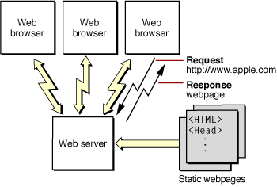
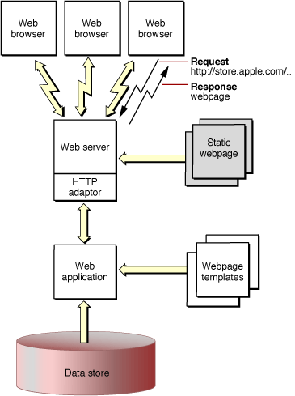
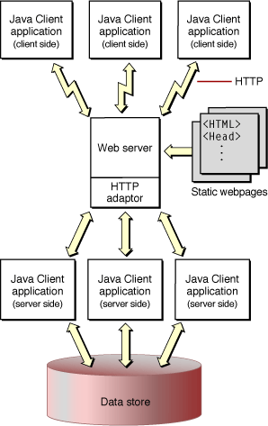
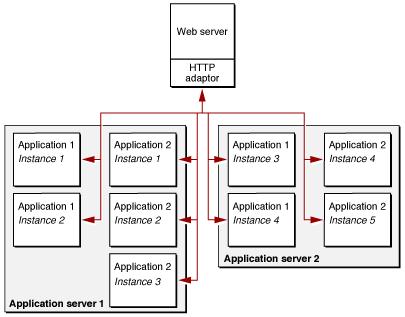

> 导航：[总目录](../../../README.md) · [documentation](../../../_indexes/documentation.md) · [WebObjects Overview](Introduction%20to%20WebObjects%20Overview.md)

[Next](Choosing%20Your%20Approach.md)[Previous](Introduction%20to%20WebObjects%20Overview.md)

# About Web Objects

From an information-technology perspective, WebObjects is a scalable, high-availability, high-performance application server. From the viewpoint of a developer, though, WebObjects is an extensible object-oriented platform upon which you can rapidly develop and deploy applications that integrate existing data and systems. WebObjects allows you to build applications that leverage the connectivity that the Internet or an intranet provides using a multitiered client-server architecture.

The web was created to simplify access to electronically published documents. Originally webpages were just static text pages with hyperlinks to other documents. However, they quickly evolved into highly graphical animated presentations. Along the way, a degree of interactivity was introduced, allowing people browsing the web to fill out forms and thereby supply data to the server.

WebObjects allows you to take the next logical step. With it, you can produce full-fledged applications for use either across the Internet or within a corporate intranet. Users not only fill out forms but can author content stored in back-end databases. By tracking user sessions and preferences, you can offer a custom user experience much like a desktop application.

These applications can be web-based, and thus accessible through a web browser, or can have the full interactivity of a stand alone desktop application. Your application can also provide web services to other web applications.

Much of the content on the web is textual or graphical material that doesn’t change much over time. However, there is growing demand for websites that publish ever-changing content—for example, breaking news stories, up-to-the-minute stock quotes, and the current weather.

The architecture of a static website is shown in Figure 1-1. A user’s web browser requests pages using Uniform Resource Locators (URLs). These requests are sent over the network to the web server, which analyzes each request and selects the appropriate webpage to return to the user’s browser. This webpage is simply a text file that contains HTML code. Using the HTML tags embedded within the file received from the HTTP server, the browser renders the page. Because HTML in its simplest form is just a markup language, there is no interactivity with a static page.

__Figure 1-1__  A static website

Static websites are easy to maintain. There are a number of tools in the market that allow you to create webpages with a relatively small amount of effort. And, as long as the content of your pages doesn’t change too often, it isn’t difficult to keep them up-to-date.

However, if the content on your pages needs to be "live"—for example, updated continually from multiple sources—or interactive—for example, depends on user preferences or queries—then it would be too labor intensive to maintain all the possible static webpages.

WebObjects allows you to quickly and easily publish dynamic content over the web. You create webpage templates that indicate where on the webpage the dynamic content is placed. WebObjects fills in the content when the page needs to be generated in response to a request. The information your applications publish can reside in a database or other data-storage medium or it can be generated at the time a page is accessed. The pages are also highly interactive—you can fully specify the way the user navigates through them and what data they can view and modify.

Figure 1-2 shows a WebObjects-based website. Again, the request (in the form of a URL) originates from a web browser. The web server detects that the request should be handled by a WebObjects application, and passes the request to an HTTP adaptor. The adaptor packages the incoming request in a form the WebObjects application can understand and forwards it to the application. Based upon webpage templates you define and the relevant data from the data store, the application generates a webpage that it passes back through the adaptor to the web server. The web server sends the page to the web browser, which renders it.

__Figure 1-2__  A dynamic publishing website

This type of WebObjects application is referred to as _web-based_, since the result is a series of dynamically generated HTML webpages.

Instead of using an HTTP adaptor, you can deploy applications through servlet containers. This approach allows you to take advantage of your servlet container’s application deployment facilities. For more information on this approach, read _[WebObjects J2EE Programming Guide](../WebObjects%20J2EE%20Programming%20Guide.md#apple-f4xwc4dqnrsv64tfmyxwi33df52wszbpkridgmbqgaytamjt)_.

Although the majority of websites publish static content, the number of sites that publish dynamic content is growing rapidly. Many enterprises use intranets, the Internet, or both to provide easy access to dynamic content. Online stores selling books, music, or computers are examples of an Internet client-server application.

Client-server applications offer huge advantages over traditional applications. Users don’t have to install the application on a client computer, which not only saves client disk space but ensures that the user always has the most up-to-date version of the application. Also, the client computers can be Macs, PCs, or anything that can run the client, a web browser, with the necessary capabilities.

WebObjects allows you to develop three different types of Internet applications: web applications, Java Client applications, and web services. Web applications are analogous to Common Gateway Interface (CGI) applications and consist of dynamically generated webpages accessed through a web browser. Java Client moves part of your application to the client-side computer and enlists Sun’s Java Foundation Classes (JFC) to give it the complete user interface found in a more traditional desktop application. Web services uses the same back-end components of web applications and Java Client applications to provide services to other web applications. Rapid prototyping tools are available for each of these types of client-server applications.

You can create a web application quickly and easily with WebObjects. WebObjects provides many HTML-based elements that you can use to build your web application’s interface. These elements range from simple user interface widgets (for example, submit buttons, checkboxes, and tables) to elements that provide for the conditional or iterative display of content.

You can also define web components. These are webpage templates that you can use to define your web application's design. Web components can contain any of the layout elements mentioned earlier as well as other web components. For example, you can create a toolbar component that provides a link to your main website and to a search webpage. Then, as you create other components, you include the toolbar component in them. When you develop a support page for your website that you want all the other components to use, the toolbar component is the only place you need to add a link to it.

Web components encapsulate more than the layout of a webpage. They also encompass a Java file that links the component’s elements and subcomponents into a coherent entity. You put application-specific business logic in the Java class of a web component.

For more information on web applications, read _[WebObjects Web Applications Programming Guide](../WebObjects%20Web%20Applications%20Programming%20Guide/Introduction%20to%20WebObjects%20Web%20Applications%20Programming%20Guide.md#apple-f4xwc4dqnrsv64tfmyxwi33df52wszbpkridgmbqgaytamjq)_. Read _[WebObjects Builder User Guide](../WebObjects%20Builder%20User%20Guide/Introduction%20to%20WebObjects%20Builder.md#apple-f4xwc4dqnrsv64tfmyxwi33df52wszbpkridimbqgazdgnbq)_ for how to construct reusable web components.

When you need the fast and full-featured user interface of desktop client-server applications, you can partition your application so that a portion of it—including all or part of the user interface logic—runs in Java directly on the client. Client-server communication is handled by WebObjects. WebObjects applications that are partitioned in this way are known as Java Client applications.

Java Client distributes the objects of your WebObjects application between the application server and one or more clients—typically Java applications. It is based on a distributed multitier client-server architecture where processing duties are divided between a client, an application server, a database server, and a web server. With a Java Client application, you can partition business objects containing business logic and data into a _client side_ and a _server side_. This partitioning can improve performance and at the same time help to secure legacy data and business rules.

Figure 1-3 illustrates a Java Client application in which the client portion is running as an application installed on the user’s computer. Java Client applications, just like web applications, can communicate with the application server using HTTP requests. In addition, Java Client passes objects between the portion of your application residing on the user’s computer and the portion of your application that remains on the application server.

For more information on desktop applications, read _[WebObjects Java Client Programming Guide](../WebObjects%20Java%20Client%20Programming%20Guide/Introduction%20to%20WebObjects%20Java%20Client%20Programming%20Guide.md#apple-f4xwc4dqnrsv64tfmyxwi33df52wszbpkridgmbqgaytamjx)_.

__Figure 1-3__  Java Client applications in action

Web services is an innovative implementation of distributed computing. WebObjects allows you to expose class methods as web service operations. Web services provide an efficient way for applications to communicate with each other. Based on Simple Object Access Protocol (SOAP) messages that wrap Extensible Markup Language (XML) documents, web services provide a flexible infrastructure that leverages the ubiquitous HTTP (or HTTPS) over TCP/IP. This means that your organization probably has all the hardware and software infrastructure needed to deploy web services.

But web services provide more than an information-exchange system. When an application implements some of its functionality using web services, it becomes more than the sum of its parts. For example, you can create a web service operation that uses a web service operation from another provider to give its consumers (also known as _service requestors_) information tailored to their needs. Web service operations are similar to the methods of a Java class; a provider is an entity that publishes a web service, while the entities that use the web service are called consumers.

Web applications as well as Java Client applications can take advantage of web services. Figure 1-4 shows a dynamic-publishing website that uses web services.

For more information on web services applications, read _[WebObjects Web Services Programming Guide](../WebObjects%20Web%20Services%20Programming%20Guide.md#apple-f4xwc4dqnrsv64tfmyxwi33df52wszbpkridgmbqgaytamjz)_.

__Figure 1-4__  A dynamic publishing website using web services

WebObjects provides power and flexibility. A certain degree of complexity, however, accompanies these features. For many applications, whether web-based or Java Client–based, it’s more important initially to develop the application quickly than strive for maximum customization. As an example, a simple data-browsing and editing application, intended only for internal use by a system administrator, probably wouldn’t warrant the same degree of effort you would put into an application accessible by the general public. To simplify the development of applications like the former, WebObjects includes a set of rapid-prototyping technologies: Direct to Web, Direct to Java Client, and Direct to Web Services.

These three technologies correspond to the three types of applications described in [Different Client-Server Applications](#apple-f4xwc4dqnrsv64tfmyxwi33df52wszbpkridgmbqgaytambyfvbuqmrqgiwviucykjcummjqgm) but are similar in approach. Each technology creates a different type of application: a web application by Direct to Web, a Java Client application by Direct to Java Client, and a web services application by Direct to Web Services. These technologies use a data model as the base upon which an application is created. In addition, they are useful not only for creating simple data-browsing applications or web services, but for creating early prototypes. Because they allow customization on various levels, they are also well-suited for creating shipping applications.

Direct to Web is a system for creating web applications that access a database. All Direct to Web needs to create the application is a model of the database, which you can build using EOModeler or the Xcode EO model design tool.

Direct to Web uses information from a data model to dynamically generate webpages. Consequently, you can modify your application’s configuration at runtime—using the Web Assistant—to hide objects of a particular class, hide their properties, reorder properties, and change the way they are displayed without recompiling or relaunching the application.

Out of the box, Direct to Web generates webpages for nine common database tasks, including querying, editing, and listing. To do this, Direct to Web uses a task-specific component called a template that can perform the task on any entity. The templates, in conjunction with a set of rules (which you can customize), are the essential elements of a Direct to Web application.

A Direct to Web application is highly customizable. For example, you can change the appearance of the standard templates, mix web components with webpages generated by Direct to Web, and create custom web components and Direct to Web templates that implement specialized behavior.

You can also freeze pages and edit them using WebObjects Builder. By doing so, you improve performance but lose the ability to change the page using the Web Assistant. Usually, you freeze pages just before deploying your Direct to Web application.

For more information on Direct to Web, read _[WebObjects Direct to Web Guide](../WebObjects%20Direct%20to%20Web%20Guide/Introduction%20to%20WebObjects%20Direct%20to%20Web%20Guide.md#apple-f4xwc4dqnrsv64tfmyxwi33df52wszbpkridgmbqgaytamjv)_.

Like Direct to Web, Direct to Java Client generates a user interface for common database tasks using rules to control program flow and provides an assistant that allows you to modify your applications at runtime. The applications produced by Direct to Java Client have rich desktop-class user interfaces. In addition, Java Client applications can take advantage of the processing power of the client computer to perform operations such as sorting or filtering a list of items received from the server.

For more information on Direct to Java Client, read _[WebObjects Java Client Programming Guide](../WebObjects%20Java%20Client%20Programming%20Guide/Introduction%20to%20WebObjects%20Java%20Client%20Programming%20Guide.md#apple-f4xwc4dqnrsv64tfmyxwi33df52wszbpkridgmbqgaytamjx)_.

Direct to Web Services allows you to create a web service that lets its clients access data in your data store by invoking web service operations. Although this approach is similar to Direct to Web and Direct to Java Client in its use of a data model and rule sets, the target users for web service applications are other applications, not people.

You use the Web Services Assistant to determine which data entities are accessible by your web service clients and the type of operations they can execute on them, such as search, insert, delete, and update. You accomplish this without writing a single line of code.

For more information on Direct to Web Services, read _[WebObjects Web Services Programming Guide](../WebObjects%20Web%20Services%20Programming%20Guide.md#apple-f4xwc4dqnrsv64tfmyxwi33df52wszbpkridgmbqgaytamjz)_.

Dynamic WebObjects applications are more powerful if you can populate the generated HTML, Java Client messages, or web service responses with data obtained from a back-end database. A back-end database can provide read and write access to a shared repository of web content, including data used by your web application such as customer records.

WebObjects uses Enterprise Objects to encapsulate the details of accessing tables and records in a database. Your application uses enterprise objects, created from Java classes, to read and write data. You specify the mapping between these enterprise objects and the database using an entity-relationship model. You create the entity-relationship model using either EOModeler or the Xcode EO model design tool. Enterprise Objects seamlessly takes care of all your queries, read/write access, and faulting.

Your enterprise objects are true models in the Model-View-Controller paradigm that encapsulate data and business logic. Enterprise object classes represent the part of your application that won't change regardless of which application-development approach you choose.

Enterprise Objects enables the Direct to Web, Direct to Java Client, and Direct to Web Services technologies. These technologies use the entity-relationship model to abstract rules and templates for controlling what data can be viewed and modified.

For more information on Enterprise Objects, read _[WebObjects Enterprise Objects Programming Guide](../WebObjects%20Enterprise%20Objects%20Programming%20Guide.md#apple-f4xwc4dqnrsv64tfmyxwi33df52wszbpkridgmbqgaytamjr)_. For details on how to use EOModeler, read _[EOModeler User Guide](../EOModeler%20User%20Guide/Introduction%20to%20EOModeler%20User%20Guide.md#apple-f4xwc4dqnrsv64tfmyxwi33df52wszbpkridgmbqgaytamjy)_. Read _Xcode 2.2 User Guide_ for how to create a model in Xcode.

WebObjects provides a number of key technologies that give it a significant advantage over other application servers.

Much of the data that is (or could be) presented on the web already exists in electronic form. Not only can it be a challenge to create a website or web application to present your data using conventional tools, accessing the data itself could be difficult. Some products rely on manually created or assistant-generated Structured Query Language (SQL) code, leading to database-specific code that is difficult to optimize. WebObjects avoids these problems by using Enterprise Objects, a model-based mechanism for cleanly instantiating business objects directly from database tables. Enterprise Objects handles all the interactions with the database including fetching, caching, and saving. This allows you to write your business logic against actual objects independent of the underlying data store. You can modify schemas, add or change databases, or even use a totally different storage mechanism without needing to rewrite your application.

An ideal web application–development system that is also object-oriented simplifies maintenance and encourages code reuse by enforcing a clean separation of models (data store), views (webpages), and controllers (Java code). This separation is inherent in the WebObjects programming, which uses reusable web components to generate webpages directly from enterprise-object instances without the need to embed scripts or Java code inside the webpages themselves. A web component contains a webpage template, which you—or a professional webpage designer—can design and edit using standard webpage authoring tools. A component can also implement custom behavior using a separate Java source file. Neither the template nor the Java source file includes data-model–specific information.

The HTTP protocol used on the web is inherently stateless; that is, each HTTP request arrives independently of earlier requests, and it is up to web applications to determine which of the active users sent it. Therefore, most web applications of consequence—as well as some of the more interesting dynamic publishing sites—need to keep state information, such as login information or a shopping cart, associated with each user session.

Without using cookies, WebObjects provides objects that allow you to maintain information for the life of a particular user session, or longer. This makes it particularly easy to implement an application like an online store: you don’t have to do anything special to maintain the contents of the user’s shopping cart or other data over the life of the session. In addition, your online store could even monitor customer buying patterns and then highlight items a particular buyer is likely to be interested in the next time she visits your site.

The power of WebObjects comes from a tightly integrated set of tools and frameworks, facilitating the rapid assembly of complex applications. At the heart of this system is Xcode, an integrated development environment (IDE) that manages your Java business logic and tracks data models, web components, and supporting files. As mentioned earlier, WebObjects also includes powerful assistants and frameworks that allow the rapid creation of web, Java Client, and web services applications directly from the database. Advanced developers can tap into the WebObjects API, allowing virtually unlimited customization and expandability.

WebObjects applications are 100% Pure Java, which means they can be deployed on any platform with a certified Java virtual machine.

Static websites and traditional client-server applications have one advantage: They both leverage the power of the client platform, minimizing the load on the server. It doesn’t take all that much processing power to serve a set of static webpages. Dynamic applications, although a tremendous advance over static websites, require additional server power to quickly access the changing data and construct the webpages or Java Client user interface.

The WebObjects application server is both efficient and scalable. With WebObjects, if more power, reliability, or failover protection is needed, you can run multiple instances of your application, either on one or on multiple application servers (see Figure 1-5). You can choose from one of several load-balancing algorithms (or create your own) to determine which application instance each new user should connect to. And, either locally or from a remote location, you can analyze site loads and usage patterns and then start or stop additional application instances as necessary. Load balancing is a very powerful feature of WebObjects that allows you to add more server capacity as the need arises without needing to implement a load-balancing algorithm yourself. Read _[WebObjects Deployment Guide Using JavaMonitor](../WebObjects%20Deployment%20Guide%20Using%20JavaMonitor/Introduction%20to%20WebObjects%20Deployment%20Guide%20Using%20JavaMonitor.md#apple-f4xwc4dqnrsv64tfmyxwi33df52wszbpkridgmbqgaytambz)_ for more deployment options.

__Figure 1-5__  Multiple instances of two applications

[Next](Choosing%20Your%20Approach.md)[Previous](Introduction%20to%20WebObjects%20Overview.md)

