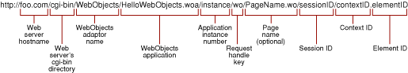
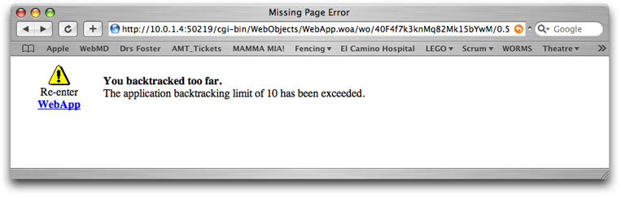

> 导航：[总目录](../../../README.md) · [documentation](../../../_indexes/documentation.md) · [WebObjects Web Applications Programming Guide](Introduction%20to%20WebObjects%20Web%20Applications%20Programming%20Guide.md)


[Next](Document%20Revision%20History.md)[Previous](Using%20the%20Application%20and%20Session%20Objects.md)

# Backtracking and Cache Management

Backtracking, client-side page caching, and web component caching are three closely related issues that cause many headaches for web application developers. Fortunately, WebObjects offers a number of mechanisms that help you deal with the collective problem of managing page state.

Dynamic web applications are possible because of, among other things, server-side state persistence and state management. HTTP, the protocol of the web, is inherently stateless. However, storing state in an application server makes persistence management in web applications possible. In WebObjects, the Session object holds state but is not solely responsible for state management. The Session object tracks sessions, flags WOComponent and WOElement objects with special identifiers, and uses other mechanisms to hold and manage state. WOComponent objects manage the state of their internal instance variables and dynamic elements.

Along with these mechanisms, caching plays an important role in managing the state of visual components. Caching allows a user to view a previously viewed webpage (even a dynamically generated one) without the application needing to regenerate the page. Caching also plays a crucial role in providing a good user experience in web applications. Caching lets users backtrack using their web browser’s Back button, which often allows for instantaneous loading of pages from the client-side cache rather than requesting a previously viewed page from the application server. However, because there are diverse implementations of the HTTP protocol in web browsers, backtracking behavior is inconsistent and requires considerable attention when developing web applications.

In addition to client-side page caching, WebObjects also caches components in a server-side cache. If used correctly, this is a valuable feature that can improve performance and user experience. But you must be conscious of the relationship between server-side component caching and client-side page caching, and how inconsistencies in backtracking behavior affect the result when either or both caching features are active.

A web component is the aggregate of WebObjects elements and subcomponents. When a web browser caches a webpage from a WebObjects application, it caches the static HTML code of a generated page (which does not include a web component’s programmatic entities, such as instance variables). In contrast, server-side component caching caches a web component’s definition and state.

Client-side page caching is a feature implemented by web browsers to improve performance and user experience. Although WebObjects applications primarily publish dynamic webpages, many websites serve static pages: They do not change as rapidly as content-driven dynamic sites.

For instance, consider a website that publishes news stories and other articles. Although the front page of the site probably changes a few times each day, it likely would not change in the few minutes an average user spends browsing headlines and reading a few articles.

With client-side page caching active, the front page of the news website is cached on the client’s computer upon the first visit. The first page could be large, containing images, banner ads, and text. The user could select an article, read part of it, and access other articles through URLs in the first article. Then, having visited five or six pages within the website, the user could backtrack to the main page. Since the content of that page is not likely to change in the time the user took to peruse the five or six pages, the page should be reloaded from the local cache. So the web browser—instead of requesting and downloading the main page from the web server again—would retrieve it from the local cache, avoiding a round trip over the network to the web server. In this case, page caching serves a sensible and user-friendly function.

Now, consider the case of an online store: A user chooses items to buy and adds them to a shopping cart. It’s generally not a good idea for the user to view a cached webpage representing the shopping cart as it likely does not contain the most up-to-date information. If client-side page caching is active, however, this is a real possibility.

WebObjects offers a number of mechanisms to deal with the problems of backtracking and client-side caching. The first one you should use is a flag on the Application object that you set using the `setPageRefreshOnBacktrackEnabled` method of the WOApplication class (`com.webobjects.appserver`). When `pageRefreshOnBacktrackEnabled` is `true`, a number of HTTP headers are added to each response generated by the WebObjects application to disable client-side page caching. Table 1 shows these headers and their values.

__Table 1__  HTTP response headers that deactivate client-side page caching

| Header | Value |
| `date` | _The time the response page was generated._ |
| `expires` | _The time the response is to expire._ (Same as `date`.) |
| `pragma` | `no-cache` |
| `cache-control` | `private`, `no-cache`, `no-store`, `must-revalidate`, `max-age = 0` |

See section 14.9 of the HTTP 1.1 specification (RFC 2616) for more details on each of these headers.

The `pageRefreshOnBacktrackEnabled` property affects all responses generated by an application. If you want to restrict the behavior to a specific response, invoke the `disableClientCaching` method of the WOResponse object (`com.webobjects.appserver`). WOResponse also includes the methods `setHeader` and `setHeaders`, which allow you to explicitly set the HTTP headers for a particular response.

When a web browser receives a response page with the headers shown in Table 1, it should not add the page to its local cache and it should invalidate the page as soon as it is displayed. In other words, when users backtrack to retrieve previously viewed pages, the web browser should request the response page from the application server. However, not all web browsers follow this protocol, as demonstrated in [Web Browser Backtracking Behavior](#apple-f4xwc4dqnrsv64tfmyxwi33df52wszbpkridimbqgaztenztfvjvona). The first few times the user backtracks to previously viewed pages, most web browsers ignore the HTTP headers and render the page stored in the cache.

When a web browser needs to refresh an expired page, it sends a request to the application server, which accesses the server-side cache to reconstruct the page (see [Server-Side Page Cache](#apple-f4xwc4dqnrsv64tfmyxwi33df52wszbpkridimbqgaztenztfvjvoni) for more information on server-side caching). [Request-Response Loop Messages](How%20Web%20Applications%20Work.md#apple-f4xwc4dqnrsv64tfmyxwi33df52wszbpkridimbqgaztenryfvjvomjt) explains the phases of the request-response loop in detail. The main phases are sync, action, and response. When processing a refresh request, an application does not go through the sync and action phases; it performs only the response phase.

So how does an application know to perform only the response phase (just returning the response page stored in the server cache, rather than regenerating it)? WebObjects assigns each response a context ID. The context ID is increased by 1 each time a web browser requests a specific page from the application server during a session. It identifies a specific instance of the corresponding WOComponent. (Figure 1 shows the elements of a WebObjects URL.) Specifically, an application assigns the outermost component of a WOComponent a context ID each time that component is part of a response. So, if the same component is dynamically generated multiple times, each instance of the page (each response) is assigned a unique context ID.

__Figure 1__  Structure of a component action URL



When a web component is accessed for the first time, its definition is placed on the server-side cache. Subsequent requests for the same component use the definition stored in the cache. Using the web component cache improves performance because the application looks up a component’s definition only one time during the lifetime of the application. You can control web component caching at the application level and the component level. You can set a caching policy for the application (either active or inactive) for all components, but you can also override such policy on specific components. To set the caching policy for an application or a web component you use the `setCachingEnabled` method of WOApplication or WOComponent, respectively. Sending `true` as the argument activates web component–definition caching, while sending `false` deactivates it.

In addition to component-definition caching, WebObjects applications can also cache responses sent to a client. When an already-generated page is requested from the application server, WebObjects checks the context ID of the requested page with the context ID of pages in its cache. If it finds a match, it performs the response phase of the request-response loop. This returns a response that has a new context ID and updated content from the invocation of the response phase of the request-response loop (dynamic bindings are again resolved in the response phase).

By default, the WebObjects application server maintains a page cache for each session. Each page a user accesses is added to the session’s page cache. When a user backtracks, accesses a URL, or selects a bookmark of a page that is cached but expired in the local cache, the web browser requests a refreshed version of that page from the application server. The server-side page cache preserves resources as it hands out the result of previously generated pages. When the page the user backtracks to is no longer in the cache, WebObjects returns an error page.

If you deactivate the server-side page cache (by passing `0` to the `setPageCacheSize` method of WOApplication), the application assumes that you intend to provide custom component state persistence rather than rely on WebObjects inherent support. Deactivating the component cache means that new WOComponent objects are instantiated (that is, each request for a component creates a new instance of that component) with each cycle of the request-response loop, even for component action requests that return the invoking page. This means that any nondefault instance variable values are discarded with each subsequent cycle of the request-response loop. In large applications, this redundancy and overhead could hinder performance.

WebObjects also provides a permanent page cache that is useful for storing subcomponents such as navigation bars or page headers, or when using frame sets. You have to explicitly add components to it using the `savePageInPermanentCache` method of WOSession (`com.webobjects.appserver`). Read _WebObjects 5.3 Reference_ for details.

To better understand the concepts of backtracking, client-side page caching, and component-definition caching, perform the tasks described in the following sections.

Open the web application you developed in [Creating Web Components](Creating%20Web%20Components.md#apple-f4xwc4dqnrsv64tfmyxwi33df52wszbpkridimbqgaztenzrfvjvomi) or any other simple web application.

In `Main.java`, add a method called `outgoingHeaders`:

```
public String outgoingHeaders() {
    return context().response().headers().toString();
}
```

This gets the headers that are attached to each outgoing WOResponse object. To view these headers, override the `sleep` method in the Main class so that it prints the headers to the console:

```
public void sleep() {
    System.out.println("<Main.sleep> headers=" + outgoingHeaders());
}
```

Build and run the application. You should see output similar to this in the console:

```
Welcome to WebApp!
[2003-01-08 17:53:56 PST] <main> Opening application's URL in browser:
http://17.203.33.19:8888/cgi-bin/WebObjects/WebApp.woa
[2003-01-08 17:53:56 PST] <main> Waiting for requests...
<Main.sleep> headers={cache-control = ("private", "no-cache", "no-store", "must-revalidate", "max-age=0");
 expires = ("Thu, 09-Jan-2003 01:53:54 GMT"); date = ("Thu, 09-Jan-2003 01:53:54 GMT"); pragma = ("no-
cache"); content-type = ("text/html"); }
```

The `expires` header is set to the time the component is generated, so that when the web browser receives the webpage, it is already expired in the web browser’s cache. These headers (except `content-type`) are appended to the response when the `isPageRefreshOnBacktrackEnabled` method of WOApplication returns `true`, which it does by default.

In `Application.java`, set the `pageRefreshOnBacktrackEnabled` property to `false` in the constructor:

```
public Application() {
    super();
    System.out.println("Welcome to " + this.name() + "!");
    setPageRefreshOnBacktrackEnabled(false);
}
```

Build and run the application. You should see output similar to the following in the console:

```
Welcome to WebApp!
[2003-01-08 17:57:15 PST] <main> Opening application's URL in browser:
http://17.203.33.19:8888/cgi-bin/WebObjects/WebApp.woa
[2003-01-08 17:57:15 PST] <main> Waiting for requests...
<Main.sleep> headers={content-type = ("text/html"); }
```

Notice that the headers disabling client-side caching are not generated in the response.

So, how does the `pageRefreshOnBacktrackEnabled` property of WOApplication affect user backtracking? You need to add some more code to trace what WebObjects does behind the scenes. Modify the constructor in the Main class to look like this:

```
public Main(WOContext context) {
    super(context);
    System.out.println("<Main> context ID="+ context().contextID());
}
```

Each time an instance of Main is created, this code outputs the context ID of the WOResponse object associated with the new instance. This allows you to see when user actions like clicking the Refresh hyperlink on the webpage or the web browser’s Back button produce a new instance of the Main component. While this is useful information, you may also want to know when a user action causes the application to send a new response page to the client web browser. You can trace this by adding similar code to the `refreshTime` method:

```
public WOComponent refreshTime() {
    System.out.println("<Main.refresh> context ID=" + context().contextID());
    loadCount++;
    return null;
}
```

Now, remove the `sleep` and `outgoingHeaders` methods and build and run the application.

Click Refresh Time three times. This prints the incremental context ID of the instance of Main through which you navigate. When you click Refresh Time, the application invokes the `refreshTime` method, which outputs the context ID of the outgoing response to the console:

```
Welcome to WebApp!
[2003-01-08 18:56:18 PST] <main> Opening application's URL in browser:
http://17.203.33.19:8888/cgi-bin/WebObjects/WebApp.woa
[2003-01-08 18:56:18 PST] <main> Waiting for requests...
<Main> context ID=0
<Main.refreshTime> context ID: 1
<Main.refreshTime> context ID: 2
<Main.refreshTime> context ID: 3
```

Now, click your browser’s Back button three times. Notice that nothing is printed to the console. This is because, when `pageRefreshOnBacktrackEnabled` is set to `false`, backtracking does not result in a request to the application; the page is simply rendered using the copy in the browser’s cache. Similarly, choosing the bookmark of a page cached in the web browser does not result in a request to the application.

When `pageRefreshOnBacktrackEnabled` is set to `true`, backtracking should result in a request to the application (you should see a context ID line with a new context ID) when a user backtracks, although the actual behavior differs among various web browsers.

In Mac OS X, web browsers that use the Gecko HTML rendering engine (such as Chimera and Mozilla), comply most closely to the HTTP specification. Clicking the Back button causes the browser to ask for an updated version of an expired webpage. Other browsers, such as Internet Explorer and OmniWeb, behave differently: The first few clicks (two to three, depending on the browser) of the Back button reload the page from the cache. Subsequent clicks cause the browser to send a request to the application.

Notice that when the browser requests the updated version of the webpage from the application, the page-load counter doesn’t decrease, but the time is updated.

You must test your application on many configurations to ensure that it provides a good user experience.

A WebObjects application can hand back only the response of a previously generated page when server-side page caching is active, which is the default. When this feature is inactive, the `println` statement in the constructor of the Main class (of the web application described earlier in this article) is invoked each time you click the Refresh Time link. This indicates that the application instantiates a Main object each time the `refreshTime` method of Main is invoked, instead of returning the current Main object.

Modify the constructor in the Main class by adding a call to `setPageCacheSize`:

```
public Application() {
    super();
    System.out.println("Welcome to " + this.name() + "!");
    setPageRefreshOnBacktrackEnabled(true);
    setPageCacheSize(0);
}
```

Build and run the application. After clicking Refresh Time three times, you should see the following console output:

```
Welcome to WebApp!
[2003-01-08 20:31:58 PST] <main> Opening application's URL in browser:
http://17.203.33.19:8888/cgi-bin/WebObjects/WebApp.woa
[2003-01-08 20:31:57 PST] <main> Waiting for requests...
<Main> context ID=0
<Main> context ID=1
<Main.refreshTime> context ID: 1
<Main> context ID=2
<Main.refreshTime> context ID: 2
<Main> context ID=3
<Main.refreshTime> context ID: 3
```

Notice that the constructor in the Main class is invoked each time you click Refresh Time, before the `refreshTime` method is executed. An instance of Main is created during each cycle of the request-response loop. Also notice that the page-view counter does not increase. The primary consequence of deactivating server-side page caching is that the values of variables in components are lost after each response is generated.

Instead of completely disallowing server-side caching, you can use the `setPageCacheSize` method of WOApplication to define the number of instances of a component an application is to keep in its cache. For example, if you want to maintain state between cycles of the request-response loop (that is, to ensure that state is transferred between user actions), set the `pageCacheSize` to `1`.

Modify the constructor in the Application class by adding a call to `setPageCacheSize`, setting the `pageCacheSize` property to `10`.

```
public Application() {
    super();
    System.out.println("Welcome to " + this.name() + "!");
    setPageRefreshOnBacktrackEnabled(true);
    setPageCacheSize(10);
}
```

Figure 2 shows the page an application sends to a web browser when a user backtracks too far (the page is no longer in the cache).

__Figure 2__  Backtracking error page



You can customize the error page users receive by implementing the `handlePageRestorationErrorInContext` method in the Application class:

```
public WOResponse handlePageRestorationErrorInContext(WOContext aContext) {
    WOComponent nextPage;
    nextPage = (Error)pageWithName("Error", aContext);
    return nextPage.generateResponse();

}
```

In this code listing, a page is instantiated from a web component named `Error`, which you must build. The contents of the component are completely up to you, but should include the name of the application, your company’s name, and a friendly message that tells the user that something went wrong and suggests ways they can return to normal operation.

[Next](Document%20Revision%20History.md)[Previous](Using%20the%20Application%20and%20Session%20Objects.md)

