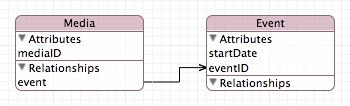
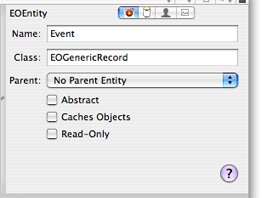
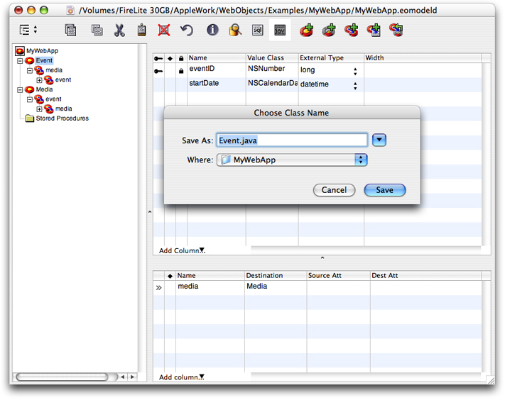

> 导航：[总目录](../../../README.md) · [documentation](../../../_indexes/documentation.md) · [WebObjects Web Applications Programming Guide](Introduction%20to%20WebObjects%20Web%20Applications%20Programming%20Guide.md)

[Next](Creating%20Web%20Components.md)[Previous](Creating%20Projects.md)

# Creating Enterprise Objects

If you want to populate your dynamic webpages with content from a back-end data store, the first task is to design your enterprise objects and create your object model. The enterprise objects encapsulate your business data and logic. They are the objects that persist beyond the lifetime of your application. They are also the objects that can be reused in other types of web and non-web applications.

However, before doing so, you should understand a few design patterns that are fundamental to how WebObjects works. Specifically, WebObjects relies on the Model-View-Controller design pattern, object modeling, and key-value coding. These concepts are fundamental to how enterprise objects, dynamic elements, and web components work.

After you understand these concepts, you can create your model and add your business logic. Optionally, create a framework containing your enterprise objects so that you can reuse them in multiple applications. If you are creating a Direct to Web or display group application, then you need to create your EO model first. Then read [Creating Projects](Creating%20Projects.md#apple-f4xwc4dqnrsv64tfmyxwi33df52wszbpkridimbqgaztenrzfvjvomy) for how to create a web application in Xcode.

Many Apple frameworks use a Model-View-Controller (MVC) design pattern including the Application Kit, Core Data, Sync Services, and WebObjects. MVC has been around since the early days of object-oriented programming and is a proven design pattern used to build robust, extensible, and maintainable applications. The design pattern has three components: a model, a view, and a controller.

_Models_ represent special knowledge and expertise. They hold an application’s data and define the logic that manipulates that data. A well-designed MVC application has all its important data encapsulated in model objects. Any data that is part of the persistent state of the application should reside in the model objects once the data is loaded into the application. In WebObjects, models are enterprise objects.

_Views_ know how to display and possibly edit data from the application’s model. A view should not be responsible for storing the data it displays. A view object can be in charge of displaying just one part of a model object, or a whole model object, or even many different model objects. Views come in many different varieties. In web applications, views are the HTML-based elements and components you use to construct your web component.

_Controllers_ act as the intermediary between the application’s view objects and its model objects. Typically controller objects have logic in them that is specific to an application. Controllers are often in charge of making sure the views have access to the model objects they need to display and often act as the conduit through which views learn about changes to models. In web applications, high-level controllers are the Session and Application objects. Other examples of controllers are the web component objects and display groups.

_Object modeling_ is a way of representing objects typically used to describe a data source's data structures in a way that allows those data structures to be mapped to objects in an object-oriented system. It is a representation that facilitates storage and retrieval of objects in a data source. A data source can be a database, a file, a web service, or any other persistent store. Because it is not dependent on any type of data source, it can also be used to represent any kind of object and its relationship to other objects. Object modeling is similar to _entity-relationship modeling_, a popular discipline with a set of rules and terms that are documented in database literature. This section defines _object modeling_ terms used throughout WebObjects APIs and tools.

In the MVC design pattern, models are the objects in your application that encapsulate specified data and provide methods that operate on that data. Models are usually persistent but more importantly, models are not dependent on how the data is displayed to the user.

In the object model, models are called _entities_, the components of an entity are called _attributes_, and the references to other models are called _relationships_. Together, attributes and relationships are known as _properties_. With these three simple building blocks (entities, attributes, and relationships), arbitrarily complex systems can be modeled.

_Attributes_ represent structures that contain data. An attribute of an object may be a simple value, such as a scalar—for example, `integer`, `float`, or `double`—but can also be a C structure or an instance of a primitive class. An attribute may correspond to a model’s instance variable or accessor method. For example, Employee has `firstName`, `lastName`, and `salary` instance variables.

Not all properties of a model are attributes—some properties are _relationships_ to other objects. Your application is typically modeled by multiple classes. At runtime, your object model is a collection of related objects that make up an _object graph_. These are typically the persistent objects that your users create and save to some data store. The relationships between these model objects can be traversed at runtime to access the properties of the related objects.

Every relationship has a _cardinality_; the cardinality tells you how many destination objects can (potentially) resolve the relationship. If the destination object is a single object, then the relationship is called a _to-one relationship_. If there may be more than one object in the destination, then the relationship is called a _to-many relationship_.

Relationships can be mandatory or optional. A _mandatory relationship_ is one where the destination is required—for example, every employee must be associated with a department. An _optional relationship_ is, as the name suggests, optional—for example, not every employee has direct reports.

A delete rule is used to specify ownership. You can specify that the destination of a relationship be deleted when the source object is deleted. For example, should an employee be deleted if its department is deleted? What delete rule you use is application-specific.

In order for models, views, and controllers to be independent of each other, you need to be able to access properties in a way that is independent of a model’s implementation. This is accomplished by using key-value coding.

You specify properties of a model using a simple _key_, often a string. The corresponding view or controller uses the key to look up the corresponding attribute _value_. The “value for an attribute” construction enforces the notion that the attribute itself doesn’t necessarily contain the data—the value can be indirectly obtained or derived.

_Key-value coding_ is used to perform this lookup—it is a mechanism for accessing an object’s properties indirectly and, in certain contexts, automatically. Key-value coding works by using the names of the object’s properties—typically its instance variables or accessor methods—as keys to access the values of those properties.

For example, you might obtain the name of a Department object using a `name` key. If the Department object either has an instance variable or method called `name`, then a value for the key can be returned. Similarly, you might obtain Employee attributes using the `firstName`, `lastName`, and `salary` keys.

All values for a particular attribute of a given entity are of the same data type. The data type of an attribute is specified in the declaration of its corresponding instance variable, the return value of its accessor method, or simply in the object model. For example, the data type of the Department object `name` attribute may be an String object in Java. Note that key-value coding returns only object values.

The value of a to-one relationship is simply the destination object of that relationship. For example, the value of the `department` property of an Employee object is a Department object.

The value of a to-many relationship is a collection object (an array) that contains the destination objects of that relationship. For example, the value of the `employees` property of Department object is a collection containing Employee objects.

A _key path_ is a string of dot-separated keys that specify a sequence of object properties to traverse. The property of the first key is determined by, and each subsequent key is evaluated relative to, the previous property. Key paths allow you to specify the properties of related objects in a way that is independent of the model implementation. Using key paths you can specify the path through an object graph, of arbitrary depth, to a specific attribute of a related object.

The key-value coding mechanism implements the lookup of a value given a key path similar to key-value pairs. For example, you might access the name of a department via an Employee object using the `department.name` key path where `department` is a relationship of Employee and `name` is an attribute of Department.

Not every relationship in a key path necessarily has a value. For example, the `manager` relationship can be `null` if the employee is the CEO. In this case, the key-value coding mechanism does not break—it simply stops traversing the path and returns an appropriate value, such as `null`.

Enterprise Objects is a suite of tools and frameworks that allow you to create applications that store your models, called _enterprise objects_, in a database. It is divided into several layers concerned with connecting to the database, converting result sets to enterprise-object instances, and ensuring that the state of the enterprise objects and the database are always synchronized. WebObjects adds many more classes used to manipulate enterprise objects and display their data.

The _enterprise object (EO) model_ is a folder added to your Xcode project that defines the mapping between your entities and the tables in the database. It also defines relationships between entities, which are reflected in the database tables using primary and foreign keys.

The EO model maps attributes to table columns for each entity. It also maps Java to database data types. For example, an EO model specifies whether an attribute value of type Number (`java.lang`) is mapped to `int` when an enterprise object is stored in a database.

The EO model contains many more specifications for how enterprise objects are added, stored, fetched, and deleted. The EO model can also specify the information needed to connect to the database, including network and password information.

If you do not have an existing EO model or database, you need to design your enterprise objects per your application requirements. You should do some object-oriented analysis and design before creating your first model. Fortunately, WebObjects supports an iterative development cycle so your model can evolve with your application.

You can create your object model using either EOModeler or the EO Model design tool in Xcode. Whatever tool you choose, the steps to create your EO model are similar:

1. Create your model file using the tool.
2. Add entities that represent your objects.
3. Add attributes to each entity.
4. Add primary keys to each entity.
5. Add relationships to each entity.
6. Optionally, add fetch specifications and sort orderings to your entities.
7. Verify your model.
8. Generate your schema.

Figure 1 shows an example of an EO model in the graphical view of the EO Model Xcode design tool. In the example, the Media entity has a to-one relationship to the Event entity and the Event entity has a `startDate` attribute.

__Figure 1__  Example EO model

If you have an existing database that has a JDBC or other SQL-based interface, you can use EOModeler to create your model directly from the database schema—essentially reverse-engineer your EO model from a legacy database. Read _[EOModeler User Guide](../EOModeler%20User%20Guide/Introduction%20to%20EOModeler%20User%20Guide.md#apple-f4xwc4dqnrsv64tfmyxwi33df52wszbpkridgmbqgaytamjy)_ for specific steps on how to use EOModeler, and read _Xcode 2.2 User Guide_ for how to create a model using Xcode. Read _[WebObjects Enterprise Objects Programming Guide](../WebObjects%20Enterprise%20Objects%20Programming%20Guide.md#apple-f4xwc4dqnrsv64tfmyxwi33df52wszbpkridgmbqgaytamjr)_ for a deeper understanding of how Enterprise Objects works. Refer to _WebObjects 5.3 Reference_ for API details.

Once you create your EO model, you can add business logic to your enterprise objects. All enterprise objects inherit from a root class that provides common behavior such as support for key-value coding and introspection. You create a subclass of this class to add business logic but need to follow some guidelines so you don't lose enterprise object behavior.

By default, the instances of entities you create are instances of EOGenericRecord. When you create an entity, the entity's class is set to EOGenericRecord as shown in Figure 2. Some entities never have a specific class. For example, PlotSummary, Review, Movie, and Director in `Movies.eomodeld` are all EOGenericRecord classes.

__Figure 2__  Creating a new entity

Instances of EOGenericRecord are generic containers—they have attributes and relationships defined by their entity in the EO model but have no special methods that process those properties. Instances of EOGenericRecord and its subclasses simply represent database rows or records. EOGenericRecord is suitable for many entities and saves you time in implementing Java classes with key-value coding compliant methods.

However, if you want to add some business logic or implement derived properties, you need to create a corresponding Java class for your entity. _Derived properties_ are properties that are computed at runtime from the values of other properties or the state of your application. For example, you can create a derived property called `fullName` that is a concatenation of `firstName` and `lastName`. To do this, you create a custom enterprise-object class as a subclass of EOGenericRecord, so it inherits the default enterprise-object behavior. Then you add a `fullName` accessor method to the class.

EOGenericRecord uses the key-value coding mechanism to store entity properties. Each key is named for the database column it represents. When an enterprise object is instantiated from a row in the database, the values of its keys are obtained from their corresponding columns in the row. WebObjects dynamic elements use key-value coding to get and set the values of enterprise-object attributes.

EOModeler provides an easy way to create a custom enterprise object, a Java class for your entity. Just select the entity in EOModeler, enter a class name in the inspector window, and click the jav button. The Java source files is added to your Xcode project as shown in Figure 3.

__Figure 3__  Generating Java source code

The class created by EOModeler is a subclass of EOGenericRecord. The subclass has no instance variables although properties may be defined in EOModeler. Instead, property values are accessed using key-value coding methods: `valueForKey()` and `takeValueForKey()`. By using these key-value coding methods to modify properties of a custom enterprise object, you ensure that your changes are stored in the database and all controller objects are notified of changes.

See _WebObjects 5.3 Reference_ for the order in which NSKeyValueCoding searches for an accessor method. Read _[EOModeler User Guide](../EOModeler%20User%20Guide/Introduction%20to%20EOModeler%20User%20Guide.md#apple-f4xwc4dqnrsv64tfmyxwi33df52wszbpkridgmbqgaytamjy)_ for complete instructions on how to use EOModeler to generate Java code.

You might create a framework using Xcode to contain your EO model and any custom enterprise object classes. You especially need to do this if you plan to reuse your enterprise objects in multiple applications. You can use the same EO model and business logic to implement any other type of WebObjects applications—for example, Direct to Web, Direct to Java Client, and Direct to Web Services. You can use these prototypes to evaluate different approaches or simply to verify and test your enterprise objects. It is not uncommon to maintain two WebObjects applications in parallel. Read [Creating Projects](Creating%20Projects.md#apple-f4xwc4dqnrsv64tfmyxwi33df52wszbpkridimbqgaztenrzfvjvomy) for how to create a WebObjects framework.

[Next](Creating%20Web%20Components.md)[Previous](Creating%20Projects.md)

